# Simulation results

Generated by `python -m sim.scenarios --all`. Every table here also exists as a CSV in `docs/results/` and every figure as a PNG in `docs/figures/`.

Scenarios in this file: Sim 4, Sim 1, Sim 2, Sim 3, Sim 5, Sim 6, Sim 7, Sim 8, Sim 9, Sim 10. Scale `full`. Total runtime 43.2 s.

## Deploy configuration

This report re-runs every scenario on the MID deploy configuration, a
body-heavier variant of the ladder configuration recorded in
`docs/sim-results-ladder-full.md` (itself the ladder deploy configuration
locked in `docs/DEPLOY_CONSTANTS.md` at the time). Generated by
`python -m sim.scenarios --all --curve mid --h 0.15 --hop-bps 7.5 --final`.

| Constant | Value |
|---|---|
| Standard/reference curve | `curves.MID`: 20%/25%/35%/20% of supply over FDV ratios [1e-3, 1e-2, 1e-1, 1, 100] x parent supply P (applied to every round-based scenario's curve and to the equal-ETH-depth reference chains in Sims 3, 7, 9; Sim 8's explicit WALL-vs-SINGLE comparison is unaffected by design) |
| Trading window | 900 s (`RoundConfig.trading_s` default; 15-minute trading window, up from 600 s) |
| Threshold H0 | 0.15% of parent supply (`--h 0.15`), average absorption over the 900 s window; floor 0.25 x H0; decay x0.9 per consecutive failed round |
| Reset on win | True (`--reset-on-win`, default) - H snaps back to H0 on a win, in both the real `RoundConfig` and Sim 2's reduced form |
| Hop fee `f_hop` | 7.5 bps (`--hop-bps 7.5`), parent side, every family swap - unchanged from the existing deploy constant |
| Everything else | unchanged from `docs/DEPLOY_CONSTANTS.md` / `docs/sim-results.md` (protocol fee 1%, fee split 20/40/20/20, snipe tax, tick spacing 60) |

## Changes vs baseline

Headline number per scenario across three curve configurations: the original
SINGLE-curve baseline (`docs/sim-results.md`), the LADDER deploy config
(`docs/sim-results-ladder-full.md`, 10%/15%/35%/40%), and this MID deploy
config (20%/25%/35%/20%). Sims 8 and 10 build their chains from an explicit
curve shape or from pure arithmetic respectively, so the curve/h/hop overrides
do not reach them and their numbers are unchanged across all three columns
(shown for completeness). The MID column here is computed at the 900 s
trading window (`RoundConfig.trading_s` default); the SINGLE and LADDER
columns are unchanged 600 s-window figures carried over from their own
reports.

| Sim | Headline number | SINGLE baseline | LADDER | MID |
|---|---|---|---|---|
| 1 | median winner float sold at round end | 98.7% | 42.3% | 60.2% |
| 1 | median winner avg-absorption / threshold | 2.9x | 9.2x | 9.0x |
| 2 | P(reach #20 with no failed round), thin demand (x0.20) | 0% | 4% | 6% |
| 2 | mean rounds to reach #20, thin demand (x0.20) | 30.2 | 23.3 | 23.1 |
| 3 | full-line slippage on a $5k buy after #6 is 99%-dumped | 14.0% | 83.7% | 57.7% |
| 4 | P(capture) at >=2x capital, cost as % of capital | 100% / 0.15% | 100% / 0.15% (unchanged) | 100% / 0.15% (unchanged) |
| 5 | winner's share of total score, N=5 -> N=50 | 26.1% -> 5.5% | 26.2% -> 5.5% (unchanged) | 25.6% -> 5.4% |
| 6 | mean rounds to reach #20 at 1%/1% fees (epsilon=1.0) | 20.9 | 21.0 (unchanged) | 21.0 (unchanged) |
| 7 | effective loss on a 0.5%-of-FDV buy, 100-link full line | 44.7% | 54.8% | 67.2% |
| 8 | WALL cascade acceleration ratio at the cliff | 8.24x | 8.24x (unaffected - explicit curve shapes) | 8.24x (unaffected - explicit curve shapes) |
| 9 | SINGLE_SIDED_BID drawdown after a 50%-of-float shock | 28.4% | 84.9% | 74.6% |
| 10 | genesis share of ancestor sleeve at M=1000 | 0.240% | 0.240% (unaffected - pure arithmetic) | 0.240% (unaffected - pure arithmetic) |

No scenario's stated verdict word (VERIFIED / FALSIFIED / REVERSED) flips
under the MID deploy config relative to either the SINGLE baseline or LADDER.
MID sits between the two curves on every magnitude that moved under LADDER,
which is exactly what trimming the top-decade tail from 40% to 20% (while
adding it to the three body bands) predicts: Sim 3's post-collapse full-line
slippage eases from LADDER's 83.7% back to 57.7% (still far above baseline's
14.0%), Sim 7's deep-route price impact rises further to 67.2% (worse than
both SINGLE and LADDER - MID's cheaper body means a fixed 0.5%-of-FDV trade
crosses more supply, not less), and Sim 9's post-shock drawdown for the best
reinforcement policy improves from LADDER's 84.9% to 74.6%. Sim 1 is the
scenario the change targets and it moves the "wrong" way at first glance: the
median winner now finishes a round with 60.2% of supply sold, up from
LADDER's 42.3% (baseline's 98.7% was full exhaustion). This is not curve
exhaustion returning - MID's extra body sits at *lower* FDV than LADDER's, so
reaching the same 9.0x-of-threshold average absorption in parent-token terms
requires selling more tokens at those cheaper prices, not more parent value.
The net trade MID makes is a body thick enough to avoid the exhaustion Sim 1
originally flagged, at the cost of a bit more price impact on deep single
trades (Sim 7) than LADDER already had - the tail trim moves capacity from
"can absorb a single 100x buyer with fewer hops" to "the median winner has
more room before running out of supply." The 900 s trading window (up from
600 s) does not change any of these comparisons qualitatively: it widens the
tail-extension denominator in the average-absorption score, which is why the
MID figures above sit a shade below their 600 s-window counterparts (60.7% ->
60.2% float sold, 9.3x -> 9.0x avg-absorption/threshold, 26.2% -> 25.6% and
5.5% -> 5.4% winner score share) without moving any verdict.

## Common assumptions
| assumption | value |
|---|---|
| RNG seed | 20260910 (each scenario uses `Random(SEED + n)`, so `--only n` reproduces `--all`) |
| parent supply, every link | 1e+09 tokens |
| standard curve | `curves.self_similar(P)` default: 99.1% of supply over FDV `a0*P` -> `1e3*a0*P`, 0.9% tail to `1e6*a0*P`, `a0 = 1e-3` |
| hop fee `f_hop` | 7.5 bps, parent side, every family swap |
| protocol fee | 1% on the ETH side of the genesis pool only |
| developer | 20% of the protocol fee |
| creator | 40% baseline (swept in Sim 6) |
| flywheel remainder | 40%, split 50%/50% ancestor sleeve / immediate-parent reinforcement (swept in Sim 6) |
| round | 180 s registration, 900 s trading, 3 s snipe tax (99% -> 1%), 300 s submission |
| threshold | `h = 0.50%` of parent supply as an *average* absorption, decay x0.9 per failed round, floor 25% |
| demand model | per-candidate "interest" is lognormal (sigma = 0.6); interest 1.0 absorbs A_BASE = 13,000,000 parent tokens over the window |
| USD | genesis FDV = $250,000 at 62.5 ETH, i.e. $4,000/ETH and $2.50e-04 per genesis token |
| ETH-edge volume | $250,000 per round where a scenario needs an exogenous figure |

Everything on the trust path is **parent-denominated**: scores, thresholds, absorption
and embedded liquidity are quoted in parent tokens (written "parent" below).  Only the
ETH edge and the fee ledger are quoted in ETH/USD.

## Contents

- [Sim 4 - Adversarial succession: what a slot actually costs](#sim-4)
- [Sim 1 - Lifecycle: GENESIS to #20, 5 candidates per round](#sim-1)
- [Sim 2 - Stochastic chains: 200 Monte Carlo runs per demand regime](#sim-2)
- [Sim 3 - Bad-link collapse at #6 on a 12-link chain](#sim-3)
- [Sim 5 - Candidate war: N candidates sharing one pot of interest](#sim-5)
- [Sim 6 - Fee equilibrium: split sweep and the sell-tax question](#sim-6)
- [Sim 7 - Route depth: 10 / 20 / 50 / 100 links](#sim-7)
- [Sim 8 - Sell cascades from #10: WALL vs SINGLE-like](#sim-8)
- [Sim 9 - Reinforcement vs burn over 20 rounds, then a 50% shock](#sim-9)
- [Sim 10 - Genesis economics: is the U-shape a genesis tax funnel?](#sim-10)

## Sim 4 - Adversarial succession: what a slot actually costs

**Claim under test:** slot capture costs ~= fees  
**Runtime:** 26.2 s

### honest baseline

| curve | honest_leader_avg_absorption_parent | honest_leader_avg_usd | rounds |
|---|---|---|---|
| SINGLE_LIKE | 6.440e+06 | 1,610 | 20 |
| WALL_LIKE | 6.136e+06 | 1,534 | 20 |
| GENTLE_LIKE | 6.406e+06 | 1,601 | 20 |
| OVERRIDE | 6.559e+06 | 1,640 | 20 |

CSV: `docs/results/sim04_honest_baseline_final.csv`

### capture raw

| curve | strategy | capital_multiple | capital_parent | capital_usd | trial | attacker_avg | best_honest_avg | is_top | snipe_fees | hop_fees | protocol_fees | price_impact_loss | round_trip_loss | mark_to_market | capital_deployed | cost_parent | cost_usd | cost_pct_of_capital | fee_share_of_cost | win_h0.0025 | win_h0.005 | win_h0.01 | win_h0.0015 |
|---|---|---|---|---|---|---|---|---|---|---|---|---|---|---|---|---|---|---|---|---|---|---|---|
| SINGLE_LIKE | self_fund_win | 0.5 | 3.220e+06 | 805 | 0 | 3.207e+06 | 6.467e+06 | no | 0 | 4,828 | 0 | -1.555e-10 | 4,828 | 0 | 3.220e+06 | 4,828 | 1.207 | 0.001499 | 1 | no | no | no | no |
| SINGLE_LIKE | self_fund_win | 0.5 | 3.220e+06 | 805 | 1 | 3.207e+06 | 6.158e+06 | no | 0 | 4,828 | 0 | -1.555e-10 | 4,828 | 0 | 3.220e+06 | 4,828 | 1.207 | 0.001499 | 1 | no | no | no | no |
| SINGLE_LIKE | self_fund_win | 0.5 | 3.220e+06 | 805 | 2 | 3.207e+06 | 6.062e+06 | no | 0 | 4,828 | 0 | -1.555e-10 | 4,828 | 0 | 3.220e+06 | 4,828 | 1.207 | 0.001499 | 1 | no | no | no | no |
| SINGLE_LIKE | self_fund_win | 0.5 | 3.220e+06 | 805 | 3 | 3.207e+06 | 6.306e+06 | no | 0 | 4,828 | 0 | -1.555e-10 | 4,828 | 0 | 3.220e+06 | 4,828 | 1.207 | 0.001499 | 1 | no | no | no | no |
| SINGLE_LIKE | self_fund_win | 0.5 | 3.220e+06 | 805 | 4 | 3.207e+06 | 6.243e+06 | no | 0 | 4,828 | 0 | -1.555e-10 | 4,828 | 0 | 3.220e+06 | 4,828 | 1.207 | 0.001499 | 1 | no | no | no | no |
| SINGLE_LIKE | self_fund_win | 0.5 | 3.220e+06 | 805 | 5 | 3.207e+06 | 7.810e+06 | no | 0 | 4,828 | 0 | -1.555e-10 | 4,828 | 0 | 3.220e+06 | 4,828 | 1.207 | 0.001499 | 1 | no | no | no | no |
| SINGLE_LIKE | self_fund_win | 0.5 | 3.220e+06 | 805 | 6 | 3.207e+06 | 6.529e+06 | no | 0 | 4,828 | 0 | -1.555e-10 | 4,828 | 0 | 3.220e+06 | 4,828 | 1.207 | 0.001499 | 1 | no | no | no | no |
| SINGLE_LIKE | self_fund_win | 0.5 | 3.220e+06 | 805 | 7 | 3.207e+06 | 6.904e+06 | no | 0 | 4,828 | 0 | -1.555e-10 | 4,828 | 0 | 3.220e+06 | 4,828 | 1.207 | 0.001499 | 1 | no | no | no | no |
| SINGLE_LIKE | self_fund_win | 0.5 | 3.220e+06 | 805 | 8 | 3.207e+06 | 6.133e+06 | no | 0 | 4,828 | 0 | -1.555e-10 | 4,828 | 0 | 3.220e+06 | 4,828 | 1.207 | 0.001499 | 1 | no | no | no | no |
| SINGLE_LIKE | self_fund_win | 0.5 | 3.220e+06 | 805 | 9 | 3.207e+06 | 6.740e+06 | no | 0 | 4,828 | 0 | -1.555e-10 | 4,828 | 0 | 3.220e+06 | 4,828 | 1.207 | 0.001499 | 1 | no | no | no | no |
| SINGLE_LIKE | self_fund_win | 0.5 | 3.220e+06 | 805 | 10 | 3.207e+06 | 6.839e+06 | no | 0 | 4,828 | 0 | -1.555e-10 | 4,828 | 0 | 3.220e+06 | 4,828 | 1.207 | 0.001499 | 1 | no | no | no | no |
| SINGLE_LIKE | self_fund_win | 0.5 | 3.220e+06 | 805 | 11 | 3.207e+06 | 6.288e+06 | no | 0 | 4,828 | 0 | -1.555e-10 | 4,828 | 0 | 3.220e+06 | 4,828 | 1.207 | 0.001499 | 1 | no | no | no | no |
| SINGLE_LIKE | self_fund_win | 0.5 | 3.220e+06 | 805 | 12 | 3.207e+06 | 6.361e+06 | no | 0 | 4,828 | 0 | -1.555e-10 | 4,828 | 0 | 3.220e+06 | 4,828 | 1.207 | 0.001499 | 1 | no | no | no | no |
| SINGLE_LIKE | self_fund_win | 0.5 | 3.220e+06 | 805 | 13 | 3.207e+06 | 6.231e+06 | no | 0 | 4,828 | 0 | -1.555e-10 | 4,828 | 0 | 3.220e+06 | 4,828 | 1.207 | 0.001499 | 1 | no | no | no | no |
| SINGLE_LIKE | self_fund_win | 0.5 | 3.220e+06 | 805 | 14 | 3.207e+06 | 6.701e+06 | no | 0 | 4,828 | 0 | -1.555e-10 | 4,828 | 0 | 3.220e+06 | 4,828 | 1.207 | 0.001499 | 1 | no | no | no | no |
| SINGLE_LIKE | self_fund_win | 0.5 | 3.220e+06 | 805 | 15 | 3.207e+06 | 5.699e+06 | no | 0 | 4,828 | 0 | -1.555e-10 | 4,828 | 0 | 3.220e+06 | 4,828 | 1.207 | 0.001499 | 1 | no | no | no | no |
| SINGLE_LIKE | self_fund_win | 0.5 | 3.220e+06 | 805 | 16 | 3.207e+06 | 7.417e+06 | no | 0 | 4,828 | 0 | -1.555e-10 | 4,828 | 0 | 3.220e+06 | 4,828 | 1.207 | 0.001499 | 1 | no | no | no | no |
| SINGLE_LIKE | self_fund_win | 0.5 | 3.220e+06 | 805 | 17 | 3.207e+06 | 7.096e+06 | no | 0 | 4,828 | 0 | -1.555e-10 | 4,828 | 0 | 3.220e+06 | 4,828 | 1.207 | 0.001499 | 1 | no | no | no | no |
| SINGLE_LIKE | self_fund_win | 0.5 | 3.220e+06 | 805 | 18 | 3.207e+06 | 6.940e+06 | no | 0 | 4,828 | 0 | -1.555e-10 | 4,828 | 0 | 3.220e+06 | 4,828 | 1.207 | 0.001499 | 1 | no | no | no | no |
| SINGLE_LIKE | self_fund_win | 0.5 | 3.220e+06 | 805 | 19 | 3.207e+06 | 6.501e+06 | no | 0 | 4,828 | 0 | -1.555e-10 | 4,828 | 0 | 3.220e+06 | 4,828 | 1.207 | 0.001499 | 1 | no | no | no | no |
| SINGLE_LIKE | self_fund_win | 0.5 | 3.220e+06 | 805 | 20 | 3.207e+06 | 7.018e+06 | no | 0 | 4,828 | 0 | -1.555e-10 | 4,828 | 0 | 3.220e+06 | 4,828 | 1.207 | 0.001499 | 1 | no | no | no | no |
| SINGLE_LIKE | self_fund_win | 0.5 | 3.220e+06 | 805 | 21 | 3.207e+06 | 6.162e+06 | no | 0 | 4,828 | 0 | -1.555e-10 | 4,828 | 0 | 3.220e+06 | 4,828 | 1.207 | 0.001499 | 1 | no | no | no | no |
| SINGLE_LIKE | self_fund_win | 0.5 | 3.220e+06 | 805 | 22 | 3.207e+06 | 5.548e+06 | no | 0 | 4,828 | 0 | -1.555e-10 | 4,828 | 0 | 3.220e+06 | 4,828 | 1.207 | 0.001499 | 1 | no | no | no | no |
| SINGLE_LIKE | self_fund_win | 0.5 | 3.220e+06 | 805 | 23 | 3.207e+06 | 4.919e+06 | no | 0 | 4,828 | 0 | -1.555e-10 | 4,828 | 0 | 3.220e+06 | 4,828 | 1.207 | 0.001499 | 1 | no | no | no | no |
| SINGLE_LIKE | self_fund_win | 0.5 | 3.220e+06 | 805 | 24 | 3.207e+06 | 7.020e+06 | no | 0 | 4,828 | 0 | -1.555e-10 | 4,828 | 0 | 3.220e+06 | 4,828 | 1.207 | 0.001499 | 1 | no | no | no | no |
| SINGLE_LIKE | self_fund_win | 0.5 | 3.220e+06 | 805 | 25 | 3.207e+06 | 5.422e+06 | no | 0 | 4,828 | 0 | -1.555e-10 | 4,828 | 0 | 3.220e+06 | 4,828 | 1.207 | 0.001499 | 1 | no | no | no | no |
| SINGLE_LIKE | self_fund_win | 0.5 | 3.220e+06 | 805 | 26 | 3.207e+06 | 6.645e+06 | no | 0 | 4,828 | 0 | -1.555e-10 | 4,828 | 0 | 3.220e+06 | 4,828 | 1.207 | 0.001499 | 1 | no | no | no | no |
| SINGLE_LIKE | self_fund_win | 0.5 | 3.220e+06 | 805 | 27 | 3.207e+06 | 5.889e+06 | no | 0 | 4,828 | 0 | -1.555e-10 | 4,828 | 0 | 3.220e+06 | 4,828 | 1.207 | 0.001499 | 1 | no | no | no | no |
| SINGLE_LIKE | self_fund_win | 0.5 | 3.220e+06 | 805 | 28 | 3.207e+06 | 6.953e+06 | no | 0 | 4,828 | 0 | -1.555e-10 | 4,828 | 0 | 3.220e+06 | 4,828 | 1.207 | 0.001499 | 1 | no | no | no | no |
| SINGLE_LIKE | self_fund_win | 0.5 | 3.220e+06 | 805 | 29 | 3.207e+06 | 6.091e+06 | no | 0 | 4,828 | 0 | -1.555e-10 | 4,828 | 0 | 3.220e+06 | 4,828 | 1.207 | 0.001499 | 1 | no | no | no | no |
| SINGLE_LIKE | self_fund_win | 0.5 | 3.220e+06 | 805 | 30 | 3.207e+06 | 6.256e+06 | no | 0 | 4,828 | 0 | -1.555e-10 | 4,828 | 0 | 3.220e+06 | 4,828 | 1.207 | 0.001499 | 1 | no | no | no | no |
| SINGLE_LIKE | self_fund_win | 0.5 | 3.220e+06 | 805 | 31 | 3.207e+06 | 6.434e+06 | no | 0 | 4,828 | 0 | -1.555e-10 | 4,828 | 0 | 3.220e+06 | 4,828 | 1.207 | 0.001499 | 1 | no | no | no | no |
| SINGLE_LIKE | self_fund_win | 0.5 | 3.220e+06 | 805 | 32 | 3.207e+06 | 6.857e+06 | no | 0 | 4,828 | 0 | -1.555e-10 | 4,828 | 0 | 3.220e+06 | 4,828 | 1.207 | 0.001499 | 1 | no | no | no | no |
| SINGLE_LIKE | self_fund_win | 0.5 | 3.220e+06 | 805 | 33 | 3.207e+06 | 5.528e+06 | no | 0 | 4,828 | 0 | -1.555e-10 | 4,828 | 0 | 3.220e+06 | 4,828 | 1.207 | 0.001499 | 1 | no | no | no | no |
| SINGLE_LIKE | self_fund_win | 0.5 | 3.220e+06 | 805 | 34 | 3.207e+06 | 6.540e+06 | no | 0 | 4,828 | 0 | -1.555e-10 | 4,828 | 0 | 3.220e+06 | 4,828 | 1.207 | 0.001499 | 1 | no | no | no | no |
| SINGLE_LIKE | self_fund_win | 0.5 | 3.220e+06 | 805 | 35 | 3.207e+06 | 6.455e+06 | no | 0 | 4,828 | 0 | -1.555e-10 | 4,828 | 0 | 3.220e+06 | 4,828 | 1.207 | 0.001499 | 1 | no | no | no | no |
| SINGLE_LIKE | self_fund_win | 0.5 | 3.220e+06 | 805 | 36 | 3.207e+06 | 6.591e+06 | no | 0 | 4,828 | 0 | -1.555e-10 | 4,828 | 0 | 3.220e+06 | 4,828 | 1.207 | 0.001499 | 1 | no | no | no | no |
| SINGLE_LIKE | self_fund_win | 0.5 | 3.220e+06 | 805 | 37 | 3.207e+06 | 7.107e+06 | no | 0 | 4,828 | 0 | -1.555e-10 | 4,828 | 0 | 3.220e+06 | 4,828 | 1.207 | 0.001499 | 1 | no | no | no | no |
| SINGLE_LIKE | self_fund_win | 0.5 | 3.220e+06 | 805 | 38 | 3.207e+06 | 6.547e+06 | no | 0 | 4,828 | 0 | -1.555e-10 | 4,828 | 0 | 3.220e+06 | 4,828 | 1.207 | 0.001499 | 1 | no | no | no | no |
| SINGLE_LIKE | self_fund_win | 0.5 | 3.220e+06 | 805 | 39 | 3.207e+06 | 6.826e+06 | no | 0 | 4,828 | 0 | -1.555e-10 | 4,828 | 0 | 3.220e+06 | 4,828 | 1.207 | 0.001499 | 1 | no | no | no | no |
| SINGLE_LIKE | self_fund_win | 1 | 6.440e+06 | 1,610 | 0 | 6.413e+06 | 6.020e+06 | yes | 0 | 9,656 | 0 | -3.110e-10 | 9,656 | 0 | 6.440e+06 | 9,656 | 2.414 | 0.001499 | 1 | yes | yes | no | yes |
| SINGLE_LIKE | self_fund_win | 1 | 6.440e+06 | 1,610 | 1 | 6.413e+06 | 6.765e+06 | no | 0 | 9,656 | 0 | -3.110e-10 | 9,656 | 0 | 6.440e+06 | 9,656 | 2.414 | 0.001499 | 1 | no | no | no | no |
| SINGLE_LIKE | self_fund_win | 1 | 6.440e+06 | 1,610 | 2 | 6.413e+06 | 6.576e+06 | no | 0 | 9,656 | 0 | -3.110e-10 | 9,656 | 0 | 6.440e+06 | 9,656 | 2.414 | 0.001499 | 1 | no | no | no | no |
| SINGLE_LIKE | self_fund_win | 1 | 6.440e+06 | 1,610 | 3 | 6.413e+06 | 6.726e+06 | no | 0 | 9,656 | 0 | -3.110e-10 | 9,656 | 0 | 6.440e+06 | 9,656 | 2.414 | 0.001499 | 1 | no | no | no | no |
| SINGLE_LIKE | self_fund_win | 1 | 6.440e+06 | 1,610 | 4 | 6.413e+06 | 6.519e+06 | no | 0 | 9,656 | 0 | -3.110e-10 | 9,656 | 0 | 6.440e+06 | 9,656 | 2.414 | 0.001499 | 1 | no | no | no | no |
| SINGLE_LIKE | self_fund_win | 1 | 6.440e+06 | 1,610 | 5 | 6.413e+06 | 6.261e+06 | yes | 0 | 9,656 | 0 | -3.110e-10 | 9,656 | 0 | 6.440e+06 | 9,656 | 2.414 | 0.001499 | 1 | yes | yes | no | yes |
| SINGLE_LIKE | self_fund_win | 1 | 6.440e+06 | 1,610 | 6 | 6.413e+06 | 5.924e+06 | yes | 0 | 9,656 | 0 | -3.110e-10 | 9,656 | 0 | 6.440e+06 | 9,656 | 2.414 | 0.001499 | 1 | yes | yes | no | yes |
| SINGLE_LIKE | self_fund_win | 1 | 6.440e+06 | 1,610 | 7 | 6.413e+06 | 5.396e+06 | yes | 0 | 9,656 | 0 | -3.110e-10 | 9,656 | 0 | 6.440e+06 | 9,656 | 2.414 | 0.001499 | 1 | yes | yes | no | yes |
| SINGLE_LIKE | self_fund_win | 1 | 6.440e+06 | 1,610 | 8 | 6.413e+06 | 5.973e+06 | yes | 0 | 9,656 | 0 | -3.110e-10 | 9,656 | 0 | 6.440e+06 | 9,656 | 2.414 | 0.001499 | 1 | yes | yes | no | yes |
| SINGLE_LIKE | self_fund_win | 1 | 6.440e+06 | 1,610 | 9 | 6.413e+06 | 6.247e+06 | yes | 0 | 9,656 | 0 | -3.110e-10 | 9,656 | 0 | 6.440e+06 | 9,656 | 2.414 | 0.001499 | 1 | yes | yes | no | yes |
| SINGLE_LIKE | self_fund_win | 1 | 6.440e+06 | 1,610 | 10 | 6.413e+06 | 6.800e+06 | no | 0 | 9,656 | 0 | -3.110e-10 | 9,656 | 0 | 6.440e+06 | 9,656 | 2.414 | 0.001499 | 1 | no | no | no | no |
| SINGLE_LIKE | self_fund_win | 1 | 6.440e+06 | 1,610 | 11 | 6.413e+06 | 7.346e+06 | no | 0 | 9,656 | 0 | -3.110e-10 | 9,656 | 0 | 6.440e+06 | 9,656 | 2.414 | 0.001499 | 1 | no | no | no | no |
| SINGLE_LIKE | self_fund_win | 1 | 6.440e+06 | 1,610 | 12 | 6.413e+06 | 6.137e+06 | yes | 0 | 9,656 | 0 | -3.110e-10 | 9,656 | 0 | 6.440e+06 | 9,656 | 2.414 | 0.001499 | 1 | yes | yes | no | yes |
| SINGLE_LIKE | self_fund_win | 1 | 6.440e+06 | 1,610 | 13 | 6.413e+06 | 7.209e+06 | no | 0 | 9,656 | 0 | -3.110e-10 | 9,656 | 0 | 6.440e+06 | 9,656 | 2.414 | 0.001499 | 1 | no | no | no | no |
| SINGLE_LIKE | self_fund_win | 1 | 6.440e+06 | 1,610 | 14 | 6.413e+06 | 5.975e+06 | yes | 0 | 9,656 | 0 | -3.110e-10 | 9,656 | 0 | 6.440e+06 | 9,656 | 2.414 | 0.001499 | 1 | yes | yes | no | yes |
| SINGLE_LIKE | self_fund_win | 1 | 6.440e+06 | 1,610 | 15 | 6.413e+06 | 7.480e+06 | no | 0 | 9,656 | 0 | -3.110e-10 | 9,656 | 0 | 6.440e+06 | 9,656 | 2.414 | 0.001499 | 1 | no | no | no | no |
| SINGLE_LIKE | self_fund_win | 1 | 6.440e+06 | 1,610 | 16 | 6.413e+06 | 6.183e+06 | yes | 0 | 9,656 | 0 | -3.110e-10 | 9,656 | 0 | 6.440e+06 | 9,656 | 2.414 | 0.001499 | 1 | yes | yes | no | yes |
| SINGLE_LIKE | self_fund_win | 1 | 6.440e+06 | 1,610 | 17 | 6.413e+06 | 6.775e+06 | no | 0 | 9,656 | 0 | -3.110e-10 | 9,656 | 0 | 6.440e+06 | 9,656 | 2.414 | 0.001499 | 1 | no | no | no | no |
| SINGLE_LIKE | self_fund_win | 1 | 6.440e+06 | 1,610 | 18 | 6.413e+06 | 5.803e+06 | yes | 0 | 9,656 | 0 | -3.110e-10 | 9,656 | 0 | 6.440e+06 | 9,656 | 2.414 | 0.001499 | 1 | yes | yes | no | yes |
| SINGLE_LIKE | self_fund_win | 1 | 6.440e+06 | 1,610 | 19 | 6.413e+06 | 6.894e+06 | no | 0 | 9,656 | 0 | -3.110e-10 | 9,656 | 0 | 6.440e+06 | 9,656 | 2.414 | 0.001499 | 1 | no | no | no | no |
| SINGLE_LIKE | self_fund_win | 1 | 6.440e+06 | 1,610 | 20 | 6.413e+06 | 6.080e+06 | yes | 0 | 9,656 | 0 | -3.110e-10 | 9,656 | 0 | 6.440e+06 | 9,656 | 2.414 | 0.001499 | 1 | yes | yes | no | yes |
| SINGLE_LIKE | self_fund_win | 1 | 6.440e+06 | 1,610 | 21 | 6.413e+06 | 5.667e+06 | yes | 0 | 9,656 | 0 | -3.110e-10 | 9,656 | 0 | 6.440e+06 | 9,656 | 2.414 | 0.001499 | 1 | yes | yes | no | yes |
| SINGLE_LIKE | self_fund_win | 1 | 6.440e+06 | 1,610 | 22 | 6.413e+06 | 7.275e+06 | no | 0 | 9,656 | 0 | -3.110e-10 | 9,656 | 0 | 6.440e+06 | 9,656 | 2.414 | 0.001499 | 1 | no | no | no | no |
| SINGLE_LIKE | self_fund_win | 1 | 6.440e+06 | 1,610 | 23 | 6.413e+06 | 5.981e+06 | yes | 0 | 9,656 | 0 | -3.110e-10 | 9,656 | 0 | 6.440e+06 | 9,656 | 2.414 | 0.001499 | 1 | yes | yes | no | yes |
| SINGLE_LIKE | self_fund_win | 1 | 6.440e+06 | 1,610 | 24 | 6.413e+06 | 6.226e+06 | yes | 0 | 9,656 | 0 | -3.110e-10 | 9,656 | 0 | 6.440e+06 | 9,656 | 2.414 | 0.001499 | 1 | yes | yes | no | yes |
| SINGLE_LIKE | self_fund_win | 1 | 6.440e+06 | 1,610 | 25 | 6.413e+06 | 6.328e+06 | yes | 0 | 9,656 | 0 | -3.110e-10 | 9,656 | 0 | 6.440e+06 | 9,656 | 2.414 | 0.001499 | 1 | yes | yes | no | yes |
| SINGLE_LIKE | self_fund_win | 1 | 6.440e+06 | 1,610 | 26 | 6.413e+06 | 6.512e+06 | no | 0 | 9,656 | 0 | -3.110e-10 | 9,656 | 0 | 6.440e+06 | 9,656 | 2.414 | 0.001499 | 1 | no | no | no | no |
| SINGLE_LIKE | self_fund_win | 1 | 6.440e+06 | 1,610 | 27 | 6.413e+06 | 7.357e+06 | no | 0 | 9,656 | 0 | -3.110e-10 | 9,656 | 0 | 6.440e+06 | 9,656 | 2.414 | 0.001499 | 1 | no | no | no | no |
| SINGLE_LIKE | self_fund_win | 1 | 6.440e+06 | 1,610 | 28 | 6.413e+06 | 6.957e+06 | no | 0 | 9,656 | 0 | -3.110e-10 | 9,656 | 0 | 6.440e+06 | 9,656 | 2.414 | 0.001499 | 1 | no | no | no | no |
| SINGLE_LIKE | self_fund_win | 1 | 6.440e+06 | 1,610 | 29 | 6.413e+06 | 7.330e+06 | no | 0 | 9,656 | 0 | -3.110e-10 | 9,656 | 0 | 6.440e+06 | 9,656 | 2.414 | 0.001499 | 1 | no | no | no | no |
| SINGLE_LIKE | self_fund_win | 1 | 6.440e+06 | 1,610 | 30 | 6.413e+06 | 6.980e+06 | no | 0 | 9,656 | 0 | -3.110e-10 | 9,656 | 0 | 6.440e+06 | 9,656 | 2.414 | 0.001499 | 1 | no | no | no | no |
| SINGLE_LIKE | self_fund_win | 1 | 6.440e+06 | 1,610 | 31 | 6.413e+06 | 6.530e+06 | no | 0 | 9,656 | 0 | -3.110e-10 | 9,656 | 0 | 6.440e+06 | 9,656 | 2.414 | 0.001499 | 1 | no | no | no | no |
| SINGLE_LIKE | self_fund_win | 1 | 6.440e+06 | 1,610 | 32 | 6.413e+06 | 7.167e+06 | no | 0 | 9,656 | 0 | -3.110e-10 | 9,656 | 0 | 6.440e+06 | 9,656 | 2.414 | 0.001499 | 1 | no | no | no | no |
| SINGLE_LIKE | self_fund_win | 1 | 6.440e+06 | 1,610 | 33 | 6.413e+06 | 5.863e+06 | yes | 0 | 9,656 | 0 | -3.110e-10 | 9,656 | 0 | 6.440e+06 | 9,656 | 2.414 | 0.001499 | 1 | yes | yes | no | yes |
| SINGLE_LIKE | self_fund_win | 1 | 6.440e+06 | 1,610 | 34 | 6.413e+06 | 6.401e+06 | yes | 0 | 9,656 | 0 | -3.110e-10 | 9,656 | 0 | 6.440e+06 | 9,656 | 2.414 | 0.001499 | 1 | yes | yes | no | yes |
| SINGLE_LIKE | self_fund_win | 1 | 6.440e+06 | 1,610 | 35 | 6.413e+06 | 6.027e+06 | yes | 0 | 9,656 | 0 | -3.110e-10 | 9,656 | 0 | 6.440e+06 | 9,656 | 2.414 | 0.001499 | 1 | yes | yes | no | yes |
| SINGLE_LIKE | self_fund_win | 1 | 6.440e+06 | 1,610 | 36 | 6.413e+06 | 6.773e+06 | no | 0 | 9,656 | 0 | -3.110e-10 | 9,656 | 0 | 6.440e+06 | 9,656 | 2.414 | 0.001499 | 1 | no | no | no | no |
| SINGLE_LIKE | self_fund_win | 1 | 6.440e+06 | 1,610 | 37 | 6.413e+06 | 6.717e+06 | no | 0 | 9,656 | 0 | -3.110e-10 | 9,656 | 0 | 6.440e+06 | 9,656 | 2.414 | 0.001499 | 1 | no | no | no | no |
| SINGLE_LIKE | self_fund_win | 1 | 6.440e+06 | 1,610 | 38 | 6.413e+06 | 5.414e+06 | yes | 0 | 9,656 | 0 | -3.110e-10 | 9,656 | 0 | 6.440e+06 | 9,656 | 2.414 | 0.001499 | 1 | yes | yes | no | yes |
| SINGLE_LIKE | self_fund_win | 1 | 6.440e+06 | 1,610 | 39 | 6.413e+06 | 5.025e+06 | yes | 0 | 9,656 | 0 | -3.110e-10 | 9,656 | 0 | 6.440e+06 | 9,656 | 2.414 | 0.001499 | 1 | yes | yes | no | yes |
| SINGLE_LIKE | self_fund_win | 2 | 1.288e+07 | 3,220 | 0 | 1.283e+07 | 8.461e+06 | yes | 0 | 1.931e+04 | 0 | 3.049e-09 | 1.931e+04 | 5.973e-11 | 1.288e+07 | 1.931e+04 | 4.828 | 0.001499 | 1 | yes | yes | yes | yes |
| SINGLE_LIKE | self_fund_win | 2 | 1.288e+07 | 3,220 | 1 | 1.283e+07 | 5.800e+06 | yes | 0 | 1.931e+04 | 0 | 3.049e-09 | 1.931e+04 | 5.973e-11 | 1.288e+07 | 1.931e+04 | 4.828 | 0.001499 | 1 | yes | yes | yes | yes |
| SINGLE_LIKE | self_fund_win | 2 | 1.288e+07 | 3,220 | 2 | 1.283e+07 | 7.990e+06 | yes | 0 | 1.931e+04 | 0 | 3.049e-09 | 1.931e+04 | 5.973e-11 | 1.288e+07 | 1.931e+04 | 4.828 | 0.001499 | 1 | yes | yes | yes | yes |
| SINGLE_LIKE | self_fund_win | 2 | 1.288e+07 | 3,220 | 3 | 1.283e+07 | 6.204e+06 | yes | 0 | 1.931e+04 | 0 | 3.049e-09 | 1.931e+04 | 5.973e-11 | 1.288e+07 | 1.931e+04 | 4.828 | 0.001499 | 1 | yes | yes | yes | yes |
| SINGLE_LIKE | self_fund_win | 2 | 1.288e+07 | 3,220 | 4 | 1.283e+07 | 5.852e+06 | yes | 0 | 1.931e+04 | 0 | 3.049e-09 | 1.931e+04 | 5.973e-11 | 1.288e+07 | 1.931e+04 | 4.828 | 0.001499 | 1 | yes | yes | yes | yes |
| SINGLE_LIKE | self_fund_win | 2 | 1.288e+07 | 3,220 | 5 | 1.283e+07 | 7.937e+06 | yes | 0 | 1.931e+04 | 0 | 3.049e-09 | 1.931e+04 | 5.973e-11 | 1.288e+07 | 1.931e+04 | 4.828 | 0.001499 | 1 | yes | yes | yes | yes |
| SINGLE_LIKE | self_fund_win | 2 | 1.288e+07 | 3,220 | 6 | 1.283e+07 | 7.275e+06 | yes | 0 | 1.931e+04 | 0 | 3.049e-09 | 1.931e+04 | 5.973e-11 | 1.288e+07 | 1.931e+04 | 4.828 | 0.001499 | 1 | yes | yes | yes | yes |
| SINGLE_LIKE | self_fund_win | 2 | 1.288e+07 | 3,220 | 7 | 1.283e+07 | 7.420e+06 | yes | 0 | 1.931e+04 | 0 | 3.049e-09 | 1.931e+04 | 5.973e-11 | 1.288e+07 | 1.931e+04 | 4.828 | 0.001499 | 1 | yes | yes | yes | yes |
| SINGLE_LIKE | self_fund_win | 2 | 1.288e+07 | 3,220 | 8 | 1.283e+07 | 5.137e+06 | yes | 0 | 1.931e+04 | 0 | 3.049e-09 | 1.931e+04 | 5.973e-11 | 1.288e+07 | 1.931e+04 | 4.828 | 0.001499 | 1 | yes | yes | yes | yes |
| SINGLE_LIKE | self_fund_win | 2 | 1.288e+07 | 3,220 | 9 | 1.283e+07 | 4.813e+06 | yes | 0 | 1.931e+04 | 0 | 3.049e-09 | 1.931e+04 | 5.973e-11 | 1.288e+07 | 1.931e+04 | 4.828 | 0.001499 | 1 | yes | yes | yes | yes |
| SINGLE_LIKE | self_fund_win | 2 | 1.288e+07 | 3,220 | 10 | 1.283e+07 | 6.860e+06 | yes | 0 | 1.931e+04 | 0 | 3.049e-09 | 1.931e+04 | 5.973e-11 | 1.288e+07 | 1.931e+04 | 4.828 | 0.001499 | 1 | yes | yes | yes | yes |
| SINGLE_LIKE | self_fund_win | 2 | 1.288e+07 | 3,220 | 11 | 1.283e+07 | 6.496e+06 | yes | 0 | 1.931e+04 | 0 | 3.049e-09 | 1.931e+04 | 5.973e-11 | 1.288e+07 | 1.931e+04 | 4.828 | 0.001499 | 1 | yes | yes | yes | yes |
| SINGLE_LIKE | self_fund_win | 2 | 1.288e+07 | 3,220 | 12 | 1.283e+07 | 7.200e+06 | yes | 0 | 1.931e+04 | 0 | 3.049e-09 | 1.931e+04 | 5.973e-11 | 1.288e+07 | 1.931e+04 | 4.828 | 0.001499 | 1 | yes | yes | yes | yes |
| SINGLE_LIKE | self_fund_win | 2 | 1.288e+07 | 3,220 | 13 | 1.283e+07 | 7.043e+06 | yes | 0 | 1.931e+04 | 0 | 3.049e-09 | 1.931e+04 | 5.973e-11 | 1.288e+07 | 1.931e+04 | 4.828 | 0.001499 | 1 | yes | yes | yes | yes |
| SINGLE_LIKE | self_fund_win | 2 | 1.288e+07 | 3,220 | 14 | 1.283e+07 | 5.609e+06 | yes | 0 | 1.931e+04 | 0 | 3.049e-09 | 1.931e+04 | 5.973e-11 | 1.288e+07 | 1.931e+04 | 4.828 | 0.001499 | 1 | yes | yes | yes | yes |
| SINGLE_LIKE | self_fund_win | 2 | 1.288e+07 | 3,220 | 15 | 1.283e+07 | 7.562e+06 | yes | 0 | 1.931e+04 | 0 | 3.049e-09 | 1.931e+04 | 5.973e-11 | 1.288e+07 | 1.931e+04 | 4.828 | 0.001499 | 1 | yes | yes | yes | yes |
| SINGLE_LIKE | self_fund_win | 2 | 1.288e+07 | 3,220 | 16 | 1.283e+07 | 7.294e+06 | yes | 0 | 1.931e+04 | 0 | 3.049e-09 | 1.931e+04 | 5.973e-11 | 1.288e+07 | 1.931e+04 | 4.828 | 0.001499 | 1 | yes | yes | yes | yes |
| SINGLE_LIKE | self_fund_win | 2 | 1.288e+07 | 3,220 | 17 | 1.283e+07 | 6.815e+06 | yes | 0 | 1.931e+04 | 0 | 3.049e-09 | 1.931e+04 | 5.973e-11 | 1.288e+07 | 1.931e+04 | 4.828 | 0.001499 | 1 | yes | yes | yes | yes |
| SINGLE_LIKE | self_fund_win | 2 | 1.288e+07 | 3,220 | 18 | 1.283e+07 | 5.725e+06 | yes | 0 | 1.931e+04 | 0 | 3.049e-09 | 1.931e+04 | 5.973e-11 | 1.288e+07 | 1.931e+04 | 4.828 | 0.001499 | 1 | yes | yes | yes | yes |
| SINGLE_LIKE | self_fund_win | 2 | 1.288e+07 | 3,220 | 19 | 1.283e+07 | 7.066e+06 | yes | 0 | 1.931e+04 | 0 | 3.049e-09 | 1.931e+04 | 5.973e-11 | 1.288e+07 | 1.931e+04 | 4.828 | 0.001499 | 1 | yes | yes | yes | yes |
| SINGLE_LIKE | self_fund_win | 2 | 1.288e+07 | 3,220 | 20 | 1.283e+07 | 6.806e+06 | yes | 0 | 1.931e+04 | 0 | 3.049e-09 | 1.931e+04 | 5.973e-11 | 1.288e+07 | 1.931e+04 | 4.828 | 0.001499 | 1 | yes | yes | yes | yes |
| SINGLE_LIKE | self_fund_win | 2 | 1.288e+07 | 3,220 | 21 | 1.283e+07 | 5.533e+06 | yes | 0 | 1.931e+04 | 0 | 3.049e-09 | 1.931e+04 | 5.973e-11 | 1.288e+07 | 1.931e+04 | 4.828 | 0.001499 | 1 | yes | yes | yes | yes |
| SINGLE_LIKE | self_fund_win | 2 | 1.288e+07 | 3,220 | 22 | 1.283e+07 | 6.148e+06 | yes | 0 | 1.931e+04 | 0 | 3.049e-09 | 1.931e+04 | 5.973e-11 | 1.288e+07 | 1.931e+04 | 4.828 | 0.001499 | 1 | yes | yes | yes | yes |
| SINGLE_LIKE | self_fund_win | 2 | 1.288e+07 | 3,220 | 23 | 1.283e+07 | 6.278e+06 | yes | 0 | 1.931e+04 | 0 | 3.049e-09 | 1.931e+04 | 5.973e-11 | 1.288e+07 | 1.931e+04 | 4.828 | 0.001499 | 1 | yes | yes | yes | yes |
| SINGLE_LIKE | self_fund_win | 2 | 1.288e+07 | 3,220 | 24 | 1.283e+07 | 6.521e+06 | yes | 0 | 1.931e+04 | 0 | 3.049e-09 | 1.931e+04 | 5.973e-11 | 1.288e+07 | 1.931e+04 | 4.828 | 0.001499 | 1 | yes | yes | yes | yes |
| SINGLE_LIKE | self_fund_win | 2 | 1.288e+07 | 3,220 | 25 | 1.283e+07 | 6.632e+06 | yes | 0 | 1.931e+04 | 0 | 3.049e-09 | 1.931e+04 | 5.973e-11 | 1.288e+07 | 1.931e+04 | 4.828 | 0.001499 | 1 | yes | yes | yes | yes |
| SINGLE_LIKE | self_fund_win | 2 | 1.288e+07 | 3,220 | 26 | 1.283e+07 | 6.283e+06 | yes | 0 | 1.931e+04 | 0 | 3.049e-09 | 1.931e+04 | 5.973e-11 | 1.288e+07 | 1.931e+04 | 4.828 | 0.001499 | 1 | yes | yes | yes | yes |
| SINGLE_LIKE | self_fund_win | 2 | 1.288e+07 | 3,220 | 27 | 1.283e+07 | 6.694e+06 | yes | 0 | 1.931e+04 | 0 | 3.049e-09 | 1.931e+04 | 5.973e-11 | 1.288e+07 | 1.931e+04 | 4.828 | 0.001499 | 1 | yes | yes | yes | yes |
| SINGLE_LIKE | self_fund_win | 2 | 1.288e+07 | 3,220 | 28 | 1.283e+07 | 6.592e+06 | yes | 0 | 1.931e+04 | 0 | 3.049e-09 | 1.931e+04 | 5.973e-11 | 1.288e+07 | 1.931e+04 | 4.828 | 0.001499 | 1 | yes | yes | yes | yes |
| SINGLE_LIKE | self_fund_win | 2 | 1.288e+07 | 3,220 | 29 | 1.283e+07 | 6.602e+06 | yes | 0 | 1.931e+04 | 0 | 3.049e-09 | 1.931e+04 | 5.973e-11 | 1.288e+07 | 1.931e+04 | 4.828 | 0.001499 | 1 | yes | yes | yes | yes |
| SINGLE_LIKE | self_fund_win | 2 | 1.288e+07 | 3,220 | 30 | 1.283e+07 | 6.270e+06 | yes | 0 | 1.931e+04 | 0 | 3.049e-09 | 1.931e+04 | 5.973e-11 | 1.288e+07 | 1.931e+04 | 4.828 | 0.001499 | 1 | yes | yes | yes | yes |
| SINGLE_LIKE | self_fund_win | 2 | 1.288e+07 | 3,220 | 31 | 1.283e+07 | 6.401e+06 | yes | 0 | 1.931e+04 | 0 | 3.049e-09 | 1.931e+04 | 5.973e-11 | 1.288e+07 | 1.931e+04 | 4.828 | 0.001499 | 1 | yes | yes | yes | yes |
| SINGLE_LIKE | self_fund_win | 2 | 1.288e+07 | 3,220 | 32 | 1.283e+07 | 6.360e+06 | yes | 0 | 1.931e+04 | 0 | 3.049e-09 | 1.931e+04 | 5.973e-11 | 1.288e+07 | 1.931e+04 | 4.828 | 0.001499 | 1 | yes | yes | yes | yes |
| SINGLE_LIKE | self_fund_win | 2 | 1.288e+07 | 3,220 | 33 | 1.283e+07 | 5.877e+06 | yes | 0 | 1.931e+04 | 0 | 3.049e-09 | 1.931e+04 | 5.973e-11 | 1.288e+07 | 1.931e+04 | 4.828 | 0.001499 | 1 | yes | yes | yes | yes |
| SINGLE_LIKE | self_fund_win | 2 | 1.288e+07 | 3,220 | 34 | 1.283e+07 | 4.843e+06 | yes | 0 | 1.931e+04 | 0 | 3.049e-09 | 1.931e+04 | 5.973e-11 | 1.288e+07 | 1.931e+04 | 4.828 | 0.001499 | 1 | yes | yes | yes | yes |
| SINGLE_LIKE | self_fund_win | 2 | 1.288e+07 | 3,220 | 35 | 1.283e+07 | 5.675e+06 | yes | 0 | 1.931e+04 | 0 | 3.049e-09 | 1.931e+04 | 5.973e-11 | 1.288e+07 | 1.931e+04 | 4.828 | 0.001499 | 1 | yes | yes | yes | yes |
| SINGLE_LIKE | self_fund_win | 2 | 1.288e+07 | 3,220 | 36 | 1.283e+07 | 6.062e+06 | yes | 0 | 1.931e+04 | 0 | 3.049e-09 | 1.931e+04 | 5.973e-11 | 1.288e+07 | 1.931e+04 | 4.828 | 0.001499 | 1 | yes | yes | yes | yes |
| SINGLE_LIKE | self_fund_win | 2 | 1.288e+07 | 3,220 | 37 | 1.283e+07 | 6.280e+06 | yes | 0 | 1.931e+04 | 0 | 3.049e-09 | 1.931e+04 | 5.973e-11 | 1.288e+07 | 1.931e+04 | 4.828 | 0.001499 | 1 | yes | yes | yes | yes |
| SINGLE_LIKE | self_fund_win | 2 | 1.288e+07 | 3,220 | 38 | 1.283e+07 | 5.895e+06 | yes | 0 | 1.931e+04 | 0 | 3.049e-09 | 1.931e+04 | 5.973e-11 | 1.288e+07 | 1.931e+04 | 4.828 | 0.001499 | 1 | yes | yes | yes | yes |
| SINGLE_LIKE | self_fund_win | 2 | 1.288e+07 | 3,220 | 39 | 1.283e+07 | 5.903e+06 | yes | 0 | 1.931e+04 | 0 | 3.049e-09 | 1.931e+04 | 5.973e-11 | 1.288e+07 | 1.931e+04 | 4.828 | 0.001499 | 1 | yes | yes | yes | yes |
| SINGLE_LIKE | self_fund_win | 5 | 3.220e+07 | 8,050 | 0 | 3.207e+07 | 6.712e+06 | yes | 0 | 4.828e+04 | 0 | -2.488e-09 | 4.828e+04 | 0 | 3.220e+07 | 4.828e+04 | 12.07 | 0.001499 | 1 | yes | yes | yes | yes |
| SINGLE_LIKE | self_fund_win | 5 | 3.220e+07 | 8,050 | 1 | 3.207e+07 | 7.006e+06 | yes | 0 | 4.828e+04 | 0 | -2.488e-09 | 4.828e+04 | 0 | 3.220e+07 | 4.828e+04 | 12.07 | 0.001499 | 1 | yes | yes | yes | yes |
| SINGLE_LIKE | self_fund_win | 5 | 3.220e+07 | 8,050 | 2 | 3.207e+07 | 6.309e+06 | yes | 0 | 4.828e+04 | 0 | -2.488e-09 | 4.828e+04 | 0 | 3.220e+07 | 4.828e+04 | 12.07 | 0.001499 | 1 | yes | yes | yes | yes |
| SINGLE_LIKE | self_fund_win | 5 | 3.220e+07 | 8,050 | 3 | 3.207e+07 | 7.337e+06 | yes | 0 | 4.828e+04 | 0 | -2.488e-09 | 4.828e+04 | 0 | 3.220e+07 | 4.828e+04 | 12.07 | 0.001499 | 1 | yes | yes | yes | yes |
| SINGLE_LIKE | self_fund_win | 5 | 3.220e+07 | 8,050 | 4 | 3.207e+07 | 7.599e+06 | yes | 0 | 4.828e+04 | 0 | -2.488e-09 | 4.828e+04 | 0 | 3.220e+07 | 4.828e+04 | 12.07 | 0.001499 | 1 | yes | yes | yes | yes |
| SINGLE_LIKE | self_fund_win | 5 | 3.220e+07 | 8,050 | 5 | 3.207e+07 | 5.871e+06 | yes | 0 | 4.828e+04 | 0 | -2.488e-09 | 4.828e+04 | 0 | 3.220e+07 | 4.828e+04 | 12.07 | 0.001499 | 1 | yes | yes | yes | yes |
| SINGLE_LIKE | self_fund_win | 5 | 3.220e+07 | 8,050 | 6 | 3.207e+07 | 6.147e+06 | yes | 0 | 4.828e+04 | 0 | -2.488e-09 | 4.828e+04 | 0 | 3.220e+07 | 4.828e+04 | 12.07 | 0.001499 | 1 | yes | yes | yes | yes |
| SINGLE_LIKE | self_fund_win | 5 | 3.220e+07 | 8,050 | 7 | 3.207e+07 | 7.145e+06 | yes | 0 | 4.828e+04 | 0 | -2.488e-09 | 4.828e+04 | 0 | 3.220e+07 | 4.828e+04 | 12.07 | 0.001499 | 1 | yes | yes | yes | yes |
| SINGLE_LIKE | self_fund_win | 5 | 3.220e+07 | 8,050 | 8 | 3.207e+07 | 5.946e+06 | yes | 0 | 4.828e+04 | 0 | -2.488e-09 | 4.828e+04 | 0 | 3.220e+07 | 4.828e+04 | 12.07 | 0.001499 | 1 | yes | yes | yes | yes |
| SINGLE_LIKE | self_fund_win | 5 | 3.220e+07 | 8,050 | 9 | 3.207e+07 | 5.778e+06 | yes | 0 | 4.828e+04 | 0 | -2.488e-09 | 4.828e+04 | 0 | 3.220e+07 | 4.828e+04 | 12.07 | 0.001499 | 1 | yes | yes | yes | yes |
| SINGLE_LIKE | self_fund_win | 5 | 3.220e+07 | 8,050 | 10 | 3.207e+07 | 7.350e+06 | yes | 0 | 4.828e+04 | 0 | -2.488e-09 | 4.828e+04 | 0 | 3.220e+07 | 4.828e+04 | 12.07 | 0.001499 | 1 | yes | yes | yes | yes |
| SINGLE_LIKE | self_fund_win | 5 | 3.220e+07 | 8,050 | 11 | 3.207e+07 | 7.285e+06 | yes | 0 | 4.828e+04 | 0 | -2.488e-09 | 4.828e+04 | 0 | 3.220e+07 | 4.828e+04 | 12.07 | 0.001499 | 1 | yes | yes | yes | yes |
| SINGLE_LIKE | self_fund_win | 5 | 3.220e+07 | 8,050 | 12 | 3.207e+07 | 6.484e+06 | yes | 0 | 4.828e+04 | 0 | -2.488e-09 | 4.828e+04 | 0 | 3.220e+07 | 4.828e+04 | 12.07 | 0.001499 | 1 | yes | yes | yes | yes |
| SINGLE_LIKE | self_fund_win | 5 | 3.220e+07 | 8,050 | 13 | 3.207e+07 | 6.998e+06 | yes | 0 | 4.828e+04 | 0 | -2.488e-09 | 4.828e+04 | 0 | 3.220e+07 | 4.828e+04 | 12.07 | 0.001499 | 1 | yes | yes | yes | yes |
| SINGLE_LIKE | self_fund_win | 5 | 3.220e+07 | 8,050 | 14 | 3.207e+07 | 6.283e+06 | yes | 0 | 4.828e+04 | 0 | -2.488e-09 | 4.828e+04 | 0 | 3.220e+07 | 4.828e+04 | 12.07 | 0.001499 | 1 | yes | yes | yes | yes |
| SINGLE_LIKE | self_fund_win | 5 | 3.220e+07 | 8,050 | 15 | 3.207e+07 | 6.481e+06 | yes | 0 | 4.828e+04 | 0 | -2.488e-09 | 4.828e+04 | 0 | 3.220e+07 | 4.828e+04 | 12.07 | 0.001499 | 1 | yes | yes | yes | yes |
| SINGLE_LIKE | self_fund_win | 5 | 3.220e+07 | 8,050 | 16 | 3.207e+07 | 7.265e+06 | yes | 0 | 4.828e+04 | 0 | -2.488e-09 | 4.828e+04 | 0 | 3.220e+07 | 4.828e+04 | 12.07 | 0.001499 | 1 | yes | yes | yes | yes |
| SINGLE_LIKE | self_fund_win | 5 | 3.220e+07 | 8,050 | 17 | 3.207e+07 | 7.780e+06 | yes | 0 | 4.828e+04 | 0 | -2.488e-09 | 4.828e+04 | 0 | 3.220e+07 | 4.828e+04 | 12.07 | 0.001499 | 1 | yes | yes | yes | yes |
| SINGLE_LIKE | self_fund_win | 5 | 3.220e+07 | 8,050 | 18 | 3.207e+07 | 6.198e+06 | yes | 0 | 4.828e+04 | 0 | -2.488e-09 | 4.828e+04 | 0 | 3.220e+07 | 4.828e+04 | 12.07 | 0.001499 | 1 | yes | yes | yes | yes |
| SINGLE_LIKE | self_fund_win | 5 | 3.220e+07 | 8,050 | 19 | 3.207e+07 | 6.396e+06 | yes | 0 | 4.828e+04 | 0 | -2.488e-09 | 4.828e+04 | 0 | 3.220e+07 | 4.828e+04 | 12.07 | 0.001499 | 1 | yes | yes | yes | yes |
| SINGLE_LIKE | self_fund_win | 5 | 3.220e+07 | 8,050 | 20 | 3.207e+07 | 6.541e+06 | yes | 0 | 4.828e+04 | 0 | -2.488e-09 | 4.828e+04 | 0 | 3.220e+07 | 4.828e+04 | 12.07 | 0.001499 | 1 | yes | yes | yes | yes |
| SINGLE_LIKE | self_fund_win | 5 | 3.220e+07 | 8,050 | 21 | 3.207e+07 | 6.477e+06 | yes | 0 | 4.828e+04 | 0 | -2.488e-09 | 4.828e+04 | 0 | 3.220e+07 | 4.828e+04 | 12.07 | 0.001499 | 1 | yes | yes | yes | yes |
| SINGLE_LIKE | self_fund_win | 5 | 3.220e+07 | 8,050 | 22 | 3.207e+07 | 6.550e+06 | yes | 0 | 4.828e+04 | 0 | -2.488e-09 | 4.828e+04 | 0 | 3.220e+07 | 4.828e+04 | 12.07 | 0.001499 | 1 | yes | yes | yes | yes |
| SINGLE_LIKE | self_fund_win | 5 | 3.220e+07 | 8,050 | 23 | 3.207e+07 | 6.173e+06 | yes | 0 | 4.828e+04 | 0 | -2.488e-09 | 4.828e+04 | 0 | 3.220e+07 | 4.828e+04 | 12.07 | 0.001499 | 1 | yes | yes | yes | yes |
| SINGLE_LIKE | self_fund_win | 5 | 3.220e+07 | 8,050 | 24 | 3.207e+07 | 6.281e+06 | yes | 0 | 4.828e+04 | 0 | -2.488e-09 | 4.828e+04 | 0 | 3.220e+07 | 4.828e+04 | 12.07 | 0.001499 | 1 | yes | yes | yes | yes |
| SINGLE_LIKE | self_fund_win | 5 | 3.220e+07 | 8,050 | 25 | 3.207e+07 | 6.850e+06 | yes | 0 | 4.828e+04 | 0 | -2.488e-09 | 4.828e+04 | 0 | 3.220e+07 | 4.828e+04 | 12.07 | 0.001499 | 1 | yes | yes | yes | yes |
| SINGLE_LIKE | self_fund_win | 5 | 3.220e+07 | 8,050 | 26 | 3.207e+07 | 7.394e+06 | yes | 0 | 4.828e+04 | 0 | -2.488e-09 | 4.828e+04 | 0 | 3.220e+07 | 4.828e+04 | 12.07 | 0.001499 | 1 | yes | yes | yes | yes |
| SINGLE_LIKE | self_fund_win | 5 | 3.220e+07 | 8,050 | 27 | 3.207e+07 | 7.699e+06 | yes | 0 | 4.828e+04 | 0 | -2.488e-09 | 4.828e+04 | 0 | 3.220e+07 | 4.828e+04 | 12.07 | 0.001499 | 1 | yes | yes | yes | yes |
| SINGLE_LIKE | self_fund_win | 5 | 3.220e+07 | 8,050 | 28 | 3.207e+07 | 6.587e+06 | yes | 0 | 4.828e+04 | 0 | -2.488e-09 | 4.828e+04 | 0 | 3.220e+07 | 4.828e+04 | 12.07 | 0.001499 | 1 | yes | yes | yes | yes |
| SINGLE_LIKE | self_fund_win | 5 | 3.220e+07 | 8,050 | 29 | 3.207e+07 | 7.587e+06 | yes | 0 | 4.828e+04 | 0 | -2.488e-09 | 4.828e+04 | 0 | 3.220e+07 | 4.828e+04 | 12.07 | 0.001499 | 1 | yes | yes | yes | yes |
| SINGLE_LIKE | self_fund_win | 5 | 3.220e+07 | 8,050 | 30 | 3.207e+07 | 6.643e+06 | yes | 0 | 4.828e+04 | 0 | -2.488e-09 | 4.828e+04 | 0 | 3.220e+07 | 4.828e+04 | 12.07 | 0.001499 | 1 | yes | yes | yes | yes |
| SINGLE_LIKE | self_fund_win | 5 | 3.220e+07 | 8,050 | 31 | 3.207e+07 | 7.728e+06 | yes | 0 | 4.828e+04 | 0 | -2.488e-09 | 4.828e+04 | 0 | 3.220e+07 | 4.828e+04 | 12.07 | 0.001499 | 1 | yes | yes | yes | yes |
| SINGLE_LIKE | self_fund_win | 5 | 3.220e+07 | 8,050 | 32 | 3.207e+07 | 6.240e+06 | yes | 0 | 4.828e+04 | 0 | -2.488e-09 | 4.828e+04 | 0 | 3.220e+07 | 4.828e+04 | 12.07 | 0.001499 | 1 | yes | yes | yes | yes |
| SINGLE_LIKE | self_fund_win | 5 | 3.220e+07 | 8,050 | 33 | 3.207e+07 | 6.497e+06 | yes | 0 | 4.828e+04 | 0 | -2.488e-09 | 4.828e+04 | 0 | 3.220e+07 | 4.828e+04 | 12.07 | 0.001499 | 1 | yes | yes | yes | yes |
| SINGLE_LIKE | self_fund_win | 5 | 3.220e+07 | 8,050 | 34 | 3.207e+07 | 6.854e+06 | yes | 0 | 4.828e+04 | 0 | -2.488e-09 | 4.828e+04 | 0 | 3.220e+07 | 4.828e+04 | 12.07 | 0.001499 | 1 | yes | yes | yes | yes |
| SINGLE_LIKE | self_fund_win | 5 | 3.220e+07 | 8,050 | 35 | 3.207e+07 | 7.141e+06 | yes | 0 | 4.828e+04 | 0 | -2.488e-09 | 4.828e+04 | 0 | 3.220e+07 | 4.828e+04 | 12.07 | 0.001499 | 1 | yes | yes | yes | yes |
| SINGLE_LIKE | self_fund_win | 5 | 3.220e+07 | 8,050 | 36 | 3.207e+07 | 6.212e+06 | yes | 0 | 4.828e+04 | 0 | -2.488e-09 | 4.828e+04 | 0 | 3.220e+07 | 4.828e+04 | 12.07 | 0.001499 | 1 | yes | yes | yes | yes |
| SINGLE_LIKE | self_fund_win | 5 | 3.220e+07 | 8,050 | 37 | 3.207e+07 | 5.825e+06 | yes | 0 | 4.828e+04 | 0 | -2.488e-09 | 4.828e+04 | 0 | 3.220e+07 | 4.828e+04 | 12.07 | 0.001499 | 1 | yes | yes | yes | yes |
| SINGLE_LIKE | self_fund_win | 5 | 3.220e+07 | 8,050 | 38 | 3.207e+07 | 6.475e+06 | yes | 0 | 4.828e+04 | 0 | -2.488e-09 | 4.828e+04 | 0 | 3.220e+07 | 4.828e+04 | 12.07 | 0.001499 | 1 | yes | yes | yes | yes |
| SINGLE_LIKE | self_fund_win | 5 | 3.220e+07 | 8,050 | 39 | 3.207e+07 | 7.829e+06 | yes | 0 | 4.828e+04 | 0 | -2.488e-09 | 4.828e+04 | 0 | 3.220e+07 | 4.828e+04 | 12.07 | 0.001499 | 1 | yes | yes | yes | yes |
| SINGLE_LIKE | self_fund_win | 10 | 6.440e+07 | 1.61e+04 | 0 | 6.413e+07 | 6.630e+06 | yes | 0 | 9.656e+04 | 0 | -1.243e-08 | 9.656e+04 | 0 | 6.440e+07 | 9.656e+04 | 24.14 | 0.001499 | 1 | yes | yes | yes | yes |
| SINGLE_LIKE | self_fund_win | 10 | 6.440e+07 | 1.61e+04 | 1 | 6.413e+07 | 6.045e+06 | yes | 0 | 9.656e+04 | 0 | -1.243e-08 | 9.656e+04 | 0 | 6.440e+07 | 9.656e+04 | 24.14 | 0.001499 | 1 | yes | yes | yes | yes |
| SINGLE_LIKE | self_fund_win | 10 | 6.440e+07 | 1.61e+04 | 2 | 6.413e+07 | 5.644e+06 | yes | 0 | 9.656e+04 | 0 | -1.243e-08 | 9.656e+04 | 0 | 6.440e+07 | 9.656e+04 | 24.14 | 0.001499 | 1 | yes | yes | yes | yes |
| SINGLE_LIKE | self_fund_win | 10 | 6.440e+07 | 1.61e+04 | 3 | 6.413e+07 | 6.621e+06 | yes | 0 | 9.656e+04 | 0 | -1.243e-08 | 9.656e+04 | 0 | 6.440e+07 | 9.656e+04 | 24.14 | 0.001499 | 1 | yes | yes | yes | yes |
| SINGLE_LIKE | self_fund_win | 10 | 6.440e+07 | 1.61e+04 | 4 | 6.413e+07 | 6.171e+06 | yes | 0 | 9.656e+04 | 0 | -1.243e-08 | 9.656e+04 | 0 | 6.440e+07 | 9.656e+04 | 24.14 | 0.001499 | 1 | yes | yes | yes | yes |
| SINGLE_LIKE | self_fund_win | 10 | 6.440e+07 | 1.61e+04 | 5 | 6.413e+07 | 6.967e+06 | yes | 0 | 9.656e+04 | 0 | -1.243e-08 | 9.656e+04 | 0 | 6.440e+07 | 9.656e+04 | 24.14 | 0.001499 | 1 | yes | yes | yes | yes |
| SINGLE_LIKE | self_fund_win | 10 | 6.440e+07 | 1.61e+04 | 6 | 6.413e+07 | 6.187e+06 | yes | 0 | 9.656e+04 | 0 | -1.243e-08 | 9.656e+04 | 0 | 6.440e+07 | 9.656e+04 | 24.14 | 0.001499 | 1 | yes | yes | yes | yes |
| SINGLE_LIKE | self_fund_win | 10 | 6.440e+07 | 1.61e+04 | 7 | 6.413e+07 | 7.497e+06 | yes | 0 | 9.656e+04 | 0 | -1.243e-08 | 9.656e+04 | 0 | 6.440e+07 | 9.656e+04 | 24.14 | 0.001499 | 1 | yes | yes | yes | yes |
| SINGLE_LIKE | self_fund_win | 10 | 6.440e+07 | 1.61e+04 | 8 | 6.413e+07 | 6.219e+06 | yes | 0 | 9.656e+04 | 0 | -1.243e-08 | 9.656e+04 | 0 | 6.440e+07 | 9.656e+04 | 24.14 | 0.001499 | 1 | yes | yes | yes | yes |
| SINGLE_LIKE | self_fund_win | 10 | 6.440e+07 | 1.61e+04 | 9 | 6.413e+07 | 6.653e+06 | yes | 0 | 9.656e+04 | 0 | -1.243e-08 | 9.656e+04 | 0 | 6.440e+07 | 9.656e+04 | 24.14 | 0.001499 | 1 | yes | yes | yes | yes |
| SINGLE_LIKE | self_fund_win | 10 | 6.440e+07 | 1.61e+04 | 10 | 6.413e+07 | 7.012e+06 | yes | 0 | 9.656e+04 | 0 | -1.243e-08 | 9.656e+04 | 0 | 6.440e+07 | 9.656e+04 | 24.14 | 0.001499 | 1 | yes | yes | yes | yes |
| SINGLE_LIKE | self_fund_win | 10 | 6.440e+07 | 1.61e+04 | 11 | 6.413e+07 | 6.788e+06 | yes | 0 | 9.656e+04 | 0 | -1.243e-08 | 9.656e+04 | 0 | 6.440e+07 | 9.656e+04 | 24.14 | 0.001499 | 1 | yes | yes | yes | yes |
| SINGLE_LIKE | self_fund_win | 10 | 6.440e+07 | 1.61e+04 | 12 | 6.413e+07 | 5.281e+06 | yes | 0 | 9.656e+04 | 0 | -1.243e-08 | 9.656e+04 | 0 | 6.440e+07 | 9.656e+04 | 24.14 | 0.001499 | 1 | yes | yes | yes | yes |
| SINGLE_LIKE | self_fund_win | 10 | 6.440e+07 | 1.61e+04 | 13 | 6.413e+07 | 6.346e+06 | yes | 0 | 9.656e+04 | 0 | -1.243e-08 | 9.656e+04 | 0 | 6.440e+07 | 9.656e+04 | 24.14 | 0.001499 | 1 | yes | yes | yes | yes |
| SINGLE_LIKE | self_fund_win | 10 | 6.440e+07 | 1.61e+04 | 14 | 6.413e+07 | 7.136e+06 | yes | 0 | 9.656e+04 | 0 | -1.243e-08 | 9.656e+04 | 0 | 6.440e+07 | 9.656e+04 | 24.14 | 0.001499 | 1 | yes | yes | yes | yes |
| SINGLE_LIKE | self_fund_win | 10 | 6.440e+07 | 1.61e+04 | 15 | 6.413e+07 | 6.246e+06 | yes | 0 | 9.656e+04 | 0 | -1.243e-08 | 9.656e+04 | 0 | 6.440e+07 | 9.656e+04 | 24.14 | 0.001499 | 1 | yes | yes | yes | yes |
| SINGLE_LIKE | self_fund_win | 10 | 6.440e+07 | 1.61e+04 | 16 | 6.413e+07 | 6.128e+06 | yes | 0 | 9.656e+04 | 0 | -1.243e-08 | 9.656e+04 | 0 | 6.440e+07 | 9.656e+04 | 24.14 | 0.001499 | 1 | yes | yes | yes | yes |
| SINGLE_LIKE | self_fund_win | 10 | 6.440e+07 | 1.61e+04 | 17 | 6.413e+07 | 5.617e+06 | yes | 0 | 9.656e+04 | 0 | -1.243e-08 | 9.656e+04 | 0 | 6.440e+07 | 9.656e+04 | 24.14 | 0.001499 | 1 | yes | yes | yes | yes |
| SINGLE_LIKE | self_fund_win | 10 | 6.440e+07 | 1.61e+04 | 18 | 6.413e+07 | 6.763e+06 | yes | 0 | 9.656e+04 | 0 | -1.243e-08 | 9.656e+04 | 0 | 6.440e+07 | 9.656e+04 | 24.14 | 0.001499 | 1 | yes | yes | yes | yes |
| SINGLE_LIKE | self_fund_win | 10 | 6.440e+07 | 1.61e+04 | 19 | 6.413e+07 | 7.283e+06 | yes | 0 | 9.656e+04 | 0 | -1.243e-08 | 9.656e+04 | 0 | 6.440e+07 | 9.656e+04 | 24.14 | 0.001499 | 1 | yes | yes | yes | yes |
| SINGLE_LIKE | self_fund_win | 10 | 6.440e+07 | 1.61e+04 | 20 | 6.413e+07 | 5.807e+06 | yes | 0 | 9.656e+04 | 0 | -1.243e-08 | 9.656e+04 | 0 | 6.440e+07 | 9.656e+04 | 24.14 | 0.001499 | 1 | yes | yes | yes | yes |
| SINGLE_LIKE | self_fund_win | 10 | 6.440e+07 | 1.61e+04 | 21 | 6.413e+07 | 7.263e+06 | yes | 0 | 9.656e+04 | 0 | -1.243e-08 | 9.656e+04 | 0 | 6.440e+07 | 9.656e+04 | 24.14 | 0.001499 | 1 | yes | yes | yes | yes |
| SINGLE_LIKE | self_fund_win | 10 | 6.440e+07 | 1.61e+04 | 22 | 6.413e+07 | 5.902e+06 | yes | 0 | 9.656e+04 | 0 | -1.243e-08 | 9.656e+04 | 0 | 6.440e+07 | 9.656e+04 | 24.14 | 0.001499 | 1 | yes | yes | yes | yes |
| SINGLE_LIKE | self_fund_win | 10 | 6.440e+07 | 1.61e+04 | 23 | 6.413e+07 | 6.539e+06 | yes | 0 | 9.656e+04 | 0 | -1.243e-08 | 9.656e+04 | 0 | 6.440e+07 | 9.656e+04 | 24.14 | 0.001499 | 1 | yes | yes | yes | yes |
| SINGLE_LIKE | self_fund_win | 10 | 6.440e+07 | 1.61e+04 | 24 | 6.413e+07 | 6.713e+06 | yes | 0 | 9.656e+04 | 0 | -1.243e-08 | 9.656e+04 | 0 | 6.440e+07 | 9.656e+04 | 24.14 | 0.001499 | 1 | yes | yes | yes | yes |
| SINGLE_LIKE | self_fund_win | 10 | 6.440e+07 | 1.61e+04 | 25 | 6.413e+07 | 6.254e+06 | yes | 0 | 9.656e+04 | 0 | -1.243e-08 | 9.656e+04 | 0 | 6.440e+07 | 9.656e+04 | 24.14 | 0.001499 | 1 | yes | yes | yes | yes |
| SINGLE_LIKE | self_fund_win | 10 | 6.440e+07 | 1.61e+04 | 26 | 6.413e+07 | 6.101e+06 | yes | 0 | 9.656e+04 | 0 | -1.243e-08 | 9.656e+04 | 0 | 6.440e+07 | 9.656e+04 | 24.14 | 0.001499 | 1 | yes | yes | yes | yes |
| SINGLE_LIKE | self_fund_win | 10 | 6.440e+07 | 1.61e+04 | 27 | 6.413e+07 | 7.405e+06 | yes | 0 | 9.656e+04 | 0 | -1.243e-08 | 9.656e+04 | 0 | 6.440e+07 | 9.656e+04 | 24.14 | 0.001499 | 1 | yes | yes | yes | yes |
| SINGLE_LIKE | self_fund_win | 10 | 6.440e+07 | 1.61e+04 | 28 | 6.413e+07 | 6.272e+06 | yes | 0 | 9.656e+04 | 0 | -1.243e-08 | 9.656e+04 | 0 | 6.440e+07 | 9.656e+04 | 24.14 | 0.001499 | 1 | yes | yes | yes | yes |
| SINGLE_LIKE | self_fund_win | 10 | 6.440e+07 | 1.61e+04 | 29 | 6.413e+07 | 6.268e+06 | yes | 0 | 9.656e+04 | 0 | -1.243e-08 | 9.656e+04 | 0 | 6.440e+07 | 9.656e+04 | 24.14 | 0.001499 | 1 | yes | yes | yes | yes |
| SINGLE_LIKE | self_fund_win | 10 | 6.440e+07 | 1.61e+04 | 30 | 6.413e+07 | 6.325e+06 | yes | 0 | 9.656e+04 | 0 | -1.243e-08 | 9.656e+04 | 0 | 6.440e+07 | 9.656e+04 | 24.14 | 0.001499 | 1 | yes | yes | yes | yes |
| SINGLE_LIKE | self_fund_win | 10 | 6.440e+07 | 1.61e+04 | 31 | 6.413e+07 | 5.403e+06 | yes | 0 | 9.656e+04 | 0 | -1.243e-08 | 9.656e+04 | 0 | 6.440e+07 | 9.656e+04 | 24.14 | 0.001499 | 1 | yes | yes | yes | yes |
| SINGLE_LIKE | self_fund_win | 10 | 6.440e+07 | 1.61e+04 | 32 | 6.413e+07 | 6.613e+06 | yes | 0 | 9.656e+04 | 0 | -1.243e-08 | 9.656e+04 | 0 | 6.440e+07 | 9.656e+04 | 24.14 | 0.001499 | 1 | yes | yes | yes | yes |
| SINGLE_LIKE | self_fund_win | 10 | 6.440e+07 | 1.61e+04 | 33 | 6.413e+07 | 6.859e+06 | yes | 0 | 9.656e+04 | 0 | -1.243e-08 | 9.656e+04 | 0 | 6.440e+07 | 9.656e+04 | 24.14 | 0.001499 | 1 | yes | yes | yes | yes |
| SINGLE_LIKE | self_fund_win | 10 | 6.440e+07 | 1.61e+04 | 34 | 6.413e+07 | 6.298e+06 | yes | 0 | 9.656e+04 | 0 | -1.243e-08 | 9.656e+04 | 0 | 6.440e+07 | 9.656e+04 | 24.14 | 0.001499 | 1 | yes | yes | yes | yes |
| SINGLE_LIKE | self_fund_win | 10 | 6.440e+07 | 1.61e+04 | 35 | 6.413e+07 | 6.026e+06 | yes | 0 | 9.656e+04 | 0 | -1.243e-08 | 9.656e+04 | 0 | 6.440e+07 | 9.656e+04 | 24.14 | 0.001499 | 1 | yes | yes | yes | yes |
| SINGLE_LIKE | self_fund_win | 10 | 6.440e+07 | 1.61e+04 | 36 | 6.413e+07 | 7.195e+06 | yes | 0 | 9.656e+04 | 0 | -1.243e-08 | 9.656e+04 | 0 | 6.440e+07 | 9.656e+04 | 24.14 | 0.001499 | 1 | yes | yes | yes | yes |
| SINGLE_LIKE | self_fund_win | 10 | 6.440e+07 | 1.61e+04 | 37 | 6.413e+07 | 6.629e+06 | yes | 0 | 9.656e+04 | 0 | -1.243e-08 | 9.656e+04 | 0 | 6.440e+07 | 9.656e+04 | 24.14 | 0.001499 | 1 | yes | yes | yes | yes |
| SINGLE_LIKE | self_fund_win | 10 | 6.440e+07 | 1.61e+04 | 38 | 6.413e+07 | 6.897e+06 | yes | 0 | 9.656e+04 | 0 | -1.243e-08 | 9.656e+04 | 0 | 6.440e+07 | 9.656e+04 | 24.14 | 0.001499 | 1 | yes | yes | yes | yes |
| SINGLE_LIKE | self_fund_win | 10 | 6.440e+07 | 1.61e+04 | 39 | 6.413e+07 | 7.431e+06 | yes | 0 | 9.656e+04 | 0 | -1.243e-08 | 9.656e+04 | 0 | 6.440e+07 | 9.656e+04 | 24.14 | 0.001499 | 1 | yes | yes | yes | yes |
| WALL_LIKE | self_fund_win | 0.5 | 3.068e+06 | 767 | 0 | 3.055e+06 | 6.303e+06 | no | 0 | 4,601 | 0 | 6.548e-11 | 4,601 | 0 | 3.068e+06 | 4,601 | 1.15 | 0.001499 | 1 | no | no | no | no |
| WALL_LIKE | self_fund_win | 0.5 | 3.068e+06 | 767 | 1 | 3.055e+06 | 7.624e+06 | no | 0 | 4,601 | 0 | 6.548e-11 | 4,601 | 0 | 3.068e+06 | 4,601 | 1.15 | 0.001499 | 1 | no | no | no | no |
| WALL_LIKE | self_fund_win | 0.5 | 3.068e+06 | 767 | 2 | 3.055e+06 | 5.781e+06 | no | 0 | 4,601 | 0 | 6.548e-11 | 4,601 | 0 | 3.068e+06 | 4,601 | 1.15 | 0.001499 | 1 | no | no | no | no |
| WALL_LIKE | self_fund_win | 0.5 | 3.068e+06 | 767 | 3 | 3.055e+06 | 6.886e+06 | no | 0 | 4,601 | 0 | 6.548e-11 | 4,601 | 0 | 3.068e+06 | 4,601 | 1.15 | 0.001499 | 1 | no | no | no | no |
| WALL_LIKE | self_fund_win | 0.5 | 3.068e+06 | 767 | 4 | 3.055e+06 | 5.881e+06 | no | 0 | 4,601 | 0 | 6.548e-11 | 4,601 | 0 | 3.068e+06 | 4,601 | 1.15 | 0.001499 | 1 | no | no | no | no |
| WALL_LIKE | self_fund_win | 0.5 | 3.068e+06 | 767 | 5 | 3.055e+06 | 6.798e+06 | no | 0 | 4,601 | 0 | 6.548e-11 | 4,601 | 0 | 3.068e+06 | 4,601 | 1.15 | 0.001499 | 1 | no | no | no | no |
| WALL_LIKE | self_fund_win | 0.5 | 3.068e+06 | 767 | 6 | 3.055e+06 | 6.744e+06 | no | 0 | 4,601 | 0 | 6.548e-11 | 4,601 | 0 | 3.068e+06 | 4,601 | 1.15 | 0.001499 | 1 | no | no | no | no |
| WALL_LIKE | self_fund_win | 0.5 | 3.068e+06 | 767 | 7 | 3.055e+06 | 5.867e+06 | no | 0 | 4,601 | 0 | 6.548e-11 | 4,601 | 0 | 3.068e+06 | 4,601 | 1.15 | 0.001499 | 1 | no | no | no | no |
| WALL_LIKE | self_fund_win | 0.5 | 3.068e+06 | 767 | 8 | 3.055e+06 | 5.725e+06 | no | 0 | 4,601 | 0 | 6.548e-11 | 4,601 | 0 | 3.068e+06 | 4,601 | 1.15 | 0.001499 | 1 | no | no | no | no |
| WALL_LIKE | self_fund_win | 0.5 | 3.068e+06 | 767 | 9 | 3.055e+06 | 6.771e+06 | no | 0 | 4,601 | 0 | 6.548e-11 | 4,601 | 0 | 3.068e+06 | 4,601 | 1.15 | 0.001499 | 1 | no | no | no | no |
| WALL_LIKE | self_fund_win | 0.5 | 3.068e+06 | 767 | 10 | 3.055e+06 | 7.815e+06 | no | 0 | 4,601 | 0 | 6.548e-11 | 4,601 | 0 | 3.068e+06 | 4,601 | 1.15 | 0.001499 | 1 | no | no | no | no |
| WALL_LIKE | self_fund_win | 0.5 | 3.068e+06 | 767 | 11 | 3.055e+06 | 6.567e+06 | no | 0 | 4,601 | 0 | 6.548e-11 | 4,601 | 0 | 3.068e+06 | 4,601 | 1.15 | 0.001499 | 1 | no | no | no | no |
| WALL_LIKE | self_fund_win | 0.5 | 3.068e+06 | 767 | 12 | 3.055e+06 | 6.662e+06 | no | 0 | 4,601 | 0 | 6.548e-11 | 4,601 | 0 | 3.068e+06 | 4,601 | 1.15 | 0.001499 | 1 | no | no | no | no |
| WALL_LIKE | self_fund_win | 0.5 | 3.068e+06 | 767 | 13 | 3.055e+06 | 6.431e+06 | no | 0 | 4,601 | 0 | 6.548e-11 | 4,601 | 0 | 3.068e+06 | 4,601 | 1.15 | 0.001499 | 1 | no | no | no | no |
| WALL_LIKE | self_fund_win | 0.5 | 3.068e+06 | 767 | 14 | 3.055e+06 | 6.878e+06 | no | 0 | 4,601 | 0 | 6.548e-11 | 4,601 | 0 | 3.068e+06 | 4,601 | 1.15 | 0.001499 | 1 | no | no | no | no |
| WALL_LIKE | self_fund_win | 0.5 | 3.068e+06 | 767 | 15 | 3.055e+06 | 6.590e+06 | no | 0 | 4,601 | 0 | 6.548e-11 | 4,601 | 0 | 3.068e+06 | 4,601 | 1.15 | 0.001499 | 1 | no | no | no | no |
| WALL_LIKE | self_fund_win | 0.5 | 3.068e+06 | 767 | 16 | 3.055e+06 | 6.360e+06 | no | 0 | 4,601 | 0 | 6.548e-11 | 4,601 | 0 | 3.068e+06 | 4,601 | 1.15 | 0.001499 | 1 | no | no | no | no |
| WALL_LIKE | self_fund_win | 0.5 | 3.068e+06 | 767 | 17 | 3.055e+06 | 5.568e+06 | no | 0 | 4,601 | 0 | 6.548e-11 | 4,601 | 0 | 3.068e+06 | 4,601 | 1.15 | 0.001499 | 1 | no | no | no | no |
| WALL_LIKE | self_fund_win | 0.5 | 3.068e+06 | 767 | 18 | 3.055e+06 | 6.124e+06 | no | 0 | 4,601 | 0 | 6.548e-11 | 4,601 | 0 | 3.068e+06 | 4,601 | 1.15 | 0.001499 | 1 | no | no | no | no |
| WALL_LIKE | self_fund_win | 0.5 | 3.068e+06 | 767 | 19 | 3.055e+06 | 6.170e+06 | no | 0 | 4,601 | 0 | 6.548e-11 | 4,601 | 0 | 3.068e+06 | 4,601 | 1.15 | 0.001499 | 1 | no | no | no | no |
| WALL_LIKE | self_fund_win | 0.5 | 3.068e+06 | 767 | 20 | 3.055e+06 | 6.148e+06 | no | 0 | 4,601 | 0 | 6.548e-11 | 4,601 | 0 | 3.068e+06 | 4,601 | 1.15 | 0.001499 | 1 | no | no | no | no |
| WALL_LIKE | self_fund_win | 0.5 | 3.068e+06 | 767 | 21 | 3.055e+06 | 6.687e+06 | no | 0 | 4,601 | 0 | 6.548e-11 | 4,601 | 0 | 3.068e+06 | 4,601 | 1.15 | 0.001499 | 1 | no | no | no | no |
| WALL_LIKE | self_fund_win | 0.5 | 3.068e+06 | 767 | 22 | 3.055e+06 | 6.839e+06 | no | 0 | 4,601 | 0 | 6.548e-11 | 4,601 | 0 | 3.068e+06 | 4,601 | 1.15 | 0.001499 | 1 | no | no | no | no |
| WALL_LIKE | self_fund_win | 0.5 | 3.068e+06 | 767 | 23 | 3.055e+06 | 6.696e+06 | no | 0 | 4,601 | 0 | 6.548e-11 | 4,601 | 0 | 3.068e+06 | 4,601 | 1.15 | 0.001499 | 1 | no | no | no | no |
| WALL_LIKE | self_fund_win | 0.5 | 3.068e+06 | 767 | 24 | 3.055e+06 | 7.380e+06 | no | 0 | 4,601 | 0 | 6.548e-11 | 4,601 | 0 | 3.068e+06 | 4,601 | 1.15 | 0.001499 | 1 | no | no | no | no |
| WALL_LIKE | self_fund_win | 0.5 | 3.068e+06 | 767 | 25 | 3.055e+06 | 5.923e+06 | no | 0 | 4,601 | 0 | 6.548e-11 | 4,601 | 0 | 3.068e+06 | 4,601 | 1.15 | 0.001499 | 1 | no | no | no | no |
| WALL_LIKE | self_fund_win | 0.5 | 3.068e+06 | 767 | 26 | 3.055e+06 | 6.782e+06 | no | 0 | 4,601 | 0 | 6.548e-11 | 4,601 | 0 | 3.068e+06 | 4,601 | 1.15 | 0.001499 | 1 | no | no | no | no |
| WALL_LIKE | self_fund_win | 0.5 | 3.068e+06 | 767 | 27 | 3.055e+06 | 7.594e+06 | no | 0 | 4,601 | 0 | 6.548e-11 | 4,601 | 0 | 3.068e+06 | 4,601 | 1.15 | 0.001499 | 1 | no | no | no | no |
| WALL_LIKE | self_fund_win | 0.5 | 3.068e+06 | 767 | 28 | 3.055e+06 | 5.563e+06 | no | 0 | 4,601 | 0 | 6.548e-11 | 4,601 | 0 | 3.068e+06 | 4,601 | 1.15 | 0.001499 | 1 | no | no | no | no |
| WALL_LIKE | self_fund_win | 0.5 | 3.068e+06 | 767 | 29 | 3.055e+06 | 6.426e+06 | no | 0 | 4,601 | 0 | 6.548e-11 | 4,601 | 0 | 3.068e+06 | 4,601 | 1.15 | 0.001499 | 1 | no | no | no | no |
| WALL_LIKE | self_fund_win | 0.5 | 3.068e+06 | 767 | 30 | 3.055e+06 | 6.820e+06 | no | 0 | 4,601 | 0 | 6.548e-11 | 4,601 | 0 | 3.068e+06 | 4,601 | 1.15 | 0.001499 | 1 | no | no | no | no |
| WALL_LIKE | self_fund_win | 0.5 | 3.068e+06 | 767 | 31 | 3.055e+06 | 6.180e+06 | no | 0 | 4,601 | 0 | 6.548e-11 | 4,601 | 0 | 3.068e+06 | 4,601 | 1.15 | 0.001499 | 1 | no | no | no | no |
| WALL_LIKE | self_fund_win | 0.5 | 3.068e+06 | 767 | 32 | 3.055e+06 | 6.945e+06 | no | 0 | 4,601 | 0 | 6.548e-11 | 4,601 | 0 | 3.068e+06 | 4,601 | 1.15 | 0.001499 | 1 | no | no | no | no |
| WALL_LIKE | self_fund_win | 0.5 | 3.068e+06 | 767 | 33 | 3.055e+06 | 7.858e+06 | no | 0 | 4,601 | 0 | 6.548e-11 | 4,601 | 0 | 3.068e+06 | 4,601 | 1.15 | 0.001499 | 1 | no | no | no | no |
| WALL_LIKE | self_fund_win | 0.5 | 3.068e+06 | 767 | 34 | 3.055e+06 | 5.749e+06 | no | 0 | 4,601 | 0 | 6.548e-11 | 4,601 | 0 | 3.068e+06 | 4,601 | 1.15 | 0.001499 | 1 | no | no | no | no |
| WALL_LIKE | self_fund_win | 0.5 | 3.068e+06 | 767 | 35 | 3.055e+06 | 7.355e+06 | no | 0 | 4,601 | 0 | 6.548e-11 | 4,601 | 0 | 3.068e+06 | 4,601 | 1.15 | 0.001499 | 1 | no | no | no | no |
| WALL_LIKE | self_fund_win | 0.5 | 3.068e+06 | 767 | 36 | 3.055e+06 | 6.740e+06 | no | 0 | 4,601 | 0 | 6.548e-11 | 4,601 | 0 | 3.068e+06 | 4,601 | 1.15 | 0.001499 | 1 | no | no | no | no |
| WALL_LIKE | self_fund_win | 0.5 | 3.068e+06 | 767 | 37 | 3.055e+06 | 6.364e+06 | no | 0 | 4,601 | 0 | 6.548e-11 | 4,601 | 0 | 3.068e+06 | 4,601 | 1.15 | 0.001499 | 1 | no | no | no | no |
| WALL_LIKE | self_fund_win | 0.5 | 3.068e+06 | 767 | 38 | 3.055e+06 | 6.426e+06 | no | 0 | 4,601 | 0 | 6.548e-11 | 4,601 | 0 | 3.068e+06 | 4,601 | 1.15 | 0.001499 | 1 | no | no | no | no |
| WALL_LIKE | self_fund_win | 0.5 | 3.068e+06 | 767 | 39 | 3.055e+06 | 7.843e+06 | no | 0 | 4,601 | 0 | 6.548e-11 | 4,601 | 0 | 3.068e+06 | 4,601 | 1.15 | 0.001499 | 1 | no | no | no | no |
| WALL_LIKE | self_fund_win | 1 | 6.136e+06 | 1,534 | 0 | 6.111e+06 | 6.893e+06 | no | 0 | 9,201 | 0 | 1.064e-09 | 9,201 | 0 | 6.136e+06 | 9,201 | 2.3 | 0.001499 | 1 | no | no | no | no |
| WALL_LIKE | self_fund_win | 1 | 6.136e+06 | 1,534 | 1 | 6.111e+06 | 5.545e+06 | yes | 0 | 9,201 | 0 | 1.064e-09 | 9,201 | 0 | 6.136e+06 | 9,201 | 2.3 | 0.001499 | 1 | yes | yes | no | yes |
| WALL_LIKE | self_fund_win | 1 | 6.136e+06 | 1,534 | 2 | 6.111e+06 | 7.269e+06 | no | 0 | 9,201 | 0 | 1.064e-09 | 9,201 | 0 | 6.136e+06 | 9,201 | 2.3 | 0.001499 | 1 | no | no | no | no |
| WALL_LIKE | self_fund_win | 1 | 6.136e+06 | 1,534 | 3 | 6.111e+06 | 6.259e+06 | no | 0 | 9,201 | 0 | 1.064e-09 | 9,201 | 0 | 6.136e+06 | 9,201 | 2.3 | 0.001499 | 1 | no | no | no | no |
| WALL_LIKE | self_fund_win | 1 | 6.136e+06 | 1,534 | 4 | 6.111e+06 | 5.862e+06 | yes | 0 | 9,201 | 0 | 1.064e-09 | 9,201 | 0 | 6.136e+06 | 9,201 | 2.3 | 0.001499 | 1 | yes | yes | no | yes |
| WALL_LIKE | self_fund_win | 1 | 6.136e+06 | 1,534 | 5 | 6.111e+06 | 7.148e+06 | no | 0 | 9,201 | 0 | 1.064e-09 | 9,201 | 0 | 6.136e+06 | 9,201 | 2.3 | 0.001499 | 1 | no | no | no | no |
| WALL_LIKE | self_fund_win | 1 | 6.136e+06 | 1,534 | 6 | 6.111e+06 | 8.338e+06 | no | 0 | 9,201 | 0 | 1.064e-09 | 9,201 | 0 | 6.136e+06 | 9,201 | 2.3 | 0.001499 | 1 | no | no | no | no |
| WALL_LIKE | self_fund_win | 1 | 6.136e+06 | 1,534 | 7 | 6.111e+06 | 6.510e+06 | no | 0 | 9,201 | 0 | 1.064e-09 | 9,201 | 0 | 6.136e+06 | 9,201 | 2.3 | 0.001499 | 1 | no | no | no | no |
| WALL_LIKE | self_fund_win | 1 | 6.136e+06 | 1,534 | 8 | 6.111e+06 | 7.078e+06 | no | 0 | 9,201 | 0 | 1.064e-09 | 9,201 | 0 | 6.136e+06 | 9,201 | 2.3 | 0.001499 | 1 | no | no | no | no |
| WALL_LIKE | self_fund_win | 1 | 6.136e+06 | 1,534 | 9 | 6.111e+06 | 7.122e+06 | no | 0 | 9,201 | 0 | 1.064e-09 | 9,201 | 0 | 6.136e+06 | 9,201 | 2.3 | 0.001499 | 1 | no | no | no | no |
| WALL_LIKE | self_fund_win | 1 | 6.136e+06 | 1,534 | 10 | 6.111e+06 | 5.877e+06 | yes | 0 | 9,201 | 0 | 1.064e-09 | 9,201 | 0 | 6.136e+06 | 9,201 | 2.3 | 0.001499 | 1 | yes | yes | no | yes |
| WALL_LIKE | self_fund_win | 1 | 6.136e+06 | 1,534 | 11 | 6.111e+06 | 6.612e+06 | no | 0 | 9,201 | 0 | 1.064e-09 | 9,201 | 0 | 6.136e+06 | 9,201 | 2.3 | 0.001499 | 1 | no | no | no | no |
| WALL_LIKE | self_fund_win | 1 | 6.136e+06 | 1,534 | 12 | 6.111e+06 | 7.279e+06 | no | 0 | 9,201 | 0 | 1.064e-09 | 9,201 | 0 | 6.136e+06 | 9,201 | 2.3 | 0.001499 | 1 | no | no | no | no |
| WALL_LIKE | self_fund_win | 1 | 6.136e+06 | 1,534 | 13 | 6.111e+06 | 6.324e+06 | no | 0 | 9,201 | 0 | 1.064e-09 | 9,201 | 0 | 6.136e+06 | 9,201 | 2.3 | 0.001499 | 1 | no | no | no | no |
| WALL_LIKE | self_fund_win | 1 | 6.136e+06 | 1,534 | 14 | 6.111e+06 | 5.184e+06 | yes | 0 | 9,201 | 0 | 1.064e-09 | 9,201 | 0 | 6.136e+06 | 9,201 | 2.3 | 0.001499 | 1 | yes | yes | no | yes |
| WALL_LIKE | self_fund_win | 1 | 6.136e+06 | 1,534 | 15 | 6.111e+06 | 7.054e+06 | no | 0 | 9,201 | 0 | 1.064e-09 | 9,201 | 0 | 6.136e+06 | 9,201 | 2.3 | 0.001499 | 1 | no | no | no | no |
| WALL_LIKE | self_fund_win | 1 | 6.136e+06 | 1,534 | 16 | 6.111e+06 | 7.208e+06 | no | 0 | 9,201 | 0 | 1.064e-09 | 9,201 | 0 | 6.136e+06 | 9,201 | 2.3 | 0.001499 | 1 | no | no | no | no |
| WALL_LIKE | self_fund_win | 1 | 6.136e+06 | 1,534 | 17 | 6.111e+06 | 7.350e+06 | no | 0 | 9,201 | 0 | 1.064e-09 | 9,201 | 0 | 6.136e+06 | 9,201 | 2.3 | 0.001499 | 1 | no | no | no | no |
| WALL_LIKE | self_fund_win | 1 | 6.136e+06 | 1,534 | 18 | 6.111e+06 | 6.040e+06 | yes | 0 | 9,201 | 0 | 1.064e-09 | 9,201 | 0 | 6.136e+06 | 9,201 | 2.3 | 0.001499 | 1 | yes | yes | no | yes |
| WALL_LIKE | self_fund_win | 1 | 6.136e+06 | 1,534 | 19 | 6.111e+06 | 7.439e+06 | no | 0 | 9,201 | 0 | 1.064e-09 | 9,201 | 0 | 6.136e+06 | 9,201 | 2.3 | 0.001499 | 1 | no | no | no | no |
| WALL_LIKE | self_fund_win | 1 | 6.136e+06 | 1,534 | 20 | 6.111e+06 | 6.783e+06 | no | 0 | 9,201 | 0 | 1.064e-09 | 9,201 | 0 | 6.136e+06 | 9,201 | 2.3 | 0.001499 | 1 | no | no | no | no |
| WALL_LIKE | self_fund_win | 1 | 6.136e+06 | 1,534 | 21 | 6.111e+06 | 6.233e+06 | no | 0 | 9,201 | 0 | 1.064e-09 | 9,201 | 0 | 6.136e+06 | 9,201 | 2.3 | 0.001499 | 1 | no | no | no | no |
| WALL_LIKE | self_fund_win | 1 | 6.136e+06 | 1,534 | 22 | 6.111e+06 | 5.292e+06 | yes | 0 | 9,201 | 0 | 1.064e-09 | 9,201 | 0 | 6.136e+06 | 9,201 | 2.3 | 0.001499 | 1 | yes | yes | no | yes |
| WALL_LIKE | self_fund_win | 1 | 6.136e+06 | 1,534 | 23 | 6.111e+06 | 7.272e+06 | no | 0 | 9,201 | 0 | 1.064e-09 | 9,201 | 0 | 6.136e+06 | 9,201 | 2.3 | 0.001499 | 1 | no | no | no | no |
| WALL_LIKE | self_fund_win | 1 | 6.136e+06 | 1,534 | 24 | 6.111e+06 | 6.541e+06 | no | 0 | 9,201 | 0 | 1.064e-09 | 9,201 | 0 | 6.136e+06 | 9,201 | 2.3 | 0.001499 | 1 | no | no | no | no |
| WALL_LIKE | self_fund_win | 1 | 6.136e+06 | 1,534 | 25 | 6.111e+06 | 6.383e+06 | no | 0 | 9,201 | 0 | 1.064e-09 | 9,201 | 0 | 6.136e+06 | 9,201 | 2.3 | 0.001499 | 1 | no | no | no | no |
| WALL_LIKE | self_fund_win | 1 | 6.136e+06 | 1,534 | 26 | 6.111e+06 | 5.790e+06 | yes | 0 | 9,201 | 0 | 1.064e-09 | 9,201 | 0 | 6.136e+06 | 9,201 | 2.3 | 0.001499 | 1 | yes | yes | no | yes |
| WALL_LIKE | self_fund_win | 1 | 6.136e+06 | 1,534 | 27 | 6.111e+06 | 7.508e+06 | no | 0 | 9,201 | 0 | 1.064e-09 | 9,201 | 0 | 6.136e+06 | 9,201 | 2.3 | 0.001499 | 1 | no | no | no | no |
| WALL_LIKE | self_fund_win | 1 | 6.136e+06 | 1,534 | 28 | 6.111e+06 | 5.371e+06 | yes | 0 | 9,201 | 0 | 1.064e-09 | 9,201 | 0 | 6.136e+06 | 9,201 | 2.3 | 0.001499 | 1 | yes | yes | no | yes |
| WALL_LIKE | self_fund_win | 1 | 6.136e+06 | 1,534 | 29 | 6.111e+06 | 6.916e+06 | no | 0 | 9,201 | 0 | 1.064e-09 | 9,201 | 0 | 6.136e+06 | 9,201 | 2.3 | 0.001499 | 1 | no | no | no | no |
| WALL_LIKE | self_fund_win | 1 | 6.136e+06 | 1,534 | 30 | 6.111e+06 | 5.828e+06 | yes | 0 | 9,201 | 0 | 1.064e-09 | 9,201 | 0 | 6.136e+06 | 9,201 | 2.3 | 0.001499 | 1 | yes | yes | no | yes |
| WALL_LIKE | self_fund_win | 1 | 6.136e+06 | 1,534 | 31 | 6.111e+06 | 6.765e+06 | no | 0 | 9,201 | 0 | 1.064e-09 | 9,201 | 0 | 6.136e+06 | 9,201 | 2.3 | 0.001499 | 1 | no | no | no | no |
| WALL_LIKE | self_fund_win | 1 | 6.136e+06 | 1,534 | 32 | 6.111e+06 | 5.313e+06 | yes | 0 | 9,201 | 0 | 1.064e-09 | 9,201 | 0 | 6.136e+06 | 9,201 | 2.3 | 0.001499 | 1 | yes | yes | no | yes |
| WALL_LIKE | self_fund_win | 1 | 6.136e+06 | 1,534 | 33 | 6.111e+06 | 6.268e+06 | no | 0 | 9,201 | 0 | 1.064e-09 | 9,201 | 0 | 6.136e+06 | 9,201 | 2.3 | 0.001499 | 1 | no | no | no | no |
| WALL_LIKE | self_fund_win | 1 | 6.136e+06 | 1,534 | 34 | 6.111e+06 | 5.785e+06 | yes | 0 | 9,201 | 0 | 1.064e-09 | 9,201 | 0 | 6.136e+06 | 9,201 | 2.3 | 0.001499 | 1 | yes | yes | no | yes |
| WALL_LIKE | self_fund_win | 1 | 6.136e+06 | 1,534 | 35 | 6.111e+06 | 6.427e+06 | no | 0 | 9,201 | 0 | 1.064e-09 | 9,201 | 0 | 6.136e+06 | 9,201 | 2.3 | 0.001499 | 1 | no | no | no | no |
| WALL_LIKE | self_fund_win | 1 | 6.136e+06 | 1,534 | 36 | 6.111e+06 | 7.392e+06 | no | 0 | 9,201 | 0 | 1.064e-09 | 9,201 | 0 | 6.136e+06 | 9,201 | 2.3 | 0.001499 | 1 | no | no | no | no |
| WALL_LIKE | self_fund_win | 1 | 6.136e+06 | 1,534 | 37 | 6.111e+06 | 5.704e+06 | yes | 0 | 9,201 | 0 | 1.064e-09 | 9,201 | 0 | 6.136e+06 | 9,201 | 2.3 | 0.001499 | 1 | yes | yes | no | yes |
| WALL_LIKE | self_fund_win | 1 | 6.136e+06 | 1,534 | 38 | 6.111e+06 | 5.734e+06 | yes | 0 | 9,201 | 0 | 1.064e-09 | 9,201 | 0 | 6.136e+06 | 9,201 | 2.3 | 0.001499 | 1 | yes | yes | no | yes |
| WALL_LIKE | self_fund_win | 1 | 6.136e+06 | 1,534 | 39 | 6.111e+06 | 6.359e+06 | no | 0 | 9,201 | 0 | 1.064e-09 | 9,201 | 0 | 6.136e+06 | 9,201 | 2.3 | 0.001499 | 1 | no | no | no | no |
| WALL_LIKE | self_fund_win | 2 | 1.227e+07 | 3,068 | 0 | 1.222e+07 | 7.068e+06 | yes | 0 | 1.84e+04 | 0 | -1.659e-09 | 1.84e+04 | 5.973e-11 | 1.227e+07 | 1.84e+04 | 4.601 | 0.001499 | 1 | yes | yes | yes | yes |
| WALL_LIKE | self_fund_win | 2 | 1.227e+07 | 3,068 | 1 | 1.222e+07 | 7.419e+06 | yes | 0 | 1.84e+04 | 0 | -1.659e-09 | 1.84e+04 | 5.973e-11 | 1.227e+07 | 1.84e+04 | 4.601 | 0.001499 | 1 | yes | yes | yes | yes |
| WALL_LIKE | self_fund_win | 2 | 1.227e+07 | 3,068 | 2 | 1.222e+07 | 6.916e+06 | yes | 0 | 1.84e+04 | 0 | -1.659e-09 | 1.84e+04 | 5.973e-11 | 1.227e+07 | 1.84e+04 | 4.601 | 0.001499 | 1 | yes | yes | yes | yes |
| WALL_LIKE | self_fund_win | 2 | 1.227e+07 | 3,068 | 3 | 1.222e+07 | 6.518e+06 | yes | 0 | 1.84e+04 | 0 | -1.659e-09 | 1.84e+04 | 5.973e-11 | 1.227e+07 | 1.84e+04 | 4.601 | 0.001499 | 1 | yes | yes | yes | yes |
| WALL_LIKE | self_fund_win | 2 | 1.227e+07 | 3,068 | 4 | 1.222e+07 | 6.254e+06 | yes | 0 | 1.84e+04 | 0 | -1.659e-09 | 1.84e+04 | 5.973e-11 | 1.227e+07 | 1.84e+04 | 4.601 | 0.001499 | 1 | yes | yes | yes | yes |
| WALL_LIKE | self_fund_win | 2 | 1.227e+07 | 3,068 | 5 | 1.222e+07 | 6.975e+06 | yes | 0 | 1.84e+04 | 0 | -1.659e-09 | 1.84e+04 | 5.973e-11 | 1.227e+07 | 1.84e+04 | 4.601 | 0.001499 | 1 | yes | yes | yes | yes |
| WALL_LIKE | self_fund_win | 2 | 1.227e+07 | 3,068 | 6 | 1.222e+07 | 7.023e+06 | yes | 0 | 1.84e+04 | 0 | -1.659e-09 | 1.84e+04 | 5.973e-11 | 1.227e+07 | 1.84e+04 | 4.601 | 0.001499 | 1 | yes | yes | yes | yes |
| WALL_LIKE | self_fund_win | 2 | 1.227e+07 | 3,068 | 7 | 1.222e+07 | 5.604e+06 | yes | 0 | 1.84e+04 | 0 | -1.659e-09 | 1.84e+04 | 5.973e-11 | 1.227e+07 | 1.84e+04 | 4.601 | 0.001499 | 1 | yes | yes | yes | yes |
| WALL_LIKE | self_fund_win | 2 | 1.227e+07 | 3,068 | 8 | 1.222e+07 | 6.781e+06 | yes | 0 | 1.84e+04 | 0 | -1.659e-09 | 1.84e+04 | 5.973e-11 | 1.227e+07 | 1.84e+04 | 4.601 | 0.001499 | 1 | yes | yes | yes | yes |
| WALL_LIKE | self_fund_win | 2 | 1.227e+07 | 3,068 | 9 | 1.222e+07 | 8.007e+06 | yes | 0 | 1.84e+04 | 0 | -1.659e-09 | 1.84e+04 | 5.973e-11 | 1.227e+07 | 1.84e+04 | 4.601 | 0.001499 | 1 | yes | yes | yes | yes |
| WALL_LIKE | self_fund_win | 2 | 1.227e+07 | 3,068 | 10 | 1.222e+07 | 6.923e+06 | yes | 0 | 1.84e+04 | 0 | -1.659e-09 | 1.84e+04 | 5.973e-11 | 1.227e+07 | 1.84e+04 | 4.601 | 0.001499 | 1 | yes | yes | yes | yes |
| WALL_LIKE | self_fund_win | 2 | 1.227e+07 | 3,068 | 11 | 1.222e+07 | 7.294e+06 | yes | 0 | 1.84e+04 | 0 | -1.659e-09 | 1.84e+04 | 5.973e-11 | 1.227e+07 | 1.84e+04 | 4.601 | 0.001499 | 1 | yes | yes | yes | yes |
| WALL_LIKE | self_fund_win | 2 | 1.227e+07 | 3,068 | 12 | 1.222e+07 | 6.002e+06 | yes | 0 | 1.84e+04 | 0 | -1.659e-09 | 1.84e+04 | 5.973e-11 | 1.227e+07 | 1.84e+04 | 4.601 | 0.001499 | 1 | yes | yes | yes | yes |
| WALL_LIKE | self_fund_win | 2 | 1.227e+07 | 3,068 | 13 | 1.222e+07 | 7.244e+06 | yes | 0 | 1.84e+04 | 0 | -1.659e-09 | 1.84e+04 | 5.973e-11 | 1.227e+07 | 1.84e+04 | 4.601 | 0.001499 | 1 | yes | yes | yes | yes |
| WALL_LIKE | self_fund_win | 2 | 1.227e+07 | 3,068 | 14 | 1.222e+07 | 6.806e+06 | yes | 0 | 1.84e+04 | 0 | -1.659e-09 | 1.84e+04 | 5.973e-11 | 1.227e+07 | 1.84e+04 | 4.601 | 0.001499 | 1 | yes | yes | yes | yes |
| WALL_LIKE | self_fund_win | 2 | 1.227e+07 | 3,068 | 15 | 1.222e+07 | 6.412e+06 | yes | 0 | 1.84e+04 | 0 | -1.659e-09 | 1.84e+04 | 5.973e-11 | 1.227e+07 | 1.84e+04 | 4.601 | 0.001499 | 1 | yes | yes | yes | yes |
| WALL_LIKE | self_fund_win | 2 | 1.227e+07 | 3,068 | 16 | 1.222e+07 | 5.100e+06 | yes | 0 | 1.84e+04 | 0 | -1.659e-09 | 1.84e+04 | 5.973e-11 | 1.227e+07 | 1.84e+04 | 4.601 | 0.001499 | 1 | yes | yes | yes | yes |
| WALL_LIKE | self_fund_win | 2 | 1.227e+07 | 3,068 | 17 | 1.222e+07 | 7.265e+06 | yes | 0 | 1.84e+04 | 0 | -1.659e-09 | 1.84e+04 | 5.973e-11 | 1.227e+07 | 1.84e+04 | 4.601 | 0.001499 | 1 | yes | yes | yes | yes |
| WALL_LIKE | self_fund_win | 2 | 1.227e+07 | 3,068 | 18 | 1.222e+07 | 7.079e+06 | yes | 0 | 1.84e+04 | 0 | -1.659e-09 | 1.84e+04 | 5.973e-11 | 1.227e+07 | 1.84e+04 | 4.601 | 0.001499 | 1 | yes | yes | yes | yes |
| WALL_LIKE | self_fund_win | 2 | 1.227e+07 | 3,068 | 19 | 1.222e+07 | 6.745e+06 | yes | 0 | 1.84e+04 | 0 | -1.659e-09 | 1.84e+04 | 5.973e-11 | 1.227e+07 | 1.84e+04 | 4.601 | 0.001499 | 1 | yes | yes | yes | yes |
| WALL_LIKE | self_fund_win | 2 | 1.227e+07 | 3,068 | 20 | 1.222e+07 | 5.414e+06 | yes | 0 | 1.84e+04 | 0 | -1.659e-09 | 1.84e+04 | 5.973e-11 | 1.227e+07 | 1.84e+04 | 4.601 | 0.001499 | 1 | yes | yes | yes | yes |
| WALL_LIKE | self_fund_win | 2 | 1.227e+07 | 3,068 | 21 | 1.222e+07 | 7.129e+06 | yes | 0 | 1.84e+04 | 0 | -1.659e-09 | 1.84e+04 | 5.973e-11 | 1.227e+07 | 1.84e+04 | 4.601 | 0.001499 | 1 | yes | yes | yes | yes |
| WALL_LIKE | self_fund_win | 2 | 1.227e+07 | 3,068 | 22 | 1.222e+07 | 7.589e+06 | yes | 0 | 1.84e+04 | 0 | -1.659e-09 | 1.84e+04 | 5.973e-11 | 1.227e+07 | 1.84e+04 | 4.601 | 0.001499 | 1 | yes | yes | yes | yes |
| WALL_LIKE | self_fund_win | 2 | 1.227e+07 | 3,068 | 23 | 1.222e+07 | 6.233e+06 | yes | 0 | 1.84e+04 | 0 | -1.659e-09 | 1.84e+04 | 5.973e-11 | 1.227e+07 | 1.84e+04 | 4.601 | 0.001499 | 1 | yes | yes | yes | yes |
| WALL_LIKE | self_fund_win | 2 | 1.227e+07 | 3,068 | 24 | 1.222e+07 | 6.801e+06 | yes | 0 | 1.84e+04 | 0 | -1.659e-09 | 1.84e+04 | 5.973e-11 | 1.227e+07 | 1.84e+04 | 4.601 | 0.001499 | 1 | yes | yes | yes | yes |
| WALL_LIKE | self_fund_win | 2 | 1.227e+07 | 3,068 | 25 | 1.222e+07 | 6.258e+06 | yes | 0 | 1.84e+04 | 0 | -1.659e-09 | 1.84e+04 | 5.973e-11 | 1.227e+07 | 1.84e+04 | 4.601 | 0.001499 | 1 | yes | yes | yes | yes |
| WALL_LIKE | self_fund_win | 2 | 1.227e+07 | 3,068 | 26 | 1.222e+07 | 7.469e+06 | yes | 0 | 1.84e+04 | 0 | -1.659e-09 | 1.84e+04 | 5.973e-11 | 1.227e+07 | 1.84e+04 | 4.601 | 0.001499 | 1 | yes | yes | yes | yes |
| WALL_LIKE | self_fund_win | 2 | 1.227e+07 | 3,068 | 27 | 1.222e+07 | 6.765e+06 | yes | 0 | 1.84e+04 | 0 | -1.659e-09 | 1.84e+04 | 5.973e-11 | 1.227e+07 | 1.84e+04 | 4.601 | 0.001499 | 1 | yes | yes | yes | yes |
| WALL_LIKE | self_fund_win | 2 | 1.227e+07 | 3,068 | 28 | 1.222e+07 | 5.951e+06 | yes | 0 | 1.84e+04 | 0 | -1.659e-09 | 1.84e+04 | 5.973e-11 | 1.227e+07 | 1.84e+04 | 4.601 | 0.001499 | 1 | yes | yes | yes | yes |
| WALL_LIKE | self_fund_win | 2 | 1.227e+07 | 3,068 | 29 | 1.222e+07 | 5.823e+06 | yes | 0 | 1.84e+04 | 0 | -1.659e-09 | 1.84e+04 | 5.973e-11 | 1.227e+07 | 1.84e+04 | 4.601 | 0.001499 | 1 | yes | yes | yes | yes |
| WALL_LIKE | self_fund_win | 2 | 1.227e+07 | 3,068 | 30 | 1.222e+07 | 7.246e+06 | yes | 0 | 1.84e+04 | 0 | -1.659e-09 | 1.84e+04 | 5.973e-11 | 1.227e+07 | 1.84e+04 | 4.601 | 0.001499 | 1 | yes | yes | yes | yes |
| WALL_LIKE | self_fund_win | 2 | 1.227e+07 | 3,068 | 31 | 1.222e+07 | 6.049e+06 | yes | 0 | 1.84e+04 | 0 | -1.659e-09 | 1.84e+04 | 5.973e-11 | 1.227e+07 | 1.84e+04 | 4.601 | 0.001499 | 1 | yes | yes | yes | yes |
| WALL_LIKE | self_fund_win | 2 | 1.227e+07 | 3,068 | 32 | 1.222e+07 | 7.043e+06 | yes | 0 | 1.84e+04 | 0 | -1.659e-09 | 1.84e+04 | 5.973e-11 | 1.227e+07 | 1.84e+04 | 4.601 | 0.001499 | 1 | yes | yes | yes | yes |
| WALL_LIKE | self_fund_win | 2 | 1.227e+07 | 3,068 | 33 | 1.222e+07 | 6.893e+06 | yes | 0 | 1.84e+04 | 0 | -1.659e-09 | 1.84e+04 | 5.973e-11 | 1.227e+07 | 1.84e+04 | 4.601 | 0.001499 | 1 | yes | yes | yes | yes |
| WALL_LIKE | self_fund_win | 2 | 1.227e+07 | 3,068 | 34 | 1.222e+07 | 6.342e+06 | yes | 0 | 1.84e+04 | 0 | -1.659e-09 | 1.84e+04 | 5.973e-11 | 1.227e+07 | 1.84e+04 | 4.601 | 0.001499 | 1 | yes | yes | yes | yes |
| WALL_LIKE | self_fund_win | 2 | 1.227e+07 | 3,068 | 35 | 1.222e+07 | 6.380e+06 | yes | 0 | 1.84e+04 | 0 | -1.659e-09 | 1.84e+04 | 5.973e-11 | 1.227e+07 | 1.84e+04 | 4.601 | 0.001499 | 1 | yes | yes | yes | yes |
| WALL_LIKE | self_fund_win | 2 | 1.227e+07 | 3,068 | 36 | 1.222e+07 | 5.632e+06 | yes | 0 | 1.84e+04 | 0 | -1.659e-09 | 1.84e+04 | 5.973e-11 | 1.227e+07 | 1.84e+04 | 4.601 | 0.001499 | 1 | yes | yes | yes | yes |
| WALL_LIKE | self_fund_win | 2 | 1.227e+07 | 3,068 | 37 | 1.222e+07 | 5.691e+06 | yes | 0 | 1.84e+04 | 0 | -1.659e-09 | 1.84e+04 | 5.973e-11 | 1.227e+07 | 1.84e+04 | 4.601 | 0.001499 | 1 | yes | yes | yes | yes |
| WALL_LIKE | self_fund_win | 2 | 1.227e+07 | 3,068 | 38 | 1.222e+07 | 6.233e+06 | yes | 0 | 1.84e+04 | 0 | -1.659e-09 | 1.84e+04 | 5.973e-11 | 1.227e+07 | 1.84e+04 | 4.601 | 0.001499 | 1 | yes | yes | yes | yes |
| WALL_LIKE | self_fund_win | 2 | 1.227e+07 | 3,068 | 39 | 1.222e+07 | 7.326e+06 | yes | 0 | 1.84e+04 | 0 | -1.659e-09 | 1.84e+04 | 5.973e-11 | 1.227e+07 | 1.84e+04 | 4.601 | 0.001499 | 1 | yes | yes | yes | yes |
| WALL_LIKE | self_fund_win | 5 | 3.068e+07 | 7,670 | 0 | 3.055e+07 | 6.247e+06 | yes | 0 | 4.601e+04 | 0 | -1.208e-09 | 4.601e+04 | 0 | 3.068e+07 | 4.601e+04 | 11.5 | 0.001499 | 1 | yes | yes | yes | yes |
| WALL_LIKE | self_fund_win | 5 | 3.068e+07 | 7,670 | 1 | 3.055e+07 | 6.612e+06 | yes | 0 | 4.601e+04 | 0 | -1.208e-09 | 4.601e+04 | 0 | 3.068e+07 | 4.601e+04 | 11.5 | 0.001499 | 1 | yes | yes | yes | yes |
| WALL_LIKE | self_fund_win | 5 | 3.068e+07 | 7,670 | 2 | 3.055e+07 | 7.077e+06 | yes | 0 | 4.601e+04 | 0 | -1.208e-09 | 4.601e+04 | 0 | 3.068e+07 | 4.601e+04 | 11.5 | 0.001499 | 1 | yes | yes | yes | yes |
| WALL_LIKE | self_fund_win | 5 | 3.068e+07 | 7,670 | 3 | 3.055e+07 | 5.378e+06 | yes | 0 | 4.601e+04 | 0 | -1.208e-09 | 4.601e+04 | 0 | 3.068e+07 | 4.601e+04 | 11.5 | 0.001499 | 1 | yes | yes | yes | yes |
| WALL_LIKE | self_fund_win | 5 | 3.068e+07 | 7,670 | 4 | 3.055e+07 | 5.645e+06 | yes | 0 | 4.601e+04 | 0 | -1.208e-09 | 4.601e+04 | 0 | 3.068e+07 | 4.601e+04 | 11.5 | 0.001499 | 1 | yes | yes | yes | yes |
| WALL_LIKE | self_fund_win | 5 | 3.068e+07 | 7,670 | 5 | 3.055e+07 | 5.930e+06 | yes | 0 | 4.601e+04 | 0 | -1.208e-09 | 4.601e+04 | 0 | 3.068e+07 | 4.601e+04 | 11.5 | 0.001499 | 1 | yes | yes | yes | yes |
| WALL_LIKE | self_fund_win | 5 | 3.068e+07 | 7,670 | 6 | 3.055e+07 | 6.616e+06 | yes | 0 | 4.601e+04 | 0 | -1.208e-09 | 4.601e+04 | 0 | 3.068e+07 | 4.601e+04 | 11.5 | 0.001499 | 1 | yes | yes | yes | yes |
| WALL_LIKE | self_fund_win | 5 | 3.068e+07 | 7,670 | 7 | 3.055e+07 | 6.745e+06 | yes | 0 | 4.601e+04 | 0 | -1.208e-09 | 4.601e+04 | 0 | 3.068e+07 | 4.601e+04 | 11.5 | 0.001499 | 1 | yes | yes | yes | yes |
| WALL_LIKE | self_fund_win | 5 | 3.068e+07 | 7,670 | 8 | 3.055e+07 | 6.304e+06 | yes | 0 | 4.601e+04 | 0 | -1.208e-09 | 4.601e+04 | 0 | 3.068e+07 | 4.601e+04 | 11.5 | 0.001499 | 1 | yes | yes | yes | yes |
| WALL_LIKE | self_fund_win | 5 | 3.068e+07 | 7,670 | 9 | 3.055e+07 | 6.410e+06 | yes | 0 | 4.601e+04 | 0 | -1.208e-09 | 4.601e+04 | 0 | 3.068e+07 | 4.601e+04 | 11.5 | 0.001499 | 1 | yes | yes | yes | yes |
| WALL_LIKE | self_fund_win | 5 | 3.068e+07 | 7,670 | 10 | 3.055e+07 | 5.750e+06 | yes | 0 | 4.601e+04 | 0 | -1.208e-09 | 4.601e+04 | 0 | 3.068e+07 | 4.601e+04 | 11.5 | 0.001499 | 1 | yes | yes | yes | yes |
| WALL_LIKE | self_fund_win | 5 | 3.068e+07 | 7,670 | 11 | 3.055e+07 | 7.144e+06 | yes | 0 | 4.601e+04 | 0 | -1.208e-09 | 4.601e+04 | 0 | 3.068e+07 | 4.601e+04 | 11.5 | 0.001499 | 1 | yes | yes | yes | yes |
| WALL_LIKE | self_fund_win | 5 | 3.068e+07 | 7,670 | 12 | 3.055e+07 | 6.891e+06 | yes | 0 | 4.601e+04 | 0 | -1.208e-09 | 4.601e+04 | 0 | 3.068e+07 | 4.601e+04 | 11.5 | 0.001499 | 1 | yes | yes | yes | yes |
| WALL_LIKE | self_fund_win | 5 | 3.068e+07 | 7,670 | 13 | 3.055e+07 | 7.854e+06 | yes | 0 | 4.601e+04 | 0 | -1.208e-09 | 4.601e+04 | 0 | 3.068e+07 | 4.601e+04 | 11.5 | 0.001499 | 1 | yes | yes | yes | yes |
| WALL_LIKE | self_fund_win | 5 | 3.068e+07 | 7,670 | 14 | 3.055e+07 | 6.930e+06 | yes | 0 | 4.601e+04 | 0 | -1.208e-09 | 4.601e+04 | 0 | 3.068e+07 | 4.601e+04 | 11.5 | 0.001499 | 1 | yes | yes | yes | yes |
| WALL_LIKE | self_fund_win | 5 | 3.068e+07 | 7,670 | 15 | 3.055e+07 | 7.525e+06 | yes | 0 | 4.601e+04 | 0 | -1.208e-09 | 4.601e+04 | 0 | 3.068e+07 | 4.601e+04 | 11.5 | 0.001499 | 1 | yes | yes | yes | yes |
| WALL_LIKE | self_fund_win | 5 | 3.068e+07 | 7,670 | 16 | 3.055e+07 | 6.885e+06 | yes | 0 | 4.601e+04 | 0 | -1.208e-09 | 4.601e+04 | 0 | 3.068e+07 | 4.601e+04 | 11.5 | 0.001499 | 1 | yes | yes | yes | yes |
| WALL_LIKE | self_fund_win | 5 | 3.068e+07 | 7,670 | 17 | 3.055e+07 | 6.113e+06 | yes | 0 | 4.601e+04 | 0 | -1.208e-09 | 4.601e+04 | 0 | 3.068e+07 | 4.601e+04 | 11.5 | 0.001499 | 1 | yes | yes | yes | yes |
| WALL_LIKE | self_fund_win | 5 | 3.068e+07 | 7,670 | 18 | 3.055e+07 | 7.213e+06 | yes | 0 | 4.601e+04 | 0 | -1.208e-09 | 4.601e+04 | 0 | 3.068e+07 | 4.601e+04 | 11.5 | 0.001499 | 1 | yes | yes | yes | yes |
| WALL_LIKE | self_fund_win | 5 | 3.068e+07 | 7,670 | 19 | 3.055e+07 | 6.650e+06 | yes | 0 | 4.601e+04 | 0 | -1.208e-09 | 4.601e+04 | 0 | 3.068e+07 | 4.601e+04 | 11.5 | 0.001499 | 1 | yes | yes | yes | yes |
| WALL_LIKE | self_fund_win | 5 | 3.068e+07 | 7,670 | 20 | 3.055e+07 | 6.168e+06 | yes | 0 | 4.601e+04 | 0 | -1.208e-09 | 4.601e+04 | 0 | 3.068e+07 | 4.601e+04 | 11.5 | 0.001499 | 1 | yes | yes | yes | yes |
| WALL_LIKE | self_fund_win | 5 | 3.068e+07 | 7,670 | 21 | 3.055e+07 | 5.891e+06 | yes | 0 | 4.601e+04 | 0 | -1.208e-09 | 4.601e+04 | 0 | 3.068e+07 | 4.601e+04 | 11.5 | 0.001499 | 1 | yes | yes | yes | yes |
| WALL_LIKE | self_fund_win | 5 | 3.068e+07 | 7,670 | 22 | 3.055e+07 | 5.197e+06 | yes | 0 | 4.601e+04 | 0 | -1.208e-09 | 4.601e+04 | 0 | 3.068e+07 | 4.601e+04 | 11.5 | 0.001499 | 1 | yes | yes | yes | yes |
| WALL_LIKE | self_fund_win | 5 | 3.068e+07 | 7,670 | 23 | 3.055e+07 | 6.890e+06 | yes | 0 | 4.601e+04 | 0 | -1.208e-09 | 4.601e+04 | 0 | 3.068e+07 | 4.601e+04 | 11.5 | 0.001499 | 1 | yes | yes | yes | yes |
| WALL_LIKE | self_fund_win | 5 | 3.068e+07 | 7,670 | 24 | 3.055e+07 | 8.188e+06 | yes | 0 | 4.601e+04 | 0 | -1.208e-09 | 4.601e+04 | 0 | 3.068e+07 | 4.601e+04 | 11.5 | 0.001499 | 1 | yes | yes | yes | yes |
| WALL_LIKE | self_fund_win | 5 | 3.068e+07 | 7,670 | 25 | 3.055e+07 | 7.024e+06 | yes | 0 | 4.601e+04 | 0 | -1.208e-09 | 4.601e+04 | 0 | 3.068e+07 | 4.601e+04 | 11.5 | 0.001499 | 1 | yes | yes | yes | yes |
| WALL_LIKE | self_fund_win | 5 | 3.068e+07 | 7,670 | 26 | 3.055e+07 | 6.511e+06 | yes | 0 | 4.601e+04 | 0 | -1.208e-09 | 4.601e+04 | 0 | 3.068e+07 | 4.601e+04 | 11.5 | 0.001499 | 1 | yes | yes | yes | yes |
| WALL_LIKE | self_fund_win | 5 | 3.068e+07 | 7,670 | 27 | 3.055e+07 | 6.867e+06 | yes | 0 | 4.601e+04 | 0 | -1.208e-09 | 4.601e+04 | 0 | 3.068e+07 | 4.601e+04 | 11.5 | 0.001499 | 1 | yes | yes | yes | yes |
| WALL_LIKE | self_fund_win | 5 | 3.068e+07 | 7,670 | 28 | 3.055e+07 | 6.199e+06 | yes | 0 | 4.601e+04 | 0 | -1.208e-09 | 4.601e+04 | 0 | 3.068e+07 | 4.601e+04 | 11.5 | 0.001499 | 1 | yes | yes | yes | yes |
| WALL_LIKE | self_fund_win | 5 | 3.068e+07 | 7,670 | 29 | 3.055e+07 | 7.146e+06 | yes | 0 | 4.601e+04 | 0 | -1.208e-09 | 4.601e+04 | 0 | 3.068e+07 | 4.601e+04 | 11.5 | 0.001499 | 1 | yes | yes | yes | yes |
| WALL_LIKE | self_fund_win | 5 | 3.068e+07 | 7,670 | 30 | 3.055e+07 | 6.343e+06 | yes | 0 | 4.601e+04 | 0 | -1.208e-09 | 4.601e+04 | 0 | 3.068e+07 | 4.601e+04 | 11.5 | 0.001499 | 1 | yes | yes | yes | yes |
| WALL_LIKE | self_fund_win | 5 | 3.068e+07 | 7,670 | 31 | 3.055e+07 | 7.056e+06 | yes | 0 | 4.601e+04 | 0 | -1.208e-09 | 4.601e+04 | 0 | 3.068e+07 | 4.601e+04 | 11.5 | 0.001499 | 1 | yes | yes | yes | yes |
| WALL_LIKE | self_fund_win | 5 | 3.068e+07 | 7,670 | 32 | 3.055e+07 | 7.413e+06 | yes | 0 | 4.601e+04 | 0 | -1.208e-09 | 4.601e+04 | 0 | 3.068e+07 | 4.601e+04 | 11.5 | 0.001499 | 1 | yes | yes | yes | yes |
| WALL_LIKE | self_fund_win | 5 | 3.068e+07 | 7,670 | 33 | 3.055e+07 | 6.511e+06 | yes | 0 | 4.601e+04 | 0 | -1.208e-09 | 4.601e+04 | 0 | 3.068e+07 | 4.601e+04 | 11.5 | 0.001499 | 1 | yes | yes | yes | yes |
| WALL_LIKE | self_fund_win | 5 | 3.068e+07 | 7,670 | 34 | 3.055e+07 | 5.857e+06 | yes | 0 | 4.601e+04 | 0 | -1.208e-09 | 4.601e+04 | 0 | 3.068e+07 | 4.601e+04 | 11.5 | 0.001499 | 1 | yes | yes | yes | yes |
| WALL_LIKE | self_fund_win | 5 | 3.068e+07 | 7,670 | 35 | 3.055e+07 | 5.763e+06 | yes | 0 | 4.601e+04 | 0 | -1.208e-09 | 4.601e+04 | 0 | 3.068e+07 | 4.601e+04 | 11.5 | 0.001499 | 1 | yes | yes | yes | yes |
| WALL_LIKE | self_fund_win | 5 | 3.068e+07 | 7,670 | 36 | 3.055e+07 | 6.392e+06 | yes | 0 | 4.601e+04 | 0 | -1.208e-09 | 4.601e+04 | 0 | 3.068e+07 | 4.601e+04 | 11.5 | 0.001499 | 1 | yes | yes | yes | yes |
| WALL_LIKE | self_fund_win | 5 | 3.068e+07 | 7,670 | 37 | 3.055e+07 | 6.138e+06 | yes | 0 | 4.601e+04 | 0 | -1.208e-09 | 4.601e+04 | 0 | 3.068e+07 | 4.601e+04 | 11.5 | 0.001499 | 1 | yes | yes | yes | yes |
| WALL_LIKE | self_fund_win | 5 | 3.068e+07 | 7,670 | 38 | 3.055e+07 | 6.486e+06 | yes | 0 | 4.601e+04 | 0 | -1.208e-09 | 4.601e+04 | 0 | 3.068e+07 | 4.601e+04 | 11.5 | 0.001499 | 1 | yes | yes | yes | yes |
| WALL_LIKE | self_fund_win | 5 | 3.068e+07 | 7,670 | 39 | 3.055e+07 | 6.877e+06 | yes | 0 | 4.601e+04 | 0 | -1.208e-09 | 4.601e+04 | 0 | 3.068e+07 | 4.601e+04 | 11.5 | 0.001499 | 1 | yes | yes | yes | yes |
| WALL_LIKE | self_fund_win | 10 | 6.136e+07 | 1.534e+04 | 0 | 6.111e+07 | 5.285e+06 | yes | 0 | 9.201e+04 | 0 | -2.532e-09 | 9.201e+04 | 1.195e-10 | 6.136e+07 | 9.201e+04 | 23 | 0.001499 | 1 | yes | yes | yes | yes |
| WALL_LIKE | self_fund_win | 10 | 6.136e+07 | 1.534e+04 | 1 | 6.111e+07 | 6.263e+06 | yes | 0 | 9.201e+04 | 0 | -2.532e-09 | 9.201e+04 | 1.195e-10 | 6.136e+07 | 9.201e+04 | 23 | 0.001499 | 1 | yes | yes | yes | yes |
| WALL_LIKE | self_fund_win | 10 | 6.136e+07 | 1.534e+04 | 2 | 6.111e+07 | 5.587e+06 | yes | 0 | 9.201e+04 | 0 | -2.532e-09 | 9.201e+04 | 1.195e-10 | 6.136e+07 | 9.201e+04 | 23 | 0.001499 | 1 | yes | yes | yes | yes |
| WALL_LIKE | self_fund_win | 10 | 6.136e+07 | 1.534e+04 | 3 | 6.111e+07 | 6.498e+06 | yes | 0 | 9.201e+04 | 0 | -2.532e-09 | 9.201e+04 | 1.195e-10 | 6.136e+07 | 9.201e+04 | 23 | 0.001499 | 1 | yes | yes | yes | yes |
| WALL_LIKE | self_fund_win | 10 | 6.136e+07 | 1.534e+04 | 4 | 6.111e+07 | 6.075e+06 | yes | 0 | 9.201e+04 | 0 | -2.532e-09 | 9.201e+04 | 1.195e-10 | 6.136e+07 | 9.201e+04 | 23 | 0.001499 | 1 | yes | yes | yes | yes |
| WALL_LIKE | self_fund_win | 10 | 6.136e+07 | 1.534e+04 | 5 | 6.111e+07 | 6.842e+06 | yes | 0 | 9.201e+04 | 0 | -2.532e-09 | 9.201e+04 | 1.195e-10 | 6.136e+07 | 9.201e+04 | 23 | 0.001499 | 1 | yes | yes | yes | yes |
| WALL_LIKE | self_fund_win | 10 | 6.136e+07 | 1.534e+04 | 6 | 6.111e+07 | 6.874e+06 | yes | 0 | 9.201e+04 | 0 | -2.532e-09 | 9.201e+04 | 1.195e-10 | 6.136e+07 | 9.201e+04 | 23 | 0.001499 | 1 | yes | yes | yes | yes |
| WALL_LIKE | self_fund_win | 10 | 6.136e+07 | 1.534e+04 | 7 | 6.111e+07 | 6.906e+06 | yes | 0 | 9.201e+04 | 0 | -2.532e-09 | 9.201e+04 | 1.195e-10 | 6.136e+07 | 9.201e+04 | 23 | 0.001499 | 1 | yes | yes | yes | yes |
| WALL_LIKE | self_fund_win | 10 | 6.136e+07 | 1.534e+04 | 8 | 6.111e+07 | 6.699e+06 | yes | 0 | 9.201e+04 | 0 | -2.532e-09 | 9.201e+04 | 1.195e-10 | 6.136e+07 | 9.201e+04 | 23 | 0.001499 | 1 | yes | yes | yes | yes |
| WALL_LIKE | self_fund_win | 10 | 6.136e+07 | 1.534e+04 | 9 | 6.111e+07 | 6.433e+06 | yes | 0 | 9.201e+04 | 0 | -2.532e-09 | 9.201e+04 | 1.195e-10 | 6.136e+07 | 9.201e+04 | 23 | 0.001499 | 1 | yes | yes | yes | yes |
| WALL_LIKE | self_fund_win | 10 | 6.136e+07 | 1.534e+04 | 10 | 6.111e+07 | 6.741e+06 | yes | 0 | 9.201e+04 | 0 | -2.532e-09 | 9.201e+04 | 1.195e-10 | 6.136e+07 | 9.201e+04 | 23 | 0.001499 | 1 | yes | yes | yes | yes |
| WALL_LIKE | self_fund_win | 10 | 6.136e+07 | 1.534e+04 | 11 | 6.111e+07 | 7.570e+06 | yes | 0 | 9.201e+04 | 0 | -2.532e-09 | 9.201e+04 | 1.195e-10 | 6.136e+07 | 9.201e+04 | 23 | 0.001499 | 1 | yes | yes | yes | yes |
| WALL_LIKE | self_fund_win | 10 | 6.136e+07 | 1.534e+04 | 12 | 6.111e+07 | 6.084e+06 | yes | 0 | 9.201e+04 | 0 | -2.532e-09 | 9.201e+04 | 1.195e-10 | 6.136e+07 | 9.201e+04 | 23 | 0.001499 | 1 | yes | yes | yes | yes |
| WALL_LIKE | self_fund_win | 10 | 6.136e+07 | 1.534e+04 | 13 | 6.111e+07 | 6.546e+06 | yes | 0 | 9.201e+04 | 0 | -2.532e-09 | 9.201e+04 | 1.195e-10 | 6.136e+07 | 9.201e+04 | 23 | 0.001499 | 1 | yes | yes | yes | yes |
| WALL_LIKE | self_fund_win | 10 | 6.136e+07 | 1.534e+04 | 14 | 6.111e+07 | 7.406e+06 | yes | 0 | 9.201e+04 | 0 | -2.532e-09 | 9.201e+04 | 1.195e-10 | 6.136e+07 | 9.201e+04 | 23 | 0.001499 | 1 | yes | yes | yes | yes |
| WALL_LIKE | self_fund_win | 10 | 6.136e+07 | 1.534e+04 | 15 | 6.111e+07 | 7.372e+06 | yes | 0 | 9.201e+04 | 0 | -2.532e-09 | 9.201e+04 | 1.195e-10 | 6.136e+07 | 9.201e+04 | 23 | 0.001499 | 1 | yes | yes | yes | yes |
| WALL_LIKE | self_fund_win | 10 | 6.136e+07 | 1.534e+04 | 16 | 6.111e+07 | 6.585e+06 | yes | 0 | 9.201e+04 | 0 | -2.532e-09 | 9.201e+04 | 1.195e-10 | 6.136e+07 | 9.201e+04 | 23 | 0.001499 | 1 | yes | yes | yes | yes |
| WALL_LIKE | self_fund_win | 10 | 6.136e+07 | 1.534e+04 | 17 | 6.111e+07 | 6.525e+06 | yes | 0 | 9.201e+04 | 0 | -2.532e-09 | 9.201e+04 | 1.195e-10 | 6.136e+07 | 9.201e+04 | 23 | 0.001499 | 1 | yes | yes | yes | yes |
| WALL_LIKE | self_fund_win | 10 | 6.136e+07 | 1.534e+04 | 18 | 6.111e+07 | 6.972e+06 | yes | 0 | 9.201e+04 | 0 | -2.532e-09 | 9.201e+04 | 1.195e-10 | 6.136e+07 | 9.201e+04 | 23 | 0.001499 | 1 | yes | yes | yes | yes |
| WALL_LIKE | self_fund_win | 10 | 6.136e+07 | 1.534e+04 | 19 | 6.111e+07 | 6.193e+06 | yes | 0 | 9.201e+04 | 0 | -2.532e-09 | 9.201e+04 | 1.195e-10 | 6.136e+07 | 9.201e+04 | 23 | 0.001499 | 1 | yes | yes | yes | yes |
| WALL_LIKE | self_fund_win | 10 | 6.136e+07 | 1.534e+04 | 20 | 6.111e+07 | 7.512e+06 | yes | 0 | 9.201e+04 | 0 | -2.532e-09 | 9.201e+04 | 1.195e-10 | 6.136e+07 | 9.201e+04 | 23 | 0.001499 | 1 | yes | yes | yes | yes |
| WALL_LIKE | self_fund_win | 10 | 6.136e+07 | 1.534e+04 | 21 | 6.111e+07 | 6.138e+06 | yes | 0 | 9.201e+04 | 0 | -2.532e-09 | 9.201e+04 | 1.195e-10 | 6.136e+07 | 9.201e+04 | 23 | 0.001499 | 1 | yes | yes | yes | yes |
| WALL_LIKE | self_fund_win | 10 | 6.136e+07 | 1.534e+04 | 22 | 6.111e+07 | 6.657e+06 | yes | 0 | 9.201e+04 | 0 | -2.532e-09 | 9.201e+04 | 1.195e-10 | 6.136e+07 | 9.201e+04 | 23 | 0.001499 | 1 | yes | yes | yes | yes |
| WALL_LIKE | self_fund_win | 10 | 6.136e+07 | 1.534e+04 | 23 | 6.111e+07 | 6.067e+06 | yes | 0 | 9.201e+04 | 0 | -2.532e-09 | 9.201e+04 | 1.195e-10 | 6.136e+07 | 9.201e+04 | 23 | 0.001499 | 1 | yes | yes | yes | yes |
| WALL_LIKE | self_fund_win | 10 | 6.136e+07 | 1.534e+04 | 24 | 6.111e+07 | 6.875e+06 | yes | 0 | 9.201e+04 | 0 | -2.532e-09 | 9.201e+04 | 1.195e-10 | 6.136e+07 | 9.201e+04 | 23 | 0.001499 | 1 | yes | yes | yes | yes |
| WALL_LIKE | self_fund_win | 10 | 6.136e+07 | 1.534e+04 | 25 | 6.111e+07 | 6.436e+06 | yes | 0 | 9.201e+04 | 0 | -2.532e-09 | 9.201e+04 | 1.195e-10 | 6.136e+07 | 9.201e+04 | 23 | 0.001499 | 1 | yes | yes | yes | yes |
| WALL_LIKE | self_fund_win | 10 | 6.136e+07 | 1.534e+04 | 26 | 6.111e+07 | 6.141e+06 | yes | 0 | 9.201e+04 | 0 | -2.532e-09 | 9.201e+04 | 1.195e-10 | 6.136e+07 | 9.201e+04 | 23 | 0.001499 | 1 | yes | yes | yes | yes |
| WALL_LIKE | self_fund_win | 10 | 6.136e+07 | 1.534e+04 | 27 | 6.111e+07 | 7.422e+06 | yes | 0 | 9.201e+04 | 0 | -2.532e-09 | 9.201e+04 | 1.195e-10 | 6.136e+07 | 9.201e+04 | 23 | 0.001499 | 1 | yes | yes | yes | yes |
| WALL_LIKE | self_fund_win | 10 | 6.136e+07 | 1.534e+04 | 28 | 6.111e+07 | 6.298e+06 | yes | 0 | 9.201e+04 | 0 | -2.532e-09 | 9.201e+04 | 1.195e-10 | 6.136e+07 | 9.201e+04 | 23 | 0.001499 | 1 | yes | yes | yes | yes |
| WALL_LIKE | self_fund_win | 10 | 6.136e+07 | 1.534e+04 | 29 | 6.111e+07 | 6.945e+06 | yes | 0 | 9.201e+04 | 0 | -2.532e-09 | 9.201e+04 | 1.195e-10 | 6.136e+07 | 9.201e+04 | 23 | 0.001499 | 1 | yes | yes | yes | yes |
| WALL_LIKE | self_fund_win | 10 | 6.136e+07 | 1.534e+04 | 30 | 6.111e+07 | 7.459e+06 | yes | 0 | 9.201e+04 | 0 | -2.532e-09 | 9.201e+04 | 1.195e-10 | 6.136e+07 | 9.201e+04 | 23 | 0.001499 | 1 | yes | yes | yes | yes |
| WALL_LIKE | self_fund_win | 10 | 6.136e+07 | 1.534e+04 | 31 | 6.111e+07 | 6.133e+06 | yes | 0 | 9.201e+04 | 0 | -2.532e-09 | 9.201e+04 | 1.195e-10 | 6.136e+07 | 9.201e+04 | 23 | 0.001499 | 1 | yes | yes | yes | yes |
| WALL_LIKE | self_fund_win | 10 | 6.136e+07 | 1.534e+04 | 32 | 6.111e+07 | 6.654e+06 | yes | 0 | 9.201e+04 | 0 | -2.532e-09 | 9.201e+04 | 1.195e-10 | 6.136e+07 | 9.201e+04 | 23 | 0.001499 | 1 | yes | yes | yes | yes |
| WALL_LIKE | self_fund_win | 10 | 6.136e+07 | 1.534e+04 | 33 | 6.111e+07 | 6.531e+06 | yes | 0 | 9.201e+04 | 0 | -2.532e-09 | 9.201e+04 | 1.195e-10 | 6.136e+07 | 9.201e+04 | 23 | 0.001499 | 1 | yes | yes | yes | yes |
| WALL_LIKE | self_fund_win | 10 | 6.136e+07 | 1.534e+04 | 34 | 6.111e+07 | 6.550e+06 | yes | 0 | 9.201e+04 | 0 | -2.532e-09 | 9.201e+04 | 1.195e-10 | 6.136e+07 | 9.201e+04 | 23 | 0.001499 | 1 | yes | yes | yes | yes |
| WALL_LIKE | self_fund_win | 10 | 6.136e+07 | 1.534e+04 | 35 | 6.111e+07 | 6.331e+06 | yes | 0 | 9.201e+04 | 0 | -2.532e-09 | 9.201e+04 | 1.195e-10 | 6.136e+07 | 9.201e+04 | 23 | 0.001499 | 1 | yes | yes | yes | yes |
| WALL_LIKE | self_fund_win | 10 | 6.136e+07 | 1.534e+04 | 36 | 6.111e+07 | 5.833e+06 | yes | 0 | 9.201e+04 | 0 | -2.532e-09 | 9.201e+04 | 1.195e-10 | 6.136e+07 | 9.201e+04 | 23 | 0.001499 | 1 | yes | yes | yes | yes |
| WALL_LIKE | self_fund_win | 10 | 6.136e+07 | 1.534e+04 | 37 | 6.111e+07 | 6.499e+06 | yes | 0 | 9.201e+04 | 0 | -2.532e-09 | 9.201e+04 | 1.195e-10 | 6.136e+07 | 9.201e+04 | 23 | 0.001499 | 1 | yes | yes | yes | yes |
| WALL_LIKE | self_fund_win | 10 | 6.136e+07 | 1.534e+04 | 38 | 6.111e+07 | 6.954e+06 | yes | 0 | 9.201e+04 | 0 | -2.532e-09 | 9.201e+04 | 1.195e-10 | 6.136e+07 | 9.201e+04 | 23 | 0.001499 | 1 | yes | yes | yes | yes |
| WALL_LIKE | self_fund_win | 10 | 6.136e+07 | 1.534e+04 | 39 | 6.111e+07 | 6.947e+06 | yes | 0 | 9.201e+04 | 0 | -2.532e-09 | 9.201e+04 | 1.195e-10 | 6.136e+07 | 9.201e+04 | 23 | 0.001499 | 1 | yes | yes | yes | yes |
| GENTLE_LIKE | self_fund_win | 0.5 | 3.203e+06 | 800.7 | 0 | 3.189e+06 | 5.271e+06 | no | 0 | 4,803 | 0 | 1.564e-10 | 4,803 | 0 | 3.203e+06 | 4,803 | 1.201 | 0.001499 | 1 | no | no | no | no |
| GENTLE_LIKE | self_fund_win | 0.5 | 3.203e+06 | 800.7 | 1 | 3.189e+06 | 6.163e+06 | no | 0 | 4,803 | 0 | 1.564e-10 | 4,803 | 0 | 3.203e+06 | 4,803 | 1.201 | 0.001499 | 1 | no | no | no | no |
| GENTLE_LIKE | self_fund_win | 0.5 | 3.203e+06 | 800.7 | 2 | 3.189e+06 | 6.623e+06 | no | 0 | 4,803 | 0 | 1.564e-10 | 4,803 | 0 | 3.203e+06 | 4,803 | 1.201 | 0.001499 | 1 | no | no | no | no |
| GENTLE_LIKE | self_fund_win | 0.5 | 3.203e+06 | 800.7 | 3 | 3.189e+06 | 6.259e+06 | no | 0 | 4,803 | 0 | 1.564e-10 | 4,803 | 0 | 3.203e+06 | 4,803 | 1.201 | 0.001499 | 1 | no | no | no | no |
| GENTLE_LIKE | self_fund_win | 0.5 | 3.203e+06 | 800.7 | 4 | 3.189e+06 | 6.052e+06 | no | 0 | 4,803 | 0 | 1.564e-10 | 4,803 | 0 | 3.203e+06 | 4,803 | 1.201 | 0.001499 | 1 | no | no | no | no |
| GENTLE_LIKE | self_fund_win | 0.5 | 3.203e+06 | 800.7 | 5 | 3.189e+06 | 6.548e+06 | no | 0 | 4,803 | 0 | 1.564e-10 | 4,803 | 0 | 3.203e+06 | 4,803 | 1.201 | 0.001499 | 1 | no | no | no | no |
| GENTLE_LIKE | self_fund_win | 0.5 | 3.203e+06 | 800.7 | 6 | 3.189e+06 | 6.294e+06 | no | 0 | 4,803 | 0 | 1.564e-10 | 4,803 | 0 | 3.203e+06 | 4,803 | 1.201 | 0.001499 | 1 | no | no | no | no |
| GENTLE_LIKE | self_fund_win | 0.5 | 3.203e+06 | 800.7 | 7 | 3.189e+06 | 6.280e+06 | no | 0 | 4,803 | 0 | 1.564e-10 | 4,803 | 0 | 3.203e+06 | 4,803 | 1.201 | 0.001499 | 1 | no | no | no | no |
| GENTLE_LIKE | self_fund_win | 0.5 | 3.203e+06 | 800.7 | 8 | 3.189e+06 | 7.697e+06 | no | 0 | 4,803 | 0 | 1.564e-10 | 4,803 | 0 | 3.203e+06 | 4,803 | 1.201 | 0.001499 | 1 | no | no | no | no |
| GENTLE_LIKE | self_fund_win | 0.5 | 3.203e+06 | 800.7 | 9 | 3.189e+06 | 6.012e+06 | no | 0 | 4,803 | 0 | 1.564e-10 | 4,803 | 0 | 3.203e+06 | 4,803 | 1.201 | 0.001499 | 1 | no | no | no | no |
| GENTLE_LIKE | self_fund_win | 0.5 | 3.203e+06 | 800.7 | 10 | 3.189e+06 | 6.867e+06 | no | 0 | 4,803 | 0 | 1.564e-10 | 4,803 | 0 | 3.203e+06 | 4,803 | 1.201 | 0.001499 | 1 | no | no | no | no |
| GENTLE_LIKE | self_fund_win | 0.5 | 3.203e+06 | 800.7 | 11 | 3.189e+06 | 5.448e+06 | no | 0 | 4,803 | 0 | 1.564e-10 | 4,803 | 0 | 3.203e+06 | 4,803 | 1.201 | 0.001499 | 1 | no | no | no | no |
| GENTLE_LIKE | self_fund_win | 0.5 | 3.203e+06 | 800.7 | 12 | 3.189e+06 | 6.493e+06 | no | 0 | 4,803 | 0 | 1.564e-10 | 4,803 | 0 | 3.203e+06 | 4,803 | 1.201 | 0.001499 | 1 | no | no | no | no |
| GENTLE_LIKE | self_fund_win | 0.5 | 3.203e+06 | 800.7 | 13 | 3.189e+06 | 6.553e+06 | no | 0 | 4,803 | 0 | 1.564e-10 | 4,803 | 0 | 3.203e+06 | 4,803 | 1.201 | 0.001499 | 1 | no | no | no | no |
| GENTLE_LIKE | self_fund_win | 0.5 | 3.203e+06 | 800.7 | 14 | 3.189e+06 | 5.938e+06 | no | 0 | 4,803 | 0 | 1.564e-10 | 4,803 | 0 | 3.203e+06 | 4,803 | 1.201 | 0.001499 | 1 | no | no | no | no |
| GENTLE_LIKE | self_fund_win | 0.5 | 3.203e+06 | 800.7 | 15 | 3.189e+06 | 6.231e+06 | no | 0 | 4,803 | 0 | 1.564e-10 | 4,803 | 0 | 3.203e+06 | 4,803 | 1.201 | 0.001499 | 1 | no | no | no | no |
| GENTLE_LIKE | self_fund_win | 0.5 | 3.203e+06 | 800.7 | 16 | 3.189e+06 | 6.307e+06 | no | 0 | 4,803 | 0 | 1.564e-10 | 4,803 | 0 | 3.203e+06 | 4,803 | 1.201 | 0.001499 | 1 | no | no | no | no |
| GENTLE_LIKE | self_fund_win | 0.5 | 3.203e+06 | 800.7 | 17 | 3.189e+06 | 6.902e+06 | no | 0 | 4,803 | 0 | 1.564e-10 | 4,803 | 0 | 3.203e+06 | 4,803 | 1.201 | 0.001499 | 1 | no | no | no | no |
| GENTLE_LIKE | self_fund_win | 0.5 | 3.203e+06 | 800.7 | 18 | 3.189e+06 | 7.203e+06 | no | 0 | 4,803 | 0 | 1.564e-10 | 4,803 | 0 | 3.203e+06 | 4,803 | 1.201 | 0.001499 | 1 | no | no | no | no |
| GENTLE_LIKE | self_fund_win | 0.5 | 3.203e+06 | 800.7 | 19 | 3.189e+06 | 6.628e+06 | no | 0 | 4,803 | 0 | 1.564e-10 | 4,803 | 0 | 3.203e+06 | 4,803 | 1.201 | 0.001499 | 1 | no | no | no | no |
| GENTLE_LIKE | self_fund_win | 0.5 | 3.203e+06 | 800.7 | 20 | 3.189e+06 | 5.496e+06 | no | 0 | 4,803 | 0 | 1.564e-10 | 4,803 | 0 | 3.203e+06 | 4,803 | 1.201 | 0.001499 | 1 | no | no | no | no |
| GENTLE_LIKE | self_fund_win | 0.5 | 3.203e+06 | 800.7 | 21 | 3.189e+06 | 7.202e+06 | no | 0 | 4,803 | 0 | 1.564e-10 | 4,803 | 0 | 3.203e+06 | 4,803 | 1.201 | 0.001499 | 1 | no | no | no | no |
| GENTLE_LIKE | self_fund_win | 0.5 | 3.203e+06 | 800.7 | 22 | 3.189e+06 | 6.724e+06 | no | 0 | 4,803 | 0 | 1.564e-10 | 4,803 | 0 | 3.203e+06 | 4,803 | 1.201 | 0.001499 | 1 | no | no | no | no |
| GENTLE_LIKE | self_fund_win | 0.5 | 3.203e+06 | 800.7 | 23 | 3.189e+06 | 7.222e+06 | no | 0 | 4,803 | 0 | 1.564e-10 | 4,803 | 0 | 3.203e+06 | 4,803 | 1.201 | 0.001499 | 1 | no | no | no | no |
| GENTLE_LIKE | self_fund_win | 0.5 | 3.203e+06 | 800.7 | 24 | 3.189e+06 | 7.757e+06 | no | 0 | 4,803 | 0 | 1.564e-10 | 4,803 | 0 | 3.203e+06 | 4,803 | 1.201 | 0.001499 | 1 | no | no | no | no |
| GENTLE_LIKE | self_fund_win | 0.5 | 3.203e+06 | 800.7 | 25 | 3.189e+06 | 7.050e+06 | no | 0 | 4,803 | 0 | 1.564e-10 | 4,803 | 0 | 3.203e+06 | 4,803 | 1.201 | 0.001499 | 1 | no | no | no | no |
| GENTLE_LIKE | self_fund_win | 0.5 | 3.203e+06 | 800.7 | 26 | 3.189e+06 | 6.666e+06 | no | 0 | 4,803 | 0 | 1.564e-10 | 4,803 | 0 | 3.203e+06 | 4,803 | 1.201 | 0.001499 | 1 | no | no | no | no |
| GENTLE_LIKE | self_fund_win | 0.5 | 3.203e+06 | 800.7 | 27 | 3.189e+06 | 6.692e+06 | no | 0 | 4,803 | 0 | 1.564e-10 | 4,803 | 0 | 3.203e+06 | 4,803 | 1.201 | 0.001499 | 1 | no | no | no | no |
| GENTLE_LIKE | self_fund_win | 0.5 | 3.203e+06 | 800.7 | 28 | 3.189e+06 | 7.889e+06 | no | 0 | 4,803 | 0 | 1.564e-10 | 4,803 | 0 | 3.203e+06 | 4,803 | 1.201 | 0.001499 | 1 | no | no | no | no |
| GENTLE_LIKE | self_fund_win | 0.5 | 3.203e+06 | 800.7 | 29 | 3.189e+06 | 6.825e+06 | no | 0 | 4,803 | 0 | 1.564e-10 | 4,803 | 0 | 3.203e+06 | 4,803 | 1.201 | 0.001499 | 1 | no | no | no | no |
| GENTLE_LIKE | self_fund_win | 0.5 | 3.203e+06 | 800.7 | 30 | 3.189e+06 | 5.712e+06 | no | 0 | 4,803 | 0 | 1.564e-10 | 4,803 | 0 | 3.203e+06 | 4,803 | 1.201 | 0.001499 | 1 | no | no | no | no |
| GENTLE_LIKE | self_fund_win | 0.5 | 3.203e+06 | 800.7 | 31 | 3.189e+06 | 5.949e+06 | no | 0 | 4,803 | 0 | 1.564e-10 | 4,803 | 0 | 3.203e+06 | 4,803 | 1.201 | 0.001499 | 1 | no | no | no | no |
| GENTLE_LIKE | self_fund_win | 0.5 | 3.203e+06 | 800.7 | 32 | 3.189e+06 | 7.044e+06 | no | 0 | 4,803 | 0 | 1.564e-10 | 4,803 | 0 | 3.203e+06 | 4,803 | 1.201 | 0.001499 | 1 | no | no | no | no |
| GENTLE_LIKE | self_fund_win | 0.5 | 3.203e+06 | 800.7 | 33 | 3.189e+06 | 7.888e+06 | no | 0 | 4,803 | 0 | 1.564e-10 | 4,803 | 0 | 3.203e+06 | 4,803 | 1.201 | 0.001499 | 1 | no | no | no | no |
| GENTLE_LIKE | self_fund_win | 0.5 | 3.203e+06 | 800.7 | 34 | 3.189e+06 | 6.223e+06 | no | 0 | 4,803 | 0 | 1.564e-10 | 4,803 | 0 | 3.203e+06 | 4,803 | 1.201 | 0.001499 | 1 | no | no | no | no |
| GENTLE_LIKE | self_fund_win | 0.5 | 3.203e+06 | 800.7 | 35 | 3.189e+06 | 6.025e+06 | no | 0 | 4,803 | 0 | 1.564e-10 | 4,803 | 0 | 3.203e+06 | 4,803 | 1.201 | 0.001499 | 1 | no | no | no | no |
| GENTLE_LIKE | self_fund_win | 0.5 | 3.203e+06 | 800.7 | 36 | 3.189e+06 | 6.345e+06 | no | 0 | 4,803 | 0 | 1.564e-10 | 4,803 | 0 | 3.203e+06 | 4,803 | 1.201 | 0.001499 | 1 | no | no | no | no |
| GENTLE_LIKE | self_fund_win | 0.5 | 3.203e+06 | 800.7 | 37 | 3.189e+06 | 6.260e+06 | no | 0 | 4,803 | 0 | 1.564e-10 | 4,803 | 0 | 3.203e+06 | 4,803 | 1.201 | 0.001499 | 1 | no | no | no | no |
| GENTLE_LIKE | self_fund_win | 0.5 | 3.203e+06 | 800.7 | 38 | 3.189e+06 | 7.045e+06 | no | 0 | 4,803 | 0 | 1.564e-10 | 4,803 | 0 | 3.203e+06 | 4,803 | 1.201 | 0.001499 | 1 | no | no | no | no |
| GENTLE_LIKE | self_fund_win | 0.5 | 3.203e+06 | 800.7 | 39 | 3.189e+06 | 6.056e+06 | no | 0 | 4,803 | 0 | 1.564e-10 | 4,803 | 0 | 3.203e+06 | 4,803 | 1.201 | 0.001499 | 1 | no | no | no | no |
| GENTLE_LIKE | self_fund_win | 1 | 6.406e+06 | 1,601 | 0 | 6.379e+06 | 7.770e+06 | no | 0 | 9,605 | 0 | 3.129e-10 | 9,605 | 0 | 6.406e+06 | 9,605 | 2.401 | 0.001499 | 1 | no | no | no | no |
| GENTLE_LIKE | self_fund_win | 1 | 6.406e+06 | 1,601 | 1 | 6.379e+06 | 6.381e+06 | no | 0 | 9,605 | 0 | 3.129e-10 | 9,605 | 0 | 6.406e+06 | 9,605 | 2.401 | 0.001499 | 1 | no | no | no | no |
| GENTLE_LIKE | self_fund_win | 1 | 6.406e+06 | 1,601 | 2 | 6.379e+06 | 7.825e+06 | no | 0 | 9,605 | 0 | 3.129e-10 | 9,605 | 0 | 6.406e+06 | 9,605 | 2.401 | 0.001499 | 1 | no | no | no | no |
| GENTLE_LIKE | self_fund_win | 1 | 6.406e+06 | 1,601 | 3 | 6.379e+06 | 6.390e+06 | no | 0 | 9,605 | 0 | 3.129e-10 | 9,605 | 0 | 6.406e+06 | 9,605 | 2.401 | 0.001499 | 1 | no | no | no | no |
| GENTLE_LIKE | self_fund_win | 1 | 6.406e+06 | 1,601 | 4 | 6.379e+06 | 6.300e+06 | yes | 0 | 9,605 | 0 | 3.129e-10 | 9,605 | 0 | 6.406e+06 | 9,605 | 2.401 | 0.001499 | 1 | yes | yes | no | yes |
| GENTLE_LIKE | self_fund_win | 1 | 6.406e+06 | 1,601 | 5 | 6.379e+06 | 6.478e+06 | no | 0 | 9,605 | 0 | 3.129e-10 | 9,605 | 0 | 6.406e+06 | 9,605 | 2.401 | 0.001499 | 1 | no | no | no | no |
| GENTLE_LIKE | self_fund_win | 1 | 6.406e+06 | 1,601 | 6 | 6.379e+06 | 6.047e+06 | yes | 0 | 9,605 | 0 | 3.129e-10 | 9,605 | 0 | 6.406e+06 | 9,605 | 2.401 | 0.001499 | 1 | yes | yes | no | yes |
| GENTLE_LIKE | self_fund_win | 1 | 6.406e+06 | 1,601 | 7 | 6.379e+06 | 6.183e+06 | yes | 0 | 9,605 | 0 | 3.129e-10 | 9,605 | 0 | 6.406e+06 | 9,605 | 2.401 | 0.001499 | 1 | yes | yes | no | yes |
| GENTLE_LIKE | self_fund_win | 1 | 6.406e+06 | 1,601 | 8 | 6.379e+06 | 5.854e+06 | yes | 0 | 9,605 | 0 | 3.129e-10 | 9,605 | 0 | 6.406e+06 | 9,605 | 2.401 | 0.001499 | 1 | yes | yes | no | yes |
| GENTLE_LIKE | self_fund_win | 1 | 6.406e+06 | 1,601 | 9 | 6.379e+06 | 6.204e+06 | yes | 0 | 9,605 | 0 | 3.129e-10 | 9,605 | 0 | 6.406e+06 | 9,605 | 2.401 | 0.001499 | 1 | yes | yes | no | yes |
| GENTLE_LIKE | self_fund_win | 1 | 6.406e+06 | 1,601 | 10 | 6.379e+06 | 6.460e+06 | no | 0 | 9,605 | 0 | 3.129e-10 | 9,605 | 0 | 6.406e+06 | 9,605 | 2.401 | 0.001499 | 1 | no | no | no | no |
| GENTLE_LIKE | self_fund_win | 1 | 6.406e+06 | 1,601 | 11 | 6.379e+06 | 5.737e+06 | yes | 0 | 9,605 | 0 | 3.129e-10 | 9,605 | 0 | 6.406e+06 | 9,605 | 2.401 | 0.001499 | 1 | yes | yes | no | yes |
| GENTLE_LIKE | self_fund_win | 1 | 6.406e+06 | 1,601 | 12 | 6.379e+06 | 6.315e+06 | yes | 0 | 9,605 | 0 | 3.129e-10 | 9,605 | 0 | 6.406e+06 | 9,605 | 2.401 | 0.001499 | 1 | yes | yes | no | yes |
| GENTLE_LIKE | self_fund_win | 1 | 6.406e+06 | 1,601 | 13 | 6.379e+06 | 6.091e+06 | yes | 0 | 9,605 | 0 | 3.129e-10 | 9,605 | 0 | 6.406e+06 | 9,605 | 2.401 | 0.001499 | 1 | yes | yes | no | yes |
| GENTLE_LIKE | self_fund_win | 1 | 6.406e+06 | 1,601 | 14 | 6.379e+06 | 6.130e+06 | yes | 0 | 9,605 | 0 | 3.129e-10 | 9,605 | 0 | 6.406e+06 | 9,605 | 2.401 | 0.001499 | 1 | yes | yes | no | yes |
| GENTLE_LIKE | self_fund_win | 1 | 6.406e+06 | 1,601 | 15 | 6.379e+06 | 6.562e+06 | no | 0 | 9,605 | 0 | 3.129e-10 | 9,605 | 0 | 6.406e+06 | 9,605 | 2.401 | 0.001499 | 1 | no | no | no | no |
| GENTLE_LIKE | self_fund_win | 1 | 6.406e+06 | 1,601 | 16 | 6.379e+06 | 6.614e+06 | no | 0 | 9,605 | 0 | 3.129e-10 | 9,605 | 0 | 6.406e+06 | 9,605 | 2.401 | 0.001499 | 1 | no | no | no | no |
| GENTLE_LIKE | self_fund_win | 1 | 6.406e+06 | 1,601 | 17 | 6.379e+06 | 6.507e+06 | no | 0 | 9,605 | 0 | 3.129e-10 | 9,605 | 0 | 6.406e+06 | 9,605 | 2.401 | 0.001499 | 1 | no | no | no | no |
| GENTLE_LIKE | self_fund_win | 1 | 6.406e+06 | 1,601 | 18 | 6.379e+06 | 6.447e+06 | no | 0 | 9,605 | 0 | 3.129e-10 | 9,605 | 0 | 6.406e+06 | 9,605 | 2.401 | 0.001499 | 1 | no | no | no | no |
| GENTLE_LIKE | self_fund_win | 1 | 6.406e+06 | 1,601 | 19 | 6.379e+06 | 7.793e+06 | no | 0 | 9,605 | 0 | 3.129e-10 | 9,605 | 0 | 6.406e+06 | 9,605 | 2.401 | 0.001499 | 1 | no | no | no | no |
| GENTLE_LIKE | self_fund_win | 1 | 6.406e+06 | 1,601 | 20 | 6.379e+06 | 6.729e+06 | no | 0 | 9,605 | 0 | 3.129e-10 | 9,605 | 0 | 6.406e+06 | 9,605 | 2.401 | 0.001499 | 1 | no | no | no | no |
| GENTLE_LIKE | self_fund_win | 1 | 6.406e+06 | 1,601 | 21 | 6.379e+06 | 5.869e+06 | yes | 0 | 9,605 | 0 | 3.129e-10 | 9,605 | 0 | 6.406e+06 | 9,605 | 2.401 | 0.001499 | 1 | yes | yes | no | yes |
| GENTLE_LIKE | self_fund_win | 1 | 6.406e+06 | 1,601 | 22 | 6.379e+06 | 5.301e+06 | yes | 0 | 9,605 | 0 | 3.129e-10 | 9,605 | 0 | 6.406e+06 | 9,605 | 2.401 | 0.001499 | 1 | yes | yes | no | yes |
| GENTLE_LIKE | self_fund_win | 1 | 6.406e+06 | 1,601 | 23 | 6.379e+06 | 7.081e+06 | no | 0 | 9,605 | 0 | 3.129e-10 | 9,605 | 0 | 6.406e+06 | 9,605 | 2.401 | 0.001499 | 1 | no | no | no | no |
| GENTLE_LIKE | self_fund_win | 1 | 6.406e+06 | 1,601 | 24 | 6.379e+06 | 6.934e+06 | no | 0 | 9,605 | 0 | 3.129e-10 | 9,605 | 0 | 6.406e+06 | 9,605 | 2.401 | 0.001499 | 1 | no | no | no | no |
| GENTLE_LIKE | self_fund_win | 1 | 6.406e+06 | 1,601 | 25 | 6.379e+06 | 6.771e+06 | no | 0 | 9,605 | 0 | 3.129e-10 | 9,605 | 0 | 6.406e+06 | 9,605 | 2.401 | 0.001499 | 1 | no | no | no | no |
| GENTLE_LIKE | self_fund_win | 1 | 6.406e+06 | 1,601 | 26 | 6.379e+06 | 6.312e+06 | yes | 0 | 9,605 | 0 | 3.129e-10 | 9,605 | 0 | 6.406e+06 | 9,605 | 2.401 | 0.001499 | 1 | yes | yes | no | yes |
| GENTLE_LIKE | self_fund_win | 1 | 6.406e+06 | 1,601 | 27 | 6.379e+06 | 7.012e+06 | no | 0 | 9,605 | 0 | 3.129e-10 | 9,605 | 0 | 6.406e+06 | 9,605 | 2.401 | 0.001499 | 1 | no | no | no | no |
| GENTLE_LIKE | self_fund_win | 1 | 6.406e+06 | 1,601 | 28 | 6.379e+06 | 7.591e+06 | no | 0 | 9,605 | 0 | 3.129e-10 | 9,605 | 0 | 6.406e+06 | 9,605 | 2.401 | 0.001499 | 1 | no | no | no | no |
| GENTLE_LIKE | self_fund_win | 1 | 6.406e+06 | 1,601 | 29 | 6.379e+06 | 5.969e+06 | yes | 0 | 9,605 | 0 | 3.129e-10 | 9,605 | 0 | 6.406e+06 | 9,605 | 2.401 | 0.001499 | 1 | yes | yes | no | yes |
| GENTLE_LIKE | self_fund_win | 1 | 6.406e+06 | 1,601 | 30 | 6.379e+06 | 5.593e+06 | yes | 0 | 9,605 | 0 | 3.129e-10 | 9,605 | 0 | 6.406e+06 | 9,605 | 2.401 | 0.001499 | 1 | yes | yes | no | yes |
| GENTLE_LIKE | self_fund_win | 1 | 6.406e+06 | 1,601 | 31 | 6.379e+06 | 6.259e+06 | yes | 0 | 9,605 | 0 | 3.129e-10 | 9,605 | 0 | 6.406e+06 | 9,605 | 2.401 | 0.001499 | 1 | yes | yes | no | yes |
| GENTLE_LIKE | self_fund_win | 1 | 6.406e+06 | 1,601 | 32 | 6.379e+06 | 5.663e+06 | yes | 0 | 9,605 | 0 | 3.129e-10 | 9,605 | 0 | 6.406e+06 | 9,605 | 2.401 | 0.001499 | 1 | yes | yes | no | yes |
| GENTLE_LIKE | self_fund_win | 1 | 6.406e+06 | 1,601 | 33 | 6.379e+06 | 6.817e+06 | no | 0 | 9,605 | 0 | 3.129e-10 | 9,605 | 0 | 6.406e+06 | 9,605 | 2.401 | 0.001499 | 1 | no | no | no | no |
| GENTLE_LIKE | self_fund_win | 1 | 6.406e+06 | 1,601 | 34 | 6.379e+06 | 5.689e+06 | yes | 0 | 9,605 | 0 | 3.129e-10 | 9,605 | 0 | 6.406e+06 | 9,605 | 2.401 | 0.001499 | 1 | yes | yes | no | yes |
| GENTLE_LIKE | self_fund_win | 1 | 6.406e+06 | 1,601 | 35 | 6.379e+06 | 6.827e+06 | no | 0 | 9,605 | 0 | 3.129e-10 | 9,605 | 0 | 6.406e+06 | 9,605 | 2.401 | 0.001499 | 1 | no | no | no | no |
| GENTLE_LIKE | self_fund_win | 1 | 6.406e+06 | 1,601 | 36 | 6.379e+06 | 6.162e+06 | yes | 0 | 9,605 | 0 | 3.129e-10 | 9,605 | 0 | 6.406e+06 | 9,605 | 2.401 | 0.001499 | 1 | yes | yes | no | yes |
| GENTLE_LIKE | self_fund_win | 1 | 6.406e+06 | 1,601 | 37 | 6.379e+06 | 7.554e+06 | no | 0 | 9,605 | 0 | 3.129e-10 | 9,605 | 0 | 6.406e+06 | 9,605 | 2.401 | 0.001499 | 1 | no | no | no | no |
| GENTLE_LIKE | self_fund_win | 1 | 6.406e+06 | 1,601 | 38 | 6.379e+06 | 6.796e+06 | no | 0 | 9,605 | 0 | 3.129e-10 | 9,605 | 0 | 6.406e+06 | 9,605 | 2.401 | 0.001499 | 1 | no | no | no | no |
| GENTLE_LIKE | self_fund_win | 1 | 6.406e+06 | 1,601 | 39 | 6.379e+06 | 6.572e+06 | no | 0 | 9,605 | 0 | 3.129e-10 | 9,605 | 0 | 6.406e+06 | 9,605 | 2.401 | 0.001499 | 1 | no | no | no | no |
| GENTLE_LIKE | self_fund_win | 2 | 1.281e+07 | 3,203 | 0 | 1.276e+07 | 6.939e+06 | yes | 0 | 1.921e+04 | 0 | 6.257e-10 | 1.921e+04 | 0 | 1.281e+07 | 1.921e+04 | 4.803 | 0.001499 | 1 | yes | yes | yes | yes |
| GENTLE_LIKE | self_fund_win | 2 | 1.281e+07 | 3,203 | 1 | 1.276e+07 | 7.003e+06 | yes | 0 | 1.921e+04 | 0 | 6.257e-10 | 1.921e+04 | 0 | 1.281e+07 | 1.921e+04 | 4.803 | 0.001499 | 1 | yes | yes | yes | yes |
| GENTLE_LIKE | self_fund_win | 2 | 1.281e+07 | 3,203 | 2 | 1.276e+07 | 6.616e+06 | yes | 0 | 1.921e+04 | 0 | 6.257e-10 | 1.921e+04 | 0 | 1.281e+07 | 1.921e+04 | 4.803 | 0.001499 | 1 | yes | yes | yes | yes |
| GENTLE_LIKE | self_fund_win | 2 | 1.281e+07 | 3,203 | 3 | 1.276e+07 | 6.323e+06 | yes | 0 | 1.921e+04 | 0 | 6.257e-10 | 1.921e+04 | 0 | 1.281e+07 | 1.921e+04 | 4.803 | 0.001499 | 1 | yes | yes | yes | yes |
| GENTLE_LIKE | self_fund_win | 2 | 1.281e+07 | 3,203 | 4 | 1.276e+07 | 6.750e+06 | yes | 0 | 1.921e+04 | 0 | 6.257e-10 | 1.921e+04 | 0 | 1.281e+07 | 1.921e+04 | 4.803 | 0.001499 | 1 | yes | yes | yes | yes |
| GENTLE_LIKE | self_fund_win | 2 | 1.281e+07 | 3,203 | 5 | 1.276e+07 | 6.471e+06 | yes | 0 | 1.921e+04 | 0 | 6.257e-10 | 1.921e+04 | 0 | 1.281e+07 | 1.921e+04 | 4.803 | 0.001499 | 1 | yes | yes | yes | yes |
| GENTLE_LIKE | self_fund_win | 2 | 1.281e+07 | 3,203 | 6 | 1.276e+07 | 6.335e+06 | yes | 0 | 1.921e+04 | 0 | 6.257e-10 | 1.921e+04 | 0 | 1.281e+07 | 1.921e+04 | 4.803 | 0.001499 | 1 | yes | yes | yes | yes |
| GENTLE_LIKE | self_fund_win | 2 | 1.281e+07 | 3,203 | 7 | 1.276e+07 | 7.967e+06 | yes | 0 | 1.921e+04 | 0 | 6.257e-10 | 1.921e+04 | 0 | 1.281e+07 | 1.921e+04 | 4.803 | 0.001499 | 1 | yes | yes | yes | yes |
| GENTLE_LIKE | self_fund_win | 2 | 1.281e+07 | 3,203 | 8 | 1.276e+07 | 6.320e+06 | yes | 0 | 1.921e+04 | 0 | 6.257e-10 | 1.921e+04 | 0 | 1.281e+07 | 1.921e+04 | 4.803 | 0.001499 | 1 | yes | yes | yes | yes |
| GENTLE_LIKE | self_fund_win | 2 | 1.281e+07 | 3,203 | 9 | 1.276e+07 | 5.478e+06 | yes | 0 | 1.921e+04 | 0 | 6.257e-10 | 1.921e+04 | 0 | 1.281e+07 | 1.921e+04 | 4.803 | 0.001499 | 1 | yes | yes | yes | yes |
| GENTLE_LIKE | self_fund_win | 2 | 1.281e+07 | 3,203 | 10 | 1.276e+07 | 5.933e+06 | yes | 0 | 1.921e+04 | 0 | 6.257e-10 | 1.921e+04 | 0 | 1.281e+07 | 1.921e+04 | 4.803 | 0.001499 | 1 | yes | yes | yes | yes |
| GENTLE_LIKE | self_fund_win | 2 | 1.281e+07 | 3,203 | 11 | 1.276e+07 | 6.682e+06 | yes | 0 | 1.921e+04 | 0 | 6.257e-10 | 1.921e+04 | 0 | 1.281e+07 | 1.921e+04 | 4.803 | 0.001499 | 1 | yes | yes | yes | yes |
| GENTLE_LIKE | self_fund_win | 2 | 1.281e+07 | 3,203 | 12 | 1.276e+07 | 6.453e+06 | yes | 0 | 1.921e+04 | 0 | 6.257e-10 | 1.921e+04 | 0 | 1.281e+07 | 1.921e+04 | 4.803 | 0.001499 | 1 | yes | yes | yes | yes |
| GENTLE_LIKE | self_fund_win | 2 | 1.281e+07 | 3,203 | 13 | 1.276e+07 | 6.415e+06 | yes | 0 | 1.921e+04 | 0 | 6.257e-10 | 1.921e+04 | 0 | 1.281e+07 | 1.921e+04 | 4.803 | 0.001499 | 1 | yes | yes | yes | yes |
| GENTLE_LIKE | self_fund_win | 2 | 1.281e+07 | 3,203 | 14 | 1.276e+07 | 6.979e+06 | yes | 0 | 1.921e+04 | 0 | 6.257e-10 | 1.921e+04 | 0 | 1.281e+07 | 1.921e+04 | 4.803 | 0.001499 | 1 | yes | yes | yes | yes |
| GENTLE_LIKE | self_fund_win | 2 | 1.281e+07 | 3,203 | 15 | 1.276e+07 | 6.224e+06 | yes | 0 | 1.921e+04 | 0 | 6.257e-10 | 1.921e+04 | 0 | 1.281e+07 | 1.921e+04 | 4.803 | 0.001499 | 1 | yes | yes | yes | yes |
| GENTLE_LIKE | self_fund_win | 2 | 1.281e+07 | 3,203 | 16 | 1.276e+07 | 6.417e+06 | yes | 0 | 1.921e+04 | 0 | 6.257e-10 | 1.921e+04 | 0 | 1.281e+07 | 1.921e+04 | 4.803 | 0.001499 | 1 | yes | yes | yes | yes |
| GENTLE_LIKE | self_fund_win | 2 | 1.281e+07 | 3,203 | 17 | 1.276e+07 | 6.781e+06 | yes | 0 | 1.921e+04 | 0 | 6.257e-10 | 1.921e+04 | 0 | 1.281e+07 | 1.921e+04 | 4.803 | 0.001499 | 1 | yes | yes | yes | yes |
| GENTLE_LIKE | self_fund_win | 2 | 1.281e+07 | 3,203 | 18 | 1.276e+07 | 6.706e+06 | yes | 0 | 1.921e+04 | 0 | 6.257e-10 | 1.921e+04 | 0 | 1.281e+07 | 1.921e+04 | 4.803 | 0.001499 | 1 | yes | yes | yes | yes |
| GENTLE_LIKE | self_fund_win | 2 | 1.281e+07 | 3,203 | 19 | 1.276e+07 | 6.391e+06 | yes | 0 | 1.921e+04 | 0 | 6.257e-10 | 1.921e+04 | 0 | 1.281e+07 | 1.921e+04 | 4.803 | 0.001499 | 1 | yes | yes | yes | yes |
| GENTLE_LIKE | self_fund_win | 2 | 1.281e+07 | 3,203 | 20 | 1.276e+07 | 6.520e+06 | yes | 0 | 1.921e+04 | 0 | 6.257e-10 | 1.921e+04 | 0 | 1.281e+07 | 1.921e+04 | 4.803 | 0.001499 | 1 | yes | yes | yes | yes |
| GENTLE_LIKE | self_fund_win | 2 | 1.281e+07 | 3,203 | 21 | 1.276e+07 | 6.538e+06 | yes | 0 | 1.921e+04 | 0 | 6.257e-10 | 1.921e+04 | 0 | 1.281e+07 | 1.921e+04 | 4.803 | 0.001499 | 1 | yes | yes | yes | yes |
| GENTLE_LIKE | self_fund_win | 2 | 1.281e+07 | 3,203 | 22 | 1.276e+07 | 7.155e+06 | yes | 0 | 1.921e+04 | 0 | 6.257e-10 | 1.921e+04 | 0 | 1.281e+07 | 1.921e+04 | 4.803 | 0.001499 | 1 | yes | yes | yes | yes |
| GENTLE_LIKE | self_fund_win | 2 | 1.281e+07 | 3,203 | 23 | 1.276e+07 | 6.184e+06 | yes | 0 | 1.921e+04 | 0 | 6.257e-10 | 1.921e+04 | 0 | 1.281e+07 | 1.921e+04 | 4.803 | 0.001499 | 1 | yes | yes | yes | yes |
| GENTLE_LIKE | self_fund_win | 2 | 1.281e+07 | 3,203 | 24 | 1.276e+07 | 6.048e+06 | yes | 0 | 1.921e+04 | 0 | 6.257e-10 | 1.921e+04 | 0 | 1.281e+07 | 1.921e+04 | 4.803 | 0.001499 | 1 | yes | yes | yes | yes |
| GENTLE_LIKE | self_fund_win | 2 | 1.281e+07 | 3,203 | 25 | 1.276e+07 | 7.921e+06 | yes | 0 | 1.921e+04 | 0 | 6.257e-10 | 1.921e+04 | 0 | 1.281e+07 | 1.921e+04 | 4.803 | 0.001499 | 1 | yes | yes | yes | yes |
| GENTLE_LIKE | self_fund_win | 2 | 1.281e+07 | 3,203 | 26 | 1.276e+07 | 6.937e+06 | yes | 0 | 1.921e+04 | 0 | 6.257e-10 | 1.921e+04 | 0 | 1.281e+07 | 1.921e+04 | 4.803 | 0.001499 | 1 | yes | yes | yes | yes |
| GENTLE_LIKE | self_fund_win | 2 | 1.281e+07 | 3,203 | 27 | 1.276e+07 | 6.820e+06 | yes | 0 | 1.921e+04 | 0 | 6.257e-10 | 1.921e+04 | 0 | 1.281e+07 | 1.921e+04 | 4.803 | 0.001499 | 1 | yes | yes | yes | yes |
| GENTLE_LIKE | self_fund_win | 2 | 1.281e+07 | 3,203 | 28 | 1.276e+07 | 6.326e+06 | yes | 0 | 1.921e+04 | 0 | 6.257e-10 | 1.921e+04 | 0 | 1.281e+07 | 1.921e+04 | 4.803 | 0.001499 | 1 | yes | yes | yes | yes |
| GENTLE_LIKE | self_fund_win | 2 | 1.281e+07 | 3,203 | 29 | 1.276e+07 | 6.784e+06 | yes | 0 | 1.921e+04 | 0 | 6.257e-10 | 1.921e+04 | 0 | 1.281e+07 | 1.921e+04 | 4.803 | 0.001499 | 1 | yes | yes | yes | yes |
| GENTLE_LIKE | self_fund_win | 2 | 1.281e+07 | 3,203 | 30 | 1.276e+07 | 7.824e+06 | yes | 0 | 1.921e+04 | 0 | 6.257e-10 | 1.921e+04 | 0 | 1.281e+07 | 1.921e+04 | 4.803 | 0.001499 | 1 | yes | yes | yes | yes |
| GENTLE_LIKE | self_fund_win | 2 | 1.281e+07 | 3,203 | 31 | 1.276e+07 | 6.562e+06 | yes | 0 | 1.921e+04 | 0 | 6.257e-10 | 1.921e+04 | 0 | 1.281e+07 | 1.921e+04 | 4.803 | 0.001499 | 1 | yes | yes | yes | yes |
| GENTLE_LIKE | self_fund_win | 2 | 1.281e+07 | 3,203 | 32 | 1.276e+07 | 6.340e+06 | yes | 0 | 1.921e+04 | 0 | 6.257e-10 | 1.921e+04 | 0 | 1.281e+07 | 1.921e+04 | 4.803 | 0.001499 | 1 | yes | yes | yes | yes |
| GENTLE_LIKE | self_fund_win | 2 | 1.281e+07 | 3,203 | 33 | 1.276e+07 | 6.588e+06 | yes | 0 | 1.921e+04 | 0 | 6.257e-10 | 1.921e+04 | 0 | 1.281e+07 | 1.921e+04 | 4.803 | 0.001499 | 1 | yes | yes | yes | yes |
| GENTLE_LIKE | self_fund_win | 2 | 1.281e+07 | 3,203 | 34 | 1.276e+07 | 5.908e+06 | yes | 0 | 1.921e+04 | 0 | 6.257e-10 | 1.921e+04 | 0 | 1.281e+07 | 1.921e+04 | 4.803 | 0.001499 | 1 | yes | yes | yes | yes |
| GENTLE_LIKE | self_fund_win | 2 | 1.281e+07 | 3,203 | 35 | 1.276e+07 | 7.005e+06 | yes | 0 | 1.921e+04 | 0 | 6.257e-10 | 1.921e+04 | 0 | 1.281e+07 | 1.921e+04 | 4.803 | 0.001499 | 1 | yes | yes | yes | yes |
| GENTLE_LIKE | self_fund_win | 2 | 1.281e+07 | 3,203 | 36 | 1.276e+07 | 7.627e+06 | yes | 0 | 1.921e+04 | 0 | 6.257e-10 | 1.921e+04 | 0 | 1.281e+07 | 1.921e+04 | 4.803 | 0.001499 | 1 | yes | yes | yes | yes |
| GENTLE_LIKE | self_fund_win | 2 | 1.281e+07 | 3,203 | 37 | 1.276e+07 | 6.499e+06 | yes | 0 | 1.921e+04 | 0 | 6.257e-10 | 1.921e+04 | 0 | 1.281e+07 | 1.921e+04 | 4.803 | 0.001499 | 1 | yes | yes | yes | yes |
| GENTLE_LIKE | self_fund_win | 2 | 1.281e+07 | 3,203 | 38 | 1.276e+07 | 7.081e+06 | yes | 0 | 1.921e+04 | 0 | 6.257e-10 | 1.921e+04 | 0 | 1.281e+07 | 1.921e+04 | 4.803 | 0.001499 | 1 | yes | yes | yes | yes |
| GENTLE_LIKE | self_fund_win | 2 | 1.281e+07 | 3,203 | 39 | 1.276e+07 | 5.994e+06 | yes | 0 | 1.921e+04 | 0 | 6.257e-10 | 1.921e+04 | 0 | 1.281e+07 | 1.921e+04 | 4.803 | 0.001499 | 1 | yes | yes | yes | yes |
| GENTLE_LIKE | self_fund_win | 5 | 3.203e+07 | 8,007 | 0 | 3.189e+07 | 6.349e+06 | yes | 0 | 4.803e+04 | 0 | 2.503e-09 | 4.803e+04 | 0 | 3.203e+07 | 4.803e+04 | 12.01 | 0.001499 | 1 | yes | yes | yes | yes |
| GENTLE_LIKE | self_fund_win | 5 | 3.203e+07 | 8,007 | 1 | 3.189e+07 | 6.014e+06 | yes | 0 | 4.803e+04 | 0 | 2.503e-09 | 4.803e+04 | 0 | 3.203e+07 | 4.803e+04 | 12.01 | 0.001499 | 1 | yes | yes | yes | yes |
| GENTLE_LIKE | self_fund_win | 5 | 3.203e+07 | 8,007 | 2 | 3.189e+07 | 6.311e+06 | yes | 0 | 4.803e+04 | 0 | 2.503e-09 | 4.803e+04 | 0 | 3.203e+07 | 4.803e+04 | 12.01 | 0.001499 | 1 | yes | yes | yes | yes |
| GENTLE_LIKE | self_fund_win | 5 | 3.203e+07 | 8,007 | 3 | 3.189e+07 | 6.599e+06 | yes | 0 | 4.803e+04 | 0 | 2.503e-09 | 4.803e+04 | 0 | 3.203e+07 | 4.803e+04 | 12.01 | 0.001499 | 1 | yes | yes | yes | yes |
| GENTLE_LIKE | self_fund_win | 5 | 3.203e+07 | 8,007 | 4 | 3.189e+07 | 6.586e+06 | yes | 0 | 4.803e+04 | 0 | 2.503e-09 | 4.803e+04 | 0 | 3.203e+07 | 4.803e+04 | 12.01 | 0.001499 | 1 | yes | yes | yes | yes |
| GENTLE_LIKE | self_fund_win | 5 | 3.203e+07 | 8,007 | 5 | 3.189e+07 | 7.906e+06 | yes | 0 | 4.803e+04 | 0 | 2.503e-09 | 4.803e+04 | 0 | 3.203e+07 | 4.803e+04 | 12.01 | 0.001499 | 1 | yes | yes | yes | yes |
| GENTLE_LIKE | self_fund_win | 5 | 3.203e+07 | 8,007 | 6 | 3.189e+07 | 6.868e+06 | yes | 0 | 4.803e+04 | 0 | 2.503e-09 | 4.803e+04 | 0 | 3.203e+07 | 4.803e+04 | 12.01 | 0.001499 | 1 | yes | yes | yes | yes |
| GENTLE_LIKE | self_fund_win | 5 | 3.203e+07 | 8,007 | 7 | 3.189e+07 | 5.520e+06 | yes | 0 | 4.803e+04 | 0 | 2.503e-09 | 4.803e+04 | 0 | 3.203e+07 | 4.803e+04 | 12.01 | 0.001499 | 1 | yes | yes | yes | yes |
| GENTLE_LIKE | self_fund_win | 5 | 3.203e+07 | 8,007 | 8 | 3.189e+07 | 6.045e+06 | yes | 0 | 4.803e+04 | 0 | 2.503e-09 | 4.803e+04 | 0 | 3.203e+07 | 4.803e+04 | 12.01 | 0.001499 | 1 | yes | yes | yes | yes |
| GENTLE_LIKE | self_fund_win | 5 | 3.203e+07 | 8,007 | 9 | 3.189e+07 | 7.266e+06 | yes | 0 | 4.803e+04 | 0 | 2.503e-09 | 4.803e+04 | 0 | 3.203e+07 | 4.803e+04 | 12.01 | 0.001499 | 1 | yes | yes | yes | yes |
| GENTLE_LIKE | self_fund_win | 5 | 3.203e+07 | 8,007 | 10 | 3.189e+07 | 6.589e+06 | yes | 0 | 4.803e+04 | 0 | 2.503e-09 | 4.803e+04 | 0 | 3.203e+07 | 4.803e+04 | 12.01 | 0.001499 | 1 | yes | yes | yes | yes |
| GENTLE_LIKE | self_fund_win | 5 | 3.203e+07 | 8,007 | 11 | 3.189e+07 | 7.878e+06 | yes | 0 | 4.803e+04 | 0 | 2.503e-09 | 4.803e+04 | 0 | 3.203e+07 | 4.803e+04 | 12.01 | 0.001499 | 1 | yes | yes | yes | yes |
| GENTLE_LIKE | self_fund_win | 5 | 3.203e+07 | 8,007 | 12 | 3.189e+07 | 5.849e+06 | yes | 0 | 4.803e+04 | 0 | 2.503e-09 | 4.803e+04 | 0 | 3.203e+07 | 4.803e+04 | 12.01 | 0.001499 | 1 | yes | yes | yes | yes |
| GENTLE_LIKE | self_fund_win | 5 | 3.203e+07 | 8,007 | 13 | 3.189e+07 | 5.718e+06 | yes | 0 | 4.803e+04 | 0 | 2.503e-09 | 4.803e+04 | 0 | 3.203e+07 | 4.803e+04 | 12.01 | 0.001499 | 1 | yes | yes | yes | yes |
| GENTLE_LIKE | self_fund_win | 5 | 3.203e+07 | 8,007 | 14 | 3.189e+07 | 6.924e+06 | yes | 0 | 4.803e+04 | 0 | 2.503e-09 | 4.803e+04 | 0 | 3.203e+07 | 4.803e+04 | 12.01 | 0.001499 | 1 | yes | yes | yes | yes |
| GENTLE_LIKE | self_fund_win | 5 | 3.203e+07 | 8,007 | 15 | 3.189e+07 | 5.848e+06 | yes | 0 | 4.803e+04 | 0 | 2.503e-09 | 4.803e+04 | 0 | 3.203e+07 | 4.803e+04 | 12.01 | 0.001499 | 1 | yes | yes | yes | yes |
| GENTLE_LIKE | self_fund_win | 5 | 3.203e+07 | 8,007 | 16 | 3.189e+07 | 6.340e+06 | yes | 0 | 4.803e+04 | 0 | 2.503e-09 | 4.803e+04 | 0 | 3.203e+07 | 4.803e+04 | 12.01 | 0.001499 | 1 | yes | yes | yes | yes |
| GENTLE_LIKE | self_fund_win | 5 | 3.203e+07 | 8,007 | 17 | 3.189e+07 | 5.387e+06 | yes | 0 | 4.803e+04 | 0 | 2.503e-09 | 4.803e+04 | 0 | 3.203e+07 | 4.803e+04 | 12.01 | 0.001499 | 1 | yes | yes | yes | yes |
| GENTLE_LIKE | self_fund_win | 5 | 3.203e+07 | 8,007 | 18 | 3.189e+07 | 6.765e+06 | yes | 0 | 4.803e+04 | 0 | 2.503e-09 | 4.803e+04 | 0 | 3.203e+07 | 4.803e+04 | 12.01 | 0.001499 | 1 | yes | yes | yes | yes |
| GENTLE_LIKE | self_fund_win | 5 | 3.203e+07 | 8,007 | 19 | 3.189e+07 | 6.672e+06 | yes | 0 | 4.803e+04 | 0 | 2.503e-09 | 4.803e+04 | 0 | 3.203e+07 | 4.803e+04 | 12.01 | 0.001499 | 1 | yes | yes | yes | yes |
| GENTLE_LIKE | self_fund_win | 5 | 3.203e+07 | 8,007 | 20 | 3.189e+07 | 5.967e+06 | yes | 0 | 4.803e+04 | 0 | 2.503e-09 | 4.803e+04 | 0 | 3.203e+07 | 4.803e+04 | 12.01 | 0.001499 | 1 | yes | yes | yes | yes |
| GENTLE_LIKE | self_fund_win | 5 | 3.203e+07 | 8,007 | 21 | 3.189e+07 | 6.730e+06 | yes | 0 | 4.803e+04 | 0 | 2.503e-09 | 4.803e+04 | 0 | 3.203e+07 | 4.803e+04 | 12.01 | 0.001499 | 1 | yes | yes | yes | yes |
| GENTLE_LIKE | self_fund_win | 5 | 3.203e+07 | 8,007 | 22 | 3.189e+07 | 6.412e+06 | yes | 0 | 4.803e+04 | 0 | 2.503e-09 | 4.803e+04 | 0 | 3.203e+07 | 4.803e+04 | 12.01 | 0.001499 | 1 | yes | yes | yes | yes |
| GENTLE_LIKE | self_fund_win | 5 | 3.203e+07 | 8,007 | 23 | 3.189e+07 | 6.077e+06 | yes | 0 | 4.803e+04 | 0 | 2.503e-09 | 4.803e+04 | 0 | 3.203e+07 | 4.803e+04 | 12.01 | 0.001499 | 1 | yes | yes | yes | yes |
| GENTLE_LIKE | self_fund_win | 5 | 3.203e+07 | 8,007 | 24 | 3.189e+07 | 7.421e+06 | yes | 0 | 4.803e+04 | 0 | 2.503e-09 | 4.803e+04 | 0 | 3.203e+07 | 4.803e+04 | 12.01 | 0.001499 | 1 | yes | yes | yes | yes |
| GENTLE_LIKE | self_fund_win | 5 | 3.203e+07 | 8,007 | 25 | 3.189e+07 | 7.283e+06 | yes | 0 | 4.803e+04 | 0 | 2.503e-09 | 4.803e+04 | 0 | 3.203e+07 | 4.803e+04 | 12.01 | 0.001499 | 1 | yes | yes | yes | yes |
| GENTLE_LIKE | self_fund_win | 5 | 3.203e+07 | 8,007 | 26 | 3.189e+07 | 7.029e+06 | yes | 0 | 4.803e+04 | 0 | 2.503e-09 | 4.803e+04 | 0 | 3.203e+07 | 4.803e+04 | 12.01 | 0.001499 | 1 | yes | yes | yes | yes |
| GENTLE_LIKE | self_fund_win | 5 | 3.203e+07 | 8,007 | 27 | 3.189e+07 | 5.584e+06 | yes | 0 | 4.803e+04 | 0 | 2.503e-09 | 4.803e+04 | 0 | 3.203e+07 | 4.803e+04 | 12.01 | 0.001499 | 1 | yes | yes | yes | yes |
| GENTLE_LIKE | self_fund_win | 5 | 3.203e+07 | 8,007 | 28 | 3.189e+07 | 6.859e+06 | yes | 0 | 4.803e+04 | 0 | 2.503e-09 | 4.803e+04 | 0 | 3.203e+07 | 4.803e+04 | 12.01 | 0.001499 | 1 | yes | yes | yes | yes |
| GENTLE_LIKE | self_fund_win | 5 | 3.203e+07 | 8,007 | 29 | 3.189e+07 | 7.464e+06 | yes | 0 | 4.803e+04 | 0 | 2.503e-09 | 4.803e+04 | 0 | 3.203e+07 | 4.803e+04 | 12.01 | 0.001499 | 1 | yes | yes | yes | yes |
| GENTLE_LIKE | self_fund_win | 5 | 3.203e+07 | 8,007 | 30 | 3.189e+07 | 7.004e+06 | yes | 0 | 4.803e+04 | 0 | 2.503e-09 | 4.803e+04 | 0 | 3.203e+07 | 4.803e+04 | 12.01 | 0.001499 | 1 | yes | yes | yes | yes |
| GENTLE_LIKE | self_fund_win | 5 | 3.203e+07 | 8,007 | 31 | 3.189e+07 | 6.792e+06 | yes | 0 | 4.803e+04 | 0 | 2.503e-09 | 4.803e+04 | 0 | 3.203e+07 | 4.803e+04 | 12.01 | 0.001499 | 1 | yes | yes | yes | yes |
| GENTLE_LIKE | self_fund_win | 5 | 3.203e+07 | 8,007 | 32 | 3.189e+07 | 7.275e+06 | yes | 0 | 4.803e+04 | 0 | 2.503e-09 | 4.803e+04 | 0 | 3.203e+07 | 4.803e+04 | 12.01 | 0.001499 | 1 | yes | yes | yes | yes |
| GENTLE_LIKE | self_fund_win | 5 | 3.203e+07 | 8,007 | 33 | 3.189e+07 | 6.230e+06 | yes | 0 | 4.803e+04 | 0 | 2.503e-09 | 4.803e+04 | 0 | 3.203e+07 | 4.803e+04 | 12.01 | 0.001499 | 1 | yes | yes | yes | yes |
| GENTLE_LIKE | self_fund_win | 5 | 3.203e+07 | 8,007 | 34 | 3.189e+07 | 5.853e+06 | yes | 0 | 4.803e+04 | 0 | 2.503e-09 | 4.803e+04 | 0 | 3.203e+07 | 4.803e+04 | 12.01 | 0.001499 | 1 | yes | yes | yes | yes |
| GENTLE_LIKE | self_fund_win | 5 | 3.203e+07 | 8,007 | 35 | 3.189e+07 | 6.613e+06 | yes | 0 | 4.803e+04 | 0 | 2.503e-09 | 4.803e+04 | 0 | 3.203e+07 | 4.803e+04 | 12.01 | 0.001499 | 1 | yes | yes | yes | yes |
| GENTLE_LIKE | self_fund_win | 5 | 3.203e+07 | 8,007 | 36 | 3.189e+07 | 6.429e+06 | yes | 0 | 4.803e+04 | 0 | 2.503e-09 | 4.803e+04 | 0 | 3.203e+07 | 4.803e+04 | 12.01 | 0.001499 | 1 | yes | yes | yes | yes |
| GENTLE_LIKE | self_fund_win | 5 | 3.203e+07 | 8,007 | 37 | 3.189e+07 | 6.445e+06 | yes | 0 | 4.803e+04 | 0 | 2.503e-09 | 4.803e+04 | 0 | 3.203e+07 | 4.803e+04 | 12.01 | 0.001499 | 1 | yes | yes | yes | yes |
| GENTLE_LIKE | self_fund_win | 5 | 3.203e+07 | 8,007 | 38 | 3.189e+07 | 7.320e+06 | yes | 0 | 4.803e+04 | 0 | 2.503e-09 | 4.803e+04 | 0 | 3.203e+07 | 4.803e+04 | 12.01 | 0.001499 | 1 | yes | yes | yes | yes |
| GENTLE_LIKE | self_fund_win | 5 | 3.203e+07 | 8,007 | 39 | 3.189e+07 | 7.291e+06 | yes | 0 | 4.803e+04 | 0 | 2.503e-09 | 4.803e+04 | 0 | 3.203e+07 | 4.803e+04 | 12.01 | 0.001499 | 1 | yes | yes | yes | yes |
| GENTLE_LIKE | self_fund_win | 10 | 6.406e+07 | 1.601e+04 | 0 | 6.379e+07 | 6.360e+06 | yes | 0 | 9.605e+04 | 0 | -2.445e-09 | 9.605e+04 | 0 | 6.406e+07 | 9.605e+04 | 24.01 | 0.001499 | 1 | yes | yes | yes | yes |
| GENTLE_LIKE | self_fund_win | 10 | 6.406e+07 | 1.601e+04 | 1 | 6.379e+07 | 6.380e+06 | yes | 0 | 9.605e+04 | 0 | -2.445e-09 | 9.605e+04 | 0 | 6.406e+07 | 9.605e+04 | 24.01 | 0.001499 | 1 | yes | yes | yes | yes |
| GENTLE_LIKE | self_fund_win | 10 | 6.406e+07 | 1.601e+04 | 2 | 6.379e+07 | 6.864e+06 | yes | 0 | 9.605e+04 | 0 | -2.445e-09 | 9.605e+04 | 0 | 6.406e+07 | 9.605e+04 | 24.01 | 0.001499 | 1 | yes | yes | yes | yes |
| GENTLE_LIKE | self_fund_win | 10 | 6.406e+07 | 1.601e+04 | 3 | 6.379e+07 | 4.788e+06 | yes | 0 | 9.605e+04 | 0 | -2.445e-09 | 9.605e+04 | 0 | 6.406e+07 | 9.605e+04 | 24.01 | 0.001499 | 1 | yes | yes | yes | yes |
| GENTLE_LIKE | self_fund_win | 10 | 6.406e+07 | 1.601e+04 | 4 | 6.379e+07 | 6.053e+06 | yes | 0 | 9.605e+04 | 0 | -2.445e-09 | 9.605e+04 | 0 | 6.406e+07 | 9.605e+04 | 24.01 | 0.001499 | 1 | yes | yes | yes | yes |
| GENTLE_LIKE | self_fund_win | 10 | 6.406e+07 | 1.601e+04 | 5 | 6.379e+07 | 7.834e+06 | yes | 0 | 9.605e+04 | 0 | -2.445e-09 | 9.605e+04 | 0 | 6.406e+07 | 9.605e+04 | 24.01 | 0.001499 | 1 | yes | yes | yes | yes |
| GENTLE_LIKE | self_fund_win | 10 | 6.406e+07 | 1.601e+04 | 6 | 6.379e+07 | 6.168e+06 | yes | 0 | 9.605e+04 | 0 | -2.445e-09 | 9.605e+04 | 0 | 6.406e+07 | 9.605e+04 | 24.01 | 0.001499 | 1 | yes | yes | yes | yes |
| GENTLE_LIKE | self_fund_win | 10 | 6.406e+07 | 1.601e+04 | 7 | 6.379e+07 | 6.270e+06 | yes | 0 | 9.605e+04 | 0 | -2.445e-09 | 9.605e+04 | 0 | 6.406e+07 | 9.605e+04 | 24.01 | 0.001499 | 1 | yes | yes | yes | yes |
| GENTLE_LIKE | self_fund_win | 10 | 6.406e+07 | 1.601e+04 | 8 | 6.379e+07 | 5.701e+06 | yes | 0 | 9.605e+04 | 0 | -2.445e-09 | 9.605e+04 | 0 | 6.406e+07 | 9.605e+04 | 24.01 | 0.001499 | 1 | yes | yes | yes | yes |
| GENTLE_LIKE | self_fund_win | 10 | 6.406e+07 | 1.601e+04 | 9 | 6.379e+07 | 5.935e+06 | yes | 0 | 9.605e+04 | 0 | -2.445e-09 | 9.605e+04 | 0 | 6.406e+07 | 9.605e+04 | 24.01 | 0.001499 | 1 | yes | yes | yes | yes |
| GENTLE_LIKE | self_fund_win | 10 | 6.406e+07 | 1.601e+04 | 10 | 6.379e+07 | 7.134e+06 | yes | 0 | 9.605e+04 | 0 | -2.445e-09 | 9.605e+04 | 0 | 6.406e+07 | 9.605e+04 | 24.01 | 0.001499 | 1 | yes | yes | yes | yes |
| GENTLE_LIKE | self_fund_win | 10 | 6.406e+07 | 1.601e+04 | 11 | 6.379e+07 | 6.935e+06 | yes | 0 | 9.605e+04 | 0 | -2.445e-09 | 9.605e+04 | 0 | 6.406e+07 | 9.605e+04 | 24.01 | 0.001499 | 1 | yes | yes | yes | yes |
| GENTLE_LIKE | self_fund_win | 10 | 6.406e+07 | 1.601e+04 | 12 | 6.379e+07 | 7.706e+06 | yes | 0 | 9.605e+04 | 0 | -2.445e-09 | 9.605e+04 | 0 | 6.406e+07 | 9.605e+04 | 24.01 | 0.001499 | 1 | yes | yes | yes | yes |
| GENTLE_LIKE | self_fund_win | 10 | 6.406e+07 | 1.601e+04 | 13 | 6.379e+07 | 5.928e+06 | yes | 0 | 9.605e+04 | 0 | -2.445e-09 | 9.605e+04 | 0 | 6.406e+07 | 9.605e+04 | 24.01 | 0.001499 | 1 | yes | yes | yes | yes |
| GENTLE_LIKE | self_fund_win | 10 | 6.406e+07 | 1.601e+04 | 14 | 6.379e+07 | 6.948e+06 | yes | 0 | 9.605e+04 | 0 | -2.445e-09 | 9.605e+04 | 0 | 6.406e+07 | 9.605e+04 | 24.01 | 0.001499 | 1 | yes | yes | yes | yes |
| GENTLE_LIKE | self_fund_win | 10 | 6.406e+07 | 1.601e+04 | 15 | 6.379e+07 | 6.565e+06 | yes | 0 | 9.605e+04 | 0 | -2.445e-09 | 9.605e+04 | 0 | 6.406e+07 | 9.605e+04 | 24.01 | 0.001499 | 1 | yes | yes | yes | yes |
| GENTLE_LIKE | self_fund_win | 10 | 6.406e+07 | 1.601e+04 | 16 | 6.379e+07 | 5.943e+06 | yes | 0 | 9.605e+04 | 0 | -2.445e-09 | 9.605e+04 | 0 | 6.406e+07 | 9.605e+04 | 24.01 | 0.001499 | 1 | yes | yes | yes | yes |
| GENTLE_LIKE | self_fund_win | 10 | 6.406e+07 | 1.601e+04 | 17 | 6.379e+07 | 6.068e+06 | yes | 0 | 9.605e+04 | 0 | -2.445e-09 | 9.605e+04 | 0 | 6.406e+07 | 9.605e+04 | 24.01 | 0.001499 | 1 | yes | yes | yes | yes |
| GENTLE_LIKE | self_fund_win | 10 | 6.406e+07 | 1.601e+04 | 18 | 6.379e+07 | 6.097e+06 | yes | 0 | 9.605e+04 | 0 | -2.445e-09 | 9.605e+04 | 0 | 6.406e+07 | 9.605e+04 | 24.01 | 0.001499 | 1 | yes | yes | yes | yes |
| GENTLE_LIKE | self_fund_win | 10 | 6.406e+07 | 1.601e+04 | 19 | 6.379e+07 | 7.112e+06 | yes | 0 | 9.605e+04 | 0 | -2.445e-09 | 9.605e+04 | 0 | 6.406e+07 | 9.605e+04 | 24.01 | 0.001499 | 1 | yes | yes | yes | yes |
| GENTLE_LIKE | self_fund_win | 10 | 6.406e+07 | 1.601e+04 | 20 | 6.379e+07 | 7.960e+06 | yes | 0 | 9.605e+04 | 0 | -2.445e-09 | 9.605e+04 | 0 | 6.406e+07 | 9.605e+04 | 24.01 | 0.001499 | 1 | yes | yes | yes | yes |
| GENTLE_LIKE | self_fund_win | 10 | 6.406e+07 | 1.601e+04 | 21 | 6.379e+07 | 5.619e+06 | yes | 0 | 9.605e+04 | 0 | -2.445e-09 | 9.605e+04 | 0 | 6.406e+07 | 9.605e+04 | 24.01 | 0.001499 | 1 | yes | yes | yes | yes |
| GENTLE_LIKE | self_fund_win | 10 | 6.406e+07 | 1.601e+04 | 22 | 6.379e+07 | 6.308e+06 | yes | 0 | 9.605e+04 | 0 | -2.445e-09 | 9.605e+04 | 0 | 6.406e+07 | 9.605e+04 | 24.01 | 0.001499 | 1 | yes | yes | yes | yes |
| GENTLE_LIKE | self_fund_win | 10 | 6.406e+07 | 1.601e+04 | 23 | 6.379e+07 | 5.250e+06 | yes | 0 | 9.605e+04 | 0 | -2.445e-09 | 9.605e+04 | 0 | 6.406e+07 | 9.605e+04 | 24.01 | 0.001499 | 1 | yes | yes | yes | yes |
| GENTLE_LIKE | self_fund_win | 10 | 6.406e+07 | 1.601e+04 | 24 | 6.379e+07 | 6.467e+06 | yes | 0 | 9.605e+04 | 0 | -2.445e-09 | 9.605e+04 | 0 | 6.406e+07 | 9.605e+04 | 24.01 | 0.001499 | 1 | yes | yes | yes | yes |
| GENTLE_LIKE | self_fund_win | 10 | 6.406e+07 | 1.601e+04 | 25 | 6.379e+07 | 5.569e+06 | yes | 0 | 9.605e+04 | 0 | -2.445e-09 | 9.605e+04 | 0 | 6.406e+07 | 9.605e+04 | 24.01 | 0.001499 | 1 | yes | yes | yes | yes |
| GENTLE_LIKE | self_fund_win | 10 | 6.406e+07 | 1.601e+04 | 26 | 6.379e+07 | 5.996e+06 | yes | 0 | 9.605e+04 | 0 | -2.445e-09 | 9.605e+04 | 0 | 6.406e+07 | 9.605e+04 | 24.01 | 0.001499 | 1 | yes | yes | yes | yes |
| GENTLE_LIKE | self_fund_win | 10 | 6.406e+07 | 1.601e+04 | 27 | 6.379e+07 | 5.140e+06 | yes | 0 | 9.605e+04 | 0 | -2.445e-09 | 9.605e+04 | 0 | 6.406e+07 | 9.605e+04 | 24.01 | 0.001499 | 1 | yes | yes | yes | yes |
| GENTLE_LIKE | self_fund_win | 10 | 6.406e+07 | 1.601e+04 | 28 | 6.379e+07 | 5.350e+06 | yes | 0 | 9.605e+04 | 0 | -2.445e-09 | 9.605e+04 | 0 | 6.406e+07 | 9.605e+04 | 24.01 | 0.001499 | 1 | yes | yes | yes | yes |
| GENTLE_LIKE | self_fund_win | 10 | 6.406e+07 | 1.601e+04 | 29 | 6.379e+07 | 7.249e+06 | yes | 0 | 9.605e+04 | 0 | -2.445e-09 | 9.605e+04 | 0 | 6.406e+07 | 9.605e+04 | 24.01 | 0.001499 | 1 | yes | yes | yes | yes |
| GENTLE_LIKE | self_fund_win | 10 | 6.406e+07 | 1.601e+04 | 30 | 6.379e+07 | 6.506e+06 | yes | 0 | 9.605e+04 | 0 | -2.445e-09 | 9.605e+04 | 0 | 6.406e+07 | 9.605e+04 | 24.01 | 0.001499 | 1 | yes | yes | yes | yes |
| GENTLE_LIKE | self_fund_win | 10 | 6.406e+07 | 1.601e+04 | 31 | 6.379e+07 | 6.806e+06 | yes | 0 | 9.605e+04 | 0 | -2.445e-09 | 9.605e+04 | 0 | 6.406e+07 | 9.605e+04 | 24.01 | 0.001499 | 1 | yes | yes | yes | yes |
| GENTLE_LIKE | self_fund_win | 10 | 6.406e+07 | 1.601e+04 | 32 | 6.379e+07 | 6.212e+06 | yes | 0 | 9.605e+04 | 0 | -2.445e-09 | 9.605e+04 | 0 | 6.406e+07 | 9.605e+04 | 24.01 | 0.001499 | 1 | yes | yes | yes | yes |
| GENTLE_LIKE | self_fund_win | 10 | 6.406e+07 | 1.601e+04 | 33 | 6.379e+07 | 6.565e+06 | yes | 0 | 9.605e+04 | 0 | -2.445e-09 | 9.605e+04 | 0 | 6.406e+07 | 9.605e+04 | 24.01 | 0.001499 | 1 | yes | yes | yes | yes |
| GENTLE_LIKE | self_fund_win | 10 | 6.406e+07 | 1.601e+04 | 34 | 6.379e+07 | 5.596e+06 | yes | 0 | 9.605e+04 | 0 | -2.445e-09 | 9.605e+04 | 0 | 6.406e+07 | 9.605e+04 | 24.01 | 0.001499 | 1 | yes | yes | yes | yes |
| GENTLE_LIKE | self_fund_win | 10 | 6.406e+07 | 1.601e+04 | 35 | 6.379e+07 | 5.651e+06 | yes | 0 | 9.605e+04 | 0 | -2.445e-09 | 9.605e+04 | 0 | 6.406e+07 | 9.605e+04 | 24.01 | 0.001499 | 1 | yes | yes | yes | yes |
| GENTLE_LIKE | self_fund_win | 10 | 6.406e+07 | 1.601e+04 | 36 | 6.379e+07 | 6.867e+06 | yes | 0 | 9.605e+04 | 0 | -2.445e-09 | 9.605e+04 | 0 | 6.406e+07 | 9.605e+04 | 24.01 | 0.001499 | 1 | yes | yes | yes | yes |
| GENTLE_LIKE | self_fund_win | 10 | 6.406e+07 | 1.601e+04 | 37 | 6.379e+07 | 7.188e+06 | yes | 0 | 9.605e+04 | 0 | -2.445e-09 | 9.605e+04 | 0 | 6.406e+07 | 9.605e+04 | 24.01 | 0.001499 | 1 | yes | yes | yes | yes |
| GENTLE_LIKE | self_fund_win | 10 | 6.406e+07 | 1.601e+04 | 38 | 6.379e+07 | 6.728e+06 | yes | 0 | 9.605e+04 | 0 | -2.445e-09 | 9.605e+04 | 0 | 6.406e+07 | 9.605e+04 | 24.01 | 0.001499 | 1 | yes | yes | yes | yes |
| GENTLE_LIKE | self_fund_win | 10 | 6.406e+07 | 1.601e+04 | 39 | 6.379e+07 | 5.313e+06 | yes | 0 | 9.605e+04 | 0 | -2.445e-09 | 9.605e+04 | 0 | 6.406e+07 | 9.605e+04 | 24.01 | 0.001499 | 1 | yes | yes | yes | yes |
| OVERRIDE | self_fund_win | 0.5 | 3.279e+06 | 819.8 | 0 | 3.266e+06 | 6.688e+06 | no | 0 | 4,917 | 0 | 9.732e-11 | 4,917 | 0 | 3.279e+06 | 4,917 | 1.229 | 0.001499 | 1 | no | no | no | no |
| OVERRIDE | self_fund_win | 0.5 | 3.279e+06 | 819.8 | 1 | 3.266e+06 | 6.898e+06 | no | 0 | 4,917 | 0 | 9.732e-11 | 4,917 | 0 | 3.279e+06 | 4,917 | 1.229 | 0.001499 | 1 | no | no | no | no |
| OVERRIDE | self_fund_win | 0.5 | 3.279e+06 | 819.8 | 2 | 3.266e+06 | 6.694e+06 | no | 0 | 4,917 | 0 | 9.732e-11 | 4,917 | 0 | 3.279e+06 | 4,917 | 1.229 | 0.001499 | 1 | no | no | no | no |
| OVERRIDE | self_fund_win | 0.5 | 3.279e+06 | 819.8 | 3 | 3.266e+06 | 5.434e+06 | no | 0 | 4,917 | 0 | 9.732e-11 | 4,917 | 0 | 3.279e+06 | 4,917 | 1.229 | 0.001499 | 1 | no | no | no | no |
| OVERRIDE | self_fund_win | 0.5 | 3.279e+06 | 819.8 | 4 | 3.266e+06 | 6.144e+06 | no | 0 | 4,917 | 0 | 9.732e-11 | 4,917 | 0 | 3.279e+06 | 4,917 | 1.229 | 0.001499 | 1 | no | no | no | no |
| OVERRIDE | self_fund_win | 0.5 | 3.279e+06 | 819.8 | 5 | 3.266e+06 | 7.262e+06 | no | 0 | 4,917 | 0 | 9.732e-11 | 4,917 | 0 | 3.279e+06 | 4,917 | 1.229 | 0.001499 | 1 | no | no | no | no |
| OVERRIDE | self_fund_win | 0.5 | 3.279e+06 | 819.8 | 6 | 3.266e+06 | 6.233e+06 | no | 0 | 4,917 | 0 | 9.732e-11 | 4,917 | 0 | 3.279e+06 | 4,917 | 1.229 | 0.001499 | 1 | no | no | no | no |
| OVERRIDE | self_fund_win | 0.5 | 3.279e+06 | 819.8 | 7 | 3.266e+06 | 5.156e+06 | no | 0 | 4,917 | 0 | 9.732e-11 | 4,917 | 0 | 3.279e+06 | 4,917 | 1.229 | 0.001499 | 1 | no | no | no | no |
| OVERRIDE | self_fund_win | 0.5 | 3.279e+06 | 819.8 | 8 | 3.266e+06 | 7.427e+06 | no | 0 | 4,917 | 0 | 9.732e-11 | 4,917 | 0 | 3.279e+06 | 4,917 | 1.229 | 0.001499 | 1 | no | no | no | no |
| OVERRIDE | self_fund_win | 0.5 | 3.279e+06 | 819.8 | 9 | 3.266e+06 | 7.021e+06 | no | 0 | 4,917 | 0 | 9.732e-11 | 4,917 | 0 | 3.279e+06 | 4,917 | 1.229 | 0.001499 | 1 | no | no | no | no |
| OVERRIDE | self_fund_win | 0.5 | 3.279e+06 | 819.8 | 10 | 3.266e+06 | 6.494e+06 | no | 0 | 4,917 | 0 | 9.732e-11 | 4,917 | 0 | 3.279e+06 | 4,917 | 1.229 | 0.001499 | 1 | no | no | no | no |
| OVERRIDE | self_fund_win | 0.5 | 3.279e+06 | 819.8 | 11 | 3.266e+06 | 5.959e+06 | no | 0 | 4,917 | 0 | 9.732e-11 | 4,917 | 0 | 3.279e+06 | 4,917 | 1.229 | 0.001499 | 1 | no | no | no | no |
| OVERRIDE | self_fund_win | 0.5 | 3.279e+06 | 819.8 | 12 | 3.266e+06 | 6.521e+06 | no | 0 | 4,917 | 0 | 9.732e-11 | 4,917 | 0 | 3.279e+06 | 4,917 | 1.229 | 0.001499 | 1 | no | no | no | no |
| OVERRIDE | self_fund_win | 0.5 | 3.279e+06 | 819.8 | 13 | 3.266e+06 | 7.513e+06 | no | 0 | 4,917 | 0 | 9.732e-11 | 4,917 | 0 | 3.279e+06 | 4,917 | 1.229 | 0.001499 | 1 | no | no | no | no |
| OVERRIDE | self_fund_win | 0.5 | 3.279e+06 | 819.8 | 14 | 3.266e+06 | 6.310e+06 | no | 0 | 4,917 | 0 | 9.732e-11 | 4,917 | 0 | 3.279e+06 | 4,917 | 1.229 | 0.001499 | 1 | no | no | no | no |
| OVERRIDE | self_fund_win | 0.5 | 3.279e+06 | 819.8 | 15 | 3.266e+06 | 5.884e+06 | no | 0 | 4,917 | 0 | 9.732e-11 | 4,917 | 0 | 3.279e+06 | 4,917 | 1.229 | 0.001499 | 1 | no | no | no | no |
| OVERRIDE | self_fund_win | 0.5 | 3.279e+06 | 819.8 | 16 | 3.266e+06 | 6.620e+06 | no | 0 | 4,917 | 0 | 9.732e-11 | 4,917 | 0 | 3.279e+06 | 4,917 | 1.229 | 0.001499 | 1 | no | no | no | no |
| OVERRIDE | self_fund_win | 0.5 | 3.279e+06 | 819.8 | 17 | 3.266e+06 | 5.809e+06 | no | 0 | 4,917 | 0 | 9.732e-11 | 4,917 | 0 | 3.279e+06 | 4,917 | 1.229 | 0.001499 | 1 | no | no | no | no |
| OVERRIDE | self_fund_win | 0.5 | 3.279e+06 | 819.8 | 18 | 3.266e+06 | 6.365e+06 | no | 0 | 4,917 | 0 | 9.732e-11 | 4,917 | 0 | 3.279e+06 | 4,917 | 1.229 | 0.001499 | 1 | no | no | no | no |
| OVERRIDE | self_fund_win | 0.5 | 3.279e+06 | 819.8 | 19 | 3.266e+06 | 6.665e+06 | no | 0 | 4,917 | 0 | 9.732e-11 | 4,917 | 0 | 3.279e+06 | 4,917 | 1.229 | 0.001499 | 1 | no | no | no | no |
| OVERRIDE | self_fund_win | 0.5 | 3.279e+06 | 819.8 | 20 | 3.266e+06 | 6.321e+06 | no | 0 | 4,917 | 0 | 9.732e-11 | 4,917 | 0 | 3.279e+06 | 4,917 | 1.229 | 0.001499 | 1 | no | no | no | no |
| OVERRIDE | self_fund_win | 0.5 | 3.279e+06 | 819.8 | 21 | 3.266e+06 | 6.946e+06 | no | 0 | 4,917 | 0 | 9.732e-11 | 4,917 | 0 | 3.279e+06 | 4,917 | 1.229 | 0.001499 | 1 | no | no | no | no |
| OVERRIDE | self_fund_win | 0.5 | 3.279e+06 | 819.8 | 22 | 3.266e+06 | 5.976e+06 | no | 0 | 4,917 | 0 | 9.732e-11 | 4,917 | 0 | 3.279e+06 | 4,917 | 1.229 | 0.001499 | 1 | no | no | no | no |
| OVERRIDE | self_fund_win | 0.5 | 3.279e+06 | 819.8 | 23 | 3.266e+06 | 7.386e+06 | no | 0 | 4,917 | 0 | 9.732e-11 | 4,917 | 0 | 3.279e+06 | 4,917 | 1.229 | 0.001499 | 1 | no | no | no | no |
| OVERRIDE | self_fund_win | 0.5 | 3.279e+06 | 819.8 | 24 | 3.266e+06 | 7.339e+06 | no | 0 | 4,917 | 0 | 9.732e-11 | 4,917 | 0 | 3.279e+06 | 4,917 | 1.229 | 0.001499 | 1 | no | no | no | no |
| OVERRIDE | self_fund_win | 0.5 | 3.279e+06 | 819.8 | 25 | 3.266e+06 | 6.272e+06 | no | 0 | 4,917 | 0 | 9.732e-11 | 4,917 | 0 | 3.279e+06 | 4,917 | 1.229 | 0.001499 | 1 | no | no | no | no |
| OVERRIDE | self_fund_win | 0.5 | 3.279e+06 | 819.8 | 26 | 3.266e+06 | 5.722e+06 | no | 0 | 4,917 | 0 | 9.732e-11 | 4,917 | 0 | 3.279e+06 | 4,917 | 1.229 | 0.001499 | 1 | no | no | no | no |
| OVERRIDE | self_fund_win | 0.5 | 3.279e+06 | 819.8 | 27 | 3.266e+06 | 6.697e+06 | no | 0 | 4,917 | 0 | 9.732e-11 | 4,917 | 0 | 3.279e+06 | 4,917 | 1.229 | 0.001499 | 1 | no | no | no | no |
| OVERRIDE | self_fund_win | 0.5 | 3.279e+06 | 819.8 | 28 | 3.266e+06 | 5.479e+06 | no | 0 | 4,917 | 0 | 9.732e-11 | 4,917 | 0 | 3.279e+06 | 4,917 | 1.229 | 0.001499 | 1 | no | no | no | no |
| OVERRIDE | self_fund_win | 0.5 | 3.279e+06 | 819.8 | 29 | 3.266e+06 | 6.497e+06 | no | 0 | 4,917 | 0 | 9.732e-11 | 4,917 | 0 | 3.279e+06 | 4,917 | 1.229 | 0.001499 | 1 | no | no | no | no |
| OVERRIDE | self_fund_win | 0.5 | 3.279e+06 | 819.8 | 30 | 3.266e+06 | 6.420e+06 | no | 0 | 4,917 | 0 | 9.732e-11 | 4,917 | 0 | 3.279e+06 | 4,917 | 1.229 | 0.001499 | 1 | no | no | no | no |
| OVERRIDE | self_fund_win | 0.5 | 3.279e+06 | 819.8 | 31 | 3.266e+06 | 5.952e+06 | no | 0 | 4,917 | 0 | 9.732e-11 | 4,917 | 0 | 3.279e+06 | 4,917 | 1.229 | 0.001499 | 1 | no | no | no | no |
| OVERRIDE | self_fund_win | 0.5 | 3.279e+06 | 819.8 | 32 | 3.266e+06 | 5.940e+06 | no | 0 | 4,917 | 0 | 9.732e-11 | 4,917 | 0 | 3.279e+06 | 4,917 | 1.229 | 0.001499 | 1 | no | no | no | no |
| OVERRIDE | self_fund_win | 0.5 | 3.279e+06 | 819.8 | 33 | 3.266e+06 | 6.156e+06 | no | 0 | 4,917 | 0 | 9.732e-11 | 4,917 | 0 | 3.279e+06 | 4,917 | 1.229 | 0.001499 | 1 | no | no | no | no |
| OVERRIDE | self_fund_win | 0.5 | 3.279e+06 | 819.8 | 34 | 3.266e+06 | 6.728e+06 | no | 0 | 4,917 | 0 | 9.732e-11 | 4,917 | 0 | 3.279e+06 | 4,917 | 1.229 | 0.001499 | 1 | no | no | no | no |
| OVERRIDE | self_fund_win | 0.5 | 3.279e+06 | 819.8 | 35 | 3.266e+06 | 6.080e+06 | no | 0 | 4,917 | 0 | 9.732e-11 | 4,917 | 0 | 3.279e+06 | 4,917 | 1.229 | 0.001499 | 1 | no | no | no | no |
| OVERRIDE | self_fund_win | 0.5 | 3.279e+06 | 819.8 | 36 | 3.266e+06 | 6.160e+06 | no | 0 | 4,917 | 0 | 9.732e-11 | 4,917 | 0 | 3.279e+06 | 4,917 | 1.229 | 0.001499 | 1 | no | no | no | no |
| OVERRIDE | self_fund_win | 0.5 | 3.279e+06 | 819.8 | 37 | 3.266e+06 | 5.768e+06 | no | 0 | 4,917 | 0 | 9.732e-11 | 4,917 | 0 | 3.279e+06 | 4,917 | 1.229 | 0.001499 | 1 | no | no | no | no |
| OVERRIDE | self_fund_win | 0.5 | 3.279e+06 | 819.8 | 38 | 3.266e+06 | 7.303e+06 | no | 0 | 4,917 | 0 | 9.732e-11 | 4,917 | 0 | 3.279e+06 | 4,917 | 1.229 | 0.001499 | 1 | no | no | no | no |
| OVERRIDE | self_fund_win | 0.5 | 3.279e+06 | 819.8 | 39 | 3.266e+06 | 6.865e+06 | no | 0 | 4,917 | 0 | 9.732e-11 | 4,917 | 0 | 3.279e+06 | 4,917 | 1.229 | 0.001499 | 1 | no | no | no | no |
| OVERRIDE | self_fund_win | 1 | 6.559e+06 | 1,640 | 0 | 6.531e+06 | 7.480e+06 | no | 0 | 9,834 | 0 | 1.946e-10 | 9,834 | 0 | 6.559e+06 | 9,834 | 2.459 | 0.001499 | 1 | no | no | no | no |
| OVERRIDE | self_fund_win | 1 | 6.559e+06 | 1,640 | 1 | 6.531e+06 | 8.294e+06 | no | 0 | 9,834 | 0 | 1.946e-10 | 9,834 | 0 | 6.559e+06 | 9,834 | 2.459 | 0.001499 | 1 | no | no | no | no |
| OVERRIDE | self_fund_win | 1 | 6.559e+06 | 1,640 | 2 | 6.531e+06 | 6.453e+06 | yes | 0 | 9,834 | 0 | 1.946e-10 | 9,834 | 0 | 6.559e+06 | 9,834 | 2.459 | 0.001499 | 1 | yes | yes | no | yes |
| OVERRIDE | self_fund_win | 1 | 6.559e+06 | 1,640 | 3 | 6.531e+06 | 6.034e+06 | yes | 0 | 9,834 | 0 | 1.946e-10 | 9,834 | 0 | 6.559e+06 | 9,834 | 2.459 | 0.001499 | 1 | yes | yes | no | yes |
| OVERRIDE | self_fund_win | 1 | 6.559e+06 | 1,640 | 4 | 6.531e+06 | 6.581e+06 | no | 0 | 9,834 | 0 | 1.946e-10 | 9,834 | 0 | 6.559e+06 | 9,834 | 2.459 | 0.001499 | 1 | no | no | no | no |
| OVERRIDE | self_fund_win | 1 | 6.559e+06 | 1,640 | 5 | 6.531e+06 | 5.372e+06 | yes | 0 | 9,834 | 0 | 1.946e-10 | 9,834 | 0 | 6.559e+06 | 9,834 | 2.459 | 0.001499 | 1 | yes | yes | no | yes |
| OVERRIDE | self_fund_win | 1 | 6.559e+06 | 1,640 | 6 | 6.531e+06 | 5.704e+06 | yes | 0 | 9,834 | 0 | 1.946e-10 | 9,834 | 0 | 6.559e+06 | 9,834 | 2.459 | 0.001499 | 1 | yes | yes | no | yes |
| OVERRIDE | self_fund_win | 1 | 6.559e+06 | 1,640 | 7 | 6.531e+06 | 6.030e+06 | yes | 0 | 9,834 | 0 | 1.946e-10 | 9,834 | 0 | 6.559e+06 | 9,834 | 2.459 | 0.001499 | 1 | yes | yes | no | yes |
| OVERRIDE | self_fund_win | 1 | 6.559e+06 | 1,640 | 8 | 6.531e+06 | 6.477e+06 | yes | 0 | 9,834 | 0 | 1.946e-10 | 9,834 | 0 | 6.559e+06 | 9,834 | 2.459 | 0.001499 | 1 | yes | yes | no | yes |
| OVERRIDE | self_fund_win | 1 | 6.559e+06 | 1,640 | 9 | 6.531e+06 | 6.364e+06 | yes | 0 | 9,834 | 0 | 1.946e-10 | 9,834 | 0 | 6.559e+06 | 9,834 | 2.459 | 0.001499 | 1 | yes | yes | no | yes |
| OVERRIDE | self_fund_win | 1 | 6.559e+06 | 1,640 | 10 | 6.531e+06 | 5.636e+06 | yes | 0 | 9,834 | 0 | 1.946e-10 | 9,834 | 0 | 6.559e+06 | 9,834 | 2.459 | 0.001499 | 1 | yes | yes | no | yes |
| OVERRIDE | self_fund_win | 1 | 6.559e+06 | 1,640 | 11 | 6.531e+06 | 8.075e+06 | no | 0 | 9,834 | 0 | 1.946e-10 | 9,834 | 0 | 6.559e+06 | 9,834 | 2.459 | 0.001499 | 1 | no | no | no | no |
| OVERRIDE | self_fund_win | 1 | 6.559e+06 | 1,640 | 12 | 6.531e+06 | 5.978e+06 | yes | 0 | 9,834 | 0 | 1.946e-10 | 9,834 | 0 | 6.559e+06 | 9,834 | 2.459 | 0.001499 | 1 | yes | yes | no | yes |
| OVERRIDE | self_fund_win | 1 | 6.559e+06 | 1,640 | 13 | 6.531e+06 | 6.515e+06 | yes | 0 | 9,834 | 0 | 1.946e-10 | 9,834 | 0 | 6.559e+06 | 9,834 | 2.459 | 0.001499 | 1 | yes | yes | no | yes |
| OVERRIDE | self_fund_win | 1 | 6.559e+06 | 1,640 | 14 | 6.531e+06 | 6.259e+06 | yes | 0 | 9,834 | 0 | 1.946e-10 | 9,834 | 0 | 6.559e+06 | 9,834 | 2.459 | 0.001499 | 1 | yes | yes | no | yes |
| OVERRIDE | self_fund_win | 1 | 6.559e+06 | 1,640 | 15 | 6.531e+06 | 7.525e+06 | no | 0 | 9,834 | 0 | 1.946e-10 | 9,834 | 0 | 6.559e+06 | 9,834 | 2.459 | 0.001499 | 1 | no | no | no | no |
| OVERRIDE | self_fund_win | 1 | 6.559e+06 | 1,640 | 16 | 6.531e+06 | 6.832e+06 | no | 0 | 9,834 | 0 | 1.946e-10 | 9,834 | 0 | 6.559e+06 | 9,834 | 2.459 | 0.001499 | 1 | no | no | no | no |
| OVERRIDE | self_fund_win | 1 | 6.559e+06 | 1,640 | 17 | 6.531e+06 | 5.872e+06 | yes | 0 | 9,834 | 0 | 1.946e-10 | 9,834 | 0 | 6.559e+06 | 9,834 | 2.459 | 0.001499 | 1 | yes | yes | no | yes |
| OVERRIDE | self_fund_win | 1 | 6.559e+06 | 1,640 | 18 | 6.531e+06 | 5.876e+06 | yes | 0 | 9,834 | 0 | 1.946e-10 | 9,834 | 0 | 6.559e+06 | 9,834 | 2.459 | 0.001499 | 1 | yes | yes | no | yes |
| OVERRIDE | self_fund_win | 1 | 6.559e+06 | 1,640 | 19 | 6.531e+06 | 6.282e+06 | yes | 0 | 9,834 | 0 | 1.946e-10 | 9,834 | 0 | 6.559e+06 | 9,834 | 2.459 | 0.001499 | 1 | yes | yes | no | yes |
| OVERRIDE | self_fund_win | 1 | 6.559e+06 | 1,640 | 20 | 6.531e+06 | 5.452e+06 | yes | 0 | 9,834 | 0 | 1.946e-10 | 9,834 | 0 | 6.559e+06 | 9,834 | 2.459 | 0.001499 | 1 | yes | yes | no | yes |
| OVERRIDE | self_fund_win | 1 | 6.559e+06 | 1,640 | 21 | 6.531e+06 | 6.832e+06 | no | 0 | 9,834 | 0 | 1.946e-10 | 9,834 | 0 | 6.559e+06 | 9,834 | 2.459 | 0.001499 | 1 | no | no | no | no |
| OVERRIDE | self_fund_win | 1 | 6.559e+06 | 1,640 | 22 | 6.531e+06 | 6.721e+06 | no | 0 | 9,834 | 0 | 1.946e-10 | 9,834 | 0 | 6.559e+06 | 9,834 | 2.459 | 0.001499 | 1 | no | no | no | no |
| OVERRIDE | self_fund_win | 1 | 6.559e+06 | 1,640 | 23 | 6.531e+06 | 6.261e+06 | yes | 0 | 9,834 | 0 | 1.946e-10 | 9,834 | 0 | 6.559e+06 | 9,834 | 2.459 | 0.001499 | 1 | yes | yes | no | yes |
| OVERRIDE | self_fund_win | 1 | 6.559e+06 | 1,640 | 24 | 6.531e+06 | 7.981e+06 | no | 0 | 9,834 | 0 | 1.946e-10 | 9,834 | 0 | 6.559e+06 | 9,834 | 2.459 | 0.001499 | 1 | no | no | no | no |
| OVERRIDE | self_fund_win | 1 | 6.559e+06 | 1,640 | 25 | 6.531e+06 | 7.710e+06 | no | 0 | 9,834 | 0 | 1.946e-10 | 9,834 | 0 | 6.559e+06 | 9,834 | 2.459 | 0.001499 | 1 | no | no | no | no |
| OVERRIDE | self_fund_win | 1 | 6.559e+06 | 1,640 | 26 | 6.531e+06 | 7.557e+06 | no | 0 | 9,834 | 0 | 1.946e-10 | 9,834 | 0 | 6.559e+06 | 9,834 | 2.459 | 0.001499 | 1 | no | no | no | no |
| OVERRIDE | self_fund_win | 1 | 6.559e+06 | 1,640 | 27 | 6.531e+06 | 6.526e+06 | yes | 0 | 9,834 | 0 | 1.946e-10 | 9,834 | 0 | 6.559e+06 | 9,834 | 2.459 | 0.001499 | 1 | yes | yes | no | yes |
| OVERRIDE | self_fund_win | 1 | 6.559e+06 | 1,640 | 28 | 6.531e+06 | 6.082e+06 | yes | 0 | 9,834 | 0 | 1.946e-10 | 9,834 | 0 | 6.559e+06 | 9,834 | 2.459 | 0.001499 | 1 | yes | yes | no | yes |
| OVERRIDE | self_fund_win | 1 | 6.559e+06 | 1,640 | 29 | 6.531e+06 | 5.055e+06 | yes | 0 | 9,834 | 0 | 1.946e-10 | 9,834 | 0 | 6.559e+06 | 9,834 | 2.459 | 0.001499 | 1 | yes | yes | no | yes |
| OVERRIDE | self_fund_win | 1 | 6.559e+06 | 1,640 | 30 | 6.531e+06 | 6.046e+06 | yes | 0 | 9,834 | 0 | 1.946e-10 | 9,834 | 0 | 6.559e+06 | 9,834 | 2.459 | 0.001499 | 1 | yes | yes | no | yes |
| OVERRIDE | self_fund_win | 1 | 6.559e+06 | 1,640 | 31 | 6.531e+06 | 6.689e+06 | no | 0 | 9,834 | 0 | 1.946e-10 | 9,834 | 0 | 6.559e+06 | 9,834 | 2.459 | 0.001499 | 1 | no | no | no | no |
| OVERRIDE | self_fund_win | 1 | 6.559e+06 | 1,640 | 32 | 6.531e+06 | 6.764e+06 | no | 0 | 9,834 | 0 | 1.946e-10 | 9,834 | 0 | 6.559e+06 | 9,834 | 2.459 | 0.001499 | 1 | no | no | no | no |
| OVERRIDE | self_fund_win | 1 | 6.559e+06 | 1,640 | 33 | 6.531e+06 | 6.281e+06 | yes | 0 | 9,834 | 0 | 1.946e-10 | 9,834 | 0 | 6.559e+06 | 9,834 | 2.459 | 0.001499 | 1 | yes | yes | no | yes |
| OVERRIDE | self_fund_win | 1 | 6.559e+06 | 1,640 | 34 | 6.531e+06 | 6.186e+06 | yes | 0 | 9,834 | 0 | 1.946e-10 | 9,834 | 0 | 6.559e+06 | 9,834 | 2.459 | 0.001499 | 1 | yes | yes | no | yes |
| OVERRIDE | self_fund_win | 1 | 6.559e+06 | 1,640 | 35 | 6.531e+06 | 6.944e+06 | no | 0 | 9,834 | 0 | 1.946e-10 | 9,834 | 0 | 6.559e+06 | 9,834 | 2.459 | 0.001499 | 1 | no | no | no | no |
| OVERRIDE | self_fund_win | 1 | 6.559e+06 | 1,640 | 36 | 6.531e+06 | 5.588e+06 | yes | 0 | 9,834 | 0 | 1.946e-10 | 9,834 | 0 | 6.559e+06 | 9,834 | 2.459 | 0.001499 | 1 | yes | yes | no | yes |
| OVERRIDE | self_fund_win | 1 | 6.559e+06 | 1,640 | 37 | 6.531e+06 | 6.796e+06 | no | 0 | 9,834 | 0 | 1.946e-10 | 9,834 | 0 | 6.559e+06 | 9,834 | 2.459 | 0.001499 | 1 | no | no | no | no |
| OVERRIDE | self_fund_win | 1 | 6.559e+06 | 1,640 | 38 | 6.531e+06 | 6.348e+06 | yes | 0 | 9,834 | 0 | 1.946e-10 | 9,834 | 0 | 6.559e+06 | 9,834 | 2.459 | 0.001499 | 1 | yes | yes | no | yes |
| OVERRIDE | self_fund_win | 1 | 6.559e+06 | 1,640 | 39 | 6.531e+06 | 6.305e+06 | yes | 0 | 9,834 | 0 | 1.946e-10 | 9,834 | 0 | 6.559e+06 | 9,834 | 2.459 | 0.001499 | 1 | yes | yes | no | yes |
| OVERRIDE | self_fund_win | 2 | 1.312e+07 | 3,279 | 0 | 1.306e+07 | 6.538e+06 | yes | 0 | 1.967e+04 | 0 | -3.398e-09 | 1.967e+04 | 5.973e-11 | 1.312e+07 | 1.967e+04 | 4.917 | 0.001499 | 1 | yes | yes | yes | yes |
| OVERRIDE | self_fund_win | 2 | 1.312e+07 | 3,279 | 1 | 1.306e+07 | 7.042e+06 | yes | 0 | 1.967e+04 | 0 | -3.398e-09 | 1.967e+04 | 5.973e-11 | 1.312e+07 | 1.967e+04 | 4.917 | 0.001499 | 1 | yes | yes | yes | yes |
| OVERRIDE | self_fund_win | 2 | 1.312e+07 | 3,279 | 2 | 1.306e+07 | 6.582e+06 | yes | 0 | 1.967e+04 | 0 | -3.398e-09 | 1.967e+04 | 5.973e-11 | 1.312e+07 | 1.967e+04 | 4.917 | 0.001499 | 1 | yes | yes | yes | yes |
| OVERRIDE | self_fund_win | 2 | 1.312e+07 | 3,279 | 3 | 1.306e+07 | 7.555e+06 | yes | 0 | 1.967e+04 | 0 | -3.398e-09 | 1.967e+04 | 5.973e-11 | 1.312e+07 | 1.967e+04 | 4.917 | 0.001499 | 1 | yes | yes | yes | yes |
| OVERRIDE | self_fund_win | 2 | 1.312e+07 | 3,279 | 4 | 1.306e+07 | 6.161e+06 | yes | 0 | 1.967e+04 | 0 | -3.398e-09 | 1.967e+04 | 5.973e-11 | 1.312e+07 | 1.967e+04 | 4.917 | 0.001499 | 1 | yes | yes | yes | yes |
| OVERRIDE | self_fund_win | 2 | 1.312e+07 | 3,279 | 5 | 1.306e+07 | 6.439e+06 | yes | 0 | 1.967e+04 | 0 | -3.398e-09 | 1.967e+04 | 5.973e-11 | 1.312e+07 | 1.967e+04 | 4.917 | 0.001499 | 1 | yes | yes | yes | yes |
| OVERRIDE | self_fund_win | 2 | 1.312e+07 | 3,279 | 6 | 1.306e+07 | 5.853e+06 | yes | 0 | 1.967e+04 | 0 | -3.398e-09 | 1.967e+04 | 5.973e-11 | 1.312e+07 | 1.967e+04 | 4.917 | 0.001499 | 1 | yes | yes | yes | yes |
| OVERRIDE | self_fund_win | 2 | 1.312e+07 | 3,279 | 7 | 1.306e+07 | 5.336e+06 | yes | 0 | 1.967e+04 | 0 | -3.398e-09 | 1.967e+04 | 5.973e-11 | 1.312e+07 | 1.967e+04 | 4.917 | 0.001499 | 1 | yes | yes | yes | yes |
| OVERRIDE | self_fund_win | 2 | 1.312e+07 | 3,279 | 8 | 1.306e+07 | 7.590e+06 | yes | 0 | 1.967e+04 | 0 | -3.398e-09 | 1.967e+04 | 5.973e-11 | 1.312e+07 | 1.967e+04 | 4.917 | 0.001499 | 1 | yes | yes | yes | yes |
| OVERRIDE | self_fund_win | 2 | 1.312e+07 | 3,279 | 9 | 1.306e+07 | 7.098e+06 | yes | 0 | 1.967e+04 | 0 | -3.398e-09 | 1.967e+04 | 5.973e-11 | 1.312e+07 | 1.967e+04 | 4.917 | 0.001499 | 1 | yes | yes | yes | yes |
| OVERRIDE | self_fund_win | 2 | 1.312e+07 | 3,279 | 10 | 1.306e+07 | 6.603e+06 | yes | 0 | 1.967e+04 | 0 | -3.398e-09 | 1.967e+04 | 5.973e-11 | 1.312e+07 | 1.967e+04 | 4.917 | 0.001499 | 1 | yes | yes | yes | yes |
| OVERRIDE | self_fund_win | 2 | 1.312e+07 | 3,279 | 11 | 1.306e+07 | 6.929e+06 | yes | 0 | 1.967e+04 | 0 | -3.398e-09 | 1.967e+04 | 5.973e-11 | 1.312e+07 | 1.967e+04 | 4.917 | 0.001499 | 1 | yes | yes | yes | yes |
| OVERRIDE | self_fund_win | 2 | 1.312e+07 | 3,279 | 12 | 1.306e+07 | 6.652e+06 | yes | 0 | 1.967e+04 | 0 | -3.398e-09 | 1.967e+04 | 5.973e-11 | 1.312e+07 | 1.967e+04 | 4.917 | 0.001499 | 1 | yes | yes | yes | yes |
| OVERRIDE | self_fund_win | 2 | 1.312e+07 | 3,279 | 13 | 1.306e+07 | 5.966e+06 | yes | 0 | 1.967e+04 | 0 | -3.398e-09 | 1.967e+04 | 5.973e-11 | 1.312e+07 | 1.967e+04 | 4.917 | 0.001499 | 1 | yes | yes | yes | yes |
| OVERRIDE | self_fund_win | 2 | 1.312e+07 | 3,279 | 14 | 1.306e+07 | 5.552e+06 | yes | 0 | 1.967e+04 | 0 | -3.398e-09 | 1.967e+04 | 5.973e-11 | 1.312e+07 | 1.967e+04 | 4.917 | 0.001499 | 1 | yes | yes | yes | yes |
| OVERRIDE | self_fund_win | 2 | 1.312e+07 | 3,279 | 15 | 1.306e+07 | 7.443e+06 | yes | 0 | 1.967e+04 | 0 | -3.398e-09 | 1.967e+04 | 5.973e-11 | 1.312e+07 | 1.967e+04 | 4.917 | 0.001499 | 1 | yes | yes | yes | yes |
| OVERRIDE | self_fund_win | 2 | 1.312e+07 | 3,279 | 16 | 1.306e+07 | 6.247e+06 | yes | 0 | 1.967e+04 | 0 | -3.398e-09 | 1.967e+04 | 5.973e-11 | 1.312e+07 | 1.967e+04 | 4.917 | 0.001499 | 1 | yes | yes | yes | yes |
| OVERRIDE | self_fund_win | 2 | 1.312e+07 | 3,279 | 17 | 1.306e+07 | 7.090e+06 | yes | 0 | 1.967e+04 | 0 | -3.398e-09 | 1.967e+04 | 5.973e-11 | 1.312e+07 | 1.967e+04 | 4.917 | 0.001499 | 1 | yes | yes | yes | yes |
| OVERRIDE | self_fund_win | 2 | 1.312e+07 | 3,279 | 18 | 1.306e+07 | 5.378e+06 | yes | 0 | 1.967e+04 | 0 | -3.398e-09 | 1.967e+04 | 5.973e-11 | 1.312e+07 | 1.967e+04 | 4.917 | 0.001499 | 1 | yes | yes | yes | yes |
| OVERRIDE | self_fund_win | 2 | 1.312e+07 | 3,279 | 19 | 1.306e+07 | 7.653e+06 | yes | 0 | 1.967e+04 | 0 | -3.398e-09 | 1.967e+04 | 5.973e-11 | 1.312e+07 | 1.967e+04 | 4.917 | 0.001499 | 1 | yes | yes | yes | yes |
| OVERRIDE | self_fund_win | 2 | 1.312e+07 | 3,279 | 20 | 1.306e+07 | 6.077e+06 | yes | 0 | 1.967e+04 | 0 | -3.398e-09 | 1.967e+04 | 5.973e-11 | 1.312e+07 | 1.967e+04 | 4.917 | 0.001499 | 1 | yes | yes | yes | yes |
| OVERRIDE | self_fund_win | 2 | 1.312e+07 | 3,279 | 21 | 1.306e+07 | 7.229e+06 | yes | 0 | 1.967e+04 | 0 | -3.398e-09 | 1.967e+04 | 5.973e-11 | 1.312e+07 | 1.967e+04 | 4.917 | 0.001499 | 1 | yes | yes | yes | yes |
| OVERRIDE | self_fund_win | 2 | 1.312e+07 | 3,279 | 22 | 1.306e+07 | 6.133e+06 | yes | 0 | 1.967e+04 | 0 | -3.398e-09 | 1.967e+04 | 5.973e-11 | 1.312e+07 | 1.967e+04 | 4.917 | 0.001499 | 1 | yes | yes | yes | yes |
| OVERRIDE | self_fund_win | 2 | 1.312e+07 | 3,279 | 23 | 1.306e+07 | 6.887e+06 | yes | 0 | 1.967e+04 | 0 | -3.398e-09 | 1.967e+04 | 5.973e-11 | 1.312e+07 | 1.967e+04 | 4.917 | 0.001499 | 1 | yes | yes | yes | yes |
| OVERRIDE | self_fund_win | 2 | 1.312e+07 | 3,279 | 24 | 1.306e+07 | 5.370e+06 | yes | 0 | 1.967e+04 | 0 | -3.398e-09 | 1.967e+04 | 5.973e-11 | 1.312e+07 | 1.967e+04 | 4.917 | 0.001499 | 1 | yes | yes | yes | yes |
| OVERRIDE | self_fund_win | 2 | 1.312e+07 | 3,279 | 25 | 1.306e+07 | 6.108e+06 | yes | 0 | 1.967e+04 | 0 | -3.398e-09 | 1.967e+04 | 5.973e-11 | 1.312e+07 | 1.967e+04 | 4.917 | 0.001499 | 1 | yes | yes | yes | yes |
| OVERRIDE | self_fund_win | 2 | 1.312e+07 | 3,279 | 26 | 1.306e+07 | 6.790e+06 | yes | 0 | 1.967e+04 | 0 | -3.398e-09 | 1.967e+04 | 5.973e-11 | 1.312e+07 | 1.967e+04 | 4.917 | 0.001499 | 1 | yes | yes | yes | yes |
| OVERRIDE | self_fund_win | 2 | 1.312e+07 | 3,279 | 27 | 1.306e+07 | 7.291e+06 | yes | 0 | 1.967e+04 | 0 | -3.398e-09 | 1.967e+04 | 5.973e-11 | 1.312e+07 | 1.967e+04 | 4.917 | 0.001499 | 1 | yes | yes | yes | yes |
| OVERRIDE | self_fund_win | 2 | 1.312e+07 | 3,279 | 28 | 1.306e+07 | 5.784e+06 | yes | 0 | 1.967e+04 | 0 | -3.398e-09 | 1.967e+04 | 5.973e-11 | 1.312e+07 | 1.967e+04 | 4.917 | 0.001499 | 1 | yes | yes | yes | yes |
| OVERRIDE | self_fund_win | 2 | 1.312e+07 | 3,279 | 29 | 1.306e+07 | 6.140e+06 | yes | 0 | 1.967e+04 | 0 | -3.398e-09 | 1.967e+04 | 5.973e-11 | 1.312e+07 | 1.967e+04 | 4.917 | 0.001499 | 1 | yes | yes | yes | yes |
| OVERRIDE | self_fund_win | 2 | 1.312e+07 | 3,279 | 30 | 1.306e+07 | 6.176e+06 | yes | 0 | 1.967e+04 | 0 | -3.398e-09 | 1.967e+04 | 5.973e-11 | 1.312e+07 | 1.967e+04 | 4.917 | 0.001499 | 1 | yes | yes | yes | yes |
| OVERRIDE | self_fund_win | 2 | 1.312e+07 | 3,279 | 31 | 1.306e+07 | 6.493e+06 | yes | 0 | 1.967e+04 | 0 | -3.398e-09 | 1.967e+04 | 5.973e-11 | 1.312e+07 | 1.967e+04 | 4.917 | 0.001499 | 1 | yes | yes | yes | yes |
| OVERRIDE | self_fund_win | 2 | 1.312e+07 | 3,279 | 32 | 1.306e+07 | 7.271e+06 | yes | 0 | 1.967e+04 | 0 | -3.398e-09 | 1.967e+04 | 5.973e-11 | 1.312e+07 | 1.967e+04 | 4.917 | 0.001499 | 1 | yes | yes | yes | yes |
| OVERRIDE | self_fund_win | 2 | 1.312e+07 | 3,279 | 33 | 1.306e+07 | 7.069e+06 | yes | 0 | 1.967e+04 | 0 | -3.398e-09 | 1.967e+04 | 5.973e-11 | 1.312e+07 | 1.967e+04 | 4.917 | 0.001499 | 1 | yes | yes | yes | yes |
| OVERRIDE | self_fund_win | 2 | 1.312e+07 | 3,279 | 34 | 1.306e+07 | 7.141e+06 | yes | 0 | 1.967e+04 | 0 | -3.398e-09 | 1.967e+04 | 5.973e-11 | 1.312e+07 | 1.967e+04 | 4.917 | 0.001499 | 1 | yes | yes | yes | yes |
| OVERRIDE | self_fund_win | 2 | 1.312e+07 | 3,279 | 35 | 1.306e+07 | 7.877e+06 | yes | 0 | 1.967e+04 | 0 | -3.398e-09 | 1.967e+04 | 5.973e-11 | 1.312e+07 | 1.967e+04 | 4.917 | 0.001499 | 1 | yes | yes | yes | yes |
| OVERRIDE | self_fund_win | 2 | 1.312e+07 | 3,279 | 36 | 1.306e+07 | 6.267e+06 | yes | 0 | 1.967e+04 | 0 | -3.398e-09 | 1.967e+04 | 5.973e-11 | 1.312e+07 | 1.967e+04 | 4.917 | 0.001499 | 1 | yes | yes | yes | yes |
| OVERRIDE | self_fund_win | 2 | 1.312e+07 | 3,279 | 37 | 1.306e+07 | 6.786e+06 | yes | 0 | 1.967e+04 | 0 | -3.398e-09 | 1.967e+04 | 5.973e-11 | 1.312e+07 | 1.967e+04 | 4.917 | 0.001499 | 1 | yes | yes | yes | yes |
| OVERRIDE | self_fund_win | 2 | 1.312e+07 | 3,279 | 38 | 1.306e+07 | 6.323e+06 | yes | 0 | 1.967e+04 | 0 | -3.398e-09 | 1.967e+04 | 5.973e-11 | 1.312e+07 | 1.967e+04 | 4.917 | 0.001499 | 1 | yes | yes | yes | yes |
| OVERRIDE | self_fund_win | 2 | 1.312e+07 | 3,279 | 39 | 1.306e+07 | 6.999e+06 | yes | 0 | 1.967e+04 | 0 | -3.398e-09 | 1.967e+04 | 5.973e-11 | 1.312e+07 | 1.967e+04 | 4.917 | 0.001499 | 1 | yes | yes | yes | yes |
| OVERRIDE | self_fund_win | 5 | 3.279e+07 | 8,198 | 0 | 3.266e+07 | 6.678e+06 | yes | 0 | 4.917e+04 | 0 | -3.689e-09 | 4.917e+04 | 0 | 3.279e+07 | 4.917e+04 | 12.29 | 0.001499 | 1 | yes | yes | yes | yes |
| OVERRIDE | self_fund_win | 5 | 3.279e+07 | 8,198 | 1 | 3.266e+07 | 7.016e+06 | yes | 0 | 4.917e+04 | 0 | -3.689e-09 | 4.917e+04 | 0 | 3.279e+07 | 4.917e+04 | 12.29 | 0.001499 | 1 | yes | yes | yes | yes |
| OVERRIDE | self_fund_win | 5 | 3.279e+07 | 8,198 | 2 | 3.266e+07 | 6.344e+06 | yes | 0 | 4.917e+04 | 0 | -3.689e-09 | 4.917e+04 | 0 | 3.279e+07 | 4.917e+04 | 12.29 | 0.001499 | 1 | yes | yes | yes | yes |
| OVERRIDE | self_fund_win | 5 | 3.279e+07 | 8,198 | 3 | 3.266e+07 | 6.297e+06 | yes | 0 | 4.917e+04 | 0 | -3.689e-09 | 4.917e+04 | 0 | 3.279e+07 | 4.917e+04 | 12.29 | 0.001499 | 1 | yes | yes | yes | yes |
| OVERRIDE | self_fund_win | 5 | 3.279e+07 | 8,198 | 4 | 3.266e+07 | 5.439e+06 | yes | 0 | 4.917e+04 | 0 | -3.689e-09 | 4.917e+04 | 0 | 3.279e+07 | 4.917e+04 | 12.29 | 0.001499 | 1 | yes | yes | yes | yes |
| OVERRIDE | self_fund_win | 5 | 3.279e+07 | 8,198 | 5 | 3.266e+07 | 6.729e+06 | yes | 0 | 4.917e+04 | 0 | -3.689e-09 | 4.917e+04 | 0 | 3.279e+07 | 4.917e+04 | 12.29 | 0.001499 | 1 | yes | yes | yes | yes |
| OVERRIDE | self_fund_win | 5 | 3.279e+07 | 8,198 | 6 | 3.266e+07 | 6.039e+06 | yes | 0 | 4.917e+04 | 0 | -3.689e-09 | 4.917e+04 | 0 | 3.279e+07 | 4.917e+04 | 12.29 | 0.001499 | 1 | yes | yes | yes | yes |
| OVERRIDE | self_fund_win | 5 | 3.279e+07 | 8,198 | 7 | 3.266e+07 | 7.082e+06 | yes | 0 | 4.917e+04 | 0 | -3.689e-09 | 4.917e+04 | 0 | 3.279e+07 | 4.917e+04 | 12.29 | 0.001499 | 1 | yes | yes | yes | yes |
| OVERRIDE | self_fund_win | 5 | 3.279e+07 | 8,198 | 8 | 3.266e+07 | 6.190e+06 | yes | 0 | 4.917e+04 | 0 | -3.689e-09 | 4.917e+04 | 0 | 3.279e+07 | 4.917e+04 | 12.29 | 0.001499 | 1 | yes | yes | yes | yes |
| OVERRIDE | self_fund_win | 5 | 3.279e+07 | 8,198 | 9 | 3.266e+07 | 6.406e+06 | yes | 0 | 4.917e+04 | 0 | -3.689e-09 | 4.917e+04 | 0 | 3.279e+07 | 4.917e+04 | 12.29 | 0.001499 | 1 | yes | yes | yes | yes |
| OVERRIDE | self_fund_win | 5 | 3.279e+07 | 8,198 | 10 | 3.266e+07 | 7.928e+06 | yes | 0 | 4.917e+04 | 0 | -3.689e-09 | 4.917e+04 | 0 | 3.279e+07 | 4.917e+04 | 12.29 | 0.001499 | 1 | yes | yes | yes | yes |
| OVERRIDE | self_fund_win | 5 | 3.279e+07 | 8,198 | 11 | 3.266e+07 | 6.773e+06 | yes | 0 | 4.917e+04 | 0 | -3.689e-09 | 4.917e+04 | 0 | 3.279e+07 | 4.917e+04 | 12.29 | 0.001499 | 1 | yes | yes | yes | yes |
| OVERRIDE | self_fund_win | 5 | 3.279e+07 | 8,198 | 12 | 3.266e+07 | 6.022e+06 | yes | 0 | 4.917e+04 | 0 | -3.689e-09 | 4.917e+04 | 0 | 3.279e+07 | 4.917e+04 | 12.29 | 0.001499 | 1 | yes | yes | yes | yes |
| OVERRIDE | self_fund_win | 5 | 3.279e+07 | 8,198 | 13 | 3.266e+07 | 6.983e+06 | yes | 0 | 4.917e+04 | 0 | -3.689e-09 | 4.917e+04 | 0 | 3.279e+07 | 4.917e+04 | 12.29 | 0.001499 | 1 | yes | yes | yes | yes |
| OVERRIDE | self_fund_win | 5 | 3.279e+07 | 8,198 | 14 | 3.266e+07 | 7.065e+06 | yes | 0 | 4.917e+04 | 0 | -3.689e-09 | 4.917e+04 | 0 | 3.279e+07 | 4.917e+04 | 12.29 | 0.001499 | 1 | yes | yes | yes | yes |
| OVERRIDE | self_fund_win | 5 | 3.279e+07 | 8,198 | 15 | 3.266e+07 | 5.376e+06 | yes | 0 | 4.917e+04 | 0 | -3.689e-09 | 4.917e+04 | 0 | 3.279e+07 | 4.917e+04 | 12.29 | 0.001499 | 1 | yes | yes | yes | yes |
| OVERRIDE | self_fund_win | 5 | 3.279e+07 | 8,198 | 16 | 3.266e+07 | 6.925e+06 | yes | 0 | 4.917e+04 | 0 | -3.689e-09 | 4.917e+04 | 0 | 3.279e+07 | 4.917e+04 | 12.29 | 0.001499 | 1 | yes | yes | yes | yes |
| OVERRIDE | self_fund_win | 5 | 3.279e+07 | 8,198 | 17 | 3.266e+07 | 7.441e+06 | yes | 0 | 4.917e+04 | 0 | -3.689e-09 | 4.917e+04 | 0 | 3.279e+07 | 4.917e+04 | 12.29 | 0.001499 | 1 | yes | yes | yes | yes |
| OVERRIDE | self_fund_win | 5 | 3.279e+07 | 8,198 | 18 | 3.266e+07 | 7.097e+06 | yes | 0 | 4.917e+04 | 0 | -3.689e-09 | 4.917e+04 | 0 | 3.279e+07 | 4.917e+04 | 12.29 | 0.001499 | 1 | yes | yes | yes | yes |
| OVERRIDE | self_fund_win | 5 | 3.279e+07 | 8,198 | 19 | 3.266e+07 | 6.236e+06 | yes | 0 | 4.917e+04 | 0 | -3.689e-09 | 4.917e+04 | 0 | 3.279e+07 | 4.917e+04 | 12.29 | 0.001499 | 1 | yes | yes | yes | yes |
| OVERRIDE | self_fund_win | 5 | 3.279e+07 | 8,198 | 20 | 3.266e+07 | 6.130e+06 | yes | 0 | 4.917e+04 | 0 | -3.689e-09 | 4.917e+04 | 0 | 3.279e+07 | 4.917e+04 | 12.29 | 0.001499 | 1 | yes | yes | yes | yes |
| OVERRIDE | self_fund_win | 5 | 3.279e+07 | 8,198 | 21 | 3.266e+07 | 6.257e+06 | yes | 0 | 4.917e+04 | 0 | -3.689e-09 | 4.917e+04 | 0 | 3.279e+07 | 4.917e+04 | 12.29 | 0.001499 | 1 | yes | yes | yes | yes |
| OVERRIDE | self_fund_win | 5 | 3.279e+07 | 8,198 | 22 | 3.266e+07 | 7.726e+06 | yes | 0 | 4.917e+04 | 0 | -3.689e-09 | 4.917e+04 | 0 | 3.279e+07 | 4.917e+04 | 12.29 | 0.001499 | 1 | yes | yes | yes | yes |
| OVERRIDE | self_fund_win | 5 | 3.279e+07 | 8,198 | 23 | 3.266e+07 | 6.085e+06 | yes | 0 | 4.917e+04 | 0 | -3.689e-09 | 4.917e+04 | 0 | 3.279e+07 | 4.917e+04 | 12.29 | 0.001499 | 1 | yes | yes | yes | yes |
| OVERRIDE | self_fund_win | 5 | 3.279e+07 | 8,198 | 24 | 3.266e+07 | 6.661e+06 | yes | 0 | 4.917e+04 | 0 | -3.689e-09 | 4.917e+04 | 0 | 3.279e+07 | 4.917e+04 | 12.29 | 0.001499 | 1 | yes | yes | yes | yes |
| OVERRIDE | self_fund_win | 5 | 3.279e+07 | 8,198 | 25 | 3.266e+07 | 5.887e+06 | yes | 0 | 4.917e+04 | 0 | -3.689e-09 | 4.917e+04 | 0 | 3.279e+07 | 4.917e+04 | 12.29 | 0.001499 | 1 | yes | yes | yes | yes |
| OVERRIDE | self_fund_win | 5 | 3.279e+07 | 8,198 | 26 | 3.266e+07 | 7.329e+06 | yes | 0 | 4.917e+04 | 0 | -3.689e-09 | 4.917e+04 | 0 | 3.279e+07 | 4.917e+04 | 12.29 | 0.001499 | 1 | yes | yes | yes | yes |
| OVERRIDE | self_fund_win | 5 | 3.279e+07 | 8,198 | 27 | 3.266e+07 | 6.811e+06 | yes | 0 | 4.917e+04 | 0 | -3.689e-09 | 4.917e+04 | 0 | 3.279e+07 | 4.917e+04 | 12.29 | 0.001499 | 1 | yes | yes | yes | yes |
| OVERRIDE | self_fund_win | 5 | 3.279e+07 | 8,198 | 28 | 3.266e+07 | 6.053e+06 | yes | 0 | 4.917e+04 | 0 | -3.689e-09 | 4.917e+04 | 0 | 3.279e+07 | 4.917e+04 | 12.29 | 0.001499 | 1 | yes | yes | yes | yes |
| OVERRIDE | self_fund_win | 5 | 3.279e+07 | 8,198 | 29 | 3.266e+07 | 7.574e+06 | yes | 0 | 4.917e+04 | 0 | -3.689e-09 | 4.917e+04 | 0 | 3.279e+07 | 4.917e+04 | 12.29 | 0.001499 | 1 | yes | yes | yes | yes |
| OVERRIDE | self_fund_win | 5 | 3.279e+07 | 8,198 | 30 | 3.266e+07 | 6.951e+06 | yes | 0 | 4.917e+04 | 0 | -3.689e-09 | 4.917e+04 | 0 | 3.279e+07 | 4.917e+04 | 12.29 | 0.001499 | 1 | yes | yes | yes | yes |
| OVERRIDE | self_fund_win | 5 | 3.279e+07 | 8,198 | 31 | 3.266e+07 | 5.880e+06 | yes | 0 | 4.917e+04 | 0 | -3.689e-09 | 4.917e+04 | 0 | 3.279e+07 | 4.917e+04 | 12.29 | 0.001499 | 1 | yes | yes | yes | yes |
| OVERRIDE | self_fund_win | 5 | 3.279e+07 | 8,198 | 32 | 3.266e+07 | 6.969e+06 | yes | 0 | 4.917e+04 | 0 | -3.689e-09 | 4.917e+04 | 0 | 3.279e+07 | 4.917e+04 | 12.29 | 0.001499 | 1 | yes | yes | yes | yes |
| OVERRIDE | self_fund_win | 5 | 3.279e+07 | 8,198 | 33 | 3.266e+07 | 6.064e+06 | yes | 0 | 4.917e+04 | 0 | -3.689e-09 | 4.917e+04 | 0 | 3.279e+07 | 4.917e+04 | 12.29 | 0.001499 | 1 | yes | yes | yes | yes |
| OVERRIDE | self_fund_win | 5 | 3.279e+07 | 8,198 | 34 | 3.266e+07 | 6.479e+06 | yes | 0 | 4.917e+04 | 0 | -3.689e-09 | 4.917e+04 | 0 | 3.279e+07 | 4.917e+04 | 12.29 | 0.001499 | 1 | yes | yes | yes | yes |
| OVERRIDE | self_fund_win | 5 | 3.279e+07 | 8,198 | 35 | 3.266e+07 | 5.982e+06 | yes | 0 | 4.917e+04 | 0 | -3.689e-09 | 4.917e+04 | 0 | 3.279e+07 | 4.917e+04 | 12.29 | 0.001499 | 1 | yes | yes | yes | yes |
| OVERRIDE | self_fund_win | 5 | 3.279e+07 | 8,198 | 36 | 3.266e+07 | 7.199e+06 | yes | 0 | 4.917e+04 | 0 | -3.689e-09 | 4.917e+04 | 0 | 3.279e+07 | 4.917e+04 | 12.29 | 0.001499 | 1 | yes | yes | yes | yes |
| OVERRIDE | self_fund_win | 5 | 3.279e+07 | 8,198 | 37 | 3.266e+07 | 6.539e+06 | yes | 0 | 4.917e+04 | 0 | -3.689e-09 | 4.917e+04 | 0 | 3.279e+07 | 4.917e+04 | 12.29 | 0.001499 | 1 | yes | yes | yes | yes |
| OVERRIDE | self_fund_win | 5 | 3.279e+07 | 8,198 | 38 | 3.266e+07 | 7.304e+06 | yes | 0 | 4.917e+04 | 0 | -3.689e-09 | 4.917e+04 | 0 | 3.279e+07 | 4.917e+04 | 12.29 | 0.001499 | 1 | yes | yes | yes | yes |
| OVERRIDE | self_fund_win | 5 | 3.279e+07 | 8,198 | 39 | 3.266e+07 | 5.476e+06 | yes | 0 | 4.917e+04 | 0 | -3.689e-09 | 4.917e+04 | 0 | 3.279e+07 | 4.917e+04 | 12.29 | 0.001499 | 1 | yes | yes | yes | yes |
| OVERRIDE | self_fund_win | 10 | 6.559e+07 | 1.64e+04 | 0 | 6.531e+07 | 8.305e+06 | yes | 0 | 9.834e+04 | 0 | -2.910e-11 | 9.834e+04 | 1.195e-10 | 6.559e+07 | 9.834e+04 | 24.59 | 0.001499 | 1 | yes | yes | yes | yes |
| OVERRIDE | self_fund_win | 10 | 6.559e+07 | 1.64e+04 | 1 | 6.531e+07 | 6.149e+06 | yes | 0 | 9.834e+04 | 0 | -2.910e-11 | 9.834e+04 | 1.195e-10 | 6.559e+07 | 9.834e+04 | 24.59 | 0.001499 | 1 | yes | yes | yes | yes |
| OVERRIDE | self_fund_win | 10 | 6.559e+07 | 1.64e+04 | 2 | 6.531e+07 | 6.276e+06 | yes | 0 | 9.834e+04 | 0 | -2.910e-11 | 9.834e+04 | 1.195e-10 | 6.559e+07 | 9.834e+04 | 24.59 | 0.001499 | 1 | yes | yes | yes | yes |
| OVERRIDE | self_fund_win | 10 | 6.559e+07 | 1.64e+04 | 3 | 6.531e+07 | 5.675e+06 | yes | 0 | 9.834e+04 | 0 | -2.910e-11 | 9.834e+04 | 1.195e-10 | 6.559e+07 | 9.834e+04 | 24.59 | 0.001499 | 1 | yes | yes | yes | yes |
| OVERRIDE | self_fund_win | 10 | 6.559e+07 | 1.64e+04 | 4 | 6.531e+07 | 6.229e+06 | yes | 0 | 9.834e+04 | 0 | -2.910e-11 | 9.834e+04 | 1.195e-10 | 6.559e+07 | 9.834e+04 | 24.59 | 0.001499 | 1 | yes | yes | yes | yes |
| OVERRIDE | self_fund_win | 10 | 6.559e+07 | 1.64e+04 | 5 | 6.531e+07 | 6.326e+06 | yes | 0 | 9.834e+04 | 0 | -2.910e-11 | 9.834e+04 | 1.195e-10 | 6.559e+07 | 9.834e+04 | 24.59 | 0.001499 | 1 | yes | yes | yes | yes |
| OVERRIDE | self_fund_win | 10 | 6.559e+07 | 1.64e+04 | 6 | 6.531e+07 | 5.243e+06 | yes | 0 | 9.834e+04 | 0 | -2.910e-11 | 9.834e+04 | 1.195e-10 | 6.559e+07 | 9.834e+04 | 24.59 | 0.001499 | 1 | yes | yes | yes | yes |
| OVERRIDE | self_fund_win | 10 | 6.559e+07 | 1.64e+04 | 7 | 6.531e+07 | 5.834e+06 | yes | 0 | 9.834e+04 | 0 | -2.910e-11 | 9.834e+04 | 1.195e-10 | 6.559e+07 | 9.834e+04 | 24.59 | 0.001499 | 1 | yes | yes | yes | yes |
| OVERRIDE | self_fund_win | 10 | 6.559e+07 | 1.64e+04 | 8 | 6.531e+07 | 6.628e+06 | yes | 0 | 9.834e+04 | 0 | -2.910e-11 | 9.834e+04 | 1.195e-10 | 6.559e+07 | 9.834e+04 | 24.59 | 0.001499 | 1 | yes | yes | yes | yes |
| OVERRIDE | self_fund_win | 10 | 6.559e+07 | 1.64e+04 | 9 | 6.531e+07 | 7.657e+06 | yes | 0 | 9.834e+04 | 0 | -2.910e-11 | 9.834e+04 | 1.195e-10 | 6.559e+07 | 9.834e+04 | 24.59 | 0.001499 | 1 | yes | yes | yes | yes |
| OVERRIDE | self_fund_win | 10 | 6.559e+07 | 1.64e+04 | 10 | 6.531e+07 | 7.030e+06 | yes | 0 | 9.834e+04 | 0 | -2.910e-11 | 9.834e+04 | 1.195e-10 | 6.559e+07 | 9.834e+04 | 24.59 | 0.001499 | 1 | yes | yes | yes | yes |
| OVERRIDE | self_fund_win | 10 | 6.559e+07 | 1.64e+04 | 11 | 6.531e+07 | 7.077e+06 | yes | 0 | 9.834e+04 | 0 | -2.910e-11 | 9.834e+04 | 1.195e-10 | 6.559e+07 | 9.834e+04 | 24.59 | 0.001499 | 1 | yes | yes | yes | yes |
| OVERRIDE | self_fund_win | 10 | 6.559e+07 | 1.64e+04 | 12 | 6.531e+07 | 6.784e+06 | yes | 0 | 9.834e+04 | 0 | -2.910e-11 | 9.834e+04 | 1.195e-10 | 6.559e+07 | 9.834e+04 | 24.59 | 0.001499 | 1 | yes | yes | yes | yes |
| OVERRIDE | self_fund_win | 10 | 6.559e+07 | 1.64e+04 | 13 | 6.531e+07 | 5.490e+06 | yes | 0 | 9.834e+04 | 0 | -2.910e-11 | 9.834e+04 | 1.195e-10 | 6.559e+07 | 9.834e+04 | 24.59 | 0.001499 | 1 | yes | yes | yes | yes |
| OVERRIDE | self_fund_win | 10 | 6.559e+07 | 1.64e+04 | 14 | 6.531e+07 | 6.848e+06 | yes | 0 | 9.834e+04 | 0 | -2.910e-11 | 9.834e+04 | 1.195e-10 | 6.559e+07 | 9.834e+04 | 24.59 | 0.001499 | 1 | yes | yes | yes | yes |
| OVERRIDE | self_fund_win | 10 | 6.559e+07 | 1.64e+04 | 15 | 6.531e+07 | 7.209e+06 | yes | 0 | 9.834e+04 | 0 | -2.910e-11 | 9.834e+04 | 1.195e-10 | 6.559e+07 | 9.834e+04 | 24.59 | 0.001499 | 1 | yes | yes | yes | yes |
| OVERRIDE | self_fund_win | 10 | 6.559e+07 | 1.64e+04 | 16 | 6.531e+07 | 7.216e+06 | yes | 0 | 9.834e+04 | 0 | -2.910e-11 | 9.834e+04 | 1.195e-10 | 6.559e+07 | 9.834e+04 | 24.59 | 0.001499 | 1 | yes | yes | yes | yes |
| OVERRIDE | self_fund_win | 10 | 6.559e+07 | 1.64e+04 | 17 | 6.531e+07 | 7.495e+06 | yes | 0 | 9.834e+04 | 0 | -2.910e-11 | 9.834e+04 | 1.195e-10 | 6.559e+07 | 9.834e+04 | 24.59 | 0.001499 | 1 | yes | yes | yes | yes |
| OVERRIDE | self_fund_win | 10 | 6.559e+07 | 1.64e+04 | 18 | 6.531e+07 | 5.551e+06 | yes | 0 | 9.834e+04 | 0 | -2.910e-11 | 9.834e+04 | 1.195e-10 | 6.559e+07 | 9.834e+04 | 24.59 | 0.001499 | 1 | yes | yes | yes | yes |
| OVERRIDE | self_fund_win | 10 | 6.559e+07 | 1.64e+04 | 19 | 6.531e+07 | 7.560e+06 | yes | 0 | 9.834e+04 | 0 | -2.910e-11 | 9.834e+04 | 1.195e-10 | 6.559e+07 | 9.834e+04 | 24.59 | 0.001499 | 1 | yes | yes | yes | yes |
| OVERRIDE | self_fund_win | 10 | 6.559e+07 | 1.64e+04 | 20 | 6.531e+07 | 5.298e+06 | yes | 0 | 9.834e+04 | 0 | -2.910e-11 | 9.834e+04 | 1.195e-10 | 6.559e+07 | 9.834e+04 | 24.59 | 0.001499 | 1 | yes | yes | yes | yes |
| OVERRIDE | self_fund_win | 10 | 6.559e+07 | 1.64e+04 | 21 | 6.531e+07 | 7.242e+06 | yes | 0 | 9.834e+04 | 0 | -2.910e-11 | 9.834e+04 | 1.195e-10 | 6.559e+07 | 9.834e+04 | 24.59 | 0.001499 | 1 | yes | yes | yes | yes |
| OVERRIDE | self_fund_win | 10 | 6.559e+07 | 1.64e+04 | 22 | 6.531e+07 | 6.407e+06 | yes | 0 | 9.834e+04 | 0 | -2.910e-11 | 9.834e+04 | 1.195e-10 | 6.559e+07 | 9.834e+04 | 24.59 | 0.001499 | 1 | yes | yes | yes | yes |
| OVERRIDE | self_fund_win | 10 | 6.559e+07 | 1.64e+04 | 23 | 6.531e+07 | 6.267e+06 | yes | 0 | 9.834e+04 | 0 | -2.910e-11 | 9.834e+04 | 1.195e-10 | 6.559e+07 | 9.834e+04 | 24.59 | 0.001499 | 1 | yes | yes | yes | yes |
| OVERRIDE | self_fund_win | 10 | 6.559e+07 | 1.64e+04 | 24 | 6.531e+07 | 6.180e+06 | yes | 0 | 9.834e+04 | 0 | -2.910e-11 | 9.834e+04 | 1.195e-10 | 6.559e+07 | 9.834e+04 | 24.59 | 0.001499 | 1 | yes | yes | yes | yes |
| OVERRIDE | self_fund_win | 10 | 6.559e+07 | 1.64e+04 | 25 | 6.531e+07 | 6.159e+06 | yes | 0 | 9.834e+04 | 0 | -2.910e-11 | 9.834e+04 | 1.195e-10 | 6.559e+07 | 9.834e+04 | 24.59 | 0.001499 | 1 | yes | yes | yes | yes |
| OVERRIDE | self_fund_win | 10 | 6.559e+07 | 1.64e+04 | 26 | 6.531e+07 | 6.658e+06 | yes | 0 | 9.834e+04 | 0 | -2.910e-11 | 9.834e+04 | 1.195e-10 | 6.559e+07 | 9.834e+04 | 24.59 | 0.001499 | 1 | yes | yes | yes | yes |
| OVERRIDE | self_fund_win | 10 | 6.559e+07 | 1.64e+04 | 27 | 6.531e+07 | 5.954e+06 | yes | 0 | 9.834e+04 | 0 | -2.910e-11 | 9.834e+04 | 1.195e-10 | 6.559e+07 | 9.834e+04 | 24.59 | 0.001499 | 1 | yes | yes | yes | yes |
| OVERRIDE | self_fund_win | 10 | 6.559e+07 | 1.64e+04 | 28 | 6.531e+07 | 6.204e+06 | yes | 0 | 9.834e+04 | 0 | -2.910e-11 | 9.834e+04 | 1.195e-10 | 6.559e+07 | 9.834e+04 | 24.59 | 0.001499 | 1 | yes | yes | yes | yes |
| OVERRIDE | self_fund_win | 10 | 6.559e+07 | 1.64e+04 | 29 | 6.531e+07 | 7.033e+06 | yes | 0 | 9.834e+04 | 0 | -2.910e-11 | 9.834e+04 | 1.195e-10 | 6.559e+07 | 9.834e+04 | 24.59 | 0.001499 | 1 | yes | yes | yes | yes |
| OVERRIDE | self_fund_win | 10 | 6.559e+07 | 1.64e+04 | 30 | 6.531e+07 | 6.568e+06 | yes | 0 | 9.834e+04 | 0 | -2.910e-11 | 9.834e+04 | 1.195e-10 | 6.559e+07 | 9.834e+04 | 24.59 | 0.001499 | 1 | yes | yes | yes | yes |
| OVERRIDE | self_fund_win | 10 | 6.559e+07 | 1.64e+04 | 31 | 6.531e+07 | 6.973e+06 | yes | 0 | 9.834e+04 | 0 | -2.910e-11 | 9.834e+04 | 1.195e-10 | 6.559e+07 | 9.834e+04 | 24.59 | 0.001499 | 1 | yes | yes | yes | yes |
| OVERRIDE | self_fund_win | 10 | 6.559e+07 | 1.64e+04 | 32 | 6.531e+07 | 6.128e+06 | yes | 0 | 9.834e+04 | 0 | -2.910e-11 | 9.834e+04 | 1.195e-10 | 6.559e+07 | 9.834e+04 | 24.59 | 0.001499 | 1 | yes | yes | yes | yes |
| OVERRIDE | self_fund_win | 10 | 6.559e+07 | 1.64e+04 | 33 | 6.531e+07 | 6.925e+06 | yes | 0 | 9.834e+04 | 0 | -2.910e-11 | 9.834e+04 | 1.195e-10 | 6.559e+07 | 9.834e+04 | 24.59 | 0.001499 | 1 | yes | yes | yes | yes |
| OVERRIDE | self_fund_win | 10 | 6.559e+07 | 1.64e+04 | 34 | 6.531e+07 | 7.294e+06 | yes | 0 | 9.834e+04 | 0 | -2.910e-11 | 9.834e+04 | 1.195e-10 | 6.559e+07 | 9.834e+04 | 24.59 | 0.001499 | 1 | yes | yes | yes | yes |
| OVERRIDE | self_fund_win | 10 | 6.559e+07 | 1.64e+04 | 35 | 6.531e+07 | 6.958e+06 | yes | 0 | 9.834e+04 | 0 | -2.910e-11 | 9.834e+04 | 1.195e-10 | 6.559e+07 | 9.834e+04 | 24.59 | 0.001499 | 1 | yes | yes | yes | yes |
| OVERRIDE | self_fund_win | 10 | 6.559e+07 | 1.64e+04 | 36 | 6.531e+07 | 6.098e+06 | yes | 0 | 9.834e+04 | 0 | -2.910e-11 | 9.834e+04 | 1.195e-10 | 6.559e+07 | 9.834e+04 | 24.59 | 0.001499 | 1 | yes | yes | yes | yes |
| OVERRIDE | self_fund_win | 10 | 6.559e+07 | 1.64e+04 | 37 | 6.531e+07 | 7.456e+06 | yes | 0 | 9.834e+04 | 0 | -2.910e-11 | 9.834e+04 | 1.195e-10 | 6.559e+07 | 9.834e+04 | 24.59 | 0.001499 | 1 | yes | yes | yes | yes |
| OVERRIDE | self_fund_win | 10 | 6.559e+07 | 1.64e+04 | 38 | 6.531e+07 | 5.034e+06 | yes | 0 | 9.834e+04 | 0 | -2.910e-11 | 9.834e+04 | 1.195e-10 | 6.559e+07 | 9.834e+04 | 24.59 | 0.001499 | 1 | yes | yes | yes | yes |
| OVERRIDE | self_fund_win | 10 | 6.559e+07 | 1.64e+04 | 39 | 6.531e+07 | 6.909e+06 | yes | 0 | 9.834e+04 | 0 | -2.910e-11 | 9.834e+04 | 1.195e-10 | 6.559e+07 | 9.834e+04 | 24.59 | 0.001499 | 1 | yes | yes | yes | yes |

CSV: `docs/results/sim04_capture_raw_final.csv`

### capture summary

| curve | capital_multiple | capital_usd | p_top | p_win_h_25bps | p_win_h_50bps | p_win_h_100bps | p_win_h_15bps | cost_usd | cost_pct_of_capital | capital_deployed_usd | snipe_usd | hop_usd | impact_usd | mtm_usd | deployed_frac_of_capital |
|---|---|---|---|---|---|---|---|---|---|---|---|---|---|---|---|
| GENTLE_LIKE | 0.5 | 800.7 | 0 | 0 | 0 | 0 | 0 | 1.201 | 0.001499 | 800.7 | 0 | 1.201 | 3.911e-14 | 0 | 1 |
| GENTLE_LIKE | 1 | 1,601 | 0.45 | 0.45 | 0.45 | 0 | 0.45 | 2.401 | 0.001499 | 1,601 | 0 | 2.401 | 7.822e-14 | 0 | 1 |
| GENTLE_LIKE | 2 | 3,203 | 1 | 1 | 1 | 1 | 1 | 4.803 | 0.001499 | 3,203 | 0 | 4.803 | 1.564e-13 | 0 | 1 |
| GENTLE_LIKE | 5 | 8,007 | 1 | 1 | 1 | 1 | 1 | 12.01 | 0.001499 | 8,007 | 0 | 12.01 | 6.257e-13 | 0 | 1 |
| GENTLE_LIKE | 10 | 1.601e+04 | 1 | 1 | 1 | 1 | 1 | 24.01 | 0.001499 | 1.601e+04 | 0 | 24.01 | -6.112e-13 | 0 | 1 |
| OVERRIDE | 0.5 | 819.8 | 0 | 0 | 0 | 0 | 0 | 1.229 | 0.001499 | 819.8 | 0 | 1.229 | 2.433e-14 | 0 | 1 |
| OVERRIDE | 1 | 1,640 | 0.625 | 0.625 | 0.625 | 0 | 0.625 | 2.459 | 0.001499 | 1,640 | 0 | 2.459 | 4.866e-14 | 0 | 1 |
| OVERRIDE | 2 | 3,279 | 1 | 1 | 1 | 1 | 1 | 4.917 | 0.001499 | 3,279 | 0 | 4.917 | -8.495e-13 | 1.493e-14 | 1 |
| OVERRIDE | 5 | 8,198 | 1 | 1 | 1 | 1 | 1 | 12.29 | 0.001499 | 8,198 | 0 | 12.29 | -9.222e-13 | 0 | 1 |
| OVERRIDE | 10 | 1.64e+04 | 1 | 1 | 1 | 1 | 1 | 24.59 | 0.001499 | 1.64e+04 | 0 | 24.59 | -7.276e-15 | 2.986e-14 | 1 |
| SINGLE_LIKE | 0.5 | 805 | 0 | 0 | 0 | 0 | 0 | 1.207 | 0.001499 | 805 | 0 | 1.207 | -3.888e-14 | 0 | 1 |
| SINGLE_LIKE | 1 | 1,610 | 0.5 | 0.5 | 0.5 | 0 | 0.5 | 2.414 | 0.001499 | 1,610 | 0 | 2.414 | -7.776e-14 | 0 | 1 |
| SINGLE_LIKE | 2 | 3,220 | 1 | 1 | 1 | 1 | 1 | 4.828 | 0.001499 | 3,220 | 0 | 4.828 | 7.622e-13 | 1.493e-14 | 1 |
| SINGLE_LIKE | 5 | 8,050 | 1 | 1 | 1 | 1 | 1 | 12.07 | 0.001499 | 8,050 | 0 | 12.07 | -6.221e-13 | 0 | 1 |
| SINGLE_LIKE | 10 | 1.61e+04 | 1 | 1 | 1 | 1 | 1 | 24.14 | 0.001499 | 1.61e+04 | 0 | 24.14 | -3.107e-12 | 0 | 1 |
| WALL_LIKE | 0.5 | 767 | 0 | 0 | 0 | 0 | 0 | 1.15 | 0.001499 | 767 | 0 | 1.15 | 1.637e-14 | 0 | 1 |
| WALL_LIKE | 1 | 1,534 | 0.325 | 0.325 | 0.325 | 0 | 0.325 | 2.3 | 0.001499 | 1,534 | 0 | 2.3 | 2.660e-13 | 0 | 1 |
| WALL_LIKE | 2 | 3,068 | 1 | 1 | 1 | 1 | 1 | 4.601 | 0.001499 | 3,068 | 0 | 4.601 | -4.147e-13 | 1.493e-14 | 1 |
| WALL_LIKE | 5 | 7,670 | 1 | 1 | 1 | 1 | 1 | 11.5 | 0.001499 | 7,670 | 0 | 11.5 | -3.020e-13 | 0 | 1 |
| WALL_LIKE | 10 | 1.534e+04 | 1 | 1 | 1 | 1 | 1 | 23 | 0.001499 | 1.534e+04 | 0 | 23 | -6.330e-13 | 2.986e-14 | 1 |

CSV: `docs/results/sim04_capture_summary_final.csv`

### strategy variants

| strategy | capital_multiple | capital_usd | attacker_avg | best_other_avg | is_top | snipe_usd | hop_usd | impact_usd | mtm_usd | cost_usd | cost_pct_of_capital |
|---|---|---|---|---|---|---|---|---|---|---|---|
| block1_sweep | 0.5 | 805 | 1.373e+05 | 6.576e+06 | 0 | 2,312 | 2.675 | -3,360 | 0 | -1,045 | -0.4329 |
| block1_sweep | 1 | 1,610 | 2.745e+05 | 7.011e+06 | 0 | 4,624 | 3.486 | -4,237 | 0 | 390.9 | 0.08093 |
| block1_sweep | 2 | 3,220 | 5.491e+05 | 7.218e+06 | 0 | 9,248 | 4.154 | -4,715 | 0 | 4,537 | 0.4697 |
| block1_sweep | 5 | 8,050 | 1.373e+06 | 7.791e+06 | 0 | 2.312e+04 | 5.328 | -5,044 | 0 | 1.808e+04 | 0.7487 |
| block1_sweep | 10 | 1.61e+04 | 2.745e+06 | 9.257e+06 | 0 | 4.624e+04 | 7.042 | -5,269 | 0 | 4.098e+04 | 0.8484 |
| dynastic | 0.5 | 805 | 3.207e+06 | 6.362e+06 | 0 | 0 | 0.6038 | -1,757 | 2,561 | -1,756 | -2.182 |
| dynastic | 1 | 1,610 | 6.413e+06 | 6.610e+06 | 0.3 | 0 | 1.208 | -5,501 | 7,110 | -5,500 | -3.416 |
| dynastic | 2 | 3,220 | 1.283e+07 | 6.531e+06 | 1 | 0 | 2.415 | -1.119e+04 | 1.441e+04 | -1.119e+04 | -3.474 |
| dynastic | 5 | 8,050 | 3.207e+07 | 6.597e+06 | 1 | 0 | 6.038 | -2.465e+04 | 3.269e+04 | -2.464e+04 | -3.061 |
| dynastic | 10 | 1.61e+04 | 6.413e+07 | 6.354e+06 | 1 | 0 | 12.08 | -6.231e+04 | 7.84e+04 | -6.23e+04 | -3.869 |
| late_spike | 0.5 | 805 | 3,575 | 6.707e+06 | 0 | 0 | 1.207 | -3.888e-14 | 0 | 1.207 | 0.001499 |
| late_spike | 1 | 1,610 | 7,150 | 6.464e+06 | 0 | 0 | 2.414 | -7.776e-14 | 0 | 2.414 | 0.001499 |
| late_spike | 2 | 3,220 | 1.43e+04 | 6.485e+06 | 0 | 0 | 4.828 | 7.622e-13 | 1.493e-14 | 4.828 | 0.001499 |
| late_spike | 5 | 8,050 | 3.575e+04 | 6.454e+06 | 0 | 0 | 12.07 | -6.221e-13 | 0 | 12.07 | 0.001499 |
| late_spike | 10 | 1.61e+04 | 7.15e+04 | 6.558e+06 | 0 | 0 | 24.14 | -3.107e-12 | 0 | 24.14 | 0.001499 |
| self_fund_win | 0.5 | 805 | 3.207e+06 | 6.642e+06 | 0 | 0 | 1.207 | -3.888e-14 | 0 | 1.207 | 0.001499 |
| self_fund_win | 1 | 1,610 | 6.413e+06 | 6.189e+06 | 0.6 | 0 | 2.414 | -7.776e-14 | 0 | 2.414 | 0.001499 |
| self_fund_win | 2 | 3,220 | 1.283e+07 | 6.466e+06 | 1 | 0 | 4.828 | 7.622e-13 | 1.493e-14 | 4.828 | 0.001499 |
| self_fund_win | 5 | 8,050 | 3.207e+07 | 6.428e+06 | 1 | 0 | 12.07 | -6.221e-13 | 0 | 12.07 | 0.001499 |
| self_fund_win | 10 | 1.61e+04 | 6.413e+07 | 6.499e+06 | 1 | 0 | 24.14 | -3.107e-12 | 0 | 24.14 | 0.001499 |

CSV: `docs/results/sim04_strategy_variants_final.csv`

### slot value estimate

| component | value_parent | value_usd | basis |
|---|---|---|---|
| next-round buy pressure on the head (parent tokens) | 6.500e+07 | 1.625e+04 | 5 candidates x A_BASE absorbed in the head |
| creator fee stream from one round of edge volume | n/a | 1,000 | $250,000 edge volume x 1% x 40% |

CSV: `docs/results/sim04_slot_value_estimate_final.csv`

### figures

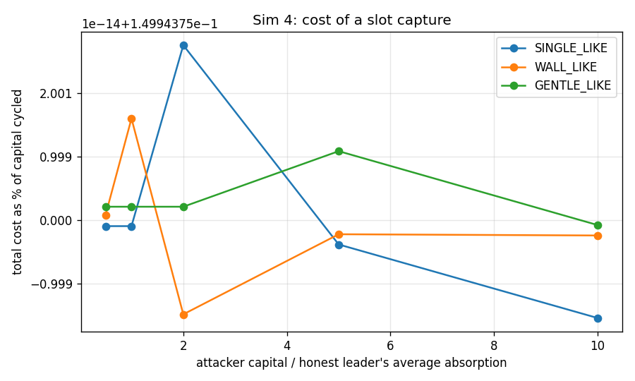
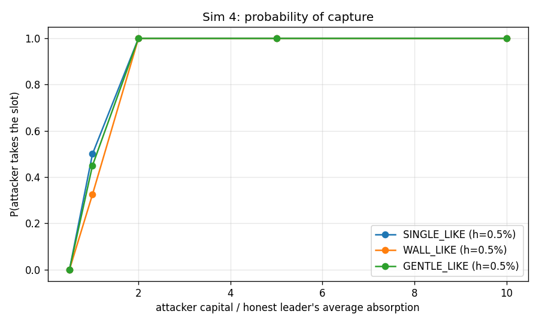
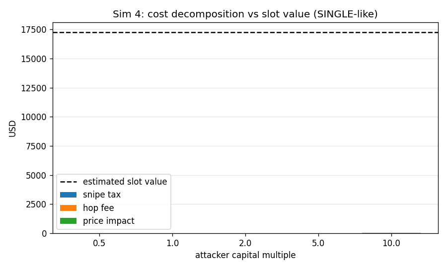

### interpretation

Round run directly on top of GENESIS, so parent tokens convert at $2.50e-04 each (genesis FDV $250,000). The brief's disclosure that *slot capture costs about fees* is VERIFIED, and it is worse than the word 'fees' suggests. At 2x the honest leader's average absorption the attacker takes the slot with probability 100% on the SINGLE-like curve for a total cost of $5 on $3,220 of capital cycled - 0.15% of the capital, which is exactly 1 - (1 - f_hop)^2 for a 7.5 bps hop fee. 100% of that cost is the hop fee and nothing else: the snipe tax is *identically zero* at t = 3.1 s because the hook only taxes the first 3 s, and the round trip's price impact is zero to machine precision because a buy and a sell across the same static curve are exact inverses. The attacker rents the slot, pays the toll, and walks away with the capital. Averaged over every curve at 2x capital or more, P(capture) is 100%. Set against an estimated slot value of $17,250 (next round's buy pressure on the head, $16,250, plus one round of creator fee flow, $1,000), capture is profitable by roughly 3573x for anyone with the float. The curve sweep matters less than the threshold sweep: h only changes whether *anyone* wins, not who. The variants close off the cheaper shortcuts. late_spike costs the same $9 and tops the round 0% of the time: capital held for one second contributes 1/600 of itself to an average taken over the whole window, so a last-second spike is arithmetically incapable of buying the slot - attack-log finding 10 holds. block1_sweep loses $12,588 paying the opening tax and tops the round 0% of the time here, though Sim 5 shows the same sweep turning a profit when the curve runs two orders of magnitude inside the window - the 99% tax prices the sweep, it does not forbid it. dynastic is simply self_fund_win that keeps the position, and it shows the capture is not even a cost: the attacker ends the round holding a mark-to-market gain. The refundable-score risk in attack-log finding 5 is real, quantified, and only mitigable by making score cost something non-refundable.

*Modelling notes:* Slot value is an estimate, not a measurement: next round's head demand assumes 5 candidates each drawing A_BASE = 13,000,000 parent, and the creator stream assumes $250,000 of ETH-edge volume in the round the attacker's token is the numeraire.

## Sim 1 - Lifecycle: GENESIS to #20, 5 candidates per round

**Claim under test:** creators and developer earn meaningfully; ancestors keep receiving  
**Runtime:** 4.4 s

### per generation

| generation | attempt | winner | winner_interest | best_avg_parent | threshold_parent | avg_over_threshold | embedded_parent | float_frac | fdv_parent | fdv_eth | fdv_usd | edge_volume_eth | protocol_fee_eth | creator_usd | dev_usd | ancestor_usd | reinforce_usd | fdv_vs_parent | backing_frac |
|---|---|---|---|---|---|---|---|---|---|---|---|---|---|---|---|---|---|---|---|
| 1 | 1 | c2 | 2.403 | 1.718e+07 | 1.500e+06 | 11.45 | 3.709e+07 | 0.6335 | 2.427e+08 | 16.32 | 6.527e+04 | 1.035 | 0.01039 | 16.62 | 8.311 | 8.311 | 8.311 | 0.2427 | 0.1528 |
| 2 | 2 | c4 | 2.479 | 1.372e+07 | 1.500e+06 | 9.145 | 3.260e+07 | 0.6139 | 2.161e+08 | 3.682 | 1.473e+04 | 0.2398 | 0.002407 | 3.851 | 1.925 | 1.925 | 1.925 | 0.2161 | 0.1508 |
| 3 | 3 | c3 | 2.268 | 1.494e+07 | 1.500e+06 | 9.958 | 3.269e+07 | 0.6143 | 2.167e+08 | 0.826 | 3,304 | 0.0541 | 5.429e-04 | 0.8687 | 0.4343 | 0.4343 | 0.4343 | 0.2167 | 0.1509 |
| 4 | 4 | c0 | 1.355 | 1.112e+07 | 1.500e+06 | 7.414 | 2.553e+07 | 0.5778 | 1.774e+08 | 0.1506 | 602.3 | 0.009993 | 1.003e-04 | 0.1604 | 0.08022 | 0.08022 | 0.08022 | 0.1774 | 0.1439 |
| 5 | 5 | c0 | 1.91 | 1.483e+07 | 1.500e+06 | 9.885 | 3.211e+07 | 0.6116 | 2.134e+08 | 0.03304 | 132.2 | 0.002174 | 2.182e-05 | 0.03491 | 0.01745 | 0.01745 | 0.01745 | 0.2134 | 0.1505 |
| 6 | 6 | c3 | 1.549 | 1.331e+07 | 1.500e+06 | 8.871 | 2.719e+07 | 0.5869 | 1.862e+08 | 0.006321 | 25.28 | 4.184e-04 | 4.198e-06 | 0.006717 | 0.003359 | 0.003359 | 0.003359 | 0.1862 | 0.1461 |
| 7 | 7 | c3 | 4.133 | 3.263e+07 | 1.500e+06 | 21.75 | 6.953e+07 | 0.7284 | 4.806e+08 | 0.003222 | 12.89 | 1.993e-04 | 2.000e-06 | 0.003199 | 0.0016 | 0.0016 | 0.0016 | 0.4806 | 0.1447 |
| 8 | 8 | c1 | 1.409 | 9.897e+06 | 1.500e+06 | 6.598 | 2.244e+07 | 0.5595 | 1.617e+08 | 5.417e-04 | 2.167 | 3.570e-05 | 3.582e-07 | 5.731e-04 | 2.866e-04 | 2.866e-04 | 2.866e-04 | 0.1617 | 0.1388 |
| 9 | 9 | c3 | 2.623 | 2.251e+07 | 1.500e+06 | 15.01 | 4.970e+07 | 0.6783 | 3.257e+08 | 1.842e-04 | 0.7369 | 1.174e-05 | 1.178e-07 | 1.885e-04 | 9.426e-05 | 9.426e-05 | 9.426e-05 | 0.3257 | 0.1526 |
| 10 | 10 | c4 | 1.453 | 1.074e+07 | 1.500e+06 | 7.162 | 2.309e+07 | 0.5635 | 1.649e+08 | 3.136e-05 | 0.1254 | 2.075e-06 | 2.082e-08 | 3.331e-05 | 1.665e-05 | 1.665e-05 | 1.665e-05 | 0.1649 | 0.14 |
| 11 | 11 | c2 | 2.473 | 1.943e+07 | 1.500e+06 | 12.95 | 4.156e+07 | 0.6509 | 2.708e+08 | 8.793e-06 | 0.03517 | 5.682e-07 | 5.701e-09 | 9.122e-06 | 4.561e-06 | 4.561e-06 | 4.561e-06 | 0.2708 | 0.1535 |
| 12 | 12 | c2 | 1.792 | 1.330e+07 | 1.500e+06 | 8.869 | 2.831e+07 | 0.5928 | 1.922e+08 | 1.745e-06 | 0.006979 | 1.146e-07 | 1.150e-09 | 1.840e-06 | 9.200e-07 | 9.200e-07 | 9.200e-07 | 0.1922 | 0.1473 |
| 13 | 13 | c1 | 0.8444 | 7.369e+06 | 1.500e+06 | 4.912 | 1.567e+07 | 0.5128 | 1.298e+08 | 2.308e-07 | 9.231e-04 | 1.553e-08 | 1.558e-10 | 2.493e-07 | 1.246e-07 | 1.246e-07 | 1.246e-07 | 0.1298 | 0.1208 |
| 14 | 14 | c0 | 1.261 | 1.084e+07 | 1.500e+06 | 7.223 | 2.417e+07 | 0.57 | 1.704e+08 | 4.007e-08 | 1.603e-04 | 2.669e-09 | 2.678e-11 | 4.285e-08 | 2.142e-08 | 2.142e-08 | 2.142e-08 | 0.1704 | 0.1419 |
| 15 | 15 | c2 | 2.704 | 1.915e+07 | 1.500e+06 | 12.77 | 3.952e+07 | 0.6432 | 2.578e+08 | 1.065e-08 | 4.261e-05 | 6.908e-10 | 6.932e-12 | 1.109e-08 | 5.545e-09 | 5.545e-09 | 5.545e-09 | 0.2578 | 0.1533 |
| 16 | 16 | c1 | 1.413 | 1.028e+07 | 1.500e+06 | 6.853 | 2.150e+07 | 0.5536 | 1.570e+08 | 1.716e-09 | 6.863e-06 | 1.140e-10 | 1.143e-12 | 1.829e-09 | 9.147e-10 | 9.147e-10 | 9.147e-10 | 0.157 | 0.1369 |
| 17 | 17 | c4 | 1.604 | 1.210e+07 | 1.500e+06 | 8.069 | 2.636e+07 | 0.5824 | 1.818e+08 | 3.190e-10 | 1.276e-06 | 2.110e-11 | 2.117e-13 | 3.388e-10 | 1.694e-10 | 1.694e-10 | 1.694e-10 | 0.1818 | 0.145 |
| 18 | 18 | c2 | 2.916 | 1.651e+07 | 1.500e+06 | 11.01 | 3.839e+07 | 0.6388 | 2.507e+08 | 8.256e-11 | 3.302e-07 | 5.349e-12 | 5.367e-14 | 8.587e-11 | 4.294e-11 | 4.294e-11 | 4.294e-11 | 0.2507 | 0.1531 |
| 19 | 19 | c1 | 1.3 | 1.064e+07 | 1.500e+06 | 7.095 | 2.455e+07 | 0.5721 | 1.723e+08 | 1.462e-11 | 5.849e-08 | 9.641e-13 | 9.674e-15 | 1.548e-11 | 7.739e-12 | 7.739e-12 | 7.739e-12 | 0.1723 | 0.1424 |
| 20 | 20 | c1 | 3.285 | 2.472e+07 | 1.500e+06 | 16.48 | 5.574e+07 | 0.6957 | 3.697e+08 | 5.656e-12 | 2.262e-08 | 3.553e-13 | 3.565e-15 | 5.705e-12 | 2.852e-12 | 2.852e-12 | 2.852e-12 | 0.3697 | 0.1508 |

CSV: `docs/results/sim01_per_generation_final.csv`

### fee flow by recipient

| recipient | kind | target | amount | share | amount_usd |
|---|---|---|---|---|---|
| ancestor:0 | ancestor | 0 | 0.01676 | 0.1974 | 67.05 |
| ancestor:1 | ancestor | 1 | 1.808e-04 | 0.002129 | 0.7232 |
| ancestor:2 | ancestor | 2 | 3.372e-05 | 3.971e-04 | 0.1349 |
| ancestor:3 | ancestor | 3 | 5.288e-06 | 6.228e-05 | 0.02115 |
| ancestor:4 | ancestor | 4 | 9.868e-07 | 1.162e-05 | 0.003947 |
| ancestor:5 | ancestor | 5 | 1.878e-07 | 2.212e-06 | 7.512e-04 |
| ancestor:6 | ancestor | 6 | 6.848e-08 | 8.065e-07 | 2.739e-04 |
| ancestor:7 | ancestor | 7 | 1.191e-08 | 1.403e-07 | 4.766e-05 |
| ancestor:8 | ancestor | 8 | 3.261e-09 | 3.840e-08 | 1.304e-05 |
| ancestor:9 | ancestor | 9 | 5.583e-10 | 6.574e-09 | 2.233e-06 |
| ancestor:10 | ancestor | 10 | 1.334e-10 | 1.571e-09 | 5.336e-07 |
| ancestor:11 | ancestor | 11 | 2.388e-11 | 2.812e-10 | 9.552e-08 |
| ancestor:12 | ancestor | 12 | 3.119e-12 | 3.673e-11 | 1.248e-08 |
| ancestor:13 | ancestor | 13 | 5.300e-13 | 6.242e-12 | 2.120e-09 |
| ancestor:14 | ancestor | 14 | 1.207e-13 | 1.421e-12 | 4.827e-10 |
| ancestor:15 | ancestor | 15 | 1.921e-14 | 2.263e-13 | 7.686e-11 |
| ancestor:16 | ancestor | 16 | 3.528e-15 | 4.155e-14 | 1.411e-11 |
| ancestor:17 | ancestor | 17 | 8.123e-16 | 9.566e-15 | 3.249e-12 |
| ancestor:18 | ancestor | 18 | 1.520e-16 | 1.790e-15 | 6.081e-13 |
| ancestor:19 | ancestor | 19 | 4.106e-17 | 4.835e-16 | 1.642e-13 |
| creator:0 | creator | 0 | 0.02858 | 0.3366 | 114.3 |
| creator:1 | creator | 1 | 0.004156 | 0.04894 | 16.62 |
| creator:2 | creator | 2 | 9.627e-04 | 0.01134 | 3.851 |
| creator:3 | creator | 3 | 2.172e-04 | 0.002557 | 0.8687 |
| creator:4 | creator | 4 | 4.011e-05 | 4.724e-04 | 0.1604 |
| creator:5 | creator | 5 | 8.727e-06 | 1.028e-04 | 0.03491 |
| creator:6 | creator | 6 | 1.679e-06 | 1.978e-05 | 0.006717 |
| creator:7 | creator | 7 | 7.998e-07 | 9.419e-06 | 0.003199 |
| creator:8 | creator | 8 | 1.433e-07 | 1.687e-06 | 5.731e-04 |
| creator:9 | creator | 9 | 4.713e-08 | 5.550e-07 | 1.885e-04 |
| creator:10 | creator | 10 | 8.327e-09 | 9.806e-08 | 3.331e-05 |
| creator:11 | creator | 11 | 2.281e-09 | 2.686e-08 | 9.122e-06 |
| creator:12 | creator | 12 | 4.600e-10 | 5.417e-09 | 1.840e-06 |
| creator:13 | creator | 13 | 6.232e-11 | 7.339e-10 | 2.493e-07 |
| creator:14 | creator | 14 | 1.071e-11 | 1.261e-10 | 4.285e-08 |
| creator:15 | creator | 15 | 2.773e-12 | 3.265e-11 | 1.109e-08 |
| creator:16 | creator | 16 | 4.574e-13 | 5.386e-12 | 1.829e-09 |
| creator:17 | creator | 17 | 8.469e-14 | 9.973e-13 | 3.388e-10 |
| creator:18 | creator | 18 | 2.147e-14 | 2.528e-13 | 8.587e-11 |
| creator:19 | creator | 19 | 3.870e-15 | 4.557e-14 | 1.548e-11 |
| creator:20 | creator | 20 | 1.426e-15 | 1.679e-14 | 5.705e-12 |
| dev | dev | -1 | 0.01698 | 0.2 | 67.93 |
| reinforce:0 | reinforce | 0 | 0.01637 | 0.1927 | 65.47 |
| reinforce:1 | reinforce | 1 | 4.813e-04 | 0.005668 | 1.925 |
| reinforce:2 | reinforce | 2 | 1.086e-04 | 0.001279 | 0.4343 |
| reinforce:3 | reinforce | 3 | 2.006e-05 | 2.362e-04 | 0.08022 |
| reinforce:4 | reinforce | 4 | 4.364e-06 | 5.139e-05 | 0.01745 |
| reinforce:5 | reinforce | 5 | 8.397e-07 | 9.888e-06 | 0.003359 |
| reinforce:6 | reinforce | 6 | 3.999e-07 | 4.710e-06 | 0.0016 |
| reinforce:7 | reinforce | 7 | 7.164e-08 | 8.436e-07 | 2.866e-04 |
| reinforce:8 | reinforce | 8 | 2.356e-08 | 2.775e-07 | 9.426e-05 |
| reinforce:9 | reinforce | 9 | 4.164e-09 | 4.903e-08 | 1.665e-05 |
| reinforce:10 | reinforce | 10 | 1.140e-09 | 1.343e-08 | 4.561e-06 |
| reinforce:11 | reinforce | 11 | 2.300e-10 | 2.709e-09 | 9.200e-07 |
| reinforce:12 | reinforce | 12 | 3.116e-11 | 3.670e-10 | 1.246e-07 |
| reinforce:13 | reinforce | 13 | 5.356e-12 | 6.307e-11 | 2.142e-08 |
| reinforce:14 | reinforce | 14 | 1.386e-12 | 1.633e-11 | 5.545e-09 |
| reinforce:15 | reinforce | 15 | 2.287e-13 | 2.693e-12 | 9.147e-10 |
| reinforce:16 | reinforce | 16 | 4.234e-14 | 4.987e-13 | 1.694e-10 |
| reinforce:17 | reinforce | 17 | 1.073e-14 | 1.264e-13 | 4.294e-11 |
| reinforce:18 | reinforce | 18 | 1.935e-15 | 2.278e-14 | 7.739e-12 |
| reinforce:19 | reinforce | 19 | 7.131e-16 | 8.397e-15 | 2.852e-12 |

CSV: `docs/results/sim01_fee_flow_by_recipient_final.csv`

### fee totals by kind

| kind | amount_usd | share |
|---|---|---|
| creator | 135.9 | 0.4 |
| reinforce | 67.93 | 0.2 |
| dev | 67.93 | 0.2 |
| ancestor | 67.93 | 0.2 |

CSV: `docs/results/sim01_fee_totals_by_kind_final.csv`

### figures

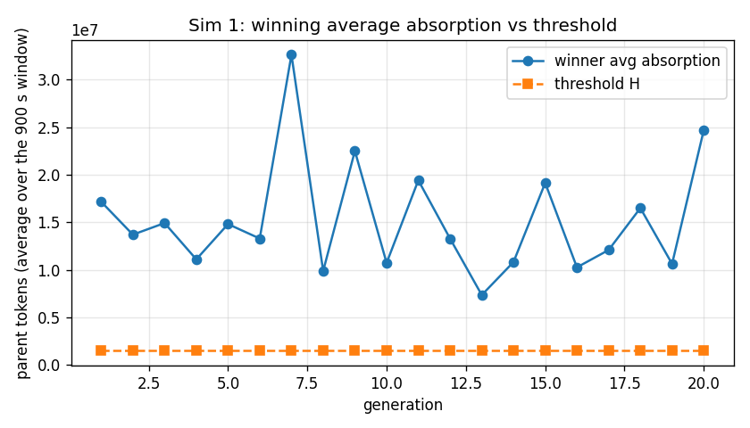
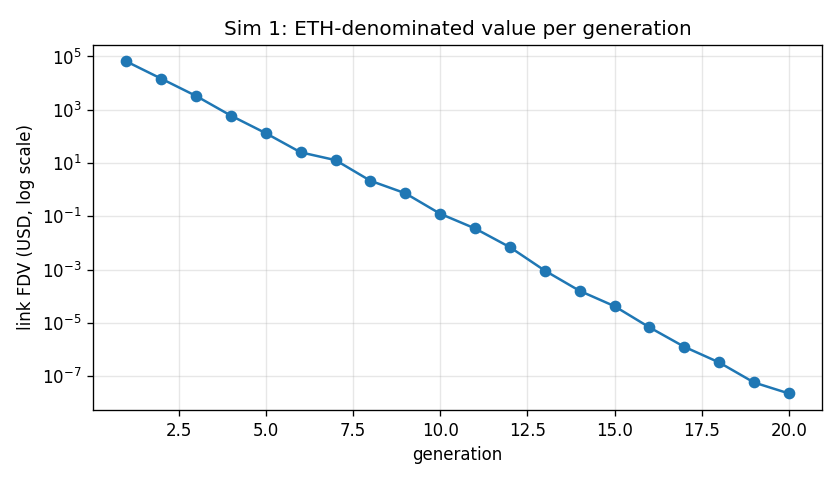
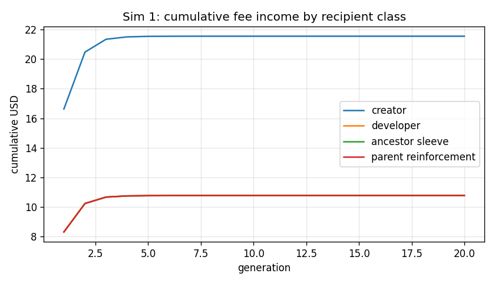
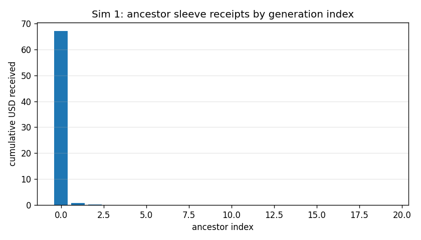

### interpretation

Brief-literal chain (a0 = 1e-3 at every link). 20 of 20 rounds produced a winner (0 failed). The claim *ancestors keep receiving* is VERIFIED mechanically: all 20 ancestor indices hold a non-zero balance, because the sleeve pays ancestors 0..M on every ETH-edge swap and M grows with the chain; over the run the split lands exactly on the configured 20%/40%/20%/20% shares. The claim *creators and developer earn meaningfully* is VERIFIED conditional on volume and on nothing else: at $50,000 of entry per round the creator of a winning link takes a median $0 and the developer half of that, for run totals of $136 and $68 plus $68 to the ancestor sleeve. That is a fee split doing its job, not a business - the number is linear in edge volume and there is no other source. The scenario's real finding is elsewhere. To clear a threshold of 0.5% of parent supply *as an average over the full 900 s*, a winner has to absorb 9.0x that threshold in total, and the standard curve cannot survive it: the median winner finishes the round with 60.2% of its supply already sold and an FDV of 0.20x its own parent's, backed by embedded parent worth only 14.67% of that mark. Each generation is therefore marked *up* relative to its parent while being backed by a thinner and thinner slice of real liquidity - head FDV runs from $65,266 at #1 to $2.26e-08 at #20, which is a mark-to-market artefact of an exhausted bonding curve, not value. The actionable conclusion for the deploy constants: h = 0.5% is too high for this curve, or the curve's body is too thin for this h. Sim 4 and Sim 8 are where that pair gets set; the invariant in section 3 (H <= 25% of wall absorption) is satisfied here and is *not* sufficient, because it bounds the average while the round consumes the total.

*Modelling notes:* ETH-edge volume per round is exogenous ($50,000 in, 50% back out), capped at 5% of the head's ETH FDV so a single trade cannot exceed the link's own size. Losing candidates are kept as side pools parented at the previous head.

## Sim 2 - Stochastic chains: 200 Monte Carlo runs per demand regime

**Claim under test:** decay-with-floor keeps the chain alive without junk wins  
**Runtime:** 2.6 s

### survival

| demand_regime | k | p_reach_k_in_k_rounds | p_reach_k_in_2k_rounds | mean_rounds_to_reach_k | budget_rounds |
|---|---|---|---|---|---|
| 0.2 | 5 | 0.57 | 0.995 | 5.605 | 40 |
| 0.2 | 10 | 0.29 | 1 | 11.24 | 40 |
| 0.2 | 20 | 0.09 | 1 | 22.43 | 40 |
| 0.35 | 5 | 0.845 | 1 | 5.18 | 40 |
| 0.35 | 10 | 0.725 | 1 | 10.31 | 40 |
| 0.35 | 20 | 0.535 | 1 | 20.65 | 40 |
| 0.5 | 5 | 0.94 | 1 | 5.06 | 40 |
| 0.5 | 10 | 0.9 | 1 | 10.1 | 40 |
| 0.5 | 20 | 0.815 | 1 | 20.2 | 40 |
| 1 | 5 | 0.995 | 1 | 5.005 | 40 |
| 1 | 10 | 0.98 | 1 | 10.02 | 40 |
| 1 | 20 | 0.975 | 1 | 20.02 | 40 |

CSV: `docs/results/sim02_survival_final.csv`

### summary

| demand_regime | chains | mean_index_reached | rounds_simulated | frac_rounds_no_winner | wins | rounds_per_win | zombie_win_rate |
|---|---|---|---|---|---|---|---|
| 0.2 | 200 | 20 | 4485 | 0.1081 | 4000 | 1.121 | 0 |
| 0.35 | 200 | 20 | 4130 | 0.03148 | 4000 | 1.032 | 0 |
| 0.5 | 200 | 20 | 4040 | 0.009901 | 4000 | 1.01 | 0 |
| 1 | 200 | 20 | 4005 | 0.001248 | 4000 | 1.001 | 0 |

CSV: `docs/results/sim02_summary_final.csv`

### threshold path

| demand_regime | round_number | chains_still_running | mean_threshold_parent | min_threshold_parent |
|---|---|---|---|---|
| 0.2 | 1 | 200 | 1.500e+06 | 1.500e+06 |
| 0.2 | 2 | 200 | 1.484e+06 | 1.350e+06 |
| 0.2 | 3 | 200 | 1.484e+06 | 1.215e+06 |
| 0.2 | 4 | 200 | 1.479e+06 | 1.215e+06 |
| 0.2 | 5 | 200 | 1.484e+06 | 1.215e+06 |
| 0.2 | 6 | 200 | 1.487e+06 | 1.215e+06 |
| 0.2 | 7 | 200 | 1.478e+06 | 1.215e+06 |
| 0.2 | 8 | 200 | 1.486e+06 | 1.215e+06 |
| 0.2 | 9 | 200 | 1.481e+06 | 1.094e+06 |
| 0.2 | 10 | 200 | 1.485e+06 | 1.215e+06 |
| 0.2 | 11 | 200 | 1.482e+06 | 1.215e+06 |
| 0.2 | 12 | 200 | 1.476e+06 | 1.215e+06 |
| 0.2 | 13 | 200 | 1.482e+06 | 1.215e+06 |
| 0.2 | 14 | 200 | 1.481e+06 | 1.215e+06 |
| 0.2 | 15 | 200 | 1.480e+06 | 1.215e+06 |
| 0.2 | 16 | 200 | 1.486e+06 | 1.094e+06 |
| 0.2 | 17 | 200 | 1.486e+06 | 1.215e+06 |
| 0.2 | 18 | 200 | 1.470e+06 | 1.094e+06 |
| 0.2 | 19 | 200 | 1.483e+06 | 1.215e+06 |
| 0.2 | 20 | 200 | 1.484e+06 | 1.350e+06 |
| 0.2 | 21 | 182 | 1.479e+06 | 1.215e+06 |
| 0.2 | 22 | 141 | 1.480e+06 | 1.215e+06 |
| 0.2 | 23 | 91 | 1.472e+06 | 1.215e+06 |
| 0.2 | 24 | 46 | 1.493e+06 | 1.350e+06 |
| 0.2 | 25 | 16 | 1.435e+06 | 1.215e+06 |
| 0.2 | 26 | 6 | 1.452e+06 | 1.215e+06 |
| 0.2 | 27 | 2 | 1.500e+06 | 1.500e+06 |
| 0.2 | 28 | 1 | 1.500e+06 | 1.500e+06 |
| 0.35 | 1 | 200 | 1.500e+06 | 1.500e+06 |
| 0.35 | 2 | 200 | 1.493e+06 | 1.350e+06 |
| 0.35 | 3 | 200 | 1.496e+06 | 1.215e+06 |
| 0.35 | 4 | 200 | 1.495e+06 | 1.350e+06 |
| 0.35 | 5 | 200 | 1.494e+06 | 1.350e+06 |
| 0.35 | 6 | 200 | 1.496e+06 | 1.350e+06 |
| 0.35 | 7 | 200 | 1.496e+06 | 1.350e+06 |
| 0.35 | 8 | 200 | 1.494e+06 | 1.350e+06 |
| 0.35 | 9 | 200 | 1.498e+06 | 1.350e+06 |
| 0.35 | 10 | 200 | 1.494e+06 | 1.350e+06 |
| 0.35 | 11 | 200 | 1.497e+06 | 1.350e+06 |
| 0.35 | 12 | 200 | 1.491e+06 | 1.350e+06 |
| 0.35 | 13 | 200 | 1.496e+06 | 1.350e+06 |
| 0.35 | 14 | 200 | 1.496e+06 | 1.215e+06 |
| 0.35 | 15 | 200 | 1.493e+06 | 1.350e+06 |
| 0.35 | 16 | 200 | 1.494e+06 | 1.215e+06 |
| 0.35 | 17 | 200 | 1.496e+06 | 1.350e+06 |
| 0.35 | 18 | 200 | 1.497e+06 | 1.350e+06 |
| 0.35 | 19 | 200 | 1.496e+06 | 1.350e+06 |
| 0.35 | 20 | 200 | 1.498e+06 | 1.350e+06 |
| 0.35 | 21 | 93 | 1.483e+06 | 1.215e+06 |
| 0.35 | 22 | 27 | 1.489e+06 | 1.350e+06 |
| 0.35 | 23 | 8 | 1.481e+06 | 1.350e+06 |
| 0.35 | 24 | 1 | 1.500e+06 | 1.500e+06 |
| 0.35 | 25 | 1 | 1.500e+06 | 1.500e+06 |
| 0.5 | 1 | 200 | 1.500e+06 | 1.500e+06 |
| 0.5 | 2 | 200 | 1.498e+06 | 1.350e+06 |
| 0.5 | 3 | 200 | 1.498e+06 | 1.350e+06 |
| 0.5 | 4 | 200 | 1.498e+06 | 1.350e+06 |
| 0.5 | 5 | 200 | 1.499e+06 | 1.350e+06 |
| 0.5 | 6 | 200 | 1.497e+06 | 1.350e+06 |
| 0.5 | 7 | 200 | 1.500e+06 | 1.500e+06 |
| 0.5 | 8 | 200 | 1.498e+06 | 1.350e+06 |
| 0.5 | 9 | 200 | 1.499e+06 | 1.350e+06 |
| 0.5 | 10 | 200 | 1.498e+06 | 1.350e+06 |
| 0.5 | 11 | 200 | 1.498e+06 | 1.350e+06 |
| 0.5 | 12 | 200 | 1.498e+06 | 1.350e+06 |
| 0.5 | 13 | 200 | 1.498e+06 | 1.350e+06 |
| 0.5 | 14 | 200 | 1.500e+06 | 1.500e+06 |
| 0.5 | 15 | 200 | 1.499e+06 | 1.350e+06 |
| 0.5 | 16 | 200 | 1.498e+06 | 1.350e+06 |
| 0.5 | 17 | 200 | 1.497e+06 | 1.350e+06 |
| 0.5 | 18 | 200 | 1.498e+06 | 1.350e+06 |
| 0.5 | 19 | 200 | 1.499e+06 | 1.350e+06 |
| 0.5 | 20 | 200 | 1.498e+06 | 1.350e+06 |
| 0.5 | 21 | 37 | 1.496e+06 | 1.350e+06 |
| 0.5 | 22 | 3 | 1.400e+06 | 1.350e+06 |
| 1 | 1 | 200 | 1.500e+06 | 1.500e+06 |
| 1 | 2 | 200 | 1.500e+06 | 1.500e+06 |
| 1 | 3 | 200 | 1.499e+06 | 1.350e+06 |
| 1 | 4 | 200 | 1.500e+06 | 1.500e+06 |
| 1 | 5 | 200 | 1.500e+06 | 1.500e+06 |
| 1 | 6 | 200 | 1.500e+06 | 1.500e+06 |
| 1 | 7 | 200 | 1.500e+06 | 1.500e+06 |
| 1 | 8 | 200 | 1.498e+06 | 1.350e+06 |
| 1 | 9 | 200 | 1.500e+06 | 1.500e+06 |
| 1 | 10 | 200 | 1.500e+06 | 1.500e+06 |
| 1 | 11 | 200 | 1.499e+06 | 1.350e+06 |
| 1 | 12 | 200 | 1.499e+06 | 1.350e+06 |
| 1 | 13 | 200 | 1.500e+06 | 1.500e+06 |
| 1 | 14 | 200 | 1.500e+06 | 1.500e+06 |
| 1 | 15 | 200 | 1.500e+06 | 1.500e+06 |
| 1 | 16 | 200 | 1.500e+06 | 1.500e+06 |
| 1 | 17 | 200 | 1.500e+06 | 1.500e+06 |
| 1 | 18 | 200 | 1.500e+06 | 1.500e+06 |
| 1 | 19 | 200 | 1.500e+06 | 1.500e+06 |
| 1 | 20 | 200 | 1.500e+06 | 1.500e+06 |
| 1 | 21 | 5 | 1.500e+06 | 1.500e+06 |

CSV: `docs/results/sim02_threshold_path_final.csv`

### calibration

| k_mean | k_sd | a_base_parent | h0_parent | h_floor_parent | zombie_line_parent | gen_interest_sigma | calibration_rounds |
|---|---|---|---|---|---|---|---|
| 0.7371 | 0.1679 | 1.300e+07 | 1.500e+06 | 3.75e+05 | 7.5e+05 | 0.6999 | 20 |

CSV: `docs/results/sim02_calibration_final.csv`

### figures

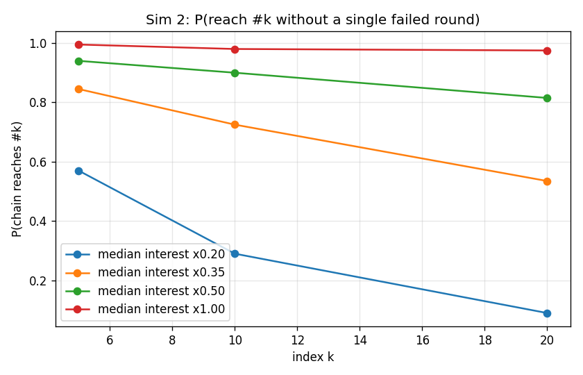
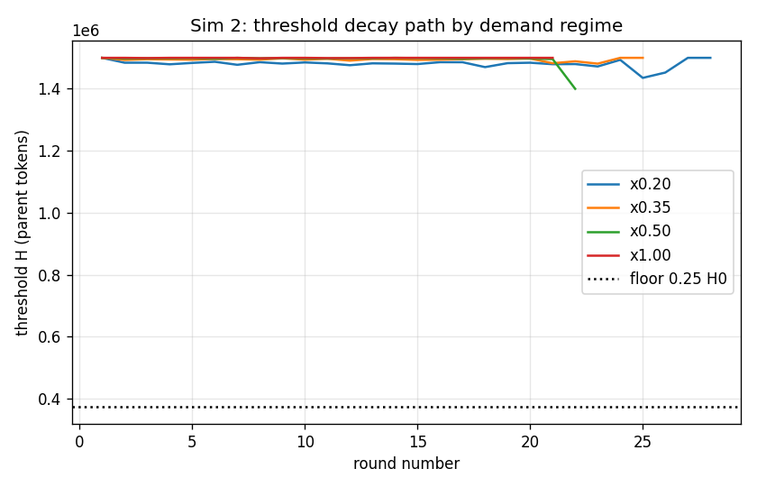

### interpretation

Reduced-form rounds: the full agent engine was run 20 times to fit avg_absorption = k * interest * A_BASE (k = 0.737 +/- 0.168), and the Monte Carlo then draws interest as a per-generation lognormal factor spanning 10x (sigma = 0.70) times a per-candidate lognormal (sigma = 0.6), all scaled by a demand regime - because the answer turns out to be entirely a function of how much demand the market brings. At the baseline calibration (x1.00) the mechanism is nowhere near binding: 0.1% of rounds fail and it takes 20.0 rounds to get to #20, with a zombie rate of 0.0%. The regime that actually tests the claim is thin demand (x0.20), where 10.8% of rounds fail, reaching #20 takes 22.4 rounds instead of 20, and only 9% of chains get there without a single failed round. Every chain does eventually get there - a stalled round costs time, never the chain. There the claim holds in both directions: the x0.9 decay pulls H down fast enough that a stalled chain restarts within a handful of rounds, while the 25% floor (375,000 parent - 0.125% of parent supply absorbed on average for ten straight minutes) still pushes 0.0% of wins into the junk category rather than letting the bar fall to nothing. Decay-with-floor is VERIFIED. Two exposures the numbers make visible: H never re-arms upward after a win, so one bad patch permanently lowers the bar for the rest of the chain's life; and because the score is an *average* over the whole window, a thin round is decided by whichever single candidate drew the fat tail, not by aggregate interest.

*Modelling notes:* H resets to H0 on every win and decays only across consecutive failed rounds (`reset_on_win=True`, the deployed rule); with `--no-reset-on-win` the path is monotone non-increasing (fail rate 4.47% vs 4.94% at the ×1.0 regime — see the recalibration report). Every chain gets a budget of 40 rounds to reach #20, and each demand regime is an independent set of 200 chains.

## Sim 3 - Bad-link collapse at #6 on a 12-link chain

**Claim under test:** best-route + reinforcement mitigates a weak link  
**Runtime:** 0.5 s

### route slippage

| shock | reinforcement | external_market | dst | mode | hops | uses_external | slippage_frac | slippage_usd_on_5k | protocol_fee_eth | hop_fee_legs | exhausted | tokens_out | link6_drawdown | excess_slippage_vs_healthy |
|---|---|---|---|---|---|---|---|---|---|---|---|---|---|---|
| 0 | none | healthy | 10 | FULL_LINE | 11 | no | 0.1141 | 570.7 | 0.0125 | 11 | no | 2.348e+06 | n/a | 0 |
| 0 | none | healthy | 10 | PARENT_SOURCED | 2 | yes | 0.03733 | 186.7 | 0 | 2 | no | 2.552e+06 | n/a | 0 |
| 0 | none | healthy | 10 | DEPTH_CAPPED(3) | 2 | yes | 0.03733 | 186.7 | 0 | 2 | no | 2.552e+06 | n/a | 0 |
| 0 | none | healthy | 12 | FULL_LINE | 13 | no | 0.1309 | 654.3 | 0.0125 | 13 | no | 2.304e+06 | n/a | 0 |
| 0 | none | healthy | 12 | PARENT_SOURCED | 4 | yes | 0.05691 | 284.5 | 0 | 4 | no | 2.500e+06 | n/a | 0 |
| 0 | none | healthy | 12 | DEPTH_CAPPED(3) | 4 | yes | 0.05691 | 284.5 | 0 | 4 | no | 2.500e+06 | n/a | 0 |
| 0.5 | none | independent | 10 | FULL_LINE | 11 | no | 0.2549 | 1,275 | 0.0125 | 11 | no | 8.864e+06 | 0.7772 | 0.1408 |
| 0.5 | none | independent | 10 | PARENT_SOURCED | 11 | no | 0.2549 | 1,275 | 0.0125 | 11 | no | 8.864e+06 | 0.7772 | 0.2176 |
| 0.5 | none | independent | 10 | DEPTH_CAPPED(3) | 11 | no | 0.2549 | 1,275 | 0.0125 | 11 | no | 8.864e+06 | 0.7772 | 0.2176 |
| 0.5 | none | independent | 12 | FULL_LINE | 13 | no | 0.3026 | 1,513 | 0.0125 | 13 | no | 8.296e+06 | 0.7772 | 0.1717 |
| 0.5 | none | independent | 12 | PARENT_SOURCED | 13 | no | 0.3026 | 1,513 | 0.0125 | 13 | no | 8.296e+06 | 0.7772 | 0.2457 |
| 0.5 | none | independent | 12 | DEPTH_CAPPED(3) | 13 | no | 0.3026 | 1,513 | 0.0125 | 13 | no | 8.296e+06 | 0.7772 | 0.2457 |
| 0.5 | none | arbitraged | 10 | FULL_LINE | 11 | no | 0.1589 | 794.7 | 0.0125 | 11 | no | 3.149e+06 | 0.6787 | 0.0448 |
| 0.5 | none | arbitraged | 10 | PARENT_SOURCED | 2 | yes | 0.06435 | 321.8 | 0 | 2 | no | 3.503e+06 | 0.6787 | 0.02702 |
| 0.5 | none | arbitraged | 10 | DEPTH_CAPPED(3) | 2 | yes | 0.06435 | 321.8 | 0 | 2 | no | 3.503e+06 | 0.6787 | 0.02702 |
| 0.5 | none | arbitraged | 12 | FULL_LINE | 13 | no | 0.1797 | 898.3 | 0.0125 | 13 | no | 3.071e+06 | 0.6787 | 0.04882 |
| 0.5 | none | arbitraged | 12 | PARENT_SOURCED | 4 | yes | 0.08978 | 448.9 | 0 | 4 | no | 3.408e+06 | 0.6787 | 0.03287 |
| 0.5 | none | arbitraged | 12 | DEPTH_CAPPED(3) | 4 | yes | 0.08978 | 448.9 | 0 | 4 | no | 3.408e+06 | 0.6787 | 0.03287 |
| 0.5 | fee_funded_3_rounds | independent | 10 | FULL_LINE | 11 | no | 0.2477 | 1,239 | 0.0125 | 11 | no | 8.532e+06 | 0.7743 | 0.1336 |
| 0.5 | fee_funded_3_rounds | independent | 10 | PARENT_SOURCED | 11 | no | 0.2477 | 1,239 | 0.0125 | 11 | no | 8.532e+06 | 0.7743 | 0.2104 |
| 0.5 | fee_funded_3_rounds | independent | 10 | DEPTH_CAPPED(3) | 11 | no | 0.2477 | 1,239 | 0.0125 | 11 | no | 8.532e+06 | 0.7743 | 0.2104 |
| 0.5 | fee_funded_3_rounds | independent | 12 | FULL_LINE | 13 | no | 0.2942 | 1,471 | 0.0125 | 13 | no | 8.005e+06 | 0.7743 | 0.1634 |
| 0.5 | fee_funded_3_rounds | independent | 12 | PARENT_SOURCED | 13 | no | 0.2942 | 1,471 | 0.0125 | 13 | no | 8.005e+06 | 0.7743 | 0.2373 |
| 0.5 | fee_funded_3_rounds | independent | 12 | DEPTH_CAPPED(3) | 13 | no | 0.2942 | 1,471 | 0.0125 | 13 | no | 8.005e+06 | 0.7743 | 0.2373 |
| 0.5 | fee_funded_3_rounds | arbitraged | 10 | FULL_LINE | 11 | no | 0.1566 | 783.1 | 0.0125 | 11 | no | 3.127e+06 | 0.6791 | 0.04248 |
| 0.5 | fee_funded_3_rounds | arbitraged | 10 | PARENT_SOURCED | 2 | yes | 0.0641 | 320.5 | 0 | 2 | no | 3.470e+06 | 0.6791 | 0.02677 |
| 0.5 | fee_funded_3_rounds | arbitraged | 10 | DEPTH_CAPPED(3) | 2 | yes | 0.0641 | 320.5 | 0 | 2 | no | 3.470e+06 | 0.6791 | 0.02677 |
| 0.5 | fee_funded_3_rounds | arbitraged | 12 | FULL_LINE | 13 | no | 0.1773 | 886.4 | 0.0125 | 13 | no | 3.050e+06 | 0.6791 | 0.04642 |
| 0.5 | fee_funded_3_rounds | arbitraged | 12 | PARENT_SOURCED | 4 | yes | 0.08931 | 446.6 | 0 | 4 | no | 3.376e+06 | 0.6791 | 0.03241 |
| 0.5 | fee_funded_3_rounds | arbitraged | 12 | DEPTH_CAPPED(3) | 4 | yes | 0.08931 | 446.6 | 0 | 4 | no | 3.376e+06 | 0.6791 | 0.03241 |
| 0.5 | cap_max | independent | 10 | FULL_LINE | 11 | no | 0.0912 | 456 | 0.0125 | 11 | no | 2.209e+06 | 0.769 | -0.02294 |
| 0.5 | cap_max | independent | 10 | PARENT_SOURCED | 2 | yes | -0.04962 | -248.1 | 0 | 2 | no | 2.552e+06 | 0.769 | -0.08695 |
| 0.5 | cap_max | independent | 10 | DEPTH_CAPPED(3) | 2 | yes | -0.04962 | -248.1 | 0 | 2 | no | 2.552e+06 | 0.769 | -0.08695 |
| 0.5 | cap_max | independent | 12 | FULL_LINE | 13 | no | 0.1074 | 537.1 | 0.0125 | 13 | no | 2.170e+06 | 0.769 | -0.02342 |
| 0.5 | cap_max | independent | 12 | PARENT_SOURCED | 4 | yes | -0.02827 | -141.4 | 0 | 4 | no | 2.500e+06 | 0.769 | -0.08518 |
| 0.5 | cap_max | independent | 12 | DEPTH_CAPPED(3) | 4 | yes | -0.02827 | -141.4 | 0 | 4 | no | 2.500e+06 | 0.769 | -0.08518 |
| 0.5 | cap_max | arbitraged | 10 | FULL_LINE | 11 | no | 0.0931 | 465.5 | 0.0125 | 11 | no | 2.317e+06 | 0.7718 | -0.02105 |
| 0.5 | cap_max | arbitraged | 10 | PARENT_SOURCED | 2 | yes | 0.01699 | 84.95 | 0 | 2 | no | 2.512e+06 | 0.7718 | -0.02034 |
| 0.5 | cap_max | arbitraged | 10 | DEPTH_CAPPED(3) | 2 | yes | 0.01699 | 84.95 | 0 | 2 | no | 2.512e+06 | 0.7718 | -0.02034 |
| 0.5 | cap_max | arbitraged | 12 | FULL_LINE | 13 | no | 0.11 | 550 | 0.0125 | 13 | no | 2.274e+06 | 0.7718 | -0.02085 |
| 0.5 | cap_max | arbitraged | 12 | PARENT_SOURCED | 4 | yes | 0.0367 | 183.5 | 0 | 4 | no | 2.462e+06 | 0.7718 | -0.02021 |
| 0.5 | cap_max | arbitraged | 12 | DEPTH_CAPPED(3) | 4 | yes | 0.0367 | 183.5 | 0 | 4 | no | 2.462e+06 | 0.7718 | -0.02021 |
| 0.9 | none | independent | 10 | FULL_LINE | 11 | no | 0.4573 | 2,287 | 0.0125 | 11 | no | 2.191e+07 | 0.9343 | 0.3432 |
| 0.9 | none | independent | 10 | PARENT_SOURCED | 11 | no | 0.4573 | 2,287 | 0.0125 | 11 | no | 2.191e+07 | 0.9343 | 0.42 |
| 0.9 | none | independent | 10 | DEPTH_CAPPED(3) | 11 | no | 0.4573 | 2,287 | 0.0125 | 11 | no | 2.191e+07 | 0.9343 | 0.42 |
| 0.9 | none | independent | 12 | FULL_LINE | 13 | no | 0.5349 | 2,675 | 0.0125 | 13 | no | 1.878e+07 | 0.9343 | 0.4041 |
| 0.9 | none | independent | 12 | PARENT_SOURCED | 13 | no | 0.5349 | 2,675 | 0.0125 | 13 | no | 1.878e+07 | 0.9343 | 0.478 |
| 0.9 | none | independent | 12 | DEPTH_CAPPED(3) | 13 | no | 0.5349 | 2,675 | 0.0125 | 13 | no | 1.878e+07 | 0.9343 | 0.478 |
| 0.9 | none | arbitraged | 10 | FULL_LINE | 11 | no | 0.2157 | 1,079 | 0.0125 | 11 | no | 3.957e+06 | 0.8785 | 0.1016 |
| 0.9 | none | arbitraged | 10 | PARENT_SOURCED | 2 | yes | 0.07281 | 364 | 0 | 2 | no | 4.678e+06 | 0.8785 | 0.03548 |
| 0.9 | none | arbitraged | 10 | DEPTH_CAPPED(3) | 2 | yes | 0.07281 | 364 | 0 | 2 | no | 4.678e+06 | 0.8785 | 0.03548 |
| 0.9 | none | arbitraged | 12 | FULL_LINE | 13 | no | 0.2396 | 1,198 | 0.0125 | 13 | no | 3.837e+06 | 0.8785 | 0.1087 |
| 0.9 | none | arbitraged | 12 | PARENT_SOURCED | 4 | yes | 0.1057 | 528.6 | 0 | 4 | no | 4.512e+06 | 0.8785 | 0.04881 |
| 0.9 | none | arbitraged | 12 | DEPTH_CAPPED(3) | 4 | yes | 0.1057 | 528.6 | 0 | 4 | no | 4.512e+06 | 0.8785 | 0.04881 |
| 0.9 | fee_funded_3_rounds | independent | 10 | FULL_LINE | 11 | no | 0.4478 | 2,239 | 0.0125 | 11 | no | 2.138e+07 | 0.9339 | 0.3336 |
| 0.9 | fee_funded_3_rounds | independent | 10 | PARENT_SOURCED | 11 | no | 0.4478 | 2,239 | 0.0125 | 11 | no | 2.138e+07 | 0.9339 | 0.4104 |
| 0.9 | fee_funded_3_rounds | independent | 10 | DEPTH_CAPPED(3) | 11 | no | 0.4478 | 2,239 | 0.0125 | 11 | no | 2.138e+07 | 0.9339 | 0.4104 |
| 0.9 | fee_funded_3_rounds | independent | 12 | FULL_LINE | 13 | no | 0.5251 | 2,626 | 0.0125 | 13 | no | 1.839e+07 | 0.9339 | 0.3943 |
| 0.9 | fee_funded_3_rounds | independent | 12 | PARENT_SOURCED | 13 | no | 0.5251 | 2,626 | 0.0125 | 13 | no | 1.839e+07 | 0.9339 | 0.4682 |
| 0.9 | fee_funded_3_rounds | independent | 12 | DEPTH_CAPPED(3) | 13 | no | 0.5251 | 2,626 | 0.0125 | 13 | no | 1.839e+07 | 0.9339 | 0.4682 |
| 0.9 | fee_funded_3_rounds | arbitraged | 10 | FULL_LINE | 11 | no | 0.2125 | 1,063 | 0.0125 | 11 | no | 3.946e+06 | 0.8793 | 0.09839 |
| 0.9 | fee_funded_3_rounds | arbitraged | 10 | PARENT_SOURCED | 2 | yes | 0.0726 | 363 | 0 | 2 | no | 4.648e+06 | 0.8793 | 0.03527 |
| 0.9 | fee_funded_3_rounds | arbitraged | 10 | DEPTH_CAPPED(3) | 2 | yes | 0.0726 | 363 | 0 | 2 | no | 4.648e+06 | 0.8793 | 0.03527 |
| 0.9 | fee_funded_3_rounds | arbitraged | 12 | FULL_LINE | 13 | no | 0.2364 | 1,182 | 0.0125 | 13 | no | 3.827e+06 | 0.8793 | 0.1056 |
| 0.9 | fee_funded_3_rounds | arbitraged | 12 | PARENT_SOURCED | 4 | yes | 0.1053 | 526.6 | 0 | 4 | no | 4.484e+06 | 0.8793 | 0.04841 |
| 0.9 | fee_funded_3_rounds | arbitraged | 12 | DEPTH_CAPPED(3) | 4 | yes | 0.1053 | 526.6 | 0 | 4 | no | 4.484e+06 | 0.8793 | 0.04841 |
| 0.9 | cap_max | independent | 10 | FULL_LINE | 11 | no | 0.1703 | 851.5 | 0.0125 | 11 | no | 6.960e+06 | 0.9331 | 0.05616 |
| 0.9 | cap_max | independent | 10 | PARENT_SOURCED | 11 | no | 0.1703 | 851.5 | 0.0125 | 11 | no | 6.960e+06 | 0.9331 | 0.133 |
| 0.9 | cap_max | independent | 10 | DEPTH_CAPPED(3) | 11 | no | 0.1703 | 851.5 | 0.0125 | 11 | no | 6.960e+06 | 0.9331 | 0.133 |
| 0.9 | cap_max | independent | 12 | FULL_LINE | 13 | no | 0.2128 | 1,064 | 0.0125 | 13 | no | 6.603e+06 | 0.9331 | 0.08198 |
| 0.9 | cap_max | independent | 12 | PARENT_SOURCED | 13 | no | 0.2128 | 1,064 | 0.0125 | 13 | no | 6.603e+06 | 0.9331 | 0.1559 |
| 0.9 | cap_max | independent | 12 | DEPTH_CAPPED(3) | 13 | no | 0.2128 | 1,064 | 0.0125 | 13 | no | 6.603e+06 | 0.9331 | 0.1559 |
| 0.9 | cap_max | arbitraged | 10 | FULL_LINE | 11 | no | 0.1194 | 597 | 0.0125 | 11 | no | 3.265e+06 | 0.9195 | 0.005261 |
| 0.9 | cap_max | arbitraged | 10 | PARENT_SOURCED | 2 | yes | 0.0641 | 320.5 | 0 | 2 | no | 3.470e+06 | 0.9195 | 0.02677 |
| 0.9 | cap_max | arbitraged | 10 | DEPTH_CAPPED(3) | 2 | yes | 0.0641 | 320.5 | 0 | 2 | no | 3.470e+06 | 0.9195 | 0.02677 |
| 0.9 | cap_max | arbitraged | 12 | FULL_LINE | 13 | no | 0.1418 | 709.2 | 0.0125 | 13 | no | 3.182e+06 | 0.9195 | 0.01099 |
| 0.9 | cap_max | arbitraged | 12 | PARENT_SOURCED | 4 | yes | 0.08931 | 446.6 | 0 | 4 | no | 3.376e+06 | 0.9195 | 0.03241 |
| 0.9 | cap_max | arbitraged | 12 | DEPTH_CAPPED(3) | 4 | yes | 0.08931 | 446.6 | 0 | 4 | no | 3.376e+06 | 0.9195 | 0.03241 |
| 0.99 | none | independent | 10 | FULL_LINE | 11 | no | 0.4976 | 2,488 | 0.0125 | 11 | no | 2.467e+07 | 0.946 | 0.3835 |
| 0.99 | none | independent | 10 | PARENT_SOURCED | 11 | no | 0.4976 | 2,488 | 0.0125 | 11 | no | 2.467e+07 | 0.946 | 0.4603 |
| 0.99 | none | independent | 10 | DEPTH_CAPPED(3) | 11 | no | 0.4976 | 2,488 | 0.0125 | 11 | no | 2.467e+07 | 0.946 | 0.4603 |
| 0.99 | none | independent | 12 | FULL_LINE | 13 | no | 0.577 | 2,885 | 0.0125 | 13 | no | 2.077e+07 | 0.946 | 0.4461 |
| 0.99 | none | independent | 12 | PARENT_SOURCED | 13 | no | 0.577 | 2,885 | 0.0125 | 13 | no | 2.077e+07 | 0.946 | 0.5201 |
| 0.99 | none | independent | 12 | DEPTH_CAPPED(3) | 13 | no | 0.577 | 2,885 | 0.0125 | 13 | no | 2.077e+07 | 0.946 | 0.5201 |
| 0.99 | none | arbitraged | 10 | FULL_LINE | 11 | no | 0.2284 | 1,142 | 0.0125 | 11 | no | 4.063e+06 | 0.8967 | 0.1142 |
| 0.99 | none | arbitraged | 10 | PARENT_SOURCED | 2 | yes | 0.07417 | 370.8 | 0 | 2 | no | 4.875e+06 | 0.8967 | 0.03684 |
| 0.99 | none | arbitraged | 10 | DEPTH_CAPPED(3) | 2 | yes | 0.07417 | 370.8 | 0 | 2 | no | 4.875e+06 | 0.8967 | 0.03684 |
| 0.99 | none | arbitraged | 12 | FULL_LINE | 13 | no | 0.2524 | 1,262 | 0.0125 | 13 | no | 3.937e+06 | 0.8967 | 0.1216 |
| 0.99 | none | arbitraged | 12 | PARENT_SOURCED | 4 | yes | 0.1083 | 541.6 | 0 | 4 | no | 4.696e+06 | 0.8967 | 0.0514 |
| 0.99 | none | arbitraged | 12 | DEPTH_CAPPED(3) | 4 | yes | 0.1083 | 541.6 | 0 | 4 | no | 4.696e+06 | 0.8967 | 0.0514 |
| 0.99 | fee_funded_3_rounds | independent | 10 | FULL_LINE | 11 | no | 0.488 | 2,440 | 0.0125 | 11 | no | 2.413e+07 | 0.9457 | 0.3739 |
| 0.99 | fee_funded_3_rounds | independent | 10 | PARENT_SOURCED | 11 | no | 0.488 | 2,440 | 0.0125 | 11 | no | 2.413e+07 | 0.9457 | 0.4507 |
| 0.99 | fee_funded_3_rounds | independent | 10 | DEPTH_CAPPED(3) | 11 | no | 0.488 | 2,440 | 0.0125 | 11 | no | 2.413e+07 | 0.9457 | 0.4507 |
| 0.99 | fee_funded_3_rounds | independent | 12 | FULL_LINE | 13 | no | 0.5674 | 2,837 | 0.0125 | 13 | no | 2.039e+07 | 0.9457 | 0.4366 |
| 0.99 | fee_funded_3_rounds | independent | 12 | PARENT_SOURCED | 13 | no | 0.5674 | 2,837 | 0.0125 | 13 | no | 2.039e+07 | 0.9457 | 0.5105 |
| 0.99 | fee_funded_3_rounds | independent | 12 | DEPTH_CAPPED(3) | 13 | no | 0.5674 | 2,837 | 0.0125 | 13 | no | 2.039e+07 | 0.9457 | 0.5105 |
| 0.99 | fee_funded_3_rounds | arbitraged | 10 | FULL_LINE | 11 | no | 0.2251 | 1,125 | 0.0125 | 11 | no | 4.055e+06 | 0.8975 | 0.1109 |
| 0.99 | fee_funded_3_rounds | arbitraged | 10 | PARENT_SOURCED | 2 | yes | 0.07397 | 369.8 | 0 | 2 | no | 4.846e+06 | 0.8975 | 0.03664 |
| 0.99 | fee_funded_3_rounds | arbitraged | 10 | DEPTH_CAPPED(3) | 2 | yes | 0.07397 | 369.8 | 0 | 2 | no | 4.846e+06 | 0.8975 | 0.03664 |
| 0.99 | fee_funded_3_rounds | arbitraged | 12 | FULL_LINE | 13 | no | 0.2492 | 1,246 | 0.0125 | 13 | no | 3.929e+06 | 0.8975 | 0.1183 |
| 0.99 | fee_funded_3_rounds | arbitraged | 12 | PARENT_SOURCED | 4 | yes | 0.1079 | 539.6 | 0 | 4 | no | 4.668e+06 | 0.8975 | 0.05102 |
| 0.99 | fee_funded_3_rounds | arbitraged | 12 | DEPTH_CAPPED(3) | 4 | yes | 0.1079 | 539.6 | 0 | 4 | no | 4.668e+06 | 0.8975 | 0.05102 |
| 0.99 | cap_max | independent | 10 | FULL_LINE | 11 | no | 0.1911 | 955.7 | 0.0125 | 11 | no | 8.268e+06 | 0.9451 | 0.07699 |
| 0.99 | cap_max | independent | 10 | PARENT_SOURCED | 11 | no | 0.1911 | 955.7 | 0.0125 | 11 | no | 8.268e+06 | 0.9451 | 0.1538 |
| 0.99 | cap_max | independent | 10 | DEPTH_CAPPED(3) | 11 | no | 0.1911 | 955.7 | 0.0125 | 11 | no | 8.268e+06 | 0.9451 | 0.1538 |
| 0.99 | cap_max | independent | 12 | FULL_LINE | 13 | no | 0.2397 | 1,199 | 0.0125 | 13 | no | 7.772e+06 | 0.9451 | 0.1089 |
| 0.99 | cap_max | independent | 12 | PARENT_SOURCED | 13 | no | 0.2397 | 1,199 | 0.0125 | 13 | no | 7.772e+06 | 0.9451 | 0.1828 |
| 0.99 | cap_max | independent | 12 | DEPTH_CAPPED(3) | 13 | no | 0.2397 | 1,199 | 0.0125 | 13 | no | 7.772e+06 | 0.9451 | 0.1828 |
| 0.99 | cap_max | arbitraged | 10 | FULL_LINE | 11 | no | 0.1261 | 630.7 | 0.0125 | 11 | no | 3.428e+06 | 0.9321 | 0.01199 |
| 0.99 | cap_max | arbitraged | 10 | PARENT_SOURCED | 2 | yes | 0.06556 | 327.8 | 0 | 2 | no | 3.666e+06 | 0.9321 | 0.02823 |
| 0.99 | cap_max | arbitraged | 10 | DEPTH_CAPPED(3) | 2 | yes | 0.06556 | 327.8 | 0 | 2 | no | 3.666e+06 | 0.9321 | 0.02823 |
| 0.99 | cap_max | arbitraged | 12 | FULL_LINE | 13 | no | 0.1494 | 747.1 | 0.0125 | 13 | no | 3.337e+06 | 0.9321 | 0.01856 |
| 0.99 | cap_max | arbitraged | 12 | PARENT_SOURCED | 4 | yes | 0.09204 | 460.2 | 0 | 4 | no | 3.562e+06 | 0.9321 | 0.03514 |
| 0.99 | cap_max | arbitraged | 12 | DEPTH_CAPPED(3) | 4 | yes | 0.09204 | 460.2 | 0 | 4 | no | 3.562e+06 | 0.9321 | 0.03514 |

CSV: `docs/results/sim03_route_slippage_final.csv`

### reinforcement deposits

| budget_label | budget_eth | budget_usd | parent_deposited | parent_undeployed | pool_reserve_parent | deposit_frac_of_reserve |
|---|---|---|---|---|---|---|
| fee_funded_3_rounds | 0.375 | 1,500 | 7.625e+05 | 0 | 1.069e+08 | 0.007131 |
| cap_max | 25 | 1e+05 | 2.123e+06 | 2.168e+07 | 1.083e+08 | 0.01961 |

CSV: `docs/results/sim03_reinforcement_deposits_final.csv`

### figures

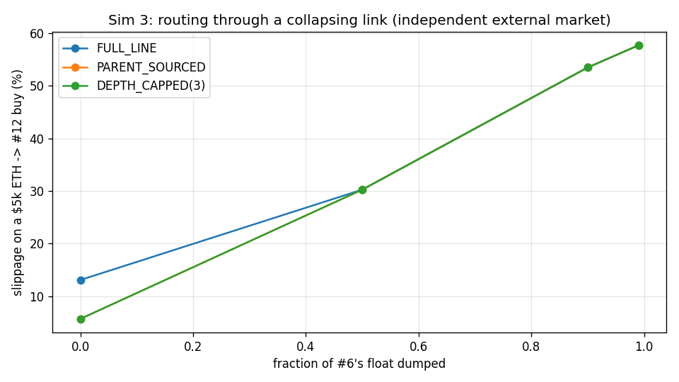
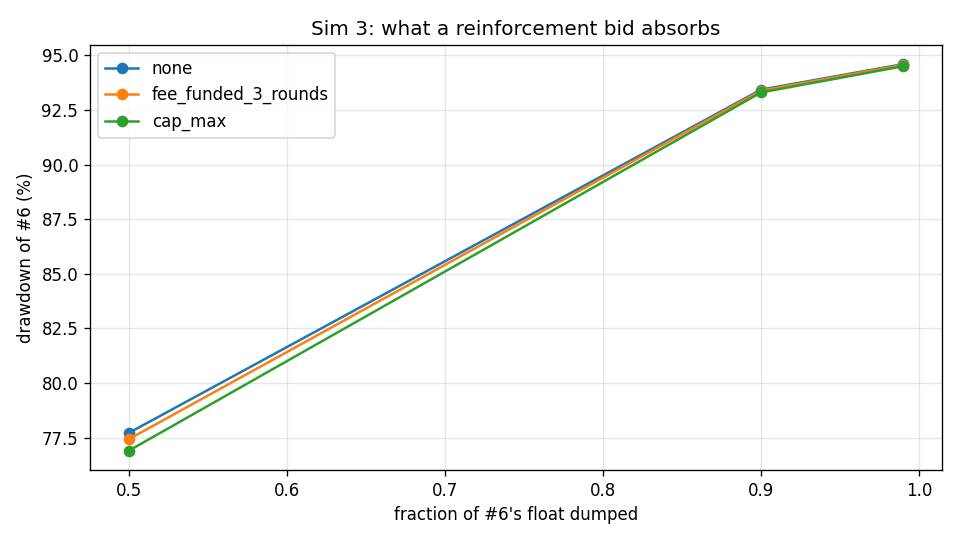

### interpretation

Equal-ETH-depth chain, $5,000 routes, slippage measured against pre-trade mid prices. The claim splits and the halves get opposite verdicts. **Best-route is VERIFIED, with a caveat about which venue is broken.** On a healthy chain, entering through the external ETH market at #9 costs 5.7% against 13.1% for the 13-hop full line - four hops instead of thirteen. After #6's float is 99% dumped, the full line costs 57.7%; if arbitrage has carried the collapse into the external pool the router still routes around the dead link and pays 10.8%, and if the external pool is *stale* the router correctly does the opposite - it takes the family line (57.7%) because a collapsed link is now the cheapest place in the world to buy the token. Either way the buyer pays the minimum of the two venues, which is exactly what best-route is for: a broken mid-chain link costs a buyer roughly 44.6% of extra slippage on the full line and about half of that once an alternative venue exists. **Reinforcement is FALSIFIED at any budget the design actually produces.** Three rounds of the parent-reinforcement sleeve at $250,000 of edge volume per round is 0.375 ETH; it lands as 0.713% of #6's parent reserve and moves the 99%-dump drawdown from 94.6% to 94.6%. Even a budget large enough to hit the brief's own 2%-of-reserve per-call cap (1.96% deposited) only reaches 94.5%. A single-sided bid within 30% of spot is eaten in the first few percent of a dump: reinforcement is a slow accretion mechanism, not a shock absorber, and the UI copy should say so. Note also that the venue which rescues the route is the same external market that bypasses the 1% edge fee (brief section 6) - the mitigation and the revenue leak are one mechanism.

*Modelling notes:* Two external-market regimes are reported because the answer depends entirely on which one holds: 'independent' leaves the market at #9 at its pre-collapse price (best case for best-route), 'arbitraged' runs `propagate_arbitrage` so the collapse reaches it (worst case). Deposited bids are flattened into a non-overlapping tick ladder first - see `flatten_pool`.

## Sim 5 - Candidate war: N candidates sharing one pot of interest

**Claim under test:** a round creates demand for the head  
**Runtime:** 5.2 s

### raw

| n_candidates | snipe_tax | trial | parent_absorbed_total | parent_absorbed_usd | head_eth_in | head_eth_in_usd | head_fdv_move | winner_avg | score_cv | top1_share | block1_share_of_first_second | block1_snipe_usd | block1_cost_usd |
|---|---|---|---|---|---|---|---|---|---|---|---|---|---|
| 5 | yes | 0 | 5.951e+07 | 1.488e+04 | 6.957 | 2.783e+04 | 2.425 | 8.974e+06 | 0.2775 | 0.2926 | 0.9768 | 311.1 | -1,152 |
| 5 | yes | 1 | 7.042e+07 | 1.761e+04 | 9.755 | 3.902e+04 | 3.807 | 7.392e+06 | 0.08581 | 0.2212 | 1 | 311.1 | -1,273 |
| 5 | yes | 2 | 5.853e+07 | 1.463e+04 | 6.748 | 2.699e+04 | 2.331 | 8.532e+06 | 0.2836 | 0.2724 | 1 | 311.1 | -1,141 |
| 5 | yes | 3 | 5.978e+07 | 1.494e+04 | 7.016 | 2.806e+04 | 2.451 | 7.866e+06 | 0.2357 | 0.2813 | 1 | 311.1 | -1,116 |
| 5 | yes | 4 | 8.221e+07 | 2.055e+04 | 14.23 | 5.692e+04 | 6.506 | 9.181e+06 | 0.1709 | 0.2405 | 0.9816 | 311.1 | -1,409 |
| 5 | yes | 5 | 6.515e+07 | 1.629e+04 | 8.286 | 3.314e+04 | 3.052 | 9.321e+06 | 0.3564 | 0.2927 | 0.9411 | 311.1 | -1,213 |
| 5 | yes | 6 | 5.628e+07 | 1.407e+04 | 6.29 | 2.516e+04 | 2.129 | 6.507e+06 | 0.1171 | 0.2304 | 0.9747 | 311.1 | -1,109 |
| 5 | yes | 7 | 6.965e+07 | 1.741e+04 | 9.525 | 3.81e+04 | 3.685 | 8.096e+06 | 0.0773 | 0.2185 | 0.9769 | 311.1 | -1,264 |
| 5 | no | 0 | 6.151e+07 | 1.538e+04 | 7.404 | 2.961e+04 | 2.629 | 7.360e+06 | 0.2215 | 0.2467 | 1 | 0 | -1.114e+04 |
| 5 | no | 1 | 6.376e+07 | 1.594e+04 | 7.938 | 3.175e+04 | 2.883 | 7.538e+06 | 0.1462 | 0.233 | 0.8799 | 0 | -1.105e+04 |
| 5 | no | 2 | 7.991e+07 | 1.998e+04 | 13.19 | 5.275e+04 | 5.824 | 9.251e+06 | 0.09932 | 0.2312 | 1 | 0 | -1.453e+04 |
| 5 | no | 3 | 6.934e+07 | 1.734e+04 | 9.434 | 3.774e+04 | 3.637 | 7.631e+06 | 0.1174 | 0.2364 | 1 | 0 | -1.262e+04 |
| 5 | no | 4 | 6.599e+07 | 1.65e+04 | 8.502 | 3.401e+04 | 3.159 | 9.336e+06 | 0.1798 | 0.2455 | 1 | 0 | -1.197e+04 |
| 5 | no | 5 | 7.702e+07 | 1.925e+04 | 12.01 | 4.804e+04 | 5.092 | 1.076e+07 | 0.2707 | 0.2748 | 1 | 0 | -1.397e+04 |
| 5 | no | 6 | 6.815e+07 | 1.704e+04 | 9.091 | 3.636e+04 | 3.458 | 8.574e+06 | 0.1724 | 0.2515 | 0.8001 | 0 | -1.119e+04 |
| 5 | no | 7 | 7.452e+07 | 1.863e+04 | 11.09 | 4.437e+04 | 4.551 | 9.629e+06 | 0.1396 | 0.2362 | 0.8016 | 0 | -1.22e+04 |
| 10 | yes | 0 | 7.116e+07 | 1.779e+04 | 9.983 | 3.993e+04 | 3.931 | 5.976e+06 | 0.3579 | 0.1637 | 1 | 311.1 | -668.7 |
| 10 | yes | 1 | 6.460e+07 | 1.615e+04 | 8.146 | 3.258e+04 | 2.983 | 4.846e+06 | 0.2567 | 0.1456 | 1 | 311.1 | -571.2 |
| 10 | yes | 2 | 6.622e+07 | 1.656e+04 | 8.564 | 3.426e+04 | 3.19 | 5.663e+06 | 0.3581 | 0.1725 | 0.9651 | 311.1 | -576.5 |
| 10 | yes | 3 | 5.999e+07 | 1.5e+04 | 7.063 | 2.825e+04 | 2.472 | 4.820e+06 | 0.3557 | 0.1587 | 1 | 311.1 | -500 |
| 10 | yes | 4 | 5.605e+07 | 1.401e+04 | 6.244 | 2.498e+04 | 2.109 | 4.387e+06 | 0.405 | 0.1498 | 1 | 311.1 | -432.9 |
| 10 | yes | 5 | 7.243e+07 | 1.811e+04 | 10.39 | 4.154e+04 | 4.151 | 5.627e+06 | 0.3395 | 0.153 | 1 | 311.1 | -709.4 |
| 10 | yes | 6 | 6.981e+07 | 1.745e+04 | 9.572 | 3.829e+04 | 3.71 | 4.977e+06 | 0.2993 | 0.1499 | 1 | 311.1 | -644.9 |
| 10 | yes | 7 | 6.690e+07 | 1.672e+04 | 8.746 | 3.498e+04 | 3.281 | 5.406e+06 | 0.2833 | 0.1521 | 0.9393 | 311.1 | -603.3 |
| 10 | no | 0 | 6.693e+07 | 1.673e+04 | 8.753 | 3.501e+04 | 3.285 | 5.238e+06 | 0.3004 | 0.1488 | 0.8831 | 0 | -8,958 |
| 10 | no | 1 | 7.623e+07 | 1.906e+04 | 11.71 | 4.685e+04 | 4.914 | 5.127e+06 | 0.1872 | 0.1362 | 0.8597 | 0 | -1.038e+04 |
| 10 | no | 2 | 6.732e+07 | 1.683e+04 | 8.861 | 3.544e+04 | 3.34 | 4.716e+06 | 0.3027 | 0.1392 | 1 | 0 | -9,413 |
| 10 | no | 3 | 6.209e+07 | 1.552e+04 | 7.538 | 3.015e+04 | 2.692 | 4.259e+06 | 0.2589 | 0.1327 | 1 | 0 | -8,677 |
| 10 | no | 4 | 6.174e+07 | 1.544e+04 | 7.457 | 2.983e+04 | 2.654 | 4.470e+06 | 0.2211 | 0.1368 | 1 | 0 | -8,534 |
| 10 | no | 5 | 6.035e+07 | 1.509e+04 | 7.142 | 2.857e+04 | 2.508 | 4.217e+06 | 0.2396 | 0.131 | 1 | 0 | -8,333 |
| 10 | no | 6 | 7.244e+07 | 1.811e+04 | 10.39 | 4.156e+04 | 4.154 | 5.504e+06 | 0.251 | 0.1435 | 0.851 | 0 | -9,354 |
| 10 | no | 7 | 8.175e+07 | 2.044e+04 | 14.01 | 5.606e+04 | 6.362 | 6.727e+06 | 0.2779 | 0.1553 | 0.8827 | 0 | -1.124e+04 |
| 20 | yes | 0 | 6.975e+07 | 1.744e+04 | 9.553 | 3.821e+04 | 3.7 | 2.726e+06 | 0.3261 | 0.07734 | 0.979 | 311.1 | -113.6 |
| 20 | yes | 1 | 7.635e+07 | 1.909e+04 | 11.76 | 4.702e+04 | 4.94 | 3.756e+06 | 0.332 | 0.09217 | 1 | 311.1 | -158.7 |
| 20 | yes | 2 | 6.783e+07 | 1.696e+04 | 9.002 | 3.601e+04 | 3.412 | 2.573e+06 | 0.3622 | 0.07729 | 0.9472 | 311.1 | -101.9 |
| 20 | yes | 3 | 6.854e+07 | 1.713e+04 | 9.201 | 3.68e+04 | 3.515 | 3.150e+06 | 0.371 | 0.09059 | 1 | 311.1 | -108.9 |
| 20 | yes | 4 | 6.780e+07 | 1.695e+04 | 8.994 | 3.597e+04 | 3.408 | 3.298e+06 | 0.4023 | 0.094 | 1 | 311.1 | -105.3 |
| 20 | yes | 5 | 7.002e+07 | 1.751e+04 | 9.635 | 3.854e+04 | 3.743 | 3.453e+06 | 0.3677 | 0.09068 | 0.932 | 311.1 | -117.5 |
| 20 | yes | 6 | 6.076e+07 | 1.519e+04 | 7.233 | 2.893e+04 | 2.55 | 2.652e+06 | 0.3626 | 0.08455 | 1 | 311.1 | -51.19 |
| 20 | yes | 7 | 6.536e+07 | 1.634e+04 | 8.34 | 3.336e+04 | 3.079 | 3.001e+06 | 0.4402 | 0.08986 | 1 | 311.1 | -95.15 |
| 20 | no | 0 | 6.996e+07 | 1.749e+04 | 9.616 | 3.846e+04 | 3.733 | 2.805e+06 | 0.2632 | 0.07541 | 1 | 0 | -6,437 |
| 20 | no | 1 | 7.836e+07 | 1.959e+04 | 12.54 | 5.016e+04 | 5.417 | 3.470e+06 | 0.2668 | 0.084 | 0.8796 | 0 | -7,036 |
| 20 | no | 2 | 8.164e+07 | 2.041e+04 | 13.96 | 5.586e+04 | 6.329 | 3.740e+06 | 0.2653 | 0.08501 | 1 | 0 | -7,575 |
| 20 | no | 3 | 7.737e+07 | 1.934e+04 | 12.15 | 4.86e+04 | 5.177 | 3.477e+06 | 0.2775 | 0.08699 | 1 | 0 | -7,162 |
| 20 | no | 4 | 7.602e+07 | 1.9e+04 | 11.63 | 4.653e+04 | 4.867 | 2.764e+06 | 0.2448 | 0.07127 | 0.87 | 0 | -6,714 |
| 20 | no | 5 | 7.426e+07 | 1.857e+04 | 11 | 4.401e+04 | 4.499 | 3.447e+06 | 0.3222 | 0.08763 | 0.8798 | 0 | -6,614 |
| 20 | no | 6 | 7.717e+07 | 1.929e+04 | 12.07 | 4.827e+04 | 5.127 | 3.714e+06 | 0.4417 | 0.09466 | 1 | 0 | -7,289 |
| 20 | no | 7 | 7.170e+07 | 1.793e+04 | 10.15 | 4.061e+04 | 4.023 | 3.790e+06 | 0.3516 | 0.09744 | 1 | 0 | -6,648 |
| 50 | yes | 0 | 7.221e+07 | 1.805e+04 | 10.32 | 4.127e+04 | 4.113 | 2.447e+06 | 0.6457 | 0.06595 | 1 | 311.1 | 122.3 |
| 50 | yes | 1 | 7.199e+07 | 1.8e+04 | 10.25 | 4.098e+04 | 4.074 | 1.928e+06 | 0.4968 | 0.04912 | 1 | 311.1 | 120.3 |
| 50 | yes | 2 | 8.089e+07 | 2.022e+04 | 13.62 | 5.448e+04 | 6.102 | 3.227e+06 | 0.6322 | 0.07702 | 1 | 311.1 | 102.8 |
| 50 | yes | 3 | 7.073e+07 | 1.768e+04 | 9.849 | 3.94e+04 | 3.858 | 1.826e+06 | 0.5155 | 0.05215 | 1 | 311.1 | 122.6 |
| 50 | yes | 4 | 6.034e+07 | 1.508e+04 | 7.139 | 2.856e+04 | 2.507 | 1.695e+06 | 0.6424 | 0.05326 | 0.9173 | 311.1 | 145.5 |
| 50 | yes | 5 | 6.972e+07 | 1.743e+04 | 9.545 | 3.818e+04 | 3.695 | 1.810e+06 | 0.5705 | 0.04888 | 0.9774 | 311.1 | 126.6 |
| 50 | yes | 6 | 7.358e+07 | 1.84e+04 | 10.77 | 4.308e+04 | 4.367 | 1.621e+06 | 0.488 | 0.04132 | 1 | 311.1 | 117.1 |
| 50 | yes | 7 | 6.760e+07 | 1.69e+04 | 8.936 | 3.574e+04 | 3.378 | 1.495e+06 | 0.5581 | 0.04736 | 1 | 311.1 | 130 |
| 50 | no | 0 | 6.394e+07 | 1.598e+04 | 7.981 | 3.192e+04 | 2.903 | 2.129e+06 | 0.5393 | 0.05917 | 1 | 0 | -3,412 |
| 50 | no | 1 | 7.673e+07 | 1.918e+04 | 11.9 | 4.76e+04 | 5.026 | 1.833e+06 | 0.5257 | 0.04772 | 0.94 | 0 | -3,902 |
| 50 | no | 2 | 7.133e+07 | 1.783e+04 | 10.04 | 4.014e+04 | 3.959 | 1.762e+06 | 0.5666 | 0.04817 | 1 | 0 | -3,650 |
| 50 | no | 3 | 7.904e+07 | 1.976e+04 | 12.82 | 5.127e+04 | 5.59 | 1.799e+06 | 0.5088 | 0.04784 | 1 | 0 | -3,985 |
| 50 | no | 4 | 7.792e+07 | 1.948e+04 | 12.36 | 4.946e+04 | 5.308 | 1.754e+06 | 0.4685 | 0.04 | 1 | 0 | -3,944 |
| 50 | no | 5 | 7.082e+07 | 1.77e+04 | 9.877 | 3.951e+04 | 3.873 | 1.688e+06 | 0.5052 | 0.04669 | 1 | 0 | -3,670 |
| 50 | no | 6 | 7.647e+07 | 1.912e+04 | 11.8 | 4.72e+04 | 4.966 | 1.601e+06 | 0.496 | 0.04184 | 1 | 0 | -3,900 |
| 50 | no | 7 | 7.863e+07 | 1.966e+04 | 12.65 | 5.061e+04 | 5.486 | 1.811e+06 | 0.5052 | 0.0427 | 1 | 0 | -4,009 |

CSV: `docs/results/sim05_raw_final.csv`

### summary

| n_candidates | snipe_tax | parent_absorbed_total | parent_absorbed_usd | head_eth_in | head_eth_in_usd | head_fdv_move | winner_avg | score_cv | top1_share | block1_share_of_first_second | block1_snipe_usd | block1_cost_usd |
|---|---|---|---|---|---|---|---|---|---|---|---|---|
| 5 | no | 7.002e+07 | 1.751e+04 | 9.832 | 3.933e+04 | 3.904 | 8.760e+06 | 0.1684 | 0.2444 | 0.9352 | 0 | -1.233e+04 |
| 5 | yes | 6.519e+07 | 1.63e+04 | 8.601 | 3.44e+04 | 3.298 | 8.234e+06 | 0.2006 | 0.2562 | 0.9814 | 311.1 | -1,209 |
| 10 | no | 6.861e+07 | 1.715e+04 | 9.484 | 3.793e+04 | 3.739 | 5.032e+06 | 0.2549 | 0.1404 | 0.9346 | 0 | -9,361 |
| 10 | yes | 6.590e+07 | 1.647e+04 | 8.588 | 3.435e+04 | 3.229 | 5.213e+06 | 0.3319 | 0.1557 | 0.988 | 311.1 | -588.4 |
| 20 | no | 7.581e+07 | 1.895e+04 | 11.64 | 4.656e+04 | 4.896 | 3.401e+06 | 0.3041 | 0.0853 | 0.9537 | 0 | -6,934 |
| 20 | yes | 6.830e+07 | 1.708e+04 | 9.214 | 3.686e+04 | 3.543 | 3.076e+06 | 0.3705 | 0.08706 | 0.9823 | 311.1 | -106.5 |
| 50 | no | 7.436e+07 | 1.859e+04 | 11.18 | 4.471e+04 | 4.639 | 1.797e+06 | 0.5144 | 0.04677 | 0.9925 | 0 | -3,809 |
| 50 | yes | 7.088e+07 | 1.772e+04 | 10.05 | 4.021e+04 | 4.012 | 2.006e+06 | 0.5686 | 0.05438 | 0.9868 | 311.1 | 123.4 |

CSV: `docs/results/sim05_summary_final.csv`

### figures

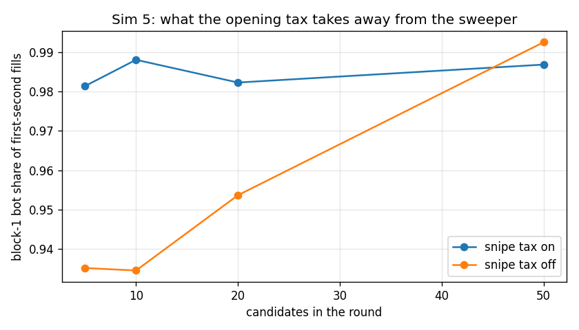
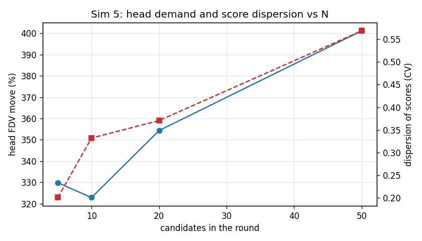

### interpretation

Total interest is held fixed at 5 x A_BASE and split across N candidates by random arrival. The claim that *a round creates demand for the head* is VERIFIED and is close to N-invariant: the round absorbs $16,892 of head token regardless of whether 5 or 50 candidates are competing, which required $36,456 of ETH to enter the family and moved the head's own FDV by 352.1%. That is the flywheel the design is built on and it works: candidates are a demand pump for their parent whether or not any of them wins. What does change with N is concentration - the winner's share of total score falls from 25.6% at N=5 to 5.4% at N=50, and the winning average falls with it, so a crowded round is much more likely to miss the threshold entirely even though the head got the same demand. On the snipe tax: the block-1 sweeper takes 95% of first-second fills with the tax off and 98% with it on, at a cost of $311 per round in tax. The tax does not stop the sweep, it prices it - and at these curve slopes it does not even price it fully: the sweeper still books a mean P&L of $445 per round with the tax on ($8,110 with it off), because paying 99% on a buy at the very bottom of a curve that then rises two orders of magnitude inside ten minutes is still a good trade. The tax cuts the sweeper's edge by roughly 95% and turns it break-even only in the crowded rounds where the pot is split many ways.

*Modelling notes:* Head demand is measured by re-buying the absorbed parent through the ETH edge on a fresh genesis chain (exact-output route), so it includes the 1% edge fee and the hop fee.

## Sim 6 - Fee equilibrium: split sweep and the sell-tax question

**Claim under test:** find the split; report sell-tax sensitivity honestly  
**Runtime:** 3.1 s

### split sweep

| creator_share | ancestor_split | developer_usd | creator_usd_total | creator_usd_per_round | ancestor_sleeve_usd | reinforcement_usd | flywheel_usd | genesis_usd | genesis_share_of_pot |
|---|---|---|---|---|---|---|---|---|---|
| 0.3 | 25/75 | 1e+04 | 1.5e+04 | 750 | 6,250 | 1.875e+04 | 2.5e+04 | 1,877 | 0.03754 |
| 0.3 | 50/50 | 1e+04 | 1.5e+04 | 750 | 1.25e+04 | 1.25e+04 | 2.5e+04 | 3,754 | 0.07507 |
| 0.3 | 75/25 | 1e+04 | 1.5e+04 | 750 | 1.875e+04 | 6,250 | 2.5e+04 | 5,630 | 0.1126 |
| 0.4 | 25/75 | 1e+04 | 2e+04 | 1,000 | 5,000 | 1.5e+04 | 2e+04 | 1,501 | 0.03003 |
| 0.4 | 50/50 | 1e+04 | 2e+04 | 1,000 | 1e+04 | 1e+04 | 2e+04 | 3,003 | 0.06006 |
| 0.4 | 75/25 | 1e+04 | 2e+04 | 1,000 | 1.5e+04 | 5,000 | 2e+04 | 4,504 | 0.09009 |
| 0.5 | 25/75 | 1e+04 | 2.5e+04 | 1,250 | 3,750 | 1.125e+04 | 1.5e+04 | 1,126 | 0.02252 |
| 0.5 | 50/50 | 1e+04 | 2.5e+04 | 1,250 | 7,500 | 7,500 | 1.5e+04 | 2,252 | 0.04504 |
| 0.5 | 75/25 | 1e+04 | 2.5e+04 | 1,250 | 1.125e+04 | 3,750 | 1.5e+04 | 3,378 | 0.06757 |

CSV: `docs/results/sim06_split_sweep_final.csv`

### sell tax sweep

| buy_fee_pct | sell_fee_pct | round_trip_fee_pct | epsilon | volume_index | fee_pot_usd | developer_usd | creator_usd | flywheel_usd | p_clean_run_to_20 | mean_rounds_to_reach |
|---|---|---|---|---|---|---|---|---|---|---|
| 1 | 1 | 2 | 0.5 | 1 | 5e+04 | 1e+04 | 2e+04 | 2e+04 | 0.405 | 20.78 |
| 1 | 1 | 2 | 1 | 1 | 5e+04 | 1e+04 | 2e+04 | 2e+04 | 0.395 | 20.86 |
| 1 | 1 | 2 | 1.5 | 1 | 5e+04 | 1e+04 | 2e+04 | 2e+04 | 0.325 | 20.91 |
| 1 | 2 | 3 | 0.5 | 0.8165 | 6.124e+04 | 1.225e+04 | 2.449e+04 | 2.449e+04 | 0.205 | 21.5 |
| 1 | 2 | 3 | 1 | 0.6667 | 5e+04 | 1e+04 | 2e+04 | 2e+04 | 0.085 | 22.18 |
| 1 | 2 | 3 | 1.5 | 0.5443 | 4.082e+04 | 8,165 | 1.633e+04 | 1.633e+04 | 0.01 | 23 |
| 1 | 3 | 4 | 0.5 | 0.7071 | 7.071e+04 | 1.414e+04 | 2.828e+04 | 2.828e+04 | 0.11 | 21.9 |
| 1 | 3 | 4 | 1 | 0.5 | 5e+04 | 1e+04 | 2e+04 | 2e+04 | 0.015 | 23.38 |
| 1 | 3 | 4 | 1.5 | 0.3536 | 3.536e+04 | 7,071 | 1.414e+04 | 1.414e+04 | 0 | 25.62 |
| 1 | 5 | 6 | 0.5 | 0.5774 | 8.66e+04 | 1.732e+04 | 3.464e+04 | 3.464e+04 | 0.025 | 22.95 |
| 1 | 5 | 6 | 1 | 0.3333 | 5e+04 | 1e+04 | 2e+04 | 2e+04 | 0 | 26.01 |
| 1 | 5 | 6 | 1.5 | 0.1925 | 2.887e+04 | 5,774 | 1.155e+04 | 1.155e+04 | 0 | 30.32 |
| 1 | 10 | 11 | 0.5 | 0.4264 | 1.173e+05 | 2.345e+04 | 4.69e+04 | 4.69e+04 | 0 | 24.41 |
| 1 | 10 | 11 | 1 | 0.1818 | 5e+04 | 1e+04 | 2e+04 | 2e+04 | 0 | 30.82 |
| 1 | 10 | 11 | 1.5 | 0.07753 | 2.132e+04 | 4,264 | 8,528 | 8,528 | 0 | 39.38 |

CSV: `docs/results/sim06_sell_tax_sweep_final.csv`

### figures

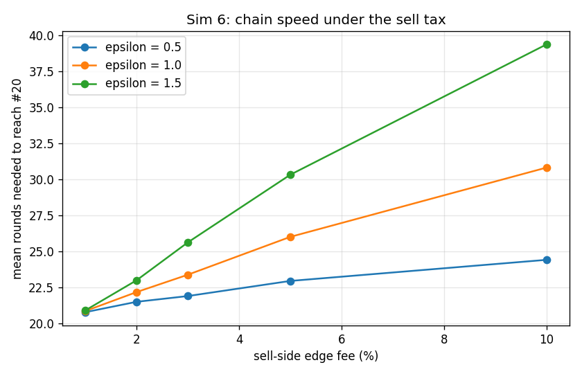

### interpretation

Over 20 generations at $250,000 of ETH-edge volume per round, the 1% fee collects $50,000. The split is a pure allocation question and the recommendation is **creator 40%, flywheel remainder 50/50** (developer $10,000, creators $20,000 = $1,000 per launch, ancestor sleeve $10,000, reinforcement $10,000): 30% underpays the only party who has to do work before a round exists, 50% starves the flywheel that is the product's actual differentiator, and a 25/75 or 75/25 tilt of the remainder moves less money than one noisy round does. On the sell tax the honest answer is that the sign of the effect is entirely an empirical question the simulation cannot settle: revenue scales as rt^(1 - epsilon), so at epsilon = 0.5 raising the sell fee from 1% to 10% raises the pot from $50,000 to $117,260, at epsilon = 1.0 it is exactly flat at $50,000, and at epsilon = 1.5 it *falls* from $50,000 to $21,320. Survival is not ambiguous in the same way: because volume and round interest move together, the chain slows down: at epsilon = 1.0 reaching #20 takes 20.9 rounds at 1%/1% and 30.8 rounds at 1%/10%, and the share of chains that get there without a single failed round falls from 40% to 0%. A sell tax is therefore a bet that memecoin traders are fee-insensitive (epsilon < 1) paid for with chain liveness, and the 1/1 symmetric fee is the only setting that needs no such bet. Recommend keeping 1%/1%.

*Modelling notes:* Volume elasticity is an assumption, not a measurement: volume proportional to (buy + sell fee)^-epsilon, normalised at the 1%/1% schedule, and round interest is assumed to scale with the same index. No empirical elasticity for this market exists.

## Sim 7 - Route depth: 10 / 20 / 50 / 100 links

**Claim under test:** flat fee + best-route keeps deep trading usable  
**Runtime:** 0.4 s

### route depth

| links | dst | size_label | size_eth | size_usd | mode | hops | uses_external | terminal_fdv_usd | edge_fee_usd | hop_fee_legs | total_fee_pct_of_trade | effective_loss_frac | exhausted |
|---|---|---|---|---|---|---|---|---|---|---|---|---|---|
| 10 | 9 | $1,000 | 0.25 | 1,000 | FULL_LINE | 10 | no | 1.886e+06 | 10 | 10 | 0.0175 | 0.0364 | no |
| 10 | 9 | $1,000 | 0.25 | 1,000 | BEST | 5 | yes | 1.886e+06 | 0 | 5 | 0.00375 | 0.01869 | no |
| 10 | 9 | $1,000 | 0.25 | 1,000 | DEPTH_CAPPED(5) | 5 | yes | 1.886e+06 | 0 | 5 | 0.00375 | 0.01869 | no |
| 10 | 9 | $5,000 | 1.25 | 5,000 | FULL_LINE | 10 | no | 1.886e+06 | 50 | 10 | 0.0175 | 0.1056 | no |
| 10 | 9 | $5,000 | 1.25 | 5,000 | BEST | 5 | yes | 1.886e+06 | 0 | 5 | 0.00375 | 0.06641 | no |
| 10 | 9 | $5,000 | 1.25 | 5,000 | DEPTH_CAPPED(5) | 5 | yes | 1.886e+06 | 0 | 5 | 0.00375 | 0.06641 | no |
| 10 | 9 | $10,000 | 2.5 | 1e+04 | FULL_LINE | 10 | no | 1.886e+06 | 100 | 10 | 0.0175 | 0.1792 | no |
| 10 | 9 | $10,000 | 2.5 | 1e+04 | BEST | 5 | yes | 1.886e+06 | 0 | 5 | 0.00375 | 0.1199 | no |
| 10 | 9 | $10,000 | 2.5 | 1e+04 | DEPTH_CAPPED(5) | 5 | yes | 1.886e+06 | 0 | 5 | 0.00375 | 0.1199 | no |
| 10 | 9 | 0.5% of terminal FDV | 2.358 | 9,431 | FULL_LINE | 10 | no | 1.886e+06 | 94.31 | 10 | 0.0175 | 0.1714 | no |
| 10 | 9 | 0.5% of terminal FDV | 2.358 | 9,431 | BEST | 5 | yes | 1.886e+06 | 0 | 5 | 0.00375 | 0.1141 | no |
| 10 | 9 | 0.5% of terminal FDV | 2.358 | 9,431 | DEPTH_CAPPED(5) | 5 | yes | 1.886e+06 | 0 | 5 | 0.00375 | 0.1141 | no |
| 20 | 19 | $1,000 | 0.25 | 1,000 | FULL_LINE | 20 | no | 1.886e+06 | 10 | 20 | 0.025 | 0.0616 | no |
| 20 | 19 | $1,000 | 0.25 | 1,000 | BEST | 2 | yes | 1.886e+06 | 0 | 2 | 0.0015 | 0.01065 | no |
| 20 | 19 | $1,000 | 0.25 | 1,000 | DEPTH_CAPPED(5) | 2 | yes | 1.886e+06 | 0 | 2 | 0.0015 | 0.01065 | no |
| 20 | 19 | $5,000 | 1.25 | 5,000 | FULL_LINE | 20 | no | 1.886e+06 | 50 | 20 | 0.025 | 0.1848 | no |
| 20 | 19 | $5,000 | 1.25 | 5,000 | BEST | 2 | yes | 1.886e+06 | 0 | 2 | 0.0015 | 0.03733 | no |
| 20 | 19 | $5,000 | 1.25 | 5,000 | DEPTH_CAPPED(5) | 2 | yes | 1.886e+06 | 0 | 2 | 0.0015 | 0.03733 | no |
| 20 | 19 | $10,000 | 2.5 | 1e+04 | FULL_LINE | 20 | no | 1.886e+06 | 100 | 20 | 0.025 | 0.2998 | no |
| 20 | 19 | $10,000 | 2.5 | 1e+04 | BEST | 2 | yes | 1.886e+06 | 0 | 2 | 0.0015 | 0.06872 | no |
| 20 | 19 | $10,000 | 2.5 | 1e+04 | DEPTH_CAPPED(5) | 2 | yes | 1.886e+06 | 0 | 2 | 0.0015 | 0.06872 | no |
| 20 | 19 | 0.5% of terminal FDV | 2.358 | 9,431 | FULL_LINE | 20 | no | 1.886e+06 | 94.31 | 20 | 0.025 | 0.2884 | no |
| 20 | 19 | 0.5% of terminal FDV | 2.358 | 9,431 | BEST | 2 | yes | 1.886e+06 | 0 | 2 | 0.0015 | 0.06526 | no |
| 20 | 19 | 0.5% of terminal FDV | 2.358 | 9,431 | DEPTH_CAPPED(5) | 2 | yes | 1.886e+06 | 0 | 2 | 0.0015 | 0.06526 | no |
| 50 | 49 | $1,000 | 0.25 | 1,000 | FULL_LINE | 50 | no | 1.886e+06 | 10 | 50 | 0.0475 | 0.1308 | no |
| 50 | 49 | $1,000 | 0.25 | 1,000 | BEST | 7 | yes | 1.886e+06 | 0 | 7 | 0.00525 | 0.02399 | no |
| 50 | 49 | $1,000 | 0.25 | 1,000 | DEPTH_CAPPED(5) | 7 | yes | 1.886e+06 | 0 | 7 | 0.00525 | 0.02399 | no |
| 50 | 49 | $5,000 | 1.25 | 5,000 | FULL_LINE | 50 | no | 1.886e+06 | 50 | 50 | 0.0475 | 0.3581 | no |
| 50 | 49 | $5,000 | 1.25 | 5,000 | BEST | 7 | yes | 1.886e+06 | 0 | 7 | 0.00525 | 0.08487 | no |
| 50 | 49 | $5,000 | 1.25 | 5,000 | DEPTH_CAPPED(5) | 7 | yes | 1.886e+06 | 0 | 7 | 0.00525 | 0.08487 | no |
| 50 | 49 | $10,000 | 2.5 | 1e+04 | FULL_LINE | 50 | no | 1.886e+06 | 100 | 50 | 0.0475 | 0.5162 | no |
| 50 | 49 | $10,000 | 2.5 | 1e+04 | BEST | 7 | yes | 1.886e+06 | 0 | 7 | 0.00525 | 0.1511 | no |
| 50 | 49 | $10,000 | 2.5 | 1e+04 | DEPTH_CAPPED(5) | 7 | yes | 1.886e+06 | 0 | 7 | 0.00525 | 0.1511 | no |
| 50 | 49 | 0.5% of terminal FDV | 2.358 | 9,431 | FULL_LINE | 50 | no | 1.886e+06 | 94.31 | 50 | 0.0475 | 0.5023 | no |
| 50 | 49 | 0.5% of terminal FDV | 2.358 | 9,431 | BEST | 7 | yes | 1.886e+06 | 0 | 7 | 0.00525 | 0.144 | no |
| 50 | 49 | 0.5% of terminal FDV | 2.358 | 9,431 | DEPTH_CAPPED(5) | 7 | yes | 1.886e+06 | 0 | 7 | 0.00525 | 0.144 | no |
| 100 | 99 | $1,000 | 0.25 | 1,000 | FULL_LINE | 100 | no | 1.886e+06 | 10 | 100 | 0.085 | 0.2286 | no |
| 100 | 99 | $1,000 | 0.25 | 1,000 | BEST | 1 | yes | 1.886e+06 | 0 | 1 | 7.500e-04 | 0.007945 | no |
| 100 | 99 | $1,000 | 0.25 | 1,000 | DEPTH_CAPPED(5) | 1 | yes | 1.886e+06 | 0 | 1 | 7.500e-04 | 0.007945 | no |
| 100 | 99 | $5,000 | 1.25 | 5,000 | FULL_LINE | 100 | no | 1.886e+06 | 50 | 100 | 0.085 | 0.5298 | no |
| 100 | 99 | $5,000 | 1.25 | 5,000 | BEST | 1 | yes | 1.886e+06 | 0 | 1 | 7.500e-04 | 0.02725 | no |
| 100 | 99 | $5,000 | 1.25 | 5,000 | DEPTH_CAPPED(5) | 1 | yes | 1.886e+06 | 0 | 1 | 7.500e-04 | 0.02725 | no |
| 100 | 99 | $10,000 | 2.5 | 1e+04 | FULL_LINE | 100 | no | 1.886e+06 | 100 | 100 | 0.085 | 0.684 | no |
| 100 | 99 | $10,000 | 2.5 | 1e+04 | BEST | 1 | yes | 1.886e+06 | 0 | 1 | 7.500e-04 | 0.05034 | no |
| 100 | 99 | $10,000 | 2.5 | 1e+04 | DEPTH_CAPPED(5) | 1 | yes | 1.886e+06 | 0 | 1 | 7.500e-04 | 0.05034 | no |
| 100 | 99 | 0.5% of terminal FDV | 2.358 | 9,431 | FULL_LINE | 100 | no | 1.886e+06 | 94.31 | 100 | 0.085 | 0.6717 | no |
| 100 | 99 | 0.5% of terminal FDV | 2.358 | 9,431 | BEST | 1 | yes | 1.886e+06 | 0 | 1 | 7.500e-04 | 0.04777 | no |
| 100 | 99 | 0.5% of terminal FDV | 2.358 | 9,431 | DEPTH_CAPPED(5) | 1 | yes | 1.886e+06 | 0 | 1 | 7.500e-04 | 0.04777 | no |

CSV: `docs/results/sim07_route_depth_final.csv`

### external share

| links | mode | frac_routes_going_external |
|---|---|---|
| 10 | BEST | 1 |
| 10 | DEPTH_CAPPED(5) | 1 |
| 20 | BEST | 1 |
| 20 | DEPTH_CAPPED(5) | 1 |
| 50 | BEST | 1 |
| 50 | DEPTH_CAPPED(5) | 1 |
| 100 | BEST | 1 |
| 100 | DEPTH_CAPPED(5) | 1 |

CSV: `docs/results/sim07_external_share_final.csv`

### figures

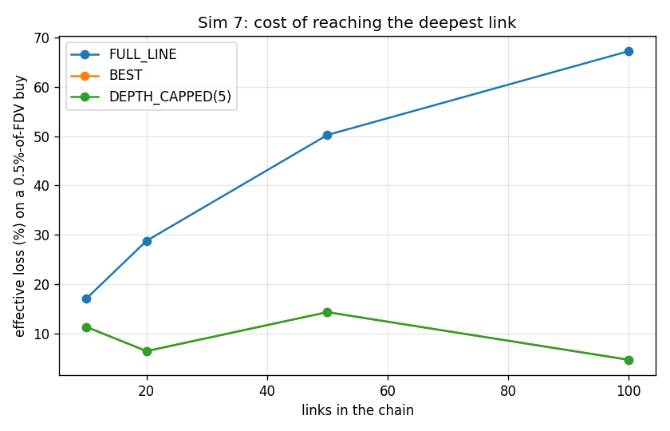
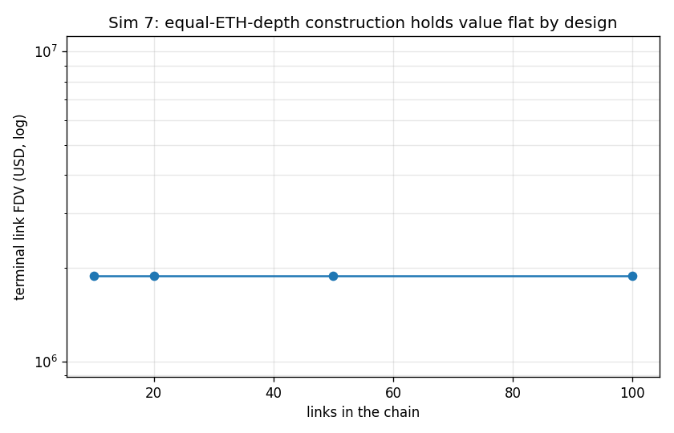

### interpretation

Equal-ETH-depth chain with external ETH markets on 20% of links. The claim is VERIFIED for the *fee* and FALSIFIED for *usable* at the deep end, and the two failures have different causes. Fees behave exactly as designed: the 1% edge fee is paid once no matter how deep the route goes, so total fee on a full-line trade is 1% + hops x 7.5 bps - 1.75% at 10 links and 8.50% at 100 links. Price impact, not fees, is what breaks: at a constant 0.5%-of-FDV trade the full-line effective loss rises from 17.14% to 67.17%, because the trade crosses every pool below the target and each crossing moves a price that the next leg then pays. BEST and DEPTH_CAPPED(5) fix exactly that: they hand 100% of routes to an external ETH market, cutting the hop count to whatever sits below the deepest market. That is the mitigation and it works - but it is also the leak: every route that goes external pays the external market's fee instead of the family's 1% edge fee, so the same mechanism that keeps deep trading usable is the mechanism that starves the flywheel. Hop fee sizing (Q5, 0.05-0.1%) is confirmed: at 7.5 bps even a 100-hop route pays 7.5% in hop fees, which is the same order as the edge fee itself and is the real ceiling on chain length. 0 of 48 quoted routes exhausted the terminal pool at fixed dollar sizes.

*Modelling notes:* Absolute dollar sizes are reported alongside a size normalised to the terminal link's own FDV, because on the brief-literal chain (Sim 1) a $10k trade exceeds the entire market cap of any link past about #6 and the comparison degenerates.

## Sim 8 - Sell cascades from #10: WALL vs SINGLE-like

**Claim under test:** the wall is a threshold cascade (architect's prediction)  
**Runtime:** 0.2 s

### cascade path

| curve | step | cum_tokens_sold | cum_tokens_frac_of_float | cum_parent_released | fdv_parent | drawdown |
|---|---|---|---|---|---|---|
| WALL_LIKE | 0 | 0 | 0 | 0 | 1.000e+09 | 0 |
| WALL_LIKE | 1 | 8.497e+06 | 0.01 | 8.204e+06 | 9.336e+08 | 0.0664 |
| WALL_LIKE | 2 | 1.699e+07 | 0.02 | 1.587e+07 | 8.736e+08 | 0.1264 |
| WALL_LIKE | 3 | 2.549e+07 | 0.03 | 2.305e+07 | 8.192e+08 | 0.1808 |
| WALL_LIKE | 4 | 3.399e+07 | 0.04 | 2.980e+07 | 7.697e+08 | 0.2303 |
| WALL_LIKE | 5 | 4.248e+07 | 0.05 | 3.614e+07 | 7.246e+08 | 0.2754 |
| WALL_LIKE | 6 | 5.098e+07 | 0.06 | 4.211e+07 | 6.858e+08 | 0.3142 |
| WALL_LIKE | 7 | 5.948e+07 | 0.07 | 4.784e+07 | 6.630e+08 | 0.337 |
| WALL_LIKE | 8 | 6.798e+07 | 0.08 | 5.338e+07 | 6.413e+08 | 0.3587 |
| WALL_LIKE | 9 | 7.647e+07 | 0.09 | 5.873e+07 | 6.207e+08 | 0.3793 |
| WALL_LIKE | 10 | 8.497e+07 | 0.1 | 6.392e+07 | 6.011e+08 | 0.3989 |
| WALL_LIKE | 11 | 9.347e+07 | 0.11 | 6.894e+07 | 5.823e+08 | 0.4177 |
| WALL_LIKE | 12 | 1.020e+08 | 0.12 | 7.381e+07 | 5.645e+08 | 0.4355 |
| WALL_LIKE | 13 | 1.105e+08 | 0.13 | 7.853e+07 | 5.474e+08 | 0.4526 |
| WALL_LIKE | 14 | 1.190e+08 | 0.14 | 8.311e+07 | 5.311e+08 | 0.4689 |
| WALL_LIKE | 15 | 1.275e+08 | 0.15 | 8.755e+07 | 5.155e+08 | 0.4845 |
| WALL_LIKE | 16 | 1.360e+08 | 0.16 | 9.186e+07 | 5.006e+08 | 0.4994 |
| WALL_LIKE | 17 | 1.444e+08 | 0.17 | 9.605e+07 | 4.863e+08 | 0.5137 |
| WALL_LIKE | 18 | 1.529e+08 | 0.18 | 1.001e+08 | 4.727e+08 | 0.5273 |
| WALL_LIKE | 19 | 1.614e+08 | 0.19 | 1.041e+08 | 4.596e+08 | 0.5404 |
| WALL_LIKE | 20 | 1.699e+08 | 0.2 | 1.079e+08 | 4.470e+08 | 0.553 |
| WALL_LIKE | 21 | 1.784e+08 | 0.21 | 1.117e+08 | 4.350e+08 | 0.565 |
| WALL_LIKE | 22 | 1.869e+08 | 0.22 | 1.153e+08 | 4.234e+08 | 0.5766 |
| WALL_LIKE | 23 | 1.954e+08 | 0.23 | 1.189e+08 | 4.123e+08 | 0.5877 |
| WALL_LIKE | 24 | 2.039e+08 | 0.24 | 1.223e+08 | 4.016e+08 | 0.5984 |
| WALL_LIKE | 25 | 2.124e+08 | 0.25 | 1.257e+08 | 3.913e+08 | 0.6087 |
| WALL_LIKE | 26 | 2.209e+08 | 0.26 | 1.290e+08 | 3.814e+08 | 0.6186 |
| WALL_LIKE | 27 | 2.294e+08 | 0.27 | 1.322e+08 | 3.719e+08 | 0.6281 |
| WALL_LIKE | 28 | 2.379e+08 | 0.28 | 1.353e+08 | 3.627e+08 | 0.6373 |
| WALL_LIKE | 29 | 2.464e+08 | 0.29 | 1.383e+08 | 3.539e+08 | 0.6461 |
| WALL_LIKE | 30 | 2.549e+08 | 0.3 | 1.413e+08 | 3.454e+08 | 0.6546 |
| WALL_LIKE | 31 | 2.634e+08 | 0.31 | 1.442e+08 | 3.372e+08 | 0.6628 |
| WALL_LIKE | 32 | 2.719e+08 | 0.32 | 1.470e+08 | 3.293e+08 | 0.6707 |
| WALL_LIKE | 33 | 2.804e+08 | 0.33 | 1.498e+08 | 3.216e+08 | 0.6784 |
| WALL_LIKE | 34 | 2.889e+08 | 0.34 | 1.525e+08 | 3.143e+08 | 0.6857 |
| WALL_LIKE | 35 | 2.974e+08 | 0.35 | 1.551e+08 | 3.071e+08 | 0.6929 |
| WALL_LIKE | 36 | 3.059e+08 | 0.36 | 1.577e+08 | 3.002e+08 | 0.6998 |
| WALL_LIKE | 37 | 3.144e+08 | 0.37 | 1.602e+08 | 2.936e+08 | 0.7064 |
| WALL_LIKE | 38 | 3.229e+08 | 0.38 | 1.627e+08 | 2.871e+08 | 0.7129 |
| WALL_LIKE | 39 | 3.314e+08 | 0.39 | 1.651e+08 | 2.809e+08 | 0.7191 |
| WALL_LIKE | 40 | 3.399e+08 | 0.4 | 1.675e+08 | 2.749e+08 | 0.7251 |
| WALL_LIKE | 41 | 3.484e+08 | 0.41 | 1.698e+08 | 2.690e+08 | 0.731 |
| WALL_LIKE | 42 | 3.569e+08 | 0.42 | 1.720e+08 | 2.634e+08 | 0.7366 |
| WALL_LIKE | 43 | 3.654e+08 | 0.43 | 1.742e+08 | 2.579e+08 | 0.7421 |
| WALL_LIKE | 44 | 3.739e+08 | 0.44 | 1.764e+08 | 2.526e+08 | 0.7474 |
| WALL_LIKE | 45 | 3.824e+08 | 0.45 | 1.785e+08 | 2.475e+08 | 0.7525 |
| WALL_LIKE | 46 | 3.909e+08 | 0.46 | 1.806e+08 | 2.425e+08 | 0.7575 |
| WALL_LIKE | 47 | 3.994e+08 | 0.47 | 1.826e+08 | 2.376e+08 | 0.7624 |
| WALL_LIKE | 48 | 4.079e+08 | 0.48 | 1.846e+08 | 2.329e+08 | 0.7671 |
| WALL_LIKE | 49 | 4.164e+08 | 0.49 | 1.866e+08 | 2.284e+08 | 0.7716 |
| WALL_LIKE | 50 | 4.248e+08 | 0.5 | 1.885e+08 | 2.239e+08 | 0.7761 |
| WALL_LIKE | 51 | 4.333e+08 | 0.51 | 1.904e+08 | 2.196e+08 | 0.7804 |
| WALL_LIKE | 52 | 4.418e+08 | 0.52 | 1.922e+08 | 2.155e+08 | 0.7845 |
| WALL_LIKE | 53 | 4.503e+08 | 0.53 | 1.941e+08 | 2.114e+08 | 0.7886 |
| WALL_LIKE | 54 | 4.588e+08 | 0.54 | 1.958e+08 | 2.075e+08 | 0.7925 |
| WALL_LIKE | 55 | 4.673e+08 | 0.55 | 1.976e+08 | 2.036e+08 | 0.7964 |
| WALL_LIKE | 56 | 4.758e+08 | 0.56 | 1.993e+08 | 1.999e+08 | 0.8001 |
| WALL_LIKE | 57 | 4.843e+08 | 0.57 | 2.010e+08 | 1.963e+08 | 0.8037 |
| WALL_LIKE | 58 | 4.928e+08 | 0.58 | 2.026e+08 | 1.927e+08 | 0.8073 |
| WALL_LIKE | 59 | 5.013e+08 | 0.59 | 2.043e+08 | 1.893e+08 | 0.8107 |
| WALL_LIKE | 60 | 5.098e+08 | 0.6 | 2.058e+08 | 1.859e+08 | 0.8141 |
| WALL_LIKE | 61 | 5.183e+08 | 0.61 | 2.074e+08 | 1.827e+08 | 0.8173 |
| WALL_LIKE | 62 | 5.268e+08 | 0.62 | 2.089e+08 | 1.795e+08 | 0.8205 |
| WALL_LIKE | 63 | 5.353e+08 | 0.63 | 2.105e+08 | 1.764e+08 | 0.8236 |
| WALL_LIKE | 64 | 5.438e+08 | 0.64 | 2.119e+08 | 1.734e+08 | 0.8266 |
| WALL_LIKE | 65 | 5.523e+08 | 0.65 | 2.134e+08 | 1.546e+08 | 0.8454 |
| WALL_LIKE | 66 | 5.608e+08 | 0.66 | 2.145e+08 | 1.143e+08 | 0.8857 |
| WALL_LIKE | 67 | 5.693e+08 | 0.67 | 2.154e+08 | 8.786e+07 | 0.9121 |
| WALL_LIKE | 68 | 5.778e+08 | 0.68 | 2.160e+08 | 6.966e+07 | 0.9303 |
| WALL_LIKE | 69 | 5.863e+08 | 0.69 | 2.166e+08 | 5.657e+07 | 0.9434 |
| WALL_LIKE | 70 | 5.948e+08 | 0.7 | 2.170e+08 | 4.686e+07 | 0.9531 |
| WALL_LIKE | 71 | 6.033e+08 | 0.71 | 2.174e+08 | 3.945e+07 | 0.9606 |
| WALL_LIKE | 72 | 6.118e+08 | 0.72 | 2.177e+08 | 3.366e+07 | 0.9663 |
| WALL_LIKE | 73 | 6.203e+08 | 0.73 | 2.179e+08 | 2.907e+07 | 0.9709 |
| WALL_LIKE | 74 | 6.288e+08 | 0.74 | 2.182e+08 | 2.535e+07 | 0.9747 |
| WALL_LIKE | 75 | 6.373e+08 | 0.75 | 2.184e+08 | 2.230e+07 | 0.9777 |
| WALL_LIKE | 76 | 6.458e+08 | 0.76 | 2.185e+08 | 1.977e+07 | 0.9802 |
| WALL_LIKE | 77 | 6.543e+08 | 0.77 | 2.187e+08 | 1.765e+07 | 0.9823 |
| WALL_LIKE | 78 | 6.628e+08 | 0.78 | 2.188e+08 | 1.585e+07 | 0.9841 |
| WALL_LIKE | 79 | 6.713e+08 | 0.79 | 2.190e+08 | 1.432e+07 | 0.9857 |
| WALL_LIKE | 80 | 6.798e+08 | 0.8 | 2.191e+08 | 1.299e+07 | 0.987 |
| WALL_LIKE | 81 | 6.883e+08 | 0.81 | 2.192e+08 | 1.185e+07 | 0.9882 |
| WALL_LIKE | 82 | 6.968e+08 | 0.82 | 2.193e+08 | 1.084e+07 | 0.9892 |
| WALL_LIKE | 83 | 7.052e+08 | 0.83 | 2.194e+08 | 9.963e+06 | 0.99 |
| WALL_LIKE | 84 | 7.137e+08 | 0.84 | 2.195e+08 | 9.185e+06 | 0.9908 |
| WALL_LIKE | 85 | 7.222e+08 | 0.85 | 2.195e+08 | 8.496e+06 | 0.9915 |
| WALL_LIKE | 86 | 7.307e+08 | 0.86 | 2.196e+08 | 7.881e+06 | 0.9921 |
| WALL_LIKE | 87 | 7.392e+08 | 0.87 | 2.197e+08 | 7.330e+06 | 0.9927 |
| WALL_LIKE | 88 | 7.477e+08 | 0.88 | 2.197e+08 | 6.835e+06 | 0.9932 |
| WALL_LIKE | 89 | 7.562e+08 | 0.89 | 2.198e+08 | 6.389e+06 | 0.9936 |
| WALL_LIKE | 90 | 7.647e+08 | 0.9 | 2.198e+08 | 5.985e+06 | 0.994 |
| WALL_LIKE | 91 | 7.732e+08 | 0.91 | 2.199e+08 | 5.618e+06 | 0.9944 |
| WALL_LIKE | 92 | 7.817e+08 | 0.92 | 2.199e+08 | 5.284e+06 | 0.9947 |
| WALL_LIKE | 93 | 7.902e+08 | 0.93 | 2.200e+08 | 4.979e+06 | 0.995 |
| WALL_LIKE | 94 | 7.987e+08 | 0.94 | 2.200e+08 | 4.700e+06 | 0.9953 |
| WALL_LIKE | 95 | 8.072e+08 | 0.95 | 2.201e+08 | 4.443e+06 | 0.9956 |
| WALL_LIKE | 96 | 8.157e+08 | 0.96 | 2.201e+08 | 4.207e+06 | 0.9958 |
| WALL_LIKE | 97 | 8.242e+08 | 0.97 | 2.201e+08 | 3.989e+06 | 0.996 |
| WALL_LIKE | 98 | 8.327e+08 | 0.98 | 2.202e+08 | 3.788e+06 | 0.9962 |
| WALL_LIKE | 99 | 8.412e+08 | 0.99 | 2.202e+08 | 3.601e+06 | 0.9964 |
| SINGLE_LIKE | 0 | 0 | 0 | 0 | 1.000e+09 | 0 |
| SINGLE_LIKE | 1 | 8.498e+06 | 0.01 | 8.114e+06 | 9.132e+08 | 0.08682 |
| SINGLE_LIKE | 2 | 1.700e+07 | 0.02 | 1.554e+07 | 8.372e+08 | 0.1628 |
| SINGLE_LIKE | 3 | 2.549e+07 | 0.03 | 2.236e+07 | 7.703e+08 | 0.2297 |
| SINGLE_LIKE | 4 | 3.399e+07 | 0.04 | 2.864e+07 | 7.111e+08 | 0.2889 |
| SINGLE_LIKE | 5 | 4.249e+07 | 0.05 | 3.445e+07 | 6.585e+08 | 0.3415 |
| SINGLE_LIKE | 6 | 5.099e+07 | 0.06 | 3.984e+07 | 6.115e+08 | 0.3885 |
| SINGLE_LIKE | 7 | 5.948e+07 | 0.07 | 4.485e+07 | 5.694e+08 | 0.4306 |
| SINGLE_LIKE | 8 | 6.798e+07 | 0.08 | 4.952e+07 | 5.315e+08 | 0.4685 |
| SINGLE_LIKE | 9 | 7.648e+07 | 0.09 | 5.389e+07 | 4.972e+08 | 0.5028 |
| SINGLE_LIKE | 10 | 8.498e+07 | 0.1 | 5.798e+07 | 4.662e+08 | 0.5338 |
| SINGLE_LIKE | 11 | 9.348e+07 | 0.11 | 6.182e+07 | 4.380e+08 | 0.562 |
| SINGLE_LIKE | 12 | 1.020e+08 | 0.12 | 6.542e+07 | 4.122e+08 | 0.5878 |
| SINGLE_LIKE | 13 | 1.105e+08 | 0.13 | 6.882e+07 | 3.887e+08 | 0.6113 |
| SINGLE_LIKE | 14 | 1.190e+08 | 0.14 | 7.203e+07 | 3.671e+08 | 0.6329 |
| SINGLE_LIKE | 15 | 1.275e+08 | 0.15 | 7.506e+07 | 3.473e+08 | 0.6527 |
| SINGLE_LIKE | 16 | 1.360e+08 | 0.16 | 7.793e+07 | 3.290e+08 | 0.671 |
| SINGLE_LIKE | 17 | 1.445e+08 | 0.17 | 8.065e+07 | 3.122e+08 | 0.6878 |
| SINGLE_LIKE | 18 | 1.530e+08 | 0.18 | 8.324e+07 | 2.966e+08 | 0.7034 |
| SINGLE_LIKE | 19 | 1.615e+08 | 0.19 | 8.569e+07 | 2.821e+08 | 0.7179 |
| SINGLE_LIKE | 20 | 1.700e+08 | 0.2 | 8.803e+07 | 2.687e+08 | 0.7313 |
| SINGLE_LIKE | 21 | 1.785e+08 | 0.21 | 9.026e+07 | 2.562e+08 | 0.7438 |
| SINGLE_LIKE | 22 | 1.870e+08 | 0.22 | 9.239e+07 | 2.446e+08 | 0.7554 |
| SINGLE_LIKE | 23 | 1.954e+08 | 0.23 | 9.442e+07 | 2.337e+08 | 0.7663 |
| SINGLE_LIKE | 24 | 2.039e+08 | 0.24 | 9.636e+07 | 2.236e+08 | 0.7764 |
| SINGLE_LIKE | 25 | 2.124e+08 | 0.25 | 9.821e+07 | 2.140e+08 | 0.786 |
| SINGLE_LIKE | 26 | 2.209e+08 | 0.26 | 9.999e+07 | 2.051e+08 | 0.7949 |
| SINGLE_LIKE | 27 | 2.294e+08 | 0.27 | 1.017e+08 | 1.968e+08 | 0.8032 |
| SINGLE_LIKE | 28 | 2.379e+08 | 0.28 | 1.033e+08 | 1.889e+08 | 0.8111 |
| SINGLE_LIKE | 29 | 2.464e+08 | 0.29 | 1.049e+08 | 1.815e+08 | 0.8185 |
| SINGLE_LIKE | 30 | 2.549e+08 | 0.3 | 1.064e+08 | 1.745e+08 | 0.8255 |
| SINGLE_LIKE | 31 | 2.634e+08 | 0.31 | 1.079e+08 | 1.679e+08 | 0.8321 |
| SINGLE_LIKE | 32 | 2.719e+08 | 0.32 | 1.093e+08 | 1.617e+08 | 0.8383 |
| SINGLE_LIKE | 33 | 2.804e+08 | 0.33 | 1.106e+08 | 1.558e+08 | 0.8442 |
| SINGLE_LIKE | 34 | 2.889e+08 | 0.34 | 1.119e+08 | 1.503e+08 | 0.8497 |
| SINGLE_LIKE | 35 | 2.974e+08 | 0.35 | 1.132e+08 | 1.450e+08 | 0.855 |
| SINGLE_LIKE | 36 | 3.059e+08 | 0.36 | 1.144e+08 | 1.400e+08 | 0.86 |
| SINGLE_LIKE | 37 | 3.144e+08 | 0.37 | 1.156e+08 | 1.353e+08 | 0.8647 |
| SINGLE_LIKE | 38 | 3.229e+08 | 0.38 | 1.167e+08 | 1.308e+08 | 0.8692 |
| SINGLE_LIKE | 39 | 3.314e+08 | 0.39 | 1.178e+08 | 1.265e+08 | 0.8735 |
| SINGLE_LIKE | 40 | 3.399e+08 | 0.4 | 1.188e+08 | 1.224e+08 | 0.8776 |
| SINGLE_LIKE | 41 | 3.484e+08 | 0.41 | 1.199e+08 | 1.185e+08 | 0.8815 |
| SINGLE_LIKE | 42 | 3.569e+08 | 0.42 | 1.208e+08 | 1.148e+08 | 0.8852 |
| SINGLE_LIKE | 43 | 3.654e+08 | 0.43 | 1.218e+08 | 1.113e+08 | 0.8887 |
| SINGLE_LIKE | 44 | 3.739e+08 | 0.44 | 1.227e+08 | 1.079e+08 | 0.8921 |
| SINGLE_LIKE | 45 | 3.824e+08 | 0.45 | 1.236e+08 | 1.047e+08 | 0.8953 |
| SINGLE_LIKE | 46 | 3.909e+08 | 0.46 | 1.245e+08 | 1.016e+08 | 0.8984 |
| SINGLE_LIKE | 47 | 3.994e+08 | 0.47 | 1.254e+08 | 9.867e+07 | 0.9013 |
| SINGLE_LIKE | 48 | 4.079e+08 | 0.48 | 1.262e+08 | 9.585e+07 | 0.9041 |
| SINGLE_LIKE | 49 | 4.164e+08 | 0.49 | 1.270e+08 | 9.315e+07 | 0.9068 |
| SINGLE_LIKE | 50 | 4.249e+08 | 0.5 | 1.278e+08 | 9.057e+07 | 0.9094 |
| SINGLE_LIKE | 51 | 4.334e+08 | 0.51 | 1.285e+08 | 8.809e+07 | 0.9119 |
| SINGLE_LIKE | 52 | 4.419e+08 | 0.52 | 1.293e+08 | 8.571e+07 | 0.9143 |
| SINGLE_LIKE | 53 | 4.504e+08 | 0.53 | 1.300e+08 | 8.342e+07 | 0.9166 |
| SINGLE_LIKE | 54 | 4.589e+08 | 0.54 | 1.307e+08 | 8.123e+07 | 0.9188 |
| SINGLE_LIKE | 55 | 4.674e+08 | 0.55 | 1.314e+08 | 7.912e+07 | 0.9209 |
| SINGLE_LIKE | 56 | 4.759e+08 | 0.56 | 1.320e+08 | 7.709e+07 | 0.9229 |
| SINGLE_LIKE | 57 | 4.844e+08 | 0.57 | 1.327e+08 | 7.514e+07 | 0.9249 |
| SINGLE_LIKE | 58 | 4.929e+08 | 0.58 | 1.333e+08 | 7.326e+07 | 0.9267 |
| SINGLE_LIKE | 59 | 5.014e+08 | 0.59 | 1.339e+08 | 7.145e+07 | 0.9285 |
| SINGLE_LIKE | 60 | 5.099e+08 | 0.6 | 1.345e+08 | 6.971e+07 | 0.9303 |
| SINGLE_LIKE | 61 | 5.184e+08 | 0.61 | 1.351e+08 | 6.803e+07 | 0.932 |
| SINGLE_LIKE | 62 | 5.269e+08 | 0.62 | 1.357e+08 | 6.641e+07 | 0.9336 |
| SINGLE_LIKE | 63 | 5.354e+08 | 0.63 | 1.362e+08 | 6.485e+07 | 0.9352 |
| SINGLE_LIKE | 64 | 5.439e+08 | 0.64 | 1.368e+08 | 6.334e+07 | 0.9367 |
| SINGLE_LIKE | 65 | 5.524e+08 | 0.65 | 1.373e+08 | 6.189e+07 | 0.9381 |
| SINGLE_LIKE | 66 | 5.609e+08 | 0.66 | 1.378e+08 | 6.048e+07 | 0.9395 |
| SINGLE_LIKE | 67 | 5.694e+08 | 0.67 | 1.383e+08 | 5.912e+07 | 0.9409 |
| SINGLE_LIKE | 68 | 5.778e+08 | 0.68 | 1.388e+08 | 5.781e+07 | 0.9422 |
| SINGLE_LIKE | 69 | 5.863e+08 | 0.69 | 1.393e+08 | 5.654e+07 | 0.9435 |
| SINGLE_LIKE | 70 | 5.948e+08 | 0.7 | 1.398e+08 | 5.531e+07 | 0.9447 |
| SINGLE_LIKE | 71 | 6.033e+08 | 0.71 | 1.403e+08 | 5.412e+07 | 0.9459 |
| SINGLE_LIKE | 72 | 6.118e+08 | 0.72 | 1.407e+08 | 5.297e+07 | 0.947 |
| SINGLE_LIKE | 73 | 6.203e+08 | 0.73 | 1.412e+08 | 5.185e+07 | 0.9481 |
| SINGLE_LIKE | 74 | 6.288e+08 | 0.74 | 1.416e+08 | 5.077e+07 | 0.9492 |
| SINGLE_LIKE | 75 | 6.373e+08 | 0.75 | 1.420e+08 | 4.973e+07 | 0.9503 |
| SINGLE_LIKE | 76 | 6.458e+08 | 0.76 | 1.424e+08 | 4.871e+07 | 0.9513 |
| SINGLE_LIKE | 77 | 6.543e+08 | 0.77 | 1.428e+08 | 4.773e+07 | 0.9523 |
| SINGLE_LIKE | 78 | 6.628e+08 | 0.78 | 1.432e+08 | 4.678e+07 | 0.9532 |
| SINGLE_LIKE | 79 | 6.713e+08 | 0.79 | 1.436e+08 | 4.585e+07 | 0.9542 |
| SINGLE_LIKE | 80 | 6.798e+08 | 0.8 | 1.440e+08 | 4.495e+07 | 0.955 |
| SINGLE_LIKE | 81 | 6.883e+08 | 0.81 | 1.444e+08 | 4.408e+07 | 0.9559 |
| SINGLE_LIKE | 82 | 6.968e+08 | 0.82 | 1.448e+08 | 4.323e+07 | 0.9568 |
| SINGLE_LIKE | 83 | 7.053e+08 | 0.83 | 1.451e+08 | 4.241e+07 | 0.9576 |
| SINGLE_LIKE | 84 | 7.138e+08 | 0.84 | 1.455e+08 | 4.161e+07 | 0.9584 |
| SINGLE_LIKE | 85 | 7.223e+08 | 0.85 | 1.458e+08 | 4.083e+07 | 0.9592 |
| SINGLE_LIKE | 86 | 7.308e+08 | 0.86 | 1.462e+08 | 4.007e+07 | 0.9599 |
| SINGLE_LIKE | 87 | 7.393e+08 | 0.87 | 1.465e+08 | 3.934e+07 | 0.9607 |
| SINGLE_LIKE | 88 | 7.478e+08 | 0.88 | 1.469e+08 | 3.862e+07 | 0.9614 |
| SINGLE_LIKE | 89 | 7.563e+08 | 0.89 | 1.472e+08 | 3.793e+07 | 0.9621 |
| SINGLE_LIKE | 90 | 7.648e+08 | 0.9 | 1.475e+08 | 3.725e+07 | 0.9627 |
| SINGLE_LIKE | 91 | 7.733e+08 | 0.91 | 1.478e+08 | 3.659e+07 | 0.9634 |
| SINGLE_LIKE | 92 | 7.818e+08 | 0.92 | 1.481e+08 | 3.595e+07 | 0.9641 |
| SINGLE_LIKE | 93 | 7.903e+08 | 0.93 | 1.484e+08 | 3.532e+07 | 0.9647 |
| SINGLE_LIKE | 94 | 7.988e+08 | 0.94 | 1.487e+08 | 3.472e+07 | 0.9653 |
| SINGLE_LIKE | 95 | 8.073e+08 | 0.95 | 1.490e+08 | 3.412e+07 | 0.9659 |
| SINGLE_LIKE | 96 | 8.158e+08 | 0.96 | 1.493e+08 | 3.354e+07 | 0.9665 |
| SINGLE_LIKE | 97 | 8.243e+08 | 0.97 | 1.496e+08 | 3.298e+07 | 0.967 |
| SINGLE_LIKE | 98 | 8.328e+08 | 0.98 | 1.499e+08 | 3.243e+07 | 0.9676 |
| SINGLE_LIKE | 99 | 8.413e+08 | 0.99 | 1.501e+08 | 3.190e+07 | 0.9681 |
| SINGLE_LIKE | 100 | 8.498e+08 | 1 | 1.504e+08 | 3.137e+07 | 0.9686 |

CSV: `docs/results/sim08_cascade_path_final.csv`

### per link drawdown

| curve | link | drawdown |
|---|---|---|
| WALL_LIKE | 0 | 0 |
| WALL_LIKE | 1 | 0 |
| WALL_LIKE | 2 | 0 |
| WALL_LIKE | 3 | 0 |
| WALL_LIKE | 4 | 0 |
| WALL_LIKE | 5 | 0 |
| WALL_LIKE | 6 | 0 |
| WALL_LIKE | 7 | 0 |
| WALL_LIKE | 8 | 0 |
| WALL_LIKE | 9 | 0 |
| WALL_LIKE | 10 | 0.7761 |
| WALL_LIKE | 11 | 0.7761 |
| SINGLE_LIKE | 0 | 0 |
| SINGLE_LIKE | 1 | 0 |
| SINGLE_LIKE | 2 | 0 |
| SINGLE_LIKE | 3 | 0 |
| SINGLE_LIKE | 4 | 0 |
| SINGLE_LIKE | 5 | 0 |
| SINGLE_LIKE | 6 | 0 |
| SINGLE_LIKE | 7 | 0 |
| SINGLE_LIKE | 8 | 0 |
| SINGLE_LIKE | 9 | 0 |
| SINGLE_LIKE | 10 | 0.9094 |
| SINGLE_LIKE | 11 | 0.9094 |

CSV: `docs/results/sim08_per_link_drawdown_final.csv`

### parent released

| curve | decline_pct | parent_released | parent_released_per_pct | parent_released_usd |
|---|---|---|---|---|
| WALL_LIKE | 0.05 | 6.156e+06 | 1.231e+06 | 5,582 |
| WALL_LIKE | 0.1 | 1.248e+07 | 1.248e+06 | 1.131e+04 |
| WALL_LIKE | 0.25 | 3.257e+07 | 1.303e+06 | 2.953e+04 |
| WALL_LIKE | 0.5 | 9.211e+07 | 1.842e+06 | 8.352e+04 |
| WALL_LIKE | 0.75 | 1.776e+08 | 2.368e+06 | 1.61e+05 |
| SINGLE_LIKE | 0.05 | 4.631e+06 | 9.263e+05 | 6,161 |
| SINGLE_LIKE | 0.1 | 9.386e+06 | 9.386e+05 | 1.249e+04 |
| SINGLE_LIKE | 0.25 | 2.451e+07 | 9.802e+05 | 3.26e+04 |
| SINGLE_LIKE | 0.5 | 5.357e+07 | 1.071e+06 | 7.127e+04 |
| SINGLE_LIKE | 0.75 | 9.146e+07 | 1.219e+06 | 1.217e+05 |

CSV: `docs/results/sim08_parent_released_final.csv`

### bands

| curve | band | fdv_lower | fdv_upper | buyout_cost_parent | tokens_in_band |
|---|---|---|---|---|---|
| WALL_LIKE | 0 | 3.428e+06 | 1.714e+08 | 7.272e+06 | 3.000e+08 |
| WALL_LIKE | 1 | 1.714e+08 | 6.894e+08 | 1.719e+08 | 5.000e+08 |
| WALL_LIKE | 2 | 6.894e+08 | 6.861e+09 | 4.350e+08 | 2.000e+08 |
| SINGLE_LIKE | 0 | 3.137e+07 | 3.131e+10 | 9.910e+08 | 1.000e+09 |

CSV: `docs/results/sim08_bands_final.csv`

### cliff

| curve | acceleration_at_frac_of_float | step_drawdown | trailing_10_step_drawdown | acceleration_ratio |
|---|---|---|---|---|
| WALL_LIKE | 0.66 | 0.04037 | 0.004899 | 8.241 |
| SINGLE_LIKE | 1 | 5.228e-04 | 6.033e-04 | 0.8665 |

CSV: `docs/results/sim08_cliff_final.csv`

### figures

### interpretation

Both chains are built with the same 85% float and the same ETH depth per link, so the only difference is curve shape, and the whole float is dumped in 100 equal clips. The architect's prediction is VERIFIED in shape and REVERSED in sign, which is the useful result. Shape first: the WALL curve is a threshold cascade. The discriminating measurement is acceleration - a clip that is larger than the ten clips before it. A convex curve can never do that, and SINGLE-like does not: its worst acceleration is 0.87x trend at 100% of float. The wall hits 8.24x trend at 66% of float, taking 4.0% off the FDV in a single clip against a trailing average of 0.49%. The cliff sits where the closed form says it must: the wall band is worth s*sqrt(Fa*Fb) = 1.72e+08 parent, and cumulative releases to sellers when the cascade fires are 2.15e+08 parent - the band above the wall plus the wall itself, drained. Sign second: over the *whole* dump the wall is the safer curve, not the more dangerous one - after 50% of float it is down 77.6% against 90.9% for SINGLE-like, and it hands back 1.46x as much embedded parent on the way down. That is the real trade: a wall buys a genuinely better price floor and pays for it with a discontinuity that is fully predictable from the deploy constants - anyone can compute the exact cumulative-sell level at which it fires, and will. Every descendant of #10 inherits the same drawdown through the telescoping price product; every ancestor is untouched, which is the one genuinely good property in this scenario.

*Modelling notes:* Drawdowns are measured with no external markets attached, so the shock cannot feed back down the line; that is the optimistic case for ancestors.

## Sim 9 - Reinforcement vs burn over 20 rounds, then a 50% shock

**Claim under test:** bid liquidity beats burn  
**Runtime:** 0.2 s

### policies

| policy | rounds | eth_deployed | usd_deployed | parent_deposited | tokens_burned | burned_frac_of_supply | depth_within_20pct_parent | depth_within_50pct_parent | fdv_pre_shock | fdv_post_shock | shock_drawdown | eth_price_post_shock | drawdown_vs_none | depth_gain_vs_none |
|---|---|---|---|---|---|---|---|---|---|---|---|---|---|---|
| SINGLE_SIDED_BID | 20 | 5 | 2e+04 | 8.117e+06 | 0 | 0 | 3.611e+07 | 8.215e+07 | 1.000e+09 | 2.541e+08 | 0.7459 | 1.944e-07 | -0.03131 | 0.1096 |
| BUY_AND_BURN | 20 | 5 | 2e+04 | 0 | 7.870e+06 | 0.00787 | 2.885e+07 | 8.004e+07 | 1.062e+09 | 2.496e+08 | 0.765 | 1.909e-07 | -0.01219 | 0.08106 |
| TWO_SIDED | 20 | 5 | 2e+04 | 4.083e+06 | 0 | 0 | 3.277e+07 | 8.148e+07 | 1.028e+09 | 2.515e+08 | 0.7554 | 1.924e-07 | -0.02175 | 0.1005 |
| NONE | 0 | 0 | 0 | 0 | 0 | 0 | 2.799e+07 | 7.404e+07 | 1.000e+09 | 2.228e+08 | 0.7772 | 1.051e-07 | 0 | 0 |

CSV: `docs/results/sim09_policies_final.csv`

### figures

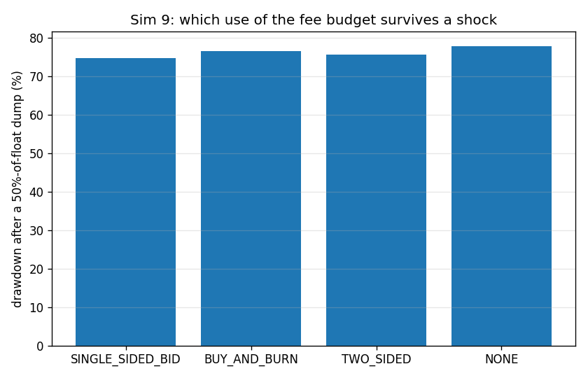
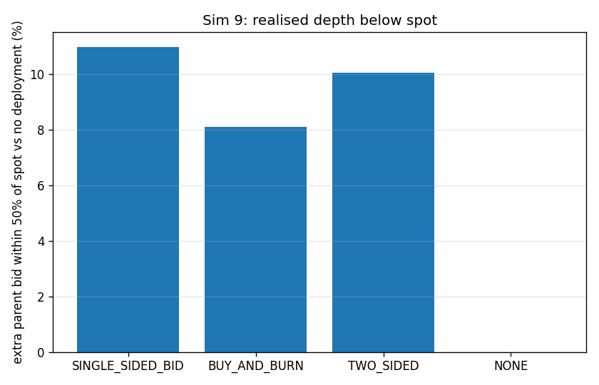

### interpretation

Each policy gets the same $1,000 per round for 20 rounds ($20,000 total flywheel budget) on an equal-ETH-depth chain, then link #7 eats a 50%-of-float dump. The claim *bid liquidity beats burn* is VERIFIED but the margin is small at realistic budgets. SINGLE_SIDED_BID leaves the link 74.6% down against 76.5% for BUY_AND_BURN and 77.7% for no deployment at all, and it adds 10.96% to the parent bid sitting within 50% of spot - real, permanent, protocol-owned depth that the burn simply does not create. Burn spends the same money buying 0.7870% of supply and destroying it: the price pops on the way in and then there is nothing underneath, which is precisely why the design review told us to delete it. TWO_SIDED lands between the two (75.5%) because half its budget is spent buying the token it then re-lists as an ask, i.e. it funds its own overhead. The honest caveat is scale: the brief's own 2%-of-reserve per-call cap plus a fee budget of this size means the bid is a rounding error against a determined seller - the mechanism is right, the magnitude only matters once edge volume is orders of magnitude larger than assumed here.

*Modelling notes:* The shock is a fixed token quantity (50% of the *baseline* float) for every policy, so burn is not rewarded for having shrunk the float it is then shocked with. Deposited bids are flattened into a non-overlapping tick ladder (`flatten_pool`) before the shock, otherwise the sequential range walk in the swap kernel would skip the curve liquidity the bid overlaps and make a reinforced pool look *worse* than an untouched one.

## Sim 10 - Genesis economics: is the U-shape a genesis tax funnel?

**Claim under test:** no genesis tax funnel  
**Runtime:** 0.3 s

### genesis share

| depth_M | Z_M | genesis_share_of_sleeve | newest_ancestor_share | min_weight_share | genesis_over_newest | even_split_share | genesis_over_even | with_10pct_floor | floor_multiple |
|---|---|---|---|---|---|---|---|---|---|
| 5 | 5.8 | 0.3448 | 0.1724 | 0.07543 | 2 | 0.1667 | 2.069 | 0.4103 | 1.19 |
| 20 | 18.2 | 0.1099 | 0.05495 | 0.02404 | 2 | 0.04762 | 2.308 | 0.1989 | 1.81 |
| 100 | 84.84 | 0.02357 | 0.01179 | 0.005157 | 2 | 0.009901 | 2.381 | 0.1212 | 5.142 |
| 1000 | 834.8 | 0.002396 | 0.001198 | 5.241e-04 | 2 | 9.990e-04 | 2.398 | 0.1022 | 42.64 |

CSV: `docs/results/sim10_genesis_share_final.csv`

### genesis locked

| generations | edge_volume_usd | protocol_fee_usd | ancestor_sleeve_usd | genesis_usd | genesis_share_of_sleeve | forfeited_bonds_eth | forfeited_bonds_usd | eth_locked_under_genesis_usd |
|---|---|---|---|---|---|---|---|---|
| 20 | 5.000e+06 | 5e+04 | 1e+04 | 3,003 | 0.3003 | 0.4 | 1,600 | 4,603 |

CSV: `docs/results/sim10_genesis_locked_final.csv`

### figures

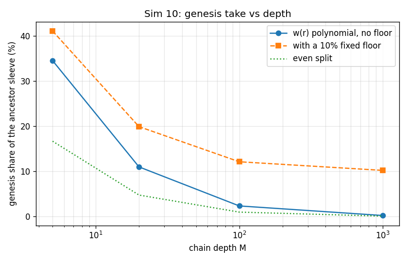

### interpretation

Pure arithmetic on w(r) = 2 - 5r + 4r^2 with Z(M) = (M+1)(5M+4)/(6M), plus the ledger from 20 generations of edge volume. The claim *no genesis tax funnel* is VERIFIED. Genesis takes 34.5% of the ancestor sleeve at M = 5 and 0.240% at M = 1000 - it decays as 12/(5M) for large M, i.e. genesis's cut goes to zero as the chain grows, and it is only 2.40x an even split at any depth. Genesis is permanently worth exactly 2x the newest ancestor and never more, by construction of w(0) = 2 and w(1) = 1. The deleted 10% fixed floor is what a funnel would have looked like: it would hand genesis 10.2% of every sleeve at M = 1000, which is 43x the polynomial's own answer and would grow without bound relative to it. Dropping it (attack-log Q6) was correct. In absolute terms genesis accumulates $3,003 of sleeve plus $1,600 of forfeited bonds over 20 generations at $250,000 of edge volume per round - real but modest, and delivered as protocol-owned bid liquidity under genesis rather than as a withdrawal.

*Modelling notes:* Deep-M rows are arithmetic only: no simulation reaches M = 1000, and Sim 1 shows the brief-literal chain loses ETH-denominated relevance long before it.
