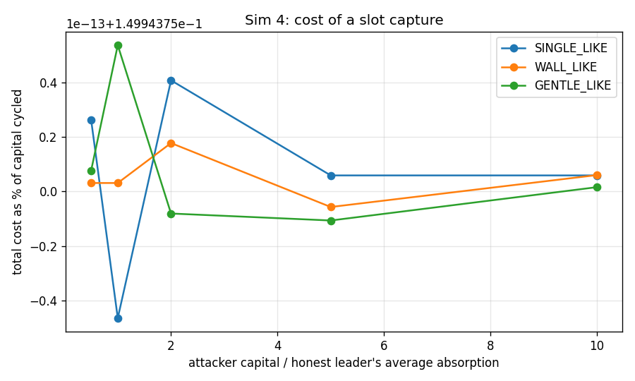
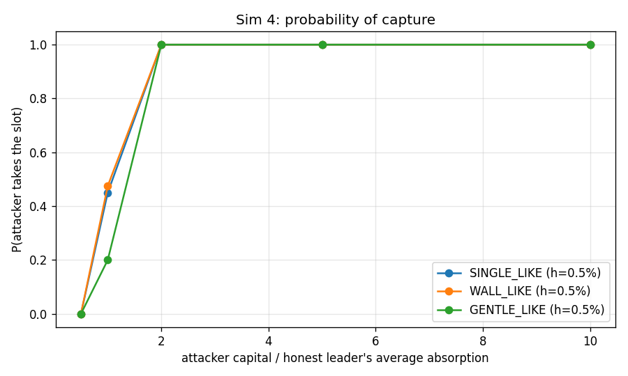
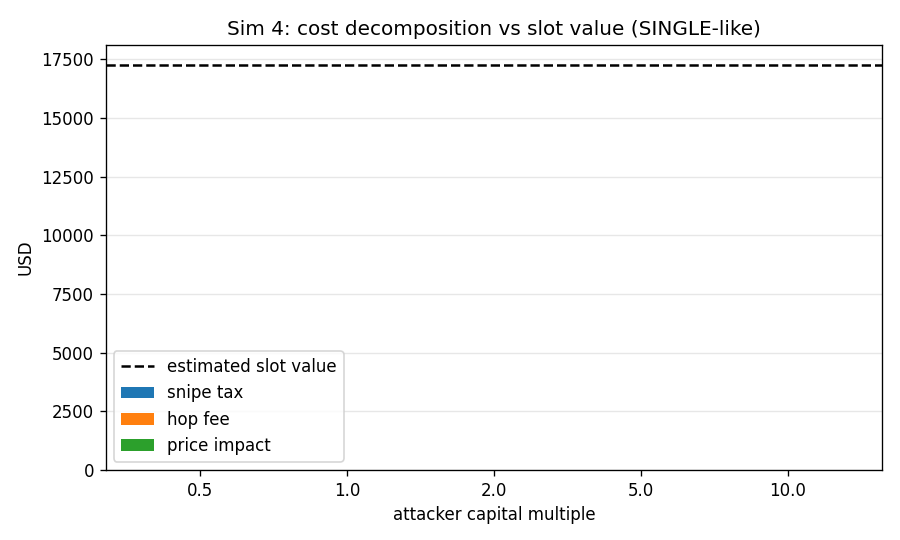
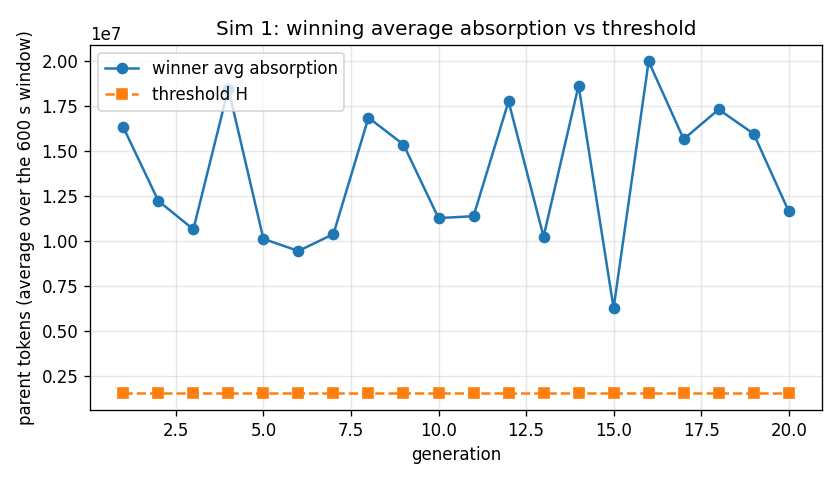
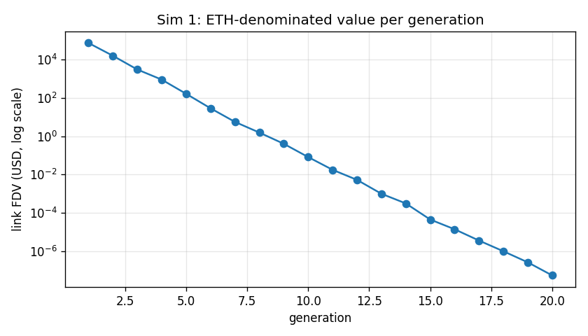
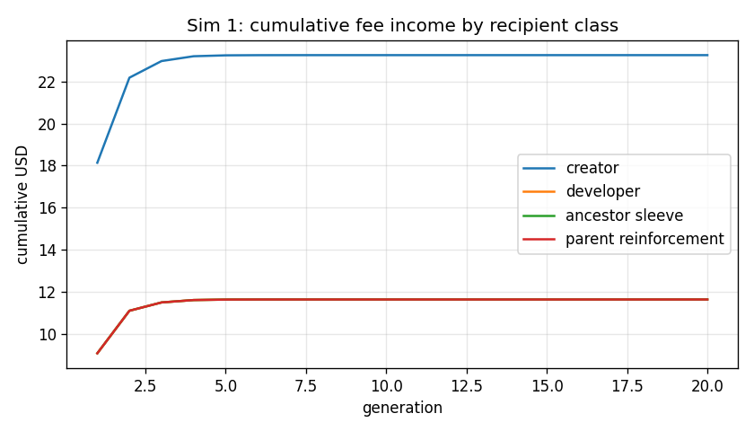
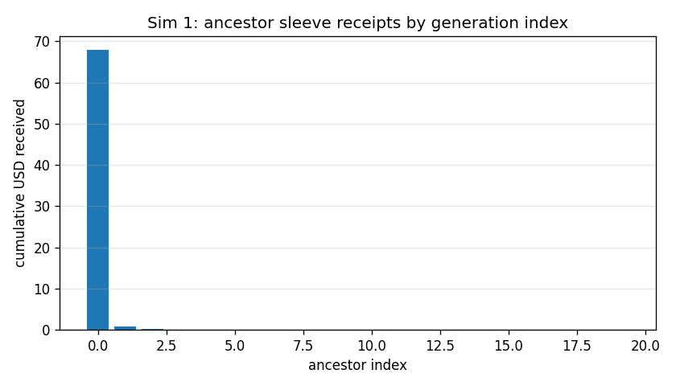
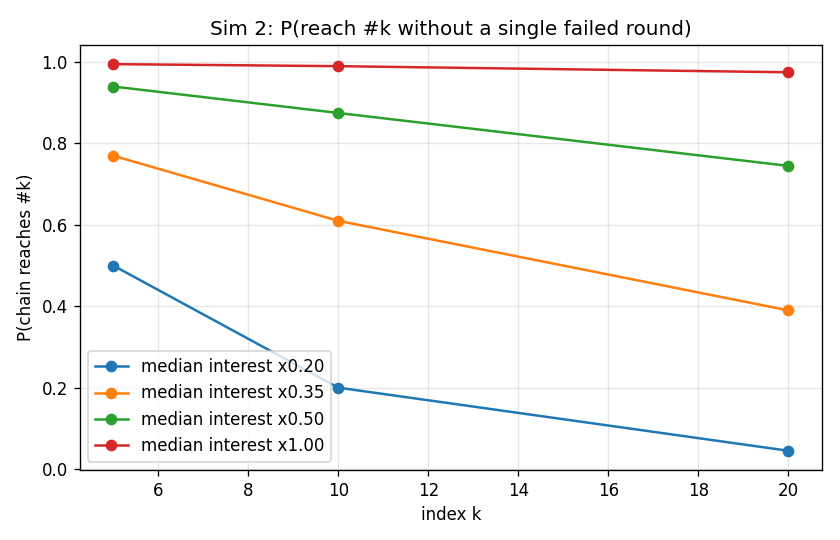
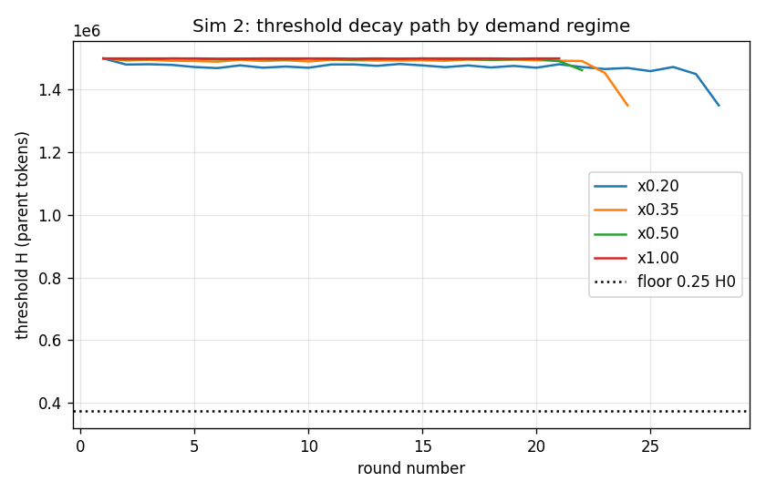

# Simulation results

Generated by `python -m sim.scenarios --all`. Every table here also exists as a CSV in `docs/results/` and every figure as a PNG in `docs/figures/`.

Scenarios in this file: Sim 4, Sim 1, Sim 2. Scale `full`. Total runtime 16.1 s.

## Common assumptions
| assumption | value |
|---|---|
| RNG seed | 20260910 (each scenario uses `Random(SEED + n)`, so `--only n` reproduces `--all`) |
| parent supply, every link | 1e+09 tokens |
| standard curve | `curves.self_similar(P)` default: 99.1% of supply over FDV `a0*P` -> `1e3*a0*P`, 0.9% tail to `1e6*a0*P`, `a0 = 1e-3` |
| hop fee `f_hop` | 7.5 bps, parent side, every family swap |
| protocol fee | 1% on the ETH side of the genesis pool only |
| developer | 20% of the protocol fee |
| creator | 40% baseline (swept in Sim 6) |
| flywheel remainder | 40%, split 50%/50% ancestor sleeve / immediate-parent reinforcement (swept in Sim 6) |
| round | 180 s registration, 600 s trading, 3 s snipe tax (99% -> 1%), 300 s submission |
| threshold | `h = 0.50%` of parent supply as an *average* absorption, decay x0.9 per failed round, floor 25% |
| demand model | per-candidate "interest" is lognormal (sigma = 0.6); interest 1.0 absorbs A_BASE = 13,000,000 parent tokens over the window |
| USD | genesis FDV = $250,000 at 62.5 ETH, i.e. $4,000/ETH and $2.50e-04 per genesis token |
| ETH-edge volume | $250,000 per round where a scenario needs an exogenous figure |

Everything on the trust path is **parent-denominated**: scores, thresholds, absorption
and embedded liquidity are quoted in parent tokens (written "parent" below).  Only the
ETH edge and the fee ledger are quoted in ETH/USD.

## Contents

- [Sim 4 - Adversarial succession: what a slot actually costs](#sim-4)
- [Sim 1 - Lifecycle: GENESIS to #20, 5 candidates per round](#sim-1)
- [Sim 2 - Stochastic chains: 200 Monte Carlo runs per demand regime](#sim-2)

## Sim 4 - Adversarial succession: what a slot actually costs

**Claim under test:** slot capture costs ~= fees  
**Runtime:** 13.2 s

### honest baseline

| curve | honest_leader_avg_absorption_parent | honest_leader_avg_usd | rounds |
|---|---|---|---|
| SINGLE_LIKE | 6.406e+06 | 1,601 | 20 |
| WALL_LIKE | 6.353e+06 | 1,588 | 20 |
| GENTLE_LIKE | 6.080e+06 | 1,520 | 20 |
| OVERRIDE | 6.511e+06 | 1,628 | 20 |

CSV: `docs/results/sim04_honest_baseline_ladder.csv`

### capture raw

| curve | strategy | capital_multiple | capital_parent | capital_usd | trial | attacker_avg | best_honest_avg | is_top | snipe_fees | hop_fees | protocol_fees | price_impact_loss | round_trip_loss | mark_to_market | capital_deployed | cost_parent | cost_usd | cost_pct_of_capital | fee_share_of_cost | win_h0.0025 | win_h0.005 | win_h0.01 | win_h0.0015 |
|---|---|---|---|---|---|---|---|---|---|---|---|---|---|---|---|---|---|---|---|---|---|---|---|
| SINGLE_LIKE | self_fund_win | 0.5 | 3.203e+06 | 800.7 | 0 | 3.184e+06 | 6.628e+06 | no | 0 | 4,802 | 0 | 5.930e-10 | 4,802 | 0 | 3.203e+06 | 4,802 | 1.201 | 0.001499 | 1 | no | no | no | no |
| SINGLE_LIKE | self_fund_win | 0.5 | 3.203e+06 | 800.7 | 1 | 3.184e+06 | 5.086e+06 | no | 0 | 4,802 | 0 | 5.930e-10 | 4,802 | 0 | 3.203e+06 | 4,802 | 1.201 | 0.001499 | 1 | no | no | no | no |
| SINGLE_LIKE | self_fund_win | 0.5 | 3.203e+06 | 800.7 | 2 | 3.184e+06 | 7.635e+06 | no | 0 | 4,802 | 0 | 5.930e-10 | 4,802 | 0 | 3.203e+06 | 4,802 | 1.201 | 0.001499 | 1 | no | no | no | no |
| SINGLE_LIKE | self_fund_win | 0.5 | 3.203e+06 | 800.7 | 3 | 3.184e+06 | 6.003e+06 | no | 0 | 4,802 | 0 | 5.930e-10 | 4,802 | 0 | 3.203e+06 | 4,802 | 1.201 | 0.001499 | 1 | no | no | no | no |
| SINGLE_LIKE | self_fund_win | 0.5 | 3.203e+06 | 800.7 | 4 | 3.184e+06 | 7.305e+06 | no | 0 | 4,802 | 0 | 5.930e-10 | 4,802 | 0 | 3.203e+06 | 4,802 | 1.201 | 0.001499 | 1 | no | no | no | no |
| SINGLE_LIKE | self_fund_win | 0.5 | 3.203e+06 | 800.7 | 5 | 3.184e+06 | 5.600e+06 | no | 0 | 4,802 | 0 | 5.930e-10 | 4,802 | 0 | 3.203e+06 | 4,802 | 1.201 | 0.001499 | 1 | no | no | no | no |
| SINGLE_LIKE | self_fund_win | 0.5 | 3.203e+06 | 800.7 | 6 | 3.184e+06 | 6.332e+06 | no | 0 | 4,802 | 0 | 5.930e-10 | 4,802 | 0 | 3.203e+06 | 4,802 | 1.201 | 0.001499 | 1 | no | no | no | no |
| SINGLE_LIKE | self_fund_win | 0.5 | 3.203e+06 | 800.7 | 7 | 3.184e+06 | 6.116e+06 | no | 0 | 4,802 | 0 | 5.930e-10 | 4,802 | 0 | 3.203e+06 | 4,802 | 1.201 | 0.001499 | 1 | no | no | no | no |
| SINGLE_LIKE | self_fund_win | 0.5 | 3.203e+06 | 800.7 | 8 | 3.184e+06 | 5.948e+06 | no | 0 | 4,802 | 0 | 5.930e-10 | 4,802 | 0 | 3.203e+06 | 4,802 | 1.201 | 0.001499 | 1 | no | no | no | no |
| SINGLE_LIKE | self_fund_win | 0.5 | 3.203e+06 | 800.7 | 9 | 3.184e+06 | 6.780e+06 | no | 0 | 4,802 | 0 | 5.930e-10 | 4,802 | 0 | 3.203e+06 | 4,802 | 1.201 | 0.001499 | 1 | no | no | no | no |
| SINGLE_LIKE | self_fund_win | 0.5 | 3.203e+06 | 800.7 | 10 | 3.184e+06 | 6.616e+06 | no | 0 | 4,802 | 0 | 5.930e-10 | 4,802 | 0 | 3.203e+06 | 4,802 | 1.201 | 0.001499 | 1 | no | no | no | no |
| SINGLE_LIKE | self_fund_win | 0.5 | 3.203e+06 | 800.7 | 11 | 3.184e+06 | 6.120e+06 | no | 0 | 4,802 | 0 | 5.930e-10 | 4,802 | 0 | 3.203e+06 | 4,802 | 1.201 | 0.001499 | 1 | no | no | no | no |
| SINGLE_LIKE | self_fund_win | 0.5 | 3.203e+06 | 800.7 | 12 | 3.184e+06 | 6.345e+06 | no | 0 | 4,802 | 0 | 5.930e-10 | 4,802 | 0 | 3.203e+06 | 4,802 | 1.201 | 0.001499 | 1 | no | no | no | no |
| SINGLE_LIKE | self_fund_win | 0.5 | 3.203e+06 | 800.7 | 13 | 3.184e+06 | 6.666e+06 | no | 0 | 4,802 | 0 | 5.930e-10 | 4,802 | 0 | 3.203e+06 | 4,802 | 1.201 | 0.001499 | 1 | no | no | no | no |
| SINGLE_LIKE | self_fund_win | 0.5 | 3.203e+06 | 800.7 | 14 | 3.184e+06 | 5.404e+06 | no | 0 | 4,802 | 0 | 5.930e-10 | 4,802 | 0 | 3.203e+06 | 4,802 | 1.201 | 0.001499 | 1 | no | no | no | no |
| SINGLE_LIKE | self_fund_win | 0.5 | 3.203e+06 | 800.7 | 15 | 3.184e+06 | 7.772e+06 | no | 0 | 4,802 | 0 | 5.930e-10 | 4,802 | 0 | 3.203e+06 | 4,802 | 1.201 | 0.001499 | 1 | no | no | no | no |
| SINGLE_LIKE | self_fund_win | 0.5 | 3.203e+06 | 800.7 | 16 | 3.184e+06 | 7.308e+06 | no | 0 | 4,802 | 0 | 5.930e-10 | 4,802 | 0 | 3.203e+06 | 4,802 | 1.201 | 0.001499 | 1 | no | no | no | no |
| SINGLE_LIKE | self_fund_win | 0.5 | 3.203e+06 | 800.7 | 17 | 3.184e+06 | 7.176e+06 | no | 0 | 4,802 | 0 | 5.930e-10 | 4,802 | 0 | 3.203e+06 | 4,802 | 1.201 | 0.001499 | 1 | no | no | no | no |
| SINGLE_LIKE | self_fund_win | 0.5 | 3.203e+06 | 800.7 | 18 | 3.184e+06 | 7.719e+06 | no | 0 | 4,802 | 0 | 5.930e-10 | 4,802 | 0 | 3.203e+06 | 4,802 | 1.201 | 0.001499 | 1 | no | no | no | no |
| SINGLE_LIKE | self_fund_win | 0.5 | 3.203e+06 | 800.7 | 19 | 3.184e+06 | 6.588e+06 | no | 0 | 4,802 | 0 | 5.930e-10 | 4,802 | 0 | 3.203e+06 | 4,802 | 1.201 | 0.001499 | 1 | no | no | no | no |
| SINGLE_LIKE | self_fund_win | 0.5 | 3.203e+06 | 800.7 | 20 | 3.184e+06 | 6.881e+06 | no | 0 | 4,802 | 0 | 5.930e-10 | 4,802 | 0 | 3.203e+06 | 4,802 | 1.201 | 0.001499 | 1 | no | no | no | no |
| SINGLE_LIKE | self_fund_win | 0.5 | 3.203e+06 | 800.7 | 21 | 3.184e+06 | 6.231e+06 | no | 0 | 4,802 | 0 | 5.930e-10 | 4,802 | 0 | 3.203e+06 | 4,802 | 1.201 | 0.001499 | 1 | no | no | no | no |
| SINGLE_LIKE | self_fund_win | 0.5 | 3.203e+06 | 800.7 | 22 | 3.184e+06 | 4.351e+06 | no | 0 | 4,802 | 0 | 5.930e-10 | 4,802 | 0 | 3.203e+06 | 4,802 | 1.201 | 0.001499 | 1 | no | no | no | no |
| SINGLE_LIKE | self_fund_win | 0.5 | 3.203e+06 | 800.7 | 23 | 3.184e+06 | 5.975e+06 | no | 0 | 4,802 | 0 | 5.930e-10 | 4,802 | 0 | 3.203e+06 | 4,802 | 1.201 | 0.001499 | 1 | no | no | no | no |
| SINGLE_LIKE | self_fund_win | 0.5 | 3.203e+06 | 800.7 | 24 | 3.184e+06 | 5.482e+06 | no | 0 | 4,802 | 0 | 5.930e-10 | 4,802 | 0 | 3.203e+06 | 4,802 | 1.201 | 0.001499 | 1 | no | no | no | no |
| SINGLE_LIKE | self_fund_win | 0.5 | 3.203e+06 | 800.7 | 25 | 3.184e+06 | 7.357e+06 | no | 0 | 4,802 | 0 | 5.930e-10 | 4,802 | 0 | 3.203e+06 | 4,802 | 1.201 | 0.001499 | 1 | no | no | no | no |
| SINGLE_LIKE | self_fund_win | 0.5 | 3.203e+06 | 800.7 | 26 | 3.184e+06 | 7.913e+06 | no | 0 | 4,802 | 0 | 5.930e-10 | 4,802 | 0 | 3.203e+06 | 4,802 | 1.201 | 0.001499 | 1 | no | no | no | no |
| SINGLE_LIKE | self_fund_win | 0.5 | 3.203e+06 | 800.7 | 27 | 3.184e+06 | 6.116e+06 | no | 0 | 4,802 | 0 | 5.930e-10 | 4,802 | 0 | 3.203e+06 | 4,802 | 1.201 | 0.001499 | 1 | no | no | no | no |
| SINGLE_LIKE | self_fund_win | 0.5 | 3.203e+06 | 800.7 | 28 | 3.184e+06 | 6.513e+06 | no | 0 | 4,802 | 0 | 5.930e-10 | 4,802 | 0 | 3.203e+06 | 4,802 | 1.201 | 0.001499 | 1 | no | no | no | no |
| SINGLE_LIKE | self_fund_win | 0.5 | 3.203e+06 | 800.7 | 29 | 3.184e+06 | 7.085e+06 | no | 0 | 4,802 | 0 | 5.930e-10 | 4,802 | 0 | 3.203e+06 | 4,802 | 1.201 | 0.001499 | 1 | no | no | no | no |
| SINGLE_LIKE | self_fund_win | 0.5 | 3.203e+06 | 800.7 | 30 | 3.184e+06 | 5.788e+06 | no | 0 | 4,802 | 0 | 5.930e-10 | 4,802 | 0 | 3.203e+06 | 4,802 | 1.201 | 0.001499 | 1 | no | no | no | no |
| SINGLE_LIKE | self_fund_win | 0.5 | 3.203e+06 | 800.7 | 31 | 3.184e+06 | 5.421e+06 | no | 0 | 4,802 | 0 | 5.930e-10 | 4,802 | 0 | 3.203e+06 | 4,802 | 1.201 | 0.001499 | 1 | no | no | no | no |
| SINGLE_LIKE | self_fund_win | 0.5 | 3.203e+06 | 800.7 | 32 | 3.184e+06 | 6.617e+06 | no | 0 | 4,802 | 0 | 5.930e-10 | 4,802 | 0 | 3.203e+06 | 4,802 | 1.201 | 0.001499 | 1 | no | no | no | no |
| SINGLE_LIKE | self_fund_win | 0.5 | 3.203e+06 | 800.7 | 33 | 3.184e+06 | 7.089e+06 | no | 0 | 4,802 | 0 | 5.930e-10 | 4,802 | 0 | 3.203e+06 | 4,802 | 1.201 | 0.001499 | 1 | no | no | no | no |
| SINGLE_LIKE | self_fund_win | 0.5 | 3.203e+06 | 800.7 | 34 | 3.184e+06 | 6.308e+06 | no | 0 | 4,802 | 0 | 5.930e-10 | 4,802 | 0 | 3.203e+06 | 4,802 | 1.201 | 0.001499 | 1 | no | no | no | no |
| SINGLE_LIKE | self_fund_win | 0.5 | 3.203e+06 | 800.7 | 35 | 3.184e+06 | 6.188e+06 | no | 0 | 4,802 | 0 | 5.930e-10 | 4,802 | 0 | 3.203e+06 | 4,802 | 1.201 | 0.001499 | 1 | no | no | no | no |
| SINGLE_LIKE | self_fund_win | 0.5 | 3.203e+06 | 800.7 | 36 | 3.184e+06 | 7.307e+06 | no | 0 | 4,802 | 0 | 5.930e-10 | 4,802 | 0 | 3.203e+06 | 4,802 | 1.201 | 0.001499 | 1 | no | no | no | no |
| SINGLE_LIKE | self_fund_win | 0.5 | 3.203e+06 | 800.7 | 37 | 3.184e+06 | 7.618e+06 | no | 0 | 4,802 | 0 | 5.930e-10 | 4,802 | 0 | 3.203e+06 | 4,802 | 1.201 | 0.001499 | 1 | no | no | no | no |
| SINGLE_LIKE | self_fund_win | 0.5 | 3.203e+06 | 800.7 | 38 | 3.184e+06 | 6.672e+06 | no | 0 | 4,802 | 0 | 5.930e-10 | 4,802 | 0 | 3.203e+06 | 4,802 | 1.201 | 0.001499 | 1 | no | no | no | no |
| SINGLE_LIKE | self_fund_win | 0.5 | 3.203e+06 | 800.7 | 39 | 3.184e+06 | 7.468e+06 | no | 0 | 4,802 | 0 | 5.930e-10 | 4,802 | 0 | 3.203e+06 | 4,802 | 1.201 | 0.001499 | 1 | no | no | no | no |
| SINGLE_LIKE | self_fund_win | 1 | 6.406e+06 | 1,601 | 0 | 6.368e+06 | 6.823e+06 | no | 0 | 9,605 | 0 | -3.474e-09 | 9,605 | 0 | 6.406e+06 | 9,605 | 2.401 | 0.001499 | 1 | no | no | no | no |
| SINGLE_LIKE | self_fund_win | 1 | 6.406e+06 | 1,601 | 1 | 6.368e+06 | 6.032e+06 | yes | 0 | 9,605 | 0 | -3.474e-09 | 9,605 | 0 | 6.406e+06 | 9,605 | 2.401 | 0.001499 | 1 | yes | yes | no | yes |
| SINGLE_LIKE | self_fund_win | 1 | 6.406e+06 | 1,601 | 2 | 6.368e+06 | 6.542e+06 | no | 0 | 9,605 | 0 | -3.474e-09 | 9,605 | 0 | 6.406e+06 | 9,605 | 2.401 | 0.001499 | 1 | no | no | no | no |
| SINGLE_LIKE | self_fund_win | 1 | 6.406e+06 | 1,601 | 3 | 6.368e+06 | 5.793e+06 | yes | 0 | 9,605 | 0 | -3.474e-09 | 9,605 | 0 | 6.406e+06 | 9,605 | 2.401 | 0.001499 | 1 | yes | yes | no | yes |
| SINGLE_LIKE | self_fund_win | 1 | 6.406e+06 | 1,601 | 4 | 6.368e+06 | 6.360e+06 | yes | 0 | 9,605 | 0 | -3.474e-09 | 9,605 | 0 | 6.406e+06 | 9,605 | 2.401 | 0.001499 | 1 | yes | yes | no | yes |
| SINGLE_LIKE | self_fund_win | 1 | 6.406e+06 | 1,601 | 5 | 6.368e+06 | 7.145e+06 | no | 0 | 9,605 | 0 | -3.474e-09 | 9,605 | 0 | 6.406e+06 | 9,605 | 2.401 | 0.001499 | 1 | no | no | no | no |
| SINGLE_LIKE | self_fund_win | 1 | 6.406e+06 | 1,601 | 6 | 6.368e+06 | 6.306e+06 | yes | 0 | 9,605 | 0 | -3.474e-09 | 9,605 | 0 | 6.406e+06 | 9,605 | 2.401 | 0.001499 | 1 | yes | yes | no | yes |
| SINGLE_LIKE | self_fund_win | 1 | 6.406e+06 | 1,601 | 7 | 6.368e+06 | 7.425e+06 | no | 0 | 9,605 | 0 | -3.474e-09 | 9,605 | 0 | 6.406e+06 | 9,605 | 2.401 | 0.001499 | 1 | no | no | no | no |
| SINGLE_LIKE | self_fund_win | 1 | 6.406e+06 | 1,601 | 8 | 6.368e+06 | 7.105e+06 | no | 0 | 9,605 | 0 | -3.474e-09 | 9,605 | 0 | 6.406e+06 | 9,605 | 2.401 | 0.001499 | 1 | no | no | no | no |
| SINGLE_LIKE | self_fund_win | 1 | 6.406e+06 | 1,601 | 9 | 6.368e+06 | 6.431e+06 | no | 0 | 9,605 | 0 | -3.474e-09 | 9,605 | 0 | 6.406e+06 | 9,605 | 2.401 | 0.001499 | 1 | no | no | no | no |
| SINGLE_LIKE | self_fund_win | 1 | 6.406e+06 | 1,601 | 10 | 6.368e+06 | 5.306e+06 | yes | 0 | 9,605 | 0 | -3.474e-09 | 9,605 | 0 | 6.406e+06 | 9,605 | 2.401 | 0.001499 | 1 | yes | yes | no | yes |
| SINGLE_LIKE | self_fund_win | 1 | 6.406e+06 | 1,601 | 11 | 6.368e+06 | 7.269e+06 | no | 0 | 9,605 | 0 | -3.474e-09 | 9,605 | 0 | 6.406e+06 | 9,605 | 2.401 | 0.001499 | 1 | no | no | no | no |
| SINGLE_LIKE | self_fund_win | 1 | 6.406e+06 | 1,601 | 12 | 6.368e+06 | 5.468e+06 | yes | 0 | 9,605 | 0 | -3.474e-09 | 9,605 | 0 | 6.406e+06 | 9,605 | 2.401 | 0.001499 | 1 | yes | yes | no | yes |
| SINGLE_LIKE | self_fund_win | 1 | 6.406e+06 | 1,601 | 13 | 6.368e+06 | 5.971e+06 | yes | 0 | 9,605 | 0 | -3.474e-09 | 9,605 | 0 | 6.406e+06 | 9,605 | 2.401 | 0.001499 | 1 | yes | yes | no | yes |
| SINGLE_LIKE | self_fund_win | 1 | 6.406e+06 | 1,601 | 14 | 6.368e+06 | 6.983e+06 | no | 0 | 9,605 | 0 | -3.474e-09 | 9,605 | 0 | 6.406e+06 | 9,605 | 2.401 | 0.001499 | 1 | no | no | no | no |
| SINGLE_LIKE | self_fund_win | 1 | 6.406e+06 | 1,601 | 15 | 6.368e+06 | 6.507e+06 | no | 0 | 9,605 | 0 | -3.474e-09 | 9,605 | 0 | 6.406e+06 | 9,605 | 2.401 | 0.001499 | 1 | no | no | no | no |
| SINGLE_LIKE | self_fund_win | 1 | 6.406e+06 | 1,601 | 16 | 6.368e+06 | 7.055e+06 | no | 0 | 9,605 | 0 | -3.474e-09 | 9,605 | 0 | 6.406e+06 | 9,605 | 2.401 | 0.001499 | 1 | no | no | no | no |
| SINGLE_LIKE | self_fund_win | 1 | 6.406e+06 | 1,601 | 17 | 6.368e+06 | 5.577e+06 | yes | 0 | 9,605 | 0 | -3.474e-09 | 9,605 | 0 | 6.406e+06 | 9,605 | 2.401 | 0.001499 | 1 | yes | yes | no | yes |
| SINGLE_LIKE | self_fund_win | 1 | 6.406e+06 | 1,601 | 18 | 6.368e+06 | 5.970e+06 | yes | 0 | 9,605 | 0 | -3.474e-09 | 9,605 | 0 | 6.406e+06 | 9,605 | 2.401 | 0.001499 | 1 | yes | yes | no | yes |
| SINGLE_LIKE | self_fund_win | 1 | 6.406e+06 | 1,601 | 19 | 6.368e+06 | 7.453e+06 | no | 0 | 9,605 | 0 | -3.474e-09 | 9,605 | 0 | 6.406e+06 | 9,605 | 2.401 | 0.001499 | 1 | no | no | no | no |
| SINGLE_LIKE | self_fund_win | 1 | 6.406e+06 | 1,601 | 20 | 6.368e+06 | 5.171e+06 | yes | 0 | 9,605 | 0 | -3.474e-09 | 9,605 | 0 | 6.406e+06 | 9,605 | 2.401 | 0.001499 | 1 | yes | yes | no | yes |
| SINGLE_LIKE | self_fund_win | 1 | 6.406e+06 | 1,601 | 21 | 6.368e+06 | 7.077e+06 | no | 0 | 9,605 | 0 | -3.474e-09 | 9,605 | 0 | 6.406e+06 | 9,605 | 2.401 | 0.001499 | 1 | no | no | no | no |
| SINGLE_LIKE | self_fund_win | 1 | 6.406e+06 | 1,601 | 22 | 6.368e+06 | 5.953e+06 | yes | 0 | 9,605 | 0 | -3.474e-09 | 9,605 | 0 | 6.406e+06 | 9,605 | 2.401 | 0.001499 | 1 | yes | yes | no | yes |
| SINGLE_LIKE | self_fund_win | 1 | 6.406e+06 | 1,601 | 23 | 6.368e+06 | 6.298e+06 | yes | 0 | 9,605 | 0 | -3.474e-09 | 9,605 | 0 | 6.406e+06 | 9,605 | 2.401 | 0.001499 | 1 | yes | yes | no | yes |
| SINGLE_LIKE | self_fund_win | 1 | 6.406e+06 | 1,601 | 24 | 6.368e+06 | 8.065e+06 | no | 0 | 9,605 | 0 | -3.474e-09 | 9,605 | 0 | 6.406e+06 | 9,605 | 2.401 | 0.001499 | 1 | no | no | no | no |
| SINGLE_LIKE | self_fund_win | 1 | 6.406e+06 | 1,601 | 25 | 6.368e+06 | 6.944e+06 | no | 0 | 9,605 | 0 | -3.474e-09 | 9,605 | 0 | 6.406e+06 | 9,605 | 2.401 | 0.001499 | 1 | no | no | no | no |
| SINGLE_LIKE | self_fund_win | 1 | 6.406e+06 | 1,601 | 26 | 6.368e+06 | 7.288e+06 | no | 0 | 9,605 | 0 | -3.474e-09 | 9,605 | 0 | 6.406e+06 | 9,605 | 2.401 | 0.001499 | 1 | no | no | no | no |
| SINGLE_LIKE | self_fund_win | 1 | 6.406e+06 | 1,601 | 27 | 6.368e+06 | 7.112e+06 | no | 0 | 9,605 | 0 | -3.474e-09 | 9,605 | 0 | 6.406e+06 | 9,605 | 2.401 | 0.001499 | 1 | no | no | no | no |
| SINGLE_LIKE | self_fund_win | 1 | 6.406e+06 | 1,601 | 28 | 6.368e+06 | 7.210e+06 | no | 0 | 9,605 | 0 | -3.474e-09 | 9,605 | 0 | 6.406e+06 | 9,605 | 2.401 | 0.001499 | 1 | no | no | no | no |
| SINGLE_LIKE | self_fund_win | 1 | 6.406e+06 | 1,601 | 29 | 6.368e+06 | 5.613e+06 | yes | 0 | 9,605 | 0 | -3.474e-09 | 9,605 | 0 | 6.406e+06 | 9,605 | 2.401 | 0.001499 | 1 | yes | yes | no | yes |
| SINGLE_LIKE | self_fund_win | 1 | 6.406e+06 | 1,601 | 30 | 6.368e+06 | 7.098e+06 | no | 0 | 9,605 | 0 | -3.474e-09 | 9,605 | 0 | 6.406e+06 | 9,605 | 2.401 | 0.001499 | 1 | no | no | no | no |
| SINGLE_LIKE | self_fund_win | 1 | 6.406e+06 | 1,601 | 31 | 6.368e+06 | 6.887e+06 | no | 0 | 9,605 | 0 | -3.474e-09 | 9,605 | 0 | 6.406e+06 | 9,605 | 2.401 | 0.001499 | 1 | no | no | no | no |
| SINGLE_LIKE | self_fund_win | 1 | 6.406e+06 | 1,601 | 32 | 6.368e+06 | 6.676e+06 | no | 0 | 9,605 | 0 | -3.474e-09 | 9,605 | 0 | 6.406e+06 | 9,605 | 2.401 | 0.001499 | 1 | no | no | no | no |
| SINGLE_LIKE | self_fund_win | 1 | 6.406e+06 | 1,601 | 33 | 6.368e+06 | 5.463e+06 | yes | 0 | 9,605 | 0 | -3.474e-09 | 9,605 | 0 | 6.406e+06 | 9,605 | 2.401 | 0.001499 | 1 | yes | yes | no | yes |
| SINGLE_LIKE | self_fund_win | 1 | 6.406e+06 | 1,601 | 34 | 6.368e+06 | 4.763e+06 | yes | 0 | 9,605 | 0 | -3.474e-09 | 9,605 | 0 | 6.406e+06 | 9,605 | 2.401 | 0.001499 | 1 | yes | yes | no | yes |
| SINGLE_LIKE | self_fund_win | 1 | 6.406e+06 | 1,601 | 35 | 6.368e+06 | 5.672e+06 | yes | 0 | 9,605 | 0 | -3.474e-09 | 9,605 | 0 | 6.406e+06 | 9,605 | 2.401 | 0.001499 | 1 | yes | yes | no | yes |
| SINGLE_LIKE | self_fund_win | 1 | 6.406e+06 | 1,601 | 36 | 6.368e+06 | 7.296e+06 | no | 0 | 9,605 | 0 | -3.474e-09 | 9,605 | 0 | 6.406e+06 | 9,605 | 2.401 | 0.001499 | 1 | no | no | no | no |
| SINGLE_LIKE | self_fund_win | 1 | 6.406e+06 | 1,601 | 37 | 6.368e+06 | 6.003e+06 | yes | 0 | 9,605 | 0 | -3.474e-09 | 9,605 | 0 | 6.406e+06 | 9,605 | 2.401 | 0.001499 | 1 | yes | yes | no | yes |
| SINGLE_LIKE | self_fund_win | 1 | 6.406e+06 | 1,601 | 38 | 6.368e+06 | 6.178e+06 | yes | 0 | 9,605 | 0 | -3.474e-09 | 9,605 | 0 | 6.406e+06 | 9,605 | 2.401 | 0.001499 | 1 | yes | yes | no | yes |
| SINGLE_LIKE | self_fund_win | 1 | 6.406e+06 | 1,601 | 39 | 6.368e+06 | 6.808e+06 | no | 0 | 9,605 | 0 | -3.474e-09 | 9,605 | 0 | 6.406e+06 | 9,605 | 2.401 | 0.001499 | 1 | no | no | no | no |
| SINGLE_LIKE | self_fund_win | 2 | 1.281e+07 | 3,203 | 0 | 1.274e+07 | 5.934e+06 | yes | 0 | 1.921e+04 | 0 | 4.235e-09 | 1.921e+04 | 0 | 1.281e+07 | 1.921e+04 | 4.802 | 0.001499 | 1 | yes | yes | yes | yes |
| SINGLE_LIKE | self_fund_win | 2 | 1.281e+07 | 3,203 | 1 | 1.274e+07 | 5.847e+06 | yes | 0 | 1.921e+04 | 0 | 4.235e-09 | 1.921e+04 | 0 | 1.281e+07 | 1.921e+04 | 4.802 | 0.001499 | 1 | yes | yes | yes | yes |
| SINGLE_LIKE | self_fund_win | 2 | 1.281e+07 | 3,203 | 2 | 1.274e+07 | 7.105e+06 | yes | 0 | 1.921e+04 | 0 | 4.235e-09 | 1.921e+04 | 0 | 1.281e+07 | 1.921e+04 | 4.802 | 0.001499 | 1 | yes | yes | yes | yes |
| SINGLE_LIKE | self_fund_win | 2 | 1.281e+07 | 3,203 | 3 | 1.274e+07 | 6.314e+06 | yes | 0 | 1.921e+04 | 0 | 4.235e-09 | 1.921e+04 | 0 | 1.281e+07 | 1.921e+04 | 4.802 | 0.001499 | 1 | yes | yes | yes | yes |
| SINGLE_LIKE | self_fund_win | 2 | 1.281e+07 | 3,203 | 4 | 1.274e+07 | 7.092e+06 | yes | 0 | 1.921e+04 | 0 | 4.235e-09 | 1.921e+04 | 0 | 1.281e+07 | 1.921e+04 | 4.802 | 0.001499 | 1 | yes | yes | yes | yes |
| SINGLE_LIKE | self_fund_win | 2 | 1.281e+07 | 3,203 | 5 | 1.274e+07 | 6.307e+06 | yes | 0 | 1.921e+04 | 0 | 4.235e-09 | 1.921e+04 | 0 | 1.281e+07 | 1.921e+04 | 4.802 | 0.001499 | 1 | yes | yes | yes | yes |
| SINGLE_LIKE | self_fund_win | 2 | 1.281e+07 | 3,203 | 6 | 1.274e+07 | 6.280e+06 | yes | 0 | 1.921e+04 | 0 | 4.235e-09 | 1.921e+04 | 0 | 1.281e+07 | 1.921e+04 | 4.802 | 0.001499 | 1 | yes | yes | yes | yes |
| SINGLE_LIKE | self_fund_win | 2 | 1.281e+07 | 3,203 | 7 | 1.274e+07 | 7.591e+06 | yes | 0 | 1.921e+04 | 0 | 4.235e-09 | 1.921e+04 | 0 | 1.281e+07 | 1.921e+04 | 4.802 | 0.001499 | 1 | yes | yes | yes | yes |
| SINGLE_LIKE | self_fund_win | 2 | 1.281e+07 | 3,203 | 8 | 1.274e+07 | 6.736e+06 | yes | 0 | 1.921e+04 | 0 | 4.235e-09 | 1.921e+04 | 0 | 1.281e+07 | 1.921e+04 | 4.802 | 0.001499 | 1 | yes | yes | yes | yes |
| SINGLE_LIKE | self_fund_win | 2 | 1.281e+07 | 3,203 | 9 | 1.274e+07 | 5.394e+06 | yes | 0 | 1.921e+04 | 0 | 4.235e-09 | 1.921e+04 | 0 | 1.281e+07 | 1.921e+04 | 4.802 | 0.001499 | 1 | yes | yes | yes | yes |
| SINGLE_LIKE | self_fund_win | 2 | 1.281e+07 | 3,203 | 10 | 1.274e+07 | 6.761e+06 | yes | 0 | 1.921e+04 | 0 | 4.235e-09 | 1.921e+04 | 0 | 1.281e+07 | 1.921e+04 | 4.802 | 0.001499 | 1 | yes | yes | yes | yes |
| SINGLE_LIKE | self_fund_win | 2 | 1.281e+07 | 3,203 | 11 | 1.274e+07 | 7.192e+06 | yes | 0 | 1.921e+04 | 0 | 4.235e-09 | 1.921e+04 | 0 | 1.281e+07 | 1.921e+04 | 4.802 | 0.001499 | 1 | yes | yes | yes | yes |
| SINGLE_LIKE | self_fund_win | 2 | 1.281e+07 | 3,203 | 12 | 1.274e+07 | 6.579e+06 | yes | 0 | 1.921e+04 | 0 | 4.235e-09 | 1.921e+04 | 0 | 1.281e+07 | 1.921e+04 | 4.802 | 0.001499 | 1 | yes | yes | yes | yes |
| SINGLE_LIKE | self_fund_win | 2 | 1.281e+07 | 3,203 | 13 | 1.274e+07 | 6.389e+06 | yes | 0 | 1.921e+04 | 0 | 4.235e-09 | 1.921e+04 | 0 | 1.281e+07 | 1.921e+04 | 4.802 | 0.001499 | 1 | yes | yes | yes | yes |
| SINGLE_LIKE | self_fund_win | 2 | 1.281e+07 | 3,203 | 14 | 1.274e+07 | 6.883e+06 | yes | 0 | 1.921e+04 | 0 | 4.235e-09 | 1.921e+04 | 0 | 1.281e+07 | 1.921e+04 | 4.802 | 0.001499 | 1 | yes | yes | yes | yes |
| SINGLE_LIKE | self_fund_win | 2 | 1.281e+07 | 3,203 | 15 | 1.274e+07 | 6.909e+06 | yes | 0 | 1.921e+04 | 0 | 4.235e-09 | 1.921e+04 | 0 | 1.281e+07 | 1.921e+04 | 4.802 | 0.001499 | 1 | yes | yes | yes | yes |
| SINGLE_LIKE | self_fund_win | 2 | 1.281e+07 | 3,203 | 16 | 1.274e+07 | 5.591e+06 | yes | 0 | 1.921e+04 | 0 | 4.235e-09 | 1.921e+04 | 0 | 1.281e+07 | 1.921e+04 | 4.802 | 0.001499 | 1 | yes | yes | yes | yes |
| SINGLE_LIKE | self_fund_win | 2 | 1.281e+07 | 3,203 | 17 | 1.274e+07 | 7.125e+06 | yes | 0 | 1.921e+04 | 0 | 4.235e-09 | 1.921e+04 | 0 | 1.281e+07 | 1.921e+04 | 4.802 | 0.001499 | 1 | yes | yes | yes | yes |
| SINGLE_LIKE | self_fund_win | 2 | 1.281e+07 | 3,203 | 18 | 1.274e+07 | 7.200e+06 | yes | 0 | 1.921e+04 | 0 | 4.235e-09 | 1.921e+04 | 0 | 1.281e+07 | 1.921e+04 | 4.802 | 0.001499 | 1 | yes | yes | yes | yes |
| SINGLE_LIKE | self_fund_win | 2 | 1.281e+07 | 3,203 | 19 | 1.274e+07 | 6.228e+06 | yes | 0 | 1.921e+04 | 0 | 4.235e-09 | 1.921e+04 | 0 | 1.281e+07 | 1.921e+04 | 4.802 | 0.001499 | 1 | yes | yes | yes | yes |
| SINGLE_LIKE | self_fund_win | 2 | 1.281e+07 | 3,203 | 20 | 1.274e+07 | 6.523e+06 | yes | 0 | 1.921e+04 | 0 | 4.235e-09 | 1.921e+04 | 0 | 1.281e+07 | 1.921e+04 | 4.802 | 0.001499 | 1 | yes | yes | yes | yes |
| SINGLE_LIKE | self_fund_win | 2 | 1.281e+07 | 3,203 | 21 | 1.274e+07 | 6.532e+06 | yes | 0 | 1.921e+04 | 0 | 4.235e-09 | 1.921e+04 | 0 | 1.281e+07 | 1.921e+04 | 4.802 | 0.001499 | 1 | yes | yes | yes | yes |
| SINGLE_LIKE | self_fund_win | 2 | 1.281e+07 | 3,203 | 22 | 1.274e+07 | 6.124e+06 | yes | 0 | 1.921e+04 | 0 | 4.235e-09 | 1.921e+04 | 0 | 1.281e+07 | 1.921e+04 | 4.802 | 0.001499 | 1 | yes | yes | yes | yes |
| SINGLE_LIKE | self_fund_win | 2 | 1.281e+07 | 3,203 | 23 | 1.274e+07 | 6.509e+06 | yes | 0 | 1.921e+04 | 0 | 4.235e-09 | 1.921e+04 | 0 | 1.281e+07 | 1.921e+04 | 4.802 | 0.001499 | 1 | yes | yes | yes | yes |
| SINGLE_LIKE | self_fund_win | 2 | 1.281e+07 | 3,203 | 24 | 1.274e+07 | 6.581e+06 | yes | 0 | 1.921e+04 | 0 | 4.235e-09 | 1.921e+04 | 0 | 1.281e+07 | 1.921e+04 | 4.802 | 0.001499 | 1 | yes | yes | yes | yes |
| SINGLE_LIKE | self_fund_win | 2 | 1.281e+07 | 3,203 | 25 | 1.274e+07 | 6.199e+06 | yes | 0 | 1.921e+04 | 0 | 4.235e-09 | 1.921e+04 | 0 | 1.281e+07 | 1.921e+04 | 4.802 | 0.001499 | 1 | yes | yes | yes | yes |
| SINGLE_LIKE | self_fund_win | 2 | 1.281e+07 | 3,203 | 26 | 1.274e+07 | 6.390e+06 | yes | 0 | 1.921e+04 | 0 | 4.235e-09 | 1.921e+04 | 0 | 1.281e+07 | 1.921e+04 | 4.802 | 0.001499 | 1 | yes | yes | yes | yes |
| SINGLE_LIKE | self_fund_win | 2 | 1.281e+07 | 3,203 | 27 | 1.274e+07 | 5.899e+06 | yes | 0 | 1.921e+04 | 0 | 4.235e-09 | 1.921e+04 | 0 | 1.281e+07 | 1.921e+04 | 4.802 | 0.001499 | 1 | yes | yes | yes | yes |
| SINGLE_LIKE | self_fund_win | 2 | 1.281e+07 | 3,203 | 28 | 1.274e+07 | 5.408e+06 | yes | 0 | 1.921e+04 | 0 | 4.235e-09 | 1.921e+04 | 0 | 1.281e+07 | 1.921e+04 | 4.802 | 0.001499 | 1 | yes | yes | yes | yes |
| SINGLE_LIKE | self_fund_win | 2 | 1.281e+07 | 3,203 | 29 | 1.274e+07 | 6.116e+06 | yes | 0 | 1.921e+04 | 0 | 4.235e-09 | 1.921e+04 | 0 | 1.281e+07 | 1.921e+04 | 4.802 | 0.001499 | 1 | yes | yes | yes | yes |
| SINGLE_LIKE | self_fund_win | 2 | 1.281e+07 | 3,203 | 30 | 1.274e+07 | 4.598e+06 | yes | 0 | 1.921e+04 | 0 | 4.235e-09 | 1.921e+04 | 0 | 1.281e+07 | 1.921e+04 | 4.802 | 0.001499 | 1 | yes | yes | yes | yes |
| SINGLE_LIKE | self_fund_win | 2 | 1.281e+07 | 3,203 | 31 | 1.274e+07 | 7.555e+06 | yes | 0 | 1.921e+04 | 0 | 4.235e-09 | 1.921e+04 | 0 | 1.281e+07 | 1.921e+04 | 4.802 | 0.001499 | 1 | yes | yes | yes | yes |
| SINGLE_LIKE | self_fund_win | 2 | 1.281e+07 | 3,203 | 32 | 1.274e+07 | 5.922e+06 | yes | 0 | 1.921e+04 | 0 | 4.235e-09 | 1.921e+04 | 0 | 1.281e+07 | 1.921e+04 | 4.802 | 0.001499 | 1 | yes | yes | yes | yes |
| SINGLE_LIKE | self_fund_win | 2 | 1.281e+07 | 3,203 | 33 | 1.274e+07 | 6.075e+06 | yes | 0 | 1.921e+04 | 0 | 4.235e-09 | 1.921e+04 | 0 | 1.281e+07 | 1.921e+04 | 4.802 | 0.001499 | 1 | yes | yes | yes | yes |
| SINGLE_LIKE | self_fund_win | 2 | 1.281e+07 | 3,203 | 34 | 1.274e+07 | 6.441e+06 | yes | 0 | 1.921e+04 | 0 | 4.235e-09 | 1.921e+04 | 0 | 1.281e+07 | 1.921e+04 | 4.802 | 0.001499 | 1 | yes | yes | yes | yes |
| SINGLE_LIKE | self_fund_win | 2 | 1.281e+07 | 3,203 | 35 | 1.274e+07 | 6.693e+06 | yes | 0 | 1.921e+04 | 0 | 4.235e-09 | 1.921e+04 | 0 | 1.281e+07 | 1.921e+04 | 4.802 | 0.001499 | 1 | yes | yes | yes | yes |
| SINGLE_LIKE | self_fund_win | 2 | 1.281e+07 | 3,203 | 36 | 1.274e+07 | 7.699e+06 | yes | 0 | 1.921e+04 | 0 | 4.235e-09 | 1.921e+04 | 0 | 1.281e+07 | 1.921e+04 | 4.802 | 0.001499 | 1 | yes | yes | yes | yes |
| SINGLE_LIKE | self_fund_win | 2 | 1.281e+07 | 3,203 | 37 | 1.274e+07 | 7.168e+06 | yes | 0 | 1.921e+04 | 0 | 4.235e-09 | 1.921e+04 | 0 | 1.281e+07 | 1.921e+04 | 4.802 | 0.001499 | 1 | yes | yes | yes | yes |
| SINGLE_LIKE | self_fund_win | 2 | 1.281e+07 | 3,203 | 38 | 1.274e+07 | 5.643e+06 | yes | 0 | 1.921e+04 | 0 | 4.235e-09 | 1.921e+04 | 0 | 1.281e+07 | 1.921e+04 | 4.802 | 0.001499 | 1 | yes | yes | yes | yes |
| SINGLE_LIKE | self_fund_win | 2 | 1.281e+07 | 3,203 | 39 | 1.274e+07 | 7.208e+06 | yes | 0 | 1.921e+04 | 0 | 4.235e-09 | 1.921e+04 | 0 | 1.281e+07 | 1.921e+04 | 4.802 | 0.001499 | 1 | yes | yes | yes | yes |
| SINGLE_LIKE | self_fund_win | 5 | 3.203e+07 | 8,007 | 0 | 3.184e+07 | 6.793e+06 | yes | 0 | 4.802e+04 | 0 | 1.266e-09 | 4.802e+04 | 0 | 3.203e+07 | 4.802e+04 | 12.01 | 0.001499 | 1 | yes | yes | yes | yes |
| SINGLE_LIKE | self_fund_win | 5 | 3.203e+07 | 8,007 | 1 | 3.184e+07 | 6.004e+06 | yes | 0 | 4.802e+04 | 0 | 1.266e-09 | 4.802e+04 | 0 | 3.203e+07 | 4.802e+04 | 12.01 | 0.001499 | 1 | yes | yes | yes | yes |
| SINGLE_LIKE | self_fund_win | 5 | 3.203e+07 | 8,007 | 2 | 3.184e+07 | 6.206e+06 | yes | 0 | 4.802e+04 | 0 | 1.266e-09 | 4.802e+04 | 0 | 3.203e+07 | 4.802e+04 | 12.01 | 0.001499 | 1 | yes | yes | yes | yes |
| SINGLE_LIKE | self_fund_win | 5 | 3.203e+07 | 8,007 | 3 | 3.184e+07 | 7.104e+06 | yes | 0 | 4.802e+04 | 0 | 1.266e-09 | 4.802e+04 | 0 | 3.203e+07 | 4.802e+04 | 12.01 | 0.001499 | 1 | yes | yes | yes | yes |
| SINGLE_LIKE | self_fund_win | 5 | 3.203e+07 | 8,007 | 4 | 3.184e+07 | 6.320e+06 | yes | 0 | 4.802e+04 | 0 | 1.266e-09 | 4.802e+04 | 0 | 3.203e+07 | 4.802e+04 | 12.01 | 0.001499 | 1 | yes | yes | yes | yes |
| SINGLE_LIKE | self_fund_win | 5 | 3.203e+07 | 8,007 | 5 | 3.184e+07 | 6.465e+06 | yes | 0 | 4.802e+04 | 0 | 1.266e-09 | 4.802e+04 | 0 | 3.203e+07 | 4.802e+04 | 12.01 | 0.001499 | 1 | yes | yes | yes | yes |
| SINGLE_LIKE | self_fund_win | 5 | 3.203e+07 | 8,007 | 6 | 3.184e+07 | 6.475e+06 | yes | 0 | 4.802e+04 | 0 | 1.266e-09 | 4.802e+04 | 0 | 3.203e+07 | 4.802e+04 | 12.01 | 0.001499 | 1 | yes | yes | yes | yes |
| SINGLE_LIKE | self_fund_win | 5 | 3.203e+07 | 8,007 | 7 | 3.184e+07 | 5.956e+06 | yes | 0 | 4.802e+04 | 0 | 1.266e-09 | 4.802e+04 | 0 | 3.203e+07 | 4.802e+04 | 12.01 | 0.001499 | 1 | yes | yes | yes | yes |
| SINGLE_LIKE | self_fund_win | 5 | 3.203e+07 | 8,007 | 8 | 3.184e+07 | 6.922e+06 | yes | 0 | 4.802e+04 | 0 | 1.266e-09 | 4.802e+04 | 0 | 3.203e+07 | 4.802e+04 | 12.01 | 0.001499 | 1 | yes | yes | yes | yes |
| SINGLE_LIKE | self_fund_win | 5 | 3.203e+07 | 8,007 | 9 | 3.184e+07 | 6.031e+06 | yes | 0 | 4.802e+04 | 0 | 1.266e-09 | 4.802e+04 | 0 | 3.203e+07 | 4.802e+04 | 12.01 | 0.001499 | 1 | yes | yes | yes | yes |
| SINGLE_LIKE | self_fund_win | 5 | 3.203e+07 | 8,007 | 10 | 3.184e+07 | 6.740e+06 | yes | 0 | 4.802e+04 | 0 | 1.266e-09 | 4.802e+04 | 0 | 3.203e+07 | 4.802e+04 | 12.01 | 0.001499 | 1 | yes | yes | yes | yes |
| SINGLE_LIKE | self_fund_win | 5 | 3.203e+07 | 8,007 | 11 | 3.184e+07 | 5.152e+06 | yes | 0 | 4.802e+04 | 0 | 1.266e-09 | 4.802e+04 | 0 | 3.203e+07 | 4.802e+04 | 12.01 | 0.001499 | 1 | yes | yes | yes | yes |
| SINGLE_LIKE | self_fund_win | 5 | 3.203e+07 | 8,007 | 12 | 3.184e+07 | 5.412e+06 | yes | 0 | 4.802e+04 | 0 | 1.266e-09 | 4.802e+04 | 0 | 3.203e+07 | 4.802e+04 | 12.01 | 0.001499 | 1 | yes | yes | yes | yes |
| SINGLE_LIKE | self_fund_win | 5 | 3.203e+07 | 8,007 | 13 | 3.184e+07 | 8.181e+06 | yes | 0 | 4.802e+04 | 0 | 1.266e-09 | 4.802e+04 | 0 | 3.203e+07 | 4.802e+04 | 12.01 | 0.001499 | 1 | yes | yes | yes | yes |
| SINGLE_LIKE | self_fund_win | 5 | 3.203e+07 | 8,007 | 14 | 3.184e+07 | 5.904e+06 | yes | 0 | 4.802e+04 | 0 | 1.266e-09 | 4.802e+04 | 0 | 3.203e+07 | 4.802e+04 | 12.01 | 0.001499 | 1 | yes | yes | yes | yes |
| SINGLE_LIKE | self_fund_win | 5 | 3.203e+07 | 8,007 | 15 | 3.184e+07 | 6.204e+06 | yes | 0 | 4.802e+04 | 0 | 1.266e-09 | 4.802e+04 | 0 | 3.203e+07 | 4.802e+04 | 12.01 | 0.001499 | 1 | yes | yes | yes | yes |
| SINGLE_LIKE | self_fund_win | 5 | 3.203e+07 | 8,007 | 16 | 3.184e+07 | 6.333e+06 | yes | 0 | 4.802e+04 | 0 | 1.266e-09 | 4.802e+04 | 0 | 3.203e+07 | 4.802e+04 | 12.01 | 0.001499 | 1 | yes | yes | yes | yes |
| SINGLE_LIKE | self_fund_win | 5 | 3.203e+07 | 8,007 | 17 | 3.184e+07 | 6.613e+06 | yes | 0 | 4.802e+04 | 0 | 1.266e-09 | 4.802e+04 | 0 | 3.203e+07 | 4.802e+04 | 12.01 | 0.001499 | 1 | yes | yes | yes | yes |
| SINGLE_LIKE | self_fund_win | 5 | 3.203e+07 | 8,007 | 18 | 3.184e+07 | 6.806e+06 | yes | 0 | 4.802e+04 | 0 | 1.266e-09 | 4.802e+04 | 0 | 3.203e+07 | 4.802e+04 | 12.01 | 0.001499 | 1 | yes | yes | yes | yes |
| SINGLE_LIKE | self_fund_win | 5 | 3.203e+07 | 8,007 | 19 | 3.184e+07 | 6.349e+06 | yes | 0 | 4.802e+04 | 0 | 1.266e-09 | 4.802e+04 | 0 | 3.203e+07 | 4.802e+04 | 12.01 | 0.001499 | 1 | yes | yes | yes | yes |
| SINGLE_LIKE | self_fund_win | 5 | 3.203e+07 | 8,007 | 20 | 3.184e+07 | 6.606e+06 | yes | 0 | 4.802e+04 | 0 | 1.266e-09 | 4.802e+04 | 0 | 3.203e+07 | 4.802e+04 | 12.01 | 0.001499 | 1 | yes | yes | yes | yes |
| SINGLE_LIKE | self_fund_win | 5 | 3.203e+07 | 8,007 | 21 | 3.184e+07 | 6.401e+06 | yes | 0 | 4.802e+04 | 0 | 1.266e-09 | 4.802e+04 | 0 | 3.203e+07 | 4.802e+04 | 12.01 | 0.001499 | 1 | yes | yes | yes | yes |
| SINGLE_LIKE | self_fund_win | 5 | 3.203e+07 | 8,007 | 22 | 3.184e+07 | 7.493e+06 | yes | 0 | 4.802e+04 | 0 | 1.266e-09 | 4.802e+04 | 0 | 3.203e+07 | 4.802e+04 | 12.01 | 0.001499 | 1 | yes | yes | yes | yes |
| SINGLE_LIKE | self_fund_win | 5 | 3.203e+07 | 8,007 | 23 | 3.184e+07 | 6.830e+06 | yes | 0 | 4.802e+04 | 0 | 1.266e-09 | 4.802e+04 | 0 | 3.203e+07 | 4.802e+04 | 12.01 | 0.001499 | 1 | yes | yes | yes | yes |
| SINGLE_LIKE | self_fund_win | 5 | 3.203e+07 | 8,007 | 24 | 3.184e+07 | 6.525e+06 | yes | 0 | 4.802e+04 | 0 | 1.266e-09 | 4.802e+04 | 0 | 3.203e+07 | 4.802e+04 | 12.01 | 0.001499 | 1 | yes | yes | yes | yes |
| SINGLE_LIKE | self_fund_win | 5 | 3.203e+07 | 8,007 | 25 | 3.184e+07 | 7.006e+06 | yes | 0 | 4.802e+04 | 0 | 1.266e-09 | 4.802e+04 | 0 | 3.203e+07 | 4.802e+04 | 12.01 | 0.001499 | 1 | yes | yes | yes | yes |
| SINGLE_LIKE | self_fund_win | 5 | 3.203e+07 | 8,007 | 26 | 3.184e+07 | 7.228e+06 | yes | 0 | 4.802e+04 | 0 | 1.266e-09 | 4.802e+04 | 0 | 3.203e+07 | 4.802e+04 | 12.01 | 0.001499 | 1 | yes | yes | yes | yes |
| SINGLE_LIKE | self_fund_win | 5 | 3.203e+07 | 8,007 | 27 | 3.184e+07 | 6.178e+06 | yes | 0 | 4.802e+04 | 0 | 1.266e-09 | 4.802e+04 | 0 | 3.203e+07 | 4.802e+04 | 12.01 | 0.001499 | 1 | yes | yes | yes | yes |
| SINGLE_LIKE | self_fund_win | 5 | 3.203e+07 | 8,007 | 28 | 3.184e+07 | 7.363e+06 | yes | 0 | 4.802e+04 | 0 | 1.266e-09 | 4.802e+04 | 0 | 3.203e+07 | 4.802e+04 | 12.01 | 0.001499 | 1 | yes | yes | yes | yes |
| SINGLE_LIKE | self_fund_win | 5 | 3.203e+07 | 8,007 | 29 | 3.184e+07 | 5.968e+06 | yes | 0 | 4.802e+04 | 0 | 1.266e-09 | 4.802e+04 | 0 | 3.203e+07 | 4.802e+04 | 12.01 | 0.001499 | 1 | yes | yes | yes | yes |
| SINGLE_LIKE | self_fund_win | 5 | 3.203e+07 | 8,007 | 30 | 3.184e+07 | 6.691e+06 | yes | 0 | 4.802e+04 | 0 | 1.266e-09 | 4.802e+04 | 0 | 3.203e+07 | 4.802e+04 | 12.01 | 0.001499 | 1 | yes | yes | yes | yes |
| SINGLE_LIKE | self_fund_win | 5 | 3.203e+07 | 8,007 | 31 | 3.184e+07 | 5.234e+06 | yes | 0 | 4.802e+04 | 0 | 1.266e-09 | 4.802e+04 | 0 | 3.203e+07 | 4.802e+04 | 12.01 | 0.001499 | 1 | yes | yes | yes | yes |
| SINGLE_LIKE | self_fund_win | 5 | 3.203e+07 | 8,007 | 32 | 3.184e+07 | 6.584e+06 | yes | 0 | 4.802e+04 | 0 | 1.266e-09 | 4.802e+04 | 0 | 3.203e+07 | 4.802e+04 | 12.01 | 0.001499 | 1 | yes | yes | yes | yes |
| SINGLE_LIKE | self_fund_win | 5 | 3.203e+07 | 8,007 | 33 | 3.184e+07 | 7.047e+06 | yes | 0 | 4.802e+04 | 0 | 1.266e-09 | 4.802e+04 | 0 | 3.203e+07 | 4.802e+04 | 12.01 | 0.001499 | 1 | yes | yes | yes | yes |
| SINGLE_LIKE | self_fund_win | 5 | 3.203e+07 | 8,007 | 34 | 3.184e+07 | 6.986e+06 | yes | 0 | 4.802e+04 | 0 | 1.266e-09 | 4.802e+04 | 0 | 3.203e+07 | 4.802e+04 | 12.01 | 0.001499 | 1 | yes | yes | yes | yes |
| SINGLE_LIKE | self_fund_win | 5 | 3.203e+07 | 8,007 | 35 | 3.184e+07 | 6.382e+06 | yes | 0 | 4.802e+04 | 0 | 1.266e-09 | 4.802e+04 | 0 | 3.203e+07 | 4.802e+04 | 12.01 | 0.001499 | 1 | yes | yes | yes | yes |
| SINGLE_LIKE | self_fund_win | 5 | 3.203e+07 | 8,007 | 36 | 3.184e+07 | 6.461e+06 | yes | 0 | 4.802e+04 | 0 | 1.266e-09 | 4.802e+04 | 0 | 3.203e+07 | 4.802e+04 | 12.01 | 0.001499 | 1 | yes | yes | yes | yes |
| SINGLE_LIKE | self_fund_win | 5 | 3.203e+07 | 8,007 | 37 | 3.184e+07 | 5.521e+06 | yes | 0 | 4.802e+04 | 0 | 1.266e-09 | 4.802e+04 | 0 | 3.203e+07 | 4.802e+04 | 12.01 | 0.001499 | 1 | yes | yes | yes | yes |
| SINGLE_LIKE | self_fund_win | 5 | 3.203e+07 | 8,007 | 38 | 3.184e+07 | 5.217e+06 | yes | 0 | 4.802e+04 | 0 | 1.266e-09 | 4.802e+04 | 0 | 3.203e+07 | 4.802e+04 | 12.01 | 0.001499 | 1 | yes | yes | yes | yes |
| SINGLE_LIKE | self_fund_win | 5 | 3.203e+07 | 8,007 | 39 | 3.184e+07 | 6.234e+06 | yes | 0 | 4.802e+04 | 0 | 1.266e-09 | 4.802e+04 | 0 | 3.203e+07 | 4.802e+04 | 12.01 | 0.001499 | 1 | yes | yes | yes | yes |
| SINGLE_LIKE | self_fund_win | 10 | 6.406e+07 | 1.601e+04 | 0 | 6.368e+07 | 9.216e+06 | yes | 0 | 9.605e+04 | 0 | 2.532e-09 | 9.605e+04 | 0 | 6.406e+07 | 9.605e+04 | 24.01 | 0.001499 | 1 | yes | yes | yes | yes |
| SINGLE_LIKE | self_fund_win | 10 | 6.406e+07 | 1.601e+04 | 1 | 6.368e+07 | 5.978e+06 | yes | 0 | 9.605e+04 | 0 | 2.532e-09 | 9.605e+04 | 0 | 6.406e+07 | 9.605e+04 | 24.01 | 0.001499 | 1 | yes | yes | yes | yes |
| SINGLE_LIKE | self_fund_win | 10 | 6.406e+07 | 1.601e+04 | 2 | 6.368e+07 | 5.486e+06 | yes | 0 | 9.605e+04 | 0 | 2.532e-09 | 9.605e+04 | 0 | 6.406e+07 | 9.605e+04 | 24.01 | 0.001499 | 1 | yes | yes | yes | yes |
| SINGLE_LIKE | self_fund_win | 10 | 6.406e+07 | 1.601e+04 | 3 | 6.368e+07 | 8.830e+06 | yes | 0 | 9.605e+04 | 0 | 2.532e-09 | 9.605e+04 | 0 | 6.406e+07 | 9.605e+04 | 24.01 | 0.001499 | 1 | yes | yes | yes | yes |
| SINGLE_LIKE | self_fund_win | 10 | 6.406e+07 | 1.601e+04 | 4 | 6.368e+07 | 6.214e+06 | yes | 0 | 9.605e+04 | 0 | 2.532e-09 | 9.605e+04 | 0 | 6.406e+07 | 9.605e+04 | 24.01 | 0.001499 | 1 | yes | yes | yes | yes |
| SINGLE_LIKE | self_fund_win | 10 | 6.406e+07 | 1.601e+04 | 5 | 6.368e+07 | 6.449e+06 | yes | 0 | 9.605e+04 | 0 | 2.532e-09 | 9.605e+04 | 0 | 6.406e+07 | 9.605e+04 | 24.01 | 0.001499 | 1 | yes | yes | yes | yes |
| SINGLE_LIKE | self_fund_win | 10 | 6.406e+07 | 1.601e+04 | 6 | 6.368e+07 | 5.837e+06 | yes | 0 | 9.605e+04 | 0 | 2.532e-09 | 9.605e+04 | 0 | 6.406e+07 | 9.605e+04 | 24.01 | 0.001499 | 1 | yes | yes | yes | yes |
| SINGLE_LIKE | self_fund_win | 10 | 6.406e+07 | 1.601e+04 | 7 | 6.368e+07 | 7.117e+06 | yes | 0 | 9.605e+04 | 0 | 2.532e-09 | 9.605e+04 | 0 | 6.406e+07 | 9.605e+04 | 24.01 | 0.001499 | 1 | yes | yes | yes | yes |
| SINGLE_LIKE | self_fund_win | 10 | 6.406e+07 | 1.601e+04 | 8 | 6.368e+07 | 6.646e+06 | yes | 0 | 9.605e+04 | 0 | 2.532e-09 | 9.605e+04 | 0 | 6.406e+07 | 9.605e+04 | 24.01 | 0.001499 | 1 | yes | yes | yes | yes |
| SINGLE_LIKE | self_fund_win | 10 | 6.406e+07 | 1.601e+04 | 9 | 6.368e+07 | 7.914e+06 | yes | 0 | 9.605e+04 | 0 | 2.532e-09 | 9.605e+04 | 0 | 6.406e+07 | 9.605e+04 | 24.01 | 0.001499 | 1 | yes | yes | yes | yes |
| SINGLE_LIKE | self_fund_win | 10 | 6.406e+07 | 1.601e+04 | 10 | 6.368e+07 | 7.244e+06 | yes | 0 | 9.605e+04 | 0 | 2.532e-09 | 9.605e+04 | 0 | 6.406e+07 | 9.605e+04 | 24.01 | 0.001499 | 1 | yes | yes | yes | yes |
| SINGLE_LIKE | self_fund_win | 10 | 6.406e+07 | 1.601e+04 | 11 | 6.368e+07 | 5.794e+06 | yes | 0 | 9.605e+04 | 0 | 2.532e-09 | 9.605e+04 | 0 | 6.406e+07 | 9.605e+04 | 24.01 | 0.001499 | 1 | yes | yes | yes | yes |
| SINGLE_LIKE | self_fund_win | 10 | 6.406e+07 | 1.601e+04 | 12 | 6.368e+07 | 4.463e+06 | yes | 0 | 9.605e+04 | 0 | 2.532e-09 | 9.605e+04 | 0 | 6.406e+07 | 9.605e+04 | 24.01 | 0.001499 | 1 | yes | yes | yes | yes |
| SINGLE_LIKE | self_fund_win | 10 | 6.406e+07 | 1.601e+04 | 13 | 6.368e+07 | 6.941e+06 | yes | 0 | 9.605e+04 | 0 | 2.532e-09 | 9.605e+04 | 0 | 6.406e+07 | 9.605e+04 | 24.01 | 0.001499 | 1 | yes | yes | yes | yes |
| SINGLE_LIKE | self_fund_win | 10 | 6.406e+07 | 1.601e+04 | 14 | 6.368e+07 | 4.870e+06 | yes | 0 | 9.605e+04 | 0 | 2.532e-09 | 9.605e+04 | 0 | 6.406e+07 | 9.605e+04 | 24.01 | 0.001499 | 1 | yes | yes | yes | yes |
| SINGLE_LIKE | self_fund_win | 10 | 6.406e+07 | 1.601e+04 | 15 | 6.368e+07 | 6.620e+06 | yes | 0 | 9.605e+04 | 0 | 2.532e-09 | 9.605e+04 | 0 | 6.406e+07 | 9.605e+04 | 24.01 | 0.001499 | 1 | yes | yes | yes | yes |
| SINGLE_LIKE | self_fund_win | 10 | 6.406e+07 | 1.601e+04 | 16 | 6.368e+07 | 5.649e+06 | yes | 0 | 9.605e+04 | 0 | 2.532e-09 | 9.605e+04 | 0 | 6.406e+07 | 9.605e+04 | 24.01 | 0.001499 | 1 | yes | yes | yes | yes |
| SINGLE_LIKE | self_fund_win | 10 | 6.406e+07 | 1.601e+04 | 17 | 6.368e+07 | 7.838e+06 | yes | 0 | 9.605e+04 | 0 | 2.532e-09 | 9.605e+04 | 0 | 6.406e+07 | 9.605e+04 | 24.01 | 0.001499 | 1 | yes | yes | yes | yes |
| SINGLE_LIKE | self_fund_win | 10 | 6.406e+07 | 1.601e+04 | 18 | 6.368e+07 | 6.768e+06 | yes | 0 | 9.605e+04 | 0 | 2.532e-09 | 9.605e+04 | 0 | 6.406e+07 | 9.605e+04 | 24.01 | 0.001499 | 1 | yes | yes | yes | yes |
| SINGLE_LIKE | self_fund_win | 10 | 6.406e+07 | 1.601e+04 | 19 | 6.368e+07 | 6.473e+06 | yes | 0 | 9.605e+04 | 0 | 2.532e-09 | 9.605e+04 | 0 | 6.406e+07 | 9.605e+04 | 24.01 | 0.001499 | 1 | yes | yes | yes | yes |
| SINGLE_LIKE | self_fund_win | 10 | 6.406e+07 | 1.601e+04 | 20 | 6.368e+07 | 6.365e+06 | yes | 0 | 9.605e+04 | 0 | 2.532e-09 | 9.605e+04 | 0 | 6.406e+07 | 9.605e+04 | 24.01 | 0.001499 | 1 | yes | yes | yes | yes |
| SINGLE_LIKE | self_fund_win | 10 | 6.406e+07 | 1.601e+04 | 21 | 6.368e+07 | 5.492e+06 | yes | 0 | 9.605e+04 | 0 | 2.532e-09 | 9.605e+04 | 0 | 6.406e+07 | 9.605e+04 | 24.01 | 0.001499 | 1 | yes | yes | yes | yes |
| SINGLE_LIKE | self_fund_win | 10 | 6.406e+07 | 1.601e+04 | 22 | 6.368e+07 | 7.419e+06 | yes | 0 | 9.605e+04 | 0 | 2.532e-09 | 9.605e+04 | 0 | 6.406e+07 | 9.605e+04 | 24.01 | 0.001499 | 1 | yes | yes | yes | yes |
| SINGLE_LIKE | self_fund_win | 10 | 6.406e+07 | 1.601e+04 | 23 | 6.368e+07 | 7.109e+06 | yes | 0 | 9.605e+04 | 0 | 2.532e-09 | 9.605e+04 | 0 | 6.406e+07 | 9.605e+04 | 24.01 | 0.001499 | 1 | yes | yes | yes | yes |
| SINGLE_LIKE | self_fund_win | 10 | 6.406e+07 | 1.601e+04 | 24 | 6.368e+07 | 7.434e+06 | yes | 0 | 9.605e+04 | 0 | 2.532e-09 | 9.605e+04 | 0 | 6.406e+07 | 9.605e+04 | 24.01 | 0.001499 | 1 | yes | yes | yes | yes |
| SINGLE_LIKE | self_fund_win | 10 | 6.406e+07 | 1.601e+04 | 25 | 6.368e+07 | 6.397e+06 | yes | 0 | 9.605e+04 | 0 | 2.532e-09 | 9.605e+04 | 0 | 6.406e+07 | 9.605e+04 | 24.01 | 0.001499 | 1 | yes | yes | yes | yes |
| SINGLE_LIKE | self_fund_win | 10 | 6.406e+07 | 1.601e+04 | 26 | 6.368e+07 | 6.561e+06 | yes | 0 | 9.605e+04 | 0 | 2.532e-09 | 9.605e+04 | 0 | 6.406e+07 | 9.605e+04 | 24.01 | 0.001499 | 1 | yes | yes | yes | yes |
| SINGLE_LIKE | self_fund_win | 10 | 6.406e+07 | 1.601e+04 | 27 | 6.368e+07 | 5.027e+06 | yes | 0 | 9.605e+04 | 0 | 2.532e-09 | 9.605e+04 | 0 | 6.406e+07 | 9.605e+04 | 24.01 | 0.001499 | 1 | yes | yes | yes | yes |
| SINGLE_LIKE | self_fund_win | 10 | 6.406e+07 | 1.601e+04 | 28 | 6.368e+07 | 8.126e+06 | yes | 0 | 9.605e+04 | 0 | 2.532e-09 | 9.605e+04 | 0 | 6.406e+07 | 9.605e+04 | 24.01 | 0.001499 | 1 | yes | yes | yes | yes |
| SINGLE_LIKE | self_fund_win | 10 | 6.406e+07 | 1.601e+04 | 29 | 6.368e+07 | 6.518e+06 | yes | 0 | 9.605e+04 | 0 | 2.532e-09 | 9.605e+04 | 0 | 6.406e+07 | 9.605e+04 | 24.01 | 0.001499 | 1 | yes | yes | yes | yes |
| SINGLE_LIKE | self_fund_win | 10 | 6.406e+07 | 1.601e+04 | 30 | 6.368e+07 | 7.397e+06 | yes | 0 | 9.605e+04 | 0 | 2.532e-09 | 9.605e+04 | 0 | 6.406e+07 | 9.605e+04 | 24.01 | 0.001499 | 1 | yes | yes | yes | yes |
| SINGLE_LIKE | self_fund_win | 10 | 6.406e+07 | 1.601e+04 | 31 | 6.368e+07 | 4.906e+06 | yes | 0 | 9.605e+04 | 0 | 2.532e-09 | 9.605e+04 | 0 | 6.406e+07 | 9.605e+04 | 24.01 | 0.001499 | 1 | yes | yes | yes | yes |
| SINGLE_LIKE | self_fund_win | 10 | 6.406e+07 | 1.601e+04 | 32 | 6.368e+07 | 7.220e+06 | yes | 0 | 9.605e+04 | 0 | 2.532e-09 | 9.605e+04 | 0 | 6.406e+07 | 9.605e+04 | 24.01 | 0.001499 | 1 | yes | yes | yes | yes |
| SINGLE_LIKE | self_fund_win | 10 | 6.406e+07 | 1.601e+04 | 33 | 6.368e+07 | 6.190e+06 | yes | 0 | 9.605e+04 | 0 | 2.532e-09 | 9.605e+04 | 0 | 6.406e+07 | 9.605e+04 | 24.01 | 0.001499 | 1 | yes | yes | yes | yes |
| SINGLE_LIKE | self_fund_win | 10 | 6.406e+07 | 1.601e+04 | 34 | 6.368e+07 | 6.908e+06 | yes | 0 | 9.605e+04 | 0 | 2.532e-09 | 9.605e+04 | 0 | 6.406e+07 | 9.605e+04 | 24.01 | 0.001499 | 1 | yes | yes | yes | yes |
| SINGLE_LIKE | self_fund_win | 10 | 6.406e+07 | 1.601e+04 | 35 | 6.368e+07 | 6.949e+06 | yes | 0 | 9.605e+04 | 0 | 2.532e-09 | 9.605e+04 | 0 | 6.406e+07 | 9.605e+04 | 24.01 | 0.001499 | 1 | yes | yes | yes | yes |
| SINGLE_LIKE | self_fund_win | 10 | 6.406e+07 | 1.601e+04 | 36 | 6.368e+07 | 6.300e+06 | yes | 0 | 9.605e+04 | 0 | 2.532e-09 | 9.605e+04 | 0 | 6.406e+07 | 9.605e+04 | 24.01 | 0.001499 | 1 | yes | yes | yes | yes |
| SINGLE_LIKE | self_fund_win | 10 | 6.406e+07 | 1.601e+04 | 37 | 6.368e+07 | 6.434e+06 | yes | 0 | 9.605e+04 | 0 | 2.532e-09 | 9.605e+04 | 0 | 6.406e+07 | 9.605e+04 | 24.01 | 0.001499 | 1 | yes | yes | yes | yes |
| SINGLE_LIKE | self_fund_win | 10 | 6.406e+07 | 1.601e+04 | 38 | 6.368e+07 | 7.089e+06 | yes | 0 | 9.605e+04 | 0 | 2.532e-09 | 9.605e+04 | 0 | 6.406e+07 | 9.605e+04 | 24.01 | 0.001499 | 1 | yes | yes | yes | yes |
| SINGLE_LIKE | self_fund_win | 10 | 6.406e+07 | 1.601e+04 | 39 | 6.368e+07 | 6.521e+06 | yes | 0 | 9.605e+04 | 0 | 2.532e-09 | 9.605e+04 | 0 | 6.406e+07 | 9.605e+04 | 24.01 | 0.001499 | 1 | yes | yes | yes | yes |
| WALL_LIKE | self_fund_win | 0.5 | 3.176e+06 | 794.1 | 0 | 3.158e+06 | 6.506e+06 | no | 0 | 4,763 | 0 | 1.191e-10 | 4,763 | 0 | 3.176e+06 | 4,763 | 1.191 | 0.001499 | 1 | no | no | no | no |
| WALL_LIKE | self_fund_win | 0.5 | 3.176e+06 | 794.1 | 1 | 3.158e+06 | 6.537e+06 | no | 0 | 4,763 | 0 | 1.191e-10 | 4,763 | 0 | 3.176e+06 | 4,763 | 1.191 | 0.001499 | 1 | no | no | no | no |
| WALL_LIKE | self_fund_win | 0.5 | 3.176e+06 | 794.1 | 2 | 3.158e+06 | 7.037e+06 | no | 0 | 4,763 | 0 | 1.191e-10 | 4,763 | 0 | 3.176e+06 | 4,763 | 1.191 | 0.001499 | 1 | no | no | no | no |
| WALL_LIKE | self_fund_win | 0.5 | 3.176e+06 | 794.1 | 3 | 3.158e+06 | 5.322e+06 | no | 0 | 4,763 | 0 | 1.191e-10 | 4,763 | 0 | 3.176e+06 | 4,763 | 1.191 | 0.001499 | 1 | no | no | no | no |
| WALL_LIKE | self_fund_win | 0.5 | 3.176e+06 | 794.1 | 4 | 3.158e+06 | 6.407e+06 | no | 0 | 4,763 | 0 | 1.191e-10 | 4,763 | 0 | 3.176e+06 | 4,763 | 1.191 | 0.001499 | 1 | no | no | no | no |
| WALL_LIKE | self_fund_win | 0.5 | 3.176e+06 | 794.1 | 5 | 3.158e+06 | 6.261e+06 | no | 0 | 4,763 | 0 | 1.191e-10 | 4,763 | 0 | 3.176e+06 | 4,763 | 1.191 | 0.001499 | 1 | no | no | no | no |
| WALL_LIKE | self_fund_win | 0.5 | 3.176e+06 | 794.1 | 6 | 3.158e+06 | 6.168e+06 | no | 0 | 4,763 | 0 | 1.191e-10 | 4,763 | 0 | 3.176e+06 | 4,763 | 1.191 | 0.001499 | 1 | no | no | no | no |
| WALL_LIKE | self_fund_win | 0.5 | 3.176e+06 | 794.1 | 7 | 3.158e+06 | 5.767e+06 | no | 0 | 4,763 | 0 | 1.191e-10 | 4,763 | 0 | 3.176e+06 | 4,763 | 1.191 | 0.001499 | 1 | no | no | no | no |
| WALL_LIKE | self_fund_win | 0.5 | 3.176e+06 | 794.1 | 8 | 3.158e+06 | 7.108e+06 | no | 0 | 4,763 | 0 | 1.191e-10 | 4,763 | 0 | 3.176e+06 | 4,763 | 1.191 | 0.001499 | 1 | no | no | no | no |
| WALL_LIKE | self_fund_win | 0.5 | 3.176e+06 | 794.1 | 9 | 3.158e+06 | 4.838e+06 | no | 0 | 4,763 | 0 | 1.191e-10 | 4,763 | 0 | 3.176e+06 | 4,763 | 1.191 | 0.001499 | 1 | no | no | no | no |
| WALL_LIKE | self_fund_win | 0.5 | 3.176e+06 | 794.1 | 10 | 3.158e+06 | 6.125e+06 | no | 0 | 4,763 | 0 | 1.191e-10 | 4,763 | 0 | 3.176e+06 | 4,763 | 1.191 | 0.001499 | 1 | no | no | no | no |
| WALL_LIKE | self_fund_win | 0.5 | 3.176e+06 | 794.1 | 11 | 3.158e+06 | 5.729e+06 | no | 0 | 4,763 | 0 | 1.191e-10 | 4,763 | 0 | 3.176e+06 | 4,763 | 1.191 | 0.001499 | 1 | no | no | no | no |
| WALL_LIKE | self_fund_win | 0.5 | 3.176e+06 | 794.1 | 12 | 3.158e+06 | 5.090e+06 | no | 0 | 4,763 | 0 | 1.191e-10 | 4,763 | 0 | 3.176e+06 | 4,763 | 1.191 | 0.001499 | 1 | no | no | no | no |
| WALL_LIKE | self_fund_win | 0.5 | 3.176e+06 | 794.1 | 13 | 3.158e+06 | 6.166e+06 | no | 0 | 4,763 | 0 | 1.191e-10 | 4,763 | 0 | 3.176e+06 | 4,763 | 1.191 | 0.001499 | 1 | no | no | no | no |
| WALL_LIKE | self_fund_win | 0.5 | 3.176e+06 | 794.1 | 14 | 3.158e+06 | 6.547e+06 | no | 0 | 4,763 | 0 | 1.191e-10 | 4,763 | 0 | 3.176e+06 | 4,763 | 1.191 | 0.001499 | 1 | no | no | no | no |
| WALL_LIKE | self_fund_win | 0.5 | 3.176e+06 | 794.1 | 15 | 3.158e+06 | 5.877e+06 | no | 0 | 4,763 | 0 | 1.191e-10 | 4,763 | 0 | 3.176e+06 | 4,763 | 1.191 | 0.001499 | 1 | no | no | no | no |
| WALL_LIKE | self_fund_win | 0.5 | 3.176e+06 | 794.1 | 16 | 3.158e+06 | 6.060e+06 | no | 0 | 4,763 | 0 | 1.191e-10 | 4,763 | 0 | 3.176e+06 | 4,763 | 1.191 | 0.001499 | 1 | no | no | no | no |
| WALL_LIKE | self_fund_win | 0.5 | 3.176e+06 | 794.1 | 17 | 3.158e+06 | 5.542e+06 | no | 0 | 4,763 | 0 | 1.191e-10 | 4,763 | 0 | 3.176e+06 | 4,763 | 1.191 | 0.001499 | 1 | no | no | no | no |
| WALL_LIKE | self_fund_win | 0.5 | 3.176e+06 | 794.1 | 18 | 3.158e+06 | 5.600e+06 | no | 0 | 4,763 | 0 | 1.191e-10 | 4,763 | 0 | 3.176e+06 | 4,763 | 1.191 | 0.001499 | 1 | no | no | no | no |
| WALL_LIKE | self_fund_win | 0.5 | 3.176e+06 | 794.1 | 19 | 3.158e+06 | 6.487e+06 | no | 0 | 4,763 | 0 | 1.191e-10 | 4,763 | 0 | 3.176e+06 | 4,763 | 1.191 | 0.001499 | 1 | no | no | no | no |
| WALL_LIKE | self_fund_win | 0.5 | 3.176e+06 | 794.1 | 20 | 3.158e+06 | 6.846e+06 | no | 0 | 4,763 | 0 | 1.191e-10 | 4,763 | 0 | 3.176e+06 | 4,763 | 1.191 | 0.001499 | 1 | no | no | no | no |
| WALL_LIKE | self_fund_win | 0.5 | 3.176e+06 | 794.1 | 21 | 3.158e+06 | 6.384e+06 | no | 0 | 4,763 | 0 | 1.191e-10 | 4,763 | 0 | 3.176e+06 | 4,763 | 1.191 | 0.001499 | 1 | no | no | no | no |
| WALL_LIKE | self_fund_win | 0.5 | 3.176e+06 | 794.1 | 22 | 3.158e+06 | 7.192e+06 | no | 0 | 4,763 | 0 | 1.191e-10 | 4,763 | 0 | 3.176e+06 | 4,763 | 1.191 | 0.001499 | 1 | no | no | no | no |
| WALL_LIKE | self_fund_win | 0.5 | 3.176e+06 | 794.1 | 23 | 3.158e+06 | 6.107e+06 | no | 0 | 4,763 | 0 | 1.191e-10 | 4,763 | 0 | 3.176e+06 | 4,763 | 1.191 | 0.001499 | 1 | no | no | no | no |
| WALL_LIKE | self_fund_win | 0.5 | 3.176e+06 | 794.1 | 24 | 3.158e+06 | 7.409e+06 | no | 0 | 4,763 | 0 | 1.191e-10 | 4,763 | 0 | 3.176e+06 | 4,763 | 1.191 | 0.001499 | 1 | no | no | no | no |
| WALL_LIKE | self_fund_win | 0.5 | 3.176e+06 | 794.1 | 25 | 3.158e+06 | 6.973e+06 | no | 0 | 4,763 | 0 | 1.191e-10 | 4,763 | 0 | 3.176e+06 | 4,763 | 1.191 | 0.001499 | 1 | no | no | no | no |
| WALL_LIKE | self_fund_win | 0.5 | 3.176e+06 | 794.1 | 26 | 3.158e+06 | 8.327e+06 | no | 0 | 4,763 | 0 | 1.191e-10 | 4,763 | 0 | 3.176e+06 | 4,763 | 1.191 | 0.001499 | 1 | no | no | no | no |
| WALL_LIKE | self_fund_win | 0.5 | 3.176e+06 | 794.1 | 27 | 3.158e+06 | 7.301e+06 | no | 0 | 4,763 | 0 | 1.191e-10 | 4,763 | 0 | 3.176e+06 | 4,763 | 1.191 | 0.001499 | 1 | no | no | no | no |
| WALL_LIKE | self_fund_win | 0.5 | 3.176e+06 | 794.1 | 28 | 3.158e+06 | 6.122e+06 | no | 0 | 4,763 | 0 | 1.191e-10 | 4,763 | 0 | 3.176e+06 | 4,763 | 1.191 | 0.001499 | 1 | no | no | no | no |
| WALL_LIKE | self_fund_win | 0.5 | 3.176e+06 | 794.1 | 29 | 3.158e+06 | 6.576e+06 | no | 0 | 4,763 | 0 | 1.191e-10 | 4,763 | 0 | 3.176e+06 | 4,763 | 1.191 | 0.001499 | 1 | no | no | no | no |
| WALL_LIKE | self_fund_win | 0.5 | 3.176e+06 | 794.1 | 30 | 3.158e+06 | 7.060e+06 | no | 0 | 4,763 | 0 | 1.191e-10 | 4,763 | 0 | 3.176e+06 | 4,763 | 1.191 | 0.001499 | 1 | no | no | no | no |
| WALL_LIKE | self_fund_win | 0.5 | 3.176e+06 | 794.1 | 31 | 3.158e+06 | 7.324e+06 | no | 0 | 4,763 | 0 | 1.191e-10 | 4,763 | 0 | 3.176e+06 | 4,763 | 1.191 | 0.001499 | 1 | no | no | no | no |
| WALL_LIKE | self_fund_win | 0.5 | 3.176e+06 | 794.1 | 32 | 3.158e+06 | 5.926e+06 | no | 0 | 4,763 | 0 | 1.191e-10 | 4,763 | 0 | 3.176e+06 | 4,763 | 1.191 | 0.001499 | 1 | no | no | no | no |
| WALL_LIKE | self_fund_win | 0.5 | 3.176e+06 | 794.1 | 33 | 3.158e+06 | 6.485e+06 | no | 0 | 4,763 | 0 | 1.191e-10 | 4,763 | 0 | 3.176e+06 | 4,763 | 1.191 | 0.001499 | 1 | no | no | no | no |
| WALL_LIKE | self_fund_win | 0.5 | 3.176e+06 | 794.1 | 34 | 3.158e+06 | 6.061e+06 | no | 0 | 4,763 | 0 | 1.191e-10 | 4,763 | 0 | 3.176e+06 | 4,763 | 1.191 | 0.001499 | 1 | no | no | no | no |
| WALL_LIKE | self_fund_win | 0.5 | 3.176e+06 | 794.1 | 35 | 3.158e+06 | 7.336e+06 | no | 0 | 4,763 | 0 | 1.191e-10 | 4,763 | 0 | 3.176e+06 | 4,763 | 1.191 | 0.001499 | 1 | no | no | no | no |
| WALL_LIKE | self_fund_win | 0.5 | 3.176e+06 | 794.1 | 36 | 3.158e+06 | 6.202e+06 | no | 0 | 4,763 | 0 | 1.191e-10 | 4,763 | 0 | 3.176e+06 | 4,763 | 1.191 | 0.001499 | 1 | no | no | no | no |
| WALL_LIKE | self_fund_win | 0.5 | 3.176e+06 | 794.1 | 37 | 3.158e+06 | 7.379e+06 | no | 0 | 4,763 | 0 | 1.191e-10 | 4,763 | 0 | 3.176e+06 | 4,763 | 1.191 | 0.001499 | 1 | no | no | no | no |
| WALL_LIKE | self_fund_win | 0.5 | 3.176e+06 | 794.1 | 38 | 3.158e+06 | 5.770e+06 | no | 0 | 4,763 | 0 | 1.191e-10 | 4,763 | 0 | 3.176e+06 | 4,763 | 1.191 | 0.001499 | 1 | no | no | no | no |
| WALL_LIKE | self_fund_win | 0.5 | 3.176e+06 | 794.1 | 39 | 3.158e+06 | 6.238e+06 | no | 0 | 4,763 | 0 | 1.191e-10 | 4,763 | 0 | 3.176e+06 | 4,763 | 1.191 | 0.001499 | 1 | no | no | no | no |
| WALL_LIKE | self_fund_win | 1 | 6.353e+06 | 1,588 | 0 | 6.315e+06 | 5.894e+06 | yes | 0 | 9,525 | 0 | 2.383e-10 | 9,525 | 0 | 6.353e+06 | 9,525 | 2.381 | 0.001499 | 1 | yes | yes | no | yes |
| WALL_LIKE | self_fund_win | 1 | 6.353e+06 | 1,588 | 1 | 6.315e+06 | 6.291e+06 | yes | 0 | 9,525 | 0 | 2.383e-10 | 9,525 | 0 | 6.353e+06 | 9,525 | 2.381 | 0.001499 | 1 | yes | yes | no | yes |
| WALL_LIKE | self_fund_win | 1 | 6.353e+06 | 1,588 | 2 | 6.315e+06 | 6.193e+06 | yes | 0 | 9,525 | 0 | 2.383e-10 | 9,525 | 0 | 6.353e+06 | 9,525 | 2.381 | 0.001499 | 1 | yes | yes | no | yes |
| WALL_LIKE | self_fund_win | 1 | 6.353e+06 | 1,588 | 3 | 6.315e+06 | 7.025e+06 | no | 0 | 9,525 | 0 | 2.383e-10 | 9,525 | 0 | 6.353e+06 | 9,525 | 2.381 | 0.001499 | 1 | no | no | no | no |
| WALL_LIKE | self_fund_win | 1 | 6.353e+06 | 1,588 | 4 | 6.315e+06 | 7.455e+06 | no | 0 | 9,525 | 0 | 2.383e-10 | 9,525 | 0 | 6.353e+06 | 9,525 | 2.381 | 0.001499 | 1 | no | no | no | no |
| WALL_LIKE | self_fund_win | 1 | 6.353e+06 | 1,588 | 5 | 6.315e+06 | 6.000e+06 | yes | 0 | 9,525 | 0 | 2.383e-10 | 9,525 | 0 | 6.353e+06 | 9,525 | 2.381 | 0.001499 | 1 | yes | yes | no | yes |
| WALL_LIKE | self_fund_win | 1 | 6.353e+06 | 1,588 | 6 | 6.315e+06 | 7.741e+06 | no | 0 | 9,525 | 0 | 2.383e-10 | 9,525 | 0 | 6.353e+06 | 9,525 | 2.381 | 0.001499 | 1 | no | no | no | no |
| WALL_LIKE | self_fund_win | 1 | 6.353e+06 | 1,588 | 7 | 6.315e+06 | 5.969e+06 | yes | 0 | 9,525 | 0 | 2.383e-10 | 9,525 | 0 | 6.353e+06 | 9,525 | 2.381 | 0.001499 | 1 | yes | yes | no | yes |
| WALL_LIKE | self_fund_win | 1 | 6.353e+06 | 1,588 | 8 | 6.315e+06 | 6.333e+06 | no | 0 | 9,525 | 0 | 2.383e-10 | 9,525 | 0 | 6.353e+06 | 9,525 | 2.381 | 0.001499 | 1 | no | no | no | no |
| WALL_LIKE | self_fund_win | 1 | 6.353e+06 | 1,588 | 9 | 6.315e+06 | 7.532e+06 | no | 0 | 9,525 | 0 | 2.383e-10 | 9,525 | 0 | 6.353e+06 | 9,525 | 2.381 | 0.001499 | 1 | no | no | no | no |
| WALL_LIKE | self_fund_win | 1 | 6.353e+06 | 1,588 | 10 | 6.315e+06 | 6.773e+06 | no | 0 | 9,525 | 0 | 2.383e-10 | 9,525 | 0 | 6.353e+06 | 9,525 | 2.381 | 0.001499 | 1 | no | no | no | no |
| WALL_LIKE | self_fund_win | 1 | 6.353e+06 | 1,588 | 11 | 6.315e+06 | 4.689e+06 | yes | 0 | 9,525 | 0 | 2.383e-10 | 9,525 | 0 | 6.353e+06 | 9,525 | 2.381 | 0.001499 | 1 | yes | yes | no | yes |
| WALL_LIKE | self_fund_win | 1 | 6.353e+06 | 1,588 | 12 | 6.315e+06 | 7.387e+06 | no | 0 | 9,525 | 0 | 2.383e-10 | 9,525 | 0 | 6.353e+06 | 9,525 | 2.381 | 0.001499 | 1 | no | no | no | no |
| WALL_LIKE | self_fund_win | 1 | 6.353e+06 | 1,588 | 13 | 6.315e+06 | 6.173e+06 | yes | 0 | 9,525 | 0 | 2.383e-10 | 9,525 | 0 | 6.353e+06 | 9,525 | 2.381 | 0.001499 | 1 | yes | yes | no | yes |
| WALL_LIKE | self_fund_win | 1 | 6.353e+06 | 1,588 | 14 | 6.315e+06 | 4.724e+06 | yes | 0 | 9,525 | 0 | 2.383e-10 | 9,525 | 0 | 6.353e+06 | 9,525 | 2.381 | 0.001499 | 1 | yes | yes | no | yes |
| WALL_LIKE | self_fund_win | 1 | 6.353e+06 | 1,588 | 15 | 6.315e+06 | 7.280e+06 | no | 0 | 9,525 | 0 | 2.383e-10 | 9,525 | 0 | 6.353e+06 | 9,525 | 2.381 | 0.001499 | 1 | no | no | no | no |
| WALL_LIKE | self_fund_win | 1 | 6.353e+06 | 1,588 | 16 | 6.315e+06 | 6.735e+06 | no | 0 | 9,525 | 0 | 2.383e-10 | 9,525 | 0 | 6.353e+06 | 9,525 | 2.381 | 0.001499 | 1 | no | no | no | no |
| WALL_LIKE | self_fund_win | 1 | 6.353e+06 | 1,588 | 17 | 6.315e+06 | 6.036e+06 | yes | 0 | 9,525 | 0 | 2.383e-10 | 9,525 | 0 | 6.353e+06 | 9,525 | 2.381 | 0.001499 | 1 | yes | yes | no | yes |
| WALL_LIKE | self_fund_win | 1 | 6.353e+06 | 1,588 | 18 | 6.315e+06 | 5.694e+06 | yes | 0 | 9,525 | 0 | 2.383e-10 | 9,525 | 0 | 6.353e+06 | 9,525 | 2.381 | 0.001499 | 1 | yes | yes | no | yes |
| WALL_LIKE | self_fund_win | 1 | 6.353e+06 | 1,588 | 19 | 6.315e+06 | 7.270e+06 | no | 0 | 9,525 | 0 | 2.383e-10 | 9,525 | 0 | 6.353e+06 | 9,525 | 2.381 | 0.001499 | 1 | no | no | no | no |
| WALL_LIKE | self_fund_win | 1 | 6.353e+06 | 1,588 | 20 | 6.315e+06 | 7.936e+06 | no | 0 | 9,525 | 0 | 2.383e-10 | 9,525 | 0 | 6.353e+06 | 9,525 | 2.381 | 0.001499 | 1 | no | no | no | no |
| WALL_LIKE | self_fund_win | 1 | 6.353e+06 | 1,588 | 21 | 6.315e+06 | 6.819e+06 | no | 0 | 9,525 | 0 | 2.383e-10 | 9,525 | 0 | 6.353e+06 | 9,525 | 2.381 | 0.001499 | 1 | no | no | no | no |
| WALL_LIKE | self_fund_win | 1 | 6.353e+06 | 1,588 | 22 | 6.315e+06 | 5.900e+06 | yes | 0 | 9,525 | 0 | 2.383e-10 | 9,525 | 0 | 6.353e+06 | 9,525 | 2.381 | 0.001499 | 1 | yes | yes | no | yes |
| WALL_LIKE | self_fund_win | 1 | 6.353e+06 | 1,588 | 23 | 6.315e+06 | 8.771e+06 | no | 0 | 9,525 | 0 | 2.383e-10 | 9,525 | 0 | 6.353e+06 | 9,525 | 2.381 | 0.001499 | 1 | no | no | no | no |
| WALL_LIKE | self_fund_win | 1 | 6.353e+06 | 1,588 | 24 | 6.315e+06 | 5.149e+06 | yes | 0 | 9,525 | 0 | 2.383e-10 | 9,525 | 0 | 6.353e+06 | 9,525 | 2.381 | 0.001499 | 1 | yes | yes | no | yes |
| WALL_LIKE | self_fund_win | 1 | 6.353e+06 | 1,588 | 25 | 6.315e+06 | 6.483e+06 | no | 0 | 9,525 | 0 | 2.383e-10 | 9,525 | 0 | 6.353e+06 | 9,525 | 2.381 | 0.001499 | 1 | no | no | no | no |
| WALL_LIKE | self_fund_win | 1 | 6.353e+06 | 1,588 | 26 | 6.315e+06 | 7.314e+06 | no | 0 | 9,525 | 0 | 2.383e-10 | 9,525 | 0 | 6.353e+06 | 9,525 | 2.381 | 0.001499 | 1 | no | no | no | no |
| WALL_LIKE | self_fund_win | 1 | 6.353e+06 | 1,588 | 27 | 6.315e+06 | 7.101e+06 | no | 0 | 9,525 | 0 | 2.383e-10 | 9,525 | 0 | 6.353e+06 | 9,525 | 2.381 | 0.001499 | 1 | no | no | no | no |
| WALL_LIKE | self_fund_win | 1 | 6.353e+06 | 1,588 | 28 | 6.315e+06 | 5.942e+06 | yes | 0 | 9,525 | 0 | 2.383e-10 | 9,525 | 0 | 6.353e+06 | 9,525 | 2.381 | 0.001499 | 1 | yes | yes | no | yes |
| WALL_LIKE | self_fund_win | 1 | 6.353e+06 | 1,588 | 29 | 6.315e+06 | 5.586e+06 | yes | 0 | 9,525 | 0 | 2.383e-10 | 9,525 | 0 | 6.353e+06 | 9,525 | 2.381 | 0.001499 | 1 | yes | yes | no | yes |
| WALL_LIKE | self_fund_win | 1 | 6.353e+06 | 1,588 | 30 | 6.315e+06 | 6.081e+06 | yes | 0 | 9,525 | 0 | 2.383e-10 | 9,525 | 0 | 6.353e+06 | 9,525 | 2.381 | 0.001499 | 1 | yes | yes | no | yes |
| WALL_LIKE | self_fund_win | 1 | 6.353e+06 | 1,588 | 31 | 6.315e+06 | 6.947e+06 | no | 0 | 9,525 | 0 | 2.383e-10 | 9,525 | 0 | 6.353e+06 | 9,525 | 2.381 | 0.001499 | 1 | no | no | no | no |
| WALL_LIKE | self_fund_win | 1 | 6.353e+06 | 1,588 | 32 | 6.315e+06 | 7.586e+06 | no | 0 | 9,525 | 0 | 2.383e-10 | 9,525 | 0 | 6.353e+06 | 9,525 | 2.381 | 0.001499 | 1 | no | no | no | no |
| WALL_LIKE | self_fund_win | 1 | 6.353e+06 | 1,588 | 33 | 6.315e+06 | 5.905e+06 | yes | 0 | 9,525 | 0 | 2.383e-10 | 9,525 | 0 | 6.353e+06 | 9,525 | 2.381 | 0.001499 | 1 | yes | yes | no | yes |
| WALL_LIKE | self_fund_win | 1 | 6.353e+06 | 1,588 | 34 | 6.315e+06 | 6.955e+06 | no | 0 | 9,525 | 0 | 2.383e-10 | 9,525 | 0 | 6.353e+06 | 9,525 | 2.381 | 0.001499 | 1 | no | no | no | no |
| WALL_LIKE | self_fund_win | 1 | 6.353e+06 | 1,588 | 35 | 6.315e+06 | 6.209e+06 | yes | 0 | 9,525 | 0 | 2.383e-10 | 9,525 | 0 | 6.353e+06 | 9,525 | 2.381 | 0.001499 | 1 | yes | yes | no | yes |
| WALL_LIKE | self_fund_win | 1 | 6.353e+06 | 1,588 | 36 | 6.315e+06 | 5.540e+06 | yes | 0 | 9,525 | 0 | 2.383e-10 | 9,525 | 0 | 6.353e+06 | 9,525 | 2.381 | 0.001499 | 1 | yes | yes | no | yes |
| WALL_LIKE | self_fund_win | 1 | 6.353e+06 | 1,588 | 37 | 6.315e+06 | 6.049e+06 | yes | 0 | 9,525 | 0 | 2.383e-10 | 9,525 | 0 | 6.353e+06 | 9,525 | 2.381 | 0.001499 | 1 | yes | yes | no | yes |
| WALL_LIKE | self_fund_win | 1 | 6.353e+06 | 1,588 | 38 | 6.315e+06 | 7.921e+06 | no | 0 | 9,525 | 0 | 2.383e-10 | 9,525 | 0 | 6.353e+06 | 9,525 | 2.381 | 0.001499 | 1 | no | no | no | no |
| WALL_LIKE | self_fund_win | 1 | 6.353e+06 | 1,588 | 39 | 6.315e+06 | 6.340e+06 | no | 0 | 9,525 | 0 | 2.383e-10 | 9,525 | 0 | 6.353e+06 | 9,525 | 2.381 | 0.001499 | 1 | no | no | no | no |
| WALL_LIKE | self_fund_win | 2 | 1.271e+07 | 3,176 | 0 | 1.263e+07 | 7.346e+06 | yes | 0 | 1.905e+04 | 0 | 2.343e-09 | 1.905e+04 | 0 | 1.271e+07 | 1.905e+04 | 4.763 | 0.001499 | 1 | yes | yes | yes | yes |
| WALL_LIKE | self_fund_win | 2 | 1.271e+07 | 3,176 | 1 | 1.263e+07 | 6.143e+06 | yes | 0 | 1.905e+04 | 0 | 2.343e-09 | 1.905e+04 | 0 | 1.271e+07 | 1.905e+04 | 4.763 | 0.001499 | 1 | yes | yes | yes | yes |
| WALL_LIKE | self_fund_win | 2 | 1.271e+07 | 3,176 | 2 | 1.263e+07 | 6.401e+06 | yes | 0 | 1.905e+04 | 0 | 2.343e-09 | 1.905e+04 | 0 | 1.271e+07 | 1.905e+04 | 4.763 | 0.001499 | 1 | yes | yes | yes | yes |
| WALL_LIKE | self_fund_win | 2 | 1.271e+07 | 3,176 | 3 | 1.263e+07 | 5.224e+06 | yes | 0 | 1.905e+04 | 0 | 2.343e-09 | 1.905e+04 | 0 | 1.271e+07 | 1.905e+04 | 4.763 | 0.001499 | 1 | yes | yes | yes | yes |
| WALL_LIKE | self_fund_win | 2 | 1.271e+07 | 3,176 | 4 | 1.263e+07 | 7.343e+06 | yes | 0 | 1.905e+04 | 0 | 2.343e-09 | 1.905e+04 | 0 | 1.271e+07 | 1.905e+04 | 4.763 | 0.001499 | 1 | yes | yes | yes | yes |
| WALL_LIKE | self_fund_win | 2 | 1.271e+07 | 3,176 | 5 | 1.263e+07 | 7.024e+06 | yes | 0 | 1.905e+04 | 0 | 2.343e-09 | 1.905e+04 | 0 | 1.271e+07 | 1.905e+04 | 4.763 | 0.001499 | 1 | yes | yes | yes | yes |
| WALL_LIKE | self_fund_win | 2 | 1.271e+07 | 3,176 | 6 | 1.263e+07 | 5.872e+06 | yes | 0 | 1.905e+04 | 0 | 2.343e-09 | 1.905e+04 | 0 | 1.271e+07 | 1.905e+04 | 4.763 | 0.001499 | 1 | yes | yes | yes | yes |
| WALL_LIKE | self_fund_win | 2 | 1.271e+07 | 3,176 | 7 | 1.263e+07 | 6.337e+06 | yes | 0 | 1.905e+04 | 0 | 2.343e-09 | 1.905e+04 | 0 | 1.271e+07 | 1.905e+04 | 4.763 | 0.001499 | 1 | yes | yes | yes | yes |
| WALL_LIKE | self_fund_win | 2 | 1.271e+07 | 3,176 | 8 | 1.263e+07 | 7.695e+06 | yes | 0 | 1.905e+04 | 0 | 2.343e-09 | 1.905e+04 | 0 | 1.271e+07 | 1.905e+04 | 4.763 | 0.001499 | 1 | yes | yes | yes | yes |
| WALL_LIKE | self_fund_win | 2 | 1.271e+07 | 3,176 | 9 | 1.263e+07 | 5.819e+06 | yes | 0 | 1.905e+04 | 0 | 2.343e-09 | 1.905e+04 | 0 | 1.271e+07 | 1.905e+04 | 4.763 | 0.001499 | 1 | yes | yes | yes | yes |
| WALL_LIKE | self_fund_win | 2 | 1.271e+07 | 3,176 | 10 | 1.263e+07 | 7.284e+06 | yes | 0 | 1.905e+04 | 0 | 2.343e-09 | 1.905e+04 | 0 | 1.271e+07 | 1.905e+04 | 4.763 | 0.001499 | 1 | yes | yes | yes | yes |
| WALL_LIKE | self_fund_win | 2 | 1.271e+07 | 3,176 | 11 | 1.263e+07 | 7.357e+06 | yes | 0 | 1.905e+04 | 0 | 2.343e-09 | 1.905e+04 | 0 | 1.271e+07 | 1.905e+04 | 4.763 | 0.001499 | 1 | yes | yes | yes | yes |
| WALL_LIKE | self_fund_win | 2 | 1.271e+07 | 3,176 | 12 | 1.263e+07 | 6.473e+06 | yes | 0 | 1.905e+04 | 0 | 2.343e-09 | 1.905e+04 | 0 | 1.271e+07 | 1.905e+04 | 4.763 | 0.001499 | 1 | yes | yes | yes | yes |
| WALL_LIKE | self_fund_win | 2 | 1.271e+07 | 3,176 | 13 | 1.263e+07 | 5.481e+06 | yes | 0 | 1.905e+04 | 0 | 2.343e-09 | 1.905e+04 | 0 | 1.271e+07 | 1.905e+04 | 4.763 | 0.001499 | 1 | yes | yes | yes | yes |
| WALL_LIKE | self_fund_win | 2 | 1.271e+07 | 3,176 | 14 | 1.263e+07 | 7.300e+06 | yes | 0 | 1.905e+04 | 0 | 2.343e-09 | 1.905e+04 | 0 | 1.271e+07 | 1.905e+04 | 4.763 | 0.001499 | 1 | yes | yes | yes | yes |
| WALL_LIKE | self_fund_win | 2 | 1.271e+07 | 3,176 | 15 | 1.263e+07 | 7.135e+06 | yes | 0 | 1.905e+04 | 0 | 2.343e-09 | 1.905e+04 | 0 | 1.271e+07 | 1.905e+04 | 4.763 | 0.001499 | 1 | yes | yes | yes | yes |
| WALL_LIKE | self_fund_win | 2 | 1.271e+07 | 3,176 | 16 | 1.263e+07 | 6.445e+06 | yes | 0 | 1.905e+04 | 0 | 2.343e-09 | 1.905e+04 | 0 | 1.271e+07 | 1.905e+04 | 4.763 | 0.001499 | 1 | yes | yes | yes | yes |
| WALL_LIKE | self_fund_win | 2 | 1.271e+07 | 3,176 | 17 | 1.263e+07 | 8.022e+06 | yes | 0 | 1.905e+04 | 0 | 2.343e-09 | 1.905e+04 | 0 | 1.271e+07 | 1.905e+04 | 4.763 | 0.001499 | 1 | yes | yes | yes | yes |
| WALL_LIKE | self_fund_win | 2 | 1.271e+07 | 3,176 | 18 | 1.263e+07 | 5.827e+06 | yes | 0 | 1.905e+04 | 0 | 2.343e-09 | 1.905e+04 | 0 | 1.271e+07 | 1.905e+04 | 4.763 | 0.001499 | 1 | yes | yes | yes | yes |
| WALL_LIKE | self_fund_win | 2 | 1.271e+07 | 3,176 | 19 | 1.263e+07 | 5.745e+06 | yes | 0 | 1.905e+04 | 0 | 2.343e-09 | 1.905e+04 | 0 | 1.271e+07 | 1.905e+04 | 4.763 | 0.001499 | 1 | yes | yes | yes | yes |
| WALL_LIKE | self_fund_win | 2 | 1.271e+07 | 3,176 | 20 | 1.263e+07 | 5.688e+06 | yes | 0 | 1.905e+04 | 0 | 2.343e-09 | 1.905e+04 | 0 | 1.271e+07 | 1.905e+04 | 4.763 | 0.001499 | 1 | yes | yes | yes | yes |
| WALL_LIKE | self_fund_win | 2 | 1.271e+07 | 3,176 | 21 | 1.263e+07 | 6.801e+06 | yes | 0 | 1.905e+04 | 0 | 2.343e-09 | 1.905e+04 | 0 | 1.271e+07 | 1.905e+04 | 4.763 | 0.001499 | 1 | yes | yes | yes | yes |
| WALL_LIKE | self_fund_win | 2 | 1.271e+07 | 3,176 | 22 | 1.263e+07 | 6.978e+06 | yes | 0 | 1.905e+04 | 0 | 2.343e-09 | 1.905e+04 | 0 | 1.271e+07 | 1.905e+04 | 4.763 | 0.001499 | 1 | yes | yes | yes | yes |
| WALL_LIKE | self_fund_win | 2 | 1.271e+07 | 3,176 | 23 | 1.263e+07 | 5.829e+06 | yes | 0 | 1.905e+04 | 0 | 2.343e-09 | 1.905e+04 | 0 | 1.271e+07 | 1.905e+04 | 4.763 | 0.001499 | 1 | yes | yes | yes | yes |
| WALL_LIKE | self_fund_win | 2 | 1.271e+07 | 3,176 | 24 | 1.263e+07 | 5.723e+06 | yes | 0 | 1.905e+04 | 0 | 2.343e-09 | 1.905e+04 | 0 | 1.271e+07 | 1.905e+04 | 4.763 | 0.001499 | 1 | yes | yes | yes | yes |
| WALL_LIKE | self_fund_win | 2 | 1.271e+07 | 3,176 | 25 | 1.263e+07 | 6.074e+06 | yes | 0 | 1.905e+04 | 0 | 2.343e-09 | 1.905e+04 | 0 | 1.271e+07 | 1.905e+04 | 4.763 | 0.001499 | 1 | yes | yes | yes | yes |
| WALL_LIKE | self_fund_win | 2 | 1.271e+07 | 3,176 | 26 | 1.263e+07 | 5.665e+06 | yes | 0 | 1.905e+04 | 0 | 2.343e-09 | 1.905e+04 | 0 | 1.271e+07 | 1.905e+04 | 4.763 | 0.001499 | 1 | yes | yes | yes | yes |
| WALL_LIKE | self_fund_win | 2 | 1.271e+07 | 3,176 | 27 | 1.263e+07 | 6.756e+06 | yes | 0 | 1.905e+04 | 0 | 2.343e-09 | 1.905e+04 | 0 | 1.271e+07 | 1.905e+04 | 4.763 | 0.001499 | 1 | yes | yes | yes | yes |
| WALL_LIKE | self_fund_win | 2 | 1.271e+07 | 3,176 | 28 | 1.263e+07 | 8.238e+06 | yes | 0 | 1.905e+04 | 0 | 2.343e-09 | 1.905e+04 | 0 | 1.271e+07 | 1.905e+04 | 4.763 | 0.001499 | 1 | yes | yes | yes | yes |
| WALL_LIKE | self_fund_win | 2 | 1.271e+07 | 3,176 | 29 | 1.263e+07 | 5.311e+06 | yes | 0 | 1.905e+04 | 0 | 2.343e-09 | 1.905e+04 | 0 | 1.271e+07 | 1.905e+04 | 4.763 | 0.001499 | 1 | yes | yes | yes | yes |
| WALL_LIKE | self_fund_win | 2 | 1.271e+07 | 3,176 | 30 | 1.263e+07 | 6.988e+06 | yes | 0 | 1.905e+04 | 0 | 2.343e-09 | 1.905e+04 | 0 | 1.271e+07 | 1.905e+04 | 4.763 | 0.001499 | 1 | yes | yes | yes | yes |
| WALL_LIKE | self_fund_win | 2 | 1.271e+07 | 3,176 | 31 | 1.263e+07 | 6.947e+06 | yes | 0 | 1.905e+04 | 0 | 2.343e-09 | 1.905e+04 | 0 | 1.271e+07 | 1.905e+04 | 4.763 | 0.001499 | 1 | yes | yes | yes | yes |
| WALL_LIKE | self_fund_win | 2 | 1.271e+07 | 3,176 | 32 | 1.263e+07 | 6.500e+06 | yes | 0 | 1.905e+04 | 0 | 2.343e-09 | 1.905e+04 | 0 | 1.271e+07 | 1.905e+04 | 4.763 | 0.001499 | 1 | yes | yes | yes | yes |
| WALL_LIKE | self_fund_win | 2 | 1.271e+07 | 3,176 | 33 | 1.263e+07 | 6.397e+06 | yes | 0 | 1.905e+04 | 0 | 2.343e-09 | 1.905e+04 | 0 | 1.271e+07 | 1.905e+04 | 4.763 | 0.001499 | 1 | yes | yes | yes | yes |
| WALL_LIKE | self_fund_win | 2 | 1.271e+07 | 3,176 | 34 | 1.263e+07 | 7.567e+06 | yes | 0 | 1.905e+04 | 0 | 2.343e-09 | 1.905e+04 | 0 | 1.271e+07 | 1.905e+04 | 4.763 | 0.001499 | 1 | yes | yes | yes | yes |
| WALL_LIKE | self_fund_win | 2 | 1.271e+07 | 3,176 | 35 | 1.263e+07 | 5.940e+06 | yes | 0 | 1.905e+04 | 0 | 2.343e-09 | 1.905e+04 | 0 | 1.271e+07 | 1.905e+04 | 4.763 | 0.001499 | 1 | yes | yes | yes | yes |
| WALL_LIKE | self_fund_win | 2 | 1.271e+07 | 3,176 | 36 | 1.263e+07 | 7.087e+06 | yes | 0 | 1.905e+04 | 0 | 2.343e-09 | 1.905e+04 | 0 | 1.271e+07 | 1.905e+04 | 4.763 | 0.001499 | 1 | yes | yes | yes | yes |
| WALL_LIKE | self_fund_win | 2 | 1.271e+07 | 3,176 | 37 | 1.263e+07 | 7.074e+06 | yes | 0 | 1.905e+04 | 0 | 2.343e-09 | 1.905e+04 | 0 | 1.271e+07 | 1.905e+04 | 4.763 | 0.001499 | 1 | yes | yes | yes | yes |
| WALL_LIKE | self_fund_win | 2 | 1.271e+07 | 3,176 | 38 | 1.263e+07 | 6.448e+06 | yes | 0 | 1.905e+04 | 0 | 2.343e-09 | 1.905e+04 | 0 | 1.271e+07 | 1.905e+04 | 4.763 | 0.001499 | 1 | yes | yes | yes | yes |
| WALL_LIKE | self_fund_win | 2 | 1.271e+07 | 3,176 | 39 | 1.263e+07 | 5.438e+06 | yes | 0 | 1.905e+04 | 0 | 2.343e-09 | 1.905e+04 | 0 | 1.271e+07 | 1.905e+04 | 4.763 | 0.001499 | 1 | yes | yes | yes | yes |
| WALL_LIKE | self_fund_win | 5 | 3.176e+07 | 7,941 | 0 | 3.158e+07 | 8.652e+06 | yes | 0 | 4.763e+04 | 0 | -4.395e-09 | 4.763e+04 | 0 | 3.176e+07 | 4.763e+04 | 11.91 | 0.001499 | 1 | yes | yes | yes | yes |
| WALL_LIKE | self_fund_win | 5 | 3.176e+07 | 7,941 | 1 | 3.158e+07 | 5.567e+06 | yes | 0 | 4.763e+04 | 0 | -4.395e-09 | 4.763e+04 | 0 | 3.176e+07 | 4.763e+04 | 11.91 | 0.001499 | 1 | yes | yes | yes | yes |
| WALL_LIKE | self_fund_win | 5 | 3.176e+07 | 7,941 | 2 | 3.158e+07 | 5.976e+06 | yes | 0 | 4.763e+04 | 0 | -4.395e-09 | 4.763e+04 | 0 | 3.176e+07 | 4.763e+04 | 11.91 | 0.001499 | 1 | yes | yes | yes | yes |
| WALL_LIKE | self_fund_win | 5 | 3.176e+07 | 7,941 | 3 | 3.158e+07 | 6.479e+06 | yes | 0 | 4.763e+04 | 0 | -4.395e-09 | 4.763e+04 | 0 | 3.176e+07 | 4.763e+04 | 11.91 | 0.001499 | 1 | yes | yes | yes | yes |
| WALL_LIKE | self_fund_win | 5 | 3.176e+07 | 7,941 | 4 | 3.158e+07 | 5.375e+06 | yes | 0 | 4.763e+04 | 0 | -4.395e-09 | 4.763e+04 | 0 | 3.176e+07 | 4.763e+04 | 11.91 | 0.001499 | 1 | yes | yes | yes | yes |
| WALL_LIKE | self_fund_win | 5 | 3.176e+07 | 7,941 | 5 | 3.158e+07 | 6.209e+06 | yes | 0 | 4.763e+04 | 0 | -4.395e-09 | 4.763e+04 | 0 | 3.176e+07 | 4.763e+04 | 11.91 | 0.001499 | 1 | yes | yes | yes | yes |
| WALL_LIKE | self_fund_win | 5 | 3.176e+07 | 7,941 | 6 | 3.158e+07 | 5.287e+06 | yes | 0 | 4.763e+04 | 0 | -4.395e-09 | 4.763e+04 | 0 | 3.176e+07 | 4.763e+04 | 11.91 | 0.001499 | 1 | yes | yes | yes | yes |
| WALL_LIKE | self_fund_win | 5 | 3.176e+07 | 7,941 | 7 | 3.158e+07 | 6.228e+06 | yes | 0 | 4.763e+04 | 0 | -4.395e-09 | 4.763e+04 | 0 | 3.176e+07 | 4.763e+04 | 11.91 | 0.001499 | 1 | yes | yes | yes | yes |
| WALL_LIKE | self_fund_win | 5 | 3.176e+07 | 7,941 | 8 | 3.158e+07 | 6.701e+06 | yes | 0 | 4.763e+04 | 0 | -4.395e-09 | 4.763e+04 | 0 | 3.176e+07 | 4.763e+04 | 11.91 | 0.001499 | 1 | yes | yes | yes | yes |
| WALL_LIKE | self_fund_win | 5 | 3.176e+07 | 7,941 | 9 | 3.158e+07 | 6.418e+06 | yes | 0 | 4.763e+04 | 0 | -4.395e-09 | 4.763e+04 | 0 | 3.176e+07 | 4.763e+04 | 11.91 | 0.001499 | 1 | yes | yes | yes | yes |
| WALL_LIKE | self_fund_win | 5 | 3.176e+07 | 7,941 | 10 | 3.158e+07 | 5.855e+06 | yes | 0 | 4.763e+04 | 0 | -4.395e-09 | 4.763e+04 | 0 | 3.176e+07 | 4.763e+04 | 11.91 | 0.001499 | 1 | yes | yes | yes | yes |
| WALL_LIKE | self_fund_win | 5 | 3.176e+07 | 7,941 | 11 | 3.158e+07 | 6.399e+06 | yes | 0 | 4.763e+04 | 0 | -4.395e-09 | 4.763e+04 | 0 | 3.176e+07 | 4.763e+04 | 11.91 | 0.001499 | 1 | yes | yes | yes | yes |
| WALL_LIKE | self_fund_win | 5 | 3.176e+07 | 7,941 | 12 | 3.158e+07 | 5.789e+06 | yes | 0 | 4.763e+04 | 0 | -4.395e-09 | 4.763e+04 | 0 | 3.176e+07 | 4.763e+04 | 11.91 | 0.001499 | 1 | yes | yes | yes | yes |
| WALL_LIKE | self_fund_win | 5 | 3.176e+07 | 7,941 | 13 | 3.158e+07 | 6.194e+06 | yes | 0 | 4.763e+04 | 0 | -4.395e-09 | 4.763e+04 | 0 | 3.176e+07 | 4.763e+04 | 11.91 | 0.001499 | 1 | yes | yes | yes | yes |
| WALL_LIKE | self_fund_win | 5 | 3.176e+07 | 7,941 | 14 | 3.158e+07 | 6.412e+06 | yes | 0 | 4.763e+04 | 0 | -4.395e-09 | 4.763e+04 | 0 | 3.176e+07 | 4.763e+04 | 11.91 | 0.001499 | 1 | yes | yes | yes | yes |
| WALL_LIKE | self_fund_win | 5 | 3.176e+07 | 7,941 | 15 | 3.158e+07 | 6.911e+06 | yes | 0 | 4.763e+04 | 0 | -4.395e-09 | 4.763e+04 | 0 | 3.176e+07 | 4.763e+04 | 11.91 | 0.001499 | 1 | yes | yes | yes | yes |
| WALL_LIKE | self_fund_win | 5 | 3.176e+07 | 7,941 | 16 | 3.158e+07 | 7.394e+06 | yes | 0 | 4.763e+04 | 0 | -4.395e-09 | 4.763e+04 | 0 | 3.176e+07 | 4.763e+04 | 11.91 | 0.001499 | 1 | yes | yes | yes | yes |
| WALL_LIKE | self_fund_win | 5 | 3.176e+07 | 7,941 | 17 | 3.158e+07 | 7.543e+06 | yes | 0 | 4.763e+04 | 0 | -4.395e-09 | 4.763e+04 | 0 | 3.176e+07 | 4.763e+04 | 11.91 | 0.001499 | 1 | yes | yes | yes | yes |
| WALL_LIKE | self_fund_win | 5 | 3.176e+07 | 7,941 | 18 | 3.158e+07 | 7.603e+06 | yes | 0 | 4.763e+04 | 0 | -4.395e-09 | 4.763e+04 | 0 | 3.176e+07 | 4.763e+04 | 11.91 | 0.001499 | 1 | yes | yes | yes | yes |
| WALL_LIKE | self_fund_win | 5 | 3.176e+07 | 7,941 | 19 | 3.158e+07 | 7.902e+06 | yes | 0 | 4.763e+04 | 0 | -4.395e-09 | 4.763e+04 | 0 | 3.176e+07 | 4.763e+04 | 11.91 | 0.001499 | 1 | yes | yes | yes | yes |
| WALL_LIKE | self_fund_win | 5 | 3.176e+07 | 7,941 | 20 | 3.158e+07 | 6.138e+06 | yes | 0 | 4.763e+04 | 0 | -4.395e-09 | 4.763e+04 | 0 | 3.176e+07 | 4.763e+04 | 11.91 | 0.001499 | 1 | yes | yes | yes | yes |
| WALL_LIKE | self_fund_win | 5 | 3.176e+07 | 7,941 | 21 | 3.158e+07 | 6.718e+06 | yes | 0 | 4.763e+04 | 0 | -4.395e-09 | 4.763e+04 | 0 | 3.176e+07 | 4.763e+04 | 11.91 | 0.001499 | 1 | yes | yes | yes | yes |
| WALL_LIKE | self_fund_win | 5 | 3.176e+07 | 7,941 | 22 | 3.158e+07 | 6.847e+06 | yes | 0 | 4.763e+04 | 0 | -4.395e-09 | 4.763e+04 | 0 | 3.176e+07 | 4.763e+04 | 11.91 | 0.001499 | 1 | yes | yes | yes | yes |
| WALL_LIKE | self_fund_win | 5 | 3.176e+07 | 7,941 | 23 | 3.158e+07 | 6.145e+06 | yes | 0 | 4.763e+04 | 0 | -4.395e-09 | 4.763e+04 | 0 | 3.176e+07 | 4.763e+04 | 11.91 | 0.001499 | 1 | yes | yes | yes | yes |
| WALL_LIKE | self_fund_win | 5 | 3.176e+07 | 7,941 | 24 | 3.158e+07 | 5.397e+06 | yes | 0 | 4.763e+04 | 0 | -4.395e-09 | 4.763e+04 | 0 | 3.176e+07 | 4.763e+04 | 11.91 | 0.001499 | 1 | yes | yes | yes | yes |
| WALL_LIKE | self_fund_win | 5 | 3.176e+07 | 7,941 | 25 | 3.158e+07 | 7.088e+06 | yes | 0 | 4.763e+04 | 0 | -4.395e-09 | 4.763e+04 | 0 | 3.176e+07 | 4.763e+04 | 11.91 | 0.001499 | 1 | yes | yes | yes | yes |
| WALL_LIKE | self_fund_win | 5 | 3.176e+07 | 7,941 | 26 | 3.158e+07 | 5.507e+06 | yes | 0 | 4.763e+04 | 0 | -4.395e-09 | 4.763e+04 | 0 | 3.176e+07 | 4.763e+04 | 11.91 | 0.001499 | 1 | yes | yes | yes | yes |
| WALL_LIKE | self_fund_win | 5 | 3.176e+07 | 7,941 | 27 | 3.158e+07 | 6.149e+06 | yes | 0 | 4.763e+04 | 0 | -4.395e-09 | 4.763e+04 | 0 | 3.176e+07 | 4.763e+04 | 11.91 | 0.001499 | 1 | yes | yes | yes | yes |
| WALL_LIKE | self_fund_win | 5 | 3.176e+07 | 7,941 | 28 | 3.158e+07 | 7.005e+06 | yes | 0 | 4.763e+04 | 0 | -4.395e-09 | 4.763e+04 | 0 | 3.176e+07 | 4.763e+04 | 11.91 | 0.001499 | 1 | yes | yes | yes | yes |
| WALL_LIKE | self_fund_win | 5 | 3.176e+07 | 7,941 | 29 | 3.158e+07 | 7.374e+06 | yes | 0 | 4.763e+04 | 0 | -4.395e-09 | 4.763e+04 | 0 | 3.176e+07 | 4.763e+04 | 11.91 | 0.001499 | 1 | yes | yes | yes | yes |
| WALL_LIKE | self_fund_win | 5 | 3.176e+07 | 7,941 | 30 | 3.158e+07 | 6.308e+06 | yes | 0 | 4.763e+04 | 0 | -4.395e-09 | 4.763e+04 | 0 | 3.176e+07 | 4.763e+04 | 11.91 | 0.001499 | 1 | yes | yes | yes | yes |
| WALL_LIKE | self_fund_win | 5 | 3.176e+07 | 7,941 | 31 | 3.158e+07 | 6.473e+06 | yes | 0 | 4.763e+04 | 0 | -4.395e-09 | 4.763e+04 | 0 | 3.176e+07 | 4.763e+04 | 11.91 | 0.001499 | 1 | yes | yes | yes | yes |
| WALL_LIKE | self_fund_win | 5 | 3.176e+07 | 7,941 | 32 | 3.158e+07 | 5.722e+06 | yes | 0 | 4.763e+04 | 0 | -4.395e-09 | 4.763e+04 | 0 | 3.176e+07 | 4.763e+04 | 11.91 | 0.001499 | 1 | yes | yes | yes | yes |
| WALL_LIKE | self_fund_win | 5 | 3.176e+07 | 7,941 | 33 | 3.158e+07 | 5.492e+06 | yes | 0 | 4.763e+04 | 0 | -4.395e-09 | 4.763e+04 | 0 | 3.176e+07 | 4.763e+04 | 11.91 | 0.001499 | 1 | yes | yes | yes | yes |
| WALL_LIKE | self_fund_win | 5 | 3.176e+07 | 7,941 | 34 | 3.158e+07 | 6.631e+06 | yes | 0 | 4.763e+04 | 0 | -4.395e-09 | 4.763e+04 | 0 | 3.176e+07 | 4.763e+04 | 11.91 | 0.001499 | 1 | yes | yes | yes | yes |
| WALL_LIKE | self_fund_win | 5 | 3.176e+07 | 7,941 | 35 | 3.158e+07 | 7.892e+06 | yes | 0 | 4.763e+04 | 0 | -4.395e-09 | 4.763e+04 | 0 | 3.176e+07 | 4.763e+04 | 11.91 | 0.001499 | 1 | yes | yes | yes | yes |
| WALL_LIKE | self_fund_win | 5 | 3.176e+07 | 7,941 | 36 | 3.158e+07 | 6.488e+06 | yes | 0 | 4.763e+04 | 0 | -4.395e-09 | 4.763e+04 | 0 | 3.176e+07 | 4.763e+04 | 11.91 | 0.001499 | 1 | yes | yes | yes | yes |
| WALL_LIKE | self_fund_win | 5 | 3.176e+07 | 7,941 | 37 | 3.158e+07 | 6.539e+06 | yes | 0 | 4.763e+04 | 0 | -4.395e-09 | 4.763e+04 | 0 | 3.176e+07 | 4.763e+04 | 11.91 | 0.001499 | 1 | yes | yes | yes | yes |
| WALL_LIKE | self_fund_win | 5 | 3.176e+07 | 7,941 | 38 | 3.158e+07 | 6.363e+06 | yes | 0 | 4.763e+04 | 0 | -4.395e-09 | 4.763e+04 | 0 | 3.176e+07 | 4.763e+04 | 11.91 | 0.001499 | 1 | yes | yes | yes | yes |
| WALL_LIKE | self_fund_win | 5 | 3.176e+07 | 7,941 | 39 | 3.158e+07 | 5.666e+06 | yes | 0 | 4.763e+04 | 0 | -4.395e-09 | 4.763e+04 | 0 | 3.176e+07 | 4.763e+04 | 11.91 | 0.001499 | 1 | yes | yes | yes | yes |
| WALL_LIKE | self_fund_win | 10 | 6.353e+07 | 1.588e+04 | 0 | 6.315e+07 | 7.059e+06 | yes | 0 | 9.525e+04 | 0 | -1.339e-09 | 9.525e+04 | 0 | 6.353e+07 | 9.525e+04 | 23.81 | 0.001499 | 1 | yes | yes | yes | yes |
| WALL_LIKE | self_fund_win | 10 | 6.353e+07 | 1.588e+04 | 1 | 6.315e+07 | 5.437e+06 | yes | 0 | 9.525e+04 | 0 | -1.339e-09 | 9.525e+04 | 0 | 6.353e+07 | 9.525e+04 | 23.81 | 0.001499 | 1 | yes | yes | yes | yes |
| WALL_LIKE | self_fund_win | 10 | 6.353e+07 | 1.588e+04 | 2 | 6.315e+07 | 7.002e+06 | yes | 0 | 9.525e+04 | 0 | -1.339e-09 | 9.525e+04 | 0 | 6.353e+07 | 9.525e+04 | 23.81 | 0.001499 | 1 | yes | yes | yes | yes |
| WALL_LIKE | self_fund_win | 10 | 6.353e+07 | 1.588e+04 | 3 | 6.315e+07 | 6.398e+06 | yes | 0 | 9.525e+04 | 0 | -1.339e-09 | 9.525e+04 | 0 | 6.353e+07 | 9.525e+04 | 23.81 | 0.001499 | 1 | yes | yes | yes | yes |
| WALL_LIKE | self_fund_win | 10 | 6.353e+07 | 1.588e+04 | 4 | 6.315e+07 | 6.250e+06 | yes | 0 | 9.525e+04 | 0 | -1.339e-09 | 9.525e+04 | 0 | 6.353e+07 | 9.525e+04 | 23.81 | 0.001499 | 1 | yes | yes | yes | yes |
| WALL_LIKE | self_fund_win | 10 | 6.353e+07 | 1.588e+04 | 5 | 6.315e+07 | 4.777e+06 | yes | 0 | 9.525e+04 | 0 | -1.339e-09 | 9.525e+04 | 0 | 6.353e+07 | 9.525e+04 | 23.81 | 0.001499 | 1 | yes | yes | yes | yes |
| WALL_LIKE | self_fund_win | 10 | 6.353e+07 | 1.588e+04 | 6 | 6.315e+07 | 5.853e+06 | yes | 0 | 9.525e+04 | 0 | -1.339e-09 | 9.525e+04 | 0 | 6.353e+07 | 9.525e+04 | 23.81 | 0.001499 | 1 | yes | yes | yes | yes |
| WALL_LIKE | self_fund_win | 10 | 6.353e+07 | 1.588e+04 | 7 | 6.315e+07 | 6.480e+06 | yes | 0 | 9.525e+04 | 0 | -1.339e-09 | 9.525e+04 | 0 | 6.353e+07 | 9.525e+04 | 23.81 | 0.001499 | 1 | yes | yes | yes | yes |
| WALL_LIKE | self_fund_win | 10 | 6.353e+07 | 1.588e+04 | 8 | 6.315e+07 | 5.117e+06 | yes | 0 | 9.525e+04 | 0 | -1.339e-09 | 9.525e+04 | 0 | 6.353e+07 | 9.525e+04 | 23.81 | 0.001499 | 1 | yes | yes | yes | yes |
| WALL_LIKE | self_fund_win | 10 | 6.353e+07 | 1.588e+04 | 9 | 6.315e+07 | 7.915e+06 | yes | 0 | 9.525e+04 | 0 | -1.339e-09 | 9.525e+04 | 0 | 6.353e+07 | 9.525e+04 | 23.81 | 0.001499 | 1 | yes | yes | yes | yes |
| WALL_LIKE | self_fund_win | 10 | 6.353e+07 | 1.588e+04 | 10 | 6.315e+07 | 6.022e+06 | yes | 0 | 9.525e+04 | 0 | -1.339e-09 | 9.525e+04 | 0 | 6.353e+07 | 9.525e+04 | 23.81 | 0.001499 | 1 | yes | yes | yes | yes |
| WALL_LIKE | self_fund_win | 10 | 6.353e+07 | 1.588e+04 | 11 | 6.315e+07 | 5.788e+06 | yes | 0 | 9.525e+04 | 0 | -1.339e-09 | 9.525e+04 | 0 | 6.353e+07 | 9.525e+04 | 23.81 | 0.001499 | 1 | yes | yes | yes | yes |
| WALL_LIKE | self_fund_win | 10 | 6.353e+07 | 1.588e+04 | 12 | 6.315e+07 | 7.248e+06 | yes | 0 | 9.525e+04 | 0 | -1.339e-09 | 9.525e+04 | 0 | 6.353e+07 | 9.525e+04 | 23.81 | 0.001499 | 1 | yes | yes | yes | yes |
| WALL_LIKE | self_fund_win | 10 | 6.353e+07 | 1.588e+04 | 13 | 6.315e+07 | 7.045e+06 | yes | 0 | 9.525e+04 | 0 | -1.339e-09 | 9.525e+04 | 0 | 6.353e+07 | 9.525e+04 | 23.81 | 0.001499 | 1 | yes | yes | yes | yes |
| WALL_LIKE | self_fund_win | 10 | 6.353e+07 | 1.588e+04 | 14 | 6.315e+07 | 7.801e+06 | yes | 0 | 9.525e+04 | 0 | -1.339e-09 | 9.525e+04 | 0 | 6.353e+07 | 9.525e+04 | 23.81 | 0.001499 | 1 | yes | yes | yes | yes |
| WALL_LIKE | self_fund_win | 10 | 6.353e+07 | 1.588e+04 | 15 | 6.315e+07 | 6.678e+06 | yes | 0 | 9.525e+04 | 0 | -1.339e-09 | 9.525e+04 | 0 | 6.353e+07 | 9.525e+04 | 23.81 | 0.001499 | 1 | yes | yes | yes | yes |
| WALL_LIKE | self_fund_win | 10 | 6.353e+07 | 1.588e+04 | 16 | 6.315e+07 | 7.671e+06 | yes | 0 | 9.525e+04 | 0 | -1.339e-09 | 9.525e+04 | 0 | 6.353e+07 | 9.525e+04 | 23.81 | 0.001499 | 1 | yes | yes | yes | yes |
| WALL_LIKE | self_fund_win | 10 | 6.353e+07 | 1.588e+04 | 17 | 6.315e+07 | 6.843e+06 | yes | 0 | 9.525e+04 | 0 | -1.339e-09 | 9.525e+04 | 0 | 6.353e+07 | 9.525e+04 | 23.81 | 0.001499 | 1 | yes | yes | yes | yes |
| WALL_LIKE | self_fund_win | 10 | 6.353e+07 | 1.588e+04 | 18 | 6.315e+07 | 7.777e+06 | yes | 0 | 9.525e+04 | 0 | -1.339e-09 | 9.525e+04 | 0 | 6.353e+07 | 9.525e+04 | 23.81 | 0.001499 | 1 | yes | yes | yes | yes |
| WALL_LIKE | self_fund_win | 10 | 6.353e+07 | 1.588e+04 | 19 | 6.315e+07 | 6.489e+06 | yes | 0 | 9.525e+04 | 0 | -1.339e-09 | 9.525e+04 | 0 | 6.353e+07 | 9.525e+04 | 23.81 | 0.001499 | 1 | yes | yes | yes | yes |
| WALL_LIKE | self_fund_win | 10 | 6.353e+07 | 1.588e+04 | 20 | 6.315e+07 | 6.043e+06 | yes | 0 | 9.525e+04 | 0 | -1.339e-09 | 9.525e+04 | 0 | 6.353e+07 | 9.525e+04 | 23.81 | 0.001499 | 1 | yes | yes | yes | yes |
| WALL_LIKE | self_fund_win | 10 | 6.353e+07 | 1.588e+04 | 21 | 6.315e+07 | 8.898e+06 | yes | 0 | 9.525e+04 | 0 | -1.339e-09 | 9.525e+04 | 0 | 6.353e+07 | 9.525e+04 | 23.81 | 0.001499 | 1 | yes | yes | yes | yes |
| WALL_LIKE | self_fund_win | 10 | 6.353e+07 | 1.588e+04 | 22 | 6.315e+07 | 5.710e+06 | yes | 0 | 9.525e+04 | 0 | -1.339e-09 | 9.525e+04 | 0 | 6.353e+07 | 9.525e+04 | 23.81 | 0.001499 | 1 | yes | yes | yes | yes |
| WALL_LIKE | self_fund_win | 10 | 6.353e+07 | 1.588e+04 | 23 | 6.315e+07 | 6.175e+06 | yes | 0 | 9.525e+04 | 0 | -1.339e-09 | 9.525e+04 | 0 | 6.353e+07 | 9.525e+04 | 23.81 | 0.001499 | 1 | yes | yes | yes | yes |
| WALL_LIKE | self_fund_win | 10 | 6.353e+07 | 1.588e+04 | 24 | 6.315e+07 | 4.543e+06 | yes | 0 | 9.525e+04 | 0 | -1.339e-09 | 9.525e+04 | 0 | 6.353e+07 | 9.525e+04 | 23.81 | 0.001499 | 1 | yes | yes | yes | yes |
| WALL_LIKE | self_fund_win | 10 | 6.353e+07 | 1.588e+04 | 25 | 6.315e+07 | 6.315e+06 | yes | 0 | 9.525e+04 | 0 | -1.339e-09 | 9.525e+04 | 0 | 6.353e+07 | 9.525e+04 | 23.81 | 0.001499 | 1 | yes | yes | yes | yes |
| WALL_LIKE | self_fund_win | 10 | 6.353e+07 | 1.588e+04 | 26 | 6.315e+07 | 6.489e+06 | yes | 0 | 9.525e+04 | 0 | -1.339e-09 | 9.525e+04 | 0 | 6.353e+07 | 9.525e+04 | 23.81 | 0.001499 | 1 | yes | yes | yes | yes |
| WALL_LIKE | self_fund_win | 10 | 6.353e+07 | 1.588e+04 | 27 | 6.315e+07 | 5.306e+06 | yes | 0 | 9.525e+04 | 0 | -1.339e-09 | 9.525e+04 | 0 | 6.353e+07 | 9.525e+04 | 23.81 | 0.001499 | 1 | yes | yes | yes | yes |
| WALL_LIKE | self_fund_win | 10 | 6.353e+07 | 1.588e+04 | 28 | 6.315e+07 | 7.370e+06 | yes | 0 | 9.525e+04 | 0 | -1.339e-09 | 9.525e+04 | 0 | 6.353e+07 | 9.525e+04 | 23.81 | 0.001499 | 1 | yes | yes | yes | yes |
| WALL_LIKE | self_fund_win | 10 | 6.353e+07 | 1.588e+04 | 29 | 6.315e+07 | 7.364e+06 | yes | 0 | 9.525e+04 | 0 | -1.339e-09 | 9.525e+04 | 0 | 6.353e+07 | 9.525e+04 | 23.81 | 0.001499 | 1 | yes | yes | yes | yes |
| WALL_LIKE | self_fund_win | 10 | 6.353e+07 | 1.588e+04 | 30 | 6.315e+07 | 7.296e+06 | yes | 0 | 9.525e+04 | 0 | -1.339e-09 | 9.525e+04 | 0 | 6.353e+07 | 9.525e+04 | 23.81 | 0.001499 | 1 | yes | yes | yes | yes |
| WALL_LIKE | self_fund_win | 10 | 6.353e+07 | 1.588e+04 | 31 | 6.315e+07 | 5.297e+06 | yes | 0 | 9.525e+04 | 0 | -1.339e-09 | 9.525e+04 | 0 | 6.353e+07 | 9.525e+04 | 23.81 | 0.001499 | 1 | yes | yes | yes | yes |
| WALL_LIKE | self_fund_win | 10 | 6.353e+07 | 1.588e+04 | 32 | 6.315e+07 | 8.211e+06 | yes | 0 | 9.525e+04 | 0 | -1.339e-09 | 9.525e+04 | 0 | 6.353e+07 | 9.525e+04 | 23.81 | 0.001499 | 1 | yes | yes | yes | yes |
| WALL_LIKE | self_fund_win | 10 | 6.353e+07 | 1.588e+04 | 33 | 6.315e+07 | 8.196e+06 | yes | 0 | 9.525e+04 | 0 | -1.339e-09 | 9.525e+04 | 0 | 6.353e+07 | 9.525e+04 | 23.81 | 0.001499 | 1 | yes | yes | yes | yes |
| WALL_LIKE | self_fund_win | 10 | 6.353e+07 | 1.588e+04 | 34 | 6.315e+07 | 6.901e+06 | yes | 0 | 9.525e+04 | 0 | -1.339e-09 | 9.525e+04 | 0 | 6.353e+07 | 9.525e+04 | 23.81 | 0.001499 | 1 | yes | yes | yes | yes |
| WALL_LIKE | self_fund_win | 10 | 6.353e+07 | 1.588e+04 | 35 | 6.315e+07 | 6.339e+06 | yes | 0 | 9.525e+04 | 0 | -1.339e-09 | 9.525e+04 | 0 | 6.353e+07 | 9.525e+04 | 23.81 | 0.001499 | 1 | yes | yes | yes | yes |
| WALL_LIKE | self_fund_win | 10 | 6.353e+07 | 1.588e+04 | 36 | 6.315e+07 | 7.088e+06 | yes | 0 | 9.525e+04 | 0 | -1.339e-09 | 9.525e+04 | 0 | 6.353e+07 | 9.525e+04 | 23.81 | 0.001499 | 1 | yes | yes | yes | yes |
| WALL_LIKE | self_fund_win | 10 | 6.353e+07 | 1.588e+04 | 37 | 6.315e+07 | 6.507e+06 | yes | 0 | 9.525e+04 | 0 | -1.339e-09 | 9.525e+04 | 0 | 6.353e+07 | 9.525e+04 | 23.81 | 0.001499 | 1 | yes | yes | yes | yes |
| WALL_LIKE | self_fund_win | 10 | 6.353e+07 | 1.588e+04 | 38 | 6.315e+07 | 7.304e+06 | yes | 0 | 9.525e+04 | 0 | -1.339e-09 | 9.525e+04 | 0 | 6.353e+07 | 9.525e+04 | 23.81 | 0.001499 | 1 | yes | yes | yes | yes |
| WALL_LIKE | self_fund_win | 10 | 6.353e+07 | 1.588e+04 | 39 | 6.315e+07 | 6.496e+06 | yes | 0 | 9.525e+04 | 0 | -1.339e-09 | 9.525e+04 | 0 | 6.353e+07 | 9.525e+04 | 23.81 | 0.001499 | 1 | yes | yes | yes | yes |
| GENTLE_LIKE | self_fund_win | 0.5 | 3.040e+06 | 760 | 0 | 3.022e+06 | 6.799e+06 | no | 0 | 4,558 | 0 | -7.731e-11 | 4,558 | 0 | 3.040e+06 | 4,558 | 1.14 | 0.001499 | 1 | no | no | no | no |
| GENTLE_LIKE | self_fund_win | 0.5 | 3.040e+06 | 760 | 1 | 3.022e+06 | 5.986e+06 | no | 0 | 4,558 | 0 | -7.731e-11 | 4,558 | 0 | 3.040e+06 | 4,558 | 1.14 | 0.001499 | 1 | no | no | no | no |
| GENTLE_LIKE | self_fund_win | 0.5 | 3.040e+06 | 760 | 2 | 3.022e+06 | 5.427e+06 | no | 0 | 4,558 | 0 | -7.731e-11 | 4,558 | 0 | 3.040e+06 | 4,558 | 1.14 | 0.001499 | 1 | no | no | no | no |
| GENTLE_LIKE | self_fund_win | 0.5 | 3.040e+06 | 760 | 3 | 3.022e+06 | 7.812e+06 | no | 0 | 4,558 | 0 | -7.731e-11 | 4,558 | 0 | 3.040e+06 | 4,558 | 1.14 | 0.001499 | 1 | no | no | no | no |
| GENTLE_LIKE | self_fund_win | 0.5 | 3.040e+06 | 760 | 4 | 3.022e+06 | 7.805e+06 | no | 0 | 4,558 | 0 | -7.731e-11 | 4,558 | 0 | 3.040e+06 | 4,558 | 1.14 | 0.001499 | 1 | no | no | no | no |
| GENTLE_LIKE | self_fund_win | 0.5 | 3.040e+06 | 760 | 5 | 3.022e+06 | 6.282e+06 | no | 0 | 4,558 | 0 | -7.731e-11 | 4,558 | 0 | 3.040e+06 | 4,558 | 1.14 | 0.001499 | 1 | no | no | no | no |
| GENTLE_LIKE | self_fund_win | 0.5 | 3.040e+06 | 760 | 6 | 3.022e+06 | 5.266e+06 | no | 0 | 4,558 | 0 | -7.731e-11 | 4,558 | 0 | 3.040e+06 | 4,558 | 1.14 | 0.001499 | 1 | no | no | no | no |
| GENTLE_LIKE | self_fund_win | 0.5 | 3.040e+06 | 760 | 7 | 3.022e+06 | 7.767e+06 | no | 0 | 4,558 | 0 | -7.731e-11 | 4,558 | 0 | 3.040e+06 | 4,558 | 1.14 | 0.001499 | 1 | no | no | no | no |
| GENTLE_LIKE | self_fund_win | 0.5 | 3.040e+06 | 760 | 8 | 3.022e+06 | 6.739e+06 | no | 0 | 4,558 | 0 | -7.731e-11 | 4,558 | 0 | 3.040e+06 | 4,558 | 1.14 | 0.001499 | 1 | no | no | no | no |
| GENTLE_LIKE | self_fund_win | 0.5 | 3.040e+06 | 760 | 9 | 3.022e+06 | 8.769e+06 | no | 0 | 4,558 | 0 | -7.731e-11 | 4,558 | 0 | 3.040e+06 | 4,558 | 1.14 | 0.001499 | 1 | no | no | no | no |
| GENTLE_LIKE | self_fund_win | 0.5 | 3.040e+06 | 760 | 10 | 3.022e+06 | 7.802e+06 | no | 0 | 4,558 | 0 | -7.731e-11 | 4,558 | 0 | 3.040e+06 | 4,558 | 1.14 | 0.001499 | 1 | no | no | no | no |
| GENTLE_LIKE | self_fund_win | 0.5 | 3.040e+06 | 760 | 11 | 3.022e+06 | 5.639e+06 | no | 0 | 4,558 | 0 | -7.731e-11 | 4,558 | 0 | 3.040e+06 | 4,558 | 1.14 | 0.001499 | 1 | no | no | no | no |
| GENTLE_LIKE | self_fund_win | 0.5 | 3.040e+06 | 760 | 12 | 3.022e+06 | 6.973e+06 | no | 0 | 4,558 | 0 | -7.731e-11 | 4,558 | 0 | 3.040e+06 | 4,558 | 1.14 | 0.001499 | 1 | no | no | no | no |
| GENTLE_LIKE | self_fund_win | 0.5 | 3.040e+06 | 760 | 13 | 3.022e+06 | 7.141e+06 | no | 0 | 4,558 | 0 | -7.731e-11 | 4,558 | 0 | 3.040e+06 | 4,558 | 1.14 | 0.001499 | 1 | no | no | no | no |
| GENTLE_LIKE | self_fund_win | 0.5 | 3.040e+06 | 760 | 14 | 3.022e+06 | 6.457e+06 | no | 0 | 4,558 | 0 | -7.731e-11 | 4,558 | 0 | 3.040e+06 | 4,558 | 1.14 | 0.001499 | 1 | no | no | no | no |
| GENTLE_LIKE | self_fund_win | 0.5 | 3.040e+06 | 760 | 15 | 3.022e+06 | 5.867e+06 | no | 0 | 4,558 | 0 | -7.731e-11 | 4,558 | 0 | 3.040e+06 | 4,558 | 1.14 | 0.001499 | 1 | no | no | no | no |
| GENTLE_LIKE | self_fund_win | 0.5 | 3.040e+06 | 760 | 16 | 3.022e+06 | 7.469e+06 | no | 0 | 4,558 | 0 | -7.731e-11 | 4,558 | 0 | 3.040e+06 | 4,558 | 1.14 | 0.001499 | 1 | no | no | no | no |
| GENTLE_LIKE | self_fund_win | 0.5 | 3.040e+06 | 760 | 17 | 3.022e+06 | 5.993e+06 | no | 0 | 4,558 | 0 | -7.731e-11 | 4,558 | 0 | 3.040e+06 | 4,558 | 1.14 | 0.001499 | 1 | no | no | no | no |
| GENTLE_LIKE | self_fund_win | 0.5 | 3.040e+06 | 760 | 18 | 3.022e+06 | 5.843e+06 | no | 0 | 4,558 | 0 | -7.731e-11 | 4,558 | 0 | 3.040e+06 | 4,558 | 1.14 | 0.001499 | 1 | no | no | no | no |
| GENTLE_LIKE | self_fund_win | 0.5 | 3.040e+06 | 760 | 19 | 3.022e+06 | 6.410e+06 | no | 0 | 4,558 | 0 | -7.731e-11 | 4,558 | 0 | 3.040e+06 | 4,558 | 1.14 | 0.001499 | 1 | no | no | no | no |
| GENTLE_LIKE | self_fund_win | 0.5 | 3.040e+06 | 760 | 20 | 3.022e+06 | 7.069e+06 | no | 0 | 4,558 | 0 | -7.731e-11 | 4,558 | 0 | 3.040e+06 | 4,558 | 1.14 | 0.001499 | 1 | no | no | no | no |
| GENTLE_LIKE | self_fund_win | 0.5 | 3.040e+06 | 760 | 21 | 3.022e+06 | 5.439e+06 | no | 0 | 4,558 | 0 | -7.731e-11 | 4,558 | 0 | 3.040e+06 | 4,558 | 1.14 | 0.001499 | 1 | no | no | no | no |
| GENTLE_LIKE | self_fund_win | 0.5 | 3.040e+06 | 760 | 22 | 3.022e+06 | 7.367e+06 | no | 0 | 4,558 | 0 | -7.731e-11 | 4,558 | 0 | 3.040e+06 | 4,558 | 1.14 | 0.001499 | 1 | no | no | no | no |
| GENTLE_LIKE | self_fund_win | 0.5 | 3.040e+06 | 760 | 23 | 3.022e+06 | 6.863e+06 | no | 0 | 4,558 | 0 | -7.731e-11 | 4,558 | 0 | 3.040e+06 | 4,558 | 1.14 | 0.001499 | 1 | no | no | no | no |
| GENTLE_LIKE | self_fund_win | 0.5 | 3.040e+06 | 760 | 24 | 3.022e+06 | 6.913e+06 | no | 0 | 4,558 | 0 | -7.731e-11 | 4,558 | 0 | 3.040e+06 | 4,558 | 1.14 | 0.001499 | 1 | no | no | no | no |
| GENTLE_LIKE | self_fund_win | 0.5 | 3.040e+06 | 760 | 25 | 3.022e+06 | 6.616e+06 | no | 0 | 4,558 | 0 | -7.731e-11 | 4,558 | 0 | 3.040e+06 | 4,558 | 1.14 | 0.001499 | 1 | no | no | no | no |
| GENTLE_LIKE | self_fund_win | 0.5 | 3.040e+06 | 760 | 26 | 3.022e+06 | 6.867e+06 | no | 0 | 4,558 | 0 | -7.731e-11 | 4,558 | 0 | 3.040e+06 | 4,558 | 1.14 | 0.001499 | 1 | no | no | no | no |
| GENTLE_LIKE | self_fund_win | 0.5 | 3.040e+06 | 760 | 27 | 3.022e+06 | 6.392e+06 | no | 0 | 4,558 | 0 | -7.731e-11 | 4,558 | 0 | 3.040e+06 | 4,558 | 1.14 | 0.001499 | 1 | no | no | no | no |
| GENTLE_LIKE | self_fund_win | 0.5 | 3.040e+06 | 760 | 28 | 3.022e+06 | 7.077e+06 | no | 0 | 4,558 | 0 | -7.731e-11 | 4,558 | 0 | 3.040e+06 | 4,558 | 1.14 | 0.001499 | 1 | no | no | no | no |
| GENTLE_LIKE | self_fund_win | 0.5 | 3.040e+06 | 760 | 29 | 3.022e+06 | 6.228e+06 | no | 0 | 4,558 | 0 | -7.731e-11 | 4,558 | 0 | 3.040e+06 | 4,558 | 1.14 | 0.001499 | 1 | no | no | no | no |
| GENTLE_LIKE | self_fund_win | 0.5 | 3.040e+06 | 760 | 30 | 3.022e+06 | 7.096e+06 | no | 0 | 4,558 | 0 | -7.731e-11 | 4,558 | 0 | 3.040e+06 | 4,558 | 1.14 | 0.001499 | 1 | no | no | no | no |
| GENTLE_LIKE | self_fund_win | 0.5 | 3.040e+06 | 760 | 31 | 3.022e+06 | 6.485e+06 | no | 0 | 4,558 | 0 | -7.731e-11 | 4,558 | 0 | 3.040e+06 | 4,558 | 1.14 | 0.001499 | 1 | no | no | no | no |
| GENTLE_LIKE | self_fund_win | 0.5 | 3.040e+06 | 760 | 32 | 3.022e+06 | 5.770e+06 | no | 0 | 4,558 | 0 | -7.731e-11 | 4,558 | 0 | 3.040e+06 | 4,558 | 1.14 | 0.001499 | 1 | no | no | no | no |
| GENTLE_LIKE | self_fund_win | 0.5 | 3.040e+06 | 760 | 33 | 3.022e+06 | 5.410e+06 | no | 0 | 4,558 | 0 | -7.731e-11 | 4,558 | 0 | 3.040e+06 | 4,558 | 1.14 | 0.001499 | 1 | no | no | no | no |
| GENTLE_LIKE | self_fund_win | 0.5 | 3.040e+06 | 760 | 34 | 3.022e+06 | 6.880e+06 | no | 0 | 4,558 | 0 | -7.731e-11 | 4,558 | 0 | 3.040e+06 | 4,558 | 1.14 | 0.001499 | 1 | no | no | no | no |
| GENTLE_LIKE | self_fund_win | 0.5 | 3.040e+06 | 760 | 35 | 3.022e+06 | 6.819e+06 | no | 0 | 4,558 | 0 | -7.731e-11 | 4,558 | 0 | 3.040e+06 | 4,558 | 1.14 | 0.001499 | 1 | no | no | no | no |
| GENTLE_LIKE | self_fund_win | 0.5 | 3.040e+06 | 760 | 36 | 3.022e+06 | 5.645e+06 | no | 0 | 4,558 | 0 | -7.731e-11 | 4,558 | 0 | 3.040e+06 | 4,558 | 1.14 | 0.001499 | 1 | no | no | no | no |
| GENTLE_LIKE | self_fund_win | 0.5 | 3.040e+06 | 760 | 37 | 3.022e+06 | 7.105e+06 | no | 0 | 4,558 | 0 | -7.731e-11 | 4,558 | 0 | 3.040e+06 | 4,558 | 1.14 | 0.001499 | 1 | no | no | no | no |
| GENTLE_LIKE | self_fund_win | 0.5 | 3.040e+06 | 760 | 38 | 3.022e+06 | 7.002e+06 | no | 0 | 4,558 | 0 | -7.731e-11 | 4,558 | 0 | 3.040e+06 | 4,558 | 1.14 | 0.001499 | 1 | no | no | no | no |
| GENTLE_LIKE | self_fund_win | 0.5 | 3.040e+06 | 760 | 39 | 3.022e+06 | 5.685e+06 | no | 0 | 4,558 | 0 | -7.731e-11 | 4,558 | 0 | 3.040e+06 | 4,558 | 1.14 | 0.001499 | 1 | no | no | no | no |
| GENTLE_LIKE | self_fund_win | 1 | 6.080e+06 | 1,520 | 0 | 6.044e+06 | 8.618e+06 | no | 0 | 9,117 | 0 | 2.641e-09 | 9,117 | 0 | 6.080e+06 | 9,117 | 2.279 | 0.001499 | 1 | no | no | no | no |
| GENTLE_LIKE | self_fund_win | 1 | 6.080e+06 | 1,520 | 1 | 6.044e+06 | 6.285e+06 | no | 0 | 9,117 | 0 | 2.641e-09 | 9,117 | 0 | 6.080e+06 | 9,117 | 2.279 | 0.001499 | 1 | no | no | no | no |
| GENTLE_LIKE | self_fund_win | 1 | 6.080e+06 | 1,520 | 2 | 6.044e+06 | 5.005e+06 | yes | 0 | 9,117 | 0 | 2.641e-09 | 9,117 | 0 | 6.080e+06 | 9,117 | 2.279 | 0.001499 | 1 | yes | yes | no | yes |
| GENTLE_LIKE | self_fund_win | 1 | 6.080e+06 | 1,520 | 3 | 6.044e+06 | 7.418e+06 | no | 0 | 9,117 | 0 | 2.641e-09 | 9,117 | 0 | 6.080e+06 | 9,117 | 2.279 | 0.001499 | 1 | no | no | no | no |
| GENTLE_LIKE | self_fund_win | 1 | 6.080e+06 | 1,520 | 4 | 6.044e+06 | 6.925e+06 | no | 0 | 9,117 | 0 | 2.641e-09 | 9,117 | 0 | 6.080e+06 | 9,117 | 2.279 | 0.001499 | 1 | no | no | no | no |
| GENTLE_LIKE | self_fund_win | 1 | 6.080e+06 | 1,520 | 5 | 6.044e+06 | 5.594e+06 | yes | 0 | 9,117 | 0 | 2.641e-09 | 9,117 | 0 | 6.080e+06 | 9,117 | 2.279 | 0.001499 | 1 | yes | yes | no | yes |
| GENTLE_LIKE | self_fund_win | 1 | 6.080e+06 | 1,520 | 6 | 6.044e+06 | 5.874e+06 | yes | 0 | 9,117 | 0 | 2.641e-09 | 9,117 | 0 | 6.080e+06 | 9,117 | 2.279 | 0.001499 | 1 | yes | yes | no | yes |
| GENTLE_LIKE | self_fund_win | 1 | 6.080e+06 | 1,520 | 7 | 6.044e+06 | 6.323e+06 | no | 0 | 9,117 | 0 | 2.641e-09 | 9,117 | 0 | 6.080e+06 | 9,117 | 2.279 | 0.001499 | 1 | no | no | no | no |
| GENTLE_LIKE | self_fund_win | 1 | 6.080e+06 | 1,520 | 8 | 6.044e+06 | 5.366e+06 | yes | 0 | 9,117 | 0 | 2.641e-09 | 9,117 | 0 | 6.080e+06 | 9,117 | 2.279 | 0.001499 | 1 | yes | yes | no | yes |
| GENTLE_LIKE | self_fund_win | 1 | 6.080e+06 | 1,520 | 9 | 6.044e+06 | 6.274e+06 | no | 0 | 9,117 | 0 | 2.641e-09 | 9,117 | 0 | 6.080e+06 | 9,117 | 2.279 | 0.001499 | 1 | no | no | no | no |
| GENTLE_LIKE | self_fund_win | 1 | 6.080e+06 | 1,520 | 10 | 6.044e+06 | 6.987e+06 | no | 0 | 9,117 | 0 | 2.641e-09 | 9,117 | 0 | 6.080e+06 | 9,117 | 2.279 | 0.001499 | 1 | no | no | no | no |
| GENTLE_LIKE | self_fund_win | 1 | 6.080e+06 | 1,520 | 11 | 6.044e+06 | 6.187e+06 | no | 0 | 9,117 | 0 | 2.641e-09 | 9,117 | 0 | 6.080e+06 | 9,117 | 2.279 | 0.001499 | 1 | no | no | no | no |
| GENTLE_LIKE | self_fund_win | 1 | 6.080e+06 | 1,520 | 12 | 6.044e+06 | 6.375e+06 | no | 0 | 9,117 | 0 | 2.641e-09 | 9,117 | 0 | 6.080e+06 | 9,117 | 2.279 | 0.001499 | 1 | no | no | no | no |
| GENTLE_LIKE | self_fund_win | 1 | 6.080e+06 | 1,520 | 13 | 6.044e+06 | 6.768e+06 | no | 0 | 9,117 | 0 | 2.641e-09 | 9,117 | 0 | 6.080e+06 | 9,117 | 2.279 | 0.001499 | 1 | no | no | no | no |
| GENTLE_LIKE | self_fund_win | 1 | 6.080e+06 | 1,520 | 14 | 6.044e+06 | 6.646e+06 | no | 0 | 9,117 | 0 | 2.641e-09 | 9,117 | 0 | 6.080e+06 | 9,117 | 2.279 | 0.001499 | 1 | no | no | no | no |
| GENTLE_LIKE | self_fund_win | 1 | 6.080e+06 | 1,520 | 15 | 6.044e+06 | 6.913e+06 | no | 0 | 9,117 | 0 | 2.641e-09 | 9,117 | 0 | 6.080e+06 | 9,117 | 2.279 | 0.001499 | 1 | no | no | no | no |
| GENTLE_LIKE | self_fund_win | 1 | 6.080e+06 | 1,520 | 16 | 6.044e+06 | 5.167e+06 | yes | 0 | 9,117 | 0 | 2.641e-09 | 9,117 | 0 | 6.080e+06 | 9,117 | 2.279 | 0.001499 | 1 | yes | yes | no | yes |
| GENTLE_LIKE | self_fund_win | 1 | 6.080e+06 | 1,520 | 17 | 6.044e+06 | 5.619e+06 | yes | 0 | 9,117 | 0 | 2.641e-09 | 9,117 | 0 | 6.080e+06 | 9,117 | 2.279 | 0.001499 | 1 | yes | yes | no | yes |
| GENTLE_LIKE | self_fund_win | 1 | 6.080e+06 | 1,520 | 18 | 6.044e+06 | 6.525e+06 | no | 0 | 9,117 | 0 | 2.641e-09 | 9,117 | 0 | 6.080e+06 | 9,117 | 2.279 | 0.001499 | 1 | no | no | no | no |
| GENTLE_LIKE | self_fund_win | 1 | 6.080e+06 | 1,520 | 19 | 6.044e+06 | 6.778e+06 | no | 0 | 9,117 | 0 | 2.641e-09 | 9,117 | 0 | 6.080e+06 | 9,117 | 2.279 | 0.001499 | 1 | no | no | no | no |
| GENTLE_LIKE | self_fund_win | 1 | 6.080e+06 | 1,520 | 20 | 6.044e+06 | 7.195e+06 | no | 0 | 9,117 | 0 | 2.641e-09 | 9,117 | 0 | 6.080e+06 | 9,117 | 2.279 | 0.001499 | 1 | no | no | no | no |
| GENTLE_LIKE | self_fund_win | 1 | 6.080e+06 | 1,520 | 21 | 6.044e+06 | 7.612e+06 | no | 0 | 9,117 | 0 | 2.641e-09 | 9,117 | 0 | 6.080e+06 | 9,117 | 2.279 | 0.001499 | 1 | no | no | no | no |
| GENTLE_LIKE | self_fund_win | 1 | 6.080e+06 | 1,520 | 22 | 6.044e+06 | 7.771e+06 | no | 0 | 9,117 | 0 | 2.641e-09 | 9,117 | 0 | 6.080e+06 | 9,117 | 2.279 | 0.001499 | 1 | no | no | no | no |
| GENTLE_LIKE | self_fund_win | 1 | 6.080e+06 | 1,520 | 23 | 6.044e+06 | 6.767e+06 | no | 0 | 9,117 | 0 | 2.641e-09 | 9,117 | 0 | 6.080e+06 | 9,117 | 2.279 | 0.001499 | 1 | no | no | no | no |
| GENTLE_LIKE | self_fund_win | 1 | 6.080e+06 | 1,520 | 24 | 6.044e+06 | 6.698e+06 | no | 0 | 9,117 | 0 | 2.641e-09 | 9,117 | 0 | 6.080e+06 | 9,117 | 2.279 | 0.001499 | 1 | no | no | no | no |
| GENTLE_LIKE | self_fund_win | 1 | 6.080e+06 | 1,520 | 25 | 6.044e+06 | 5.296e+06 | yes | 0 | 9,117 | 0 | 2.641e-09 | 9,117 | 0 | 6.080e+06 | 9,117 | 2.279 | 0.001499 | 1 | yes | yes | no | yes |
| GENTLE_LIKE | self_fund_win | 1 | 6.080e+06 | 1,520 | 26 | 6.044e+06 | 6.603e+06 | no | 0 | 9,117 | 0 | 2.641e-09 | 9,117 | 0 | 6.080e+06 | 9,117 | 2.279 | 0.001499 | 1 | no | no | no | no |
| GENTLE_LIKE | self_fund_win | 1 | 6.080e+06 | 1,520 | 27 | 6.044e+06 | 6.964e+06 | no | 0 | 9,117 | 0 | 2.641e-09 | 9,117 | 0 | 6.080e+06 | 9,117 | 2.279 | 0.001499 | 1 | no | no | no | no |
| GENTLE_LIKE | self_fund_win | 1 | 6.080e+06 | 1,520 | 28 | 6.044e+06 | 7.949e+06 | no | 0 | 9,117 | 0 | 2.641e-09 | 9,117 | 0 | 6.080e+06 | 9,117 | 2.279 | 0.001499 | 1 | no | no | no | no |
| GENTLE_LIKE | self_fund_win | 1 | 6.080e+06 | 1,520 | 29 | 6.044e+06 | 6.189e+06 | no | 0 | 9,117 | 0 | 2.641e-09 | 9,117 | 0 | 6.080e+06 | 9,117 | 2.279 | 0.001499 | 1 | no | no | no | no |
| GENTLE_LIKE | self_fund_win | 1 | 6.080e+06 | 1,520 | 30 | 6.044e+06 | 6.331e+06 | no | 0 | 9,117 | 0 | 2.641e-09 | 9,117 | 0 | 6.080e+06 | 9,117 | 2.279 | 0.001499 | 1 | no | no | no | no |
| GENTLE_LIKE | self_fund_win | 1 | 6.080e+06 | 1,520 | 31 | 6.044e+06 | 6.144e+06 | no | 0 | 9,117 | 0 | 2.641e-09 | 9,117 | 0 | 6.080e+06 | 9,117 | 2.279 | 0.001499 | 1 | no | no | no | no |
| GENTLE_LIKE | self_fund_win | 1 | 6.080e+06 | 1,520 | 32 | 6.044e+06 | 6.322e+06 | no | 0 | 9,117 | 0 | 2.641e-09 | 9,117 | 0 | 6.080e+06 | 9,117 | 2.279 | 0.001499 | 1 | no | no | no | no |
| GENTLE_LIKE | self_fund_win | 1 | 6.080e+06 | 1,520 | 33 | 6.044e+06 | 7.287e+06 | no | 0 | 9,117 | 0 | 2.641e-09 | 9,117 | 0 | 6.080e+06 | 9,117 | 2.279 | 0.001499 | 1 | no | no | no | no |
| GENTLE_LIKE | self_fund_win | 1 | 6.080e+06 | 1,520 | 34 | 6.044e+06 | 6.674e+06 | no | 0 | 9,117 | 0 | 2.641e-09 | 9,117 | 0 | 6.080e+06 | 9,117 | 2.279 | 0.001499 | 1 | no | no | no | no |
| GENTLE_LIKE | self_fund_win | 1 | 6.080e+06 | 1,520 | 35 | 6.044e+06 | 6.409e+06 | no | 0 | 9,117 | 0 | 2.641e-09 | 9,117 | 0 | 6.080e+06 | 9,117 | 2.279 | 0.001499 | 1 | no | no | no | no |
| GENTLE_LIKE | self_fund_win | 1 | 6.080e+06 | 1,520 | 36 | 6.044e+06 | 7.861e+06 | no | 0 | 9,117 | 0 | 2.641e-09 | 9,117 | 0 | 6.080e+06 | 9,117 | 2.279 | 0.001499 | 1 | no | no | no | no |
| GENTLE_LIKE | self_fund_win | 1 | 6.080e+06 | 1,520 | 37 | 6.044e+06 | 6.597e+06 | no | 0 | 9,117 | 0 | 2.641e-09 | 9,117 | 0 | 6.080e+06 | 9,117 | 2.279 | 0.001499 | 1 | no | no | no | no |
| GENTLE_LIKE | self_fund_win | 1 | 6.080e+06 | 1,520 | 38 | 6.044e+06 | 5.793e+06 | yes | 0 | 9,117 | 0 | 2.641e-09 | 9,117 | 0 | 6.080e+06 | 9,117 | 2.279 | 0.001499 | 1 | yes | yes | no | yes |
| GENTLE_LIKE | self_fund_win | 1 | 6.080e+06 | 1,520 | 39 | 6.044e+06 | 6.646e+06 | no | 0 | 9,117 | 0 | 2.641e-09 | 9,117 | 0 | 6.080e+06 | 9,117 | 2.279 | 0.001499 | 1 | no | no | no | no |
| GENTLE_LIKE | self_fund_win | 2 | 1.216e+07 | 3,040 | 0 | 1.209e+07 | 7.597e+06 | yes | 0 | 1.823e+04 | 0 | -2.230e-09 | 1.823e+04 | 5.973e-11 | 1.216e+07 | 1.823e+04 | 4.558 | 0.001499 | 1 | yes | yes | yes | yes |
| GENTLE_LIKE | self_fund_win | 2 | 1.216e+07 | 3,040 | 1 | 1.209e+07 | 7.356e+06 | yes | 0 | 1.823e+04 | 0 | -2.230e-09 | 1.823e+04 | 5.973e-11 | 1.216e+07 | 1.823e+04 | 4.558 | 0.001499 | 1 | yes | yes | yes | yes |
| GENTLE_LIKE | self_fund_win | 2 | 1.216e+07 | 3,040 | 2 | 1.209e+07 | 6.359e+06 | yes | 0 | 1.823e+04 | 0 | -2.230e-09 | 1.823e+04 | 5.973e-11 | 1.216e+07 | 1.823e+04 | 4.558 | 0.001499 | 1 | yes | yes | yes | yes |
| GENTLE_LIKE | self_fund_win | 2 | 1.216e+07 | 3,040 | 3 | 1.209e+07 | 6.172e+06 | yes | 0 | 1.823e+04 | 0 | -2.230e-09 | 1.823e+04 | 5.973e-11 | 1.216e+07 | 1.823e+04 | 4.558 | 0.001499 | 1 | yes | yes | yes | yes |
| GENTLE_LIKE | self_fund_win | 2 | 1.216e+07 | 3,040 | 4 | 1.209e+07 | 5.187e+06 | yes | 0 | 1.823e+04 | 0 | -2.230e-09 | 1.823e+04 | 5.973e-11 | 1.216e+07 | 1.823e+04 | 4.558 | 0.001499 | 1 | yes | yes | yes | yes |
| GENTLE_LIKE | self_fund_win | 2 | 1.216e+07 | 3,040 | 5 | 1.209e+07 | 6.898e+06 | yes | 0 | 1.823e+04 | 0 | -2.230e-09 | 1.823e+04 | 5.973e-11 | 1.216e+07 | 1.823e+04 | 4.558 | 0.001499 | 1 | yes | yes | yes | yes |
| GENTLE_LIKE | self_fund_win | 2 | 1.216e+07 | 3,040 | 6 | 1.209e+07 | 7.177e+06 | yes | 0 | 1.823e+04 | 0 | -2.230e-09 | 1.823e+04 | 5.973e-11 | 1.216e+07 | 1.823e+04 | 4.558 | 0.001499 | 1 | yes | yes | yes | yes |
| GENTLE_LIKE | self_fund_win | 2 | 1.216e+07 | 3,040 | 7 | 1.209e+07 | 6.890e+06 | yes | 0 | 1.823e+04 | 0 | -2.230e-09 | 1.823e+04 | 5.973e-11 | 1.216e+07 | 1.823e+04 | 4.558 | 0.001499 | 1 | yes | yes | yes | yes |
| GENTLE_LIKE | self_fund_win | 2 | 1.216e+07 | 3,040 | 8 | 1.209e+07 | 5.555e+06 | yes | 0 | 1.823e+04 | 0 | -2.230e-09 | 1.823e+04 | 5.973e-11 | 1.216e+07 | 1.823e+04 | 4.558 | 0.001499 | 1 | yes | yes | yes | yes |
| GENTLE_LIKE | self_fund_win | 2 | 1.216e+07 | 3,040 | 9 | 1.209e+07 | 7.731e+06 | yes | 0 | 1.823e+04 | 0 | -2.230e-09 | 1.823e+04 | 5.973e-11 | 1.216e+07 | 1.823e+04 | 4.558 | 0.001499 | 1 | yes | yes | yes | yes |
| GENTLE_LIKE | self_fund_win | 2 | 1.216e+07 | 3,040 | 10 | 1.209e+07 | 5.579e+06 | yes | 0 | 1.823e+04 | 0 | -2.230e-09 | 1.823e+04 | 5.973e-11 | 1.216e+07 | 1.823e+04 | 4.558 | 0.001499 | 1 | yes | yes | yes | yes |
| GENTLE_LIKE | self_fund_win | 2 | 1.216e+07 | 3,040 | 11 | 1.209e+07 | 7.005e+06 | yes | 0 | 1.823e+04 | 0 | -2.230e-09 | 1.823e+04 | 5.973e-11 | 1.216e+07 | 1.823e+04 | 4.558 | 0.001499 | 1 | yes | yes | yes | yes |
| GENTLE_LIKE | self_fund_win | 2 | 1.216e+07 | 3,040 | 12 | 1.209e+07 | 6.363e+06 | yes | 0 | 1.823e+04 | 0 | -2.230e-09 | 1.823e+04 | 5.973e-11 | 1.216e+07 | 1.823e+04 | 4.558 | 0.001499 | 1 | yes | yes | yes | yes |
| GENTLE_LIKE | self_fund_win | 2 | 1.216e+07 | 3,040 | 13 | 1.209e+07 | 7.588e+06 | yes | 0 | 1.823e+04 | 0 | -2.230e-09 | 1.823e+04 | 5.973e-11 | 1.216e+07 | 1.823e+04 | 4.558 | 0.001499 | 1 | yes | yes | yes | yes |
| GENTLE_LIKE | self_fund_win | 2 | 1.216e+07 | 3,040 | 14 | 1.209e+07 | 6.234e+06 | yes | 0 | 1.823e+04 | 0 | -2.230e-09 | 1.823e+04 | 5.973e-11 | 1.216e+07 | 1.823e+04 | 4.558 | 0.001499 | 1 | yes | yes | yes | yes |
| GENTLE_LIKE | self_fund_win | 2 | 1.216e+07 | 3,040 | 15 | 1.209e+07 | 7.399e+06 | yes | 0 | 1.823e+04 | 0 | -2.230e-09 | 1.823e+04 | 5.973e-11 | 1.216e+07 | 1.823e+04 | 4.558 | 0.001499 | 1 | yes | yes | yes | yes |
| GENTLE_LIKE | self_fund_win | 2 | 1.216e+07 | 3,040 | 16 | 1.209e+07 | 6.651e+06 | yes | 0 | 1.823e+04 | 0 | -2.230e-09 | 1.823e+04 | 5.973e-11 | 1.216e+07 | 1.823e+04 | 4.558 | 0.001499 | 1 | yes | yes | yes | yes |
| GENTLE_LIKE | self_fund_win | 2 | 1.216e+07 | 3,040 | 17 | 1.209e+07 | 6.404e+06 | yes | 0 | 1.823e+04 | 0 | -2.230e-09 | 1.823e+04 | 5.973e-11 | 1.216e+07 | 1.823e+04 | 4.558 | 0.001499 | 1 | yes | yes | yes | yes |
| GENTLE_LIKE | self_fund_win | 2 | 1.216e+07 | 3,040 | 18 | 1.209e+07 | 8.069e+06 | yes | 0 | 1.823e+04 | 0 | -2.230e-09 | 1.823e+04 | 5.973e-11 | 1.216e+07 | 1.823e+04 | 4.558 | 0.001499 | 1 | yes | yes | yes | yes |
| GENTLE_LIKE | self_fund_win | 2 | 1.216e+07 | 3,040 | 19 | 1.209e+07 | 6.730e+06 | yes | 0 | 1.823e+04 | 0 | -2.230e-09 | 1.823e+04 | 5.973e-11 | 1.216e+07 | 1.823e+04 | 4.558 | 0.001499 | 1 | yes | yes | yes | yes |
| GENTLE_LIKE | self_fund_win | 2 | 1.216e+07 | 3,040 | 20 | 1.209e+07 | 6.993e+06 | yes | 0 | 1.823e+04 | 0 | -2.230e-09 | 1.823e+04 | 5.973e-11 | 1.216e+07 | 1.823e+04 | 4.558 | 0.001499 | 1 | yes | yes | yes | yes |
| GENTLE_LIKE | self_fund_win | 2 | 1.216e+07 | 3,040 | 21 | 1.209e+07 | 6.536e+06 | yes | 0 | 1.823e+04 | 0 | -2.230e-09 | 1.823e+04 | 5.973e-11 | 1.216e+07 | 1.823e+04 | 4.558 | 0.001499 | 1 | yes | yes | yes | yes |
| GENTLE_LIKE | self_fund_win | 2 | 1.216e+07 | 3,040 | 22 | 1.209e+07 | 5.488e+06 | yes | 0 | 1.823e+04 | 0 | -2.230e-09 | 1.823e+04 | 5.973e-11 | 1.216e+07 | 1.823e+04 | 4.558 | 0.001499 | 1 | yes | yes | yes | yes |
| GENTLE_LIKE | self_fund_win | 2 | 1.216e+07 | 3,040 | 23 | 1.209e+07 | 6.424e+06 | yes | 0 | 1.823e+04 | 0 | -2.230e-09 | 1.823e+04 | 5.973e-11 | 1.216e+07 | 1.823e+04 | 4.558 | 0.001499 | 1 | yes | yes | yes | yes |
| GENTLE_LIKE | self_fund_win | 2 | 1.216e+07 | 3,040 | 24 | 1.209e+07 | 4.852e+06 | yes | 0 | 1.823e+04 | 0 | -2.230e-09 | 1.823e+04 | 5.973e-11 | 1.216e+07 | 1.823e+04 | 4.558 | 0.001499 | 1 | yes | yes | yes | yes |
| GENTLE_LIKE | self_fund_win | 2 | 1.216e+07 | 3,040 | 25 | 1.209e+07 | 7.018e+06 | yes | 0 | 1.823e+04 | 0 | -2.230e-09 | 1.823e+04 | 5.973e-11 | 1.216e+07 | 1.823e+04 | 4.558 | 0.001499 | 1 | yes | yes | yes | yes |
| GENTLE_LIKE | self_fund_win | 2 | 1.216e+07 | 3,040 | 26 | 1.209e+07 | 6.518e+06 | yes | 0 | 1.823e+04 | 0 | -2.230e-09 | 1.823e+04 | 5.973e-11 | 1.216e+07 | 1.823e+04 | 4.558 | 0.001499 | 1 | yes | yes | yes | yes |
| GENTLE_LIKE | self_fund_win | 2 | 1.216e+07 | 3,040 | 27 | 1.209e+07 | 6.041e+06 | yes | 0 | 1.823e+04 | 0 | -2.230e-09 | 1.823e+04 | 5.973e-11 | 1.216e+07 | 1.823e+04 | 4.558 | 0.001499 | 1 | yes | yes | yes | yes |
| GENTLE_LIKE | self_fund_win | 2 | 1.216e+07 | 3,040 | 28 | 1.209e+07 | 7.017e+06 | yes | 0 | 1.823e+04 | 0 | -2.230e-09 | 1.823e+04 | 5.973e-11 | 1.216e+07 | 1.823e+04 | 4.558 | 0.001499 | 1 | yes | yes | yes | yes |
| GENTLE_LIKE | self_fund_win | 2 | 1.216e+07 | 3,040 | 29 | 1.209e+07 | 6.457e+06 | yes | 0 | 1.823e+04 | 0 | -2.230e-09 | 1.823e+04 | 5.973e-11 | 1.216e+07 | 1.823e+04 | 4.558 | 0.001499 | 1 | yes | yes | yes | yes |
| GENTLE_LIKE | self_fund_win | 2 | 1.216e+07 | 3,040 | 30 | 1.209e+07 | 8.470e+06 | yes | 0 | 1.823e+04 | 0 | -2.230e-09 | 1.823e+04 | 5.973e-11 | 1.216e+07 | 1.823e+04 | 4.558 | 0.001499 | 1 | yes | yes | yes | yes |
| GENTLE_LIKE | self_fund_win | 2 | 1.216e+07 | 3,040 | 31 | 1.209e+07 | 5.763e+06 | yes | 0 | 1.823e+04 | 0 | -2.230e-09 | 1.823e+04 | 5.973e-11 | 1.216e+07 | 1.823e+04 | 4.558 | 0.001499 | 1 | yes | yes | yes | yes |
| GENTLE_LIKE | self_fund_win | 2 | 1.216e+07 | 3,040 | 32 | 1.209e+07 | 6.213e+06 | yes | 0 | 1.823e+04 | 0 | -2.230e-09 | 1.823e+04 | 5.973e-11 | 1.216e+07 | 1.823e+04 | 4.558 | 0.001499 | 1 | yes | yes | yes | yes |
| GENTLE_LIKE | self_fund_win | 2 | 1.216e+07 | 3,040 | 33 | 1.209e+07 | 6.143e+06 | yes | 0 | 1.823e+04 | 0 | -2.230e-09 | 1.823e+04 | 5.973e-11 | 1.216e+07 | 1.823e+04 | 4.558 | 0.001499 | 1 | yes | yes | yes | yes |
| GENTLE_LIKE | self_fund_win | 2 | 1.216e+07 | 3,040 | 34 | 1.209e+07 | 5.296e+06 | yes | 0 | 1.823e+04 | 0 | -2.230e-09 | 1.823e+04 | 5.973e-11 | 1.216e+07 | 1.823e+04 | 4.558 | 0.001499 | 1 | yes | yes | yes | yes |
| GENTLE_LIKE | self_fund_win | 2 | 1.216e+07 | 3,040 | 35 | 1.209e+07 | 6.293e+06 | yes | 0 | 1.823e+04 | 0 | -2.230e-09 | 1.823e+04 | 5.973e-11 | 1.216e+07 | 1.823e+04 | 4.558 | 0.001499 | 1 | yes | yes | yes | yes |
| GENTLE_LIKE | self_fund_win | 2 | 1.216e+07 | 3,040 | 36 | 1.209e+07 | 5.188e+06 | yes | 0 | 1.823e+04 | 0 | -2.230e-09 | 1.823e+04 | 5.973e-11 | 1.216e+07 | 1.823e+04 | 4.558 | 0.001499 | 1 | yes | yes | yes | yes |
| GENTLE_LIKE | self_fund_win | 2 | 1.216e+07 | 3,040 | 37 | 1.209e+07 | 7.596e+06 | yes | 0 | 1.823e+04 | 0 | -2.230e-09 | 1.823e+04 | 5.973e-11 | 1.216e+07 | 1.823e+04 | 4.558 | 0.001499 | 1 | yes | yes | yes | yes |
| GENTLE_LIKE | self_fund_win | 2 | 1.216e+07 | 3,040 | 38 | 1.209e+07 | 7.251e+06 | yes | 0 | 1.823e+04 | 0 | -2.230e-09 | 1.823e+04 | 5.973e-11 | 1.216e+07 | 1.823e+04 | 4.558 | 0.001499 | 1 | yes | yes | yes | yes |
| GENTLE_LIKE | self_fund_win | 2 | 1.216e+07 | 3,040 | 39 | 1.209e+07 | 7.010e+06 | yes | 0 | 1.823e+04 | 0 | -2.230e-09 | 1.823e+04 | 5.973e-11 | 1.216e+07 | 1.823e+04 | 4.558 | 0.001499 | 1 | yes | yes | yes | yes |
| GENTLE_LIKE | self_fund_win | 5 | 3.040e+07 | 7,600 | 0 | 3.022e+07 | 5.722e+06 | yes | 0 | 4.558e+04 | 0 | -4.497e-09 | 4.558e+04 | 0 | 3.040e+07 | 4.558e+04 | 11.4 | 0.001499 | 1 | yes | yes | yes | yes |
| GENTLE_LIKE | self_fund_win | 5 | 3.040e+07 | 7,600 | 1 | 3.022e+07 | 6.470e+06 | yes | 0 | 4.558e+04 | 0 | -4.497e-09 | 4.558e+04 | 0 | 3.040e+07 | 4.558e+04 | 11.4 | 0.001499 | 1 | yes | yes | yes | yes |
| GENTLE_LIKE | self_fund_win | 5 | 3.040e+07 | 7,600 | 2 | 3.022e+07 | 6.138e+06 | yes | 0 | 4.558e+04 | 0 | -4.497e-09 | 4.558e+04 | 0 | 3.040e+07 | 4.558e+04 | 11.4 | 0.001499 | 1 | yes | yes | yes | yes |
| GENTLE_LIKE | self_fund_win | 5 | 3.040e+07 | 7,600 | 3 | 3.022e+07 | 6.699e+06 | yes | 0 | 4.558e+04 | 0 | -4.497e-09 | 4.558e+04 | 0 | 3.040e+07 | 4.558e+04 | 11.4 | 0.001499 | 1 | yes | yes | yes | yes |
| GENTLE_LIKE | self_fund_win | 5 | 3.040e+07 | 7,600 | 4 | 3.022e+07 | 5.885e+06 | yes | 0 | 4.558e+04 | 0 | -4.497e-09 | 4.558e+04 | 0 | 3.040e+07 | 4.558e+04 | 11.4 | 0.001499 | 1 | yes | yes | yes | yes |
| GENTLE_LIKE | self_fund_win | 5 | 3.040e+07 | 7,600 | 5 | 3.022e+07 | 5.755e+06 | yes | 0 | 4.558e+04 | 0 | -4.497e-09 | 4.558e+04 | 0 | 3.040e+07 | 4.558e+04 | 11.4 | 0.001499 | 1 | yes | yes | yes | yes |
| GENTLE_LIKE | self_fund_win | 5 | 3.040e+07 | 7,600 | 6 | 3.022e+07 | 5.980e+06 | yes | 0 | 4.558e+04 | 0 | -4.497e-09 | 4.558e+04 | 0 | 3.040e+07 | 4.558e+04 | 11.4 | 0.001499 | 1 | yes | yes | yes | yes |
| GENTLE_LIKE | self_fund_win | 5 | 3.040e+07 | 7,600 | 7 | 3.022e+07 | 5.656e+06 | yes | 0 | 4.558e+04 | 0 | -4.497e-09 | 4.558e+04 | 0 | 3.040e+07 | 4.558e+04 | 11.4 | 0.001499 | 1 | yes | yes | yes | yes |
| GENTLE_LIKE | self_fund_win | 5 | 3.040e+07 | 7,600 | 8 | 3.022e+07 | 6.215e+06 | yes | 0 | 4.558e+04 | 0 | -4.497e-09 | 4.558e+04 | 0 | 3.040e+07 | 4.558e+04 | 11.4 | 0.001499 | 1 | yes | yes | yes | yes |
| GENTLE_LIKE | self_fund_win | 5 | 3.040e+07 | 7,600 | 9 | 3.022e+07 | 6.427e+06 | yes | 0 | 4.558e+04 | 0 | -4.497e-09 | 4.558e+04 | 0 | 3.040e+07 | 4.558e+04 | 11.4 | 0.001499 | 1 | yes | yes | yes | yes |
| GENTLE_LIKE | self_fund_win | 5 | 3.040e+07 | 7,600 | 10 | 3.022e+07 | 6.292e+06 | yes | 0 | 4.558e+04 | 0 | -4.497e-09 | 4.558e+04 | 0 | 3.040e+07 | 4.558e+04 | 11.4 | 0.001499 | 1 | yes | yes | yes | yes |
| GENTLE_LIKE | self_fund_win | 5 | 3.040e+07 | 7,600 | 11 | 3.022e+07 | 6.310e+06 | yes | 0 | 4.558e+04 | 0 | -4.497e-09 | 4.558e+04 | 0 | 3.040e+07 | 4.558e+04 | 11.4 | 0.001499 | 1 | yes | yes | yes | yes |
| GENTLE_LIKE | self_fund_win | 5 | 3.040e+07 | 7,600 | 12 | 3.022e+07 | 7.181e+06 | yes | 0 | 4.558e+04 | 0 | -4.497e-09 | 4.558e+04 | 0 | 3.040e+07 | 4.558e+04 | 11.4 | 0.001499 | 1 | yes | yes | yes | yes |
| GENTLE_LIKE | self_fund_win | 5 | 3.040e+07 | 7,600 | 13 | 3.022e+07 | 6.304e+06 | yes | 0 | 4.558e+04 | 0 | -4.497e-09 | 4.558e+04 | 0 | 3.040e+07 | 4.558e+04 | 11.4 | 0.001499 | 1 | yes | yes | yes | yes |
| GENTLE_LIKE | self_fund_win | 5 | 3.040e+07 | 7,600 | 14 | 3.022e+07 | 7.416e+06 | yes | 0 | 4.558e+04 | 0 | -4.497e-09 | 4.558e+04 | 0 | 3.040e+07 | 4.558e+04 | 11.4 | 0.001499 | 1 | yes | yes | yes | yes |
| GENTLE_LIKE | self_fund_win | 5 | 3.040e+07 | 7,600 | 15 | 3.022e+07 | 5.188e+06 | yes | 0 | 4.558e+04 | 0 | -4.497e-09 | 4.558e+04 | 0 | 3.040e+07 | 4.558e+04 | 11.4 | 0.001499 | 1 | yes | yes | yes | yes |
| GENTLE_LIKE | self_fund_win | 5 | 3.040e+07 | 7,600 | 16 | 3.022e+07 | 7.284e+06 | yes | 0 | 4.558e+04 | 0 | -4.497e-09 | 4.558e+04 | 0 | 3.040e+07 | 4.558e+04 | 11.4 | 0.001499 | 1 | yes | yes | yes | yes |
| GENTLE_LIKE | self_fund_win | 5 | 3.040e+07 | 7,600 | 17 | 3.022e+07 | 5.736e+06 | yes | 0 | 4.558e+04 | 0 | -4.497e-09 | 4.558e+04 | 0 | 3.040e+07 | 4.558e+04 | 11.4 | 0.001499 | 1 | yes | yes | yes | yes |
| GENTLE_LIKE | self_fund_win | 5 | 3.040e+07 | 7,600 | 18 | 3.022e+07 | 7.026e+06 | yes | 0 | 4.558e+04 | 0 | -4.497e-09 | 4.558e+04 | 0 | 3.040e+07 | 4.558e+04 | 11.4 | 0.001499 | 1 | yes | yes | yes | yes |
| GENTLE_LIKE | self_fund_win | 5 | 3.040e+07 | 7,600 | 19 | 3.022e+07 | 8.529e+06 | yes | 0 | 4.558e+04 | 0 | -4.497e-09 | 4.558e+04 | 0 | 3.040e+07 | 4.558e+04 | 11.4 | 0.001499 | 1 | yes | yes | yes | yes |
| GENTLE_LIKE | self_fund_win | 5 | 3.040e+07 | 7,600 | 20 | 3.022e+07 | 6.717e+06 | yes | 0 | 4.558e+04 | 0 | -4.497e-09 | 4.558e+04 | 0 | 3.040e+07 | 4.558e+04 | 11.4 | 0.001499 | 1 | yes | yes | yes | yes |
| GENTLE_LIKE | self_fund_win | 5 | 3.040e+07 | 7,600 | 21 | 3.022e+07 | 8.034e+06 | yes | 0 | 4.558e+04 | 0 | -4.497e-09 | 4.558e+04 | 0 | 3.040e+07 | 4.558e+04 | 11.4 | 0.001499 | 1 | yes | yes | yes | yes |
| GENTLE_LIKE | self_fund_win | 5 | 3.040e+07 | 7,600 | 22 | 3.022e+07 | 6.303e+06 | yes | 0 | 4.558e+04 | 0 | -4.497e-09 | 4.558e+04 | 0 | 3.040e+07 | 4.558e+04 | 11.4 | 0.001499 | 1 | yes | yes | yes | yes |
| GENTLE_LIKE | self_fund_win | 5 | 3.040e+07 | 7,600 | 23 | 3.022e+07 | 7.974e+06 | yes | 0 | 4.558e+04 | 0 | -4.497e-09 | 4.558e+04 | 0 | 3.040e+07 | 4.558e+04 | 11.4 | 0.001499 | 1 | yes | yes | yes | yes |
| GENTLE_LIKE | self_fund_win | 5 | 3.040e+07 | 7,600 | 24 | 3.022e+07 | 7.083e+06 | yes | 0 | 4.558e+04 | 0 | -4.497e-09 | 4.558e+04 | 0 | 3.040e+07 | 4.558e+04 | 11.4 | 0.001499 | 1 | yes | yes | yes | yes |
| GENTLE_LIKE | self_fund_win | 5 | 3.040e+07 | 7,600 | 25 | 3.022e+07 | 7.591e+06 | yes | 0 | 4.558e+04 | 0 | -4.497e-09 | 4.558e+04 | 0 | 3.040e+07 | 4.558e+04 | 11.4 | 0.001499 | 1 | yes | yes | yes | yes |
| GENTLE_LIKE | self_fund_win | 5 | 3.040e+07 | 7,600 | 26 | 3.022e+07 | 6.260e+06 | yes | 0 | 4.558e+04 | 0 | -4.497e-09 | 4.558e+04 | 0 | 3.040e+07 | 4.558e+04 | 11.4 | 0.001499 | 1 | yes | yes | yes | yes |
| GENTLE_LIKE | self_fund_win | 5 | 3.040e+07 | 7,600 | 27 | 3.022e+07 | 6.516e+06 | yes | 0 | 4.558e+04 | 0 | -4.497e-09 | 4.558e+04 | 0 | 3.040e+07 | 4.558e+04 | 11.4 | 0.001499 | 1 | yes | yes | yes | yes |
| GENTLE_LIKE | self_fund_win | 5 | 3.040e+07 | 7,600 | 28 | 3.022e+07 | 6.082e+06 | yes | 0 | 4.558e+04 | 0 | -4.497e-09 | 4.558e+04 | 0 | 3.040e+07 | 4.558e+04 | 11.4 | 0.001499 | 1 | yes | yes | yes | yes |
| GENTLE_LIKE | self_fund_win | 5 | 3.040e+07 | 7,600 | 29 | 3.022e+07 | 7.321e+06 | yes | 0 | 4.558e+04 | 0 | -4.497e-09 | 4.558e+04 | 0 | 3.040e+07 | 4.558e+04 | 11.4 | 0.001499 | 1 | yes | yes | yes | yes |
| GENTLE_LIKE | self_fund_win | 5 | 3.040e+07 | 7,600 | 30 | 3.022e+07 | 6.591e+06 | yes | 0 | 4.558e+04 | 0 | -4.497e-09 | 4.558e+04 | 0 | 3.040e+07 | 4.558e+04 | 11.4 | 0.001499 | 1 | yes | yes | yes | yes |
| GENTLE_LIKE | self_fund_win | 5 | 3.040e+07 | 7,600 | 31 | 3.022e+07 | 5.870e+06 | yes | 0 | 4.558e+04 | 0 | -4.497e-09 | 4.558e+04 | 0 | 3.040e+07 | 4.558e+04 | 11.4 | 0.001499 | 1 | yes | yes | yes | yes |
| GENTLE_LIKE | self_fund_win | 5 | 3.040e+07 | 7,600 | 32 | 3.022e+07 | 5.576e+06 | yes | 0 | 4.558e+04 | 0 | -4.497e-09 | 4.558e+04 | 0 | 3.040e+07 | 4.558e+04 | 11.4 | 0.001499 | 1 | yes | yes | yes | yes |
| GENTLE_LIKE | self_fund_win | 5 | 3.040e+07 | 7,600 | 33 | 3.022e+07 | 4.209e+06 | yes | 0 | 4.558e+04 | 0 | -4.497e-09 | 4.558e+04 | 0 | 3.040e+07 | 4.558e+04 | 11.4 | 0.001499 | 1 | yes | yes | yes | yes |
| GENTLE_LIKE | self_fund_win | 5 | 3.040e+07 | 7,600 | 34 | 3.022e+07 | 7.401e+06 | yes | 0 | 4.558e+04 | 0 | -4.497e-09 | 4.558e+04 | 0 | 3.040e+07 | 4.558e+04 | 11.4 | 0.001499 | 1 | yes | yes | yes | yes |
| GENTLE_LIKE | self_fund_win | 5 | 3.040e+07 | 7,600 | 35 | 3.022e+07 | 6.600e+06 | yes | 0 | 4.558e+04 | 0 | -4.497e-09 | 4.558e+04 | 0 | 3.040e+07 | 4.558e+04 | 11.4 | 0.001499 | 1 | yes | yes | yes | yes |
| GENTLE_LIKE | self_fund_win | 5 | 3.040e+07 | 7,600 | 36 | 3.022e+07 | 7.418e+06 | yes | 0 | 4.558e+04 | 0 | -4.497e-09 | 4.558e+04 | 0 | 3.040e+07 | 4.558e+04 | 11.4 | 0.001499 | 1 | yes | yes | yes | yes |
| GENTLE_LIKE | self_fund_win | 5 | 3.040e+07 | 7,600 | 37 | 3.022e+07 | 6.847e+06 | yes | 0 | 4.558e+04 | 0 | -4.497e-09 | 4.558e+04 | 0 | 3.040e+07 | 4.558e+04 | 11.4 | 0.001499 | 1 | yes | yes | yes | yes |
| GENTLE_LIKE | self_fund_win | 5 | 3.040e+07 | 7,600 | 38 | 3.022e+07 | 7.688e+06 | yes | 0 | 4.558e+04 | 0 | -4.497e-09 | 4.558e+04 | 0 | 3.040e+07 | 4.558e+04 | 11.4 | 0.001499 | 1 | yes | yes | yes | yes |
| GENTLE_LIKE | self_fund_win | 5 | 3.040e+07 | 7,600 | 39 | 3.022e+07 | 5.990e+06 | yes | 0 | 4.558e+04 | 0 | -4.497e-09 | 4.558e+04 | 0 | 3.040e+07 | 4.558e+04 | 11.4 | 0.001499 | 1 | yes | yes | yes | yes |
| GENTLE_LIKE | self_fund_win | 10 | 6.080e+07 | 1.52e+04 | 0 | 6.044e+07 | 6.545e+06 | yes | 0 | 9.117e+04 | 0 | -1.543e-09 | 9.117e+04 | 0 | 6.080e+07 | 9.117e+04 | 22.79 | 0.001499 | 1 | yes | yes | yes | yes |
| GENTLE_LIKE | self_fund_win | 10 | 6.080e+07 | 1.52e+04 | 1 | 6.044e+07 | 5.970e+06 | yes | 0 | 9.117e+04 | 0 | -1.543e-09 | 9.117e+04 | 0 | 6.080e+07 | 9.117e+04 | 22.79 | 0.001499 | 1 | yes | yes | yes | yes |
| GENTLE_LIKE | self_fund_win | 10 | 6.080e+07 | 1.52e+04 | 2 | 6.044e+07 | 6.420e+06 | yes | 0 | 9.117e+04 | 0 | -1.543e-09 | 9.117e+04 | 0 | 6.080e+07 | 9.117e+04 | 22.79 | 0.001499 | 1 | yes | yes | yes | yes |
| GENTLE_LIKE | self_fund_win | 10 | 6.080e+07 | 1.52e+04 | 3 | 6.044e+07 | 6.819e+06 | yes | 0 | 9.117e+04 | 0 | -1.543e-09 | 9.117e+04 | 0 | 6.080e+07 | 9.117e+04 | 22.79 | 0.001499 | 1 | yes | yes | yes | yes |
| GENTLE_LIKE | self_fund_win | 10 | 6.080e+07 | 1.52e+04 | 4 | 6.044e+07 | 6.656e+06 | yes | 0 | 9.117e+04 | 0 | -1.543e-09 | 9.117e+04 | 0 | 6.080e+07 | 9.117e+04 | 22.79 | 0.001499 | 1 | yes | yes | yes | yes |
| GENTLE_LIKE | self_fund_win | 10 | 6.080e+07 | 1.52e+04 | 5 | 6.044e+07 | 6.045e+06 | yes | 0 | 9.117e+04 | 0 | -1.543e-09 | 9.117e+04 | 0 | 6.080e+07 | 9.117e+04 | 22.79 | 0.001499 | 1 | yes | yes | yes | yes |
| GENTLE_LIKE | self_fund_win | 10 | 6.080e+07 | 1.52e+04 | 6 | 6.044e+07 | 7.865e+06 | yes | 0 | 9.117e+04 | 0 | -1.543e-09 | 9.117e+04 | 0 | 6.080e+07 | 9.117e+04 | 22.79 | 0.001499 | 1 | yes | yes | yes | yes |
| GENTLE_LIKE | self_fund_win | 10 | 6.080e+07 | 1.52e+04 | 7 | 6.044e+07 | 6.967e+06 | yes | 0 | 9.117e+04 | 0 | -1.543e-09 | 9.117e+04 | 0 | 6.080e+07 | 9.117e+04 | 22.79 | 0.001499 | 1 | yes | yes | yes | yes |
| GENTLE_LIKE | self_fund_win | 10 | 6.080e+07 | 1.52e+04 | 8 | 6.044e+07 | 7.350e+06 | yes | 0 | 9.117e+04 | 0 | -1.543e-09 | 9.117e+04 | 0 | 6.080e+07 | 9.117e+04 | 22.79 | 0.001499 | 1 | yes | yes | yes | yes |
| GENTLE_LIKE | self_fund_win | 10 | 6.080e+07 | 1.52e+04 | 9 | 6.044e+07 | 6.843e+06 | yes | 0 | 9.117e+04 | 0 | -1.543e-09 | 9.117e+04 | 0 | 6.080e+07 | 9.117e+04 | 22.79 | 0.001499 | 1 | yes | yes | yes | yes |
| GENTLE_LIKE | self_fund_win | 10 | 6.080e+07 | 1.52e+04 | 10 | 6.044e+07 | 5.498e+06 | yes | 0 | 9.117e+04 | 0 | -1.543e-09 | 9.117e+04 | 0 | 6.080e+07 | 9.117e+04 | 22.79 | 0.001499 | 1 | yes | yes | yes | yes |
| GENTLE_LIKE | self_fund_win | 10 | 6.080e+07 | 1.52e+04 | 11 | 6.044e+07 | 6.000e+06 | yes | 0 | 9.117e+04 | 0 | -1.543e-09 | 9.117e+04 | 0 | 6.080e+07 | 9.117e+04 | 22.79 | 0.001499 | 1 | yes | yes | yes | yes |
| GENTLE_LIKE | self_fund_win | 10 | 6.080e+07 | 1.52e+04 | 12 | 6.044e+07 | 4.909e+06 | yes | 0 | 9.117e+04 | 0 | -1.543e-09 | 9.117e+04 | 0 | 6.080e+07 | 9.117e+04 | 22.79 | 0.001499 | 1 | yes | yes | yes | yes |
| GENTLE_LIKE | self_fund_win | 10 | 6.080e+07 | 1.52e+04 | 13 | 6.044e+07 | 8.455e+06 | yes | 0 | 9.117e+04 | 0 | -1.543e-09 | 9.117e+04 | 0 | 6.080e+07 | 9.117e+04 | 22.79 | 0.001499 | 1 | yes | yes | yes | yes |
| GENTLE_LIKE | self_fund_win | 10 | 6.080e+07 | 1.52e+04 | 14 | 6.044e+07 | 6.613e+06 | yes | 0 | 9.117e+04 | 0 | -1.543e-09 | 9.117e+04 | 0 | 6.080e+07 | 9.117e+04 | 22.79 | 0.001499 | 1 | yes | yes | yes | yes |
| GENTLE_LIKE | self_fund_win | 10 | 6.080e+07 | 1.52e+04 | 15 | 6.044e+07 | 5.855e+06 | yes | 0 | 9.117e+04 | 0 | -1.543e-09 | 9.117e+04 | 0 | 6.080e+07 | 9.117e+04 | 22.79 | 0.001499 | 1 | yes | yes | yes | yes |
| GENTLE_LIKE | self_fund_win | 10 | 6.080e+07 | 1.52e+04 | 16 | 6.044e+07 | 7.267e+06 | yes | 0 | 9.117e+04 | 0 | -1.543e-09 | 9.117e+04 | 0 | 6.080e+07 | 9.117e+04 | 22.79 | 0.001499 | 1 | yes | yes | yes | yes |
| GENTLE_LIKE | self_fund_win | 10 | 6.080e+07 | 1.52e+04 | 17 | 6.044e+07 | 5.577e+06 | yes | 0 | 9.117e+04 | 0 | -1.543e-09 | 9.117e+04 | 0 | 6.080e+07 | 9.117e+04 | 22.79 | 0.001499 | 1 | yes | yes | yes | yes |
| GENTLE_LIKE | self_fund_win | 10 | 6.080e+07 | 1.52e+04 | 18 | 6.044e+07 | 6.232e+06 | yes | 0 | 9.117e+04 | 0 | -1.543e-09 | 9.117e+04 | 0 | 6.080e+07 | 9.117e+04 | 22.79 | 0.001499 | 1 | yes | yes | yes | yes |
| GENTLE_LIKE | self_fund_win | 10 | 6.080e+07 | 1.52e+04 | 19 | 6.044e+07 | 7.778e+06 | yes | 0 | 9.117e+04 | 0 | -1.543e-09 | 9.117e+04 | 0 | 6.080e+07 | 9.117e+04 | 22.79 | 0.001499 | 1 | yes | yes | yes | yes |
| GENTLE_LIKE | self_fund_win | 10 | 6.080e+07 | 1.52e+04 | 20 | 6.044e+07 | 5.470e+06 | yes | 0 | 9.117e+04 | 0 | -1.543e-09 | 9.117e+04 | 0 | 6.080e+07 | 9.117e+04 | 22.79 | 0.001499 | 1 | yes | yes | yes | yes |
| GENTLE_LIKE | self_fund_win | 10 | 6.080e+07 | 1.52e+04 | 21 | 6.044e+07 | 6.864e+06 | yes | 0 | 9.117e+04 | 0 | -1.543e-09 | 9.117e+04 | 0 | 6.080e+07 | 9.117e+04 | 22.79 | 0.001499 | 1 | yes | yes | yes | yes |
| GENTLE_LIKE | self_fund_win | 10 | 6.080e+07 | 1.52e+04 | 22 | 6.044e+07 | 6.123e+06 | yes | 0 | 9.117e+04 | 0 | -1.543e-09 | 9.117e+04 | 0 | 6.080e+07 | 9.117e+04 | 22.79 | 0.001499 | 1 | yes | yes | yes | yes |
| GENTLE_LIKE | self_fund_win | 10 | 6.080e+07 | 1.52e+04 | 23 | 6.044e+07 | 6.182e+06 | yes | 0 | 9.117e+04 | 0 | -1.543e-09 | 9.117e+04 | 0 | 6.080e+07 | 9.117e+04 | 22.79 | 0.001499 | 1 | yes | yes | yes | yes |
| GENTLE_LIKE | self_fund_win | 10 | 6.080e+07 | 1.52e+04 | 24 | 6.044e+07 | 5.704e+06 | yes | 0 | 9.117e+04 | 0 | -1.543e-09 | 9.117e+04 | 0 | 6.080e+07 | 9.117e+04 | 22.79 | 0.001499 | 1 | yes | yes | yes | yes |
| GENTLE_LIKE | self_fund_win | 10 | 6.080e+07 | 1.52e+04 | 25 | 6.044e+07 | 7.246e+06 | yes | 0 | 9.117e+04 | 0 | -1.543e-09 | 9.117e+04 | 0 | 6.080e+07 | 9.117e+04 | 22.79 | 0.001499 | 1 | yes | yes | yes | yes |
| GENTLE_LIKE | self_fund_win | 10 | 6.080e+07 | 1.52e+04 | 26 | 6.044e+07 | 5.223e+06 | yes | 0 | 9.117e+04 | 0 | -1.543e-09 | 9.117e+04 | 0 | 6.080e+07 | 9.117e+04 | 22.79 | 0.001499 | 1 | yes | yes | yes | yes |
| GENTLE_LIKE | self_fund_win | 10 | 6.080e+07 | 1.52e+04 | 27 | 6.044e+07 | 6.852e+06 | yes | 0 | 9.117e+04 | 0 | -1.543e-09 | 9.117e+04 | 0 | 6.080e+07 | 9.117e+04 | 22.79 | 0.001499 | 1 | yes | yes | yes | yes |
| GENTLE_LIKE | self_fund_win | 10 | 6.080e+07 | 1.52e+04 | 28 | 6.044e+07 | 7.601e+06 | yes | 0 | 9.117e+04 | 0 | -1.543e-09 | 9.117e+04 | 0 | 6.080e+07 | 9.117e+04 | 22.79 | 0.001499 | 1 | yes | yes | yes | yes |
| GENTLE_LIKE | self_fund_win | 10 | 6.080e+07 | 1.52e+04 | 29 | 6.044e+07 | 7.137e+06 | yes | 0 | 9.117e+04 | 0 | -1.543e-09 | 9.117e+04 | 0 | 6.080e+07 | 9.117e+04 | 22.79 | 0.001499 | 1 | yes | yes | yes | yes |
| GENTLE_LIKE | self_fund_win | 10 | 6.080e+07 | 1.52e+04 | 30 | 6.044e+07 | 6.529e+06 | yes | 0 | 9.117e+04 | 0 | -1.543e-09 | 9.117e+04 | 0 | 6.080e+07 | 9.117e+04 | 22.79 | 0.001499 | 1 | yes | yes | yes | yes |
| GENTLE_LIKE | self_fund_win | 10 | 6.080e+07 | 1.52e+04 | 31 | 6.044e+07 | 6.477e+06 | yes | 0 | 9.117e+04 | 0 | -1.543e-09 | 9.117e+04 | 0 | 6.080e+07 | 9.117e+04 | 22.79 | 0.001499 | 1 | yes | yes | yes | yes |
| GENTLE_LIKE | self_fund_win | 10 | 6.080e+07 | 1.52e+04 | 32 | 6.044e+07 | 7.114e+06 | yes | 0 | 9.117e+04 | 0 | -1.543e-09 | 9.117e+04 | 0 | 6.080e+07 | 9.117e+04 | 22.79 | 0.001499 | 1 | yes | yes | yes | yes |
| GENTLE_LIKE | self_fund_win | 10 | 6.080e+07 | 1.52e+04 | 33 | 6.044e+07 | 6.798e+06 | yes | 0 | 9.117e+04 | 0 | -1.543e-09 | 9.117e+04 | 0 | 6.080e+07 | 9.117e+04 | 22.79 | 0.001499 | 1 | yes | yes | yes | yes |
| GENTLE_LIKE | self_fund_win | 10 | 6.080e+07 | 1.52e+04 | 34 | 6.044e+07 | 6.396e+06 | yes | 0 | 9.117e+04 | 0 | -1.543e-09 | 9.117e+04 | 0 | 6.080e+07 | 9.117e+04 | 22.79 | 0.001499 | 1 | yes | yes | yes | yes |
| GENTLE_LIKE | self_fund_win | 10 | 6.080e+07 | 1.52e+04 | 35 | 6.044e+07 | 7.248e+06 | yes | 0 | 9.117e+04 | 0 | -1.543e-09 | 9.117e+04 | 0 | 6.080e+07 | 9.117e+04 | 22.79 | 0.001499 | 1 | yes | yes | yes | yes |
| GENTLE_LIKE | self_fund_win | 10 | 6.080e+07 | 1.52e+04 | 36 | 6.044e+07 | 8.086e+06 | yes | 0 | 9.117e+04 | 0 | -1.543e-09 | 9.117e+04 | 0 | 6.080e+07 | 9.117e+04 | 22.79 | 0.001499 | 1 | yes | yes | yes | yes |
| GENTLE_LIKE | self_fund_win | 10 | 6.080e+07 | 1.52e+04 | 37 | 6.044e+07 | 5.086e+06 | yes | 0 | 9.117e+04 | 0 | -1.543e-09 | 9.117e+04 | 0 | 6.080e+07 | 9.117e+04 | 22.79 | 0.001499 | 1 | yes | yes | yes | yes |
| GENTLE_LIKE | self_fund_win | 10 | 6.080e+07 | 1.52e+04 | 38 | 6.044e+07 | 6.581e+06 | yes | 0 | 9.117e+04 | 0 | -1.543e-09 | 9.117e+04 | 0 | 6.080e+07 | 9.117e+04 | 22.79 | 0.001499 | 1 | yes | yes | yes | yes |
| GENTLE_LIKE | self_fund_win | 10 | 6.080e+07 | 1.52e+04 | 39 | 6.044e+07 | 5.949e+06 | yes | 0 | 9.117e+04 | 0 | -1.543e-09 | 9.117e+04 | 0 | 6.080e+07 | 9.117e+04 | 22.79 | 0.001499 | 1 | yes | yes | yes | yes |
| OVERRIDE | self_fund_win | 0.5 | 3.256e+06 | 813.9 | 0 | 3.236e+06 | 6.462e+06 | no | 0 | 4,882 | 0 | 8.731e-11 | 4,882 | 0 | 3.256e+06 | 4,882 | 1.22 | 0.001499 | 1 | no | no | no | no |
| OVERRIDE | self_fund_win | 0.5 | 3.256e+06 | 813.9 | 1 | 3.236e+06 | 7.677e+06 | no | 0 | 4,882 | 0 | 8.731e-11 | 4,882 | 0 | 3.256e+06 | 4,882 | 1.22 | 0.001499 | 1 | no | no | no | no |
| OVERRIDE | self_fund_win | 0.5 | 3.256e+06 | 813.9 | 2 | 3.236e+06 | 7.409e+06 | no | 0 | 4,882 | 0 | 8.731e-11 | 4,882 | 0 | 3.256e+06 | 4,882 | 1.22 | 0.001499 | 1 | no | no | no | no |
| OVERRIDE | self_fund_win | 0.5 | 3.256e+06 | 813.9 | 3 | 3.236e+06 | 6.686e+06 | no | 0 | 4,882 | 0 | 8.731e-11 | 4,882 | 0 | 3.256e+06 | 4,882 | 1.22 | 0.001499 | 1 | no | no | no | no |
| OVERRIDE | self_fund_win | 0.5 | 3.256e+06 | 813.9 | 4 | 3.236e+06 | 5.716e+06 | no | 0 | 4,882 | 0 | 8.731e-11 | 4,882 | 0 | 3.256e+06 | 4,882 | 1.22 | 0.001499 | 1 | no | no | no | no |
| OVERRIDE | self_fund_win | 0.5 | 3.256e+06 | 813.9 | 5 | 3.236e+06 | 6.728e+06 | no | 0 | 4,882 | 0 | 8.731e-11 | 4,882 | 0 | 3.256e+06 | 4,882 | 1.22 | 0.001499 | 1 | no | no | no | no |
| OVERRIDE | self_fund_win | 0.5 | 3.256e+06 | 813.9 | 6 | 3.236e+06 | 6.695e+06 | no | 0 | 4,882 | 0 | 8.731e-11 | 4,882 | 0 | 3.256e+06 | 4,882 | 1.22 | 0.001499 | 1 | no | no | no | no |
| OVERRIDE | self_fund_win | 0.5 | 3.256e+06 | 813.9 | 7 | 3.236e+06 | 7.605e+06 | no | 0 | 4,882 | 0 | 8.731e-11 | 4,882 | 0 | 3.256e+06 | 4,882 | 1.22 | 0.001499 | 1 | no | no | no | no |
| OVERRIDE | self_fund_win | 0.5 | 3.256e+06 | 813.9 | 8 | 3.236e+06 | 6.181e+06 | no | 0 | 4,882 | 0 | 8.731e-11 | 4,882 | 0 | 3.256e+06 | 4,882 | 1.22 | 0.001499 | 1 | no | no | no | no |
| OVERRIDE | self_fund_win | 0.5 | 3.256e+06 | 813.9 | 9 | 3.236e+06 | 5.470e+06 | no | 0 | 4,882 | 0 | 8.731e-11 | 4,882 | 0 | 3.256e+06 | 4,882 | 1.22 | 0.001499 | 1 | no | no | no | no |
| OVERRIDE | self_fund_win | 0.5 | 3.256e+06 | 813.9 | 10 | 3.236e+06 | 7.335e+06 | no | 0 | 4,882 | 0 | 8.731e-11 | 4,882 | 0 | 3.256e+06 | 4,882 | 1.22 | 0.001499 | 1 | no | no | no | no |
| OVERRIDE | self_fund_win | 0.5 | 3.256e+06 | 813.9 | 11 | 3.236e+06 | 6.066e+06 | no | 0 | 4,882 | 0 | 8.731e-11 | 4,882 | 0 | 3.256e+06 | 4,882 | 1.22 | 0.001499 | 1 | no | no | no | no |
| OVERRIDE | self_fund_win | 0.5 | 3.256e+06 | 813.9 | 12 | 3.236e+06 | 5.755e+06 | no | 0 | 4,882 | 0 | 8.731e-11 | 4,882 | 0 | 3.256e+06 | 4,882 | 1.22 | 0.001499 | 1 | no | no | no | no |
| OVERRIDE | self_fund_win | 0.5 | 3.256e+06 | 813.9 | 13 | 3.236e+06 | 6.435e+06 | no | 0 | 4,882 | 0 | 8.731e-11 | 4,882 | 0 | 3.256e+06 | 4,882 | 1.22 | 0.001499 | 1 | no | no | no | no |
| OVERRIDE | self_fund_win | 0.5 | 3.256e+06 | 813.9 | 14 | 3.236e+06 | 6.234e+06 | no | 0 | 4,882 | 0 | 8.731e-11 | 4,882 | 0 | 3.256e+06 | 4,882 | 1.22 | 0.001499 | 1 | no | no | no | no |
| OVERRIDE | self_fund_win | 0.5 | 3.256e+06 | 813.9 | 15 | 3.236e+06 | 5.877e+06 | no | 0 | 4,882 | 0 | 8.731e-11 | 4,882 | 0 | 3.256e+06 | 4,882 | 1.22 | 0.001499 | 1 | no | no | no | no |
| OVERRIDE | self_fund_win | 0.5 | 3.256e+06 | 813.9 | 16 | 3.236e+06 | 6.909e+06 | no | 0 | 4,882 | 0 | 8.731e-11 | 4,882 | 0 | 3.256e+06 | 4,882 | 1.22 | 0.001499 | 1 | no | no | no | no |
| OVERRIDE | self_fund_win | 0.5 | 3.256e+06 | 813.9 | 17 | 3.236e+06 | 6.715e+06 | no | 0 | 4,882 | 0 | 8.731e-11 | 4,882 | 0 | 3.256e+06 | 4,882 | 1.22 | 0.001499 | 1 | no | no | no | no |
| OVERRIDE | self_fund_win | 0.5 | 3.256e+06 | 813.9 | 18 | 3.236e+06 | 4.554e+06 | no | 0 | 4,882 | 0 | 8.731e-11 | 4,882 | 0 | 3.256e+06 | 4,882 | 1.22 | 0.001499 | 1 | no | no | no | no |
| OVERRIDE | self_fund_win | 0.5 | 3.256e+06 | 813.9 | 19 | 3.236e+06 | 5.890e+06 | no | 0 | 4,882 | 0 | 8.731e-11 | 4,882 | 0 | 3.256e+06 | 4,882 | 1.22 | 0.001499 | 1 | no | no | no | no |
| OVERRIDE | self_fund_win | 0.5 | 3.256e+06 | 813.9 | 20 | 3.236e+06 | 7.115e+06 | no | 0 | 4,882 | 0 | 8.731e-11 | 4,882 | 0 | 3.256e+06 | 4,882 | 1.22 | 0.001499 | 1 | no | no | no | no |
| OVERRIDE | self_fund_win | 0.5 | 3.256e+06 | 813.9 | 21 | 3.236e+06 | 6.308e+06 | no | 0 | 4,882 | 0 | 8.731e-11 | 4,882 | 0 | 3.256e+06 | 4,882 | 1.22 | 0.001499 | 1 | no | no | no | no |
| OVERRIDE | self_fund_win | 0.5 | 3.256e+06 | 813.9 | 22 | 3.236e+06 | 6.603e+06 | no | 0 | 4,882 | 0 | 8.731e-11 | 4,882 | 0 | 3.256e+06 | 4,882 | 1.22 | 0.001499 | 1 | no | no | no | no |
| OVERRIDE | self_fund_win | 0.5 | 3.256e+06 | 813.9 | 23 | 3.236e+06 | 7.456e+06 | no | 0 | 4,882 | 0 | 8.731e-11 | 4,882 | 0 | 3.256e+06 | 4,882 | 1.22 | 0.001499 | 1 | no | no | no | no |
| OVERRIDE | self_fund_win | 0.5 | 3.256e+06 | 813.9 | 24 | 3.236e+06 | 5.668e+06 | no | 0 | 4,882 | 0 | 8.731e-11 | 4,882 | 0 | 3.256e+06 | 4,882 | 1.22 | 0.001499 | 1 | no | no | no | no |
| OVERRIDE | self_fund_win | 0.5 | 3.256e+06 | 813.9 | 25 | 3.236e+06 | 6.923e+06 | no | 0 | 4,882 | 0 | 8.731e-11 | 4,882 | 0 | 3.256e+06 | 4,882 | 1.22 | 0.001499 | 1 | no | no | no | no |
| OVERRIDE | self_fund_win | 0.5 | 3.256e+06 | 813.9 | 26 | 3.236e+06 | 7.124e+06 | no | 0 | 4,882 | 0 | 8.731e-11 | 4,882 | 0 | 3.256e+06 | 4,882 | 1.22 | 0.001499 | 1 | no | no | no | no |
| OVERRIDE | self_fund_win | 0.5 | 3.256e+06 | 813.9 | 27 | 3.236e+06 | 5.708e+06 | no | 0 | 4,882 | 0 | 8.731e-11 | 4,882 | 0 | 3.256e+06 | 4,882 | 1.22 | 0.001499 | 1 | no | no | no | no |
| OVERRIDE | self_fund_win | 0.5 | 3.256e+06 | 813.9 | 28 | 3.236e+06 | 6.522e+06 | no | 0 | 4,882 | 0 | 8.731e-11 | 4,882 | 0 | 3.256e+06 | 4,882 | 1.22 | 0.001499 | 1 | no | no | no | no |
| OVERRIDE | self_fund_win | 0.5 | 3.256e+06 | 813.9 | 29 | 3.236e+06 | 6.808e+06 | no | 0 | 4,882 | 0 | 8.731e-11 | 4,882 | 0 | 3.256e+06 | 4,882 | 1.22 | 0.001499 | 1 | no | no | no | no |
| OVERRIDE | self_fund_win | 0.5 | 3.256e+06 | 813.9 | 30 | 3.236e+06 | 6.745e+06 | no | 0 | 4,882 | 0 | 8.731e-11 | 4,882 | 0 | 3.256e+06 | 4,882 | 1.22 | 0.001499 | 1 | no | no | no | no |
| OVERRIDE | self_fund_win | 0.5 | 3.256e+06 | 813.9 | 31 | 3.236e+06 | 6.348e+06 | no | 0 | 4,882 | 0 | 8.731e-11 | 4,882 | 0 | 3.256e+06 | 4,882 | 1.22 | 0.001499 | 1 | no | no | no | no |
| OVERRIDE | self_fund_win | 0.5 | 3.256e+06 | 813.9 | 32 | 3.236e+06 | 6.724e+06 | no | 0 | 4,882 | 0 | 8.731e-11 | 4,882 | 0 | 3.256e+06 | 4,882 | 1.22 | 0.001499 | 1 | no | no | no | no |
| OVERRIDE | self_fund_win | 0.5 | 3.256e+06 | 813.9 | 33 | 3.236e+06 | 6.955e+06 | no | 0 | 4,882 | 0 | 8.731e-11 | 4,882 | 0 | 3.256e+06 | 4,882 | 1.22 | 0.001499 | 1 | no | no | no | no |
| OVERRIDE | self_fund_win | 0.5 | 3.256e+06 | 813.9 | 34 | 3.236e+06 | 6.021e+06 | no | 0 | 4,882 | 0 | 8.731e-11 | 4,882 | 0 | 3.256e+06 | 4,882 | 1.22 | 0.001499 | 1 | no | no | no | no |
| OVERRIDE | self_fund_win | 0.5 | 3.256e+06 | 813.9 | 35 | 3.236e+06 | 6.616e+06 | no | 0 | 4,882 | 0 | 8.731e-11 | 4,882 | 0 | 3.256e+06 | 4,882 | 1.22 | 0.001499 | 1 | no | no | no | no |
| OVERRIDE | self_fund_win | 0.5 | 3.256e+06 | 813.9 | 36 | 3.236e+06 | 6.728e+06 | no | 0 | 4,882 | 0 | 8.731e-11 | 4,882 | 0 | 3.256e+06 | 4,882 | 1.22 | 0.001499 | 1 | no | no | no | no |
| OVERRIDE | self_fund_win | 0.5 | 3.256e+06 | 813.9 | 37 | 3.236e+06 | 7.555e+06 | no | 0 | 4,882 | 0 | 8.731e-11 | 4,882 | 0 | 3.256e+06 | 4,882 | 1.22 | 0.001499 | 1 | no | no | no | no |
| OVERRIDE | self_fund_win | 0.5 | 3.256e+06 | 813.9 | 38 | 3.236e+06 | 6.216e+06 | no | 0 | 4,882 | 0 | 8.731e-11 | 4,882 | 0 | 3.256e+06 | 4,882 | 1.22 | 0.001499 | 1 | no | no | no | no |
| OVERRIDE | self_fund_win | 0.5 | 3.256e+06 | 813.9 | 39 | 3.236e+06 | 6.337e+06 | no | 0 | 4,882 | 0 | 8.731e-11 | 4,882 | 0 | 3.256e+06 | 4,882 | 1.22 | 0.001499 | 1 | no | no | no | no |
| OVERRIDE | self_fund_win | 1 | 6.511e+06 | 1,628 | 0 | 6.473e+06 | 5.631e+06 | yes | 0 | 9,763 | 0 | 3.904e-09 | 9,763 | 0 | 6.511e+06 | 9,763 | 2.441 | 0.001499 | 1 | yes | yes | no | yes |
| OVERRIDE | self_fund_win | 1 | 6.511e+06 | 1,628 | 1 | 6.473e+06 | 5.905e+06 | yes | 0 | 9,763 | 0 | 3.904e-09 | 9,763 | 0 | 6.511e+06 | 9,763 | 2.441 | 0.001499 | 1 | yes | yes | no | yes |
| OVERRIDE | self_fund_win | 1 | 6.511e+06 | 1,628 | 2 | 6.473e+06 | 6.726e+06 | no | 0 | 9,763 | 0 | 3.904e-09 | 9,763 | 0 | 6.511e+06 | 9,763 | 2.441 | 0.001499 | 1 | no | no | no | no |
| OVERRIDE | self_fund_win | 1 | 6.511e+06 | 1,628 | 3 | 6.473e+06 | 5.639e+06 | yes | 0 | 9,763 | 0 | 3.904e-09 | 9,763 | 0 | 6.511e+06 | 9,763 | 2.441 | 0.001499 | 1 | yes | yes | no | yes |
| OVERRIDE | self_fund_win | 1 | 6.511e+06 | 1,628 | 4 | 6.473e+06 | 6.312e+06 | yes | 0 | 9,763 | 0 | 3.904e-09 | 9,763 | 0 | 6.511e+06 | 9,763 | 2.441 | 0.001499 | 1 | yes | yes | no | yes |
| OVERRIDE | self_fund_win | 1 | 6.511e+06 | 1,628 | 5 | 6.473e+06 | 7.785e+06 | no | 0 | 9,763 | 0 | 3.904e-09 | 9,763 | 0 | 6.511e+06 | 9,763 | 2.441 | 0.001499 | 1 | no | no | no | no |
| OVERRIDE | self_fund_win | 1 | 6.511e+06 | 1,628 | 6 | 6.473e+06 | 5.509e+06 | yes | 0 | 9,763 | 0 | 3.904e-09 | 9,763 | 0 | 6.511e+06 | 9,763 | 2.441 | 0.001499 | 1 | yes | yes | no | yes |
| OVERRIDE | self_fund_win | 1 | 6.511e+06 | 1,628 | 7 | 6.473e+06 | 6.767e+06 | no | 0 | 9,763 | 0 | 3.904e-09 | 9,763 | 0 | 6.511e+06 | 9,763 | 2.441 | 0.001499 | 1 | no | no | no | no |
| OVERRIDE | self_fund_win | 1 | 6.511e+06 | 1,628 | 8 | 6.473e+06 | 6.248e+06 | yes | 0 | 9,763 | 0 | 3.904e-09 | 9,763 | 0 | 6.511e+06 | 9,763 | 2.441 | 0.001499 | 1 | yes | yes | no | yes |
| OVERRIDE | self_fund_win | 1 | 6.511e+06 | 1,628 | 9 | 6.473e+06 | 6.030e+06 | yes | 0 | 9,763 | 0 | 3.904e-09 | 9,763 | 0 | 6.511e+06 | 9,763 | 2.441 | 0.001499 | 1 | yes | yes | no | yes |
| OVERRIDE | self_fund_win | 1 | 6.511e+06 | 1,628 | 10 | 6.473e+06 | 5.883e+06 | yes | 0 | 9,763 | 0 | 3.904e-09 | 9,763 | 0 | 6.511e+06 | 9,763 | 2.441 | 0.001499 | 1 | yes | yes | no | yes |
| OVERRIDE | self_fund_win | 1 | 6.511e+06 | 1,628 | 11 | 6.473e+06 | 7.369e+06 | no | 0 | 9,763 | 0 | 3.904e-09 | 9,763 | 0 | 6.511e+06 | 9,763 | 2.441 | 0.001499 | 1 | no | no | no | no |
| OVERRIDE | self_fund_win | 1 | 6.511e+06 | 1,628 | 12 | 6.473e+06 | 7.273e+06 | no | 0 | 9,763 | 0 | 3.904e-09 | 9,763 | 0 | 6.511e+06 | 9,763 | 2.441 | 0.001499 | 1 | no | no | no | no |
| OVERRIDE | self_fund_win | 1 | 6.511e+06 | 1,628 | 13 | 6.473e+06 | 6.208e+06 | yes | 0 | 9,763 | 0 | 3.904e-09 | 9,763 | 0 | 6.511e+06 | 9,763 | 2.441 | 0.001499 | 1 | yes | yes | no | yes |
| OVERRIDE | self_fund_win | 1 | 6.511e+06 | 1,628 | 14 | 6.473e+06 | 5.575e+06 | yes | 0 | 9,763 | 0 | 3.904e-09 | 9,763 | 0 | 6.511e+06 | 9,763 | 2.441 | 0.001499 | 1 | yes | yes | no | yes |
| OVERRIDE | self_fund_win | 1 | 6.511e+06 | 1,628 | 15 | 6.473e+06 | 7.762e+06 | no | 0 | 9,763 | 0 | 3.904e-09 | 9,763 | 0 | 6.511e+06 | 9,763 | 2.441 | 0.001499 | 1 | no | no | no | no |
| OVERRIDE | self_fund_win | 1 | 6.511e+06 | 1,628 | 16 | 6.473e+06 | 5.686e+06 | yes | 0 | 9,763 | 0 | 3.904e-09 | 9,763 | 0 | 6.511e+06 | 9,763 | 2.441 | 0.001499 | 1 | yes | yes | no | yes |
| OVERRIDE | self_fund_win | 1 | 6.511e+06 | 1,628 | 17 | 6.473e+06 | 6.421e+06 | yes | 0 | 9,763 | 0 | 3.904e-09 | 9,763 | 0 | 6.511e+06 | 9,763 | 2.441 | 0.001499 | 1 | yes | yes | no | yes |
| OVERRIDE | self_fund_win | 1 | 6.511e+06 | 1,628 | 18 | 6.473e+06 | 6.731e+06 | no | 0 | 9,763 | 0 | 3.904e-09 | 9,763 | 0 | 6.511e+06 | 9,763 | 2.441 | 0.001499 | 1 | no | no | no | no |
| OVERRIDE | self_fund_win | 1 | 6.511e+06 | 1,628 | 19 | 6.473e+06 | 6.881e+06 | no | 0 | 9,763 | 0 | 3.904e-09 | 9,763 | 0 | 6.511e+06 | 9,763 | 2.441 | 0.001499 | 1 | no | no | no | no |
| OVERRIDE | self_fund_win | 1 | 6.511e+06 | 1,628 | 20 | 6.473e+06 | 6.451e+06 | yes | 0 | 9,763 | 0 | 3.904e-09 | 9,763 | 0 | 6.511e+06 | 9,763 | 2.441 | 0.001499 | 1 | yes | yes | no | yes |
| OVERRIDE | self_fund_win | 1 | 6.511e+06 | 1,628 | 21 | 6.473e+06 | 5.092e+06 | yes | 0 | 9,763 | 0 | 3.904e-09 | 9,763 | 0 | 6.511e+06 | 9,763 | 2.441 | 0.001499 | 1 | yes | yes | no | yes |
| OVERRIDE | self_fund_win | 1 | 6.511e+06 | 1,628 | 22 | 6.473e+06 | 5.625e+06 | yes | 0 | 9,763 | 0 | 3.904e-09 | 9,763 | 0 | 6.511e+06 | 9,763 | 2.441 | 0.001499 | 1 | yes | yes | no | yes |
| OVERRIDE | self_fund_win | 1 | 6.511e+06 | 1,628 | 23 | 6.473e+06 | 7.770e+06 | no | 0 | 9,763 | 0 | 3.904e-09 | 9,763 | 0 | 6.511e+06 | 9,763 | 2.441 | 0.001499 | 1 | no | no | no | no |
| OVERRIDE | self_fund_win | 1 | 6.511e+06 | 1,628 | 24 | 6.473e+06 | 6.757e+06 | no | 0 | 9,763 | 0 | 3.904e-09 | 9,763 | 0 | 6.511e+06 | 9,763 | 2.441 | 0.001499 | 1 | no | no | no | no |
| OVERRIDE | self_fund_win | 1 | 6.511e+06 | 1,628 | 25 | 6.473e+06 | 6.978e+06 | no | 0 | 9,763 | 0 | 3.904e-09 | 9,763 | 0 | 6.511e+06 | 9,763 | 2.441 | 0.001499 | 1 | no | no | no | no |
| OVERRIDE | self_fund_win | 1 | 6.511e+06 | 1,628 | 26 | 6.473e+06 | 7.126e+06 | no | 0 | 9,763 | 0 | 3.904e-09 | 9,763 | 0 | 6.511e+06 | 9,763 | 2.441 | 0.001499 | 1 | no | no | no | no |
| OVERRIDE | self_fund_win | 1 | 6.511e+06 | 1,628 | 27 | 6.473e+06 | 6.801e+06 | no | 0 | 9,763 | 0 | 3.904e-09 | 9,763 | 0 | 6.511e+06 | 9,763 | 2.441 | 0.001499 | 1 | no | no | no | no |
| OVERRIDE | self_fund_win | 1 | 6.511e+06 | 1,628 | 28 | 6.473e+06 | 6.251e+06 | yes | 0 | 9,763 | 0 | 3.904e-09 | 9,763 | 0 | 6.511e+06 | 9,763 | 2.441 | 0.001499 | 1 | yes | yes | no | yes |
| OVERRIDE | self_fund_win | 1 | 6.511e+06 | 1,628 | 29 | 6.473e+06 | 6.683e+06 | no | 0 | 9,763 | 0 | 3.904e-09 | 9,763 | 0 | 6.511e+06 | 9,763 | 2.441 | 0.001499 | 1 | no | no | no | no |
| OVERRIDE | self_fund_win | 1 | 6.511e+06 | 1,628 | 30 | 6.473e+06 | 5.788e+06 | yes | 0 | 9,763 | 0 | 3.904e-09 | 9,763 | 0 | 6.511e+06 | 9,763 | 2.441 | 0.001499 | 1 | yes | yes | no | yes |
| OVERRIDE | self_fund_win | 1 | 6.511e+06 | 1,628 | 31 | 6.473e+06 | 7.067e+06 | no | 0 | 9,763 | 0 | 3.904e-09 | 9,763 | 0 | 6.511e+06 | 9,763 | 2.441 | 0.001499 | 1 | no | no | no | no |
| OVERRIDE | self_fund_win | 1 | 6.511e+06 | 1,628 | 32 | 6.473e+06 | 8.024e+06 | no | 0 | 9,763 | 0 | 3.904e-09 | 9,763 | 0 | 6.511e+06 | 9,763 | 2.441 | 0.001499 | 1 | no | no | no | no |
| OVERRIDE | self_fund_win | 1 | 6.511e+06 | 1,628 | 33 | 6.473e+06 | 7.210e+06 | no | 0 | 9,763 | 0 | 3.904e-09 | 9,763 | 0 | 6.511e+06 | 9,763 | 2.441 | 0.001499 | 1 | no | no | no | no |
| OVERRIDE | self_fund_win | 1 | 6.511e+06 | 1,628 | 34 | 6.473e+06 | 6.846e+06 | no | 0 | 9,763 | 0 | 3.904e-09 | 9,763 | 0 | 6.511e+06 | 9,763 | 2.441 | 0.001499 | 1 | no | no | no | no |
| OVERRIDE | self_fund_win | 1 | 6.511e+06 | 1,628 | 35 | 6.473e+06 | 6.592e+06 | no | 0 | 9,763 | 0 | 3.904e-09 | 9,763 | 0 | 6.511e+06 | 9,763 | 2.441 | 0.001499 | 1 | no | no | no | no |
| OVERRIDE | self_fund_win | 1 | 6.511e+06 | 1,628 | 36 | 6.473e+06 | 7.906e+06 | no | 0 | 9,763 | 0 | 3.904e-09 | 9,763 | 0 | 6.511e+06 | 9,763 | 2.441 | 0.001499 | 1 | no | no | no | no |
| OVERRIDE | self_fund_win | 1 | 6.511e+06 | 1,628 | 37 | 6.473e+06 | 6.867e+06 | no | 0 | 9,763 | 0 | 3.904e-09 | 9,763 | 0 | 6.511e+06 | 9,763 | 2.441 | 0.001499 | 1 | no | no | no | no |
| OVERRIDE | self_fund_win | 1 | 6.511e+06 | 1,628 | 38 | 6.473e+06 | 6.055e+06 | yes | 0 | 9,763 | 0 | 3.904e-09 | 9,763 | 0 | 6.511e+06 | 9,763 | 2.441 | 0.001499 | 1 | yes | yes | no | yes |
| OVERRIDE | self_fund_win | 1 | 6.511e+06 | 1,628 | 39 | 6.473e+06 | 6.713e+06 | no | 0 | 9,763 | 0 | 3.904e-09 | 9,763 | 0 | 6.511e+06 | 9,763 | 2.441 | 0.001499 | 1 | no | no | no | no |
| OVERRIDE | self_fund_win | 2 | 1.302e+07 | 3,256 | 0 | 1.295e+07 | 6.636e+06 | yes | 0 | 1.953e+04 | 0 | 2.212e-09 | 1.953e+04 | 0 | 1.302e+07 | 1.953e+04 | 4.882 | 0.001499 | 1 | yes | yes | yes | yes |
| OVERRIDE | self_fund_win | 2 | 1.302e+07 | 3,256 | 1 | 1.295e+07 | 6.091e+06 | yes | 0 | 1.953e+04 | 0 | 2.212e-09 | 1.953e+04 | 0 | 1.302e+07 | 1.953e+04 | 4.882 | 0.001499 | 1 | yes | yes | yes | yes |
| OVERRIDE | self_fund_win | 2 | 1.302e+07 | 3,256 | 2 | 1.295e+07 | 5.917e+06 | yes | 0 | 1.953e+04 | 0 | 2.212e-09 | 1.953e+04 | 0 | 1.302e+07 | 1.953e+04 | 4.882 | 0.001499 | 1 | yes | yes | yes | yes |
| OVERRIDE | self_fund_win | 2 | 1.302e+07 | 3,256 | 3 | 1.295e+07 | 7.230e+06 | yes | 0 | 1.953e+04 | 0 | 2.212e-09 | 1.953e+04 | 0 | 1.302e+07 | 1.953e+04 | 4.882 | 0.001499 | 1 | yes | yes | yes | yes |
| OVERRIDE | self_fund_win | 2 | 1.302e+07 | 3,256 | 4 | 1.295e+07 | 6.425e+06 | yes | 0 | 1.953e+04 | 0 | 2.212e-09 | 1.953e+04 | 0 | 1.302e+07 | 1.953e+04 | 4.882 | 0.001499 | 1 | yes | yes | yes | yes |
| OVERRIDE | self_fund_win | 2 | 1.302e+07 | 3,256 | 5 | 1.295e+07 | 6.440e+06 | yes | 0 | 1.953e+04 | 0 | 2.212e-09 | 1.953e+04 | 0 | 1.302e+07 | 1.953e+04 | 4.882 | 0.001499 | 1 | yes | yes | yes | yes |
| OVERRIDE | self_fund_win | 2 | 1.302e+07 | 3,256 | 6 | 1.295e+07 | 5.932e+06 | yes | 0 | 1.953e+04 | 0 | 2.212e-09 | 1.953e+04 | 0 | 1.302e+07 | 1.953e+04 | 4.882 | 0.001499 | 1 | yes | yes | yes | yes |
| OVERRIDE | self_fund_win | 2 | 1.302e+07 | 3,256 | 7 | 1.295e+07 | 4.749e+06 | yes | 0 | 1.953e+04 | 0 | 2.212e-09 | 1.953e+04 | 0 | 1.302e+07 | 1.953e+04 | 4.882 | 0.001499 | 1 | yes | yes | yes | yes |
| OVERRIDE | self_fund_win | 2 | 1.302e+07 | 3,256 | 8 | 1.295e+07 | 6.662e+06 | yes | 0 | 1.953e+04 | 0 | 2.212e-09 | 1.953e+04 | 0 | 1.302e+07 | 1.953e+04 | 4.882 | 0.001499 | 1 | yes | yes | yes | yes |
| OVERRIDE | self_fund_win | 2 | 1.302e+07 | 3,256 | 9 | 1.295e+07 | 7.847e+06 | yes | 0 | 1.953e+04 | 0 | 2.212e-09 | 1.953e+04 | 0 | 1.302e+07 | 1.953e+04 | 4.882 | 0.001499 | 1 | yes | yes | yes | yes |
| OVERRIDE | self_fund_win | 2 | 1.302e+07 | 3,256 | 10 | 1.295e+07 | 6.499e+06 | yes | 0 | 1.953e+04 | 0 | 2.212e-09 | 1.953e+04 | 0 | 1.302e+07 | 1.953e+04 | 4.882 | 0.001499 | 1 | yes | yes | yes | yes |
| OVERRIDE | self_fund_win | 2 | 1.302e+07 | 3,256 | 11 | 1.295e+07 | 5.778e+06 | yes | 0 | 1.953e+04 | 0 | 2.212e-09 | 1.953e+04 | 0 | 1.302e+07 | 1.953e+04 | 4.882 | 0.001499 | 1 | yes | yes | yes | yes |
| OVERRIDE | self_fund_win | 2 | 1.302e+07 | 3,256 | 12 | 1.295e+07 | 6.002e+06 | yes | 0 | 1.953e+04 | 0 | 2.212e-09 | 1.953e+04 | 0 | 1.302e+07 | 1.953e+04 | 4.882 | 0.001499 | 1 | yes | yes | yes | yes |
| OVERRIDE | self_fund_win | 2 | 1.302e+07 | 3,256 | 13 | 1.295e+07 | 4.983e+06 | yes | 0 | 1.953e+04 | 0 | 2.212e-09 | 1.953e+04 | 0 | 1.302e+07 | 1.953e+04 | 4.882 | 0.001499 | 1 | yes | yes | yes | yes |
| OVERRIDE | self_fund_win | 2 | 1.302e+07 | 3,256 | 14 | 1.295e+07 | 7.054e+06 | yes | 0 | 1.953e+04 | 0 | 2.212e-09 | 1.953e+04 | 0 | 1.302e+07 | 1.953e+04 | 4.882 | 0.001499 | 1 | yes | yes | yes | yes |
| OVERRIDE | self_fund_win | 2 | 1.302e+07 | 3,256 | 15 | 1.295e+07 | 5.861e+06 | yes | 0 | 1.953e+04 | 0 | 2.212e-09 | 1.953e+04 | 0 | 1.302e+07 | 1.953e+04 | 4.882 | 0.001499 | 1 | yes | yes | yes | yes |
| OVERRIDE | self_fund_win | 2 | 1.302e+07 | 3,256 | 16 | 1.295e+07 | 6.716e+06 | yes | 0 | 1.953e+04 | 0 | 2.212e-09 | 1.953e+04 | 0 | 1.302e+07 | 1.953e+04 | 4.882 | 0.001499 | 1 | yes | yes | yes | yes |
| OVERRIDE | self_fund_win | 2 | 1.302e+07 | 3,256 | 17 | 1.295e+07 | 7.150e+06 | yes | 0 | 1.953e+04 | 0 | 2.212e-09 | 1.953e+04 | 0 | 1.302e+07 | 1.953e+04 | 4.882 | 0.001499 | 1 | yes | yes | yes | yes |
| OVERRIDE | self_fund_win | 2 | 1.302e+07 | 3,256 | 18 | 1.295e+07 | 6.544e+06 | yes | 0 | 1.953e+04 | 0 | 2.212e-09 | 1.953e+04 | 0 | 1.302e+07 | 1.953e+04 | 4.882 | 0.001499 | 1 | yes | yes | yes | yes |
| OVERRIDE | self_fund_win | 2 | 1.302e+07 | 3,256 | 19 | 1.295e+07 | 6.215e+06 | yes | 0 | 1.953e+04 | 0 | 2.212e-09 | 1.953e+04 | 0 | 1.302e+07 | 1.953e+04 | 4.882 | 0.001499 | 1 | yes | yes | yes | yes |
| OVERRIDE | self_fund_win | 2 | 1.302e+07 | 3,256 | 20 | 1.295e+07 | 8.783e+06 | yes | 0 | 1.953e+04 | 0 | 2.212e-09 | 1.953e+04 | 0 | 1.302e+07 | 1.953e+04 | 4.882 | 0.001499 | 1 | yes | yes | yes | yes |
| OVERRIDE | self_fund_win | 2 | 1.302e+07 | 3,256 | 21 | 1.295e+07 | 5.719e+06 | yes | 0 | 1.953e+04 | 0 | 2.212e-09 | 1.953e+04 | 0 | 1.302e+07 | 1.953e+04 | 4.882 | 0.001499 | 1 | yes | yes | yes | yes |
| OVERRIDE | self_fund_win | 2 | 1.302e+07 | 3,256 | 22 | 1.295e+07 | 7.392e+06 | yes | 0 | 1.953e+04 | 0 | 2.212e-09 | 1.953e+04 | 0 | 1.302e+07 | 1.953e+04 | 4.882 | 0.001499 | 1 | yes | yes | yes | yes |
| OVERRIDE | self_fund_win | 2 | 1.302e+07 | 3,256 | 23 | 1.295e+07 | 7.998e+06 | yes | 0 | 1.953e+04 | 0 | 2.212e-09 | 1.953e+04 | 0 | 1.302e+07 | 1.953e+04 | 4.882 | 0.001499 | 1 | yes | yes | yes | yes |
| OVERRIDE | self_fund_win | 2 | 1.302e+07 | 3,256 | 24 | 1.295e+07 | 5.975e+06 | yes | 0 | 1.953e+04 | 0 | 2.212e-09 | 1.953e+04 | 0 | 1.302e+07 | 1.953e+04 | 4.882 | 0.001499 | 1 | yes | yes | yes | yes |
| OVERRIDE | self_fund_win | 2 | 1.302e+07 | 3,256 | 25 | 1.295e+07 | 5.875e+06 | yes | 0 | 1.953e+04 | 0 | 2.212e-09 | 1.953e+04 | 0 | 1.302e+07 | 1.953e+04 | 4.882 | 0.001499 | 1 | yes | yes | yes | yes |
| OVERRIDE | self_fund_win | 2 | 1.302e+07 | 3,256 | 26 | 1.295e+07 | 6.765e+06 | yes | 0 | 1.953e+04 | 0 | 2.212e-09 | 1.953e+04 | 0 | 1.302e+07 | 1.953e+04 | 4.882 | 0.001499 | 1 | yes | yes | yes | yes |
| OVERRIDE | self_fund_win | 2 | 1.302e+07 | 3,256 | 27 | 1.295e+07 | 6.768e+06 | yes | 0 | 1.953e+04 | 0 | 2.212e-09 | 1.953e+04 | 0 | 1.302e+07 | 1.953e+04 | 4.882 | 0.001499 | 1 | yes | yes | yes | yes |
| OVERRIDE | self_fund_win | 2 | 1.302e+07 | 3,256 | 28 | 1.295e+07 | 7.340e+06 | yes | 0 | 1.953e+04 | 0 | 2.212e-09 | 1.953e+04 | 0 | 1.302e+07 | 1.953e+04 | 4.882 | 0.001499 | 1 | yes | yes | yes | yes |
| OVERRIDE | self_fund_win | 2 | 1.302e+07 | 3,256 | 29 | 1.295e+07 | 6.794e+06 | yes | 0 | 1.953e+04 | 0 | 2.212e-09 | 1.953e+04 | 0 | 1.302e+07 | 1.953e+04 | 4.882 | 0.001499 | 1 | yes | yes | yes | yes |
| OVERRIDE | self_fund_win | 2 | 1.302e+07 | 3,256 | 30 | 1.295e+07 | 5.550e+06 | yes | 0 | 1.953e+04 | 0 | 2.212e-09 | 1.953e+04 | 0 | 1.302e+07 | 1.953e+04 | 4.882 | 0.001499 | 1 | yes | yes | yes | yes |
| OVERRIDE | self_fund_win | 2 | 1.302e+07 | 3,256 | 31 | 1.295e+07 | 6.663e+06 | yes | 0 | 1.953e+04 | 0 | 2.212e-09 | 1.953e+04 | 0 | 1.302e+07 | 1.953e+04 | 4.882 | 0.001499 | 1 | yes | yes | yes | yes |
| OVERRIDE | self_fund_win | 2 | 1.302e+07 | 3,256 | 32 | 1.295e+07 | 6.726e+06 | yes | 0 | 1.953e+04 | 0 | 2.212e-09 | 1.953e+04 | 0 | 1.302e+07 | 1.953e+04 | 4.882 | 0.001499 | 1 | yes | yes | yes | yes |
| OVERRIDE | self_fund_win | 2 | 1.302e+07 | 3,256 | 33 | 1.295e+07 | 6.113e+06 | yes | 0 | 1.953e+04 | 0 | 2.212e-09 | 1.953e+04 | 0 | 1.302e+07 | 1.953e+04 | 4.882 | 0.001499 | 1 | yes | yes | yes | yes |
| OVERRIDE | self_fund_win | 2 | 1.302e+07 | 3,256 | 34 | 1.295e+07 | 5.713e+06 | yes | 0 | 1.953e+04 | 0 | 2.212e-09 | 1.953e+04 | 0 | 1.302e+07 | 1.953e+04 | 4.882 | 0.001499 | 1 | yes | yes | yes | yes |
| OVERRIDE | self_fund_win | 2 | 1.302e+07 | 3,256 | 35 | 1.295e+07 | 5.885e+06 | yes | 0 | 1.953e+04 | 0 | 2.212e-09 | 1.953e+04 | 0 | 1.302e+07 | 1.953e+04 | 4.882 | 0.001499 | 1 | yes | yes | yes | yes |
| OVERRIDE | self_fund_win | 2 | 1.302e+07 | 3,256 | 36 | 1.295e+07 | 5.488e+06 | yes | 0 | 1.953e+04 | 0 | 2.212e-09 | 1.953e+04 | 0 | 1.302e+07 | 1.953e+04 | 4.882 | 0.001499 | 1 | yes | yes | yes | yes |
| OVERRIDE | self_fund_win | 2 | 1.302e+07 | 3,256 | 37 | 1.295e+07 | 6.652e+06 | yes | 0 | 1.953e+04 | 0 | 2.212e-09 | 1.953e+04 | 0 | 1.302e+07 | 1.953e+04 | 4.882 | 0.001499 | 1 | yes | yes | yes | yes |
| OVERRIDE | self_fund_win | 2 | 1.302e+07 | 3,256 | 38 | 1.295e+07 | 5.819e+06 | yes | 0 | 1.953e+04 | 0 | 2.212e-09 | 1.953e+04 | 0 | 1.302e+07 | 1.953e+04 | 4.882 | 0.001499 | 1 | yes | yes | yes | yes |
| OVERRIDE | self_fund_win | 2 | 1.302e+07 | 3,256 | 39 | 1.295e+07 | 6.115e+06 | yes | 0 | 1.953e+04 | 0 | 2.212e-09 | 1.953e+04 | 0 | 1.302e+07 | 1.953e+04 | 4.882 | 0.001499 | 1 | yes | yes | yes | yes |
| OVERRIDE | self_fund_win | 5 | 3.256e+07 | 8,139 | 0 | 3.236e+07 | 5.785e+06 | yes | 0 | 4.882e+04 | 0 | 4.598e-09 | 4.882e+04 | 0 | 3.256e+07 | 4.882e+04 | 12.2 | 0.001499 | 1 | yes | yes | yes | yes |
| OVERRIDE | self_fund_win | 5 | 3.256e+07 | 8,139 | 1 | 3.236e+07 | 6.578e+06 | yes | 0 | 4.882e+04 | 0 | 4.598e-09 | 4.882e+04 | 0 | 3.256e+07 | 4.882e+04 | 12.2 | 0.001499 | 1 | yes | yes | yes | yes |
| OVERRIDE | self_fund_win | 5 | 3.256e+07 | 8,139 | 2 | 3.236e+07 | 6.318e+06 | yes | 0 | 4.882e+04 | 0 | 4.598e-09 | 4.882e+04 | 0 | 3.256e+07 | 4.882e+04 | 12.2 | 0.001499 | 1 | yes | yes | yes | yes |
| OVERRIDE | self_fund_win | 5 | 3.256e+07 | 8,139 | 3 | 3.236e+07 | 6.723e+06 | yes | 0 | 4.882e+04 | 0 | 4.598e-09 | 4.882e+04 | 0 | 3.256e+07 | 4.882e+04 | 12.2 | 0.001499 | 1 | yes | yes | yes | yes |
| OVERRIDE | self_fund_win | 5 | 3.256e+07 | 8,139 | 4 | 3.236e+07 | 6.678e+06 | yes | 0 | 4.882e+04 | 0 | 4.598e-09 | 4.882e+04 | 0 | 3.256e+07 | 4.882e+04 | 12.2 | 0.001499 | 1 | yes | yes | yes | yes |
| OVERRIDE | self_fund_win | 5 | 3.256e+07 | 8,139 | 5 | 3.236e+07 | 6.111e+06 | yes | 0 | 4.882e+04 | 0 | 4.598e-09 | 4.882e+04 | 0 | 3.256e+07 | 4.882e+04 | 12.2 | 0.001499 | 1 | yes | yes | yes | yes |
| OVERRIDE | self_fund_win | 5 | 3.256e+07 | 8,139 | 6 | 3.236e+07 | 7.475e+06 | yes | 0 | 4.882e+04 | 0 | 4.598e-09 | 4.882e+04 | 0 | 3.256e+07 | 4.882e+04 | 12.2 | 0.001499 | 1 | yes | yes | yes | yes |
| OVERRIDE | self_fund_win | 5 | 3.256e+07 | 8,139 | 7 | 3.236e+07 | 5.757e+06 | yes | 0 | 4.882e+04 | 0 | 4.598e-09 | 4.882e+04 | 0 | 3.256e+07 | 4.882e+04 | 12.2 | 0.001499 | 1 | yes | yes | yes | yes |
| OVERRIDE | self_fund_win | 5 | 3.256e+07 | 8,139 | 8 | 3.236e+07 | 7.821e+06 | yes | 0 | 4.882e+04 | 0 | 4.598e-09 | 4.882e+04 | 0 | 3.256e+07 | 4.882e+04 | 12.2 | 0.001499 | 1 | yes | yes | yes | yes |
| OVERRIDE | self_fund_win | 5 | 3.256e+07 | 8,139 | 9 | 3.236e+07 | 7.469e+06 | yes | 0 | 4.882e+04 | 0 | 4.598e-09 | 4.882e+04 | 0 | 3.256e+07 | 4.882e+04 | 12.2 | 0.001499 | 1 | yes | yes | yes | yes |
| OVERRIDE | self_fund_win | 5 | 3.256e+07 | 8,139 | 10 | 3.236e+07 | 6.881e+06 | yes | 0 | 4.882e+04 | 0 | 4.598e-09 | 4.882e+04 | 0 | 3.256e+07 | 4.882e+04 | 12.2 | 0.001499 | 1 | yes | yes | yes | yes |
| OVERRIDE | self_fund_win | 5 | 3.256e+07 | 8,139 | 11 | 3.236e+07 | 6.212e+06 | yes | 0 | 4.882e+04 | 0 | 4.598e-09 | 4.882e+04 | 0 | 3.256e+07 | 4.882e+04 | 12.2 | 0.001499 | 1 | yes | yes | yes | yes |
| OVERRIDE | self_fund_win | 5 | 3.256e+07 | 8,139 | 12 | 3.236e+07 | 4.460e+06 | yes | 0 | 4.882e+04 | 0 | 4.598e-09 | 4.882e+04 | 0 | 3.256e+07 | 4.882e+04 | 12.2 | 0.001499 | 1 | yes | yes | yes | yes |
| OVERRIDE | self_fund_win | 5 | 3.256e+07 | 8,139 | 13 | 3.236e+07 | 5.614e+06 | yes | 0 | 4.882e+04 | 0 | 4.598e-09 | 4.882e+04 | 0 | 3.256e+07 | 4.882e+04 | 12.2 | 0.001499 | 1 | yes | yes | yes | yes |
| OVERRIDE | self_fund_win | 5 | 3.256e+07 | 8,139 | 14 | 3.236e+07 | 7.332e+06 | yes | 0 | 4.882e+04 | 0 | 4.598e-09 | 4.882e+04 | 0 | 3.256e+07 | 4.882e+04 | 12.2 | 0.001499 | 1 | yes | yes | yes | yes |
| OVERRIDE | self_fund_win | 5 | 3.256e+07 | 8,139 | 15 | 3.236e+07 | 6.956e+06 | yes | 0 | 4.882e+04 | 0 | 4.598e-09 | 4.882e+04 | 0 | 3.256e+07 | 4.882e+04 | 12.2 | 0.001499 | 1 | yes | yes | yes | yes |
| OVERRIDE | self_fund_win | 5 | 3.256e+07 | 8,139 | 16 | 3.236e+07 | 8.577e+06 | yes | 0 | 4.882e+04 | 0 | 4.598e-09 | 4.882e+04 | 0 | 3.256e+07 | 4.882e+04 | 12.2 | 0.001499 | 1 | yes | yes | yes | yes |
| OVERRIDE | self_fund_win | 5 | 3.256e+07 | 8,139 | 17 | 3.236e+07 | 6.611e+06 | yes | 0 | 4.882e+04 | 0 | 4.598e-09 | 4.882e+04 | 0 | 3.256e+07 | 4.882e+04 | 12.2 | 0.001499 | 1 | yes | yes | yes | yes |
| OVERRIDE | self_fund_win | 5 | 3.256e+07 | 8,139 | 18 | 3.236e+07 | 6.325e+06 | yes | 0 | 4.882e+04 | 0 | 4.598e-09 | 4.882e+04 | 0 | 3.256e+07 | 4.882e+04 | 12.2 | 0.001499 | 1 | yes | yes | yes | yes |
| OVERRIDE | self_fund_win | 5 | 3.256e+07 | 8,139 | 19 | 3.236e+07 | 7.100e+06 | yes | 0 | 4.882e+04 | 0 | 4.598e-09 | 4.882e+04 | 0 | 3.256e+07 | 4.882e+04 | 12.2 | 0.001499 | 1 | yes | yes | yes | yes |
| OVERRIDE | self_fund_win | 5 | 3.256e+07 | 8,139 | 20 | 3.236e+07 | 6.415e+06 | yes | 0 | 4.882e+04 | 0 | 4.598e-09 | 4.882e+04 | 0 | 3.256e+07 | 4.882e+04 | 12.2 | 0.001499 | 1 | yes | yes | yes | yes |
| OVERRIDE | self_fund_win | 5 | 3.256e+07 | 8,139 | 21 | 3.236e+07 | 7.032e+06 | yes | 0 | 4.882e+04 | 0 | 4.598e-09 | 4.882e+04 | 0 | 3.256e+07 | 4.882e+04 | 12.2 | 0.001499 | 1 | yes | yes | yes | yes |
| OVERRIDE | self_fund_win | 5 | 3.256e+07 | 8,139 | 22 | 3.236e+07 | 8.455e+06 | yes | 0 | 4.882e+04 | 0 | 4.598e-09 | 4.882e+04 | 0 | 3.256e+07 | 4.882e+04 | 12.2 | 0.001499 | 1 | yes | yes | yes | yes |
| OVERRIDE | self_fund_win | 5 | 3.256e+07 | 8,139 | 23 | 3.236e+07 | 5.032e+06 | yes | 0 | 4.882e+04 | 0 | 4.598e-09 | 4.882e+04 | 0 | 3.256e+07 | 4.882e+04 | 12.2 | 0.001499 | 1 | yes | yes | yes | yes |
| OVERRIDE | self_fund_win | 5 | 3.256e+07 | 8,139 | 24 | 3.236e+07 | 7.656e+06 | yes | 0 | 4.882e+04 | 0 | 4.598e-09 | 4.882e+04 | 0 | 3.256e+07 | 4.882e+04 | 12.2 | 0.001499 | 1 | yes | yes | yes | yes |
| OVERRIDE | self_fund_win | 5 | 3.256e+07 | 8,139 | 25 | 3.236e+07 | 5.367e+06 | yes | 0 | 4.882e+04 | 0 | 4.598e-09 | 4.882e+04 | 0 | 3.256e+07 | 4.882e+04 | 12.2 | 0.001499 | 1 | yes | yes | yes | yes |
| OVERRIDE | self_fund_win | 5 | 3.256e+07 | 8,139 | 26 | 3.236e+07 | 6.625e+06 | yes | 0 | 4.882e+04 | 0 | 4.598e-09 | 4.882e+04 | 0 | 3.256e+07 | 4.882e+04 | 12.2 | 0.001499 | 1 | yes | yes | yes | yes |
| OVERRIDE | self_fund_win | 5 | 3.256e+07 | 8,139 | 27 | 3.236e+07 | 6.860e+06 | yes | 0 | 4.882e+04 | 0 | 4.598e-09 | 4.882e+04 | 0 | 3.256e+07 | 4.882e+04 | 12.2 | 0.001499 | 1 | yes | yes | yes | yes |
| OVERRIDE | self_fund_win | 5 | 3.256e+07 | 8,139 | 28 | 3.236e+07 | 5.999e+06 | yes | 0 | 4.882e+04 | 0 | 4.598e-09 | 4.882e+04 | 0 | 3.256e+07 | 4.882e+04 | 12.2 | 0.001499 | 1 | yes | yes | yes | yes |
| OVERRIDE | self_fund_win | 5 | 3.256e+07 | 8,139 | 29 | 3.236e+07 | 6.411e+06 | yes | 0 | 4.882e+04 | 0 | 4.598e-09 | 4.882e+04 | 0 | 3.256e+07 | 4.882e+04 | 12.2 | 0.001499 | 1 | yes | yes | yes | yes |
| OVERRIDE | self_fund_win | 5 | 3.256e+07 | 8,139 | 30 | 3.236e+07 | 7.757e+06 | yes | 0 | 4.882e+04 | 0 | 4.598e-09 | 4.882e+04 | 0 | 3.256e+07 | 4.882e+04 | 12.2 | 0.001499 | 1 | yes | yes | yes | yes |
| OVERRIDE | self_fund_win | 5 | 3.256e+07 | 8,139 | 31 | 3.236e+07 | 5.175e+06 | yes | 0 | 4.882e+04 | 0 | 4.598e-09 | 4.882e+04 | 0 | 3.256e+07 | 4.882e+04 | 12.2 | 0.001499 | 1 | yes | yes | yes | yes |
| OVERRIDE | self_fund_win | 5 | 3.256e+07 | 8,139 | 32 | 3.236e+07 | 7.046e+06 | yes | 0 | 4.882e+04 | 0 | 4.598e-09 | 4.882e+04 | 0 | 3.256e+07 | 4.882e+04 | 12.2 | 0.001499 | 1 | yes | yes | yes | yes |
| OVERRIDE | self_fund_win | 5 | 3.256e+07 | 8,139 | 33 | 3.236e+07 | 5.471e+06 | yes | 0 | 4.882e+04 | 0 | 4.598e-09 | 4.882e+04 | 0 | 3.256e+07 | 4.882e+04 | 12.2 | 0.001499 | 1 | yes | yes | yes | yes |
| OVERRIDE | self_fund_win | 5 | 3.256e+07 | 8,139 | 34 | 3.236e+07 | 6.866e+06 | yes | 0 | 4.882e+04 | 0 | 4.598e-09 | 4.882e+04 | 0 | 3.256e+07 | 4.882e+04 | 12.2 | 0.001499 | 1 | yes | yes | yes | yes |
| OVERRIDE | self_fund_win | 5 | 3.256e+07 | 8,139 | 35 | 3.236e+07 | 7.652e+06 | yes | 0 | 4.882e+04 | 0 | 4.598e-09 | 4.882e+04 | 0 | 3.256e+07 | 4.882e+04 | 12.2 | 0.001499 | 1 | yes | yes | yes | yes |
| OVERRIDE | self_fund_win | 5 | 3.256e+07 | 8,139 | 36 | 3.236e+07 | 7.340e+06 | yes | 0 | 4.882e+04 | 0 | 4.598e-09 | 4.882e+04 | 0 | 3.256e+07 | 4.882e+04 | 12.2 | 0.001499 | 1 | yes | yes | yes | yes |
| OVERRIDE | self_fund_win | 5 | 3.256e+07 | 8,139 | 37 | 3.236e+07 | 6.492e+06 | yes | 0 | 4.882e+04 | 0 | 4.598e-09 | 4.882e+04 | 0 | 3.256e+07 | 4.882e+04 | 12.2 | 0.001499 | 1 | yes | yes | yes | yes |
| OVERRIDE | self_fund_win | 5 | 3.256e+07 | 8,139 | 38 | 3.236e+07 | 6.900e+06 | yes | 0 | 4.882e+04 | 0 | 4.598e-09 | 4.882e+04 | 0 | 3.256e+07 | 4.882e+04 | 12.2 | 0.001499 | 1 | yes | yes | yes | yes |
| OVERRIDE | self_fund_win | 5 | 3.256e+07 | 8,139 | 39 | 3.236e+07 | 6.889e+06 | yes | 0 | 4.882e+04 | 0 | 4.598e-09 | 4.882e+04 | 0 | 3.256e+07 | 4.882e+04 | 12.2 | 0.001499 | 1 | yes | yes | yes | yes |
| OVERRIDE | self_fund_win | 10 | 6.511e+07 | 1.628e+04 | 0 | 6.473e+07 | 6.325e+06 | yes | 0 | 9.763e+04 | 0 | 1.746e-09 | 9.763e+04 | 0 | 6.511e+07 | 9.763e+04 | 24.41 | 0.001499 | 1 | yes | yes | yes | yes |
| OVERRIDE | self_fund_win | 10 | 6.511e+07 | 1.628e+04 | 1 | 6.473e+07 | 7.556e+06 | yes | 0 | 9.763e+04 | 0 | 1.746e-09 | 9.763e+04 | 0 | 6.511e+07 | 9.763e+04 | 24.41 | 0.001499 | 1 | yes | yes | yes | yes |
| OVERRIDE | self_fund_win | 10 | 6.511e+07 | 1.628e+04 | 2 | 6.473e+07 | 7.322e+06 | yes | 0 | 9.763e+04 | 0 | 1.746e-09 | 9.763e+04 | 0 | 6.511e+07 | 9.763e+04 | 24.41 | 0.001499 | 1 | yes | yes | yes | yes |
| OVERRIDE | self_fund_win | 10 | 6.511e+07 | 1.628e+04 | 3 | 6.473e+07 | 6.890e+06 | yes | 0 | 9.763e+04 | 0 | 1.746e-09 | 9.763e+04 | 0 | 6.511e+07 | 9.763e+04 | 24.41 | 0.001499 | 1 | yes | yes | yes | yes |
| OVERRIDE | self_fund_win | 10 | 6.511e+07 | 1.628e+04 | 4 | 6.473e+07 | 6.661e+06 | yes | 0 | 9.763e+04 | 0 | 1.746e-09 | 9.763e+04 | 0 | 6.511e+07 | 9.763e+04 | 24.41 | 0.001499 | 1 | yes | yes | yes | yes |
| OVERRIDE | self_fund_win | 10 | 6.511e+07 | 1.628e+04 | 5 | 6.473e+07 | 5.608e+06 | yes | 0 | 9.763e+04 | 0 | 1.746e-09 | 9.763e+04 | 0 | 6.511e+07 | 9.763e+04 | 24.41 | 0.001499 | 1 | yes | yes | yes | yes |
| OVERRIDE | self_fund_win | 10 | 6.511e+07 | 1.628e+04 | 6 | 6.473e+07 | 6.930e+06 | yes | 0 | 9.763e+04 | 0 | 1.746e-09 | 9.763e+04 | 0 | 6.511e+07 | 9.763e+04 | 24.41 | 0.001499 | 1 | yes | yes | yes | yes |
| OVERRIDE | self_fund_win | 10 | 6.511e+07 | 1.628e+04 | 7 | 6.473e+07 | 6.801e+06 | yes | 0 | 9.763e+04 | 0 | 1.746e-09 | 9.763e+04 | 0 | 6.511e+07 | 9.763e+04 | 24.41 | 0.001499 | 1 | yes | yes | yes | yes |
| OVERRIDE | self_fund_win | 10 | 6.511e+07 | 1.628e+04 | 8 | 6.473e+07 | 7.509e+06 | yes | 0 | 9.763e+04 | 0 | 1.746e-09 | 9.763e+04 | 0 | 6.511e+07 | 9.763e+04 | 24.41 | 0.001499 | 1 | yes | yes | yes | yes |
| OVERRIDE | self_fund_win | 10 | 6.511e+07 | 1.628e+04 | 9 | 6.473e+07 | 5.766e+06 | yes | 0 | 9.763e+04 | 0 | 1.746e-09 | 9.763e+04 | 0 | 6.511e+07 | 9.763e+04 | 24.41 | 0.001499 | 1 | yes | yes | yes | yes |
| OVERRIDE | self_fund_win | 10 | 6.511e+07 | 1.628e+04 | 10 | 6.473e+07 | 8.509e+06 | yes | 0 | 9.763e+04 | 0 | 1.746e-09 | 9.763e+04 | 0 | 6.511e+07 | 9.763e+04 | 24.41 | 0.001499 | 1 | yes | yes | yes | yes |
| OVERRIDE | self_fund_win | 10 | 6.511e+07 | 1.628e+04 | 11 | 6.473e+07 | 5.878e+06 | yes | 0 | 9.763e+04 | 0 | 1.746e-09 | 9.763e+04 | 0 | 6.511e+07 | 9.763e+04 | 24.41 | 0.001499 | 1 | yes | yes | yes | yes |
| OVERRIDE | self_fund_win | 10 | 6.511e+07 | 1.628e+04 | 12 | 6.473e+07 | 6.888e+06 | yes | 0 | 9.763e+04 | 0 | 1.746e-09 | 9.763e+04 | 0 | 6.511e+07 | 9.763e+04 | 24.41 | 0.001499 | 1 | yes | yes | yes | yes |
| OVERRIDE | self_fund_win | 10 | 6.511e+07 | 1.628e+04 | 13 | 6.473e+07 | 5.374e+06 | yes | 0 | 9.763e+04 | 0 | 1.746e-09 | 9.763e+04 | 0 | 6.511e+07 | 9.763e+04 | 24.41 | 0.001499 | 1 | yes | yes | yes | yes |
| OVERRIDE | self_fund_win | 10 | 6.511e+07 | 1.628e+04 | 14 | 6.473e+07 | 6.470e+06 | yes | 0 | 9.763e+04 | 0 | 1.746e-09 | 9.763e+04 | 0 | 6.511e+07 | 9.763e+04 | 24.41 | 0.001499 | 1 | yes | yes | yes | yes |
| OVERRIDE | self_fund_win | 10 | 6.511e+07 | 1.628e+04 | 15 | 6.473e+07 | 5.409e+06 | yes | 0 | 9.763e+04 | 0 | 1.746e-09 | 9.763e+04 | 0 | 6.511e+07 | 9.763e+04 | 24.41 | 0.001499 | 1 | yes | yes | yes | yes |
| OVERRIDE | self_fund_win | 10 | 6.511e+07 | 1.628e+04 | 16 | 6.473e+07 | 6.158e+06 | yes | 0 | 9.763e+04 | 0 | 1.746e-09 | 9.763e+04 | 0 | 6.511e+07 | 9.763e+04 | 24.41 | 0.001499 | 1 | yes | yes | yes | yes |
| OVERRIDE | self_fund_win | 10 | 6.511e+07 | 1.628e+04 | 17 | 6.473e+07 | 7.009e+06 | yes | 0 | 9.763e+04 | 0 | 1.746e-09 | 9.763e+04 | 0 | 6.511e+07 | 9.763e+04 | 24.41 | 0.001499 | 1 | yes | yes | yes | yes |
| OVERRIDE | self_fund_win | 10 | 6.511e+07 | 1.628e+04 | 18 | 6.473e+07 | 6.610e+06 | yes | 0 | 9.763e+04 | 0 | 1.746e-09 | 9.763e+04 | 0 | 6.511e+07 | 9.763e+04 | 24.41 | 0.001499 | 1 | yes | yes | yes | yes |
| OVERRIDE | self_fund_win | 10 | 6.511e+07 | 1.628e+04 | 19 | 6.473e+07 | 6.318e+06 | yes | 0 | 9.763e+04 | 0 | 1.746e-09 | 9.763e+04 | 0 | 6.511e+07 | 9.763e+04 | 24.41 | 0.001499 | 1 | yes | yes | yes | yes |
| OVERRIDE | self_fund_win | 10 | 6.511e+07 | 1.628e+04 | 20 | 6.473e+07 | 6.986e+06 | yes | 0 | 9.763e+04 | 0 | 1.746e-09 | 9.763e+04 | 0 | 6.511e+07 | 9.763e+04 | 24.41 | 0.001499 | 1 | yes | yes | yes | yes |
| OVERRIDE | self_fund_win | 10 | 6.511e+07 | 1.628e+04 | 21 | 6.473e+07 | 6.665e+06 | yes | 0 | 9.763e+04 | 0 | 1.746e-09 | 9.763e+04 | 0 | 6.511e+07 | 9.763e+04 | 24.41 | 0.001499 | 1 | yes | yes | yes | yes |
| OVERRIDE | self_fund_win | 10 | 6.511e+07 | 1.628e+04 | 22 | 6.473e+07 | 5.916e+06 | yes | 0 | 9.763e+04 | 0 | 1.746e-09 | 9.763e+04 | 0 | 6.511e+07 | 9.763e+04 | 24.41 | 0.001499 | 1 | yes | yes | yes | yes |
| OVERRIDE | self_fund_win | 10 | 6.511e+07 | 1.628e+04 | 23 | 6.473e+07 | 6.302e+06 | yes | 0 | 9.763e+04 | 0 | 1.746e-09 | 9.763e+04 | 0 | 6.511e+07 | 9.763e+04 | 24.41 | 0.001499 | 1 | yes | yes | yes | yes |
| OVERRIDE | self_fund_win | 10 | 6.511e+07 | 1.628e+04 | 24 | 6.473e+07 | 6.804e+06 | yes | 0 | 9.763e+04 | 0 | 1.746e-09 | 9.763e+04 | 0 | 6.511e+07 | 9.763e+04 | 24.41 | 0.001499 | 1 | yes | yes | yes | yes |
| OVERRIDE | self_fund_win | 10 | 6.511e+07 | 1.628e+04 | 25 | 6.473e+07 | 6.700e+06 | yes | 0 | 9.763e+04 | 0 | 1.746e-09 | 9.763e+04 | 0 | 6.511e+07 | 9.763e+04 | 24.41 | 0.001499 | 1 | yes | yes | yes | yes |
| OVERRIDE | self_fund_win | 10 | 6.511e+07 | 1.628e+04 | 26 | 6.473e+07 | 7.463e+06 | yes | 0 | 9.763e+04 | 0 | 1.746e-09 | 9.763e+04 | 0 | 6.511e+07 | 9.763e+04 | 24.41 | 0.001499 | 1 | yes | yes | yes | yes |
| OVERRIDE | self_fund_win | 10 | 6.511e+07 | 1.628e+04 | 27 | 6.473e+07 | 6.610e+06 | yes | 0 | 9.763e+04 | 0 | 1.746e-09 | 9.763e+04 | 0 | 6.511e+07 | 9.763e+04 | 24.41 | 0.001499 | 1 | yes | yes | yes | yes |
| OVERRIDE | self_fund_win | 10 | 6.511e+07 | 1.628e+04 | 28 | 6.473e+07 | 6.571e+06 | yes | 0 | 9.763e+04 | 0 | 1.746e-09 | 9.763e+04 | 0 | 6.511e+07 | 9.763e+04 | 24.41 | 0.001499 | 1 | yes | yes | yes | yes |
| OVERRIDE | self_fund_win | 10 | 6.511e+07 | 1.628e+04 | 29 | 6.473e+07 | 5.396e+06 | yes | 0 | 9.763e+04 | 0 | 1.746e-09 | 9.763e+04 | 0 | 6.511e+07 | 9.763e+04 | 24.41 | 0.001499 | 1 | yes | yes | yes | yes |
| OVERRIDE | self_fund_win | 10 | 6.511e+07 | 1.628e+04 | 30 | 6.473e+07 | 7.324e+06 | yes | 0 | 9.763e+04 | 0 | 1.746e-09 | 9.763e+04 | 0 | 6.511e+07 | 9.763e+04 | 24.41 | 0.001499 | 1 | yes | yes | yes | yes |
| OVERRIDE | self_fund_win | 10 | 6.511e+07 | 1.628e+04 | 31 | 6.473e+07 | 6.544e+06 | yes | 0 | 9.763e+04 | 0 | 1.746e-09 | 9.763e+04 | 0 | 6.511e+07 | 9.763e+04 | 24.41 | 0.001499 | 1 | yes | yes | yes | yes |
| OVERRIDE | self_fund_win | 10 | 6.511e+07 | 1.628e+04 | 32 | 6.473e+07 | 7.638e+06 | yes | 0 | 9.763e+04 | 0 | 1.746e-09 | 9.763e+04 | 0 | 6.511e+07 | 9.763e+04 | 24.41 | 0.001499 | 1 | yes | yes | yes | yes |
| OVERRIDE | self_fund_win | 10 | 6.511e+07 | 1.628e+04 | 33 | 6.473e+07 | 6.719e+06 | yes | 0 | 9.763e+04 | 0 | 1.746e-09 | 9.763e+04 | 0 | 6.511e+07 | 9.763e+04 | 24.41 | 0.001499 | 1 | yes | yes | yes | yes |
| OVERRIDE | self_fund_win | 10 | 6.511e+07 | 1.628e+04 | 34 | 6.473e+07 | 6.173e+06 | yes | 0 | 9.763e+04 | 0 | 1.746e-09 | 9.763e+04 | 0 | 6.511e+07 | 9.763e+04 | 24.41 | 0.001499 | 1 | yes | yes | yes | yes |
| OVERRIDE | self_fund_win | 10 | 6.511e+07 | 1.628e+04 | 35 | 6.473e+07 | 5.629e+06 | yes | 0 | 9.763e+04 | 0 | 1.746e-09 | 9.763e+04 | 0 | 6.511e+07 | 9.763e+04 | 24.41 | 0.001499 | 1 | yes | yes | yes | yes |
| OVERRIDE | self_fund_win | 10 | 6.511e+07 | 1.628e+04 | 36 | 6.473e+07 | 7.318e+06 | yes | 0 | 9.763e+04 | 0 | 1.746e-09 | 9.763e+04 | 0 | 6.511e+07 | 9.763e+04 | 24.41 | 0.001499 | 1 | yes | yes | yes | yes |
| OVERRIDE | self_fund_win | 10 | 6.511e+07 | 1.628e+04 | 37 | 6.473e+07 | 7.671e+06 | yes | 0 | 9.763e+04 | 0 | 1.746e-09 | 9.763e+04 | 0 | 6.511e+07 | 9.763e+04 | 24.41 | 0.001499 | 1 | yes | yes | yes | yes |
| OVERRIDE | self_fund_win | 10 | 6.511e+07 | 1.628e+04 | 38 | 6.473e+07 | 6.811e+06 | yes | 0 | 9.763e+04 | 0 | 1.746e-09 | 9.763e+04 | 0 | 6.511e+07 | 9.763e+04 | 24.41 | 0.001499 | 1 | yes | yes | yes | yes |
| OVERRIDE | self_fund_win | 10 | 6.511e+07 | 1.628e+04 | 39 | 6.473e+07 | 7.198e+06 | yes | 0 | 9.763e+04 | 0 | 1.746e-09 | 9.763e+04 | 0 | 6.511e+07 | 9.763e+04 | 24.41 | 0.001499 | 1 | yes | yes | yes | yes |

CSV: `docs/results/sim04_capture_raw_ladder.csv`

### capture summary

| curve | capital_multiple | capital_usd | p_top | p_win_h_25bps | p_win_h_50bps | p_win_h_100bps | p_win_h_15bps | cost_usd | cost_pct_of_capital | capital_deployed_usd | snipe_usd | hop_usd | impact_usd | mtm_usd | deployed_frac_of_capital |
|---|---|---|---|---|---|---|---|---|---|---|---|---|---|---|---|
| GENTLE_LIKE | 0.5 | 760 | 0 | 0 | 0 | 0 | 0 | 1.14 | 0.001499 | 760 | 0 | 1.14 | -1.933e-14 | 0 | 1 |
| GENTLE_LIKE | 1 | 1,520 | 0.2 | 0.2 | 0.2 | 0 | 0.2 | 2.279 | 0.001499 | 1,520 | 0 | 2.279 | 6.603e-13 | 0 | 1 |
| GENTLE_LIKE | 2 | 3,040 | 1 | 1 | 1 | 1 | 1 | 4.558 | 0.001499 | 3,040 | 0 | 4.558 | -5.575e-13 | 1.493e-14 | 1 |
| GENTLE_LIKE | 5 | 7,600 | 1 | 1 | 1 | 1 | 1 | 11.4 | 0.001499 | 7,600 | 0 | 11.4 | -1.124e-12 | 0 | 1 |
| GENTLE_LIKE | 10 | 1.52e+04 | 1 | 1 | 1 | 1 | 1 | 22.79 | 0.001499 | 1.52e+04 | 0 | 22.79 | -3.856e-13 | 0 | 1 |
| OVERRIDE | 0.5 | 813.9 | 0 | 0 | 0 | 0 | 0 | 1.22 | 0.001499 | 813.9 | 0 | 1.22 | 2.183e-14 | 0 | 1 |
| OVERRIDE | 1 | 1,628 | 0.45 | 0.45 | 0.45 | 0 | 0.45 | 2.441 | 0.001499 | 1,628 | 0 | 2.441 | 9.759e-13 | 0 | 1 |
| OVERRIDE | 2 | 3,256 | 1 | 1 | 1 | 1 | 1 | 4.882 | 0.001499 | 3,256 | 0 | 4.882 | 5.530e-13 | 0 | 1 |
| OVERRIDE | 5 | 8,139 | 1 | 1 | 1 | 1 | 1 | 12.2 | 0.001499 | 8,139 | 0 | 12.2 | 1.150e-12 | 0 | 1 |
| OVERRIDE | 10 | 1.628e+04 | 1 | 1 | 1 | 1 | 1 | 24.41 | 0.001499 | 1.628e+04 | 0 | 24.41 | 4.366e-13 | 0 | 1 |
| SINGLE_LIKE | 0.5 | 800.7 | 0 | 0 | 0 | 0 | 0 | 1.201 | 0.001499 | 800.7 | 0 | 1.201 | 1.482e-13 | 0 | 1 |
| SINGLE_LIKE | 1 | 1,601 | 0.45 | 0.45 | 0.45 | 0 | 0.45 | 2.401 | 0.001499 | 1,601 | 0 | 2.401 | -8.686e-13 | 0 | 1 |
| SINGLE_LIKE | 2 | 3,203 | 1 | 1 | 1 | 1 | 1 | 4.802 | 0.001499 | 3,203 | 0 | 4.802 | 1.059e-12 | 0 | 1 |
| SINGLE_LIKE | 5 | 8,007 | 1 | 1 | 1 | 1 | 1 | 12.01 | 0.001499 | 8,007 | 0 | 12.01 | 3.165e-13 | 0 | 1 |
| SINGLE_LIKE | 10 | 1.601e+04 | 1 | 1 | 1 | 1 | 1 | 24.01 | 0.001499 | 1.601e+04 | 0 | 24.01 | 6.330e-13 | 0 | 1 |
| WALL_LIKE | 0.5 | 794.1 | 0 | 0 | 0 | 0 | 0 | 1.191 | 0.001499 | 794.1 | 0 | 1.191 | 2.979e-14 | 0 | 1 |
| WALL_LIKE | 1 | 1,588 | 0.475 | 0.475 | 0.475 | 0 | 0.475 | 2.381 | 0.001499 | 1,588 | 0 | 2.381 | 5.957e-14 | 0 | 1 |
| WALL_LIKE | 2 | 3,176 | 1 | 1 | 1 | 1 | 1 | 4.763 | 0.001499 | 3,176 | 0 | 4.763 | 5.857e-13 | 0 | 1 |
| WALL_LIKE | 5 | 7,941 | 1 | 1 | 1 | 1 | 1 | 11.91 | 0.001499 | 7,941 | 0 | 11.91 | -1.099e-12 | 0 | 1 |
| WALL_LIKE | 10 | 1.588e+04 | 1 | 1 | 1 | 1 | 1 | 23.81 | 0.001499 | 1.588e+04 | 0 | 23.81 | -3.347e-13 | 0 | 1 |

CSV: `docs/results/sim04_capture_summary_ladder.csv`

### strategy variants

| strategy | capital_multiple | capital_usd | attacker_avg | best_other_avg | is_top | snipe_usd | hop_usd | impact_usd | mtm_usd | cost_usd | cost_pct_of_capital |
|---|---|---|---|---|---|---|---|---|---|---|---|
| block1_sweep | 0.5 | 800.7 | 1.365e+05 | 6.917e+06 | 0 | 2,300 | 2.844 | -3,587 | 0 | -1,285 | -0.5349 |
| block1_sweep | 1 | 1,601 | 2.731e+05 | 6.785e+06 | 0 | 4,599 | 3.456 | -4,198 | 0 | 405 | 0.08429 |
| block1_sweep | 2 | 3,203 | 5.461e+05 | 7.113e+06 | 0 | 9,198 | 4.08 | -4,620 | 0 | 4,582 | 0.4769 |
| block1_sweep | 5 | 8,007 | 1.365e+06 | 7.987e+06 | 0 | 2.3e+04 | 5.445 | -5,211 | 0 | 1.779e+04 | 0.7406 |
| block1_sweep | 10 | 1.601e+04 | 2.731e+06 | 8.971e+06 | 0 | 4.599e+04 | 6.99 | -5,222 | 0 | 4.078e+04 | 0.8488 |
| dynastic | 0.5 | 800.7 | 3.184e+06 | 6.432e+06 | 0 | 0 | 0.6005 | -2,212 | 3,012 | -2,212 | -2.762 |
| dynastic | 1 | 1,601 | 6.368e+06 | 6.701e+06 | 0.45 | 0 | 1.201 | -5,322 | 6,923 | -5,321 | -3.323 |
| dynastic | 2 | 3,203 | 1.274e+07 | 6.504e+06 | 1 | 0 | 2.402 | -7,310 | 1.051e+04 | -7,308 | -2.282 |
| dynastic | 5 | 8,007 | 3.184e+07 | 6.596e+06 | 1 | 0 | 6.005 | -1.685e+04 | 2.485e+04 | -1.685e+04 | -2.104 |
| dynastic | 10 | 1.601e+04 | 6.368e+07 | 6.392e+06 | 1 | 0 | 12.01 | -4.469e+04 | 6.069e+04 | -4.468e+04 | -2.79 |
| late_spike | 0.5 | 800.7 | 5,334 | 6.277e+06 | 0 | 0 | 1.201 | 1.482e-13 | 0 | 1.201 | 0.001499 |
| late_spike | 1 | 1,601 | 1.067e+04 | 6.205e+06 | 0 | 0 | 2.401 | -8.686e-13 | 0 | 2.401 | 0.001499 |
| late_spike | 2 | 3,203 | 2.134e+04 | 6.497e+06 | 0 | 0 | 4.802 | 1.059e-12 | 0 | 4.802 | 0.001499 |
| late_spike | 5 | 8,007 | 5.334e+04 | 6.382e+06 | 0 | 0 | 12.01 | 3.165e-13 | 0 | 12.01 | 0.001499 |
| late_spike | 10 | 1.601e+04 | 1.067e+05 | 6.366e+06 | 0 | 0 | 24.01 | 6.330e-13 | 0 | 24.01 | 0.001499 |
| self_fund_win | 0.5 | 800.7 | 3.184e+06 | 6.802e+06 | 0 | 0 | 1.201 | 1.482e-13 | 0 | 1.201 | 0.001499 |
| self_fund_win | 1 | 1,601 | 6.368e+06 | 6.457e+06 | 0.45 | 0 | 2.401 | -8.686e-13 | 0 | 2.401 | 0.001499 |
| self_fund_win | 2 | 3,203 | 1.274e+07 | 6.379e+06 | 1 | 0 | 4.802 | 1.059e-12 | 0 | 4.802 | 0.001499 |
| self_fund_win | 5 | 8,007 | 3.184e+07 | 6.564e+06 | 1 | 0 | 12.01 | 3.165e-13 | 0 | 12.01 | 0.001499 |
| self_fund_win | 10 | 1.601e+04 | 6.368e+07 | 6.422e+06 | 1 | 0 | 24.01 | 6.330e-13 | 0 | 24.01 | 0.001499 |

CSV: `docs/results/sim04_strategy_variants_ladder.csv`

### slot value estimate

| component | value_parent | value_usd | basis |
|---|---|---|---|
| next-round buy pressure on the head (parent tokens) | 6.500e+07 | 1.625e+04 | 5 candidates x A_BASE absorbed in the head |
| creator fee stream from one round of edge volume | n/a | 1,000 | $250,000 edge volume x 1% x 40% |

CSV: `docs/results/sim04_slot_value_estimate_ladder.csv`

### figures

### interpretation

Round run directly on top of GENESIS, so parent tokens convert at $2.50e-04 each (genesis FDV $250,000). The brief's disclosure that *slot capture costs about fees* is VERIFIED, and it is worse than the word 'fees' suggests. At 2x the honest leader's average absorption the attacker takes the slot with probability 100% on the SINGLE-like curve for a total cost of $5 on $3,203 of capital cycled - 0.15% of the capital, which is exactly 1 - (1 - f_hop)^2 for a 7.5 bps hop fee. 100% of that cost is the hop fee and nothing else: the snipe tax is *identically zero* at t = 3.1 s because the hook only taxes the first 3 s, and the round trip's price impact is zero to machine precision because a buy and a sell across the same static curve are exact inverses. The attacker rents the slot, pays the toll, and walks away with the capital. Averaged over every curve at 2x capital or more, P(capture) is 100%. Set against an estimated slot value of $17,250 (next round's buy pressure on the head, $16,250, plus one round of creator fee flow, $1,000), capture is profitable by roughly 3592x for anyone with the float. The curve sweep matters less than the threshold sweep: h only changes whether *anyone* wins, not who. The variants close off the cheaper shortcuts. late_spike costs the same $9 and tops the round 0% of the time: capital held for one second contributes 1/600 of itself to an average taken over the whole window, so a last-second spike is arithmetically incapable of buying the slot - attack-log finding 10 holds. block1_sweep loses $12,454 paying the opening tax and tops the round 0% of the time here, though Sim 5 shows the same sweep turning a profit when the curve runs two orders of magnitude inside the window - the 99% tax prices the sweep, it does not forbid it. dynastic is simply self_fund_win that keeps the position, and it shows the capture is not even a cost: the attacker ends the round holding a mark-to-market gain. The refundable-score risk in attack-log finding 5 is real, quantified, and only mitigable by making score cost something non-refundable.

*Modelling notes:* Slot value is an estimate, not a measurement: next round's head demand assumes 5 candidates each drawing A_BASE = 13,000,000 parent, and the creator stream assumes $250,000 of ETH-edge volume in the round the attacker's token is the numeraire.

## Sim 1 - Lifecycle: GENESIS to #20, 5 candidates per round

**Claim under test:** creators and developer earn meaningfully; ancestors keep receiving  
**Runtime:** 1.8 s

### per generation

| generation | attempt | winner | winner_interest | best_avg_parent | threshold_parent | avg_over_threshold | embedded_parent | float_frac | fdv_parent | fdv_eth | fdv_usd | edge_volume_eth | protocol_fee_eth | creator_usd | dev_usd | ancestor_usd | reinforce_usd | fdv_vs_parent | backing_frac |
|---|---|---|---|---|---|---|---|---|---|---|---|---|---|---|---|---|---|---|---|
| 1 | 1 | c2 | 2.403 | 1.633e+07 | 1.500e+06 | 10.89 | 3.725e+07 | 0.4478 | 2.654e+08 | 17.94 | 7.177e+04 | 1.129 | 0.01133 | 18.13 | 9.067 | 9.067 | 9.067 | 0.2654 | 0.1404 |
| 2 | 2 | c4 | 1.808 | 1.223e+07 | 1.500e+06 | 8.156 | 2.738e+07 | 0.4056 | 2.062e+08 | 3.866 | 1.547e+04 | 0.2522 | 0.00253 | 4.049 | 2.024 | 2.024 | 2.024 | 0.2062 | 0.1328 |
| 3 | 3 | c1 | 1.62 | 1.065e+07 | 1.500e+06 | 7.097 | 2.387e+07 | 0.3877 | 1.870e+08 | 0.7449 | 2,980 | 0.04926 | 4.943e-04 | 0.7909 | 0.3955 | 0.3955 | 0.3955 | 0.187 | 0.1277 |
| 4 | 4 | c4 | 2.268 | 1.849e+07 | 1.500e+06 | 12.32 | 4.041e+07 | 0.4593 | 2.859e+08 | 0.2213 | 885 | 0.01427 | 1.432e-04 | 0.2292 | 0.1146 | 0.1146 | 0.1146 | 0.2859 | 0.1414 |
| 5 | 5 | c4 | 1.357 | 1.011e+07 | 1.500e+06 | 6.742 | 2.201e+07 | 0.3775 | 1.772e+08 | 0.04044 | 161.7 | 0.002675 | 2.684e-05 | 0.04295 | 0.02147 | 0.02147 | 0.02147 | 0.1772 | 0.1242 |
| 6 | 6 | c3 | 1.429 | 9.440e+06 | 1.500e+06 | 6.293 | 2.094e+07 | 0.3714 | 1.716e+08 | 0.007108 | 28.43 | 4.731e-04 | 4.748e-06 | 0.007596 | 0.003798 | 0.003798 | 0.003798 | 0.1716 | 0.122 |
| 7 | 7 | c1 | 1.202 | 1.038e+07 | 1.500e+06 | 6.922 | 2.463e+07 | 0.3918 | 1.911e+08 | 0.001392 | 5.567 | 9.216e-05 | 9.248e-07 | 0.00148 | 7.399e-04 | 7.399e-04 | 7.399e-04 | 0.1911 | 0.1289 |
| 8 | 8 | c0 | 1.956 | 1.687e+07 | 1.500e+06 | 11.25 | 3.766e+07 | 0.4493 | 2.680e+08 | 3.862e-04 | 1.545 | 2.501e-05 | 2.509e-07 | 4.015e-04 | 2.007e-04 | 2.007e-04 | 2.007e-04 | 0.268 | 0.1405 |
| 9 | 9 | c1 | 1.825 | 1.537e+07 | 1.500e+06 | 10.25 | 3.486e+07 | 0.4385 | 2.504e+08 | 1.007e-04 | 0.4028 | 6.509e-06 | 6.532e-08 | 1.045e-04 | 5.226e-05 | 5.226e-05 | 5.226e-05 | 0.2504 | 0.1392 |
| 10 | 10 | c1 | 1.358 | 1.127e+07 | 1.500e+06 | 7.516 | 2.571e+07 | 0.3973 | 1.969e+08 | 2.050e-05 | 0.08198 | 1.345e-06 | 1.350e-08 | 2.160e-05 | 1.080e-05 | 1.080e-05 | 1.080e-05 | 0.1969 | 0.1305 |
| 11 | 11 | c0 | 1.616 | 1.138e+07 | 1.500e+06 | 7.585 | 2.813e+07 | 0.4092 | 2.105e+08 | 4.446e-06 | 0.01778 | 2.915e-07 | 2.925e-09 | 4.679e-06 | 2.340e-06 | 2.340e-06 | 2.340e-06 | 0.2105 | 0.1337 |
| 12 | 12 | c3 | 2.545 | 1.778e+07 | 1.500e+06 | 11.85 | 4.065e+07 | 0.4601 | 2.875e+08 | 1.330e-06 | 0.005321 | 8.537e-08 | 8.566e-10 | 1.371e-06 | 6.853e-07 | 6.853e-07 | 6.853e-07 | 0.2875 | 0.1414 |
| 13 | 13 | c0 | 1.399 | 1.024e+07 | 1.500e+06 | 6.827 | 2.312e+07 | 0.3837 | 1.830e+08 | 2.515e-07 | 0.001006 | 1.654e-08 | 1.660e-10 | 2.655e-07 | 1.328e-07 | 1.328e-07 | 1.328e-07 | 0.183 | 0.1264 |
| 14 | 14 | c1 | 2.743 | 1.866e+07 | 1.500e+06 | 12.44 | 4.269e+07 | 0.467 | 3.011e+08 | 7.884e-08 | 3.153e-04 | 5.043e-09 | 5.061e-11 | 8.097e-08 | 4.049e-08 | 4.049e-08 | 4.049e-08 | 0.3011 | 0.1418 |
| 15 | 15 | c3 | 0.8379 | 6.255e+06 | 1.500e+06 | 4.17 | 1.470e+07 | 0.3313 | 1.411e+08 | 1.142e-08 | 4.568e-05 | 7.614e-10 | 7.640e-12 | 1.222e-08 | 6.112e-09 | 6.112e-09 | 6.112e-09 | 0.1411 | 0.1041 |
| 16 | 16 | c2 | 2.551 | 2.000e+07 | 1.500e+06 | 13.34 | 4.255e+07 | 0.4666 | 3.002e+08 | 3.548e-09 | 1.419e-05 | 2.278e-10 | 2.286e-12 | 3.657e-09 | 1.829e-09 | 1.829e-09 | 1.829e-09 | 0.3002 | 0.1417 |
| 17 | 17 | c2 | 2.212 | 1.567e+07 | 1.500e+06 | 10.45 | 3.438e+07 | 0.4366 | 2.474e+08 | 9.153e-10 | 3.661e-06 | 5.893e-11 | 5.914e-13 | 9.462e-10 | 4.731e-10 | 4.731e-10 | 4.731e-10 | 0.2474 | 0.139 |
| 18 | 18 | c3 | 2.028 | 1.733e+07 | 1.500e+06 | 11.55 | 3.723e+07 | 0.4477 | 2.652e+08 | 2.534e-10 | 1.014e-06 | 1.624e-11 | 1.630e-13 | 2.608e-10 | 1.304e-10 | 1.304e-10 | 1.304e-10 | 0.2652 | 0.1404 |
| 19 | 19 | c1 | 2.173 | 1.597e+07 | 1.500e+06 | 10.64 | 3.541e+07 | 0.4407 | 2.538e+08 | 6.711e-11 | 2.684e-07 | 4.309e-12 | 4.324e-14 | 6.919e-11 | 3.459e-11 | 3.459e-11 | 3.459e-11 | 0.2538 | 0.1395 |
| 20 | 20 | c4 | 1.658 | 1.165e+07 | 1.500e+06 | 7.766 | 2.646e+07 | 0.4011 | 2.011e+08 | 1.396e-11 | 5.586e-08 | 9.101e-13 | 9.132e-15 | 1.461e-11 | 7.306e-12 | 7.306e-12 | 7.306e-12 | 0.2011 | 0.1316 |

CSV: `docs/results/sim01_per_generation_ladder.csv`

### fee flow by recipient

| recipient | kind | target | amount | share | amount_usd |
|---|---|---|---|---|---|
| ancestor:0 | ancestor | 0 | 0.01697 | 0.1973 | 67.87 |
| ancestor:1 | ancestor | 1 | 1.894e-04 | 0.002203 | 0.7576 |
| ancestor:2 | ancestor | 2 | 3.193e-05 | 3.714e-04 | 0.1277 |
| ancestor:3 | ancestor | 3 | 7.413e-06 | 8.621e-05 | 0.02965 |
| ancestor:4 | ancestor | 4 | 1.182e-06 | 1.375e-05 | 0.004728 |
| ancestor:5 | ancestor | 5 | 1.849e-07 | 2.150e-06 | 7.394e-04 |
| ancestor:6 | ancestor | 6 | 3.335e-08 | 3.879e-07 | 1.334e-04 |
| ancestor:7 | ancestor | 7 | 8.038e-09 | 9.348e-08 | 3.215e-05 |
| ancestor:8 | ancestor | 8 | 1.839e-09 | 2.139e-08 | 7.356e-06 |
| ancestor:9 | ancestor | 9 | 3.525e-10 | 4.100e-09 | 1.410e-06 |
| ancestor:10 | ancestor | 10 | 7.348e-11 | 8.546e-10 | 2.939e-07 |
| ancestor:11 | ancestor | 11 | 1.881e-11 | 2.187e-10 | 7.522e-08 |
| ancestor:12 | ancestor | 12 | 3.619e-12 | 4.209e-11 | 1.448e-08 |
| ancestor:13 | ancestor | 13 | 9.383e-13 | 1.091e-11 | 3.753e-09 |
| ancestor:14 | ancestor | 14 | 1.493e-13 | 1.736e-12 | 5.971e-10 |
| ancestor:15 | ancestor | 15 | 4.097e-14 | 4.765e-13 | 1.639e-10 |
| ancestor:16 | ancestor | 16 | 1.013e-14 | 1.178e-13 | 4.052e-11 |
| ancestor:17 | ancestor | 17 | 2.595e-15 | 3.018e-14 | 1.038e-11 |
| ancestor:18 | ancestor | 18 | 6.127e-16 | 7.126e-15 | 2.451e-12 |
| ancestor:19 | ancestor | 19 | 1.052e-16 | 1.223e-15 | 4.206e-13 |
| creator:0 | creator | 0 | 0.02858 | 0.3324 | 114.3 |
| creator:1 | creator | 1 | 0.004533 | 0.05272 | 18.13 |
| creator:2 | creator | 2 | 0.001012 | 0.01177 | 4.049 |
| creator:3 | creator | 3 | 1.977e-04 | 0.0023 | 0.7909 |
| creator:4 | creator | 4 | 5.729e-05 | 6.663e-04 | 0.2292 |
| creator:5 | creator | 5 | 1.074e-05 | 1.249e-04 | 0.04295 |
| creator:6 | creator | 6 | 1.899e-06 | 2.209e-05 | 0.007596 |
| creator:7 | creator | 7 | 3.699e-07 | 4.302e-06 | 0.00148 |
| creator:8 | creator | 8 | 1.004e-07 | 1.167e-06 | 4.015e-04 |
| creator:9 | creator | 9 | 2.613e-08 | 3.039e-07 | 1.045e-04 |
| creator:10 | creator | 10 | 5.400e-09 | 6.280e-08 | 2.160e-05 |
| creator:11 | creator | 11 | 1.170e-09 | 1.361e-08 | 4.679e-06 |
| creator:12 | creator | 12 | 3.427e-10 | 3.985e-09 | 1.371e-06 |
| creator:13 | creator | 13 | 6.638e-11 | 7.720e-10 | 2.655e-07 |
| creator:14 | creator | 14 | 2.024e-11 | 2.354e-10 | 8.097e-08 |
| creator:15 | creator | 15 | 3.056e-12 | 3.554e-11 | 1.222e-08 |
| creator:16 | creator | 16 | 9.143e-13 | 1.063e-11 | 3.657e-09 |
| creator:17 | creator | 17 | 2.365e-13 | 2.751e-12 | 9.462e-10 |
| creator:18 | creator | 18 | 6.520e-14 | 7.583e-13 | 2.608e-10 |
| creator:19 | creator | 19 | 1.730e-14 | 2.012e-13 | 6.919e-11 |
| creator:20 | creator | 20 | 3.653e-15 | 4.248e-14 | 1.461e-11 |
| dev | dev | -1 | 0.0172 | 0.2 | 68.79 |
| reinforce:0 | reinforce | 0 | 0.01656 | 0.1926 | 66.23 |
| reinforce:1 | reinforce | 1 | 5.061e-04 | 0.005886 | 2.024 |
| reinforce:2 | reinforce | 2 | 9.887e-05 | 0.00115 | 0.3955 |
| reinforce:3 | reinforce | 3 | 2.865e-05 | 3.332e-04 | 0.1146 |
| reinforce:4 | reinforce | 4 | 5.369e-06 | 6.244e-05 | 0.02147 |
| reinforce:5 | reinforce | 5 | 9.496e-07 | 1.104e-05 | 0.003798 |
| reinforce:6 | reinforce | 6 | 1.850e-07 | 2.151e-06 | 7.399e-04 |
| reinforce:7 | reinforce | 7 | 5.018e-08 | 5.837e-07 | 2.007e-04 |
| reinforce:8 | reinforce | 8 | 1.306e-08 | 1.519e-07 | 5.226e-05 |
| reinforce:9 | reinforce | 9 | 2.700e-09 | 3.140e-08 | 1.080e-05 |
| reinforce:10 | reinforce | 10 | 5.849e-10 | 6.803e-09 | 2.340e-06 |
| reinforce:11 | reinforce | 11 | 1.713e-10 | 1.993e-09 | 6.853e-07 |
| reinforce:12 | reinforce | 12 | 3.319e-11 | 3.860e-10 | 1.328e-07 |
| reinforce:13 | reinforce | 13 | 1.012e-11 | 1.177e-10 | 4.049e-08 |
| reinforce:14 | reinforce | 14 | 1.528e-12 | 1.777e-11 | 6.112e-09 |
| reinforce:15 | reinforce | 15 | 4.571e-13 | 5.316e-12 | 1.829e-09 |
| reinforce:16 | reinforce | 16 | 1.183e-13 | 1.376e-12 | 4.731e-10 |
| reinforce:17 | reinforce | 17 | 3.260e-14 | 3.792e-13 | 1.304e-10 |
| reinforce:18 | reinforce | 18 | 8.649e-15 | 1.006e-13 | 3.459e-11 |
| reinforce:19 | reinforce | 19 | 1.826e-15 | 2.124e-14 | 7.306e-12 |

CSV: `docs/results/sim01_fee_flow_by_recipient_ladder.csv`

### fee totals by kind

| kind | amount_usd | share |
|---|---|---|
| creator | 137.6 | 0.4 |
| ancestor | 68.79 | 0.2 |
| dev | 68.79 | 0.2 |
| reinforce | 68.79 | 0.2 |

CSV: `docs/results/sim01_fee_totals_by_kind_ladder.csv`

### figures

### interpretation

Brief-literal chain (a0 = 1e-3 at every link). 20 of 20 rounds produced a winner (0 failed). The claim *ancestors keep receiving* is VERIFIED mechanically: all 20 ancestor indices hold a non-zero balance, because the sleeve pays ancestors 0..M on every ETH-edge swap and M grows with the chain; over the run the split lands exactly on the configured 20%/40%/20%/20% shares. The claim *creators and developer earn meaningfully* is VERIFIED conditional on volume and on nothing else: at $50,000 of entry per round the creator of a winning link takes a median $0 and the developer half of that, for run totals of $138 and $69 plus $69 to the ancestor sleeve. That is a fee split doing its job, not a business - the number is linear in edge volume and there is no other source. The scenario's real finding is elsewhere. To clear a threshold of 0.5% of parent supply *as an average over the full 600 s*, a winner has to absorb 9.2x that threshold in total, and the standard curve cannot survive it: the median winner finishes the round with 42.3% of its supply already sold and an FDV of 0.23x its own parent's, backed by embedded parent worth only 13.63% of that mark. Each generation is therefore marked *up* relative to its parent while being backed by a thinner and thinner slice of real liquidity - head FDV runs from $71,775 at #1 to $5.59e-08 at #20, which is a mark-to-market artefact of an exhausted bonding curve, not value. The actionable conclusion for the deploy constants: h = 0.5% is too high for this curve, or the curve's body is too thin for this h. Sim 4 and Sim 8 are where that pair gets set; the invariant in section 3 (H <= 25% of wall absorption) is satisfied here and is *not* sufficient, because it bounds the average while the round consumes the total.

*Modelling notes:* ETH-edge volume per round is exogenous ($50,000 in, 50% back out), capped at 5% of the head's ETH FDV so a single trade cannot exceed the link's own size. Losing candidates are kept as side pools parented at the previous head.

## Sim 2 - Stochastic chains: 200 Monte Carlo runs per demand regime

**Claim under test:** decay-with-floor keeps the chain alive without junk wins  
**Runtime:** 1.1 s

### survival

| demand_regime | k | p_reach_k_in_k_rounds | p_reach_k_in_2k_rounds | mean_rounds_to_reach_k | budget_rounds |
|---|---|---|---|---|---|
| 0.2 | 5 | 0.5 | 1 | 5.8 | 40 |
| 0.2 | 10 | 0.2 | 1 | 11.66 | 40 |
| 0.2 | 20 | 0.045 | 1 | 23.31 | 40 |
| 0.35 | 5 | 0.77 | 1 | 5.25 | 40 |
| 0.35 | 10 | 0.61 | 1 | 10.47 | 40 |
| 0.35 | 20 | 0.39 | 1 | 20.86 | 40 |
| 0.5 | 5 | 0.94 | 1 | 5.06 | 40 |
| 0.5 | 10 | 0.875 | 1 | 10.12 | 40 |
| 0.5 | 20 | 0.745 | 1 | 20.27 | 40 |
| 1 | 5 | 0.995 | 1 | 5.005 | 40 |
| 1 | 10 | 0.99 | 1 | 10.01 | 40 |
| 1 | 20 | 0.975 | 1 | 20.02 | 40 |

CSV: `docs/results/sim02_survival_ladder.csv`

### summary

| demand_regime | chains | mean_index_reached | rounds_simulated | frac_rounds_no_winner | wins | rounds_per_win | zombie_win_rate |
|---|---|---|---|---|---|---|---|
| 0.2 | 200 | 20 | 4662 | 0.142 | 4000 | 1.165 | 0 |
| 0.35 | 200 | 20 | 4172 | 0.04123 | 4000 | 1.043 | 0 |
| 0.5 | 200 | 20 | 4055 | 0.01356 | 4000 | 1.014 | 0 |
| 1 | 200 | 20 | 4005 | 0.001248 | 4000 | 1.001 | 0 |

CSV: `docs/results/sim02_summary_ladder.csv`

### threshold path

| demand_regime | round_number | chains_still_running | mean_threshold_parent | min_threshold_parent |
|---|---|---|---|---|
| 0.2 | 1 | 200 | 1.500e+06 | 1.500e+06 |
| 0.2 | 2 | 200 | 1.480e+06 | 1.350e+06 |
| 0.2 | 3 | 200 | 1.481e+06 | 1.215e+06 |
| 0.2 | 4 | 200 | 1.479e+06 | 1.215e+06 |
| 0.2 | 5 | 200 | 1.473e+06 | 1.215e+06 |
| 0.2 | 6 | 200 | 1.469e+06 | 1.094e+06 |
| 0.2 | 7 | 200 | 1.478e+06 | 1.215e+06 |
| 0.2 | 8 | 200 | 1.470e+06 | 1.094e+06 |
| 0.2 | 9 | 200 | 1.474e+06 | 1.215e+06 |
| 0.2 | 10 | 200 | 1.470e+06 | 1.215e+06 |
| 0.2 | 11 | 200 | 1.481e+06 | 1.215e+06 |
| 0.2 | 12 | 200 | 1.481e+06 | 1.215e+06 |
| 0.2 | 13 | 200 | 1.476e+06 | 1.215e+06 |
| 0.2 | 14 | 200 | 1.482e+06 | 1.215e+06 |
| 0.2 | 15 | 200 | 1.478e+06 | 1.215e+06 |
| 0.2 | 16 | 200 | 1.472e+06 | 1.094e+06 |
| 0.2 | 17 | 200 | 1.478e+06 | 1.215e+06 |
| 0.2 | 18 | 200 | 1.471e+06 | 1.094e+06 |
| 0.2 | 19 | 200 | 1.476e+06 | 1.215e+06 |
| 0.2 | 20 | 200 | 1.470e+06 | 1.215e+06 |
| 0.2 | 21 | 191 | 1.481e+06 | 1.215e+06 |
| 0.2 | 22 | 171 | 1.472e+06 | 1.094e+06 |
| 0.2 | 23 | 132 | 1.466e+06 | 1.215e+06 |
| 0.2 | 24 | 88 | 1.469e+06 | 1.215e+06 |
| 0.2 | 25 | 48 | 1.459e+06 | 1.350e+06 |
| 0.2 | 26 | 22 | 1.473e+06 | 1.350e+06 |
| 0.2 | 27 | 9 | 1.450e+06 | 1.350e+06 |
| 0.2 | 28 | 1 | 1.350e+06 | 1.350e+06 |
| 0.35 | 1 | 200 | 1.500e+06 | 1.500e+06 |
| 0.35 | 2 | 200 | 1.493e+06 | 1.350e+06 |
| 0.35 | 3 | 200 | 1.496e+06 | 1.350e+06 |
| 0.35 | 4 | 200 | 1.492e+06 | 1.350e+06 |
| 0.35 | 5 | 200 | 1.492e+06 | 1.350e+06 |
| 0.35 | 6 | 200 | 1.490e+06 | 1.215e+06 |
| 0.35 | 7 | 200 | 1.496e+06 | 1.350e+06 |
| 0.35 | 8 | 200 | 1.492e+06 | 1.350e+06 |
| 0.35 | 9 | 200 | 1.494e+06 | 1.350e+06 |
| 0.35 | 10 | 200 | 1.490e+06 | 1.215e+06 |
| 0.35 | 11 | 200 | 1.496e+06 | 1.350e+06 |
| 0.35 | 12 | 200 | 1.494e+06 | 1.350e+06 |
| 0.35 | 13 | 200 | 1.493e+06 | 1.350e+06 |
| 0.35 | 14 | 200 | 1.493e+06 | 1.215e+06 |
| 0.35 | 15 | 200 | 1.494e+06 | 1.350e+06 |
| 0.35 | 16 | 200 | 1.492e+06 | 1.350e+06 |
| 0.35 | 17 | 200 | 1.496e+06 | 1.350e+06 |
| 0.35 | 18 | 200 | 1.496e+06 | 1.350e+06 |
| 0.35 | 19 | 200 | 1.496e+06 | 1.350e+06 |
| 0.35 | 20 | 200 | 1.494e+06 | 1.350e+06 |
| 0.35 | 21 | 122 | 1.493e+06 | 1.350e+06 |
| 0.35 | 22 | 36 | 1.492e+06 | 1.350e+06 |
| 0.35 | 23 | 13 | 1.454e+06 | 1.350e+06 |
| 0.35 | 24 | 1 | 1.350e+06 | 1.350e+06 |
| 0.5 | 1 | 200 | 1.500e+06 | 1.500e+06 |
| 0.5 | 2 | 200 | 1.497e+06 | 1.350e+06 |
| 0.5 | 3 | 200 | 1.498e+06 | 1.350e+06 |
| 0.5 | 4 | 200 | 1.500e+06 | 1.500e+06 |
| 0.5 | 5 | 200 | 1.499e+06 | 1.350e+06 |
| 0.5 | 6 | 200 | 1.497e+06 | 1.350e+06 |
| 0.5 | 7 | 200 | 1.498e+06 | 1.350e+06 |
| 0.5 | 8 | 200 | 1.498e+06 | 1.350e+06 |
| 0.5 | 9 | 200 | 1.497e+06 | 1.350e+06 |
| 0.5 | 10 | 200 | 1.499e+06 | 1.350e+06 |
| 0.5 | 11 | 200 | 1.498e+06 | 1.350e+06 |
| 0.5 | 12 | 200 | 1.496e+06 | 1.350e+06 |
| 0.5 | 13 | 200 | 1.498e+06 | 1.350e+06 |
| 0.5 | 14 | 200 | 1.498e+06 | 1.350e+06 |
| 0.5 | 15 | 200 | 1.500e+06 | 1.500e+06 |
| 0.5 | 16 | 200 | 1.498e+06 | 1.350e+06 |
| 0.5 | 17 | 200 | 1.498e+06 | 1.350e+06 |
| 0.5 | 18 | 200 | 1.496e+06 | 1.215e+06 |
| 0.5 | 19 | 200 | 1.497e+06 | 1.350e+06 |
| 0.5 | 20 | 200 | 1.498e+06 | 1.350e+06 |
| 0.5 | 21 | 51 | 1.491e+06 | 1.350e+06 |
| 0.5 | 22 | 4 | 1.462e+06 | 1.350e+06 |
| 1 | 1 | 200 | 1.500e+06 | 1.500e+06 |
| 1 | 2 | 200 | 1.500e+06 | 1.500e+06 |
| 1 | 3 | 200 | 1.500e+06 | 1.500e+06 |
| 1 | 4 | 200 | 1.500e+06 | 1.500e+06 |
| 1 | 5 | 200 | 1.500e+06 | 1.500e+06 |
| 1 | 6 | 200 | 1.499e+06 | 1.350e+06 |
| 1 | 7 | 200 | 1.499e+06 | 1.350e+06 |
| 1 | 8 | 200 | 1.500e+06 | 1.500e+06 |
| 1 | 9 | 200 | 1.500e+06 | 1.500e+06 |
| 1 | 10 | 200 | 1.500e+06 | 1.500e+06 |
| 1 | 11 | 200 | 1.500e+06 | 1.500e+06 |
| 1 | 12 | 200 | 1.499e+06 | 1.350e+06 |
| 1 | 13 | 200 | 1.500e+06 | 1.500e+06 |
| 1 | 14 | 200 | 1.499e+06 | 1.350e+06 |
| 1 | 15 | 200 | 1.500e+06 | 1.500e+06 |
| 1 | 16 | 200 | 1.500e+06 | 1.500e+06 |
| 1 | 17 | 200 | 1.500e+06 | 1.500e+06 |
| 1 | 18 | 200 | 1.500e+06 | 1.500e+06 |
| 1 | 19 | 200 | 1.499e+06 | 1.350e+06 |
| 1 | 20 | 200 | 1.500e+06 | 1.500e+06 |
| 1 | 21 | 5 | 1.500e+06 | 1.500e+06 |

CSV: `docs/results/sim02_threshold_path_ladder.csv`

### calibration

| k_mean | k_sd | a_base_parent | h0_parent | h_floor_parent | zombie_line_parent | gen_interest_sigma | calibration_rounds |
|---|---|---|---|---|---|---|---|
| 0.6692 | 0.1203 | 1.300e+07 | 1.500e+06 | 3.75e+05 | 7.5e+05 | 0.6999 | 20 |

CSV: `docs/results/sim02_calibration_ladder.csv`

### figures

### interpretation

Reduced-form rounds: the full agent engine was run 20 times to fit avg_absorption = k * interest * A_BASE (k = 0.669 +/- 0.120), and the Monte Carlo then draws interest as a per-generation lognormal factor spanning 10x (sigma = 0.70) times a per-candidate lognormal (sigma = 0.6), all scaled by a demand regime - because the answer turns out to be entirely a function of how much demand the market brings. At the baseline calibration (x1.00) the mechanism is nowhere near binding: 0.1% of rounds fail and it takes 20.0 rounds to get to #20, with a zombie rate of 0.0%. The regime that actually tests the claim is thin demand (x0.20), where 14.2% of rounds fail, reaching #20 takes 23.3 rounds instead of 20, and only 4% of chains get there without a single failed round. Every chain does eventually get there - a stalled round costs time, never the chain. There the claim holds in both directions: the x0.9 decay pulls H down fast enough that a stalled chain restarts within a handful of rounds, while the 25% floor (375,000 parent - 0.125% of parent supply absorbed on average for ten straight minutes) still pushes 0.0% of wins into the junk category rather than letting the bar fall to nothing. Decay-with-floor is VERIFIED. Two exposures the numbers make visible: H never re-arms upward after a win, so one bad patch permanently lowers the bar for the rest of the chain's life; and because the score is an *average* over the whole window, a thin round is decided by whichever single candidate drew the fat tail, not by aggregate interest.

*Modelling notes:* H persists across wins (brief section 2 only ever decays it), so the threshold path is monotone non-increasing per chain. Every chain gets a budget of 40 rounds to reach #20, and each demand regime is an independent set of 200 chains.
