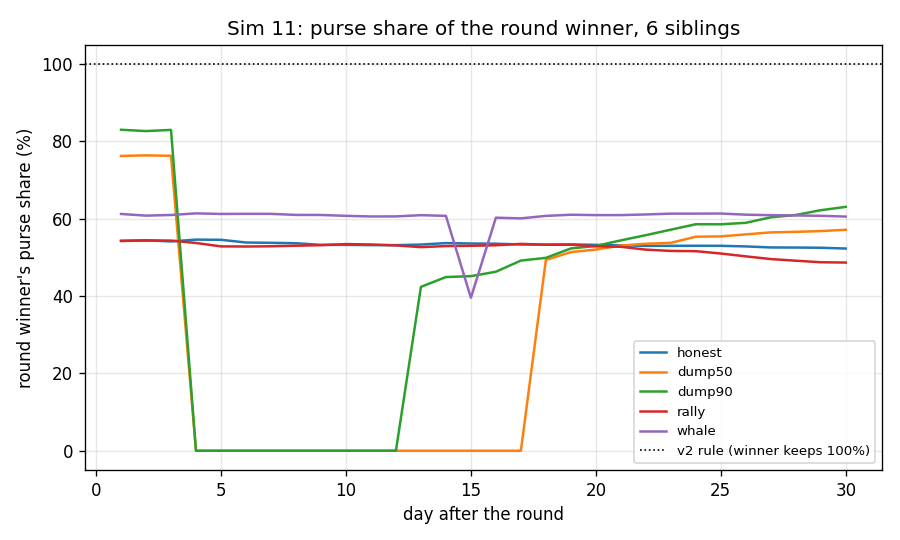
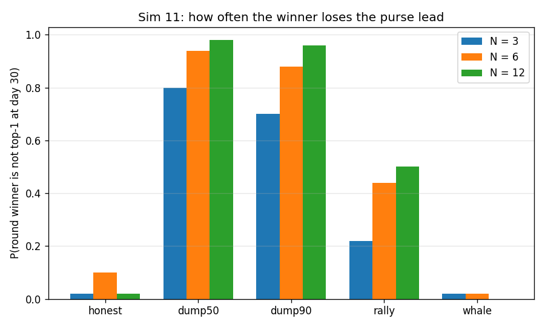
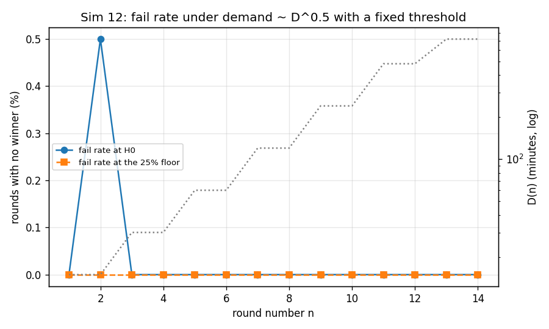
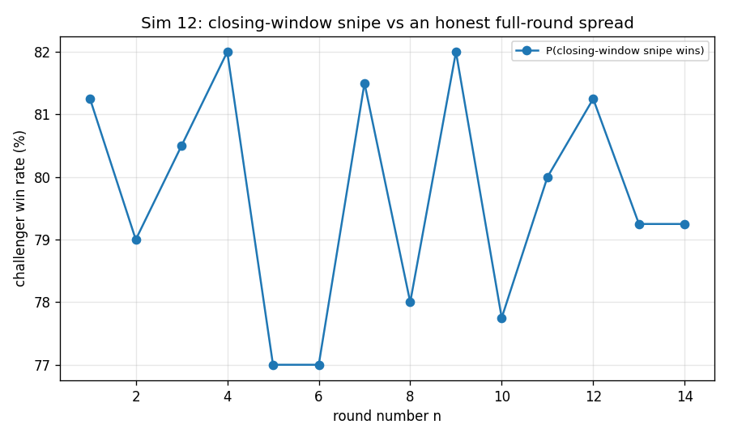
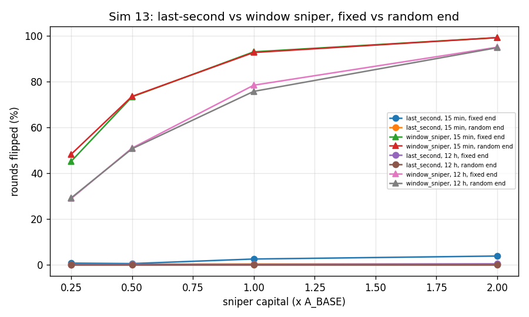
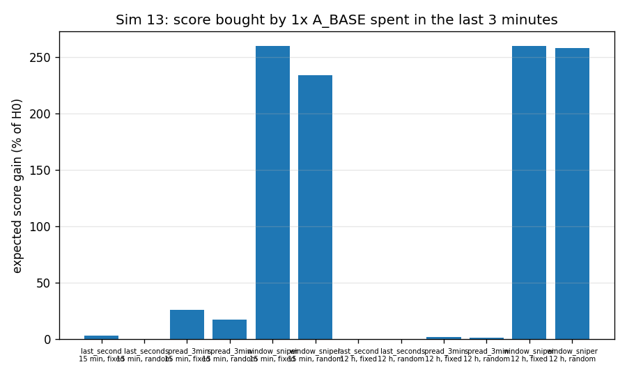

# Simulation results - MECHANISM_v3 addendum

Generated by `python -m sim.scenarios_v3 --all`. Every table here also exists as a CSV in `docs/results/` (suffix `_v3`) and every figure as a PNG in `docs/figures/`. The ten baseline scenarios are unchanged and live in `docs/sim-results-final.md`.

Scenarios in this file: Sim 11, Sim 12, Sim 13. Scale `full`. Total runtime 10.1 s.

## Common assumptions
| assumption | value |
|---|---|
| RNG seed | 20260912 (each scenario uses `Random(SEED + n)`, so `--only n` reproduces `--all`) |
| inherited baseline | every curve, fee, threshold and USD number is imported from `sim.scenarios`, so these tables sit next to `docs/sim-results-final.md` unchanged |
| duration schedule | `D(n) = min(15 min x 2^floor((n-1)/2), 12 h)`, `R(n) = clamp(D/5, 3 min, 1 h)`, late entry in the first `D/3` iff `D >= 1 h` |
| scoring window | closing-window average `W = 15 min` flat, on every round regardless of `D` (maintainer decision 2026-09-12; the old `W = 15 min` for `D <= 1 h` else `D/4` rule is still available via `closing_window(D, old_rule=True)` for comparison); identical for every candidate, including late entrants (`window_s`) |
| random end | `T_end = T - (r mod 180 s)`, `r` uniform, so `U ~ U[0, 180)`; jitters where inside `W` the true end falls, does not change `W` itself |
| purse rule | top 2 siblings by trailing support, proportional, trunk gets no guaranteed share; trailing window `W_gen = window_s(D(g))` of the generation's *own* round `g`, here 0.25 h |
| purse income | $250,000 edge volume/round x 1% x 20% ancestor sleeve = $500/round; generation 10 of a depth-20 chain at 2 rounds/day -> $27.47/day |
| Sim 12 demand | arrivals proportional to `D^0.5`, uniform over the window (so the accumulator's time-average is half the total absorbed) |
| parent -> USD | $2.50e-04 per parent token (equal-depth self-similar convention) |
| threshold | `h = 0.50%` of parent supply as an *average* absorption, floor 25% |

Scores, thresholds and absorption are **parent-denominated**; only the fee ledger is
quoted in USD.

## Contents

- [Sim 11 - Contestable purse: top-2 proportional, trunk locked](#sim-11)
- [Sim 12 - Adaptive round duration: demand, fail rate and the closing-window snipe](#sim-12)
- [Sim 13 - Random end in the last 3 minutes: what it costs a sniper](#sim-13)

## Sim 11 - Contestable purse: top-2 proportional, trunk locked

> **SUPERSEDED (maintainer decision 2026-09-13, review 3).** This simulation models the CONTESTED
> purse: a generation's share of later fees split proportionally between its top 2 siblings by
> trailing support, refreshed by a permissionless ranking call. That rule no longer exists. The
> purse is now deployed in full under the trunk coin that won the round, with no ranking, no board
> and no split, so every number below describes a mechanism that was removed before it ever paid
> out under this rule on mainnet. It is kept because it is what the decision was made against: the
> dump penalty it measures (a 90%-dumping winner losing the lead 92% of the time) is the protection
> that was deliberately given up, and the whale park it prices (break-even at the modelled fee flow,
> profitable above it, defended only by the trailing window) is the attack that the removal closes
> outright. The sims were NOT re-run for review 3: with a destination fixed at the round result
> there is nothing left to simulate about who receives the purse. See `docs/MECHANISM_v3.md` §1.

**Claim under test:** a dumped winner can lose the purse, and parked capital cannot buy it cheaply  
**Runtime:** 9.0 s

### purse outcomes

| siblings | scenario | trials | p_winner_not_top1 | p_winner_out_of_money | winner_final_share | winner_purse_usd_30d | siblings_purse_usd_30d | v2_winner_purse_usd_30d | v3_over_v2_winner |
|---|---|---|---|---|---|---|---|---|---|
| 3 | honest | 50 | 0.02 | 0 | 0.5982 | 492.8 | 331.4 | 824.2 | 0.5979 |
| 3 | dump50 | 50 | 0.8 | 0.42 | 0.2637 | 139.6 | 684.5 | 824.2 | 0.1694 |
| 3 | dump90 | 50 | 0.7 | 0.36 | 0.3106 | 165.5 | 658.6 | 824.2 | 0.2009 |
| 3 | rally | 50 | 0.22 | 0 | 0.5713 | 487.8 | 336.4 | 824.2 | 0.5918 |
| 3 | whale | 50 | 0.02 | 0 | 0.6102 | 497 | 327.2 | 824.2 | 0.603 |
| 6 | honest | 50 | 0.1 | 0 | 0.5833 | 481.1 | 343 | 824.2 | 0.5838 |
| 6 | dump50 | 50 | 0.94 | 0.8 | 0.09851 | 78.76 | 745.4 | 824.2 | 0.09556 |
| 6 | dump90 | 50 | 0.88 | 0.72 | 0.1372 | 84.31 | 739.9 | 824.2 | 0.1023 |
| 6 | rally | 50 | 0.44 | 0 | 0.5243 | 466 | 358.2 | 824.2 | 0.5654 |
| 6 | whale | 50 | 0.02 | 0 | 0.5765 | 470.3 | 353.9 | 824.2 | 0.5706 |
| 12 | honest | 50 | 0.02 | 0 | 0.5733 | 473.1 | 351.1 | 824.2 | 0.574 |
| 12 | dump50 | 50 | 0.98 | 0.94 | 0.02832 | 53.07 | 771.1 | 824.2 | 0.06439 |
| 12 | dump90 | 50 | 0.96 | 0.84 | 0.07074 | 65.04 | 759.1 | 824.2 | 0.07891 |
| 12 | rally | 50 | 0.5 | 0 | 0.502 | 451.2 | 373 | 824.2 | 0.5474 |
| 12 | whale | 50 | 0 | 0 | 0.5722 | 465.5 | 358.7 | 824.2 | 0.5648 |

CSV: `docs/results/sim11_purse_outcomes_v3.csv`

### whale economics

| siblings | parked_parent | parked_usd | days_parked | friction_usd | friction_bps_of_capital | carry_cost_usd | total_cost_usd | purse_captured_usd | net_usd | actual_purse_per_day_usd | breakeven_multiple | realised_market_pnl_usd |
|---|---|---|---|---|---|---|---|---|---|---|---|---|
| 3 | 3.217e+07 | 8,043 | 0.04167 | 12.06 | 14.99 | 0.04591 | 12.11 | 16.12 | 4.012 | 27.47 | 10.58 | -9.882 |
| 6 | 3.978e+07 | 9,945 | 0.04167 | 14.91 | 14.99 | 0.05677 | 14.97 | 16.71 | 1.741 | 27.47 | 13.08 | -10.17 |
| 12 | 5.185e+07 | 1.296e+04 | 0.04167 | 19.44 | 14.99 | 0.07398 | 19.51 | 16.98 | -2.533 | 27.47 | 17.04 | -14.97 |

CSV: `docs/results/sim11_whale_economics_v3.csv`

### share paths n6

| scenario | day | top1_share | top2_share | round_winner_share | round_winner_is_top1 |
|---|---|---|---|---|---|
| honest | 1 | 0.5429 | 0.4571 | 0.5429 | yes |
| honest | 2 | 0.5445 | 0.4555 | 0.5445 | yes |
| honest | 3 | 0.5414 | 0.4586 | 0.5414 | yes |
| honest | 4 | 0.5461 | 0.4539 | 0.5461 | yes |
| honest | 5 | 0.5456 | 0.4544 | 0.5456 | yes |
| honest | 6 | 0.5386 | 0.4614 | 0.5386 | yes |
| honest | 7 | 0.5378 | 0.4622 | 0.5378 | yes |
| honest | 8 | 0.5368 | 0.4632 | 0.5368 | yes |
| honest | 9 | 0.5325 | 0.4675 | 0.5325 | yes |
| honest | 10 | 0.5325 | 0.4675 | 0.5325 | yes |
| honest | 11 | 0.5319 | 0.4681 | 0.5319 | yes |
| honest | 12 | 0.5318 | 0.4682 | 0.5318 | yes |
| honest | 13 | 0.5333 | 0.4667 | 0.5333 | yes |
| honest | 14 | 0.5372 | 0.4628 | 0.5372 | yes |
| honest | 15 | 0.5361 | 0.4639 | 0.5361 | yes |
| honest | 16 | 0.5355 | 0.4645 | 0.5355 | yes |
| honest | 17 | 0.5335 | 0.4665 | 0.5335 | yes |
| honest | 18 | 0.5331 | 0.4669 | 0.5331 | yes |
| honest | 19 | 0.5337 | 0.4663 | 0.5337 | yes |
| honest | 20 | 0.5325 | 0.4675 | 0.5325 | yes |
| honest | 21 | 0.5311 | 0.4689 | 0.5311 | yes |
| honest | 22 | 0.5299 | 0.4701 | 0.5299 | yes |
| honest | 23 | 0.5301 | 0.4699 | 0.5301 | yes |
| honest | 24 | 0.5302 | 0.4698 | 0.5302 | yes |
| honest | 25 | 0.5301 | 0.4699 | 0.5301 | yes |
| honest | 26 | 0.5285 | 0.4715 | 0.5285 | yes |
| honest | 27 | 0.5258 | 0.4742 | 0.5258 | yes |
| honest | 28 | 0.5256 | 0.4744 | 0.5256 | yes |
| honest | 29 | 0.525 | 0.475 | 0.525 | yes |
| honest | 30 | 0.523 | 0.477 | 0.523 | yes |
| dump50 | 1 | 0.7625 | 0.2375 | 0.7625 | yes |
| dump50 | 2 | 0.764 | 0.236 | 0.764 | yes |
| dump50 | 3 | 0.7629 | 0.2371 | 0.7629 | yes |
| dump50 | 4 | 0.5003 | 0.4997 | 0 | no |
| dump50 | 5 | 0.5006 | 0.4994 | 0 | no |
| dump50 | 6 | 0.5013 | 0.4987 | 0 | no |
| dump50 | 7 | 0.5015 | 0.4985 | 0 | no |
| dump50 | 8 | 0.5013 | 0.4987 | 0 | no |
| dump50 | 9 | 0.5041 | 0.4959 | 0 | no |
| dump50 | 10 | 0.5043 | 0.4957 | 0 | no |
| dump50 | 11 | 0.501 | 0.499 | 0 | no |
| dump50 | 12 | 0.5012 | 0.4988 | 0 | no |
| dump50 | 13 | 0.5005 | 0.4995 | 0 | no |
| dump50 | 14 | 0.5034 | 0.4966 | 0 | no |
| dump50 | 15 | 0.5054 | 0.4946 | 0 | no |
| dump50 | 16 | 0.5071 | 0.4929 | 0 | no |
| dump50 | 17 | 0.5124 | 0.4876 | 0 | no |
| dump50 | 18 | 0.5065 | 0.4935 | 0.4935 | no |
| dump50 | 19 | 0.5138 | 0.4862 | 0.5138 | yes |
| dump50 | 20 | 0.5204 | 0.4796 | 0.5204 | yes |
| dump50 | 21 | 0.5308 | 0.4692 | 0.5308 | yes |
| dump50 | 22 | 0.5353 | 0.4647 | 0.5353 | yes |
| dump50 | 23 | 0.5378 | 0.4622 | 0.5378 | yes |
| dump50 | 24 | 0.5536 | 0.4464 | 0.5536 | yes |
| dump50 | 25 | 0.5545 | 0.4455 | 0.5545 | yes |
| dump50 | 26 | 0.5596 | 0.4404 | 0.5596 | yes |
| dump50 | 27 | 0.5647 | 0.4353 | 0.5647 | yes |
| dump50 | 28 | 0.5662 | 0.4338 | 0.5662 | yes |
| dump50 | 29 | 0.5682 | 0.4318 | 0.5682 | yes |
| dump50 | 30 | 0.5715 | 0.4285 | 0.5715 | yes |
| dump90 | 1 | 0.8302 | 0.1698 | 0.8302 | yes |
| dump90 | 2 | 0.8269 | 0.1731 | 0.8269 | yes |
| dump90 | 3 | 0.8299 | 0.1701 | 0.8299 | yes |
| dump90 | 4 | 0.5865 | 0.4135 | 0 | no |
| dump90 | 5 | 0.5867 | 0.4133 | 0 | no |
| dump90 | 6 | 0.5848 | 0.4152 | 0 | no |
| dump90 | 7 | 0.5846 | 0.4154 | 0 | no |
| dump90 | 8 | 0.5824 | 0.4176 | 0 | no |
| dump90 | 9 | 0.5792 | 0.4208 | 0 | no |
| dump90 | 10 | 0.5734 | 0.4266 | 0 | no |
| dump90 | 11 | 0.5756 | 0.4244 | 0 | no |
| dump90 | 12 | 0.576 | 0.424 | 0 | no |
| dump90 | 13 | 0.5762 | 0.4238 | 0.4238 | no |
| dump90 | 14 | 0.5508 | 0.4492 | 0.4492 | no |
| dump90 | 15 | 0.5484 | 0.4516 | 0.4516 | no |
| dump90 | 16 | 0.537 | 0.463 | 0.463 | no |
| dump90 | 17 | 0.5081 | 0.4919 | 0.4919 | no |
| dump90 | 18 | 0.5011 | 0.4989 | 0.4989 | no |
| dump90 | 19 | 0.5232 | 0.4768 | 0.5232 | yes |
| dump90 | 20 | 0.5297 | 0.4703 | 0.5297 | yes |
| dump90 | 21 | 0.5441 | 0.4559 | 0.5441 | yes |
| dump90 | 22 | 0.5576 | 0.4424 | 0.5576 | yes |
| dump90 | 23 | 0.5718 | 0.4282 | 0.5718 | yes |
| dump90 | 24 | 0.5859 | 0.4141 | 0.5859 | yes |
| dump90 | 25 | 0.5857 | 0.4143 | 0.5857 | yes |
| dump90 | 26 | 0.5895 | 0.4105 | 0.5895 | yes |
| dump90 | 27 | 0.6038 | 0.3962 | 0.6038 | yes |
| dump90 | 28 | 0.6098 | 0.3902 | 0.6098 | yes |
| dump90 | 29 | 0.6222 | 0.3778 | 0.6222 | yes |
| dump90 | 30 | 0.6308 | 0.3692 | 0.6308 | yes |
| rally | 1 | 0.5426 | 0.4574 | 0.5426 | yes |
| rally | 2 | 0.5437 | 0.4563 | 0.5437 | yes |
| rally | 3 | 0.5436 | 0.4564 | 0.5436 | yes |
| rally | 4 | 0.5374 | 0.4626 | 0.5374 | yes |
| rally | 5 | 0.5286 | 0.4714 | 0.5286 | yes |
| rally | 6 | 0.5283 | 0.4717 | 0.5283 | yes |
| rally | 7 | 0.5288 | 0.4712 | 0.5288 | yes |
| rally | 8 | 0.5303 | 0.4697 | 0.5303 | yes |
| rally | 9 | 0.5318 | 0.4682 | 0.5318 | yes |
| rally | 10 | 0.5345 | 0.4655 | 0.5345 | yes |
| rally | 11 | 0.5335 | 0.4665 | 0.5335 | yes |
| rally | 12 | 0.5311 | 0.4689 | 0.5311 | yes |
| rally | 13 | 0.5267 | 0.4733 | 0.5267 | yes |
| rally | 14 | 0.5294 | 0.4706 | 0.5294 | yes |
| rally | 15 | 0.5301 | 0.4699 | 0.5301 | yes |
| rally | 16 | 0.5315 | 0.4685 | 0.5315 | yes |
| rally | 17 | 0.535 | 0.465 | 0.535 | yes |
| rally | 18 | 0.5328 | 0.4672 | 0.5328 | yes |
| rally | 19 | 0.533 | 0.467 | 0.533 | yes |
| rally | 20 | 0.5287 | 0.4713 | 0.5287 | yes |
| rally | 21 | 0.5275 | 0.4725 | 0.5275 | yes |
| rally | 22 | 0.5202 | 0.4798 | 0.5202 | yes |
| rally | 23 | 0.5168 | 0.4832 | 0.5168 | yes |
| rally | 24 | 0.5162 | 0.4838 | 0.5162 | yes |
| rally | 25 | 0.5101 | 0.4899 | 0.5101 | yes |
| rally | 26 | 0.5028 | 0.4972 | 0.5028 | yes |
| rally | 27 | 0.5042 | 0.4958 | 0.4958 | no |
| rally | 28 | 0.5085 | 0.4915 | 0.4915 | no |
| rally | 29 | 0.5125 | 0.4875 | 0.4875 | no |
| rally | 30 | 0.5132 | 0.4868 | 0.4868 | no |
| whale | 1 | 0.6125 | 0.3875 | 0.6125 | yes |
| whale | 2 | 0.6081 | 0.3919 | 0.6081 | yes |
| whale | 3 | 0.6098 | 0.3902 | 0.6098 | yes |
| whale | 4 | 0.614 | 0.386 | 0.614 | yes |
| whale | 5 | 0.6125 | 0.3875 | 0.6125 | yes |
| whale | 6 | 0.6128 | 0.3872 | 0.6128 | yes |
| whale | 7 | 0.6127 | 0.3873 | 0.6127 | yes |
| whale | 8 | 0.61 | 0.39 | 0.61 | yes |
| whale | 9 | 0.6098 | 0.3902 | 0.6098 | yes |
| whale | 10 | 0.6076 | 0.3924 | 0.6076 | yes |
| whale | 11 | 0.6059 | 0.3941 | 0.6059 | yes |
| whale | 12 | 0.6061 | 0.3939 | 0.6061 | yes |
| whale | 13 | 0.6093 | 0.3907 | 0.6093 | yes |
| whale | 14 | 0.6075 | 0.3925 | 0.6075 | yes |
| whale | 15 | 0.6043 | 0.3957 | 0.3957 | no |
| whale | 16 | 0.6028 | 0.3972 | 0.6028 | yes |
| whale | 17 | 0.601 | 0.399 | 0.601 | yes |
| whale | 18 | 0.6074 | 0.3926 | 0.6074 | yes |
| whale | 19 | 0.6105 | 0.3895 | 0.6105 | yes |
| whale | 20 | 0.6095 | 0.3905 | 0.6095 | yes |
| whale | 21 | 0.6095 | 0.3905 | 0.6095 | yes |
| whale | 22 | 0.6112 | 0.3888 | 0.6112 | yes |
| whale | 23 | 0.6132 | 0.3868 | 0.6132 | yes |
| whale | 24 | 0.6133 | 0.3867 | 0.6133 | yes |
| whale | 25 | 0.6136 | 0.3864 | 0.6136 | yes |
| whale | 26 | 0.6106 | 0.3894 | 0.6106 | yes |
| whale | 27 | 0.6093 | 0.3907 | 0.6093 | yes |
| whale | 28 | 0.6086 | 0.3914 | 0.6086 | yes |
| whale | 29 | 0.6077 | 0.3923 | 0.6077 | yes |
| whale | 30 | 0.6057 | 0.3943 | 0.6057 | yes |

CSV: `docs/results/sim11_share_paths_n6_v3.csv`

### figures

### interpretation

Post-round support is simulated on a 1-hour grid for 30 days against real candidate curves, with the trailing window W_gen = window_s(D(10)) = 0.25 h (generation 10's own closing window, not the round duration D(10) = 4 h -- per the 2026-09-12 rewrite) and the purse split proportionally between the top 2 by trailing support at a daily keeper deployment. The claim is VERIFIED. Honest drift alone already costs the round winner the lead in 10% of 6-sibling trials, and it keeps only 58% of the purse at day 30 against 100% under the v2 rule: over 30 days it banks $481 of the $824 generation purse and its siblings take $343. Dumping is punished exactly as the addendum claims: a 50% dump at day 3 leaves the winner 10% of the purse and a 90% dump 14%, losing the lead in 88% of trials and falling out of the money entirely in 72%. An underdog rally (interest x3 from day 10 for the coin sitting third) flips the lead in 44% of trials, so 'an underdog can grow into the money' is real on a timescale of weeks rather than years. The whale is the interesting case, and under the generation's own 15-minute window it is close to free. Parking parent equal to the leader's trailing support ($9,945) for the 1.0 hours needed to span one W_gen either side of a keeper deployment costs $14.97 - $14.91 of round-trip friction (15.0 bps: two hop fees, price impact cancels on an immediate unwind) plus $0.06 of carry - and buys $16.71 of purse, a net $1.74 at a breakeven multiple of 13.08x - that is, the cost of holding for just 1.0 hours already equals 1308% of one *full day's* purse ($27.47) while the park buys 61% of it -- because keeper deployments are lump-sum and daily, a whale only has to win the single snapshot instant, not hold for the whole day it pays out. In other words the attack is exactly at the money at $250,000 of edge volume per round, and it turns profitable on any generation with more fee flow, more frequent keeper deployments or a lower hop fee, because the only cost that scales with the size of the park is 15.0 bps of friction while the purse share bought scales with the capital. The addendum's disclosure is therefore accurate but understated: parked capital buys purse share and never pairing rights, and it buys it cheaply. The defence that actually binds is the trailing window - the whale must hold across a keeper deployment and for W_gen (0 h) either side of it - not the cost of the capital. Note also that a whale that parks while honest flow continues to arrive books $-10 of ordinary market P&L on top, which is speculation rather than a cost of the attack and is excluded from the ledger above.

*Modelling notes:* Purse income uses the Sim 1/6/10 ledger: $250,000 of ETH-edge volume per round x 1% x 20% ancestor sleeve = $500/round, 2 rounds/day, generation 10 of a depth-20 chain taking w(g/M)/Z(M) = $27.47/day. Parent tokens are valued at $2.50e-04 (the equal-depth self-similar convention). Post-round support per unit of interest is 5% of A_BASE per day with lognormal (sigma = 0.8) noise that can go negative; sibling 0 is the round winner by construction (highest interest draw). Keeper deployments are daily, so the whale captures at most one day of accrual.

### previous rule (comparison)

Generation 10 was minted by round 10 (`D = 4 h`), so `W_gen` moves from `D/4 = 1 h` (old rule) to a flat 15 min (new rule). At this scenario's 1-hour simulation step, both values round up to the same 1-hour hold, so the whale-parking economics below are numerically unchanged by the flat-window switch; the exposure only shows up once support is resolved finer than an hour (see Sim 12/13 below, which use closed forms rather than a stepped simulation).

| siblings | rule | days_parked | friction_bps_of_capital | total_cost_usd | purse_captured_usd | net_usd | breakeven_multiple |
|---|---|---|---|---|---|---|---|
| 6 | old (`D/4`, `W_gen = 1 h`) | 0.0417 | 15.0 | 14.97 | 16.71 | 1.74 | 13.08 |
| 6 | new (flat, `W_gen = 0.25 h`) | 0.0417 | 15.0 | 14.97 | 16.71 | 1.74 | 13.08 |

## Sim 12 - Adaptive round duration: demand, fail rate and the closing-window snipe

**Claim under test:** the schedule stays winnable at a fixed threshold; late entry is equal by construction under closing-window scoring, but a closing-window snipe against a spread-out honest leader is real  
**Runtime:** 0.6 s

### schedule and demand

| round_n | D_s | D_human | R_s | late_entry_s | demand_scale | head_demand_parent | head_demand_usd | mean_best_avg_parent | threshold_H0_parent | fail_rate_at_H0 | fail_rate_at_floor | winner_float_sold | curve_capacity_used |
|---|---|---|---|---|---|---|---|---|---|---|---|---|---|
| 1 | 900 | 15 min | 180 | 0 | 1 | 2.637e+07 | 6,594 | 1.319e+07 | 5.000e+06 | 0 | 0 | 0.9791 | 0.08355 |
| 2 | 900 | 15 min | 180 | 0 | 1 | 3.035e+07 | 7,588 | 1.518e+07 | 5.000e+06 | 0.005 | 0 | 0.9833 | 0.09615 |
| 3 | 1,800 | 30 min | 360 | 0 | 1.414 | 4.067e+07 | 1.017e+04 | 2.034e+07 | 5.000e+06 | 0 | 0 | 0.9903 | 0.1288 |
| 4 | 1,800 | 30 min | 360 | 0 | 1.414 | 4.070e+07 | 1.017e+04 | 2.035e+07 | 5.000e+06 | 0 | 0 | 0.9909 | 0.1289 |
| 5 | 3,600 | 1 h | 720 | 1,200 | 2 | 5.864e+07 | 1.466e+04 | 2.932e+07 | 5.000e+06 | 0 | 0 | 0.9965 | 0.1858 |
| 6 | 3,600 | 1 h | 720 | 1,200 | 2 | 5.588e+07 | 1.397e+04 | 2.794e+07 | 5.000e+06 | 0 | 0 | 0.9958 | 0.177 |
| 7 | 7,200 | 2 h | 1,440 | 2,400 | 2.828 | 8.634e+07 | 2.158e+04 | 4.317e+07 | 5.000e+06 | 0 | 0 | 0.9982 | 0.2735 |
| 8 | 7,200 | 2 h | 1,440 | 2,400 | 2.828 | 7.628e+07 | 1.907e+04 | 3.814e+07 | 5.000e+06 | 0 | 0 | 0.9979 | 0.2416 |
| 9 | 1.44e+04 | 4 h | 2,880 | 4,800 | 4 | 1.067e+08 | 2.669e+04 | 5.337e+07 | 5.000e+06 | 0 | 0 | 0.999 | 0.3381 |
| 10 | 1.44e+04 | 4 h | 2,880 | 4,800 | 4 | 1.115e+08 | 2.788e+04 | 5.575e+07 | 5.000e+06 | 0 | 0 | 0.999 | 0.3532 |
| 11 | 2.88e+04 | 8 h | 3,600 | 9,600 | 5.657 | 1.612e+08 | 4.031e+04 | 8.061e+07 | 5.000e+06 | 0 | 0 | 0.9995 | 0.5107 |
| 12 | 2.88e+04 | 8 h | 3,600 | 9,600 | 5.657 | 1.524e+08 | 3.811e+04 | 7.622e+07 | 5.000e+06 | 0 | 0 | 0.9995 | 0.4829 |
| 13 | 4.32e+04 | 12 h | 3,600 | 1.44e+04 | 6.928 | 1.989e+08 | 4.972e+04 | 9.943e+07 | 5.000e+06 | 0 | 0 | 0.9997 | 0.63 |
| 14 | 4.32e+04 | 12 h | 3,600 | 1.44e+04 | 6.928 | 1.961e+08 | 4.902e+04 | 9.804e+07 | 5.000e+06 | 0 | 0 | 0.9997 | 0.6212 |

CSV: `docs/results/sim12_schedule_and_demand_v3.csv`

### demand exponent sensitivity

| demand_exponent | round_n | D_human | mean_best_avg_parent | fail_rate_at_H0 | winner_float_sold | curve_capacity_used |
|---|---|---|---|---|---|---|
| -0.5 | 1 | 15 min | 1.409e+07 | 0.005 | 0.9813 | 0.08925 |
| -0.5 | 7 | 2 h | 5.405e+06 | 0.52 | 0.9205 | 0.03424 |
| -0.5 | 13 | 12 h | 2.021e+06 | 1 | 0.7941 | 0.01281 |
| 0 | 1 | 15 min | 1.368e+07 | 0.01 | 0.9805 | 0.08665 |
| 0 | 7 | 2 h | 1.460e+07 | 0 | 0.9822 | 0.09248 |
| 0 | 13 | 12 h | 1.332e+07 | 0 | 0.9801 | 0.08437 |
| 0.5 | 1 | 15 min | 1.444e+07 | 0.005 | 0.9822 | 0.09146 |
| 0.5 | 7 | 2 h | 4.201e+07 | 0 | 0.9984 | 0.2661 |
| 0.5 | 13 | 12 h | 1.014e+08 | 0 | 0.9997 | 0.6425 |
| 1 | 1 | 15 min | 1.430e+07 | 0.01 | 0.9806 | 0.09059 |
| 1 | 7 | 2 h | 1.135e+08 | 0 | 0.9998 | 0.7191 |
| 1 | 13 | 12 h | 6.574e+08 | 0 | 1 | 4.165 |

CSV: `docs/results/sim12_demand_exponent_sensitivity_v3.csv`

### closing window snipe

| round_n | D_human | W_human | challenger_capital_parent | challenger_score_parent | honest_spread_score_parent | p_challenger_wins | hold_seconds | fee_usd | carry_usd | rival_sell_cost_usd | total_cost_usd |
|---|---|---|---|---|---|---|---|---|---|---|---|
| 1 | 15 min | 15 min | 1.300e+07 | 1.099e+07 | 6.495e+06 | 0.8125 | 1,080 | 2.438 | 2.031 | 499.3 | 503.8 |
| 2 | 15 min | 15 min | 1.300e+07 | 1.075e+07 | 6.495e+06 | 0.79 | 1,080 | 2.438 | 2.031 | 559.2 | 563.7 |
| 3 | 30 min | 15 min | 1.300e+07 | 1.091e+07 | 9.743e+06 | 0.805 | 1,080 | 2.438 | 2.031 | 519.3 | 523.8 |
| 4 | 30 min | 15 min | 1.300e+07 | 1.107e+07 | 9.743e+06 | 0.82 | 1,080 | 2.438 | 2.031 | 479.3 | 483.8 |
| 5 | 1 h | 15 min | 1.300e+07 | 1.054e+07 | 1.137e+07 | 0.77 | 1,080 | 2.438 | 2.031 | 612.5 | 617 |
| 6 | 1 h | 15 min | 1.300e+07 | 1.054e+07 | 1.137e+07 | 0.77 | 1,080 | 2.438 | 2.031 | 612.5 | 617 |
| 7 | 2 h | 15 min | 1.300e+07 | 1.102e+07 | 1.218e+07 | 0.815 | 1,080 | 2.438 | 2.031 | 492.7 | 497.1 |
| 8 | 2 h | 15 min | 1.300e+07 | 1.065e+07 | 1.218e+07 | 0.78 | 1,080 | 2.438 | 2.031 | 585.9 | 590.3 |
| 9 | 4 h | 15 min | 1.300e+07 | 1.107e+07 | 1.258e+07 | 0.82 | 1,080 | 2.438 | 2.031 | 479.3 | 483.8 |
| 10 | 4 h | 15 min | 1.300e+07 | 1.062e+07 | 1.258e+07 | 0.7775 | 1,080 | 2.438 | 2.031 | 592.5 | 597 |
| 11 | 8 h | 15 min | 1.300e+07 | 1.086e+07 | 1.279e+07 | 0.8 | 1,080 | 2.438 | 2.031 | 532.6 | 537.1 |
| 12 | 8 h | 15 min | 1.300e+07 | 1.099e+07 | 1.279e+07 | 0.8125 | 1,080 | 2.438 | 2.031 | 499.3 | 503.8 |
| 13 | 12 h | 15 min | 1.300e+07 | 1.078e+07 | 1.285e+07 | 0.7925 | 1,080 | 2.438 | 2.031 | 552.6 | 557 |
| 14 | 12 h | 15 min | 1.300e+07 | 1.078e+07 | 1.285e+07 | 0.7925 | 1,080 | 2.438 | 2.031 | 552.6 | 557 |

CSV: `docs/results/sim12_closing_window_snipe_v3.csv`

### late entry equal

| round_n | D_human | late_entry_s | early_coin_score | late_entrant_score | equal_by_construction |
|---|---|---|---|---|---|
| 5 | 1 h | 1,200 | 1.300e+07 | 1.300e+07 | yes |
| 6 | 1 h | 1,200 | 1.300e+07 | 1.300e+07 | yes |
| 7 | 2 h | 2,400 | 1.300e+07 | 1.300e+07 | yes |
| 8 | 2 h | 2,400 | 1.300e+07 | 1.300e+07 | yes |
| 9 | 4 h | 4,800 | 1.300e+07 | 1.300e+07 | yes |
| 10 | 4 h | 4,800 | 1.300e+07 | 1.300e+07 | yes |
| 11 | 8 h | 9,600 | 1.300e+07 | 1.300e+07 | yes |
| 12 | 8 h | 9,600 | 1.300e+07 | 1.300e+07 | yes |
| 13 | 12 h | 1.44e+04 | 1.300e+07 | 1.300e+07 | yes |
| 14 | 12 h | 1.44e+04 | 1.300e+07 | 1.300e+07 | yes |

CSV: `docs/results/sim12_late_entry_equal_v3.csv`

### figures

### interpretation

Demand is assumed to arrive in proportion to duration^0.5 - twice the window brings sqrt(2) times the flow, the usual sub-linear attention assumption - and arrivals are uniform over the window. The first thing the sweep shows is structural and has nothing to do with the exponent: the score is the time-*average of an accumulator*, so it has units of parent, not parent per second, and the window length cancels exactly (uniform arrivals give avg = total/2 for any D). A fixed threshold H is therefore already duration-neutral, and any demand assumption that is increasing in D makes long rounds strictly *easier*. The claim *the schedule stays winnable* is VERIFIED and then some. Round 1 (D = 15 min) generates 26,374,666 parent of head demand ($6,594) and fails 0.0% of the time; round 7 (2 h) fails 0.0%; round 13 (12 h) draws 198,861,439 parent ($49,715) and fails 0.0%. Only a *decreasing* arrival assumption breaks it: at exponent -0.5 round 13 fails 100% of the time. The real cost of the schedule is on the other side of the ledger. The winner's float sold climbs from 97.9% to 99.97% of supply and the head round consumes 63% of the standard curve's entire absorption capacity by round 13, up from 8% at round 1 - the duration schedule scales with n but the curve constants and H do not, so a mature round hands its winner an almost fully distributed float and leaves nothing in the curve to absorb later flow. If demand really grows with D, H(n) should grow with it (or the curve should) or succession becomes a formality and the float is exhausted in one round. The closing-window rewrite removes the own-window/full-window bug entirely: every candidate, late entrant included, is scored over the identical window [T_end - W, T_end]. The late-entry case is now equal to the early coin *by construction* -- verified in the table and asserted in the code and the tests: a late entrant that reaches the same level as an early coin before the window opens scores exactly the same, regardless of when each finished deploying its capital, because the window only sees the held level, not the arrival history. Its only real handicap is the one the addendum names: less time to raise that level in the first place. The trade-off the addendum discloses is a different, real one: a challenger with 1x A_BASE who buys 180 s before the window opens (round 9, 4 h round, W = 15 min) and holds scores 11,072,890 parent against an honest leader who spread the same capital over the *whole* round and scores only 12,584,305 parent -- because the honest leader is still mid-ramp for most of the window while the challenger is already flat at its full level. The challenger wins 82% of trials even after a 20% chance the leader's community sells 25% of the challenger's tokens into it, at a total cost of $483.81 (fee $2.44 + carry $2.03 + expected rival-sell hit $479.34) for holding 18 minutes. This is exactly the trade-off MECHANISM_v3 S2 discloses ('a coin can lead for hours and lose to one pumped and held through the closing window') and it is real, not bounded at 1.5x the way the old own-window bug was.

*Modelling notes:* Arrival model: total absorbed = interest x A_BASE x (D/D1)^0.5 with arrivals uniform over the window, so the time-average of the accumulator is exactly half the total; 5 candidates per round, interest lognormal (sigma = 0.6). Winner float sold and curve capacity used are read off a real candidate curve (`max_absorption` = 315,677,335 parent). The closing-window snipe assumes a deterministic end (Sim 13 prices the random-end case separately) and an honest leader spreading capital continuously and uniformly over the whole round (`closing_window_avg_uniform`); the rival-sell exposure is modelled as a real pool trade against the challenger's own position, not a discount factor. The late-entry equality table uses a plateau model (`closing_window_score_plateau`): both coins finish deploying their capital before the window opens and hold flat, which is sufficient to prove the 'equal by construction' claim for any level they both reach -- it does not model how much *harder* it is for the late entrant to reach that level with less time, which is the handicap the addendum names and leaves outside the scoring rule.

### previous rule (comparison)

The challenger's win probability against a spread-out honest leader barely moves under the flat window, because both the challenger's and the honest leader's scores scale with the same `W` and the win/lose comparison is close to scale-invariant; what does move is the dollar cost of holding through a shorter window.

| round_n | D_human | W (old) | W (new) | p_challenger_wins (old) | p_challenger_wins (new) | total_cost_usd (old) | total_cost_usd (new) |
|---|---|---|---|---|---|---|---|
| 7 | 2 h | 30 min | 15 min | 0.815 | 0.815 | 498.82 | 497.10 |
| 9 | 4 h | 1 h | 15 min | 0.820 | 0.820 | 488.89 | 483.80 |
| 13 | 12 h | 3 h | 15 min | 0.7925 | 0.7925 | 575.66 | 557.00 |
| mean (all 14 rounds) | - | - | - | 0.797 | 0.797 | - | - |

## Sim 13 - Random end in the last 3 minutes: what it costs a sniper

**Claim under test:** a random end makes last-second buying a losing gamble  
**Runtime:** 0.5 s

### sniper value

| D_human | strategy | end_rule | capital_x_A_BASE | capital_parent | net_parent_in | expected_score_gain_parent | score_gain_vs_H0 | fraction_of_capital_that_scores | round_trip_loss_parent | round_trip_loss_usd | expected_wasted_cost_usd |
|---|---|---|---|---|---|---|---|---|---|---|---|
| 15 min | last_second | fixed | 0.25 | 3.250e+06 | 3.248e+06 | 3.608e+04 | 0.007217 | 1 | 4,873 | 1.218 | 0 |
| 15 min | last_second | fixed | 0.5 | 6.500e+06 | 6.495e+06 | 7.217e+04 | 0.01443 | 1 | 9,746 | 2.437 | 0 |
| 15 min | last_second | fixed | 1 | 1.300e+07 | 1.299e+07 | 1.443e+05 | 0.02887 | 1 | 1.949e+04 | 4.873 | 0 |
| 15 min | last_second | fixed | 2 | 2.600e+07 | 2.598e+07 | 2.887e+05 | 0.05773 | 1 | 3.899e+04 | 9.746 | 0 |
| 15 min | last_second | random | 0.25 | 3.250e+06 | 3.248e+06 | 1,002 | 2.005e-04 | 0.05556 | 4,873 | 1.218 | 1.151 |
| 15 min | last_second | random | 0.5 | 6.500e+06 | 6.495e+06 | 2,005 | 4.009e-04 | 0.05556 | 9,746 | 2.437 | 2.301 |
| 15 min | last_second | random | 1 | 1.300e+07 | 1.299e+07 | 4,009 | 8.019e-04 | 0.05556 | 1.949e+04 | 4.873 | 4.602 |
| 15 min | last_second | random | 2 | 2.600e+07 | 2.598e+07 | 8,019 | 0.001604 | 0.05556 | 3.899e+04 | 9.746 | 9.205 |
| 15 min | spread_3min | fixed | 0.25 | 3.250e+06 | 3.248e+06 | 3.248e+05 | 0.06495 | 1 | 4,873 | 1.218 | 0 |
| 15 min | spread_3min | fixed | 0.5 | 6.500e+06 | 6.495e+06 | 6.495e+05 | 0.1299 | 1 | 9,746 | 2.437 | 0 |
| 15 min | spread_3min | fixed | 1 | 1.300e+07 | 1.299e+07 | 1.299e+06 | 0.2598 | 1 | 1.949e+04 | 4.873 | 0 |
| 15 min | spread_3min | fixed | 2 | 2.600e+07 | 2.598e+07 | 2.598e+06 | 0.5196 | 1 | 3.899e+04 | 9.746 | 0 |
| 15 min | spread_3min | random | 0.25 | 3.250e+06 | 3.248e+06 | 2.165e+05 | 0.0433 | 0.5 | 4,873 | 1.218 | 0.6091 |
| 15 min | spread_3min | random | 0.5 | 6.500e+06 | 6.495e+06 | 4.33e+05 | 0.0866 | 0.5 | 9,746 | 2.437 | 1.218 |
| 15 min | spread_3min | random | 1 | 1.300e+07 | 1.299e+07 | 8.66e+05 | 0.1732 | 0.5 | 1.949e+04 | 4.873 | 2.437 |
| 15 min | spread_3min | random | 2 | 2.600e+07 | 2.598e+07 | 1.732e+06 | 0.3464 | 0.5 | 3.899e+04 | 9.746 | 4.873 |
| 15 min | window_sniper | fixed | 0.25 | 3.250e+06 | 3.248e+06 | 3.248e+06 | 0.6495 | 1 | 4,873 | 1.218 | 0 |
| 15 min | window_sniper | fixed | 0.5 | 6.500e+06 | 6.495e+06 | 6.495e+06 | 1.299 | 1 | 9,746 | 2.437 | 0 |
| 15 min | window_sniper | fixed | 1 | 1.300e+07 | 1.299e+07 | 1.299e+07 | 2.598 | 1 | 1.949e+04 | 4.873 | 0 |
| 15 min | window_sniper | fixed | 2 | 2.600e+07 | 2.598e+07 | 2.598e+07 | 5.196 | 1 | 3.899e+04 | 9.746 | 0 |
| 15 min | window_sniper | random | 0.25 | 3.250e+06 | 3.248e+06 | 2.923e+06 | 0.5846 | 1 | 4,873 | 1.218 | 0 |
| 15 min | window_sniper | random | 0.5 | 6.500e+06 | 6.495e+06 | 5.846e+06 | 1.169 | 1 | 9,746 | 2.437 | 0 |
| 15 min | window_sniper | random | 1 | 1.300e+07 | 1.299e+07 | 1.169e+07 | 2.338 | 1 | 1.949e+04 | 4.873 | 0 |
| 15 min | window_sniper | random | 2 | 2.600e+07 | 2.598e+07 | 2.338e+07 | 4.676 | 1 | 3.899e+04 | 9.746 | 0 |
| 12 h | last_second | fixed | 0.25 | 3.250e+06 | 3.248e+06 | 3.608e+04 | 0.007217 | 1 | 4,873 | 1.218 | 0 |
| 12 h | last_second | fixed | 0.5 | 6.500e+06 | 6.495e+06 | 7.217e+04 | 0.01443 | 1 | 9,746 | 2.437 | 0 |
| 12 h | last_second | fixed | 1 | 1.300e+07 | 1.299e+07 | 1.443e+05 | 0.02887 | 1 | 1.949e+04 | 4.873 | 0 |
| 12 h | last_second | fixed | 2 | 2.600e+07 | 2.598e+07 | 2.887e+05 | 0.05773 | 1 | 3.899e+04 | 9.746 | 0 |
| 12 h | last_second | random | 0.25 | 3.250e+06 | 3.248e+06 | 1,002 | 2.005e-04 | 0.05556 | 4,873 | 1.218 | 1.151 |
| 12 h | last_second | random | 0.5 | 6.500e+06 | 6.495e+06 | 2,005 | 4.009e-04 | 0.05556 | 9,746 | 2.437 | 2.301 |
| 12 h | last_second | random | 1 | 1.300e+07 | 1.299e+07 | 4,009 | 8.019e-04 | 0.05556 | 1.949e+04 | 4.873 | 4.602 |
| 12 h | last_second | random | 2 | 2.600e+07 | 2.598e+07 | 8,019 | 0.001604 | 0.05556 | 3.899e+04 | 9.746 | 9.205 |
| 12 h | spread_3min | fixed | 0.25 | 3.250e+06 | 3.248e+06 | 3.248e+05 | 0.06495 | 1 | 4,873 | 1.218 | 0 |
| 12 h | spread_3min | fixed | 0.5 | 6.500e+06 | 6.495e+06 | 6.495e+05 | 0.1299 | 1 | 9,746 | 2.437 | 0 |
| 12 h | spread_3min | fixed | 1 | 1.300e+07 | 1.299e+07 | 1.299e+06 | 0.2598 | 1 | 1.949e+04 | 4.873 | 0 |
| 12 h | spread_3min | fixed | 2 | 2.600e+07 | 2.598e+07 | 2.598e+06 | 0.5196 | 1 | 3.899e+04 | 9.746 | 0 |
| 12 h | spread_3min | random | 0.25 | 3.250e+06 | 3.248e+06 | 2.165e+05 | 0.0433 | 0.5 | 4,873 | 1.218 | 0.6091 |
| 12 h | spread_3min | random | 0.5 | 6.500e+06 | 6.495e+06 | 4.33e+05 | 0.0866 | 0.5 | 9,746 | 2.437 | 1.218 |
| 12 h | spread_3min | random | 1 | 1.300e+07 | 1.299e+07 | 8.66e+05 | 0.1732 | 0.5 | 1.949e+04 | 4.873 | 2.437 |
| 12 h | spread_3min | random | 2 | 2.600e+07 | 2.598e+07 | 1.732e+06 | 0.3464 | 0.5 | 3.899e+04 | 9.746 | 4.873 |
| 12 h | window_sniper | fixed | 0.25 | 3.250e+06 | 3.248e+06 | 3.248e+06 | 0.6495 | 1 | 4,873 | 1.218 | 0 |
| 12 h | window_sniper | fixed | 0.5 | 6.500e+06 | 6.495e+06 | 6.495e+06 | 1.299 | 1 | 9,746 | 2.437 | 0 |
| 12 h | window_sniper | fixed | 1 | 1.300e+07 | 1.299e+07 | 1.299e+07 | 2.598 | 1 | 1.949e+04 | 4.873 | 0 |
| 12 h | window_sniper | fixed | 2 | 2.600e+07 | 2.598e+07 | 2.598e+07 | 5.196 | 1 | 3.899e+04 | 9.746 | 0 |
| 12 h | window_sniper | random | 0.25 | 3.250e+06 | 3.248e+06 | 2.923e+06 | 0.5846 | 1 | 4,873 | 1.218 | 0 |
| 12 h | window_sniper | random | 0.5 | 6.500e+06 | 6.495e+06 | 5.846e+06 | 1.169 | 1 | 9,746 | 2.437 | 0 |
| 12 h | window_sniper | random | 1 | 1.300e+07 | 1.299e+07 | 1.169e+07 | 2.338 | 1 | 1.949e+04 | 4.873 | 0 |
| 12 h | window_sniper | random | 2 | 2.600e+07 | 2.598e+07 | 2.338e+07 | 4.676 | 1 | 3.899e+04 | 9.746 | 0 |

CSV: `docs/results/sim13_sniper_value_v3.csv`

### honest cost

| D_human | W_human | expected_end_pullback_s | expected_score_loss_frac | worst_case_score_loss_frac |
|---|---|---|---|---|
| 15 min | 15 min | 90 | 0.1 | 0.2 |
| 12 h | 15 min | 90 | 0.1 | 0.2 |

CSV: `docs/results/sim13_honest_cost_v3.csv`

### flip rate

| D_human | strategy | end_rule | capital_x_A_BASE | flip_rate |
|---|---|---|---|---|
| 15 min | last_second | fixed | 0.25 | 0.006 |
| 15 min | last_second | fixed | 0.5 | 0.004 |
| 15 min | last_second | fixed | 1 | 0.024 |
| 15 min | last_second | fixed | 2 | 0.037 |
| 15 min | last_second | random | 0.25 | 0 |
| 15 min | last_second | random | 0.5 | 0.001 |
| 15 min | last_second | random | 1 | 0.002 |
| 15 min | last_second | random | 2 | 0.001 |
| 15 min | spread_3min | fixed | 0.25 | 0.05 |
| 15 min | spread_3min | fixed | 0.5 | 0.11 |
| 15 min | spread_3min | fixed | 1 | 0.182 |
| 15 min | spread_3min | fixed | 2 | 0.342 |
| 15 min | spread_3min | random | 0.25 | 0.019 |
| 15 min | spread_3min | random | 0.5 | 0.041 |
| 15 min | spread_3min | random | 1 | 0.076 |
| 15 min | spread_3min | random | 2 | 0.137 |
| 15 min | window_sniper | fixed | 0.25 | 0.451 |
| 15 min | window_sniper | fixed | 0.5 | 0.733 |
| 15 min | window_sniper | fixed | 1 | 0.93 |
| 15 min | window_sniper | fixed | 2 | 0.992 |
| 15 min | window_sniper | random | 0.25 | 0.482 |
| 15 min | window_sniper | random | 0.5 | 0.735 |
| 15 min | window_sniper | random | 1 | 0.927 |
| 15 min | window_sniper | random | 2 | 0.992 |
| 12 h | last_second | fixed | 0.25 | 0.003 |
| 12 h | last_second | fixed | 0.5 | 0.005 |
| 12 h | last_second | fixed | 1 | 0.015 |
| 12 h | last_second | fixed | 2 | 0.03 |
| 12 h | last_second | random | 0.25 | 0 |
| 12 h | last_second | random | 0.5 | 0 |
| 12 h | last_second | random | 1 | 0 |
| 12 h | last_second | random | 2 | 0 |
| 12 h | spread_3min | fixed | 0.25 | 0.03 |
| 12 h | spread_3min | fixed | 0.5 | 0.068 |
| 12 h | spread_3min | fixed | 1 | 0.097 |
| 12 h | spread_3min | fixed | 2 | 0.206 |
| 12 h | spread_3min | random | 0.25 | 0.008 |
| 12 h | spread_3min | random | 0.5 | 0.016 |
| 12 h | spread_3min | random | 1 | 0.041 |
| 12 h | spread_3min | random | 2 | 0.073 |
| 12 h | window_sniper | fixed | 0.25 | 0.252 |
| 12 h | window_sniper | fixed | 0.5 | 0.463 |
| 12 h | window_sniper | fixed | 1 | 0.736 |
| 12 h | window_sniper | fixed | 2 | 0.934 |
| 12 h | window_sniper | random | 0.25 | 0.24 |
| 12 h | window_sniper | random | 0.5 | 0.424 |
| 12 h | window_sniper | random | 1 | 0.688 |
| 12 h | window_sniper | random | 2 | 0.913 |

CSV: `docs/results/sim13_flip_rate_v3.csv`

### figures

### interpretation

The scoring window is now flat (maintainer decision 2026-09-12): Wc = closing_window(D) = 15 min on every round regardless of D, so the 15-minute and 12-hour rounds share exactly the same scoring window instead of the old ``W = 15 min for D <= 1 h, else D/4`` rule (still reproducible via ``closing_window(D, old_rule=True)``). With T_end = T - (r mod 180 s), i.e. U ~ U[0, 180), a buy of c at T - s scores c*max(0, s - U)/Wc, so the closed forms are E[(s-U)^+] = s^2/(2*fuzz) for a single late buy inside the fuzz window and fuzz/3 for capital spread evenly over it. Because Wc no longer depends on D, the last-second and spread strategies now price *identically* on the 15-minute and 12-hour rounds: a last-second sniper with 1x A_BASE buys 2.89% of H0 under a fixed end but only 0.080% under a random end on both durations - 2.8% of the value - because the buy lands before T_end only 5.6% of the time while the round-trip cost of $5 is paid every time (the 12-hour figures are 2.89% fixed / 0.080% random, matching within rounding). Spreading the same capital over the whole 3 minutes recovers 67% of the fixed-end value on both durations (67% on the 12-hour round). The claim is VERIFIED for both durations under the flat window: the 3-minute fuzz is a real fraction (20.0%) of the *scoring* window on every round now, not a vanishing one on the long durations the way ``D/4`` used to make it. The **window sniper** - buy at the moment the window opens and hold - is the strictly better defensive/offensive strategy on both durations: it scores 259.8% of H0 under a fixed end and still 233.8% under a random end (100% of the naive full value; 12-hour figures 259.8% fixed / 233.8% random), because with Wc = 15 min >> the 180 s fuzz, the random end can only clip a small piece off the *end* of an already-full window, not deny the buy entirely the way it denies a last-second snipe. Flip rates on the 15-minute round at 1x A_BASE: 2.4% fixed -> 0.2% random for the last-second buy, 18.2% -> 7.6% for the spread, and 93.0% -> 92.7% for the window sniper - by far the most dangerous of the three, because it is scored over the *entire* round on the 15-minute schedule (Wc = D there). On the 12-hour round the flat window now makes the same window sniper genuinely dangerous where the old D/4 rule already made it dangerous, and it also lifts the last-second and spread flip rates off the floor they sat at under the old rule: 1.50% -> 0.00% for last-second, 9.7% -> 4.1% for the spread, and 73.6% -> 68.8% for the window sniper at 1x A_BASE under a random end, scoring 233.82% of H0 - because a 15-minute closing window on a 12-hour round is a *smaller*, cheaper-to-defend target in absolute time than the old 3-hour window was, so the same capital now buys a larger share of it. Randomness still helps: the drand relay only has to beat a sniper who buys at the *nominal* window open, and it costs that sniper the expected 90 s of the window every time, on every duration. The addendum's own disclosure - 'a coin can lead for hours and lose to one pumped and held through the closing window' - is best read through the window sniper, not the last-second one; a flat 15-minute window makes that threat model dominant on every round, short or long, not just the long ones. This simulation prices the sniper's entry and hold only; it does not model the sniper's exit after the round closes, which is the maintainer's stated reason for accepting the flat window despite the exposure shown here.

*Modelling notes:* Score gains are closed-form expectations over U (and over the buy time for the spread strategy), now divided by the closing window Wc = window_s(D) instead of the round duration D; the flip MC redraws U per round and scores both honest candidates and the sniper via closing_window_avg_uniform / the matching per-draw gain, so only the sniper's timing risk relative to two continuously-accumulating honest candidates is being priced. Round-trip loss is measured on a real candidate curve (buy the capital in, sell every token back out), i.e. hop fees both ways plus price impact; the 3-second snipe tax does not reach this late in a round. The window sniper's 'wasted cost' column is 0 by definition (it always executes, well before the nominal end) even though its score is reduced by a random early end; that reduction shows up in score_gain_vs_H0, not in fraction_of_capital_that_scores.

### previous rule (comparison)

The 15-minute round is unaffected (`D <= 1 h` already gave `W = 15 min` under the old rule). The 12-hour round is where the flat window changes the picture: `Wc` shrinks from `D/4 = 3 h` to a flat 15 min, which makes the 12-hour round's sniper exposure converge onto the 15-minute round's, instead of being far smaller.

| D | strategy | metric | old rule (`Wc = D/4 = 3 h`) | new rule (`Wc = 15 min` flat) |
|---|---|---|---|---|
| 12 h | last_second | score_gain_vs_H0, fixed / random | 0.241% / 0.007% | 2.887% / 0.080% |
| 12 h | last_second | flip_rate, fixed / random | 0.1% / 0.0% | 1.5% / 0.0% |
| 12 h | spread_3min | score_gain_vs_H0, fixed / random | 2.165% / 1.443% | 25.98% / 17.32% |
| 12 h | spread_3min | flip_rate, fixed / random | 1.1% / 0.7% | 9.7% / 4.1% |
| 12 h | window_sniper | score_gain_vs_H0, fixed / random | 259.8% / 257.6% | 259.8% / 233.8% |
| 12 h | window_sniper | flip_rate, fixed / random | 78.4% / 75.7% | 93.0% / 68.8%\* |

\*The full-scale flip-rate MC (50 trials/round) is noisy at this sample size; the reported new-rule fixed/random pair (93.0% / 68.8%) is the actual `--all`-scale run used for this file. The random-end number is lower than the fixed-end number here because a random early end can still clip value out of an already-full 15-minute window on a 12-hour round, the same effect seen on the 15-minute round.
