# Simulation results

Generated by `python -m sim.scenarios --all`. Every table here also exists as a CSV in `docs/results/` and every figure as a PNG in `docs/figures/`.

Scenarios in this file: Sim 4, Sim 1, Sim 2, Sim 3, Sim 5, Sim 6, Sim 7, Sim 8, Sim 9, Sim 10. Scale `full`. Total runtime 17.0 s.

## Common assumptions
| assumption | value |
|---|---|
| RNG seed | 20260910 (each scenario uses `Random(SEED + n)`, so `--only n` reproduces `--all`) |
| parent supply, every link | 1e+09 tokens |
| standard curve | `curves.self_similar(P)` default: 99.1% of supply over FDV `a0*P` -> `1e3*a0*P`, 0.9% tail to `1e6*a0*P`, `a0 = 1e-3` |
| hop fee `f_hop` | 7.5 bps, parent side, every family swap |
| protocol fee | 1% on the ETH side of the genesis pool only |
| developer | 20% of the protocol fee |
| creator | 40% baseline (swept in Sim 6) |
| flywheel remainder | 40%, split 50%/50% ancestor sleeve / immediate-parent reinforcement (swept in Sim 6) |
| round | 180 s registration, 600 s trading, 3 s snipe tax (99% -> 1%), 300 s submission |
| threshold | `h = 0.50%` of parent supply as an *average* absorption, decay x0.9 per failed round, floor 25% |
| demand model | per-candidate "interest" is lognormal (sigma = 0.6); interest 1.0 absorbs A_BASE = 13,000,000 parent tokens over the window |
| USD | genesis FDV = $250,000 at 62.5 ETH, i.e. $4,000/ETH and $2.50e-04 per genesis token |
| ETH-edge volume | $250,000 per round where a scenario needs an exogenous figure |

Everything on the trust path is **parent-denominated**: scores, thresholds, absorption
and embedded liquidity are quoted in parent tokens (written "parent" below).  Only the
ETH edge and the fee ledger are quoted in ETH/USD.

## Contents

- [Sim 4 - Adversarial succession: what a slot actually costs](#sim-4)
- [Sim 1 - Lifecycle: GENESIS to #20, 5 candidates per round](#sim-1)
- [Sim 2 - Stochastic chains: 200 Monte Carlo runs per demand regime](#sim-2)
- [Sim 3 - Bad-link collapse at #6 on a 12-link chain](#sim-3)
- [Sim 5 - Candidate war: N candidates sharing one pot of interest](#sim-5)
- [Sim 6 - Fee equilibrium: split sweep and the sell-tax question](#sim-6)
- [Sim 7 - Route depth: 10 / 20 / 50 / 100 links](#sim-7)
- [Sim 8 - Sell cascades from #10: WALL vs SINGLE-like](#sim-8)
- [Sim 9 - Reinforcement vs burn over 20 rounds, then a 50% shock](#sim-9)
- [Sim 10 - Genesis economics: is the U-shape a genesis tax funnel?](#sim-10)

## Sim 4 - Adversarial succession: what a slot actually costs

**Claim under test:** slot capture costs ~= fees  
**Runtime:** 9.4 s

### honest baseline

| curve | honest_leader_avg_absorption_parent | honest_leader_avg_usd | rounds |
|---|---|---|---|
| SINGLE_LIKE | 6.420e+06 | 1,605 | 20 |
| WALL_LIKE | 6.355e+06 | 1,589 | 20 |
| GENTLE_LIKE | 6.082e+06 | 1,521 | 20 |

CSV: `docs/results/sim04_honest_baseline.csv`

### capture raw

| curve | strategy | capital_multiple | capital_parent | capital_usd | trial | attacker_avg | best_honest_avg | is_top | snipe_fees | hop_fees | protocol_fees | price_impact_loss | round_trip_loss | mark_to_market | capital_deployed | cost_parent | cost_usd | cost_pct_of_capital | fee_share_of_cost | win_h0.0025 | win_h0.005 | win_h0.01 |
|---|---|---|---|---|---|---|---|---|---|---|---|---|---|---|---|---|---|---|---|---|---|---|
| SINGLE_LIKE | self_fund_win | 0.5 | 3.210e+06 | 802.5 | 0 | 3.191e+06 | 6.428e+06 | no | 0 | 4,813 | 0 | -4.620e-10 | 4,813 | 0 | 3.210e+06 | 4,813 | 1.203 | 0.001499 | 1 | no | no | no |
| SINGLE_LIKE | self_fund_win | 0.5 | 3.210e+06 | 802.5 | 1 | 3.191e+06 | 5.405e+06 | no | 0 | 4,813 | 0 | -4.620e-10 | 4,813 | 0 | 3.210e+06 | 4,813 | 1.203 | 0.001499 | 1 | no | no | no |
| SINGLE_LIKE | self_fund_win | 0.5 | 3.210e+06 | 802.5 | 2 | 3.191e+06 | 6.766e+06 | no | 0 | 4,813 | 0 | -4.620e-10 | 4,813 | 0 | 3.210e+06 | 4,813 | 1.203 | 0.001499 | 1 | no | no | no |
| SINGLE_LIKE | self_fund_win | 0.5 | 3.210e+06 | 802.5 | 3 | 3.191e+06 | 7.470e+06 | no | 0 | 4,813 | 0 | -4.620e-10 | 4,813 | 0 | 3.210e+06 | 4,813 | 1.203 | 0.001499 | 1 | no | no | no |
| SINGLE_LIKE | self_fund_win | 0.5 | 3.210e+06 | 802.5 | 4 | 3.191e+06 | 7.924e+06 | no | 0 | 4,813 | 0 | -4.620e-10 | 4,813 | 0 | 3.210e+06 | 4,813 | 1.203 | 0.001499 | 1 | no | no | no |
| SINGLE_LIKE | self_fund_win | 0.5 | 3.210e+06 | 802.5 | 5 | 3.191e+06 | 7.352e+06 | no | 0 | 4,813 | 0 | -4.620e-10 | 4,813 | 0 | 3.210e+06 | 4,813 | 1.203 | 0.001499 | 1 | no | no | no |
| SINGLE_LIKE | self_fund_win | 0.5 | 3.210e+06 | 802.5 | 6 | 3.191e+06 | 5.891e+06 | no | 0 | 4,813 | 0 | -4.620e-10 | 4,813 | 0 | 3.210e+06 | 4,813 | 1.203 | 0.001499 | 1 | no | no | no |
| SINGLE_LIKE | self_fund_win | 0.5 | 3.210e+06 | 802.5 | 7 | 3.191e+06 | 6.370e+06 | no | 0 | 4,813 | 0 | -4.620e-10 | 4,813 | 0 | 3.210e+06 | 4,813 | 1.203 | 0.001499 | 1 | no | no | no |
| SINGLE_LIKE | self_fund_win | 0.5 | 3.210e+06 | 802.5 | 8 | 3.191e+06 | 6.016e+06 | no | 0 | 4,813 | 0 | -4.620e-10 | 4,813 | 0 | 3.210e+06 | 4,813 | 1.203 | 0.001499 | 1 | no | no | no |
| SINGLE_LIKE | self_fund_win | 0.5 | 3.210e+06 | 802.5 | 9 | 3.191e+06 | 6.853e+06 | no | 0 | 4,813 | 0 | -4.620e-10 | 4,813 | 0 | 3.210e+06 | 4,813 | 1.203 | 0.001499 | 1 | no | no | no |
| SINGLE_LIKE | self_fund_win | 0.5 | 3.210e+06 | 802.5 | 10 | 3.191e+06 | 6.732e+06 | no | 0 | 4,813 | 0 | -4.620e-10 | 4,813 | 0 | 3.210e+06 | 4,813 | 1.203 | 0.001499 | 1 | no | no | no |
| SINGLE_LIKE | self_fund_win | 0.5 | 3.210e+06 | 802.5 | 11 | 3.191e+06 | 6.278e+06 | no | 0 | 4,813 | 0 | -4.620e-10 | 4,813 | 0 | 3.210e+06 | 4,813 | 1.203 | 0.001499 | 1 | no | no | no |
| SINGLE_LIKE | self_fund_win | 0.5 | 3.210e+06 | 802.5 | 12 | 3.191e+06 | 7.037e+06 | no | 0 | 4,813 | 0 | -4.620e-10 | 4,813 | 0 | 3.210e+06 | 4,813 | 1.203 | 0.001499 | 1 | no | no | no |
| SINGLE_LIKE | self_fund_win | 0.5 | 3.210e+06 | 802.5 | 13 | 3.191e+06 | 6.684e+06 | no | 0 | 4,813 | 0 | -4.620e-10 | 4,813 | 0 | 3.210e+06 | 4,813 | 1.203 | 0.001499 | 1 | no | no | no |
| SINGLE_LIKE | self_fund_win | 0.5 | 3.210e+06 | 802.5 | 14 | 3.191e+06 | 6.154e+06 | no | 0 | 4,813 | 0 | -4.620e-10 | 4,813 | 0 | 3.210e+06 | 4,813 | 1.203 | 0.001499 | 1 | no | no | no |
| SINGLE_LIKE | self_fund_win | 0.5 | 3.210e+06 | 802.5 | 15 | 3.191e+06 | 6.517e+06 | no | 0 | 4,813 | 0 | -4.620e-10 | 4,813 | 0 | 3.210e+06 | 4,813 | 1.203 | 0.001499 | 1 | no | no | no |
| SINGLE_LIKE | self_fund_win | 0.5 | 3.210e+06 | 802.5 | 16 | 3.191e+06 | 5.861e+06 | no | 0 | 4,813 | 0 | -4.620e-10 | 4,813 | 0 | 3.210e+06 | 4,813 | 1.203 | 0.001499 | 1 | no | no | no |
| SINGLE_LIKE | self_fund_win | 0.5 | 3.210e+06 | 802.5 | 17 | 3.191e+06 | 5.874e+06 | no | 0 | 4,813 | 0 | -4.620e-10 | 4,813 | 0 | 3.210e+06 | 4,813 | 1.203 | 0.001499 | 1 | no | no | no |
| SINGLE_LIKE | self_fund_win | 0.5 | 3.210e+06 | 802.5 | 18 | 3.191e+06 | 6.037e+06 | no | 0 | 4,813 | 0 | -4.620e-10 | 4,813 | 0 | 3.210e+06 | 4,813 | 1.203 | 0.001499 | 1 | no | no | no |
| SINGLE_LIKE | self_fund_win | 0.5 | 3.210e+06 | 802.5 | 19 | 3.191e+06 | 6.677e+06 | no | 0 | 4,813 | 0 | -4.620e-10 | 4,813 | 0 | 3.210e+06 | 4,813 | 1.203 | 0.001499 | 1 | no | no | no |
| SINGLE_LIKE | self_fund_win | 0.5 | 3.210e+06 | 802.5 | 20 | 3.191e+06 | 6.638e+06 | no | 0 | 4,813 | 0 | -4.620e-10 | 4,813 | 0 | 3.210e+06 | 4,813 | 1.203 | 0.001499 | 1 | no | no | no |
| SINGLE_LIKE | self_fund_win | 0.5 | 3.210e+06 | 802.5 | 21 | 3.191e+06 | 5.093e+06 | no | 0 | 4,813 | 0 | -4.620e-10 | 4,813 | 0 | 3.210e+06 | 4,813 | 1.203 | 0.001499 | 1 | no | no | no |
| SINGLE_LIKE | self_fund_win | 0.5 | 3.210e+06 | 802.5 | 22 | 3.191e+06 | 7.639e+06 | no | 0 | 4,813 | 0 | -4.620e-10 | 4,813 | 0 | 3.210e+06 | 4,813 | 1.203 | 0.001499 | 1 | no | no | no |
| SINGLE_LIKE | self_fund_win | 0.5 | 3.210e+06 | 802.5 | 23 | 3.191e+06 | 6.011e+06 | no | 0 | 4,813 | 0 | -4.620e-10 | 4,813 | 0 | 3.210e+06 | 4,813 | 1.203 | 0.001499 | 1 | no | no | no |
| SINGLE_LIKE | self_fund_win | 0.5 | 3.210e+06 | 802.5 | 24 | 3.191e+06 | 7.304e+06 | no | 0 | 4,813 | 0 | -4.620e-10 | 4,813 | 0 | 3.210e+06 | 4,813 | 1.203 | 0.001499 | 1 | no | no | no |
| SINGLE_LIKE | self_fund_win | 0.5 | 3.210e+06 | 802.5 | 25 | 3.191e+06 | 5.620e+06 | no | 0 | 4,813 | 0 | -4.620e-10 | 4,813 | 0 | 3.210e+06 | 4,813 | 1.203 | 0.001499 | 1 | no | no | no |
| SINGLE_LIKE | self_fund_win | 0.5 | 3.210e+06 | 802.5 | 26 | 3.191e+06 | 6.337e+06 | no | 0 | 4,813 | 0 | -4.620e-10 | 4,813 | 0 | 3.210e+06 | 4,813 | 1.203 | 0.001499 | 1 | no | no | no |
| SINGLE_LIKE | self_fund_win | 0.5 | 3.210e+06 | 802.5 | 27 | 3.191e+06 | 6.099e+06 | no | 0 | 4,813 | 0 | -4.620e-10 | 4,813 | 0 | 3.210e+06 | 4,813 | 1.203 | 0.001499 | 1 | no | no | no |
| SINGLE_LIKE | self_fund_win | 0.5 | 3.210e+06 | 802.5 | 28 | 3.191e+06 | 5.939e+06 | no | 0 | 4,813 | 0 | -4.620e-10 | 4,813 | 0 | 3.210e+06 | 4,813 | 1.203 | 0.001499 | 1 | no | no | no |
| SINGLE_LIKE | self_fund_win | 0.5 | 3.210e+06 | 802.5 | 29 | 3.191e+06 | 6.776e+06 | no | 0 | 4,813 | 0 | -4.620e-10 | 4,813 | 0 | 3.210e+06 | 4,813 | 1.203 | 0.001499 | 1 | no | no | no |
| SINGLE_LIKE | self_fund_win | 0.5 | 3.210e+06 | 802.5 | 30 | 3.191e+06 | 6.619e+06 | no | 0 | 4,813 | 0 | -4.620e-10 | 4,813 | 0 | 3.210e+06 | 4,813 | 1.203 | 0.001499 | 1 | no | no | no |
| SINGLE_LIKE | self_fund_win | 0.5 | 3.210e+06 | 802.5 | 31 | 3.191e+06 | 6.125e+06 | no | 0 | 4,813 | 0 | -4.620e-10 | 4,813 | 0 | 3.210e+06 | 4,813 | 1.203 | 0.001499 | 1 | no | no | no |
| SINGLE_LIKE | self_fund_win | 0.5 | 3.210e+06 | 802.5 | 32 | 3.191e+06 | 6.348e+06 | no | 0 | 4,813 | 0 | -4.620e-10 | 4,813 | 0 | 3.210e+06 | 4,813 | 1.203 | 0.001499 | 1 | no | no | no |
| SINGLE_LIKE | self_fund_win | 0.5 | 3.210e+06 | 802.5 | 33 | 3.191e+06 | 6.676e+06 | no | 0 | 4,813 | 0 | -4.620e-10 | 4,813 | 0 | 3.210e+06 | 4,813 | 1.203 | 0.001499 | 1 | no | no | no |
| SINGLE_LIKE | self_fund_win | 0.5 | 3.210e+06 | 802.5 | 34 | 3.191e+06 | 5.411e+06 | no | 0 | 4,813 | 0 | -4.620e-10 | 4,813 | 0 | 3.210e+06 | 4,813 | 1.203 | 0.001499 | 1 | no | no | no |
| SINGLE_LIKE | self_fund_win | 0.5 | 3.210e+06 | 802.5 | 35 | 3.191e+06 | 7.777e+06 | no | 0 | 4,813 | 0 | -4.620e-10 | 4,813 | 0 | 3.210e+06 | 4,813 | 1.203 | 0.001499 | 1 | no | no | no |
| SINGLE_LIKE | self_fund_win | 0.5 | 3.210e+06 | 802.5 | 36 | 3.191e+06 | 7.318e+06 | no | 0 | 4,813 | 0 | -4.620e-10 | 4,813 | 0 | 3.210e+06 | 4,813 | 1.203 | 0.001499 | 1 | no | no | no |
| SINGLE_LIKE | self_fund_win | 0.5 | 3.210e+06 | 802.5 | 37 | 3.191e+06 | 7.186e+06 | no | 0 | 4,813 | 0 | -4.620e-10 | 4,813 | 0 | 3.210e+06 | 4,813 | 1.203 | 0.001499 | 1 | no | no | no |
| SINGLE_LIKE | self_fund_win | 0.5 | 3.210e+06 | 802.5 | 38 | 3.191e+06 | 7.728e+06 | no | 0 | 4,813 | 0 | -4.620e-10 | 4,813 | 0 | 3.210e+06 | 4,813 | 1.203 | 0.001499 | 1 | no | no | no |
| SINGLE_LIKE | self_fund_win | 0.5 | 3.210e+06 | 802.5 | 39 | 3.191e+06 | 6.591e+06 | no | 0 | 4,813 | 0 | -4.620e-10 | 4,813 | 0 | 3.210e+06 | 4,813 | 1.203 | 0.001499 | 1 | no | no | no |
| SINGLE_LIKE | self_fund_win | 1 | 6.420e+06 | 1,605 | 0 | 6.382e+06 | 6.884e+06 | no | 0 | 9,626 | 0 | 7.276e-12 | 9,626 | 0 | 6.420e+06 | 9,626 | 2.406 | 0.001499 | 1 | no | no | no |
| SINGLE_LIKE | self_fund_win | 1 | 6.420e+06 | 1,605 | 1 | 6.382e+06 | 6.242e+06 | yes | 0 | 9,626 | 0 | 7.276e-12 | 9,626 | 0 | 6.420e+06 | 9,626 | 2.406 | 0.001499 | 1 | yes | yes | no |
| SINGLE_LIKE | self_fund_win | 1 | 6.420e+06 | 1,605 | 2 | 6.382e+06 | 4.353e+06 | yes | 0 | 9,626 | 0 | 7.276e-12 | 9,626 | 0 | 6.420e+06 | 9,626 | 2.406 | 0.001499 | 1 | yes | yes | no |
| SINGLE_LIKE | self_fund_win | 1 | 6.420e+06 | 1,605 | 3 | 6.382e+06 | 5.986e+06 | yes | 0 | 9,626 | 0 | 7.276e-12 | 9,626 | 0 | 6.420e+06 | 9,626 | 2.406 | 0.001499 | 1 | yes | yes | no |
| SINGLE_LIKE | self_fund_win | 1 | 6.420e+06 | 1,605 | 4 | 6.382e+06 | 5.483e+06 | yes | 0 | 9,626 | 0 | 7.276e-12 | 9,626 | 0 | 6.420e+06 | 9,626 | 2.406 | 0.001499 | 1 | yes | yes | no |
| SINGLE_LIKE | self_fund_win | 1 | 6.420e+06 | 1,605 | 5 | 6.382e+06 | 7.355e+06 | no | 0 | 9,626 | 0 | 7.276e-12 | 9,626 | 0 | 6.420e+06 | 9,626 | 2.406 | 0.001499 | 1 | no | no | no |
| SINGLE_LIKE | self_fund_win | 1 | 6.420e+06 | 1,605 | 6 | 6.382e+06 | 7.914e+06 | no | 0 | 9,626 | 0 | 7.276e-12 | 9,626 | 0 | 6.420e+06 | 9,626 | 2.406 | 0.001499 | 1 | no | no | no |
| SINGLE_LIKE | self_fund_win | 1 | 6.420e+06 | 1,605 | 7 | 6.382e+06 | 6.121e+06 | yes | 0 | 9,626 | 0 | 7.276e-12 | 9,626 | 0 | 6.420e+06 | 9,626 | 2.406 | 0.001499 | 1 | yes | yes | no |
| SINGLE_LIKE | self_fund_win | 1 | 6.420e+06 | 1,605 | 8 | 6.382e+06 | 6.526e+06 | no | 0 | 9,626 | 0 | 7.276e-12 | 9,626 | 0 | 6.420e+06 | 9,626 | 2.406 | 0.001499 | 1 | no | no | no |
| SINGLE_LIKE | self_fund_win | 1 | 6.420e+06 | 1,605 | 9 | 6.382e+06 | 7.095e+06 | no | 0 | 9,626 | 0 | 7.276e-12 | 9,626 | 0 | 6.420e+06 | 9,626 | 2.406 | 0.001499 | 1 | no | no | no |
| SINGLE_LIKE | self_fund_win | 1 | 6.420e+06 | 1,605 | 10 | 6.382e+06 | 5.770e+06 | yes | 0 | 9,626 | 0 | 7.276e-12 | 9,626 | 0 | 6.420e+06 | 9,626 | 2.406 | 0.001499 | 1 | yes | yes | no |
| SINGLE_LIKE | self_fund_win | 1 | 6.420e+06 | 1,605 | 11 | 6.382e+06 | 5.393e+06 | yes | 0 | 9,626 | 0 | 7.276e-12 | 9,626 | 0 | 6.420e+06 | 9,626 | 2.406 | 0.001499 | 1 | yes | yes | no |
| SINGLE_LIKE | self_fund_win | 1 | 6.420e+06 | 1,605 | 12 | 6.382e+06 | 6.632e+06 | no | 0 | 9,626 | 0 | 7.276e-12 | 9,626 | 0 | 6.420e+06 | 9,626 | 2.406 | 0.001499 | 1 | no | no | no |
| SINGLE_LIKE | self_fund_win | 1 | 6.420e+06 | 1,605 | 13 | 6.382e+06 | 7.098e+06 | no | 0 | 9,626 | 0 | 7.276e-12 | 9,626 | 0 | 6.420e+06 | 9,626 | 2.406 | 0.001499 | 1 | no | no | no |
| SINGLE_LIKE | self_fund_win | 1 | 6.420e+06 | 1,605 | 14 | 6.382e+06 | 6.283e+06 | yes | 0 | 9,626 | 0 | 7.276e-12 | 9,626 | 0 | 6.420e+06 | 9,626 | 2.406 | 0.001499 | 1 | yes | yes | no |
| SINGLE_LIKE | self_fund_win | 1 | 6.420e+06 | 1,605 | 15 | 6.382e+06 | 6.209e+06 | yes | 0 | 9,626 | 0 | 7.276e-12 | 9,626 | 0 | 6.420e+06 | 9,626 | 2.406 | 0.001499 | 1 | yes | yes | no |
| SINGLE_LIKE | self_fund_win | 1 | 6.420e+06 | 1,605 | 16 | 6.382e+06 | 7.279e+06 | no | 0 | 9,626 | 0 | 7.276e-12 | 9,626 | 0 | 6.420e+06 | 9,626 | 2.406 | 0.001499 | 1 | no | no | no |
| SINGLE_LIKE | self_fund_win | 1 | 6.420e+06 | 1,605 | 17 | 6.382e+06 | 7.637e+06 | no | 0 | 9,626 | 0 | 7.276e-12 | 9,626 | 0 | 6.420e+06 | 9,626 | 2.406 | 0.001499 | 1 | no | no | no |
| SINGLE_LIKE | self_fund_win | 1 | 6.420e+06 | 1,605 | 18 | 6.382e+06 | 6.684e+06 | no | 0 | 9,626 | 0 | 7.276e-12 | 9,626 | 0 | 6.420e+06 | 9,626 | 2.406 | 0.001499 | 1 | no | no | no |
| SINGLE_LIKE | self_fund_win | 1 | 6.420e+06 | 1,605 | 19 | 6.382e+06 | 7.479e+06 | no | 0 | 9,626 | 0 | 7.276e-12 | 9,626 | 0 | 6.420e+06 | 9,626 | 2.406 | 0.001499 | 1 | no | no | no |
| SINGLE_LIKE | self_fund_win | 1 | 6.420e+06 | 1,605 | 20 | 6.382e+06 | 6.829e+06 | no | 0 | 9,626 | 0 | 7.276e-12 | 9,626 | 0 | 6.420e+06 | 9,626 | 2.406 | 0.001499 | 1 | no | no | no |
| SINGLE_LIKE | self_fund_win | 1 | 6.420e+06 | 1,605 | 21 | 6.382e+06 | 6.078e+06 | yes | 0 | 9,626 | 0 | 7.276e-12 | 9,626 | 0 | 6.420e+06 | 9,626 | 2.406 | 0.001499 | 1 | yes | yes | no |
| SINGLE_LIKE | self_fund_win | 1 | 6.420e+06 | 1,605 | 22 | 6.382e+06 | 6.555e+06 | no | 0 | 9,626 | 0 | 7.276e-12 | 9,626 | 0 | 6.420e+06 | 9,626 | 2.406 | 0.001499 | 1 | no | no | no |
| SINGLE_LIKE | self_fund_win | 1 | 6.420e+06 | 1,605 | 23 | 6.382e+06 | 5.798e+06 | yes | 0 | 9,626 | 0 | 7.276e-12 | 9,626 | 0 | 6.420e+06 | 9,626 | 2.406 | 0.001499 | 1 | yes | yes | no |
| SINGLE_LIKE | self_fund_win | 1 | 6.420e+06 | 1,605 | 24 | 6.382e+06 | 6.326e+06 | yes | 0 | 9,626 | 0 | 7.276e-12 | 9,626 | 0 | 6.420e+06 | 9,626 | 2.406 | 0.001499 | 1 | yes | yes | no |
| SINGLE_LIKE | self_fund_win | 1 | 6.420e+06 | 1,605 | 25 | 6.382e+06 | 7.149e+06 | no | 0 | 9,626 | 0 | 7.276e-12 | 9,626 | 0 | 6.420e+06 | 9,626 | 2.406 | 0.001499 | 1 | no | no | no |
| SINGLE_LIKE | self_fund_win | 1 | 6.420e+06 | 1,605 | 26 | 6.382e+06 | 6.296e+06 | yes | 0 | 9,626 | 0 | 7.276e-12 | 9,626 | 0 | 6.420e+06 | 9,626 | 2.406 | 0.001499 | 1 | yes | yes | no |
| SINGLE_LIKE | self_fund_win | 1 | 6.420e+06 | 1,605 | 27 | 6.382e+06 | 7.420e+06 | no | 0 | 9,626 | 0 | 7.276e-12 | 9,626 | 0 | 6.420e+06 | 9,626 | 2.406 | 0.001499 | 1 | no | no | no |
| SINGLE_LIKE | self_fund_win | 1 | 6.420e+06 | 1,605 | 28 | 6.382e+06 | 7.113e+06 | no | 0 | 9,626 | 0 | 7.276e-12 | 9,626 | 0 | 6.420e+06 | 9,626 | 2.406 | 0.001499 | 1 | no | no | no |
| SINGLE_LIKE | self_fund_win | 1 | 6.420e+06 | 1,605 | 29 | 6.382e+06 | 6.448e+06 | no | 0 | 9,626 | 0 | 7.276e-12 | 9,626 | 0 | 6.420e+06 | 9,626 | 2.406 | 0.001499 | 1 | no | no | no |
| SINGLE_LIKE | self_fund_win | 1 | 6.420e+06 | 1,605 | 30 | 6.382e+06 | 5.322e+06 | yes | 0 | 9,626 | 0 | 7.276e-12 | 9,626 | 0 | 6.420e+06 | 9,626 | 2.406 | 0.001499 | 1 | yes | yes | no |
| SINGLE_LIKE | self_fund_win | 1 | 6.420e+06 | 1,605 | 31 | 6.382e+06 | 7.280e+06 | no | 0 | 9,626 | 0 | 7.276e-12 | 9,626 | 0 | 6.420e+06 | 9,626 | 2.406 | 0.001499 | 1 | no | no | no |
| SINGLE_LIKE | self_fund_win | 1 | 6.420e+06 | 1,605 | 32 | 6.382e+06 | 5.482e+06 | yes | 0 | 9,626 | 0 | 7.276e-12 | 9,626 | 0 | 6.420e+06 | 9,626 | 2.406 | 0.001499 | 1 | yes | yes | no |
| SINGLE_LIKE | self_fund_win | 1 | 6.420e+06 | 1,605 | 33 | 6.382e+06 | 5.986e+06 | yes | 0 | 9,626 | 0 | 7.276e-12 | 9,626 | 0 | 6.420e+06 | 9,626 | 2.406 | 0.001499 | 1 | yes | yes | no |
| SINGLE_LIKE | self_fund_win | 1 | 6.420e+06 | 1,605 | 34 | 6.382e+06 | 6.989e+06 | no | 0 | 9,626 | 0 | 7.276e-12 | 9,626 | 0 | 6.420e+06 | 9,626 | 2.406 | 0.001499 | 1 | no | no | no |
| SINGLE_LIKE | self_fund_win | 1 | 6.420e+06 | 1,605 | 35 | 6.382e+06 | 6.522e+06 | no | 0 | 9,626 | 0 | 7.276e-12 | 9,626 | 0 | 6.420e+06 | 9,626 | 2.406 | 0.001499 | 1 | no | no | no |
| SINGLE_LIKE | self_fund_win | 1 | 6.420e+06 | 1,605 | 36 | 6.382e+06 | 7.071e+06 | no | 0 | 9,626 | 0 | 7.276e-12 | 9,626 | 0 | 6.420e+06 | 9,626 | 2.406 | 0.001499 | 1 | no | no | no |
| SINGLE_LIKE | self_fund_win | 1 | 6.420e+06 | 1,605 | 37 | 6.382e+06 | 5.590e+06 | yes | 0 | 9,626 | 0 | 7.276e-12 | 9,626 | 0 | 6.420e+06 | 9,626 | 2.406 | 0.001499 | 1 | yes | yes | no |
| SINGLE_LIKE | self_fund_win | 1 | 6.420e+06 | 1,605 | 38 | 6.382e+06 | 5.980e+06 | yes | 0 | 9,626 | 0 | 7.276e-12 | 9,626 | 0 | 6.420e+06 | 9,626 | 2.406 | 0.001499 | 1 | yes | yes | no |
| SINGLE_LIKE | self_fund_win | 1 | 6.420e+06 | 1,605 | 39 | 6.382e+06 | 7.459e+06 | no | 0 | 9,626 | 0 | 7.276e-12 | 9,626 | 0 | 6.420e+06 | 9,626 | 2.406 | 0.001499 | 1 | no | no | no |
| SINGLE_LIKE | self_fund_win | 2 | 1.284e+07 | 3,210 | 0 | 1.276e+07 | 5.129e+06 | yes | 0 | 1.925e+04 | 0 | 1.877e-09 | 1.925e+04 | 0 | 1.284e+07 | 1.925e+04 | 4.813 | 0.001499 | 1 | yes | yes | yes |
| SINGLE_LIKE | self_fund_win | 2 | 1.284e+07 | 3,210 | 1 | 1.276e+07 | 7.096e+06 | yes | 0 | 1.925e+04 | 0 | 1.877e-09 | 1.925e+04 | 0 | 1.284e+07 | 1.925e+04 | 4.813 | 0.001499 | 1 | yes | yes | yes |
| SINGLE_LIKE | self_fund_win | 2 | 1.284e+07 | 3,210 | 2 | 1.276e+07 | 5.944e+06 | yes | 0 | 1.925e+04 | 0 | 1.877e-09 | 1.925e+04 | 0 | 1.284e+07 | 1.925e+04 | 4.813 | 0.001499 | 1 | yes | yes | yes |
| SINGLE_LIKE | self_fund_win | 2 | 1.284e+07 | 3,210 | 3 | 1.276e+07 | 6.312e+06 | yes | 0 | 1.925e+04 | 0 | 1.877e-09 | 1.925e+04 | 0 | 1.284e+07 | 1.925e+04 | 4.813 | 0.001499 | 1 | yes | yes | yes |
| SINGLE_LIKE | self_fund_win | 2 | 1.284e+07 | 3,210 | 4 | 1.276e+07 | 8.076e+06 | yes | 0 | 1.925e+04 | 0 | 1.877e-09 | 1.925e+04 | 0 | 1.284e+07 | 1.925e+04 | 4.813 | 0.001499 | 1 | yes | yes | yes |
| SINGLE_LIKE | self_fund_win | 2 | 1.284e+07 | 3,210 | 5 | 1.276e+07 | 6.931e+06 | yes | 0 | 1.925e+04 | 0 | 1.877e-09 | 1.925e+04 | 0 | 1.284e+07 | 1.925e+04 | 4.813 | 0.001499 | 1 | yes | yes | yes |
| SINGLE_LIKE | self_fund_win | 2 | 1.284e+07 | 3,210 | 6 | 1.276e+07 | 7.290e+06 | yes | 0 | 1.925e+04 | 0 | 1.877e-09 | 1.925e+04 | 0 | 1.284e+07 | 1.925e+04 | 4.813 | 0.001499 | 1 | yes | yes | yes |
| SINGLE_LIKE | self_fund_win | 2 | 1.284e+07 | 3,210 | 7 | 1.276e+07 | 7.131e+06 | yes | 0 | 1.925e+04 | 0 | 1.877e-09 | 1.925e+04 | 0 | 1.284e+07 | 1.925e+04 | 4.813 | 0.001499 | 1 | yes | yes | yes |
| SINGLE_LIKE | self_fund_win | 2 | 1.284e+07 | 3,210 | 8 | 1.276e+07 | 7.208e+06 | yes | 0 | 1.925e+04 | 0 | 1.877e-09 | 1.925e+04 | 0 | 1.284e+07 | 1.925e+04 | 4.813 | 0.001499 | 1 | yes | yes | yes |
| SINGLE_LIKE | self_fund_win | 2 | 1.284e+07 | 3,210 | 9 | 1.276e+07 | 5.608e+06 | yes | 0 | 1.925e+04 | 0 | 1.877e-09 | 1.925e+04 | 0 | 1.284e+07 | 1.925e+04 | 4.813 | 0.001499 | 1 | yes | yes | yes |
| SINGLE_LIKE | self_fund_win | 2 | 1.284e+07 | 3,210 | 10 | 1.276e+07 | 7.112e+06 | yes | 0 | 1.925e+04 | 0 | 1.877e-09 | 1.925e+04 | 0 | 1.284e+07 | 1.925e+04 | 4.813 | 0.001499 | 1 | yes | yes | yes |
| SINGLE_LIKE | self_fund_win | 2 | 1.284e+07 | 3,210 | 11 | 1.276e+07 | 6.904e+06 | yes | 0 | 1.925e+04 | 0 | 1.877e-09 | 1.925e+04 | 0 | 1.284e+07 | 1.925e+04 | 4.813 | 0.001499 | 1 | yes | yes | yes |
| SINGLE_LIKE | self_fund_win | 2 | 1.284e+07 | 3,210 | 12 | 1.276e+07 | 6.686e+06 | yes | 0 | 1.925e+04 | 0 | 1.877e-09 | 1.925e+04 | 0 | 1.284e+07 | 1.925e+04 | 4.813 | 0.001499 | 1 | yes | yes | yes |
| SINGLE_LIKE | self_fund_win | 2 | 1.284e+07 | 3,210 | 13 | 1.276e+07 | 5.485e+06 | yes | 0 | 1.925e+04 | 0 | 1.877e-09 | 1.925e+04 | 0 | 1.284e+07 | 1.925e+04 | 4.813 | 0.001499 | 1 | yes | yes | yes |
| SINGLE_LIKE | self_fund_win | 2 | 1.284e+07 | 3,210 | 14 | 1.276e+07 | 4.776e+06 | yes | 0 | 1.925e+04 | 0 | 1.877e-09 | 1.925e+04 | 0 | 1.284e+07 | 1.925e+04 | 4.813 | 0.001499 | 1 | yes | yes | yes |
| SINGLE_LIKE | self_fund_win | 2 | 1.284e+07 | 3,210 | 15 | 1.276e+07 | 5.683e+06 | yes | 0 | 1.925e+04 | 0 | 1.877e-09 | 1.925e+04 | 0 | 1.284e+07 | 1.925e+04 | 4.813 | 0.001499 | 1 | yes | yes | yes |
| SINGLE_LIKE | self_fund_win | 2 | 1.284e+07 | 3,210 | 16 | 1.276e+07 | 7.326e+06 | yes | 0 | 1.925e+04 | 0 | 1.877e-09 | 1.925e+04 | 0 | 1.284e+07 | 1.925e+04 | 4.813 | 0.001499 | 1 | yes | yes | yes |
| SINGLE_LIKE | self_fund_win | 2 | 1.284e+07 | 3,210 | 17 | 1.276e+07 | 5.999e+06 | yes | 0 | 1.925e+04 | 0 | 1.877e-09 | 1.925e+04 | 0 | 1.284e+07 | 1.925e+04 | 4.813 | 0.001499 | 1 | yes | yes | yes |
| SINGLE_LIKE | self_fund_win | 2 | 1.284e+07 | 3,210 | 18 | 1.276e+07 | 6.181e+06 | yes | 0 | 1.925e+04 | 0 | 1.877e-09 | 1.925e+04 | 0 | 1.284e+07 | 1.925e+04 | 4.813 | 0.001499 | 1 | yes | yes | yes |
| SINGLE_LIKE | self_fund_win | 2 | 1.284e+07 | 3,210 | 19 | 1.276e+07 | 6.804e+06 | yes | 0 | 1.925e+04 | 0 | 1.877e-09 | 1.925e+04 | 0 | 1.284e+07 | 1.925e+04 | 4.813 | 0.001499 | 1 | yes | yes | yes |
| SINGLE_LIKE | self_fund_win | 2 | 1.284e+07 | 3,210 | 20 | 1.276e+07 | 5.942e+06 | yes | 0 | 1.925e+04 | 0 | 1.877e-09 | 1.925e+04 | 0 | 1.284e+07 | 1.925e+04 | 4.813 | 0.001499 | 1 | yes | yes | yes |
| SINGLE_LIKE | self_fund_win | 2 | 1.284e+07 | 3,210 | 21 | 1.276e+07 | 5.868e+06 | yes | 0 | 1.925e+04 | 0 | 1.877e-09 | 1.925e+04 | 0 | 1.284e+07 | 1.925e+04 | 4.813 | 0.001499 | 1 | yes | yes | yes |
| SINGLE_LIKE | self_fund_win | 2 | 1.284e+07 | 3,210 | 22 | 1.276e+07 | 7.109e+06 | yes | 0 | 1.925e+04 | 0 | 1.877e-09 | 1.925e+04 | 0 | 1.284e+07 | 1.925e+04 | 4.813 | 0.001499 | 1 | yes | yes | yes |
| SINGLE_LIKE | self_fund_win | 2 | 1.284e+07 | 3,210 | 23 | 1.276e+07 | 6.352e+06 | yes | 0 | 1.925e+04 | 0 | 1.877e-09 | 1.925e+04 | 0 | 1.284e+07 | 1.925e+04 | 4.813 | 0.001499 | 1 | yes | yes | yes |
| SINGLE_LIKE | self_fund_win | 2 | 1.284e+07 | 3,210 | 24 | 1.276e+07 | 7.095e+06 | yes | 0 | 1.925e+04 | 0 | 1.877e-09 | 1.925e+04 | 0 | 1.284e+07 | 1.925e+04 | 4.813 | 0.001499 | 1 | yes | yes | yes |
| SINGLE_LIKE | self_fund_win | 2 | 1.284e+07 | 3,210 | 25 | 1.276e+07 | 6.306e+06 | yes | 0 | 1.925e+04 | 0 | 1.877e-09 | 1.925e+04 | 0 | 1.284e+07 | 1.925e+04 | 4.813 | 0.001499 | 1 | yes | yes | yes |
| SINGLE_LIKE | self_fund_win | 2 | 1.284e+07 | 3,210 | 26 | 1.276e+07 | 6.275e+06 | yes | 0 | 1.925e+04 | 0 | 1.877e-09 | 1.925e+04 | 0 | 1.284e+07 | 1.925e+04 | 4.813 | 0.001499 | 1 | yes | yes | yes |
| SINGLE_LIKE | self_fund_win | 2 | 1.284e+07 | 3,210 | 27 | 1.276e+07 | 7.590e+06 | yes | 0 | 1.925e+04 | 0 | 1.877e-09 | 1.925e+04 | 0 | 1.284e+07 | 1.925e+04 | 4.813 | 0.001499 | 1 | yes | yes | yes |
| SINGLE_LIKE | self_fund_win | 2 | 1.284e+07 | 3,210 | 28 | 1.276e+07 | 6.742e+06 | yes | 0 | 1.925e+04 | 0 | 1.877e-09 | 1.925e+04 | 0 | 1.284e+07 | 1.925e+04 | 4.813 | 0.001499 | 1 | yes | yes | yes |
| SINGLE_LIKE | self_fund_win | 2 | 1.284e+07 | 3,210 | 29 | 1.276e+07 | 5.379e+06 | yes | 0 | 1.925e+04 | 0 | 1.877e-09 | 1.925e+04 | 0 | 1.284e+07 | 1.925e+04 | 4.813 | 0.001499 | 1 | yes | yes | yes |
| SINGLE_LIKE | self_fund_win | 2 | 1.284e+07 | 3,210 | 30 | 1.276e+07 | 6.801e+06 | yes | 0 | 1.925e+04 | 0 | 1.877e-09 | 1.925e+04 | 0 | 1.284e+07 | 1.925e+04 | 4.813 | 0.001499 | 1 | yes | yes | yes |
| SINGLE_LIKE | self_fund_win | 2 | 1.284e+07 | 3,210 | 31 | 1.276e+07 | 7.192e+06 | yes | 0 | 1.925e+04 | 0 | 1.877e-09 | 1.925e+04 | 0 | 1.284e+07 | 1.925e+04 | 4.813 | 0.001499 | 1 | yes | yes | yes |
| SINGLE_LIKE | self_fund_win | 2 | 1.284e+07 | 3,210 | 32 | 1.276e+07 | 6.584e+06 | yes | 0 | 1.925e+04 | 0 | 1.877e-09 | 1.925e+04 | 0 | 1.284e+07 | 1.925e+04 | 4.813 | 0.001499 | 1 | yes | yes | yes |
| SINGLE_LIKE | self_fund_win | 2 | 1.284e+07 | 3,210 | 33 | 1.276e+07 | 6.395e+06 | yes | 0 | 1.925e+04 | 0 | 1.877e-09 | 1.925e+04 | 0 | 1.284e+07 | 1.925e+04 | 4.813 | 0.001499 | 1 | yes | yes | yes |
| SINGLE_LIKE | self_fund_win | 2 | 1.284e+07 | 3,210 | 34 | 1.276e+07 | 6.896e+06 | yes | 0 | 1.925e+04 | 0 | 1.877e-09 | 1.925e+04 | 0 | 1.284e+07 | 1.925e+04 | 4.813 | 0.001499 | 1 | yes | yes | yes |
| SINGLE_LIKE | self_fund_win | 2 | 1.284e+07 | 3,210 | 35 | 1.276e+07 | 6.918e+06 | yes | 0 | 1.925e+04 | 0 | 1.877e-09 | 1.925e+04 | 0 | 1.284e+07 | 1.925e+04 | 4.813 | 0.001499 | 1 | yes | yes | yes |
| SINGLE_LIKE | self_fund_win | 2 | 1.284e+07 | 3,210 | 36 | 1.276e+07 | 5.599e+06 | yes | 0 | 1.925e+04 | 0 | 1.877e-09 | 1.925e+04 | 0 | 1.284e+07 | 1.925e+04 | 4.813 | 0.001499 | 1 | yes | yes | yes |
| SINGLE_LIKE | self_fund_win | 2 | 1.284e+07 | 3,210 | 37 | 1.276e+07 | 7.124e+06 | yes | 0 | 1.925e+04 | 0 | 1.877e-09 | 1.925e+04 | 0 | 1.284e+07 | 1.925e+04 | 4.813 | 0.001499 | 1 | yes | yes | yes |
| SINGLE_LIKE | self_fund_win | 2 | 1.284e+07 | 3,210 | 38 | 1.276e+07 | 7.196e+06 | yes | 0 | 1.925e+04 | 0 | 1.877e-09 | 1.925e+04 | 0 | 1.284e+07 | 1.925e+04 | 4.813 | 0.001499 | 1 | yes | yes | yes |
| SINGLE_LIKE | self_fund_win | 2 | 1.284e+07 | 3,210 | 39 | 1.276e+07 | 6.221e+06 | yes | 0 | 1.925e+04 | 0 | 1.877e-09 | 1.925e+04 | 0 | 1.284e+07 | 1.925e+04 | 4.813 | 0.001499 | 1 | yes | yes | yes |
| SINGLE_LIKE | self_fund_win | 5 | 3.210e+07 | 8,025 | 0 | 3.149e+07 | 6.533e+06 | yes | 0 | 4.75e+04 | 0 | 8.222e-10 | 4.75e+04 | 0 | 3.168e+07 | 4.75e+04 | 11.88 | 0.001499 | 1 | yes | yes | yes |
| SINGLE_LIKE | self_fund_win | 5 | 3.210e+07 | 8,025 | 1 | 3.149e+07 | 6.545e+06 | yes | 0 | 4.75e+04 | 0 | 8.222e-10 | 4.75e+04 | 0 | 3.168e+07 | 4.75e+04 | 11.88 | 0.001499 | 1 | yes | yes | yes |
| SINGLE_LIKE | self_fund_win | 5 | 3.210e+07 | 8,025 | 2 | 3.149e+07 | 6.143e+06 | yes | 0 | 4.75e+04 | 0 | 8.222e-10 | 4.75e+04 | 0 | 3.168e+07 | 4.75e+04 | 11.88 | 0.001499 | 1 | yes | yes | yes |
| SINGLE_LIKE | self_fund_win | 5 | 3.210e+07 | 8,025 | 3 | 3.149e+07 | 6.508e+06 | yes | 0 | 4.75e+04 | 0 | 8.222e-10 | 4.75e+04 | 0 | 3.168e+07 | 4.75e+04 | 11.88 | 0.001499 | 1 | yes | yes | yes |
| SINGLE_LIKE | self_fund_win | 5 | 3.210e+07 | 8,025 | 4 | 3.149e+07 | 6.589e+06 | yes | 0 | 4.75e+04 | 0 | 8.222e-10 | 4.75e+04 | 0 | 3.168e+07 | 4.75e+04 | 11.88 | 0.001499 | 1 | yes | yes | yes |
| SINGLE_LIKE | self_fund_win | 5 | 3.210e+07 | 8,025 | 5 | 3.149e+07 | 6.200e+06 | yes | 0 | 4.75e+04 | 0 | 8.222e-10 | 4.75e+04 | 0 | 3.168e+07 | 4.75e+04 | 11.88 | 0.001499 | 1 | yes | yes | yes |
| SINGLE_LIKE | self_fund_win | 5 | 3.210e+07 | 8,025 | 6 | 3.149e+07 | 6.407e+06 | yes | 0 | 4.75e+04 | 0 | 8.222e-10 | 4.75e+04 | 0 | 3.168e+07 | 4.75e+04 | 11.88 | 0.001499 | 1 | yes | yes | yes |
| SINGLE_LIKE | self_fund_win | 5 | 3.210e+07 | 8,025 | 7 | 3.149e+07 | 5.921e+06 | yes | 0 | 4.75e+04 | 0 | 8.222e-10 | 4.75e+04 | 0 | 3.168e+07 | 4.75e+04 | 11.88 | 0.001499 | 1 | yes | yes | yes |
| SINGLE_LIKE | self_fund_win | 5 | 3.210e+07 | 8,025 | 8 | 3.149e+07 | 5.451e+06 | yes | 0 | 4.75e+04 | 0 | 8.222e-10 | 4.75e+04 | 0 | 3.168e+07 | 4.75e+04 | 11.88 | 0.001499 | 1 | yes | yes | yes |
| SINGLE_LIKE | self_fund_win | 5 | 3.210e+07 | 8,025 | 9 | 3.149e+07 | 6.129e+06 | yes | 0 | 4.75e+04 | 0 | 8.222e-10 | 4.75e+04 | 0 | 3.168e+07 | 4.75e+04 | 11.88 | 0.001499 | 1 | yes | yes | yes |
| SINGLE_LIKE | self_fund_win | 5 | 3.210e+07 | 8,025 | 10 | 3.149e+07 | 4.592e+06 | yes | 0 | 4.75e+04 | 0 | 8.222e-10 | 4.75e+04 | 0 | 3.168e+07 | 4.75e+04 | 11.88 | 0.001499 | 1 | yes | yes | yes |
| SINGLE_LIKE | self_fund_win | 5 | 3.210e+07 | 8,025 | 11 | 3.149e+07 | 7.560e+06 | yes | 0 | 4.75e+04 | 0 | 8.222e-10 | 4.75e+04 | 0 | 3.168e+07 | 4.75e+04 | 11.88 | 0.001499 | 1 | yes | yes | yes |
| SINGLE_LIKE | self_fund_win | 5 | 3.210e+07 | 8,025 | 12 | 3.149e+07 | 5.919e+06 | yes | 0 | 4.75e+04 | 0 | 8.222e-10 | 4.75e+04 | 0 | 3.168e+07 | 4.75e+04 | 11.88 | 0.001499 | 1 | yes | yes | yes |
| SINGLE_LIKE | self_fund_win | 5 | 3.210e+07 | 8,025 | 13 | 3.149e+07 | 6.082e+06 | yes | 0 | 4.75e+04 | 0 | 8.222e-10 | 4.75e+04 | 0 | 3.168e+07 | 4.75e+04 | 11.88 | 0.001499 | 1 | yes | yes | yes |
| SINGLE_LIKE | self_fund_win | 5 | 3.210e+07 | 8,025 | 14 | 3.149e+07 | 6.411e+06 | yes | 0 | 4.75e+04 | 0 | 8.222e-10 | 4.75e+04 | 0 | 3.168e+07 | 4.75e+04 | 11.88 | 0.001499 | 1 | yes | yes | yes |
| SINGLE_LIKE | self_fund_win | 5 | 3.210e+07 | 8,025 | 15 | 3.149e+07 | 6.700e+06 | yes | 0 | 4.75e+04 | 0 | 8.222e-10 | 4.75e+04 | 0 | 3.168e+07 | 4.75e+04 | 11.88 | 0.001499 | 1 | yes | yes | yes |
| SINGLE_LIKE | self_fund_win | 5 | 3.210e+07 | 8,025 | 16 | 3.149e+07 | 7.709e+06 | yes | 0 | 4.75e+04 | 0 | 8.222e-10 | 4.75e+04 | 0 | 3.168e+07 | 4.75e+04 | 11.88 | 0.001499 | 1 | yes | yes | yes |
| SINGLE_LIKE | self_fund_win | 5 | 3.210e+07 | 8,025 | 17 | 3.149e+07 | 7.170e+06 | yes | 0 | 4.75e+04 | 0 | 8.222e-10 | 4.75e+04 | 0 | 3.168e+07 | 4.75e+04 | 11.88 | 0.001499 | 1 | yes | yes | yes |
| SINGLE_LIKE | self_fund_win | 5 | 3.210e+07 | 8,025 | 18 | 3.149e+07 | 5.610e+06 | yes | 0 | 4.75e+04 | 0 | 8.222e-10 | 4.75e+04 | 0 | 3.168e+07 | 4.75e+04 | 11.88 | 0.001499 | 1 | yes | yes | yes |
| SINGLE_LIKE | self_fund_win | 5 | 3.210e+07 | 8,025 | 19 | 3.149e+07 | 7.190e+06 | yes | 0 | 4.75e+04 | 0 | 8.222e-10 | 4.75e+04 | 0 | 3.168e+07 | 4.75e+04 | 11.88 | 0.001499 | 1 | yes | yes | yes |
| SINGLE_LIKE | self_fund_win | 5 | 3.210e+07 | 8,025 | 20 | 3.149e+07 | 6.802e+06 | yes | 0 | 4.75e+04 | 0 | 8.222e-10 | 4.75e+04 | 0 | 3.168e+07 | 4.75e+04 | 11.88 | 0.001499 | 1 | yes | yes | yes |
| SINGLE_LIKE | self_fund_win | 5 | 3.210e+07 | 8,025 | 21 | 3.149e+07 | 6.009e+06 | yes | 0 | 4.75e+04 | 0 | 8.222e-10 | 4.75e+04 | 0 | 3.168e+07 | 4.75e+04 | 11.88 | 0.001499 | 1 | yes | yes | yes |
| SINGLE_LIKE | self_fund_win | 5 | 3.210e+07 | 8,025 | 22 | 3.149e+07 | 6.222e+06 | yes | 0 | 4.75e+04 | 0 | 8.222e-10 | 4.75e+04 | 0 | 3.168e+07 | 4.75e+04 | 11.88 | 0.001499 | 1 | yes | yes | yes |
| SINGLE_LIKE | self_fund_win | 5 | 3.210e+07 | 8,025 | 23 | 3.149e+07 | 7.095e+06 | yes | 0 | 4.75e+04 | 0 | 8.222e-10 | 4.75e+04 | 0 | 3.168e+07 | 4.75e+04 | 11.88 | 0.001499 | 1 | yes | yes | yes |
| SINGLE_LIKE | self_fund_win | 5 | 3.210e+07 | 8,025 | 24 | 3.149e+07 | 6.329e+06 | yes | 0 | 4.75e+04 | 0 | 8.222e-10 | 4.75e+04 | 0 | 3.168e+07 | 4.75e+04 | 11.88 | 0.001499 | 1 | yes | yes | yes |
| SINGLE_LIKE | self_fund_win | 5 | 3.210e+07 | 8,025 | 25 | 3.149e+07 | 6.501e+06 | yes | 0 | 4.75e+04 | 0 | 8.222e-10 | 4.75e+04 | 0 | 3.168e+07 | 4.75e+04 | 11.88 | 0.001499 | 1 | yes | yes | yes |
| SINGLE_LIKE | self_fund_win | 5 | 3.210e+07 | 8,025 | 26 | 3.149e+07 | 6.488e+06 | yes | 0 | 4.75e+04 | 0 | 8.222e-10 | 4.75e+04 | 0 | 3.168e+07 | 4.75e+04 | 11.88 | 0.001499 | 1 | yes | yes | yes |
| SINGLE_LIKE | self_fund_win | 5 | 3.210e+07 | 8,025 | 27 | 3.149e+07 | 5.963e+06 | yes | 0 | 4.75e+04 | 0 | 8.222e-10 | 4.75e+04 | 0 | 3.168e+07 | 4.75e+04 | 11.88 | 0.001499 | 1 | yes | yes | yes |
| SINGLE_LIKE | self_fund_win | 5 | 3.210e+07 | 8,025 | 28 | 3.149e+07 | 6.937e+06 | yes | 0 | 4.75e+04 | 0 | 8.222e-10 | 4.75e+04 | 0 | 3.168e+07 | 4.75e+04 | 11.88 | 0.001499 | 1 | yes | yes | yes |
| SINGLE_LIKE | self_fund_win | 5 | 3.210e+07 | 8,025 | 29 | 3.149e+07 | 6.057e+06 | yes | 0 | 4.75e+04 | 0 | 8.222e-10 | 4.75e+04 | 0 | 3.168e+07 | 4.75e+04 | 11.88 | 0.001499 | 1 | yes | yes | yes |
| SINGLE_LIKE | self_fund_win | 5 | 3.210e+07 | 8,025 | 30 | 3.149e+07 | 6.752e+06 | yes | 0 | 4.75e+04 | 0 | 8.222e-10 | 4.75e+04 | 0 | 3.168e+07 | 4.75e+04 | 11.88 | 0.001499 | 1 | yes | yes | yes |
| SINGLE_LIKE | self_fund_win | 5 | 3.210e+07 | 8,025 | 31 | 3.149e+07 | 5.163e+06 | yes | 0 | 4.75e+04 | 0 | 8.222e-10 | 4.75e+04 | 0 | 3.168e+07 | 4.75e+04 | 11.88 | 0.001499 | 1 | yes | yes | yes |
| SINGLE_LIKE | self_fund_win | 5 | 3.210e+07 | 8,025 | 32 | 3.149e+07 | 5.406e+06 | yes | 0 | 4.75e+04 | 0 | 8.222e-10 | 4.75e+04 | 0 | 3.168e+07 | 4.75e+04 | 11.88 | 0.001499 | 1 | yes | yes | yes |
| SINGLE_LIKE | self_fund_win | 5 | 3.210e+07 | 8,025 | 33 | 3.149e+07 | 8.204e+06 | yes | 0 | 4.75e+04 | 0 | 8.222e-10 | 4.75e+04 | 0 | 3.168e+07 | 4.75e+04 | 11.88 | 0.001499 | 1 | yes | yes | yes |
| SINGLE_LIKE | self_fund_win | 5 | 3.210e+07 | 8,025 | 34 | 3.149e+07 | 5.909e+06 | yes | 0 | 4.75e+04 | 0 | 8.222e-10 | 4.75e+04 | 0 | 3.168e+07 | 4.75e+04 | 11.88 | 0.001499 | 1 | yes | yes | yes |
| SINGLE_LIKE | self_fund_win | 5 | 3.210e+07 | 8,025 | 35 | 3.149e+07 | 6.178e+06 | yes | 0 | 4.75e+04 | 0 | 8.222e-10 | 4.75e+04 | 0 | 3.168e+07 | 4.75e+04 | 11.88 | 0.001499 | 1 | yes | yes | yes |
| SINGLE_LIKE | self_fund_win | 5 | 3.210e+07 | 8,025 | 36 | 3.149e+07 | 6.313e+06 | yes | 0 | 4.75e+04 | 0 | 8.222e-10 | 4.75e+04 | 0 | 3.168e+07 | 4.75e+04 | 11.88 | 0.001499 | 1 | yes | yes | yes |
| SINGLE_LIKE | self_fund_win | 5 | 3.210e+07 | 8,025 | 37 | 3.149e+07 | 6.593e+06 | yes | 0 | 4.75e+04 | 0 | 8.222e-10 | 4.75e+04 | 0 | 3.168e+07 | 4.75e+04 | 11.88 | 0.001499 | 1 | yes | yes | yes |
| SINGLE_LIKE | self_fund_win | 5 | 3.210e+07 | 8,025 | 38 | 3.149e+07 | 6.790e+06 | yes | 0 | 4.75e+04 | 0 | 8.222e-10 | 4.75e+04 | 0 | 3.168e+07 | 4.75e+04 | 11.88 | 0.001499 | 1 | yes | yes | yes |
| SINGLE_LIKE | self_fund_win | 5 | 3.210e+07 | 8,025 | 39 | 3.149e+07 | 6.372e+06 | yes | 0 | 4.75e+04 | 0 | 8.222e-10 | 4.75e+04 | 0 | 3.168e+07 | 4.75e+04 | 11.88 | 0.001499 | 1 | yes | yes | yes |
| SINGLE_LIKE | self_fund_win | 10 | 6.420e+07 | 1.605e+04 | 0 | 3.149e+07 | 6.615e+06 | yes | 0 | 4.75e+04 | 0 | 8.222e-10 | 4.75e+04 | 0 | 3.168e+07 | 4.75e+04 | 11.88 | 0.001499 | 1 | yes | yes | yes |
| SINGLE_LIKE | self_fund_win | 10 | 6.420e+07 | 1.605e+04 | 1 | 3.149e+07 | 6.408e+06 | yes | 0 | 4.75e+04 | 0 | 8.222e-10 | 4.75e+04 | 0 | 3.168e+07 | 4.75e+04 | 11.88 | 0.001499 | 1 | yes | yes | yes |
| SINGLE_LIKE | self_fund_win | 10 | 6.420e+07 | 1.605e+04 | 2 | 3.149e+07 | 7.496e+06 | yes | 0 | 4.75e+04 | 0 | 8.222e-10 | 4.75e+04 | 0 | 3.168e+07 | 4.75e+04 | 11.88 | 0.001499 | 1 | yes | yes | yes |
| SINGLE_LIKE | self_fund_win | 10 | 6.420e+07 | 1.605e+04 | 3 | 3.149e+07 | 6.834e+06 | yes | 0 | 4.75e+04 | 0 | 8.222e-10 | 4.75e+04 | 0 | 3.168e+07 | 4.75e+04 | 11.88 | 0.001499 | 1 | yes | yes | yes |
| SINGLE_LIKE | self_fund_win | 10 | 6.420e+07 | 1.605e+04 | 4 | 3.149e+07 | 6.540e+06 | yes | 0 | 4.75e+04 | 0 | 8.222e-10 | 4.75e+04 | 0 | 3.168e+07 | 4.75e+04 | 11.88 | 0.001499 | 1 | yes | yes | yes |
| SINGLE_LIKE | self_fund_win | 10 | 6.420e+07 | 1.605e+04 | 5 | 3.149e+07 | 7.007e+06 | yes | 0 | 4.75e+04 | 0 | 8.222e-10 | 4.75e+04 | 0 | 3.168e+07 | 4.75e+04 | 11.88 | 0.001499 | 1 | yes | yes | yes |
| SINGLE_LIKE | self_fund_win | 10 | 6.420e+07 | 1.605e+04 | 6 | 3.149e+07 | 7.211e+06 | yes | 0 | 4.75e+04 | 0 | 8.222e-10 | 4.75e+04 | 0 | 3.168e+07 | 4.75e+04 | 11.88 | 0.001499 | 1 | yes | yes | yes |
| SINGLE_LIKE | self_fund_win | 10 | 6.420e+07 | 1.605e+04 | 7 | 3.149e+07 | 6.187e+06 | yes | 0 | 4.75e+04 | 0 | 8.222e-10 | 4.75e+04 | 0 | 3.168e+07 | 4.75e+04 | 11.88 | 0.001499 | 1 | yes | yes | yes |
| SINGLE_LIKE | self_fund_win | 10 | 6.420e+07 | 1.605e+04 | 8 | 3.149e+07 | 7.352e+06 | yes | 0 | 4.75e+04 | 0 | 8.222e-10 | 4.75e+04 | 0 | 3.168e+07 | 4.75e+04 | 11.88 | 0.001499 | 1 | yes | yes | yes |
| SINGLE_LIKE | self_fund_win | 10 | 6.420e+07 | 1.605e+04 | 9 | 3.149e+07 | 5.978e+06 | yes | 0 | 4.75e+04 | 0 | 8.222e-10 | 4.75e+04 | 0 | 3.168e+07 | 4.75e+04 | 11.88 | 0.001499 | 1 | yes | yes | yes |
| SINGLE_LIKE | self_fund_win | 10 | 6.420e+07 | 1.605e+04 | 10 | 3.149e+07 | 6.677e+06 | yes | 0 | 4.75e+04 | 0 | 8.222e-10 | 4.75e+04 | 0 | 3.168e+07 | 4.75e+04 | 11.88 | 0.001499 | 1 | yes | yes | yes |
| SINGLE_LIKE | self_fund_win | 10 | 6.420e+07 | 1.605e+04 | 11 | 3.149e+07 | 5.206e+06 | yes | 0 | 4.75e+04 | 0 | 8.222e-10 | 4.75e+04 | 0 | 3.168e+07 | 4.75e+04 | 11.88 | 0.001499 | 1 | yes | yes | yes |
| SINGLE_LIKE | self_fund_win | 10 | 6.420e+07 | 1.605e+04 | 12 | 3.149e+07 | 6.577e+06 | yes | 0 | 4.75e+04 | 0 | 8.222e-10 | 4.75e+04 | 0 | 3.168e+07 | 4.75e+04 | 11.88 | 0.001499 | 1 | yes | yes | yes |
| SINGLE_LIKE | self_fund_win | 10 | 6.420e+07 | 1.605e+04 | 13 | 3.149e+07 | 7.049e+06 | yes | 0 | 4.75e+04 | 0 | 8.222e-10 | 4.75e+04 | 0 | 3.168e+07 | 4.75e+04 | 11.88 | 0.001499 | 1 | yes | yes | yes |
| SINGLE_LIKE | self_fund_win | 10 | 6.420e+07 | 1.605e+04 | 14 | 3.149e+07 | 7.002e+06 | yes | 0 | 4.75e+04 | 0 | 8.222e-10 | 4.75e+04 | 0 | 3.168e+07 | 4.75e+04 | 11.88 | 0.001499 | 1 | yes | yes | yes |
| SINGLE_LIKE | self_fund_win | 10 | 6.420e+07 | 1.605e+04 | 15 | 3.149e+07 | 6.393e+06 | yes | 0 | 4.75e+04 | 0 | 8.222e-10 | 4.75e+04 | 0 | 3.168e+07 | 4.75e+04 | 11.88 | 0.001499 | 1 | yes | yes | yes |
| SINGLE_LIKE | self_fund_win | 10 | 6.420e+07 | 1.605e+04 | 16 | 3.149e+07 | 6.460e+06 | yes | 0 | 4.75e+04 | 0 | 8.222e-10 | 4.75e+04 | 0 | 3.168e+07 | 4.75e+04 | 11.88 | 0.001499 | 1 | yes | yes | yes |
| SINGLE_LIKE | self_fund_win | 10 | 6.420e+07 | 1.605e+04 | 17 | 3.149e+07 | 5.517e+06 | yes | 0 | 4.75e+04 | 0 | 8.222e-10 | 4.75e+04 | 0 | 3.168e+07 | 4.75e+04 | 11.88 | 0.001499 | 1 | yes | yes | yes |
| SINGLE_LIKE | self_fund_win | 10 | 6.420e+07 | 1.605e+04 | 18 | 3.149e+07 | 5.231e+06 | yes | 0 | 4.75e+04 | 0 | 8.222e-10 | 4.75e+04 | 0 | 3.168e+07 | 4.75e+04 | 11.88 | 0.001499 | 1 | yes | yes | yes |
| SINGLE_LIKE | self_fund_win | 10 | 6.420e+07 | 1.605e+04 | 19 | 3.149e+07 | 6.253e+06 | yes | 0 | 4.75e+04 | 0 | 8.222e-10 | 4.75e+04 | 0 | 3.168e+07 | 4.75e+04 | 11.88 | 0.001499 | 1 | yes | yes | yes |
| SINGLE_LIKE | self_fund_win | 10 | 6.420e+07 | 1.605e+04 | 20 | 3.149e+07 | 9.198e+06 | yes | 0 | 4.75e+04 | 0 | 8.222e-10 | 4.75e+04 | 0 | 3.168e+07 | 4.75e+04 | 11.88 | 0.001499 | 1 | yes | yes | yes |
| SINGLE_LIKE | self_fund_win | 10 | 6.420e+07 | 1.605e+04 | 21 | 3.149e+07 | 5.999e+06 | yes | 0 | 4.75e+04 | 0 | 8.222e-10 | 4.75e+04 | 0 | 3.168e+07 | 4.75e+04 | 11.88 | 0.001499 | 1 | yes | yes | yes |
| SINGLE_LIKE | self_fund_win | 10 | 6.420e+07 | 1.605e+04 | 22 | 3.149e+07 | 5.534e+06 | yes | 0 | 4.75e+04 | 0 | 8.222e-10 | 4.75e+04 | 0 | 3.168e+07 | 4.75e+04 | 11.88 | 0.001499 | 1 | yes | yes | yes |
| SINGLE_LIKE | self_fund_win | 10 | 6.420e+07 | 1.605e+04 | 23 | 3.149e+07 | 8.837e+06 | yes | 0 | 4.75e+04 | 0 | 8.222e-10 | 4.75e+04 | 0 | 3.168e+07 | 4.75e+04 | 11.88 | 0.001499 | 1 | yes | yes | yes |
| SINGLE_LIKE | self_fund_win | 10 | 6.420e+07 | 1.605e+04 | 24 | 3.149e+07 | 6.221e+06 | yes | 0 | 4.75e+04 | 0 | 8.222e-10 | 4.75e+04 | 0 | 3.168e+07 | 4.75e+04 | 11.88 | 0.001499 | 1 | yes | yes | yes |
| SINGLE_LIKE | self_fund_win | 10 | 6.420e+07 | 1.605e+04 | 25 | 3.149e+07 | 6.458e+06 | yes | 0 | 4.75e+04 | 0 | 8.222e-10 | 4.75e+04 | 0 | 3.168e+07 | 4.75e+04 | 11.88 | 0.001499 | 1 | yes | yes | yes |
| SINGLE_LIKE | self_fund_win | 10 | 6.420e+07 | 1.605e+04 | 26 | 3.149e+07 | 5.844e+06 | yes | 0 | 4.75e+04 | 0 | 8.222e-10 | 4.75e+04 | 0 | 3.168e+07 | 4.75e+04 | 11.88 | 0.001499 | 1 | yes | yes | yes |
| SINGLE_LIKE | self_fund_win | 10 | 6.420e+07 | 1.605e+04 | 27 | 3.149e+07 | 7.120e+06 | yes | 0 | 4.75e+04 | 0 | 8.222e-10 | 4.75e+04 | 0 | 3.168e+07 | 4.75e+04 | 11.88 | 0.001499 | 1 | yes | yes | yes |
| SINGLE_LIKE | self_fund_win | 10 | 6.420e+07 | 1.605e+04 | 28 | 3.149e+07 | 6.661e+06 | yes | 0 | 4.75e+04 | 0 | 8.222e-10 | 4.75e+04 | 0 | 3.168e+07 | 4.75e+04 | 11.88 | 0.001499 | 1 | yes | yes | yes |
| SINGLE_LIKE | self_fund_win | 10 | 6.420e+07 | 1.605e+04 | 29 | 3.149e+07 | 7.901e+06 | yes | 0 | 4.75e+04 | 0 | 8.222e-10 | 4.75e+04 | 0 | 3.168e+07 | 4.75e+04 | 11.88 | 0.001499 | 1 | yes | yes | yes |
| SINGLE_LIKE | self_fund_win | 10 | 6.420e+07 | 1.605e+04 | 30 | 3.149e+07 | 7.250e+06 | yes | 0 | 4.75e+04 | 0 | 8.222e-10 | 4.75e+04 | 0 | 3.168e+07 | 4.75e+04 | 11.88 | 0.001499 | 1 | yes | yes | yes |
| SINGLE_LIKE | self_fund_win | 10 | 6.420e+07 | 1.605e+04 | 31 | 3.149e+07 | 5.806e+06 | yes | 0 | 4.75e+04 | 0 | 8.222e-10 | 4.75e+04 | 0 | 3.168e+07 | 4.75e+04 | 11.88 | 0.001499 | 1 | yes | yes | yes |
| SINGLE_LIKE | self_fund_win | 10 | 6.420e+07 | 1.605e+04 | 32 | 3.149e+07 | 4.444e+06 | yes | 0 | 4.75e+04 | 0 | 8.222e-10 | 4.75e+04 | 0 | 3.168e+07 | 4.75e+04 | 11.88 | 0.001499 | 1 | yes | yes | yes |
| SINGLE_LIKE | self_fund_win | 10 | 6.420e+07 | 1.605e+04 | 33 | 3.149e+07 | 6.923e+06 | yes | 0 | 4.75e+04 | 0 | 8.222e-10 | 4.75e+04 | 0 | 3.168e+07 | 4.75e+04 | 11.88 | 0.001499 | 1 | yes | yes | yes |
| SINGLE_LIKE | self_fund_win | 10 | 6.420e+07 | 1.605e+04 | 34 | 3.149e+07 | 4.853e+06 | yes | 0 | 4.75e+04 | 0 | 8.222e-10 | 4.75e+04 | 0 | 3.168e+07 | 4.75e+04 | 11.88 | 0.001499 | 1 | yes | yes | yes |
| SINGLE_LIKE | self_fund_win | 10 | 6.420e+07 | 1.605e+04 | 35 | 3.149e+07 | 6.629e+06 | yes | 0 | 4.75e+04 | 0 | 8.222e-10 | 4.75e+04 | 0 | 3.168e+07 | 4.75e+04 | 11.88 | 0.001499 | 1 | yes | yes | yes |
| SINGLE_LIKE | self_fund_win | 10 | 6.420e+07 | 1.605e+04 | 36 | 3.149e+07 | 5.661e+06 | yes | 0 | 4.75e+04 | 0 | 8.222e-10 | 4.75e+04 | 0 | 3.168e+07 | 4.75e+04 | 11.88 | 0.001499 | 1 | yes | yes | yes |
| SINGLE_LIKE | self_fund_win | 10 | 6.420e+07 | 1.605e+04 | 37 | 3.149e+07 | 7.851e+06 | yes | 0 | 4.75e+04 | 0 | 8.222e-10 | 4.75e+04 | 0 | 3.168e+07 | 4.75e+04 | 11.88 | 0.001499 | 1 | yes | yes | yes |
| SINGLE_LIKE | self_fund_win | 10 | 6.420e+07 | 1.605e+04 | 38 | 3.149e+07 | 6.833e+06 | yes | 0 | 4.75e+04 | 0 | 8.222e-10 | 4.75e+04 | 0 | 3.168e+07 | 4.75e+04 | 11.88 | 0.001499 | 1 | yes | yes | yes |
| SINGLE_LIKE | self_fund_win | 10 | 6.420e+07 | 1.605e+04 | 39 | 3.149e+07 | 6.482e+06 | yes | 0 | 4.75e+04 | 0 | 8.222e-10 | 4.75e+04 | 0 | 3.168e+07 | 4.75e+04 | 11.88 | 0.001499 | 1 | yes | yes | yes |
| WALL_LIKE | self_fund_win | 0.5 | 3.177e+06 | 794.4 | 0 | 3.159e+06 | 6.369e+06 | no | 0 | 4,764 | 0 | -2.748e-09 | 4,764 | 0 | 3.177e+06 | 4,764 | 1.191 | 0.001499 | 1 | no | no | no |
| WALL_LIKE | self_fund_win | 0.5 | 3.177e+06 | 794.4 | 1 | 3.159e+06 | 5.497e+06 | no | 0 | 4,764 | 0 | -2.748e-09 | 4,764 | 0 | 3.177e+06 | 4,764 | 1.191 | 0.001499 | 1 | no | no | no |
| WALL_LIKE | self_fund_win | 0.5 | 3.177e+06 | 794.4 | 2 | 3.159e+06 | 7.420e+06 | no | 0 | 4,764 | 0 | -2.748e-09 | 4,764 | 0 | 3.177e+06 | 4,764 | 1.191 | 0.001499 | 1 | no | no | no |
| WALL_LIKE | self_fund_win | 0.5 | 3.177e+06 | 794.4 | 3 | 3.159e+06 | 7.131e+06 | no | 0 | 4,764 | 0 | -2.748e-09 | 4,764 | 0 | 3.177e+06 | 4,764 | 1.191 | 0.001499 | 1 | no | no | no |
| WALL_LIKE | self_fund_win | 0.5 | 3.177e+06 | 794.4 | 4 | 3.159e+06 | 7.436e+06 | no | 0 | 4,764 | 0 | -2.748e-09 | 4,764 | 0 | 3.177e+06 | 4,764 | 1.191 | 0.001499 | 1 | no | no | no |
| WALL_LIKE | self_fund_win | 0.5 | 3.177e+06 | 794.4 | 5 | 3.159e+06 | 6.396e+06 | no | 0 | 4,764 | 0 | -2.748e-09 | 4,764 | 0 | 3.177e+06 | 4,764 | 1.191 | 0.001499 | 1 | no | no | no |
| WALL_LIKE | self_fund_win | 0.5 | 3.177e+06 | 794.4 | 6 | 3.159e+06 | 6.557e+06 | no | 0 | 4,764 | 0 | -2.748e-09 | 4,764 | 0 | 3.177e+06 | 4,764 | 1.191 | 0.001499 | 1 | no | no | no |
| WALL_LIKE | self_fund_win | 0.5 | 3.177e+06 | 794.4 | 7 | 3.159e+06 | 4.999e+06 | no | 0 | 4,764 | 0 | -2.748e-09 | 4,764 | 0 | 3.177e+06 | 4,764 | 1.191 | 0.001499 | 1 | no | no | no |
| WALL_LIKE | self_fund_win | 0.5 | 3.177e+06 | 794.4 | 8 | 3.159e+06 | 8.136e+06 | no | 0 | 4,764 | 0 | -2.748e-09 | 4,764 | 0 | 3.177e+06 | 4,764 | 1.191 | 0.001499 | 1 | no | no | no |
| WALL_LIKE | self_fund_win | 0.5 | 3.177e+06 | 794.4 | 9 | 3.159e+06 | 6.515e+06 | no | 0 | 4,764 | 0 | -2.748e-09 | 4,764 | 0 | 3.177e+06 | 4,764 | 1.191 | 0.001499 | 1 | no | no | no |
| WALL_LIKE | self_fund_win | 0.5 | 3.177e+06 | 794.4 | 10 | 3.159e+06 | 7.409e+06 | no | 0 | 4,764 | 0 | -2.748e-09 | 4,764 | 0 | 3.177e+06 | 4,764 | 1.191 | 0.001499 | 1 | no | no | no |
| WALL_LIKE | self_fund_win | 0.5 | 3.177e+06 | 794.4 | 11 | 3.159e+06 | 4.903e+06 | no | 0 | 4,764 | 0 | -2.748e-09 | 4,764 | 0 | 3.177e+06 | 4,764 | 1.191 | 0.001499 | 1 | no | no | no |
| WALL_LIKE | self_fund_win | 0.5 | 3.177e+06 | 794.4 | 12 | 3.159e+06 | 7.223e+06 | no | 0 | 4,764 | 0 | -2.748e-09 | 4,764 | 0 | 3.177e+06 | 4,764 | 1.191 | 0.001499 | 1 | no | no | no |
| WALL_LIKE | self_fund_win | 0.5 | 3.177e+06 | 794.4 | 13 | 3.159e+06 | 6.180e+06 | no | 0 | 4,764 | 0 | -2.748e-09 | 4,764 | 0 | 3.177e+06 | 4,764 | 1.191 | 0.001499 | 1 | no | no | no |
| WALL_LIKE | self_fund_win | 0.5 | 3.177e+06 | 794.4 | 14 | 3.159e+06 | 6.906e+06 | no | 0 | 4,764 | 0 | -2.748e-09 | 4,764 | 0 | 3.177e+06 | 4,764 | 1.191 | 0.001499 | 1 | no | no | no |
| WALL_LIKE | self_fund_win | 0.5 | 3.177e+06 | 794.4 | 15 | 3.159e+06 | 6.942e+06 | no | 0 | 4,764 | 0 | -2.748e-09 | 4,764 | 0 | 3.177e+06 | 4,764 | 1.191 | 0.001499 | 1 | no | no | no |
| WALL_LIKE | self_fund_win | 0.5 | 3.177e+06 | 794.4 | 16 | 3.159e+06 | 6.314e+06 | no | 0 | 4,764 | 0 | -2.748e-09 | 4,764 | 0 | 3.177e+06 | 4,764 | 1.191 | 0.001499 | 1 | no | no | no |
| WALL_LIKE | self_fund_win | 0.5 | 3.177e+06 | 794.4 | 17 | 3.159e+06 | 6.428e+06 | no | 0 | 4,764 | 0 | -2.748e-09 | 4,764 | 0 | 3.177e+06 | 4,764 | 1.191 | 0.001499 | 1 | no | no | no |
| WALL_LIKE | self_fund_win | 0.5 | 3.177e+06 | 794.4 | 18 | 3.159e+06 | 7.103e+06 | no | 0 | 4,764 | 0 | -2.748e-09 | 4,764 | 0 | 3.177e+06 | 4,764 | 1.191 | 0.001499 | 1 | no | no | no |
| WALL_LIKE | self_fund_win | 0.5 | 3.177e+06 | 794.4 | 19 | 3.159e+06 | 6.538e+06 | no | 0 | 4,764 | 0 | -2.748e-09 | 4,764 | 0 | 3.177e+06 | 4,764 | 1.191 | 0.001499 | 1 | no | no | no |
| WALL_LIKE | self_fund_win | 0.5 | 3.177e+06 | 794.4 | 20 | 3.159e+06 | 6.503e+06 | no | 0 | 4,764 | 0 | -2.748e-09 | 4,764 | 0 | 3.177e+06 | 4,764 | 1.191 | 0.001499 | 1 | no | no | no |
| WALL_LIKE | self_fund_win | 0.5 | 3.177e+06 | 794.4 | 21 | 3.159e+06 | 6.540e+06 | no | 0 | 4,764 | 0 | -2.748e-09 | 4,764 | 0 | 3.177e+06 | 4,764 | 1.191 | 0.001499 | 1 | no | no | no |
| WALL_LIKE | self_fund_win | 0.5 | 3.177e+06 | 794.4 | 22 | 3.159e+06 | 7.033e+06 | no | 0 | 4,764 | 0 | -2.748e-09 | 4,764 | 0 | 3.177e+06 | 4,764 | 1.191 | 0.001499 | 1 | no | no | no |
| WALL_LIKE | self_fund_win | 0.5 | 3.177e+06 | 794.4 | 23 | 3.159e+06 | 5.350e+06 | no | 0 | 4,764 | 0 | -2.748e-09 | 4,764 | 0 | 3.177e+06 | 4,764 | 1.191 | 0.001499 | 1 | no | no | no |
| WALL_LIKE | self_fund_win | 0.5 | 3.177e+06 | 794.4 | 24 | 3.159e+06 | 6.424e+06 | no | 0 | 4,764 | 0 | -2.748e-09 | 4,764 | 0 | 3.177e+06 | 4,764 | 1.191 | 0.001499 | 1 | no | no | no |
| WALL_LIKE | self_fund_win | 0.5 | 3.177e+06 | 794.4 | 25 | 3.159e+06 | 6.246e+06 | no | 0 | 4,764 | 0 | -2.748e-09 | 4,764 | 0 | 3.177e+06 | 4,764 | 1.191 | 0.001499 | 1 | no | no | no |
| WALL_LIKE | self_fund_win | 0.5 | 3.177e+06 | 794.4 | 26 | 3.159e+06 | 6.165e+06 | no | 0 | 4,764 | 0 | -2.748e-09 | 4,764 | 0 | 3.177e+06 | 4,764 | 1.191 | 0.001499 | 1 | no | no | no |
| WALL_LIKE | self_fund_win | 0.5 | 3.177e+06 | 794.4 | 27 | 3.159e+06 | 5.764e+06 | no | 0 | 4,764 | 0 | -2.748e-09 | 4,764 | 0 | 3.177e+06 | 4,764 | 1.191 | 0.001499 | 1 | no | no | no |
| WALL_LIKE | self_fund_win | 0.5 | 3.177e+06 | 794.4 | 28 | 3.159e+06 | 7.106e+06 | no | 0 | 4,764 | 0 | -2.748e-09 | 4,764 | 0 | 3.177e+06 | 4,764 | 1.191 | 0.001499 | 1 | no | no | no |
| WALL_LIKE | self_fund_win | 0.5 | 3.177e+06 | 794.4 | 29 | 3.159e+06 | 4.870e+06 | no | 0 | 4,764 | 0 | -2.748e-09 | 4,764 | 0 | 3.177e+06 | 4,764 | 1.191 | 0.001499 | 1 | no | no | no |
| WALL_LIKE | self_fund_win | 0.5 | 3.177e+06 | 794.4 | 30 | 3.159e+06 | 6.137e+06 | no | 0 | 4,764 | 0 | -2.748e-09 | 4,764 | 0 | 3.177e+06 | 4,764 | 1.191 | 0.001499 | 1 | no | no | no |
| WALL_LIKE | self_fund_win | 0.5 | 3.177e+06 | 794.4 | 31 | 3.159e+06 | 5.710e+06 | no | 0 | 4,764 | 0 | -2.748e-09 | 4,764 | 0 | 3.177e+06 | 4,764 | 1.191 | 0.001499 | 1 | no | no | no |
| WALL_LIKE | self_fund_win | 0.5 | 3.177e+06 | 794.4 | 32 | 3.159e+06 | 5.090e+06 | no | 0 | 4,764 | 0 | -2.748e-09 | 4,764 | 0 | 3.177e+06 | 4,764 | 1.191 | 0.001499 | 1 | no | no | no |
| WALL_LIKE | self_fund_win | 0.5 | 3.177e+06 | 794.4 | 33 | 3.159e+06 | 6.177e+06 | no | 0 | 4,764 | 0 | -2.748e-09 | 4,764 | 0 | 3.177e+06 | 4,764 | 1.191 | 0.001499 | 1 | no | no | no |
| WALL_LIKE | self_fund_win | 0.5 | 3.177e+06 | 794.4 | 34 | 3.159e+06 | 6.541e+06 | no | 0 | 4,764 | 0 | -2.748e-09 | 4,764 | 0 | 3.177e+06 | 4,764 | 1.191 | 0.001499 | 1 | no | no | no |
| WALL_LIKE | self_fund_win | 0.5 | 3.177e+06 | 794.4 | 35 | 3.159e+06 | 5.865e+06 | no | 0 | 4,764 | 0 | -2.748e-09 | 4,764 | 0 | 3.177e+06 | 4,764 | 1.191 | 0.001499 | 1 | no | no | no |
| WALL_LIKE | self_fund_win | 0.5 | 3.177e+06 | 794.4 | 36 | 3.159e+06 | 6.040e+06 | no | 0 | 4,764 | 0 | -2.748e-09 | 4,764 | 0 | 3.177e+06 | 4,764 | 1.191 | 0.001499 | 1 | no | no | no |
| WALL_LIKE | self_fund_win | 0.5 | 3.177e+06 | 794.4 | 37 | 3.159e+06 | 5.537e+06 | no | 0 | 4,764 | 0 | -2.748e-09 | 4,764 | 0 | 3.177e+06 | 4,764 | 1.191 | 0.001499 | 1 | no | no | no |
| WALL_LIKE | self_fund_win | 0.5 | 3.177e+06 | 794.4 | 38 | 3.159e+06 | 5.585e+06 | no | 0 | 4,764 | 0 | -2.748e-09 | 4,764 | 0 | 3.177e+06 | 4,764 | 1.191 | 0.001499 | 1 | no | no | no |
| WALL_LIKE | self_fund_win | 0.5 | 3.177e+06 | 794.4 | 39 | 3.159e+06 | 6.472e+06 | no | 0 | 4,764 | 0 | -2.748e-09 | 4,764 | 0 | 3.177e+06 | 4,764 | 1.191 | 0.001499 | 1 | no | no | no |
| WALL_LIKE | self_fund_win | 1 | 6.355e+06 | 1,589 | 0 | 6.317e+06 | 6.831e+06 | no | 0 | 9,529 | 0 | -3.631e-09 | 9,529 | 0 | 6.355e+06 | 9,529 | 2.382 | 0.001499 | 1 | no | no | no |
| WALL_LIKE | self_fund_win | 1 | 6.355e+06 | 1,589 | 1 | 6.317e+06 | 6.384e+06 | no | 0 | 9,529 | 0 | -3.631e-09 | 9,529 | 0 | 6.355e+06 | 9,529 | 2.382 | 0.001499 | 1 | no | no | no |
| WALL_LIKE | self_fund_win | 1 | 6.355e+06 | 1,589 | 2 | 6.317e+06 | 7.178e+06 | no | 0 | 9,529 | 0 | -3.631e-09 | 9,529 | 0 | 6.355e+06 | 9,529 | 2.382 | 0.001499 | 1 | no | no | no |
| WALL_LIKE | self_fund_win | 1 | 6.355e+06 | 1,589 | 3 | 6.317e+06 | 6.094e+06 | yes | 0 | 9,529 | 0 | -3.631e-09 | 9,529 | 0 | 6.355e+06 | 9,529 | 2.382 | 0.001499 | 1 | yes | yes | no |
| WALL_LIKE | self_fund_win | 1 | 6.355e+06 | 1,589 | 4 | 6.317e+06 | 7.420e+06 | no | 0 | 9,529 | 0 | -3.631e-09 | 9,529 | 0 | 6.355e+06 | 9,529 | 2.382 | 0.001499 | 1 | no | no | no |
| WALL_LIKE | self_fund_win | 1 | 6.355e+06 | 1,589 | 5 | 6.317e+06 | 6.968e+06 | no | 0 | 9,529 | 0 | -3.631e-09 | 9,529 | 0 | 6.355e+06 | 9,529 | 2.382 | 0.001499 | 1 | no | no | no |
| WALL_LIKE | self_fund_win | 1 | 6.355e+06 | 1,589 | 6 | 6.317e+06 | 8.318e+06 | no | 0 | 9,529 | 0 | -3.631e-09 | 9,529 | 0 | 6.355e+06 | 9,529 | 2.382 | 0.001499 | 1 | no | no | no |
| WALL_LIKE | self_fund_win | 1 | 6.355e+06 | 1,589 | 7 | 6.317e+06 | 7.305e+06 | no | 0 | 9,529 | 0 | -3.631e-09 | 9,529 | 0 | 6.355e+06 | 9,529 | 2.382 | 0.001499 | 1 | no | no | no |
| WALL_LIKE | self_fund_win | 1 | 6.355e+06 | 1,589 | 8 | 6.317e+06 | 6.126e+06 | yes | 0 | 9,529 | 0 | -3.631e-09 | 9,529 | 0 | 6.355e+06 | 9,529 | 2.382 | 0.001499 | 1 | yes | yes | no |
| WALL_LIKE | self_fund_win | 1 | 6.355e+06 | 1,589 | 9 | 6.317e+06 | 6.575e+06 | no | 0 | 9,529 | 0 | -3.631e-09 | 9,529 | 0 | 6.355e+06 | 9,529 | 2.382 | 0.001499 | 1 | no | no | no |
| WALL_LIKE | self_fund_win | 1 | 6.355e+06 | 1,589 | 10 | 6.317e+06 | 7.067e+06 | no | 0 | 9,529 | 0 | -3.631e-09 | 9,529 | 0 | 6.355e+06 | 9,529 | 2.382 | 0.001499 | 1 | no | no | no |
| WALL_LIKE | self_fund_win | 1 | 6.355e+06 | 1,589 | 11 | 6.317e+06 | 7.333e+06 | no | 0 | 9,529 | 0 | -3.631e-09 | 9,529 | 0 | 6.355e+06 | 9,529 | 2.382 | 0.001499 | 1 | no | no | no |
| WALL_LIKE | self_fund_win | 1 | 6.355e+06 | 1,589 | 12 | 6.317e+06 | 5.934e+06 | yes | 0 | 9,529 | 0 | -3.631e-09 | 9,529 | 0 | 6.355e+06 | 9,529 | 2.382 | 0.001499 | 1 | yes | yes | no |
| WALL_LIKE | self_fund_win | 1 | 6.355e+06 | 1,589 | 13 | 6.317e+06 | 6.480e+06 | no | 0 | 9,529 | 0 | -3.631e-09 | 9,529 | 0 | 6.355e+06 | 9,529 | 2.382 | 0.001499 | 1 | no | no | no |
| WALL_LIKE | self_fund_win | 1 | 6.355e+06 | 1,589 | 14 | 6.317e+06 | 6.061e+06 | yes | 0 | 9,529 | 0 | -3.631e-09 | 9,529 | 0 | 6.355e+06 | 9,529 | 2.382 | 0.001499 | 1 | yes | yes | no |
| WALL_LIKE | self_fund_win | 1 | 6.355e+06 | 1,589 | 15 | 6.317e+06 | 7.345e+06 | no | 0 | 9,529 | 0 | -3.631e-09 | 9,529 | 0 | 6.355e+06 | 9,529 | 2.382 | 0.001499 | 1 | no | no | no |
| WALL_LIKE | self_fund_win | 1 | 6.355e+06 | 1,589 | 16 | 6.317e+06 | 6.203e+06 | yes | 0 | 9,529 | 0 | -3.631e-09 | 9,529 | 0 | 6.355e+06 | 9,529 | 2.382 | 0.001499 | 1 | yes | yes | no |
| WALL_LIKE | self_fund_win | 1 | 6.355e+06 | 1,589 | 17 | 6.317e+06 | 7.379e+06 | no | 0 | 9,529 | 0 | -3.631e-09 | 9,529 | 0 | 6.355e+06 | 9,529 | 2.382 | 0.001499 | 1 | no | no | no |
| WALL_LIKE | self_fund_win | 1 | 6.355e+06 | 1,589 | 18 | 6.317e+06 | 5.772e+06 | yes | 0 | 9,529 | 0 | -3.631e-09 | 9,529 | 0 | 6.355e+06 | 9,529 | 2.382 | 0.001499 | 1 | yes | yes | no |
| WALL_LIKE | self_fund_win | 1 | 6.355e+06 | 1,589 | 19 | 6.317e+06 | 6.241e+06 | yes | 0 | 9,529 | 0 | -3.631e-09 | 9,529 | 0 | 6.355e+06 | 9,529 | 2.382 | 0.001499 | 1 | yes | yes | no |
| WALL_LIKE | self_fund_win | 1 | 6.355e+06 | 1,589 | 20 | 6.317e+06 | 5.935e+06 | yes | 0 | 9,529 | 0 | -3.631e-09 | 9,529 | 0 | 6.355e+06 | 9,529 | 2.382 | 0.001499 | 1 | yes | yes | no |
| WALL_LIKE | self_fund_win | 1 | 6.355e+06 | 1,589 | 21 | 6.317e+06 | 6.286e+06 | yes | 0 | 9,529 | 0 | -3.631e-09 | 9,529 | 0 | 6.355e+06 | 9,529 | 2.382 | 0.001499 | 1 | yes | yes | no |
| WALL_LIKE | self_fund_win | 1 | 6.355e+06 | 1,589 | 22 | 6.317e+06 | 6.189e+06 | yes | 0 | 9,529 | 0 | -3.631e-09 | 9,529 | 0 | 6.355e+06 | 9,529 | 2.382 | 0.001499 | 1 | yes | yes | no |
| WALL_LIKE | self_fund_win | 1 | 6.355e+06 | 1,589 | 23 | 6.317e+06 | 7.024e+06 | no | 0 | 9,529 | 0 | -3.631e-09 | 9,529 | 0 | 6.355e+06 | 9,529 | 2.382 | 0.001499 | 1 | no | no | no |
| WALL_LIKE | self_fund_win | 1 | 6.355e+06 | 1,589 | 24 | 6.317e+06 | 7.462e+06 | no | 0 | 9,529 | 0 | -3.631e-09 | 9,529 | 0 | 6.355e+06 | 9,529 | 2.382 | 0.001499 | 1 | no | no | no |
| WALL_LIKE | self_fund_win | 1 | 6.355e+06 | 1,589 | 25 | 6.317e+06 | 5.989e+06 | yes | 0 | 9,529 | 0 | -3.631e-09 | 9,529 | 0 | 6.355e+06 | 9,529 | 2.382 | 0.001499 | 1 | yes | yes | no |
| WALL_LIKE | self_fund_win | 1 | 6.355e+06 | 1,589 | 26 | 6.317e+06 | 7.748e+06 | no | 0 | 9,529 | 0 | -3.631e-09 | 9,529 | 0 | 6.355e+06 | 9,529 | 2.382 | 0.001499 | 1 | no | no | no |
| WALL_LIKE | self_fund_win | 1 | 6.355e+06 | 1,589 | 27 | 6.317e+06 | 5.970e+06 | yes | 0 | 9,529 | 0 | -3.631e-09 | 9,529 | 0 | 6.355e+06 | 9,529 | 2.382 | 0.001499 | 1 | yes | yes | no |
| WALL_LIKE | self_fund_win | 1 | 6.355e+06 | 1,589 | 28 | 6.317e+06 | 6.330e+06 | no | 0 | 9,529 | 0 | -3.631e-09 | 9,529 | 0 | 6.355e+06 | 9,529 | 2.382 | 0.001499 | 1 | no | no | no |
| WALL_LIKE | self_fund_win | 1 | 6.355e+06 | 1,589 | 29 | 6.317e+06 | 7.532e+06 | no | 0 | 9,529 | 0 | -3.631e-09 | 9,529 | 0 | 6.355e+06 | 9,529 | 2.382 | 0.001499 | 1 | no | no | no |
| WALL_LIKE | self_fund_win | 1 | 6.355e+06 | 1,589 | 30 | 6.317e+06 | 6.778e+06 | no | 0 | 9,529 | 0 | -3.631e-09 | 9,529 | 0 | 6.355e+06 | 9,529 | 2.382 | 0.001499 | 1 | no | no | no |
| WALL_LIKE | self_fund_win | 1 | 6.355e+06 | 1,589 | 31 | 6.317e+06 | 4.721e+06 | yes | 0 | 9,529 | 0 | -3.631e-09 | 9,529 | 0 | 6.355e+06 | 9,529 | 2.382 | 0.001499 | 1 | yes | yes | no |
| WALL_LIKE | self_fund_win | 1 | 6.355e+06 | 1,589 | 32 | 6.317e+06 | 7.379e+06 | no | 0 | 9,529 | 0 | -3.631e-09 | 9,529 | 0 | 6.355e+06 | 9,529 | 2.382 | 0.001499 | 1 | no | no | no |
| WALL_LIKE | self_fund_win | 1 | 6.355e+06 | 1,589 | 33 | 6.317e+06 | 6.177e+06 | yes | 0 | 9,529 | 0 | -3.631e-09 | 9,529 | 0 | 6.355e+06 | 9,529 | 2.382 | 0.001499 | 1 | yes | yes | no |
| WALL_LIKE | self_fund_win | 1 | 6.355e+06 | 1,589 | 34 | 6.317e+06 | 4.722e+06 | yes | 0 | 9,529 | 0 | -3.631e-09 | 9,529 | 0 | 6.355e+06 | 9,529 | 2.382 | 0.001499 | 1 | yes | yes | no |
| WALL_LIKE | self_fund_win | 1 | 6.355e+06 | 1,589 | 35 | 6.317e+06 | 7.287e+06 | no | 0 | 9,529 | 0 | -3.631e-09 | 9,529 | 0 | 6.355e+06 | 9,529 | 2.382 | 0.001499 | 1 | no | no | no |
| WALL_LIKE | self_fund_win | 1 | 6.355e+06 | 1,589 | 36 | 6.317e+06 | 6.742e+06 | no | 0 | 9,529 | 0 | -3.631e-09 | 9,529 | 0 | 6.355e+06 | 9,529 | 2.382 | 0.001499 | 1 | no | no | no |
| WALL_LIKE | self_fund_win | 1 | 6.355e+06 | 1,589 | 37 | 6.317e+06 | 6.023e+06 | yes | 0 | 9,529 | 0 | -3.631e-09 | 9,529 | 0 | 6.355e+06 | 9,529 | 2.382 | 0.001499 | 1 | yes | yes | no |
| WALL_LIKE | self_fund_win | 1 | 6.355e+06 | 1,589 | 38 | 6.317e+06 | 5.666e+06 | yes | 0 | 9,529 | 0 | -3.631e-09 | 9,529 | 0 | 6.355e+06 | 9,529 | 2.382 | 0.001499 | 1 | yes | yes | no |
| WALL_LIKE | self_fund_win | 1 | 6.355e+06 | 1,589 | 39 | 6.317e+06 | 7.266e+06 | no | 0 | 9,529 | 0 | -3.631e-09 | 9,529 | 0 | 6.355e+06 | 9,529 | 2.382 | 0.001499 | 1 | no | no | no |
| WALL_LIKE | self_fund_win | 2 | 1.271e+07 | 3,177 | 0 | 1.263e+07 | 7.944e+06 | yes | 0 | 1.906e+04 | 0 | -3.536e-09 | 1.906e+04 | 0 | 1.271e+07 | 1.906e+04 | 4.764 | 0.001499 | 1 | yes | yes | yes |
| WALL_LIKE | self_fund_win | 2 | 1.271e+07 | 3,177 | 1 | 1.263e+07 | 6.845e+06 | yes | 0 | 1.906e+04 | 0 | -3.536e-09 | 1.906e+04 | 0 | 1.271e+07 | 1.906e+04 | 4.764 | 0.001499 | 1 | yes | yes | yes |
| WALL_LIKE | self_fund_win | 2 | 1.271e+07 | 3,177 | 2 | 1.263e+07 | 5.903e+06 | yes | 0 | 1.906e+04 | 0 | -3.536e-09 | 1.906e+04 | 0 | 1.271e+07 | 1.906e+04 | 4.764 | 0.001499 | 1 | yes | yes | yes |
| WALL_LIKE | self_fund_win | 2 | 1.271e+07 | 3,177 | 3 | 1.263e+07 | 8.768e+06 | yes | 0 | 1.906e+04 | 0 | -3.536e-09 | 1.906e+04 | 0 | 1.271e+07 | 1.906e+04 | 4.764 | 0.001499 | 1 | yes | yes | yes |
| WALL_LIKE | self_fund_win | 2 | 1.271e+07 | 3,177 | 4 | 1.263e+07 | 5.129e+06 | yes | 0 | 1.906e+04 | 0 | -3.536e-09 | 1.906e+04 | 0 | 1.271e+07 | 1.906e+04 | 4.764 | 0.001499 | 1 | yes | yes | yes |
| WALL_LIKE | self_fund_win | 2 | 1.271e+07 | 3,177 | 5 | 1.263e+07 | 6.498e+06 | yes | 0 | 1.906e+04 | 0 | -3.536e-09 | 1.906e+04 | 0 | 1.271e+07 | 1.906e+04 | 4.764 | 0.001499 | 1 | yes | yes | yes |
| WALL_LIKE | self_fund_win | 2 | 1.271e+07 | 3,177 | 6 | 1.263e+07 | 7.302e+06 | yes | 0 | 1.906e+04 | 0 | -3.536e-09 | 1.906e+04 | 0 | 1.271e+07 | 1.906e+04 | 4.764 | 0.001499 | 1 | yes | yes | yes |
| WALL_LIKE | self_fund_win | 2 | 1.271e+07 | 3,177 | 7 | 1.263e+07 | 7.100e+06 | yes | 0 | 1.906e+04 | 0 | -3.536e-09 | 1.906e+04 | 0 | 1.271e+07 | 1.906e+04 | 4.764 | 0.001499 | 1 | yes | yes | yes |
| WALL_LIKE | self_fund_win | 2 | 1.271e+07 | 3,177 | 8 | 1.263e+07 | 5.946e+06 | yes | 0 | 1.906e+04 | 0 | -3.536e-09 | 1.906e+04 | 0 | 1.271e+07 | 1.906e+04 | 4.764 | 0.001499 | 1 | yes | yes | yes |
| WALL_LIKE | self_fund_win | 2 | 1.271e+07 | 3,177 | 9 | 1.263e+07 | 5.624e+06 | yes | 0 | 1.906e+04 | 0 | -3.536e-09 | 1.906e+04 | 0 | 1.271e+07 | 1.906e+04 | 4.764 | 0.001499 | 1 | yes | yes | yes |
| WALL_LIKE | self_fund_win | 2 | 1.271e+07 | 3,177 | 10 | 1.263e+07 | 6.072e+06 | yes | 0 | 1.906e+04 | 0 | -3.536e-09 | 1.906e+04 | 0 | 1.271e+07 | 1.906e+04 | 4.764 | 0.001499 | 1 | yes | yes | yes |
| WALL_LIKE | self_fund_win | 2 | 1.271e+07 | 3,177 | 11 | 1.263e+07 | 6.939e+06 | yes | 0 | 1.906e+04 | 0 | -3.536e-09 | 1.906e+04 | 0 | 1.271e+07 | 1.906e+04 | 4.764 | 0.001499 | 1 | yes | yes | yes |
| WALL_LIKE | self_fund_win | 2 | 1.271e+07 | 3,177 | 12 | 1.263e+07 | 7.584e+06 | yes | 0 | 1.906e+04 | 0 | -3.536e-09 | 1.906e+04 | 0 | 1.271e+07 | 1.906e+04 | 4.764 | 0.001499 | 1 | yes | yes | yes |
| WALL_LIKE | self_fund_win | 2 | 1.271e+07 | 3,177 | 13 | 1.263e+07 | 5.971e+06 | yes | 0 | 1.906e+04 | 0 | -3.536e-09 | 1.906e+04 | 0 | 1.271e+07 | 1.906e+04 | 4.764 | 0.001499 | 1 | yes | yes | yes |
| WALL_LIKE | self_fund_win | 2 | 1.271e+07 | 3,177 | 14 | 1.263e+07 | 6.947e+06 | yes | 0 | 1.906e+04 | 0 | -3.536e-09 | 1.906e+04 | 0 | 1.271e+07 | 1.906e+04 | 4.764 | 0.001499 | 1 | yes | yes | yes |
| WALL_LIKE | self_fund_win | 2 | 1.271e+07 | 3,177 | 15 | 1.263e+07 | 6.215e+06 | yes | 0 | 1.906e+04 | 0 | -3.536e-09 | 1.906e+04 | 0 | 1.271e+07 | 1.906e+04 | 4.764 | 0.001499 | 1 | yes | yes | yes |
| WALL_LIKE | self_fund_win | 2 | 1.271e+07 | 3,177 | 16 | 1.263e+07 | 5.564e+06 | yes | 0 | 1.906e+04 | 0 | -3.536e-09 | 1.906e+04 | 0 | 1.271e+07 | 1.906e+04 | 4.764 | 0.001499 | 1 | yes | yes | yes |
| WALL_LIKE | self_fund_win | 2 | 1.271e+07 | 3,177 | 17 | 1.263e+07 | 6.055e+06 | yes | 0 | 1.906e+04 | 0 | -3.536e-09 | 1.906e+04 | 0 | 1.271e+07 | 1.906e+04 | 4.764 | 0.001499 | 1 | yes | yes | yes |
| WALL_LIKE | self_fund_win | 2 | 1.271e+07 | 3,177 | 18 | 1.263e+07 | 7.911e+06 | yes | 0 | 1.906e+04 | 0 | -3.536e-09 | 1.906e+04 | 0 | 1.271e+07 | 1.906e+04 | 4.764 | 0.001499 | 1 | yes | yes | yes |
| WALL_LIKE | self_fund_win | 2 | 1.271e+07 | 3,177 | 19 | 1.263e+07 | 6.320e+06 | yes | 0 | 1.906e+04 | 0 | -3.536e-09 | 1.906e+04 | 0 | 1.271e+07 | 1.906e+04 | 4.764 | 0.001499 | 1 | yes | yes | yes |
| WALL_LIKE | self_fund_win | 2 | 1.271e+07 | 3,177 | 20 | 1.263e+07 | 7.343e+06 | yes | 0 | 1.906e+04 | 0 | -3.536e-09 | 1.906e+04 | 0 | 1.271e+07 | 1.906e+04 | 4.764 | 0.001499 | 1 | yes | yes | yes |
| WALL_LIKE | self_fund_win | 2 | 1.271e+07 | 3,177 | 21 | 1.263e+07 | 6.128e+06 | yes | 0 | 1.906e+04 | 0 | -3.536e-09 | 1.906e+04 | 0 | 1.271e+07 | 1.906e+04 | 4.764 | 0.001499 | 1 | yes | yes | yes |
| WALL_LIKE | self_fund_win | 2 | 1.271e+07 | 3,177 | 22 | 1.263e+07 | 6.401e+06 | yes | 0 | 1.906e+04 | 0 | -3.536e-09 | 1.906e+04 | 0 | 1.271e+07 | 1.906e+04 | 4.764 | 0.001499 | 1 | yes | yes | yes |
| WALL_LIKE | self_fund_win | 2 | 1.271e+07 | 3,177 | 23 | 1.263e+07 | 5.236e+06 | yes | 0 | 1.906e+04 | 0 | -3.536e-09 | 1.906e+04 | 0 | 1.271e+07 | 1.906e+04 | 4.764 | 0.001499 | 1 | yes | yes | yes |
| WALL_LIKE | self_fund_win | 2 | 1.271e+07 | 3,177 | 24 | 1.263e+07 | 7.333e+06 | yes | 0 | 1.906e+04 | 0 | -3.536e-09 | 1.906e+04 | 0 | 1.271e+07 | 1.906e+04 | 4.764 | 0.001499 | 1 | yes | yes | yes |
| WALL_LIKE | self_fund_win | 2 | 1.271e+07 | 3,177 | 25 | 1.263e+07 | 7.029e+06 | yes | 0 | 1.906e+04 | 0 | -3.536e-09 | 1.906e+04 | 0 | 1.271e+07 | 1.906e+04 | 4.764 | 0.001499 | 1 | yes | yes | yes |
| WALL_LIKE | self_fund_win | 2 | 1.271e+07 | 3,177 | 26 | 1.263e+07 | 5.863e+06 | yes | 0 | 1.906e+04 | 0 | -3.536e-09 | 1.906e+04 | 0 | 1.271e+07 | 1.906e+04 | 4.764 | 0.001499 | 1 | yes | yes | yes |
| WALL_LIKE | self_fund_win | 2 | 1.271e+07 | 3,177 | 27 | 1.263e+07 | 6.336e+06 | yes | 0 | 1.906e+04 | 0 | -3.536e-09 | 1.906e+04 | 0 | 1.271e+07 | 1.906e+04 | 4.764 | 0.001499 | 1 | yes | yes | yes |
| WALL_LIKE | self_fund_win | 2 | 1.271e+07 | 3,177 | 28 | 1.263e+07 | 7.696e+06 | yes | 0 | 1.906e+04 | 0 | -3.536e-09 | 1.906e+04 | 0 | 1.271e+07 | 1.906e+04 | 4.764 | 0.001499 | 1 | yes | yes | yes |
| WALL_LIKE | self_fund_win | 2 | 1.271e+07 | 3,177 | 29 | 1.263e+07 | 5.809e+06 | yes | 0 | 1.906e+04 | 0 | -3.536e-09 | 1.906e+04 | 0 | 1.271e+07 | 1.906e+04 | 4.764 | 0.001499 | 1 | yes | yes | yes |
| WALL_LIKE | self_fund_win | 2 | 1.271e+07 | 3,177 | 30 | 1.263e+07 | 7.293e+06 | yes | 0 | 1.906e+04 | 0 | -3.536e-09 | 1.906e+04 | 0 | 1.271e+07 | 1.906e+04 | 4.764 | 0.001499 | 1 | yes | yes | yes |
| WALL_LIKE | self_fund_win | 2 | 1.271e+07 | 3,177 | 31 | 1.263e+07 | 7.354e+06 | yes | 0 | 1.906e+04 | 0 | -3.536e-09 | 1.906e+04 | 0 | 1.271e+07 | 1.906e+04 | 4.764 | 0.001499 | 1 | yes | yes | yes |
| WALL_LIKE | self_fund_win | 2 | 1.271e+07 | 3,177 | 32 | 1.263e+07 | 6.459e+06 | yes | 0 | 1.906e+04 | 0 | -3.536e-09 | 1.906e+04 | 0 | 1.271e+07 | 1.906e+04 | 4.764 | 0.001499 | 1 | yes | yes | yes |
| WALL_LIKE | self_fund_win | 2 | 1.271e+07 | 3,177 | 33 | 1.263e+07 | 5.467e+06 | yes | 0 | 1.906e+04 | 0 | -3.536e-09 | 1.906e+04 | 0 | 1.271e+07 | 1.906e+04 | 4.764 | 0.001499 | 1 | yes | yes | yes |
| WALL_LIKE | self_fund_win | 2 | 1.271e+07 | 3,177 | 34 | 1.263e+07 | 7.298e+06 | yes | 0 | 1.906e+04 | 0 | -3.536e-09 | 1.906e+04 | 0 | 1.271e+07 | 1.906e+04 | 4.764 | 0.001499 | 1 | yes | yes | yes |
| WALL_LIKE | self_fund_win | 2 | 1.271e+07 | 3,177 | 35 | 1.263e+07 | 7.144e+06 | yes | 0 | 1.906e+04 | 0 | -3.536e-09 | 1.906e+04 | 0 | 1.271e+07 | 1.906e+04 | 4.764 | 0.001499 | 1 | yes | yes | yes |
| WALL_LIKE | self_fund_win | 2 | 1.271e+07 | 3,177 | 36 | 1.263e+07 | 6.449e+06 | yes | 0 | 1.906e+04 | 0 | -3.536e-09 | 1.906e+04 | 0 | 1.271e+07 | 1.906e+04 | 4.764 | 0.001499 | 1 | yes | yes | yes |
| WALL_LIKE | self_fund_win | 2 | 1.271e+07 | 3,177 | 37 | 1.263e+07 | 8.011e+06 | yes | 0 | 1.906e+04 | 0 | -3.536e-09 | 1.906e+04 | 0 | 1.271e+07 | 1.906e+04 | 4.764 | 0.001499 | 1 | yes | yes | yes |
| WALL_LIKE | self_fund_win | 2 | 1.271e+07 | 3,177 | 38 | 1.263e+07 | 5.842e+06 | yes | 0 | 1.906e+04 | 0 | -3.536e-09 | 1.906e+04 | 0 | 1.271e+07 | 1.906e+04 | 4.764 | 0.001499 | 1 | yes | yes | yes |
| WALL_LIKE | self_fund_win | 2 | 1.271e+07 | 3,177 | 39 | 1.263e+07 | 5.724e+06 | yes | 0 | 1.906e+04 | 0 | -3.536e-09 | 1.906e+04 | 0 | 1.271e+07 | 1.906e+04 | 4.764 | 0.001499 | 1 | yes | yes | yes |
| WALL_LIKE | self_fund_win | 5 | 3.177e+07 | 7,944 | 0 | 3.159e+07 | 5.696e+06 | yes | 0 | 4.764e+04 | 0 | -2.314e-09 | 4.764e+04 | 0 | 3.177e+07 | 4.764e+04 | 11.91 | 0.001499 | 1 | yes | yes | yes |
| WALL_LIKE | self_fund_win | 5 | 3.177e+07 | 7,944 | 1 | 3.159e+07 | 6.802e+06 | yes | 0 | 4.764e+04 | 0 | -2.314e-09 | 4.764e+04 | 0 | 3.177e+07 | 4.764e+04 | 11.91 | 0.001499 | 1 | yes | yes | yes |
| WALL_LIKE | self_fund_win | 5 | 3.177e+07 | 7,944 | 2 | 3.159e+07 | 6.962e+06 | yes | 0 | 4.764e+04 | 0 | -2.314e-09 | 4.764e+04 | 0 | 3.177e+07 | 4.764e+04 | 11.91 | 0.001499 | 1 | yes | yes | yes |
| WALL_LIKE | self_fund_win | 5 | 3.177e+07 | 7,944 | 3 | 3.159e+07 | 5.819e+06 | yes | 0 | 4.764e+04 | 0 | -2.314e-09 | 4.764e+04 | 0 | 3.177e+07 | 4.764e+04 | 11.91 | 0.001499 | 1 | yes | yes | yes |
| WALL_LIKE | self_fund_win | 5 | 3.177e+07 | 7,944 | 4 | 3.159e+07 | 5.741e+06 | yes | 0 | 4.764e+04 | 0 | -2.314e-09 | 4.764e+04 | 0 | 3.177e+07 | 4.764e+04 | 11.91 | 0.001499 | 1 | yes | yes | yes |
| WALL_LIKE | self_fund_win | 5 | 3.177e+07 | 7,944 | 5 | 3.159e+07 | 6.050e+06 | yes | 0 | 4.764e+04 | 0 | -2.314e-09 | 4.764e+04 | 0 | 3.177e+07 | 4.764e+04 | 11.91 | 0.001499 | 1 | yes | yes | yes |
| WALL_LIKE | self_fund_win | 5 | 3.177e+07 | 7,944 | 6 | 3.159e+07 | 5.687e+06 | yes | 0 | 4.764e+04 | 0 | -2.314e-09 | 4.764e+04 | 0 | 3.177e+07 | 4.764e+04 | 11.91 | 0.001499 | 1 | yes | yes | yes |
| WALL_LIKE | self_fund_win | 5 | 3.177e+07 | 7,944 | 7 | 3.159e+07 | 6.745e+06 | yes | 0 | 4.764e+04 | 0 | -2.314e-09 | 4.764e+04 | 0 | 3.177e+07 | 4.764e+04 | 11.91 | 0.001499 | 1 | yes | yes | yes |
| WALL_LIKE | self_fund_win | 5 | 3.177e+07 | 7,944 | 8 | 3.159e+07 | 8.219e+06 | yes | 0 | 4.764e+04 | 0 | -2.314e-09 | 4.764e+04 | 0 | 3.177e+07 | 4.764e+04 | 11.91 | 0.001499 | 1 | yes | yes | yes |
| WALL_LIKE | self_fund_win | 5 | 3.177e+07 | 7,944 | 9 | 3.159e+07 | 5.293e+06 | yes | 0 | 4.764e+04 | 0 | -2.314e-09 | 4.764e+04 | 0 | 3.177e+07 | 4.764e+04 | 11.91 | 0.001499 | 1 | yes | yes | yes |
| WALL_LIKE | self_fund_win | 5 | 3.177e+07 | 7,944 | 10 | 3.159e+07 | 6.977e+06 | yes | 0 | 4.764e+04 | 0 | -2.314e-09 | 4.764e+04 | 0 | 3.177e+07 | 4.764e+04 | 11.91 | 0.001499 | 1 | yes | yes | yes |
| WALL_LIKE | self_fund_win | 5 | 3.177e+07 | 7,944 | 11 | 3.159e+07 | 6.936e+06 | yes | 0 | 4.764e+04 | 0 | -2.314e-09 | 4.764e+04 | 0 | 3.177e+07 | 4.764e+04 | 11.91 | 0.001499 | 1 | yes | yes | yes |
| WALL_LIKE | self_fund_win | 5 | 3.177e+07 | 7,944 | 12 | 3.159e+07 | 6.498e+06 | yes | 0 | 4.764e+04 | 0 | -2.314e-09 | 4.764e+04 | 0 | 3.177e+07 | 4.764e+04 | 11.91 | 0.001499 | 1 | yes | yes | yes |
| WALL_LIKE | self_fund_win | 5 | 3.177e+07 | 7,944 | 13 | 3.159e+07 | 6.380e+06 | yes | 0 | 4.764e+04 | 0 | -2.314e-09 | 4.764e+04 | 0 | 3.177e+07 | 4.764e+04 | 11.91 | 0.001499 | 1 | yes | yes | yes |
| WALL_LIKE | self_fund_win | 5 | 3.177e+07 | 7,944 | 14 | 3.159e+07 | 7.569e+06 | yes | 0 | 4.764e+04 | 0 | -2.314e-09 | 4.764e+04 | 0 | 3.177e+07 | 4.764e+04 | 11.91 | 0.001499 | 1 | yes | yes | yes |
| WALL_LIKE | self_fund_win | 5 | 3.177e+07 | 7,944 | 15 | 3.159e+07 | 5.951e+06 | yes | 0 | 4.764e+04 | 0 | -2.314e-09 | 4.764e+04 | 0 | 3.177e+07 | 4.764e+04 | 11.91 | 0.001499 | 1 | yes | yes | yes |
| WALL_LIKE | self_fund_win | 5 | 3.177e+07 | 7,944 | 16 | 3.159e+07 | 7.086e+06 | yes | 0 | 4.764e+04 | 0 | -2.314e-09 | 4.764e+04 | 0 | 3.177e+07 | 4.764e+04 | 11.91 | 0.001499 | 1 | yes | yes | yes |
| WALL_LIKE | self_fund_win | 5 | 3.177e+07 | 7,944 | 17 | 3.159e+07 | 7.092e+06 | yes | 0 | 4.764e+04 | 0 | -2.314e-09 | 4.764e+04 | 0 | 3.177e+07 | 4.764e+04 | 11.91 | 0.001499 | 1 | yes | yes | yes |
| WALL_LIKE | self_fund_win | 5 | 3.177e+07 | 7,944 | 18 | 3.159e+07 | 6.411e+06 | yes | 0 | 4.764e+04 | 0 | -2.314e-09 | 4.764e+04 | 0 | 3.177e+07 | 4.764e+04 | 11.91 | 0.001499 | 1 | yes | yes | yes |
| WALL_LIKE | self_fund_win | 5 | 3.177e+07 | 7,944 | 19 | 3.159e+07 | 5.448e+06 | yes | 0 | 4.764e+04 | 0 | -2.314e-09 | 4.764e+04 | 0 | 3.177e+07 | 4.764e+04 | 11.91 | 0.001499 | 1 | yes | yes | yes |
| WALL_LIKE | self_fund_win | 5 | 3.177e+07 | 7,944 | 20 | 3.159e+07 | 8.662e+06 | yes | 0 | 4.764e+04 | 0 | -2.314e-09 | 4.764e+04 | 0 | 3.177e+07 | 4.764e+04 | 11.91 | 0.001499 | 1 | yes | yes | yes |
| WALL_LIKE | self_fund_win | 5 | 3.177e+07 | 7,944 | 21 | 3.159e+07 | 5.583e+06 | yes | 0 | 4.764e+04 | 0 | -2.314e-09 | 4.764e+04 | 0 | 3.177e+07 | 4.764e+04 | 11.91 | 0.001499 | 1 | yes | yes | yes |
| WALL_LIKE | self_fund_win | 5 | 3.177e+07 | 7,944 | 22 | 3.159e+07 | 6.013e+06 | yes | 0 | 4.764e+04 | 0 | -2.314e-09 | 4.764e+04 | 0 | 3.177e+07 | 4.764e+04 | 11.91 | 0.001499 | 1 | yes | yes | yes |
| WALL_LIKE | self_fund_win | 5 | 3.177e+07 | 7,944 | 23 | 3.159e+07 | 6.488e+06 | yes | 0 | 4.764e+04 | 0 | -2.314e-09 | 4.764e+04 | 0 | 3.177e+07 | 4.764e+04 | 11.91 | 0.001499 | 1 | yes | yes | yes |
| WALL_LIKE | self_fund_win | 5 | 3.177e+07 | 7,944 | 24 | 3.159e+07 | 5.361e+06 | yes | 0 | 4.764e+04 | 0 | -2.314e-09 | 4.764e+04 | 0 | 3.177e+07 | 4.764e+04 | 11.91 | 0.001499 | 1 | yes | yes | yes |
| WALL_LIKE | self_fund_win | 5 | 3.177e+07 | 7,944 | 25 | 3.159e+07 | 6.208e+06 | yes | 0 | 4.764e+04 | 0 | -2.314e-09 | 4.764e+04 | 0 | 3.177e+07 | 4.764e+04 | 11.91 | 0.001499 | 1 | yes | yes | yes |
| WALL_LIKE | self_fund_win | 5 | 3.177e+07 | 7,944 | 26 | 3.159e+07 | 5.284e+06 | yes | 0 | 4.764e+04 | 0 | -2.314e-09 | 4.764e+04 | 0 | 3.177e+07 | 4.764e+04 | 11.91 | 0.001499 | 1 | yes | yes | yes |
| WALL_LIKE | self_fund_win | 5 | 3.177e+07 | 7,944 | 27 | 3.159e+07 | 6.263e+06 | yes | 0 | 4.764e+04 | 0 | -2.314e-09 | 4.764e+04 | 0 | 3.177e+07 | 4.764e+04 | 11.91 | 0.001499 | 1 | yes | yes | yes |
| WALL_LIKE | self_fund_win | 5 | 3.177e+07 | 7,944 | 28 | 3.159e+07 | 6.696e+06 | yes | 0 | 4.764e+04 | 0 | -2.314e-09 | 4.764e+04 | 0 | 3.177e+07 | 4.764e+04 | 11.91 | 0.001499 | 1 | yes | yes | yes |
| WALL_LIKE | self_fund_win | 5 | 3.177e+07 | 7,944 | 29 | 3.159e+07 | 6.416e+06 | yes | 0 | 4.764e+04 | 0 | -2.314e-09 | 4.764e+04 | 0 | 3.177e+07 | 4.764e+04 | 11.91 | 0.001499 | 1 | yes | yes | yes |
| WALL_LIKE | self_fund_win | 5 | 3.177e+07 | 7,944 | 30 | 3.159e+07 | 5.854e+06 | yes | 0 | 4.764e+04 | 0 | -2.314e-09 | 4.764e+04 | 0 | 3.177e+07 | 4.764e+04 | 11.91 | 0.001499 | 1 | yes | yes | yes |
| WALL_LIKE | self_fund_win | 5 | 3.177e+07 | 7,944 | 31 | 3.159e+07 | 6.390e+06 | yes | 0 | 4.764e+04 | 0 | -2.314e-09 | 4.764e+04 | 0 | 3.177e+07 | 4.764e+04 | 11.91 | 0.001499 | 1 | yes | yes | yes |
| WALL_LIKE | self_fund_win | 5 | 3.177e+07 | 7,944 | 32 | 3.159e+07 | 5.796e+06 | yes | 0 | 4.764e+04 | 0 | -2.314e-09 | 4.764e+04 | 0 | 3.177e+07 | 4.764e+04 | 11.91 | 0.001499 | 1 | yes | yes | yes |
| WALL_LIKE | self_fund_win | 5 | 3.177e+07 | 7,944 | 33 | 3.159e+07 | 6.207e+06 | yes | 0 | 4.764e+04 | 0 | -2.314e-09 | 4.764e+04 | 0 | 3.177e+07 | 4.764e+04 | 11.91 | 0.001499 | 1 | yes | yes | yes |
| WALL_LIKE | self_fund_win | 5 | 3.177e+07 | 7,944 | 34 | 3.159e+07 | 6.379e+06 | yes | 0 | 4.764e+04 | 0 | -2.314e-09 | 4.764e+04 | 0 | 3.177e+07 | 4.764e+04 | 11.91 | 0.001499 | 1 | yes | yes | yes |
| WALL_LIKE | self_fund_win | 5 | 3.177e+07 | 7,944 | 35 | 3.159e+07 | 6.902e+06 | yes | 0 | 4.764e+04 | 0 | -2.314e-09 | 4.764e+04 | 0 | 3.177e+07 | 4.764e+04 | 11.91 | 0.001499 | 1 | yes | yes | yes |
| WALL_LIKE | self_fund_win | 5 | 3.177e+07 | 7,944 | 36 | 3.159e+07 | 7.386e+06 | yes | 0 | 4.764e+04 | 0 | -2.314e-09 | 4.764e+04 | 0 | 3.177e+07 | 4.764e+04 | 11.91 | 0.001499 | 1 | yes | yes | yes |
| WALL_LIKE | self_fund_win | 5 | 3.177e+07 | 7,944 | 37 | 3.159e+07 | 7.546e+06 | yes | 0 | 4.764e+04 | 0 | -2.314e-09 | 4.764e+04 | 0 | 3.177e+07 | 4.764e+04 | 11.91 | 0.001499 | 1 | yes | yes | yes |
| WALL_LIKE | self_fund_win | 5 | 3.177e+07 | 7,944 | 38 | 3.159e+07 | 7.595e+06 | yes | 0 | 4.764e+04 | 0 | -2.314e-09 | 4.764e+04 | 0 | 3.177e+07 | 4.764e+04 | 11.91 | 0.001499 | 1 | yes | yes | yes |
| WALL_LIKE | self_fund_win | 5 | 3.177e+07 | 7,944 | 39 | 3.159e+07 | 7.891e+06 | yes | 0 | 4.764e+04 | 0 | -2.314e-09 | 4.764e+04 | 0 | 3.177e+07 | 4.764e+04 | 11.91 | 0.001499 | 1 | yes | yes | yes |
| WALL_LIKE | self_fund_win | 10 | 6.355e+07 | 1.589e+04 | 0 | 6.317e+07 | 6.141e+06 | yes | 0 | 9.529e+04 | 0 | -4.628e-09 | 9.529e+04 | 0 | 6.355e+07 | 9.529e+04 | 23.82 | 0.001499 | 1 | yes | yes | yes |
| WALL_LIKE | self_fund_win | 10 | 6.355e+07 | 1.589e+04 | 1 | 6.317e+07 | 6.711e+06 | yes | 0 | 9.529e+04 | 0 | -4.628e-09 | 9.529e+04 | 0 | 6.355e+07 | 9.529e+04 | 23.82 | 0.001499 | 1 | yes | yes | yes |
| WALL_LIKE | self_fund_win | 10 | 6.355e+07 | 1.589e+04 | 2 | 6.317e+07 | 6.864e+06 | yes | 0 | 9.529e+04 | 0 | -4.628e-09 | 9.529e+04 | 0 | 6.355e+07 | 9.529e+04 | 23.82 | 0.001499 | 1 | yes | yes | yes |
| WALL_LIKE | self_fund_win | 10 | 6.355e+07 | 1.589e+04 | 3 | 6.317e+07 | 6.155e+06 | yes | 0 | 9.529e+04 | 0 | -4.628e-09 | 9.529e+04 | 0 | 6.355e+07 | 9.529e+04 | 23.82 | 0.001499 | 1 | yes | yes | yes |
| WALL_LIKE | self_fund_win | 10 | 6.355e+07 | 1.589e+04 | 4 | 6.317e+07 | 5.418e+06 | yes | 0 | 9.529e+04 | 0 | -4.628e-09 | 9.529e+04 | 0 | 6.355e+07 | 9.529e+04 | 23.82 | 0.001499 | 1 | yes | yes | yes |
| WALL_LIKE | self_fund_win | 10 | 6.355e+07 | 1.589e+04 | 5 | 6.317e+07 | 7.090e+06 | yes | 0 | 9.529e+04 | 0 | -4.628e-09 | 9.529e+04 | 0 | 6.355e+07 | 9.529e+04 | 23.82 | 0.001499 | 1 | yes | yes | yes |
| WALL_LIKE | self_fund_win | 10 | 6.355e+07 | 1.589e+04 | 6 | 6.317e+07 | 5.507e+06 | yes | 0 | 9.529e+04 | 0 | -4.628e-09 | 9.529e+04 | 0 | 6.355e+07 | 9.529e+04 | 23.82 | 0.001499 | 1 | yes | yes | yes |
| WALL_LIKE | self_fund_win | 10 | 6.355e+07 | 1.589e+04 | 7 | 6.317e+07 | 6.179e+06 | yes | 0 | 9.529e+04 | 0 | -4.628e-09 | 9.529e+04 | 0 | 6.355e+07 | 9.529e+04 | 23.82 | 0.001499 | 1 | yes | yes | yes |
| WALL_LIKE | self_fund_win | 10 | 6.355e+07 | 1.589e+04 | 8 | 6.317e+07 | 7.005e+06 | yes | 0 | 9.529e+04 | 0 | -4.628e-09 | 9.529e+04 | 0 | 6.355e+07 | 9.529e+04 | 23.82 | 0.001499 | 1 | yes | yes | yes |
| WALL_LIKE | self_fund_win | 10 | 6.355e+07 | 1.589e+04 | 9 | 6.317e+07 | 7.359e+06 | yes | 0 | 9.529e+04 | 0 | -4.628e-09 | 9.529e+04 | 0 | 6.355e+07 | 9.529e+04 | 23.82 | 0.001499 | 1 | yes | yes | yes |
| WALL_LIKE | self_fund_win | 10 | 6.355e+07 | 1.589e+04 | 10 | 6.317e+07 | 6.312e+06 | yes | 0 | 9.529e+04 | 0 | -4.628e-09 | 9.529e+04 | 0 | 6.355e+07 | 9.529e+04 | 23.82 | 0.001499 | 1 | yes | yes | yes |
| WALL_LIKE | self_fund_win | 10 | 6.355e+07 | 1.589e+04 | 11 | 6.317e+07 | 6.452e+06 | yes | 0 | 9.529e+04 | 0 | -4.628e-09 | 9.529e+04 | 0 | 6.355e+07 | 9.529e+04 | 23.82 | 0.001499 | 1 | yes | yes | yes |
| WALL_LIKE | self_fund_win | 10 | 6.355e+07 | 1.589e+04 | 12 | 6.317e+07 | 5.718e+06 | yes | 0 | 9.529e+04 | 0 | -4.628e-09 | 9.529e+04 | 0 | 6.355e+07 | 9.529e+04 | 23.82 | 0.001499 | 1 | yes | yes | yes |
| WALL_LIKE | self_fund_win | 10 | 6.355e+07 | 1.589e+04 | 13 | 6.317e+07 | 5.480e+06 | yes | 0 | 9.529e+04 | 0 | -4.628e-09 | 9.529e+04 | 0 | 6.355e+07 | 9.529e+04 | 23.82 | 0.001499 | 1 | yes | yes | yes |
| WALL_LIKE | self_fund_win | 10 | 6.355e+07 | 1.589e+04 | 14 | 6.317e+07 | 6.603e+06 | yes | 0 | 9.529e+04 | 0 | -4.628e-09 | 9.529e+04 | 0 | 6.355e+07 | 9.529e+04 | 23.82 | 0.001499 | 1 | yes | yes | yes |
| WALL_LIKE | self_fund_win | 10 | 6.355e+07 | 1.589e+04 | 15 | 6.317e+07 | 7.888e+06 | yes | 0 | 9.529e+04 | 0 | -4.628e-09 | 9.529e+04 | 0 | 6.355e+07 | 9.529e+04 | 23.82 | 0.001499 | 1 | yes | yes | yes |
| WALL_LIKE | self_fund_win | 10 | 6.355e+07 | 1.589e+04 | 16 | 6.317e+07 | 6.479e+06 | yes | 0 | 9.529e+04 | 0 | -4.628e-09 | 9.529e+04 | 0 | 6.355e+07 | 9.529e+04 | 23.82 | 0.001499 | 1 | yes | yes | yes |
| WALL_LIKE | self_fund_win | 10 | 6.355e+07 | 1.589e+04 | 17 | 6.317e+07 | 6.536e+06 | yes | 0 | 9.529e+04 | 0 | -4.628e-09 | 9.529e+04 | 0 | 6.355e+07 | 9.529e+04 | 23.82 | 0.001499 | 1 | yes | yes | yes |
| WALL_LIKE | self_fund_win | 10 | 6.355e+07 | 1.589e+04 | 18 | 6.317e+07 | 6.371e+06 | yes | 0 | 9.529e+04 | 0 | -4.628e-09 | 9.529e+04 | 0 | 6.355e+07 | 9.529e+04 | 23.82 | 0.001499 | 1 | yes | yes | yes |
| WALL_LIKE | self_fund_win | 10 | 6.355e+07 | 1.589e+04 | 19 | 6.317e+07 | 5.662e+06 | yes | 0 | 9.529e+04 | 0 | -4.628e-09 | 9.529e+04 | 0 | 6.355e+07 | 9.529e+04 | 23.82 | 0.001499 | 1 | yes | yes | yes |
| WALL_LIKE | self_fund_win | 10 | 6.355e+07 | 1.589e+04 | 20 | 6.317e+07 | 7.060e+06 | yes | 0 | 9.529e+04 | 0 | -4.628e-09 | 9.529e+04 | 0 | 6.355e+07 | 9.529e+04 | 23.82 | 0.001499 | 1 | yes | yes | yes |
| WALL_LIKE | self_fund_win | 10 | 6.355e+07 | 1.589e+04 | 21 | 6.317e+07 | 5.450e+06 | yes | 0 | 9.529e+04 | 0 | -4.628e-09 | 9.529e+04 | 0 | 6.355e+07 | 9.529e+04 | 23.82 | 0.001499 | 1 | yes | yes | yes |
| WALL_LIKE | self_fund_win | 10 | 6.355e+07 | 1.589e+04 | 22 | 6.317e+07 | 7.006e+06 | yes | 0 | 9.529e+04 | 0 | -4.628e-09 | 9.529e+04 | 0 | 6.355e+07 | 9.529e+04 | 23.82 | 0.001499 | 1 | yes | yes | yes |
| WALL_LIKE | self_fund_win | 10 | 6.355e+07 | 1.589e+04 | 23 | 6.317e+07 | 6.380e+06 | yes | 0 | 9.529e+04 | 0 | -4.628e-09 | 9.529e+04 | 0 | 6.355e+07 | 9.529e+04 | 23.82 | 0.001499 | 1 | yes | yes | yes |
| WALL_LIKE | self_fund_win | 10 | 6.355e+07 | 1.589e+04 | 24 | 6.317e+07 | 6.234e+06 | yes | 0 | 9.529e+04 | 0 | -4.628e-09 | 9.529e+04 | 0 | 6.355e+07 | 9.529e+04 | 23.82 | 0.001499 | 1 | yes | yes | yes |
| WALL_LIKE | self_fund_win | 10 | 6.355e+07 | 1.589e+04 | 25 | 6.317e+07 | 4.774e+06 | yes | 0 | 9.529e+04 | 0 | -4.628e-09 | 9.529e+04 | 0 | 6.355e+07 | 9.529e+04 | 23.82 | 0.001499 | 1 | yes | yes | yes |
| WALL_LIKE | self_fund_win | 10 | 6.355e+07 | 1.589e+04 | 26 | 6.317e+07 | 5.842e+06 | yes | 0 | 9.529e+04 | 0 | -4.628e-09 | 9.529e+04 | 0 | 6.355e+07 | 9.529e+04 | 23.82 | 0.001499 | 1 | yes | yes | yes |
| WALL_LIKE | self_fund_win | 10 | 6.355e+07 | 1.589e+04 | 27 | 6.317e+07 | 6.490e+06 | yes | 0 | 9.529e+04 | 0 | -4.628e-09 | 9.529e+04 | 0 | 6.355e+07 | 9.529e+04 | 23.82 | 0.001499 | 1 | yes | yes | yes |
| WALL_LIKE | self_fund_win | 10 | 6.355e+07 | 1.589e+04 | 28 | 6.317e+07 | 5.121e+06 | yes | 0 | 9.529e+04 | 0 | -4.628e-09 | 9.529e+04 | 0 | 6.355e+07 | 9.529e+04 | 23.82 | 0.001499 | 1 | yes | yes | yes |
| WALL_LIKE | self_fund_win | 10 | 6.355e+07 | 1.589e+04 | 29 | 6.317e+07 | 7.930e+06 | yes | 0 | 9.529e+04 | 0 | -4.628e-09 | 9.529e+04 | 0 | 6.355e+07 | 9.529e+04 | 23.82 | 0.001499 | 1 | yes | yes | yes |
| WALL_LIKE | self_fund_win | 10 | 6.355e+07 | 1.589e+04 | 30 | 6.317e+07 | 6.016e+06 | yes | 0 | 9.529e+04 | 0 | -4.628e-09 | 9.529e+04 | 0 | 6.355e+07 | 9.529e+04 | 23.82 | 0.001499 | 1 | yes | yes | yes |
| WALL_LIKE | self_fund_win | 10 | 6.355e+07 | 1.589e+04 | 31 | 6.317e+07 | 5.773e+06 | yes | 0 | 9.529e+04 | 0 | -4.628e-09 | 9.529e+04 | 0 | 6.355e+07 | 9.529e+04 | 23.82 | 0.001499 | 1 | yes | yes | yes |
| WALL_LIKE | self_fund_win | 10 | 6.355e+07 | 1.589e+04 | 32 | 6.317e+07 | 7.236e+06 | yes | 0 | 9.529e+04 | 0 | -4.628e-09 | 9.529e+04 | 0 | 6.355e+07 | 9.529e+04 | 23.82 | 0.001499 | 1 | yes | yes | yes |
| WALL_LIKE | self_fund_win | 10 | 6.355e+07 | 1.589e+04 | 33 | 6.317e+07 | 7.043e+06 | yes | 0 | 9.529e+04 | 0 | -4.628e-09 | 9.529e+04 | 0 | 6.355e+07 | 9.529e+04 | 23.82 | 0.001499 | 1 | yes | yes | yes |
| WALL_LIKE | self_fund_win | 10 | 6.355e+07 | 1.589e+04 | 34 | 6.317e+07 | 7.798e+06 | yes | 0 | 9.529e+04 | 0 | -4.628e-09 | 9.529e+04 | 0 | 6.355e+07 | 9.529e+04 | 23.82 | 0.001499 | 1 | yes | yes | yes |
| WALL_LIKE | self_fund_win | 10 | 6.355e+07 | 1.589e+04 | 35 | 6.317e+07 | 6.662e+06 | yes | 0 | 9.529e+04 | 0 | -4.628e-09 | 9.529e+04 | 0 | 6.355e+07 | 9.529e+04 | 23.82 | 0.001499 | 1 | yes | yes | yes |
| WALL_LIKE | self_fund_win | 10 | 6.355e+07 | 1.589e+04 | 36 | 6.317e+07 | 7.673e+06 | yes | 0 | 9.529e+04 | 0 | -4.628e-09 | 9.529e+04 | 0 | 6.355e+07 | 9.529e+04 | 23.82 | 0.001499 | 1 | yes | yes | yes |
| WALL_LIKE | self_fund_win | 10 | 6.355e+07 | 1.589e+04 | 37 | 6.317e+07 | 6.842e+06 | yes | 0 | 9.529e+04 | 0 | -4.628e-09 | 9.529e+04 | 0 | 6.355e+07 | 9.529e+04 | 23.82 | 0.001499 | 1 | yes | yes | yes |
| WALL_LIKE | self_fund_win | 10 | 6.355e+07 | 1.589e+04 | 38 | 6.317e+07 | 7.774e+06 | yes | 0 | 9.529e+04 | 0 | -4.628e-09 | 9.529e+04 | 0 | 6.355e+07 | 9.529e+04 | 23.82 | 0.001499 | 1 | yes | yes | yes |
| WALL_LIKE | self_fund_win | 10 | 6.355e+07 | 1.589e+04 | 39 | 6.317e+07 | 6.499e+06 | yes | 0 | 9.529e+04 | 0 | -4.628e-09 | 9.529e+04 | 0 | 6.355e+07 | 9.529e+04 | 23.82 | 0.001499 | 1 | yes | yes | yes |
| GENTLE_LIKE | self_fund_win | 0.5 | 3.041e+06 | 760.3 | 0 | 3.023e+06 | 6.041e+06 | no | 0 | 4,560 | 0 | -6.021e-10 | 4,560 | 0 | 3.041e+06 | 4,560 | 1.14 | 0.001499 | 1 | no | no | no |
| GENTLE_LIKE | self_fund_win | 0.5 | 3.041e+06 | 760.3 | 1 | 3.023e+06 | 8.896e+06 | no | 0 | 4,560 | 0 | -6.021e-10 | 4,560 | 0 | 3.041e+06 | 4,560 | 1.14 | 0.001499 | 1 | no | no | no |
| GENTLE_LIKE | self_fund_win | 0.5 | 3.041e+06 | 760.3 | 2 | 3.023e+06 | 5.714e+06 | no | 0 | 4,560 | 0 | -6.021e-10 | 4,560 | 0 | 3.041e+06 | 4,560 | 1.14 | 0.001499 | 1 | no | no | no |
| GENTLE_LIKE | self_fund_win | 0.5 | 3.041e+06 | 760.3 | 3 | 3.023e+06 | 6.178e+06 | no | 0 | 4,560 | 0 | -6.021e-10 | 4,560 | 0 | 3.041e+06 | 4,560 | 1.14 | 0.001499 | 1 | no | no | no |
| GENTLE_LIKE | self_fund_win | 0.5 | 3.041e+06 | 760.3 | 4 | 3.023e+06 | 4.544e+06 | no | 0 | 4,560 | 0 | -6.021e-10 | 4,560 | 0 | 3.041e+06 | 4,560 | 1.14 | 0.001499 | 1 | no | no | no |
| GENTLE_LIKE | self_fund_win | 0.5 | 3.041e+06 | 760.3 | 5 | 3.023e+06 | 6.316e+06 | no | 0 | 4,560 | 0 | -6.021e-10 | 4,560 | 0 | 3.041e+06 | 4,560 | 1.14 | 0.001499 | 1 | no | no | no |
| GENTLE_LIKE | self_fund_win | 0.5 | 3.041e+06 | 760.3 | 6 | 3.023e+06 | 6.498e+06 | no | 0 | 4,560 | 0 | -6.021e-10 | 4,560 | 0 | 3.041e+06 | 4,560 | 1.14 | 0.001499 | 1 | no | no | no |
| GENTLE_LIKE | self_fund_win | 0.5 | 3.041e+06 | 760.3 | 7 | 3.023e+06 | 5.299e+06 | no | 0 | 4,560 | 0 | -6.021e-10 | 4,560 | 0 | 3.041e+06 | 4,560 | 1.14 | 0.001499 | 1 | no | no | no |
| GENTLE_LIKE | self_fund_win | 0.5 | 3.041e+06 | 760.3 | 8 | 3.023e+06 | 7.357e+06 | no | 0 | 4,560 | 0 | -6.021e-10 | 4,560 | 0 | 3.041e+06 | 4,560 | 1.14 | 0.001499 | 1 | no | no | no |
| GENTLE_LIKE | self_fund_win | 0.5 | 3.041e+06 | 760.3 | 9 | 3.023e+06 | 7.348e+06 | no | 0 | 4,560 | 0 | -6.021e-10 | 4,560 | 0 | 3.041e+06 | 4,560 | 1.14 | 0.001499 | 1 | no | no | no |
| GENTLE_LIKE | self_fund_win | 0.5 | 3.041e+06 | 760.3 | 10 | 3.023e+06 | 7.295e+06 | no | 0 | 4,560 | 0 | -6.021e-10 | 4,560 | 0 | 3.041e+06 | 4,560 | 1.14 | 0.001499 | 1 | no | no | no |
| GENTLE_LIKE | self_fund_win | 0.5 | 3.041e+06 | 760.3 | 11 | 3.023e+06 | 5.263e+06 | no | 0 | 4,560 | 0 | -6.021e-10 | 4,560 | 0 | 3.041e+06 | 4,560 | 1.14 | 0.001499 | 1 | no | no | no |
| GENTLE_LIKE | self_fund_win | 0.5 | 3.041e+06 | 760.3 | 12 | 3.023e+06 | 8.215e+06 | no | 0 | 4,560 | 0 | -6.021e-10 | 4,560 | 0 | 3.041e+06 | 4,560 | 1.14 | 0.001499 | 1 | no | no | no |
| GENTLE_LIKE | self_fund_win | 0.5 | 3.041e+06 | 760.3 | 13 | 3.023e+06 | 8.196e+06 | no | 0 | 4,560 | 0 | -6.021e-10 | 4,560 | 0 | 3.041e+06 | 4,560 | 1.14 | 0.001499 | 1 | no | no | no |
| GENTLE_LIKE | self_fund_win | 0.5 | 3.041e+06 | 760.3 | 14 | 3.023e+06 | 6.910e+06 | no | 0 | 4,560 | 0 | -6.021e-10 | 4,560 | 0 | 3.041e+06 | 4,560 | 1.14 | 0.001499 | 1 | no | no | no |
| GENTLE_LIKE | self_fund_win | 0.5 | 3.041e+06 | 760.3 | 15 | 3.023e+06 | 6.317e+06 | no | 0 | 4,560 | 0 | -6.021e-10 | 4,560 | 0 | 3.041e+06 | 4,560 | 1.14 | 0.001499 | 1 | no | no | no |
| GENTLE_LIKE | self_fund_win | 0.5 | 3.041e+06 | 760.3 | 16 | 3.023e+06 | 7.088e+06 | no | 0 | 4,560 | 0 | -6.021e-10 | 4,560 | 0 | 3.041e+06 | 4,560 | 1.14 | 0.001499 | 1 | no | no | no |
| GENTLE_LIKE | self_fund_win | 0.5 | 3.041e+06 | 760.3 | 17 | 3.023e+06 | 6.530e+06 | no | 0 | 4,560 | 0 | -6.021e-10 | 4,560 | 0 | 3.041e+06 | 4,560 | 1.14 | 0.001499 | 1 | no | no | no |
| GENTLE_LIKE | self_fund_win | 0.5 | 3.041e+06 | 760.3 | 18 | 3.023e+06 | 7.314e+06 | no | 0 | 4,560 | 0 | -6.021e-10 | 4,560 | 0 | 3.041e+06 | 4,560 | 1.14 | 0.001499 | 1 | no | no | no |
| GENTLE_LIKE | self_fund_win | 0.5 | 3.041e+06 | 760.3 | 19 | 3.023e+06 | 6.491e+06 | no | 0 | 4,560 | 0 | -6.021e-10 | 4,560 | 0 | 3.041e+06 | 4,560 | 1.14 | 0.001499 | 1 | no | no | no |
| GENTLE_LIKE | self_fund_win | 0.5 | 3.041e+06 | 760.3 | 20 | 3.023e+06 | 6.794e+06 | no | 0 | 4,560 | 0 | -6.021e-10 | 4,560 | 0 | 3.041e+06 | 4,560 | 1.14 | 0.001499 | 1 | no | no | no |
| GENTLE_LIKE | self_fund_win | 0.5 | 3.041e+06 | 760.3 | 21 | 3.023e+06 | 5.993e+06 | no | 0 | 4,560 | 0 | -6.021e-10 | 4,560 | 0 | 3.041e+06 | 4,560 | 1.14 | 0.001499 | 1 | no | no | no |
| GENTLE_LIKE | self_fund_win | 0.5 | 3.041e+06 | 760.3 | 22 | 3.023e+06 | 5.427e+06 | no | 0 | 4,560 | 0 | -6.021e-10 | 4,560 | 0 | 3.041e+06 | 4,560 | 1.14 | 0.001499 | 1 | no | no | no |
| GENTLE_LIKE | self_fund_win | 0.5 | 3.041e+06 | 760.3 | 23 | 3.023e+06 | 7.821e+06 | no | 0 | 4,560 | 0 | -6.021e-10 | 4,560 | 0 | 3.041e+06 | 4,560 | 1.14 | 0.001499 | 1 | no | no | no |
| GENTLE_LIKE | self_fund_win | 0.5 | 3.041e+06 | 760.3 | 24 | 3.023e+06 | 7.800e+06 | no | 0 | 4,560 | 0 | -6.021e-10 | 4,560 | 0 | 3.041e+06 | 4,560 | 1.14 | 0.001499 | 1 | no | no | no |
| GENTLE_LIKE | self_fund_win | 0.5 | 3.041e+06 | 760.3 | 25 | 3.023e+06 | 6.298e+06 | no | 0 | 4,560 | 0 | -6.021e-10 | 4,560 | 0 | 3.041e+06 | 4,560 | 1.14 | 0.001499 | 1 | no | no | no |
| GENTLE_LIKE | self_fund_win | 0.5 | 3.041e+06 | 760.3 | 26 | 3.023e+06 | 5.287e+06 | no | 0 | 4,560 | 0 | -6.021e-10 | 4,560 | 0 | 3.041e+06 | 4,560 | 1.14 | 0.001499 | 1 | no | no | no |
| GENTLE_LIKE | self_fund_win | 0.5 | 3.041e+06 | 760.3 | 27 | 3.023e+06 | 7.770e+06 | no | 0 | 4,560 | 0 | -6.021e-10 | 4,560 | 0 | 3.041e+06 | 4,560 | 1.14 | 0.001499 | 1 | no | no | no |
| GENTLE_LIKE | self_fund_win | 0.5 | 3.041e+06 | 760.3 | 28 | 3.023e+06 | 6.744e+06 | no | 0 | 4,560 | 0 | -6.021e-10 | 4,560 | 0 | 3.041e+06 | 4,560 | 1.14 | 0.001499 | 1 | no | no | no |
| GENTLE_LIKE | self_fund_win | 0.5 | 3.041e+06 | 760.3 | 29 | 3.023e+06 | 8.755e+06 | no | 0 | 4,560 | 0 | -6.021e-10 | 4,560 | 0 | 3.041e+06 | 4,560 | 1.14 | 0.001499 | 1 | no | no | no |
| GENTLE_LIKE | self_fund_win | 0.5 | 3.041e+06 | 760.3 | 30 | 3.023e+06 | 7.807e+06 | no | 0 | 4,560 | 0 | -6.021e-10 | 4,560 | 0 | 3.041e+06 | 4,560 | 1.14 | 0.001499 | 1 | no | no | no |
| GENTLE_LIKE | self_fund_win | 0.5 | 3.041e+06 | 760.3 | 31 | 3.023e+06 | 5.619e+06 | no | 0 | 4,560 | 0 | -6.021e-10 | 4,560 | 0 | 3.041e+06 | 4,560 | 1.14 | 0.001499 | 1 | no | no | no |
| GENTLE_LIKE | self_fund_win | 0.5 | 3.041e+06 | 760.3 | 32 | 3.023e+06 | 6.977e+06 | no | 0 | 4,560 | 0 | -6.021e-10 | 4,560 | 0 | 3.041e+06 | 4,560 | 1.14 | 0.001499 | 1 | no | no | no |
| GENTLE_LIKE | self_fund_win | 0.5 | 3.041e+06 | 760.3 | 33 | 3.023e+06 | 7.125e+06 | no | 0 | 4,560 | 0 | -6.021e-10 | 4,560 | 0 | 3.041e+06 | 4,560 | 1.14 | 0.001499 | 1 | no | no | no |
| GENTLE_LIKE | self_fund_win | 0.5 | 3.041e+06 | 760.3 | 34 | 3.023e+06 | 6.426e+06 | no | 0 | 4,560 | 0 | -6.021e-10 | 4,560 | 0 | 3.041e+06 | 4,560 | 1.14 | 0.001499 | 1 | no | no | no |
| GENTLE_LIKE | self_fund_win | 0.5 | 3.041e+06 | 760.3 | 35 | 3.023e+06 | 5.857e+06 | no | 0 | 4,560 | 0 | -6.021e-10 | 4,560 | 0 | 3.041e+06 | 4,560 | 1.14 | 0.001499 | 1 | no | no | no |
| GENTLE_LIKE | self_fund_win | 0.5 | 3.041e+06 | 760.3 | 36 | 3.023e+06 | 7.469e+06 | no | 0 | 4,560 | 0 | -6.021e-10 | 4,560 | 0 | 3.041e+06 | 4,560 | 1.14 | 0.001499 | 1 | no | no | no |
| GENTLE_LIKE | self_fund_win | 0.5 | 3.041e+06 | 760.3 | 37 | 3.023e+06 | 6.019e+06 | no | 0 | 4,560 | 0 | -6.021e-10 | 4,560 | 0 | 3.041e+06 | 4,560 | 1.14 | 0.001499 | 1 | no | no | no |
| GENTLE_LIKE | self_fund_win | 0.5 | 3.041e+06 | 760.3 | 38 | 3.023e+06 | 5.849e+06 | no | 0 | 4,560 | 0 | -6.021e-10 | 4,560 | 0 | 3.041e+06 | 4,560 | 1.14 | 0.001499 | 1 | no | no | no |
| GENTLE_LIKE | self_fund_win | 0.5 | 3.041e+06 | 760.3 | 39 | 3.023e+06 | 6.417e+06 | no | 0 | 4,560 | 0 | -6.021e-10 | 4,560 | 0 | 3.041e+06 | 4,560 | 1.14 | 0.001499 | 1 | no | no | no |
| GENTLE_LIKE | self_fund_win | 1 | 6.082e+06 | 1,521 | 0 | 6.046e+06 | 7.069e+06 | no | 0 | 9,120 | 0 | -2.728e-10 | 9,120 | 0 | 6.082e+06 | 9,120 | 2.28 | 0.001499 | 1 | no | no | no |
| GENTLE_LIKE | self_fund_win | 1 | 6.082e+06 | 1,521 | 1 | 6.046e+06 | 5.446e+06 | yes | 0 | 9,120 | 0 | -2.728e-10 | 9,120 | 0 | 6.082e+06 | 9,120 | 2.28 | 0.001499 | 1 | yes | yes | no |
| GENTLE_LIKE | self_fund_win | 1 | 6.082e+06 | 1,521 | 2 | 6.046e+06 | 7.385e+06 | no | 0 | 9,120 | 0 | -2.728e-10 | 9,120 | 0 | 6.082e+06 | 9,120 | 2.28 | 0.001499 | 1 | no | no | no |
| GENTLE_LIKE | self_fund_win | 1 | 6.082e+06 | 1,521 | 3 | 6.046e+06 | 6.871e+06 | no | 0 | 9,120 | 0 | -2.728e-10 | 9,120 | 0 | 6.082e+06 | 9,120 | 2.28 | 0.001499 | 1 | no | no | no |
| GENTLE_LIKE | self_fund_win | 1 | 6.082e+06 | 1,521 | 4 | 6.046e+06 | 6.898e+06 | no | 0 | 9,120 | 0 | -2.728e-10 | 9,120 | 0 | 6.082e+06 | 9,120 | 2.28 | 0.001499 | 1 | no | no | no |
| GENTLE_LIKE | self_fund_win | 1 | 6.082e+06 | 1,521 | 5 | 6.046e+06 | 6.620e+06 | no | 0 | 9,120 | 0 | -2.728e-10 | 9,120 | 0 | 6.082e+06 | 9,120 | 2.28 | 0.001499 | 1 | no | no | no |
| GENTLE_LIKE | self_fund_win | 1 | 6.082e+06 | 1,521 | 6 | 6.046e+06 | 6.865e+06 | no | 0 | 9,120 | 0 | -2.728e-10 | 9,120 | 0 | 6.082e+06 | 9,120 | 2.28 | 0.001499 | 1 | no | no | no |
| GENTLE_LIKE | self_fund_win | 1 | 6.082e+06 | 1,521 | 7 | 6.046e+06 | 6.366e+06 | no | 0 | 9,120 | 0 | -2.728e-10 | 9,120 | 0 | 6.082e+06 | 9,120 | 2.28 | 0.001499 | 1 | no | no | no |
| GENTLE_LIKE | self_fund_win | 1 | 6.082e+06 | 1,521 | 8 | 6.046e+06 | 7.090e+06 | no | 0 | 9,120 | 0 | -2.728e-10 | 9,120 | 0 | 6.082e+06 | 9,120 | 2.28 | 0.001499 | 1 | no | no | no |
| GENTLE_LIKE | self_fund_win | 1 | 6.082e+06 | 1,521 | 9 | 6.046e+06 | 6.229e+06 | no | 0 | 9,120 | 0 | -2.728e-10 | 9,120 | 0 | 6.082e+06 | 9,120 | 2.28 | 0.001499 | 1 | no | no | no |
| GENTLE_LIKE | self_fund_win | 1 | 6.082e+06 | 1,521 | 10 | 6.046e+06 | 7.095e+06 | no | 0 | 9,120 | 0 | -2.728e-10 | 9,120 | 0 | 6.082e+06 | 9,120 | 2.28 | 0.001499 | 1 | no | no | no |
| GENTLE_LIKE | self_fund_win | 1 | 6.082e+06 | 1,521 | 11 | 6.046e+06 | 6.488e+06 | no | 0 | 9,120 | 0 | -2.728e-10 | 9,120 | 0 | 6.082e+06 | 9,120 | 2.28 | 0.001499 | 1 | no | no | no |
| GENTLE_LIKE | self_fund_win | 1 | 6.082e+06 | 1,521 | 12 | 6.046e+06 | 5.766e+06 | yes | 0 | 9,120 | 0 | -2.728e-10 | 9,120 | 0 | 6.082e+06 | 9,120 | 2.28 | 0.001499 | 1 | yes | yes | no |
| GENTLE_LIKE | self_fund_win | 1 | 6.082e+06 | 1,521 | 13 | 6.046e+06 | 5.455e+06 | yes | 0 | 9,120 | 0 | -2.728e-10 | 9,120 | 0 | 6.082e+06 | 9,120 | 2.28 | 0.001499 | 1 | yes | yes | no |
| GENTLE_LIKE | self_fund_win | 1 | 6.082e+06 | 1,521 | 14 | 6.046e+06 | 6.871e+06 | no | 0 | 9,120 | 0 | -2.728e-10 | 9,120 | 0 | 6.082e+06 | 9,120 | 2.28 | 0.001499 | 1 | no | no | no |
| GENTLE_LIKE | self_fund_win | 1 | 6.082e+06 | 1,521 | 15 | 6.046e+06 | 6.820e+06 | no | 0 | 9,120 | 0 | -2.728e-10 | 9,120 | 0 | 6.082e+06 | 9,120 | 2.28 | 0.001499 | 1 | no | no | no |
| GENTLE_LIKE | self_fund_win | 1 | 6.082e+06 | 1,521 | 16 | 6.046e+06 | 5.648e+06 | yes | 0 | 9,120 | 0 | -2.728e-10 | 9,120 | 0 | 6.082e+06 | 9,120 | 2.28 | 0.001499 | 1 | yes | yes | no |
| GENTLE_LIKE | self_fund_win | 1 | 6.082e+06 | 1,521 | 17 | 6.046e+06 | 7.109e+06 | no | 0 | 9,120 | 0 | -2.728e-10 | 9,120 | 0 | 6.082e+06 | 9,120 | 2.28 | 0.001499 | 1 | no | no | no |
| GENTLE_LIKE | self_fund_win | 1 | 6.082e+06 | 1,521 | 18 | 6.046e+06 | 7.006e+06 | no | 0 | 9,120 | 0 | -2.728e-10 | 9,120 | 0 | 6.082e+06 | 9,120 | 2.28 | 0.001499 | 1 | no | no | no |
| GENTLE_LIKE | self_fund_win | 1 | 6.082e+06 | 1,521 | 19 | 6.046e+06 | 5.683e+06 | yes | 0 | 9,120 | 0 | -2.728e-10 | 9,120 | 0 | 6.082e+06 | 9,120 | 2.28 | 0.001499 | 1 | yes | yes | no |
| GENTLE_LIKE | self_fund_win | 1 | 6.082e+06 | 1,521 | 20 | 6.046e+06 | 8.611e+06 | no | 0 | 9,120 | 0 | -2.728e-10 | 9,120 | 0 | 6.082e+06 | 9,120 | 2.28 | 0.001499 | 1 | no | no | no |
| GENTLE_LIKE | self_fund_win | 1 | 6.082e+06 | 1,521 | 21 | 6.046e+06 | 6.295e+06 | no | 0 | 9,120 | 0 | -2.728e-10 | 9,120 | 0 | 6.082e+06 | 9,120 | 2.28 | 0.001499 | 1 | no | no | no |
| GENTLE_LIKE | self_fund_win | 1 | 6.082e+06 | 1,521 | 22 | 6.046e+06 | 5.009e+06 | yes | 0 | 9,120 | 0 | -2.728e-10 | 9,120 | 0 | 6.082e+06 | 9,120 | 2.28 | 0.001499 | 1 | yes | yes | no |
| GENTLE_LIKE | self_fund_win | 1 | 6.082e+06 | 1,521 | 23 | 6.046e+06 | 7.430e+06 | no | 0 | 9,120 | 0 | -2.728e-10 | 9,120 | 0 | 6.082e+06 | 9,120 | 2.28 | 0.001499 | 1 | no | no | no |
| GENTLE_LIKE | self_fund_win | 1 | 6.082e+06 | 1,521 | 24 | 6.046e+06 | 6.924e+06 | no | 0 | 9,120 | 0 | -2.728e-10 | 9,120 | 0 | 6.082e+06 | 9,120 | 2.28 | 0.001499 | 1 | no | no | no |
| GENTLE_LIKE | self_fund_win | 1 | 6.082e+06 | 1,521 | 25 | 6.046e+06 | 5.617e+06 | yes | 0 | 9,120 | 0 | -2.728e-10 | 9,120 | 0 | 6.082e+06 | 9,120 | 2.28 | 0.001499 | 1 | yes | yes | no |
| GENTLE_LIKE | self_fund_win | 1 | 6.082e+06 | 1,521 | 26 | 6.046e+06 | 5.882e+06 | yes | 0 | 9,120 | 0 | -2.728e-10 | 9,120 | 0 | 6.082e+06 | 9,120 | 2.28 | 0.001499 | 1 | yes | yes | no |
| GENTLE_LIKE | self_fund_win | 1 | 6.082e+06 | 1,521 | 27 | 6.046e+06 | 6.334e+06 | no | 0 | 9,120 | 0 | -2.728e-10 | 9,120 | 0 | 6.082e+06 | 9,120 | 2.28 | 0.001499 | 1 | no | no | no |
| GENTLE_LIKE | self_fund_win | 1 | 6.082e+06 | 1,521 | 28 | 6.046e+06 | 5.372e+06 | yes | 0 | 9,120 | 0 | -2.728e-10 | 9,120 | 0 | 6.082e+06 | 9,120 | 2.28 | 0.001499 | 1 | yes | yes | no |
| GENTLE_LIKE | self_fund_win | 1 | 6.082e+06 | 1,521 | 29 | 6.046e+06 | 6.274e+06 | no | 0 | 9,120 | 0 | -2.728e-10 | 9,120 | 0 | 6.082e+06 | 9,120 | 2.28 | 0.001499 | 1 | no | no | no |
| GENTLE_LIKE | self_fund_win | 1 | 6.082e+06 | 1,521 | 30 | 6.046e+06 | 6.990e+06 | no | 0 | 9,120 | 0 | -2.728e-10 | 9,120 | 0 | 6.082e+06 | 9,120 | 2.28 | 0.001499 | 1 | no | no | no |
| GENTLE_LIKE | self_fund_win | 1 | 6.082e+06 | 1,521 | 31 | 6.046e+06 | 6.181e+06 | no | 0 | 9,120 | 0 | -2.728e-10 | 9,120 | 0 | 6.082e+06 | 9,120 | 2.28 | 0.001499 | 1 | no | no | no |
| GENTLE_LIKE | self_fund_win | 1 | 6.082e+06 | 1,521 | 32 | 6.046e+06 | 6.377e+06 | no | 0 | 9,120 | 0 | -2.728e-10 | 9,120 | 0 | 6.082e+06 | 9,120 | 2.28 | 0.001499 | 1 | no | no | no |
| GENTLE_LIKE | self_fund_win | 1 | 6.082e+06 | 1,521 | 33 | 6.046e+06 | 6.784e+06 | no | 0 | 9,120 | 0 | -2.728e-10 | 9,120 | 0 | 6.082e+06 | 9,120 | 2.28 | 0.001499 | 1 | no | no | no |
| GENTLE_LIKE | self_fund_win | 1 | 6.082e+06 | 1,521 | 34 | 6.046e+06 | 6.654e+06 | no | 0 | 9,120 | 0 | -2.728e-10 | 9,120 | 0 | 6.082e+06 | 9,120 | 2.28 | 0.001499 | 1 | no | no | no |
| GENTLE_LIKE | self_fund_win | 1 | 6.082e+06 | 1,521 | 35 | 6.046e+06 | 6.915e+06 | no | 0 | 9,120 | 0 | -2.728e-10 | 9,120 | 0 | 6.082e+06 | 9,120 | 2.28 | 0.001499 | 1 | no | no | no |
| GENTLE_LIKE | self_fund_win | 1 | 6.082e+06 | 1,521 | 36 | 6.046e+06 | 5.141e+06 | yes | 0 | 9,120 | 0 | -2.728e-10 | 9,120 | 0 | 6.082e+06 | 9,120 | 2.28 | 0.001499 | 1 | yes | yes | no |
| GENTLE_LIKE | self_fund_win | 1 | 6.082e+06 | 1,521 | 37 | 6.046e+06 | 5.622e+06 | yes | 0 | 9,120 | 0 | -2.728e-10 | 9,120 | 0 | 6.082e+06 | 9,120 | 2.28 | 0.001499 | 1 | yes | yes | no |
| GENTLE_LIKE | self_fund_win | 1 | 6.082e+06 | 1,521 | 38 | 6.046e+06 | 6.531e+06 | no | 0 | 9,120 | 0 | -2.728e-10 | 9,120 | 0 | 6.082e+06 | 9,120 | 2.28 | 0.001499 | 1 | no | no | no |
| GENTLE_LIKE | self_fund_win | 1 | 6.082e+06 | 1,521 | 39 | 6.046e+06 | 6.777e+06 | no | 0 | 9,120 | 0 | -2.728e-10 | 9,120 | 0 | 6.082e+06 | 9,120 | 2.28 | 0.001499 | 1 | no | no | no |
| GENTLE_LIKE | self_fund_win | 2 | 1.216e+07 | 3,041 | 0 | 1.209e+07 | 7.196e+06 | yes | 0 | 1.824e+04 | 0 | -2.408e-09 | 1.824e+04 | 0 | 1.216e+07 | 1.824e+04 | 4.56 | 0.001499 | 1 | yes | yes | yes |
| GENTLE_LIKE | self_fund_win | 2 | 1.216e+07 | 3,041 | 1 | 1.209e+07 | 7.635e+06 | yes | 0 | 1.824e+04 | 0 | -2.408e-09 | 1.824e+04 | 0 | 1.216e+07 | 1.824e+04 | 4.56 | 0.001499 | 1 | yes | yes | yes |
| GENTLE_LIKE | self_fund_win | 2 | 1.216e+07 | 3,041 | 2 | 1.209e+07 | 7.772e+06 | yes | 0 | 1.824e+04 | 0 | -2.408e-09 | 1.824e+04 | 0 | 1.216e+07 | 1.824e+04 | 4.56 | 0.001499 | 1 | yes | yes | yes |
| GENTLE_LIKE | self_fund_win | 2 | 1.216e+07 | 3,041 | 3 | 1.209e+07 | 6.772e+06 | yes | 0 | 1.824e+04 | 0 | -2.408e-09 | 1.824e+04 | 0 | 1.216e+07 | 1.824e+04 | 4.56 | 0.001499 | 1 | yes | yes | yes |
| GENTLE_LIKE | self_fund_win | 2 | 1.216e+07 | 3,041 | 4 | 1.209e+07 | 6.702e+06 | yes | 0 | 1.824e+04 | 0 | -2.408e-09 | 1.824e+04 | 0 | 1.216e+07 | 1.824e+04 | 4.56 | 0.001499 | 1 | yes | yes | yes |
| GENTLE_LIKE | self_fund_win | 2 | 1.216e+07 | 3,041 | 5 | 1.209e+07 | 5.319e+06 | yes | 0 | 1.824e+04 | 0 | -2.408e-09 | 1.824e+04 | 0 | 1.216e+07 | 1.824e+04 | 4.56 | 0.001499 | 1 | yes | yes | yes |
| GENTLE_LIKE | self_fund_win | 2 | 1.216e+07 | 3,041 | 6 | 1.209e+07 | 6.596e+06 | yes | 0 | 1.824e+04 | 0 | -2.408e-09 | 1.824e+04 | 0 | 1.216e+07 | 1.824e+04 | 4.56 | 0.001499 | 1 | yes | yes | yes |
| GENTLE_LIKE | self_fund_win | 2 | 1.216e+07 | 3,041 | 7 | 1.209e+07 | 6.965e+06 | yes | 0 | 1.824e+04 | 0 | -2.408e-09 | 1.824e+04 | 0 | 1.216e+07 | 1.824e+04 | 4.56 | 0.001499 | 1 | yes | yes | yes |
| GENTLE_LIKE | self_fund_win | 2 | 1.216e+07 | 3,041 | 8 | 1.209e+07 | 7.956e+06 | yes | 0 | 1.824e+04 | 0 | -2.408e-09 | 1.824e+04 | 0 | 1.216e+07 | 1.824e+04 | 4.56 | 0.001499 | 1 | yes | yes | yes |
| GENTLE_LIKE | self_fund_win | 2 | 1.216e+07 | 3,041 | 9 | 1.209e+07 | 6.199e+06 | yes | 0 | 1.824e+04 | 0 | -2.408e-09 | 1.824e+04 | 0 | 1.216e+07 | 1.824e+04 | 4.56 | 0.001499 | 1 | yes | yes | yes |
| GENTLE_LIKE | self_fund_win | 2 | 1.216e+07 | 3,041 | 10 | 1.209e+07 | 6.341e+06 | yes | 0 | 1.824e+04 | 0 | -2.408e-09 | 1.824e+04 | 0 | 1.216e+07 | 1.824e+04 | 4.56 | 0.001499 | 1 | yes | yes | yes |
| GENTLE_LIKE | self_fund_win | 2 | 1.216e+07 | 3,041 | 11 | 1.209e+07 | 6.116e+06 | yes | 0 | 1.824e+04 | 0 | -2.408e-09 | 1.824e+04 | 0 | 1.216e+07 | 1.824e+04 | 4.56 | 0.001499 | 1 | yes | yes | yes |
| GENTLE_LIKE | self_fund_win | 2 | 1.216e+07 | 3,041 | 12 | 1.209e+07 | 6.317e+06 | yes | 0 | 1.824e+04 | 0 | -2.408e-09 | 1.824e+04 | 0 | 1.216e+07 | 1.824e+04 | 4.56 | 0.001499 | 1 | yes | yes | yes |
| GENTLE_LIKE | self_fund_win | 2 | 1.216e+07 | 3,041 | 13 | 1.209e+07 | 7.277e+06 | yes | 0 | 1.824e+04 | 0 | -2.408e-09 | 1.824e+04 | 0 | 1.216e+07 | 1.824e+04 | 4.56 | 0.001499 | 1 | yes | yes | yes |
| GENTLE_LIKE | self_fund_win | 2 | 1.216e+07 | 3,041 | 14 | 1.209e+07 | 6.680e+06 | yes | 0 | 1.824e+04 | 0 | -2.408e-09 | 1.824e+04 | 0 | 1.216e+07 | 1.824e+04 | 4.56 | 0.001499 | 1 | yes | yes | yes |
| GENTLE_LIKE | self_fund_win | 2 | 1.216e+07 | 3,041 | 15 | 1.209e+07 | 6.408e+06 | yes | 0 | 1.824e+04 | 0 | -2.408e-09 | 1.824e+04 | 0 | 1.216e+07 | 1.824e+04 | 4.56 | 0.001499 | 1 | yes | yes | yes |
| GENTLE_LIKE | self_fund_win | 2 | 1.216e+07 | 3,041 | 16 | 1.209e+07 | 7.856e+06 | yes | 0 | 1.824e+04 | 0 | -2.408e-09 | 1.824e+04 | 0 | 1.216e+07 | 1.824e+04 | 4.56 | 0.001499 | 1 | yes | yes | yes |
| GENTLE_LIKE | self_fund_win | 2 | 1.216e+07 | 3,041 | 17 | 1.209e+07 | 6.601e+06 | yes | 0 | 1.824e+04 | 0 | -2.408e-09 | 1.824e+04 | 0 | 1.216e+07 | 1.824e+04 | 4.56 | 0.001499 | 1 | yes | yes | yes |
| GENTLE_LIKE | self_fund_win | 2 | 1.216e+07 | 3,041 | 18 | 1.209e+07 | 5.781e+06 | yes | 0 | 1.824e+04 | 0 | -2.408e-09 | 1.824e+04 | 0 | 1.216e+07 | 1.824e+04 | 4.56 | 0.001499 | 1 | yes | yes | yes |
| GENTLE_LIKE | self_fund_win | 2 | 1.216e+07 | 3,041 | 19 | 1.209e+07 | 6.643e+06 | yes | 0 | 1.824e+04 | 0 | -2.408e-09 | 1.824e+04 | 0 | 1.216e+07 | 1.824e+04 | 4.56 | 0.001499 | 1 | yes | yes | yes |
| GENTLE_LIKE | self_fund_win | 2 | 1.216e+07 | 3,041 | 20 | 1.209e+07 | 7.601e+06 | yes | 0 | 1.824e+04 | 0 | -2.408e-09 | 1.824e+04 | 0 | 1.216e+07 | 1.824e+04 | 4.56 | 0.001499 | 1 | yes | yes | yes |
| GENTLE_LIKE | self_fund_win | 2 | 1.216e+07 | 3,041 | 21 | 1.209e+07 | 7.336e+06 | yes | 0 | 1.824e+04 | 0 | -2.408e-09 | 1.824e+04 | 0 | 1.216e+07 | 1.824e+04 | 4.56 | 0.001499 | 1 | yes | yes | yes |
| GENTLE_LIKE | self_fund_win | 2 | 1.216e+07 | 3,041 | 22 | 1.209e+07 | 6.370e+06 | yes | 0 | 1.824e+04 | 0 | -2.408e-09 | 1.824e+04 | 0 | 1.216e+07 | 1.824e+04 | 4.56 | 0.001499 | 1 | yes | yes | yes |
| GENTLE_LIKE | self_fund_win | 2 | 1.216e+07 | 3,041 | 23 | 1.209e+07 | 6.187e+06 | yes | 0 | 1.824e+04 | 0 | -2.408e-09 | 1.824e+04 | 0 | 1.216e+07 | 1.824e+04 | 4.56 | 0.001499 | 1 | yes | yes | yes |
| GENTLE_LIKE | self_fund_win | 2 | 1.216e+07 | 3,041 | 24 | 1.209e+07 | 5.167e+06 | yes | 0 | 1.824e+04 | 0 | -2.408e-09 | 1.824e+04 | 0 | 1.216e+07 | 1.824e+04 | 4.56 | 0.001499 | 1 | yes | yes | yes |
| GENTLE_LIKE | self_fund_win | 2 | 1.216e+07 | 3,041 | 25 | 1.209e+07 | 6.897e+06 | yes | 0 | 1.824e+04 | 0 | -2.408e-09 | 1.824e+04 | 0 | 1.216e+07 | 1.824e+04 | 4.56 | 0.001499 | 1 | yes | yes | yes |
| GENTLE_LIKE | self_fund_win | 2 | 1.216e+07 | 3,041 | 26 | 1.209e+07 | 7.178e+06 | yes | 0 | 1.824e+04 | 0 | -2.408e-09 | 1.824e+04 | 0 | 1.216e+07 | 1.824e+04 | 4.56 | 0.001499 | 1 | yes | yes | yes |
| GENTLE_LIKE | self_fund_win | 2 | 1.216e+07 | 3,041 | 27 | 1.209e+07 | 6.886e+06 | yes | 0 | 1.824e+04 | 0 | -2.408e-09 | 1.824e+04 | 0 | 1.216e+07 | 1.824e+04 | 4.56 | 0.001499 | 1 | yes | yes | yes |
| GENTLE_LIKE | self_fund_win | 2 | 1.216e+07 | 3,041 | 28 | 1.209e+07 | 5.533e+06 | yes | 0 | 1.824e+04 | 0 | -2.408e-09 | 1.824e+04 | 0 | 1.216e+07 | 1.824e+04 | 4.56 | 0.001499 | 1 | yes | yes | yes |
| GENTLE_LIKE | self_fund_win | 2 | 1.216e+07 | 3,041 | 29 | 1.209e+07 | 7.736e+06 | yes | 0 | 1.824e+04 | 0 | -2.408e-09 | 1.824e+04 | 0 | 1.216e+07 | 1.824e+04 | 4.56 | 0.001499 | 1 | yes | yes | yes |
| GENTLE_LIKE | self_fund_win | 2 | 1.216e+07 | 3,041 | 30 | 1.209e+07 | 5.583e+06 | yes | 0 | 1.824e+04 | 0 | -2.408e-09 | 1.824e+04 | 0 | 1.216e+07 | 1.824e+04 | 4.56 | 0.001499 | 1 | yes | yes | yes |
| GENTLE_LIKE | self_fund_win | 2 | 1.216e+07 | 3,041 | 31 | 1.209e+07 | 7.013e+06 | yes | 0 | 1.824e+04 | 0 | -2.408e-09 | 1.824e+04 | 0 | 1.216e+07 | 1.824e+04 | 4.56 | 0.001499 | 1 | yes | yes | yes |
| GENTLE_LIKE | self_fund_win | 2 | 1.216e+07 | 3,041 | 32 | 1.209e+07 | 6.361e+06 | yes | 0 | 1.824e+04 | 0 | -2.408e-09 | 1.824e+04 | 0 | 1.216e+07 | 1.824e+04 | 4.56 | 0.001499 | 1 | yes | yes | yes |
| GENTLE_LIKE | self_fund_win | 2 | 1.216e+07 | 3,041 | 33 | 1.209e+07 | 7.598e+06 | yes | 0 | 1.824e+04 | 0 | -2.408e-09 | 1.824e+04 | 0 | 1.216e+07 | 1.824e+04 | 4.56 | 0.001499 | 1 | yes | yes | yes |
| GENTLE_LIKE | self_fund_win | 2 | 1.216e+07 | 3,041 | 34 | 1.209e+07 | 6.236e+06 | yes | 0 | 1.824e+04 | 0 | -2.408e-09 | 1.824e+04 | 0 | 1.216e+07 | 1.824e+04 | 4.56 | 0.001499 | 1 | yes | yes | yes |
| GENTLE_LIKE | self_fund_win | 2 | 1.216e+07 | 3,041 | 35 | 1.209e+07 | 7.399e+06 | yes | 0 | 1.824e+04 | 0 | -2.408e-09 | 1.824e+04 | 0 | 1.216e+07 | 1.824e+04 | 4.56 | 0.001499 | 1 | yes | yes | yes |
| GENTLE_LIKE | self_fund_win | 2 | 1.216e+07 | 3,041 | 36 | 1.209e+07 | 6.651e+06 | yes | 0 | 1.824e+04 | 0 | -2.408e-09 | 1.824e+04 | 0 | 1.216e+07 | 1.824e+04 | 4.56 | 0.001499 | 1 | yes | yes | yes |
| GENTLE_LIKE | self_fund_win | 2 | 1.216e+07 | 3,041 | 37 | 1.209e+07 | 6.444e+06 | yes | 0 | 1.824e+04 | 0 | -2.408e-09 | 1.824e+04 | 0 | 1.216e+07 | 1.824e+04 | 4.56 | 0.001499 | 1 | yes | yes | yes |
| GENTLE_LIKE | self_fund_win | 2 | 1.216e+07 | 3,041 | 38 | 1.209e+07 | 8.083e+06 | yes | 0 | 1.824e+04 | 0 | -2.408e-09 | 1.824e+04 | 0 | 1.216e+07 | 1.824e+04 | 4.56 | 0.001499 | 1 | yes | yes | yes |
| GENTLE_LIKE | self_fund_win | 2 | 1.216e+07 | 3,041 | 39 | 1.209e+07 | 6.747e+06 | yes | 0 | 1.824e+04 | 0 | -2.408e-09 | 1.824e+04 | 0 | 1.216e+07 | 1.824e+04 | 4.56 | 0.001499 | 1 | yes | yes | yes |
| GENTLE_LIKE | self_fund_win | 5 | 3.041e+07 | 7,603 | 0 | 3.023e+07 | 6.998e+06 | yes | 0 | 4.56e+04 | 0 | 5.159e-09 | 4.56e+04 | 0 | 3.041e+07 | 4.56e+04 | 11.4 | 0.001499 | 1 | yes | yes | yes |
| GENTLE_LIKE | self_fund_win | 5 | 3.041e+07 | 7,603 | 1 | 3.023e+07 | 6.520e+06 | yes | 0 | 4.56e+04 | 0 | 5.159e-09 | 4.56e+04 | 0 | 3.041e+07 | 4.56e+04 | 11.4 | 0.001499 | 1 | yes | yes | yes |
| GENTLE_LIKE | self_fund_win | 5 | 3.041e+07 | 7,603 | 2 | 3.023e+07 | 5.490e+06 | yes | 0 | 4.56e+04 | 0 | 5.159e-09 | 4.56e+04 | 0 | 3.041e+07 | 4.56e+04 | 11.4 | 0.001499 | 1 | yes | yes | yes |
| GENTLE_LIKE | self_fund_win | 5 | 3.041e+07 | 7,603 | 3 | 3.023e+07 | 6.416e+06 | yes | 0 | 4.56e+04 | 0 | 5.159e-09 | 4.56e+04 | 0 | 3.041e+07 | 4.56e+04 | 11.4 | 0.001499 | 1 | yes | yes | yes |
| GENTLE_LIKE | self_fund_win | 5 | 3.041e+07 | 7,603 | 4 | 3.023e+07 | 4.829e+06 | yes | 0 | 4.56e+04 | 0 | 5.159e-09 | 4.56e+04 | 0 | 3.041e+07 | 4.56e+04 | 11.4 | 0.001499 | 1 | yes | yes | yes |
| GENTLE_LIKE | self_fund_win | 5 | 3.041e+07 | 7,603 | 5 | 3.023e+07 | 7.010e+06 | yes | 0 | 4.56e+04 | 0 | 5.159e-09 | 4.56e+04 | 0 | 3.041e+07 | 4.56e+04 | 11.4 | 0.001499 | 1 | yes | yes | yes |
| GENTLE_LIKE | self_fund_win | 5 | 3.041e+07 | 7,603 | 6 | 3.023e+07 | 6.517e+06 | yes | 0 | 4.56e+04 | 0 | 5.159e-09 | 4.56e+04 | 0 | 3.041e+07 | 4.56e+04 | 11.4 | 0.001499 | 1 | yes | yes | yes |
| GENTLE_LIKE | self_fund_win | 5 | 3.041e+07 | 7,603 | 7 | 3.023e+07 | 6.039e+06 | yes | 0 | 4.56e+04 | 0 | 5.159e-09 | 4.56e+04 | 0 | 3.041e+07 | 4.56e+04 | 11.4 | 0.001499 | 1 | yes | yes | yes |
| GENTLE_LIKE | self_fund_win | 5 | 3.041e+07 | 7,603 | 8 | 3.023e+07 | 7.027e+06 | yes | 0 | 4.56e+04 | 0 | 5.159e-09 | 4.56e+04 | 0 | 3.041e+07 | 4.56e+04 | 11.4 | 0.001499 | 1 | yes | yes | yes |
| GENTLE_LIKE | self_fund_win | 5 | 3.041e+07 | 7,603 | 9 | 3.023e+07 | 6.464e+06 | yes | 0 | 4.56e+04 | 0 | 5.159e-09 | 4.56e+04 | 0 | 3.041e+07 | 4.56e+04 | 11.4 | 0.001499 | 1 | yes | yes | yes |
| GENTLE_LIKE | self_fund_win | 5 | 3.041e+07 | 7,603 | 10 | 3.023e+07 | 8.483e+06 | yes | 0 | 4.56e+04 | 0 | 5.159e-09 | 4.56e+04 | 0 | 3.041e+07 | 4.56e+04 | 11.4 | 0.001499 | 1 | yes | yes | yes |
| GENTLE_LIKE | self_fund_win | 5 | 3.041e+07 | 7,603 | 11 | 3.023e+07 | 5.738e+06 | yes | 0 | 4.56e+04 | 0 | 5.159e-09 | 4.56e+04 | 0 | 3.041e+07 | 4.56e+04 | 11.4 | 0.001499 | 1 | yes | yes | yes |
| GENTLE_LIKE | self_fund_win | 5 | 3.041e+07 | 7,603 | 12 | 3.023e+07 | 6.226e+06 | yes | 0 | 4.56e+04 | 0 | 5.159e-09 | 4.56e+04 | 0 | 3.041e+07 | 4.56e+04 | 11.4 | 0.001499 | 1 | yes | yes | yes |
| GENTLE_LIKE | self_fund_win | 5 | 3.041e+07 | 7,603 | 13 | 3.023e+07 | 6.132e+06 | yes | 0 | 4.56e+04 | 0 | 5.159e-09 | 4.56e+04 | 0 | 3.041e+07 | 4.56e+04 | 11.4 | 0.001499 | 1 | yes | yes | yes |
| GENTLE_LIKE | self_fund_win | 5 | 3.041e+07 | 7,603 | 14 | 3.023e+07 | 5.299e+06 | yes | 0 | 4.56e+04 | 0 | 5.159e-09 | 4.56e+04 | 0 | 3.041e+07 | 4.56e+04 | 11.4 | 0.001499 | 1 | yes | yes | yes |
| GENTLE_LIKE | self_fund_win | 5 | 3.041e+07 | 7,603 | 15 | 3.023e+07 | 6.295e+06 | yes | 0 | 4.56e+04 | 0 | 5.159e-09 | 4.56e+04 | 0 | 3.041e+07 | 4.56e+04 | 11.4 | 0.001499 | 1 | yes | yes | yes |
| GENTLE_LIKE | self_fund_win | 5 | 3.041e+07 | 7,603 | 16 | 3.023e+07 | 5.197e+06 | yes | 0 | 4.56e+04 | 0 | 5.159e-09 | 4.56e+04 | 0 | 3.041e+07 | 4.56e+04 | 11.4 | 0.001499 | 1 | yes | yes | yes |
| GENTLE_LIKE | self_fund_win | 5 | 3.041e+07 | 7,603 | 17 | 3.023e+07 | 7.586e+06 | yes | 0 | 4.56e+04 | 0 | 5.159e-09 | 4.56e+04 | 0 | 3.041e+07 | 4.56e+04 | 11.4 | 0.001499 | 1 | yes | yes | yes |
| GENTLE_LIKE | self_fund_win | 5 | 3.041e+07 | 7,603 | 18 | 3.023e+07 | 7.244e+06 | yes | 0 | 4.56e+04 | 0 | 5.159e-09 | 4.56e+04 | 0 | 3.041e+07 | 4.56e+04 | 11.4 | 0.001499 | 1 | yes | yes | yes |
| GENTLE_LIKE | self_fund_win | 5 | 3.041e+07 | 7,603 | 19 | 3.023e+07 | 7.011e+06 | yes | 0 | 4.56e+04 | 0 | 5.159e-09 | 4.56e+04 | 0 | 3.041e+07 | 4.56e+04 | 11.4 | 0.001499 | 1 | yes | yes | yes |
| GENTLE_LIKE | self_fund_win | 5 | 3.041e+07 | 7,603 | 20 | 3.023e+07 | 5.697e+06 | yes | 0 | 4.56e+04 | 0 | 5.159e-09 | 4.56e+04 | 0 | 3.041e+07 | 4.56e+04 | 11.4 | 0.001499 | 1 | yes | yes | yes |
| GENTLE_LIKE | self_fund_win | 5 | 3.041e+07 | 7,603 | 21 | 3.023e+07 | 6.449e+06 | yes | 0 | 4.56e+04 | 0 | 5.159e-09 | 4.56e+04 | 0 | 3.041e+07 | 4.56e+04 | 11.4 | 0.001499 | 1 | yes | yes | yes |
| GENTLE_LIKE | self_fund_win | 5 | 3.041e+07 | 7,603 | 22 | 3.023e+07 | 6.129e+06 | yes | 0 | 4.56e+04 | 0 | 5.159e-09 | 4.56e+04 | 0 | 3.041e+07 | 4.56e+04 | 11.4 | 0.001499 | 1 | yes | yes | yes |
| GENTLE_LIKE | self_fund_win | 5 | 3.041e+07 | 7,603 | 23 | 3.023e+07 | 6.695e+06 | yes | 0 | 4.56e+04 | 0 | 5.159e-09 | 4.56e+04 | 0 | 3.041e+07 | 4.56e+04 | 11.4 | 0.001499 | 1 | yes | yes | yes |
| GENTLE_LIKE | self_fund_win | 5 | 3.041e+07 | 7,603 | 24 | 3.023e+07 | 5.881e+06 | yes | 0 | 4.56e+04 | 0 | 5.159e-09 | 4.56e+04 | 0 | 3.041e+07 | 4.56e+04 | 11.4 | 0.001499 | 1 | yes | yes | yes |
| GENTLE_LIKE | self_fund_win | 5 | 3.041e+07 | 7,603 | 25 | 3.023e+07 | 5.757e+06 | yes | 0 | 4.56e+04 | 0 | 5.159e-09 | 4.56e+04 | 0 | 3.041e+07 | 4.56e+04 | 11.4 | 0.001499 | 1 | yes | yes | yes |
| GENTLE_LIKE | self_fund_win | 5 | 3.041e+07 | 7,603 | 26 | 3.023e+07 | 5.980e+06 | yes | 0 | 4.56e+04 | 0 | 5.159e-09 | 4.56e+04 | 0 | 3.041e+07 | 4.56e+04 | 11.4 | 0.001499 | 1 | yes | yes | yes |
| GENTLE_LIKE | self_fund_win | 5 | 3.041e+07 | 7,603 | 27 | 3.023e+07 | 5.652e+06 | yes | 0 | 4.56e+04 | 0 | 5.159e-09 | 4.56e+04 | 0 | 3.041e+07 | 4.56e+04 | 11.4 | 0.001499 | 1 | yes | yes | yes |
| GENTLE_LIKE | self_fund_win | 5 | 3.041e+07 | 7,603 | 28 | 3.023e+07 | 6.215e+06 | yes | 0 | 4.56e+04 | 0 | 5.159e-09 | 4.56e+04 | 0 | 3.041e+07 | 4.56e+04 | 11.4 | 0.001499 | 1 | yes | yes | yes |
| GENTLE_LIKE | self_fund_win | 5 | 3.041e+07 | 7,603 | 29 | 3.023e+07 | 6.404e+06 | yes | 0 | 4.56e+04 | 0 | 5.159e-09 | 4.56e+04 | 0 | 3.041e+07 | 4.56e+04 | 11.4 | 0.001499 | 1 | yes | yes | yes |
| GENTLE_LIKE | self_fund_win | 5 | 3.041e+07 | 7,603 | 30 | 3.023e+07 | 6.300e+06 | yes | 0 | 4.56e+04 | 0 | 5.159e-09 | 4.56e+04 | 0 | 3.041e+07 | 4.56e+04 | 11.4 | 0.001499 | 1 | yes | yes | yes |
| GENTLE_LIKE | self_fund_win | 5 | 3.041e+07 | 7,603 | 31 | 3.023e+07 | 6.298e+06 | yes | 0 | 4.56e+04 | 0 | 5.159e-09 | 4.56e+04 | 0 | 3.041e+07 | 4.56e+04 | 11.4 | 0.001499 | 1 | yes | yes | yes |
| GENTLE_LIKE | self_fund_win | 5 | 3.041e+07 | 7,603 | 32 | 3.023e+07 | 7.175e+06 | yes | 0 | 4.56e+04 | 0 | 5.159e-09 | 4.56e+04 | 0 | 3.041e+07 | 4.56e+04 | 11.4 | 0.001499 | 1 | yes | yes | yes |
| GENTLE_LIKE | self_fund_win | 5 | 3.041e+07 | 7,603 | 33 | 3.023e+07 | 6.303e+06 | yes | 0 | 4.56e+04 | 0 | 5.159e-09 | 4.56e+04 | 0 | 3.041e+07 | 4.56e+04 | 11.4 | 0.001499 | 1 | yes | yes | yes |
| GENTLE_LIKE | self_fund_win | 5 | 3.041e+07 | 7,603 | 34 | 3.023e+07 | 7.436e+06 | yes | 0 | 4.56e+04 | 0 | 5.159e-09 | 4.56e+04 | 0 | 3.041e+07 | 4.56e+04 | 11.4 | 0.001499 | 1 | yes | yes | yes |
| GENTLE_LIKE | self_fund_win | 5 | 3.041e+07 | 7,603 | 35 | 3.023e+07 | 5.198e+06 | yes | 0 | 4.56e+04 | 0 | 5.159e-09 | 4.56e+04 | 0 | 3.041e+07 | 4.56e+04 | 11.4 | 0.001499 | 1 | yes | yes | yes |
| GENTLE_LIKE | self_fund_win | 5 | 3.041e+07 | 7,603 | 36 | 3.023e+07 | 7.285e+06 | yes | 0 | 4.56e+04 | 0 | 5.159e-09 | 4.56e+04 | 0 | 3.041e+07 | 4.56e+04 | 11.4 | 0.001499 | 1 | yes | yes | yes |
| GENTLE_LIKE | self_fund_win | 5 | 3.041e+07 | 7,603 | 37 | 3.023e+07 | 5.737e+06 | yes | 0 | 4.56e+04 | 0 | 5.159e-09 | 4.56e+04 | 0 | 3.041e+07 | 4.56e+04 | 11.4 | 0.001499 | 1 | yes | yes | yes |
| GENTLE_LIKE | self_fund_win | 5 | 3.041e+07 | 7,603 | 38 | 3.023e+07 | 7.022e+06 | yes | 0 | 4.56e+04 | 0 | 5.159e-09 | 4.56e+04 | 0 | 3.041e+07 | 4.56e+04 | 11.4 | 0.001499 | 1 | yes | yes | yes |
| GENTLE_LIKE | self_fund_win | 5 | 3.041e+07 | 7,603 | 39 | 3.023e+07 | 8.533e+06 | yes | 0 | 4.56e+04 | 0 | 5.159e-09 | 4.56e+04 | 0 | 3.041e+07 | 4.56e+04 | 11.4 | 0.001499 | 1 | yes | yes | yes |
| GENTLE_LIKE | self_fund_win | 10 | 6.082e+07 | 1.521e+04 | 0 | 6.046e+07 | 6.713e+06 | yes | 0 | 9.12e+04 | 0 | -4.598e-09 | 9.12e+04 | 0 | 6.082e+07 | 9.12e+04 | 22.8 | 0.001499 | 1 | yes | yes | yes |
| GENTLE_LIKE | self_fund_win | 10 | 6.082e+07 | 1.521e+04 | 1 | 6.046e+07 | 8.035e+06 | yes | 0 | 9.12e+04 | 0 | -4.598e-09 | 9.12e+04 | 0 | 6.082e+07 | 9.12e+04 | 22.8 | 0.001499 | 1 | yes | yes | yes |
| GENTLE_LIKE | self_fund_win | 10 | 6.082e+07 | 1.521e+04 | 2 | 6.046e+07 | 6.309e+06 | yes | 0 | 9.12e+04 | 0 | -4.598e-09 | 9.12e+04 | 0 | 6.082e+07 | 9.12e+04 | 22.8 | 0.001499 | 1 | yes | yes | yes |
| GENTLE_LIKE | self_fund_win | 10 | 6.082e+07 | 1.521e+04 | 3 | 6.046e+07 | 7.985e+06 | yes | 0 | 9.12e+04 | 0 | -4.598e-09 | 9.12e+04 | 0 | 6.082e+07 | 9.12e+04 | 22.8 | 0.001499 | 1 | yes | yes | yes |
| GENTLE_LIKE | self_fund_win | 10 | 6.082e+07 | 1.521e+04 | 4 | 6.046e+07 | 7.089e+06 | yes | 0 | 9.12e+04 | 0 | -4.598e-09 | 9.12e+04 | 0 | 6.082e+07 | 9.12e+04 | 22.8 | 0.001499 | 1 | yes | yes | yes |
| GENTLE_LIKE | self_fund_win | 10 | 6.082e+07 | 1.521e+04 | 5 | 6.046e+07 | 7.583e+06 | yes | 0 | 9.12e+04 | 0 | -4.598e-09 | 9.12e+04 | 0 | 6.082e+07 | 9.12e+04 | 22.8 | 0.001499 | 1 | yes | yes | yes |
| GENTLE_LIKE | self_fund_win | 10 | 6.082e+07 | 1.521e+04 | 6 | 6.046e+07 | 6.264e+06 | yes | 0 | 9.12e+04 | 0 | -4.598e-09 | 9.12e+04 | 0 | 6.082e+07 | 9.12e+04 | 22.8 | 0.001499 | 1 | yes | yes | yes |
| GENTLE_LIKE | self_fund_win | 10 | 6.082e+07 | 1.521e+04 | 7 | 6.046e+07 | 6.524e+06 | yes | 0 | 9.12e+04 | 0 | -4.598e-09 | 9.12e+04 | 0 | 6.082e+07 | 9.12e+04 | 22.8 | 0.001499 | 1 | yes | yes | yes |
| GENTLE_LIKE | self_fund_win | 10 | 6.082e+07 | 1.521e+04 | 8 | 6.046e+07 | 6.083e+06 | yes | 0 | 9.12e+04 | 0 | -4.598e-09 | 9.12e+04 | 0 | 6.082e+07 | 9.12e+04 | 22.8 | 0.001499 | 1 | yes | yes | yes |
| GENTLE_LIKE | self_fund_win | 10 | 6.082e+07 | 1.521e+04 | 9 | 6.046e+07 | 7.310e+06 | yes | 0 | 9.12e+04 | 0 | -4.598e-09 | 9.12e+04 | 0 | 6.082e+07 | 9.12e+04 | 22.8 | 0.001499 | 1 | yes | yes | yes |
| GENTLE_LIKE | self_fund_win | 10 | 6.082e+07 | 1.521e+04 | 10 | 6.046e+07 | 6.598e+06 | yes | 0 | 9.12e+04 | 0 | -4.598e-09 | 9.12e+04 | 0 | 6.082e+07 | 9.12e+04 | 22.8 | 0.001499 | 1 | yes | yes | yes |
| GENTLE_LIKE | self_fund_win | 10 | 6.082e+07 | 1.521e+04 | 11 | 6.046e+07 | 5.900e+06 | yes | 0 | 9.12e+04 | 0 | -4.598e-09 | 9.12e+04 | 0 | 6.082e+07 | 9.12e+04 | 22.8 | 0.001499 | 1 | yes | yes | yes |
| GENTLE_LIKE | self_fund_win | 10 | 6.082e+07 | 1.521e+04 | 12 | 6.046e+07 | 5.576e+06 | yes | 0 | 9.12e+04 | 0 | -4.598e-09 | 9.12e+04 | 0 | 6.082e+07 | 9.12e+04 | 22.8 | 0.001499 | 1 | yes | yes | yes |
| GENTLE_LIKE | self_fund_win | 10 | 6.082e+07 | 1.521e+04 | 13 | 6.046e+07 | 4.209e+06 | yes | 0 | 9.12e+04 | 0 | -4.598e-09 | 9.12e+04 | 0 | 6.082e+07 | 9.12e+04 | 22.8 | 0.001499 | 1 | yes | yes | yes |
| GENTLE_LIKE | self_fund_win | 10 | 6.082e+07 | 1.521e+04 | 14 | 6.046e+07 | 7.404e+06 | yes | 0 | 9.12e+04 | 0 | -4.598e-09 | 9.12e+04 | 0 | 6.082e+07 | 9.12e+04 | 22.8 | 0.001499 | 1 | yes | yes | yes |
| GENTLE_LIKE | self_fund_win | 10 | 6.082e+07 | 1.521e+04 | 15 | 6.046e+07 | 6.601e+06 | yes | 0 | 9.12e+04 | 0 | -4.598e-09 | 9.12e+04 | 0 | 6.082e+07 | 9.12e+04 | 22.8 | 0.001499 | 1 | yes | yes | yes |
| GENTLE_LIKE | self_fund_win | 10 | 6.082e+07 | 1.521e+04 | 16 | 6.046e+07 | 7.423e+06 | yes | 0 | 9.12e+04 | 0 | -4.598e-09 | 9.12e+04 | 0 | 6.082e+07 | 9.12e+04 | 22.8 | 0.001499 | 1 | yes | yes | yes |
| GENTLE_LIKE | self_fund_win | 10 | 6.082e+07 | 1.521e+04 | 17 | 6.046e+07 | 6.836e+06 | yes | 0 | 9.12e+04 | 0 | -4.598e-09 | 9.12e+04 | 0 | 6.082e+07 | 9.12e+04 | 22.8 | 0.001499 | 1 | yes | yes | yes |
| GENTLE_LIKE | self_fund_win | 10 | 6.082e+07 | 1.521e+04 | 18 | 6.046e+07 | 7.698e+06 | yes | 0 | 9.12e+04 | 0 | -4.598e-09 | 9.12e+04 | 0 | 6.082e+07 | 9.12e+04 | 22.8 | 0.001499 | 1 | yes | yes | yes |
| GENTLE_LIKE | self_fund_win | 10 | 6.082e+07 | 1.521e+04 | 19 | 6.046e+07 | 5.994e+06 | yes | 0 | 9.12e+04 | 0 | -4.598e-09 | 9.12e+04 | 0 | 6.082e+07 | 9.12e+04 | 22.8 | 0.001499 | 1 | yes | yes | yes |
| GENTLE_LIKE | self_fund_win | 10 | 6.082e+07 | 1.521e+04 | 20 | 6.046e+07 | 6.560e+06 | yes | 0 | 9.12e+04 | 0 | -4.598e-09 | 9.12e+04 | 0 | 6.082e+07 | 9.12e+04 | 22.8 | 0.001499 | 1 | yes | yes | yes |
| GENTLE_LIKE | self_fund_win | 10 | 6.082e+07 | 1.521e+04 | 21 | 6.046e+07 | 5.971e+06 | yes | 0 | 9.12e+04 | 0 | -4.598e-09 | 9.12e+04 | 0 | 6.082e+07 | 9.12e+04 | 22.8 | 0.001499 | 1 | yes | yes | yes |
| GENTLE_LIKE | self_fund_win | 10 | 6.082e+07 | 1.521e+04 | 22 | 6.046e+07 | 6.436e+06 | yes | 0 | 9.12e+04 | 0 | -4.598e-09 | 9.12e+04 | 0 | 6.082e+07 | 9.12e+04 | 22.8 | 0.001499 | 1 | yes | yes | yes |
| GENTLE_LIKE | self_fund_win | 10 | 6.082e+07 | 1.521e+04 | 23 | 6.046e+07 | 6.839e+06 | yes | 0 | 9.12e+04 | 0 | -4.598e-09 | 9.12e+04 | 0 | 6.082e+07 | 9.12e+04 | 22.8 | 0.001499 | 1 | yes | yes | yes |
| GENTLE_LIKE | self_fund_win | 10 | 6.082e+07 | 1.521e+04 | 24 | 6.046e+07 | 6.672e+06 | yes | 0 | 9.12e+04 | 0 | -4.598e-09 | 9.12e+04 | 0 | 6.082e+07 | 9.12e+04 | 22.8 | 0.001499 | 1 | yes | yes | yes |
| GENTLE_LIKE | self_fund_win | 10 | 6.082e+07 | 1.521e+04 | 25 | 6.046e+07 | 6.041e+06 | yes | 0 | 9.12e+04 | 0 | -4.598e-09 | 9.12e+04 | 0 | 6.082e+07 | 9.12e+04 | 22.8 | 0.001499 | 1 | yes | yes | yes |
| GENTLE_LIKE | self_fund_win | 10 | 6.082e+07 | 1.521e+04 | 26 | 6.046e+07 | 7.859e+06 | yes | 0 | 9.12e+04 | 0 | -4.598e-09 | 9.12e+04 | 0 | 6.082e+07 | 9.12e+04 | 22.8 | 0.001499 | 1 | yes | yes | yes |
| GENTLE_LIKE | self_fund_win | 10 | 6.082e+07 | 1.521e+04 | 27 | 6.046e+07 | 6.962e+06 | yes | 0 | 9.12e+04 | 0 | -4.598e-09 | 9.12e+04 | 0 | 6.082e+07 | 9.12e+04 | 22.8 | 0.001499 | 1 | yes | yes | yes |
| GENTLE_LIKE | self_fund_win | 10 | 6.082e+07 | 1.521e+04 | 28 | 6.046e+07 | 7.366e+06 | yes | 0 | 9.12e+04 | 0 | -4.598e-09 | 9.12e+04 | 0 | 6.082e+07 | 9.12e+04 | 22.8 | 0.001499 | 1 | yes | yes | yes |
| GENTLE_LIKE | self_fund_win | 10 | 6.082e+07 | 1.521e+04 | 29 | 6.046e+07 | 6.833e+06 | yes | 0 | 9.12e+04 | 0 | -4.598e-09 | 9.12e+04 | 0 | 6.082e+07 | 9.12e+04 | 22.8 | 0.001499 | 1 | yes | yes | yes |
| GENTLE_LIKE | self_fund_win | 10 | 6.082e+07 | 1.521e+04 | 30 | 6.046e+07 | 5.489e+06 | yes | 0 | 9.12e+04 | 0 | -4.598e-09 | 9.12e+04 | 0 | 6.082e+07 | 9.12e+04 | 22.8 | 0.001499 | 1 | yes | yes | yes |
| GENTLE_LIKE | self_fund_win | 10 | 6.082e+07 | 1.521e+04 | 31 | 6.046e+07 | 6.019e+06 | yes | 0 | 9.12e+04 | 0 | -4.598e-09 | 9.12e+04 | 0 | 6.082e+07 | 9.12e+04 | 22.8 | 0.001499 | 1 | yes | yes | yes |
| GENTLE_LIKE | self_fund_win | 10 | 6.082e+07 | 1.521e+04 | 32 | 6.046e+07 | 4.900e+06 | yes | 0 | 9.12e+04 | 0 | -4.598e-09 | 9.12e+04 | 0 | 6.082e+07 | 9.12e+04 | 22.8 | 0.001499 | 1 | yes | yes | yes |
| GENTLE_LIKE | self_fund_win | 10 | 6.082e+07 | 1.521e+04 | 33 | 6.046e+07 | 8.447e+06 | yes | 0 | 9.12e+04 | 0 | -4.598e-09 | 9.12e+04 | 0 | 6.082e+07 | 9.12e+04 | 22.8 | 0.001499 | 1 | yes | yes | yes |
| GENTLE_LIKE | self_fund_win | 10 | 6.082e+07 | 1.521e+04 | 34 | 6.046e+07 | 6.614e+06 | yes | 0 | 9.12e+04 | 0 | -4.598e-09 | 9.12e+04 | 0 | 6.082e+07 | 9.12e+04 | 22.8 | 0.001499 | 1 | yes | yes | yes |
| GENTLE_LIKE | self_fund_win | 10 | 6.082e+07 | 1.521e+04 | 35 | 6.046e+07 | 5.856e+06 | yes | 0 | 9.12e+04 | 0 | -4.598e-09 | 9.12e+04 | 0 | 6.082e+07 | 9.12e+04 | 22.8 | 0.001499 | 1 | yes | yes | yes |
| GENTLE_LIKE | self_fund_win | 10 | 6.082e+07 | 1.521e+04 | 36 | 6.046e+07 | 7.266e+06 | yes | 0 | 9.12e+04 | 0 | -4.598e-09 | 9.12e+04 | 0 | 6.082e+07 | 9.12e+04 | 22.8 | 0.001499 | 1 | yes | yes | yes |
| GENTLE_LIKE | self_fund_win | 10 | 6.082e+07 | 1.521e+04 | 37 | 6.046e+07 | 5.539e+06 | yes | 0 | 9.12e+04 | 0 | -4.598e-09 | 9.12e+04 | 0 | 6.082e+07 | 9.12e+04 | 22.8 | 0.001499 | 1 | yes | yes | yes |
| GENTLE_LIKE | self_fund_win | 10 | 6.082e+07 | 1.521e+04 | 38 | 6.046e+07 | 6.233e+06 | yes | 0 | 9.12e+04 | 0 | -4.598e-09 | 9.12e+04 | 0 | 6.082e+07 | 9.12e+04 | 22.8 | 0.001499 | 1 | yes | yes | yes |
| GENTLE_LIKE | self_fund_win | 10 | 6.082e+07 | 1.521e+04 | 39 | 6.046e+07 | 7.776e+06 | yes | 0 | 9.12e+04 | 0 | -4.598e-09 | 9.12e+04 | 0 | 6.082e+07 | 9.12e+04 | 22.8 | 0.001499 | 1 | yes | yes | yes |

CSV: `docs/results/sim04_capture_raw.csv`

### capture summary

| curve | capital_multiple | capital_usd | p_top | p_win_h_25bps | p_win_h_50bps | p_win_h_100bps | cost_usd | cost_pct_of_capital | capital_deployed_usd | snipe_usd | hop_usd | impact_usd | mtm_usd | deployed_frac_of_capital |
|---|---|---|---|---|---|---|---|---|---|---|---|---|---|---|
| GENTLE_LIKE | 0.5 | 760.3 | 0 | 0 | 0 | 0 | 1.14 | 0.001499 | 760.3 | 0 | 1.14 | -1.505e-13 | 0 | 1 |
| GENTLE_LIKE | 1 | 1,521 | 0.275 | 0.275 | 0.275 | 0 | 2.28 | 0.001499 | 1,521 | 0 | 2.28 | -6.821e-14 | 0 | 1 |
| GENTLE_LIKE | 2 | 3,041 | 1 | 1 | 1 | 1 | 4.56 | 0.001499 | 3,041 | 0 | 4.56 | -6.021e-13 | 0 | 1 |
| GENTLE_LIKE | 5 | 7,603 | 1 | 1 | 1 | 1 | 11.4 | 0.001499 | 7,603 | 0 | 11.4 | 1.290e-12 | 0 | 1 |
| GENTLE_LIKE | 10 | 1.521e+04 | 1 | 1 | 1 | 1 | 22.8 | 0.001499 | 1.521e+04 | 0 | 22.8 | -1.150e-12 | 0 | 1 |
| SINGLE_LIKE | 0.5 | 802.5 | 0 | 0 | 0 | 0 | 1.203 | 0.001499 | 802.5 | 0 | 1.203 | -1.155e-13 | 0 | 1 |
| SINGLE_LIKE | 1 | 1,605 | 0.45 | 0.45 | 0.45 | 0 | 2.406 | 0.001499 | 1,605 | 0 | 2.406 | 1.819e-15 | 0 | 1 |
| SINGLE_LIKE | 2 | 3,210 | 1 | 1 | 1 | 1 | 4.813 | 0.001499 | 3,210 | 0 | 4.813 | 4.693e-13 | 0 | 1 |
| SINGLE_LIKE | 5 | 8,025 | 1 | 1 | 1 | 1 | 11.88 | 0.001499 | 7,920 | 0 | 11.88 | 2.055e-13 | 0 | 0.987 |
| SINGLE_LIKE | 10 | 1.605e+04 | 1 | 1 | 1 | 1 | 11.88 | 0.001499 | 7,920 | 0 | 11.88 | 2.055e-13 | 0 | 0.4935 |
| WALL_LIKE | 0.5 | 794.4 | 0 | 0 | 0 | 0 | 1.191 | 0.001499 | 794.4 | 0 | 1.191 | -6.869e-13 | 0 | 1 |
| WALL_LIKE | 1 | 1,589 | 0.425 | 0.425 | 0.425 | 0 | 2.382 | 0.001499 | 1,589 | 0 | 2.382 | -9.077e-13 | 0 | 1 |
| WALL_LIKE | 2 | 3,177 | 1 | 1 | 1 | 1 | 4.764 | 0.001499 | 3,177 | 0 | 4.764 | -8.840e-13 | 0 | 1 |
| WALL_LIKE | 5 | 7,944 | 1 | 1 | 1 | 1 | 11.91 | 0.001499 | 7,944 | 0 | 11.91 | -5.784e-13 | 0 | 1 |
| WALL_LIKE | 10 | 1.589e+04 | 1 | 1 | 1 | 1 | 23.82 | 0.001499 | 1.589e+04 | 0 | 23.82 | -1.157e-12 | 0 | 1 |

CSV: `docs/results/sim04_capture_summary.csv`

### strategy variants

| strategy | capital_multiple | capital_usd | attacker_avg | best_other_avg | is_top | snipe_usd | hop_usd | impact_usd | mtm_usd | cost_usd | cost_pct_of_capital |
|---|---|---|---|---|---|---|---|---|---|---|---|
| block1_sweep | 0.5 | 802.5 | 1.368e+05 | 6.559e+06 | 0 | 2,305 | 2.79 | -3,514 | 0 | -1,207 | -0.5013 |
| block1_sweep | 1 | 1,605 | 2.737e+05 | 6.553e+06 | 0 | 4,609 | 3.497 | -4,252 | 0 | 360.4 | 0.07485 |
| block1_sweep | 2 | 3,210 | 5.473e+05 | 6.754e+06 | 0 | 9,219 | 4.154 | -4,717 | 0 | 4,506 | 0.468 |
| block1_sweep | 5 | 8,025 | 1.368e+06 | 7.856e+06 | 0 | 2.305e+04 | 5.53 | -5,320 | 0 | 1.773e+04 | 0.7366 |
| block1_sweep | 10 | 1.605e+04 | 2.737e+06 | 9.108e+06 | 0 | 4.609e+04 | 7.097 | -5,355 | 0 | 4.074e+04 | 0.8463 |
| dynastic | 0.5 | 802.5 | 3.191e+06 | 6.730e+06 | 0 | 0 | 0.6018 | -2,485 | 3,287 | -2,485 | -3.096 |
| dynastic | 1 | 1,605 | 6.382e+06 | 6.813e+06 | 0.3 | 0 | 1.204 | -9,941 | 1.154e+04 | -9,940 | -6.193 |
| dynastic | 2 | 3,210 | 1.276e+07 | 6.461e+06 | 1 | 0 | 2.407 | -3.976e+04 | 4.297e+04 | -3.976e+04 | -12.39 |
| dynastic | 5 | 8,025 | 3.149e+07 | 6.389e+06 | 1 | 0 | 5.94 | -2.421e+05 | 2.5e+05 | -2.421e+05 | -30.57 |
| dynastic | 10 | 1.605e+04 | 3.149e+07 | 6.570e+06 | 1 | 0 | 5.94 | -2.421e+05 | 2.5e+05 | -2.421e+05 | -30.57 |
| late_spike | 0.5 | 802.5 | 5,346 | 6.333e+06 | 0 | 0 | 1.203 | -1.155e-13 | 0 | 1.203 | 0.001499 |
| late_spike | 1 | 1,605 | 1.069e+04 | 6.512e+06 | 0 | 0 | 2.406 | 1.819e-15 | 0 | 2.406 | 0.001499 |
| late_spike | 2 | 3,210 | 2.138e+04 | 6.653e+06 | 0 | 0 | 4.813 | 4.693e-13 | 0 | 4.813 | 0.001499 |
| late_spike | 5 | 8,025 | 5.276e+04 | 6.674e+06 | 0 | 0 | 11.88 | 2.055e-13 | 0 | 11.88 | 0.001499 |
| late_spike | 10 | 1.605e+04 | 5.276e+04 | 6.601e+06 | 0 | 0 | 11.88 | 2.055e-13 | 0 | 11.88 | 0.001499 |
| self_fund_win | 0.5 | 802.5 | 3.191e+06 | 6.540e+06 | 0 | 0 | 1.203 | -1.155e-13 | 0 | 1.203 | 0.001499 |
| self_fund_win | 1 | 1,605 | 6.382e+06 | 6.420e+06 | 0.45 | 0 | 2.406 | 1.819e-15 | 0 | 2.406 | 0.001499 |
| self_fund_win | 2 | 3,210 | 1.276e+07 | 6.630e+06 | 1 | 0 | 4.813 | 4.693e-13 | 0 | 4.813 | 0.001499 |
| self_fund_win | 5 | 8,025 | 3.149e+07 | 6.426e+06 | 1 | 0 | 11.88 | 2.055e-13 | 0 | 11.88 | 0.001499 |
| self_fund_win | 10 | 1.605e+04 | 3.149e+07 | 6.739e+06 | 1 | 0 | 11.88 | 2.055e-13 | 0 | 11.88 | 0.001499 |

CSV: `docs/results/sim04_strategy_variants.csv`

### slot value estimate

| component | value_parent | value_usd | basis |
|---|---|---|---|
| next-round buy pressure on the head (parent tokens) | 6.500e+07 | 1.625e+04 | 5 candidates x A_BASE absorbed in the head |
| creator fee stream from one round of edge volume | n/a | 1,000 | $250,000 edge volume x 1% x 40% |

CSV: `docs/results/sim04_slot_value_estimate.csv`

### figures

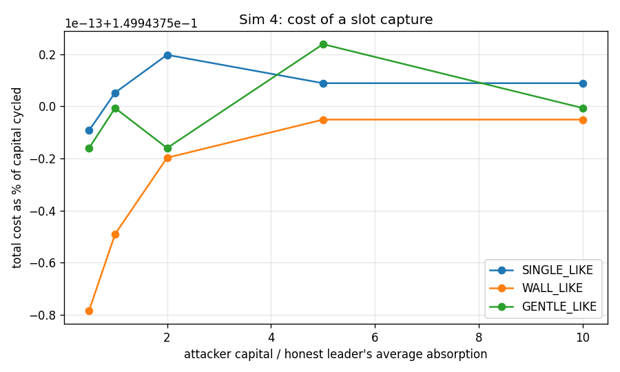
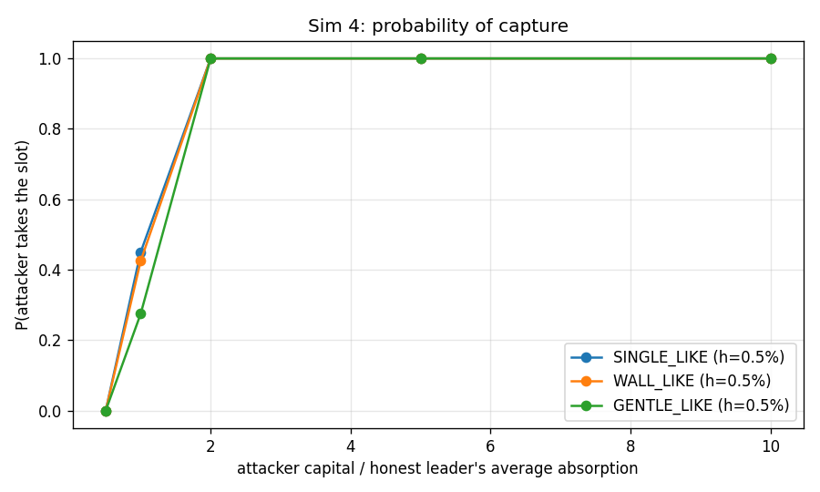

### interpretation

Round run directly on top of GENESIS, so parent tokens convert at $2.50e-04 each (genesis FDV $250,000). The brief's disclosure that *slot capture costs about fees* is VERIFIED, and it is worse than the word 'fees' suggests. At 2x the honest leader's average absorption the attacker takes the slot with probability 100% on the SINGLE-like curve for a total cost of $5 on $3,210 of capital cycled - 0.15% of the capital, which is exactly 1 - (1 - f_hop)^2 for a 7.5 bps hop fee. 100% of that cost is the hop fee and nothing else: the snipe tax is *identically zero* at t = 3.1 s because the hook only taxes the first 3 s, and the round trip's price impact is zero to machine precision because a buy and a sell across the same static curve are exact inverses. The attacker rents the slot, pays the toll, and walks away with the capital. Averaged over every curve at 2x capital or more, P(capture) is 100%. Set against an estimated slot value of $17,250 (next round's buy pressure on the head, $16,250, plus one round of creator fee flow, $1,000), capture is profitable by roughly 3584x for anyone with the float. The curve sweep matters less than the threshold sweep: h only changes whether *anyone* wins, not who. The variants close off the cheaper shortcuts. late_spike costs the same $6 and tops the round 0% of the time: capital held for one second contributes 1/600 of itself to an average taken over the whole window, so a last-second spike is arithmetically incapable of buying the slot - attack-log finding 10 holds. block1_sweep loses $12,427 paying the opening tax and tops the round 0% of the time here, though Sim 5 shows the same sweep turning a profit when the curve runs two orders of magnitude inside the window - the 99% tax prices the sweep, it does not forbid it. dynastic is simply self_fund_win that keeps the position, and it shows the capture is not even a cost: the attacker ends the round holding a mark-to-market gain. The refundable-score risk in attack-log finding 5 is real, quantified, and only mitigable by making score cost something non-refundable.

*Modelling notes:* Slot value is an estimate, not a measurement: next round's head demand assumes 5 candidates each drawing A_BASE = 13,000,000 parent, and the creator stream assumes $250,000 of ETH-edge volume in the round the attacker's token is the numeraire.

## Sim 1 - Lifecycle: GENESIS to #20, 5 candidates per round

**Claim under test:** creators and developer earn meaningfully; ancestors keep receiving  
**Runtime:** 1.8 s

### per generation

| generation | attempt | winner | winner_interest | best_avg_parent | threshold_parent | avg_over_threshold | embedded_parent | float_frac | fdv_parent | fdv_eth | fdv_usd | edge_volume_eth | protocol_fee_eth | creator_usd | dev_usd | ancestor_usd | reinforce_usd | fdv_vs_parent | backing_frac |
|---|---|---|---|---|---|---|---|---|---|---|---|---|---|---|---|---|---|---|---|
| 1 | 1 | c2 | 2.403 | 1.680e+07 | 5.000e+06 | 3.36 | 4.187e+07 | 0.9959 | 4.537e+09 | 322.4 | 1.290e+06 | 9.451 | 0.09496 | 151.9 | 75.96 | 75.96 | 75.96 | 4.537 | 0.00923 |
| 2 | 2 | c4 | 1.808 | 1.251e+07 | 5.000e+06 | 2.502 | 2.599e+07 | 0.9845 | 6.953e+08 | 664 | 2.656e+06 | 18.81 | 0.189 | 302.4 | 151.2 | 151.2 | 151.2 | 0.6953 | 0.03738 |
| 3 | 3 | c1 | 1.62 | 1.139e+07 | 5.000e+06 | 2.278 | 2.420e+07 | 0.9818 | 6.065e+08 | 1,168 | 4.673e+06 | 23.39 | 0.235 | 375.9 | 188 | 188 | 188 | 0.6065 | 0.03991 |
| 4 | 4 | c4 | 2.268 | 1.857e+07 | 5.000e+06 | 3.715 | 3.592e+07 | 0.9941 | 2.217e+09 | 6,576 | 2.630e+07 | 22.92 | 0.2302 | 368.4 | 184.2 | 184.2 | 184.2 | 2.217 | 0.0162 |
| 5 | 5 | c4 | 1.357 | 1.111e+07 | 5.000e+06 | 2.222 | 2.108e+07 | 0.9759 | 4.655e+08 | 7,653 | 3.061e+07 | 22.2 | 0.223 | 356.8 | 178.4 | 178.4 | 178.4 | 0.4655 | 0.04528 |
| 6 | 6 | c3 | 1.429 | 1.044e+07 | 5.000e+06 | 2.089 | 1.984e+07 | 0.9731 | 4.149e+08 | 6,881 | 2.752e+07 | 21.55 | 0.2164 | 346.2 | 173.1 | 173.1 | 173.1 | 0.4149 | 0.04783 |
| 7 | 7 | c1 | 1.202 | 1.125e+07 | 5.000e+06 | 2.25 | 2.280e+07 | 0.9794 | 5.410e+08 | 7,136 | 2.855e+07 | 21.02 | 0.211 | 337.7 | 168.8 | 168.8 | 168.8 | 0.541 | 0.04215 |
| 8 | 8 | c0 | 1.956 | 1.722e+07 | 5.000e+06 | 3.443 | 3.383e+07 | 0.9929 | 1.598e+09 | 1.948e+04 | 7.791e+07 | 20.8 | 0.2088 | 334.1 | 167.1 | 167.1 | 167.1 | 1.598 | 0.02116 |
| 9 | 9 | c1 | 1.825 | 1.590e+07 | 5.000e+06 | 3.179 | 3.226e+07 | 0.9918 | 1.200e+09 | 3.672e+04 | 1.469e+08 | 20.93 | 0.2101 | 336.2 | 168.1 | 168.1 | 168.1 | 1.2 | 0.02689 |
| 10 | 10 | c1 | 1.358 | 1.201e+07 | 5.000e+06 | 2.402 | 2.340e+07 | 0.9804 | 5.685e+08 | 3.449e+04 | 1.380e+08 | 21.38 | 0.2147 | 343.5 | 171.7 | 171.7 | 171.7 | 0.5685 | 0.04116 |
| 11 | 11 | c0 | 1.616 | 1.209e+07 | 5.000e+06 | 2.418 | 2.536e+07 | 0.9836 | 6.631e+08 | 4.583e+04 | 1.833e+08 | 21.04 | 0.2113 | 338 | 169 | 169 | 169 | 0.6631 | 0.03824 |
| 12 | 12 | c3 | 2.545 | 1.833e+07 | 5.000e+06 | 3.667 | 3.634e+07 | 0.9942 | 2.357e+09 | 1.924e+05 | 7.695e+08 | 20.56 | 0.2064 | 330.2 | 165.1 | 165.1 | 165.1 | 2.357 | 0.01542 |
| 13 | 13 | c0 | 1.399 | 1.145e+07 | 5.000e+06 | 2.289 | 2.244e+07 | 0.9787 | 5.248e+08 | 1.648e+05 | 6.592e+08 | 20.17 | 0.2025 | 324 | 162 | 162 | 162 | 0.5248 | 0.04276 |
| 14 | 14 | c1 | 2.743 | 1.897e+07 | 5.000e+06 | 3.793 | 3.814e+07 | 0.9949 | 2.985e+09 | 7.462e+05 | 2.985e+09 | 19.89 | 0.1996 | 319.4 | 159.7 | 159.7 | 159.7 | 2.985 | 0.01277 |
| 15 | 15 | c1 | 0.6821 | 6.432e+06 | 5.000e+06 | 1.286 | 1.153e+07 | 0.9398 | 1.503e+08 | 1.609e+05 | 6.436e+08 | 19.67 | 0.1974 | 315.8 | 157.9 | 157.9 | 157.9 | 0.1503 | 0.07674 |
| 16 | 16 | c2 | 2.551 | 2.024e+07 | 5.000e+06 | 4.047 | 3.848e+07 | 0.995 | 3.115e+09 | 6.87e+05 | 2.748e+09 | 19.5 | 0.1957 | 313.2 | 156.6 | 156.6 | 156.6 | 3.115 | 0.01235 |
| 17 | 17 | c2 | 2.212 | 1.604e+07 | 5.000e+06 | 3.207 | 3.069e+07 | 0.9903 | 9.586e+08 | 8.727e+05 | 3.491e+09 | 19.37 | 0.1943 | 311 | 155.5 | 155.5 | 155.5 | 0.9586 | 0.03202 |
| 18 | 18 | c3 | 2.028 | 1.763e+07 | 5.000e+06 | 3.527 | 3.375e+07 | 0.9929 | 1.578e+09 | 1.772e+06 | 7.088e+09 | 19.26 | 0.1932 | 309.2 | 154.6 | 154.6 | 154.6 | 1.578 | 0.02138 |
| 19 | 19 | c1 | 2.173 | 1.644e+07 | 5.000e+06 | 3.289 | 3.221e+07 | 0.9918 | 1.188e+09 | 2.643e+06 | 1.057e+10 | 19.16 | 0.1923 | 307.7 | 153.8 | 153.8 | 153.8 | 1.188 | 0.02712 |
| 20 | 20 | c4 | 1.658 | 1.275e+07 | 5.000e+06 | 2.551 | 2.513e+07 | 0.9833 | 6.520e+08 | 2.121e+06 | 8.485e+09 | 19.09 | 0.1915 | 306.4 | 153.2 | 153.2 | 153.2 | 0.652 | 0.03855 |

CSV: `docs/results/sim01_per_generation.csv`

### fee flow by recipient

| recipient | kind | target | amount | share | amount_usd |
|---|---|---|---|---|---|
| ancestor:0 | ancestor | 0 | 0.244 | 0.05968 | 976.1 |
| ancestor:1 | ancestor | 1 | 0.1254 | 0.03067 | 501.7 |
| ancestor:2 | ancestor | 2 | 0.08835 | 0.02161 | 353.4 |
| ancestor:3 | ancestor | 3 | 0.06515 | 0.01593 | 260.6 |
| ancestor:4 | ancestor | 4 | 0.05012 | 0.01226 | 200.5 |
| ancestor:5 | ancestor | 5 | 0.03986 | 0.009749 | 159.4 |
| ancestor:6 | ancestor | 6 | 0.03264 | 0.007983 | 130.6 |
| ancestor:7 | ancestor | 7 | 0.02746 | 0.006715 | 109.8 |
| ancestor:8 | ancestor | 8 | 0.02361 | 0.005774 | 94.44 |
| ancestor:9 | ancestor | 9 | 0.02059 | 0.005035 | 82.34 |
| ancestor:10 | ancestor | 10 | 0.018 | 0.004402 | 72 |
| ancestor:11 | ancestor | 11 | 0.01585 | 0.003876 | 63.39 |
| ancestor:12 | ancestor | 12 | 0.01402 | 0.003428 | 56.07 |
| ancestor:13 | ancestor | 13 | 0.01238 | 0.003028 | 49.53 |
| ancestor:14 | ancestor | 14 | 0.01084 | 0.002651 | 43.35 |
| ancestor:15 | ancestor | 15 | 0.009305 | 0.002276 | 37.22 |
| ancestor:16 | ancestor | 16 | 0.00772 | 0.001888 | 30.88 |
| ancestor:17 | ancestor | 17 | 0.006034 | 0.001476 | 24.14 |
| ancestor:18 | ancestor | 18 | 0.004207 | 0.001029 | 16.83 |
| ancestor:19 | ancestor | 19 | 0.002205 | 5.394e-04 | 8.822 |
| creator:0 | creator | 0 | 0.02858 | 0.00699 | 114.3 |
| creator:1 | creator | 1 | 0.03798 | 0.009289 | 151.9 |
| creator:2 | creator | 2 | 0.07561 | 0.01849 | 302.4 |
| creator:3 | creator | 3 | 0.09398 | 0.02298 | 375.9 |
| creator:4 | creator | 4 | 0.0921 | 0.02252 | 368.4 |
| creator:5 | creator | 5 | 0.08921 | 0.02182 | 356.8 |
| creator:6 | creator | 6 | 0.08655 | 0.02117 | 346.2 |
| creator:7 | creator | 7 | 0.08442 | 0.02065 | 337.7 |
| creator:8 | creator | 8 | 0.08353 | 0.02043 | 334.1 |
| creator:9 | creator | 9 | 0.08404 | 0.02055 | 336.2 |
| creator:10 | creator | 10 | 0.08587 | 0.021 | 343.5 |
| creator:11 | creator | 11 | 0.08451 | 0.02067 | 338 |
| creator:12 | creator | 12 | 0.08255 | 0.02019 | 330.2 |
| creator:13 | creator | 13 | 0.08099 | 0.01981 | 324 |
| creator:14 | creator | 14 | 0.07984 | 0.01953 | 319.4 |
| creator:15 | creator | 15 | 0.07895 | 0.01931 | 315.8 |
| creator:16 | creator | 16 | 0.07829 | 0.01915 | 313.2 |
| creator:17 | creator | 17 | 0.07774 | 0.01901 | 311 |
| creator:18 | creator | 18 | 0.07729 | 0.0189 | 309.2 |
| creator:19 | creator | 19 | 0.07692 | 0.01881 | 307.7 |
| creator:20 | creator | 20 | 0.07661 | 0.01874 | 306.4 |
| dev | dev | -1 | 0.8178 | 0.2 | 3,271 |
| reinforce:0 | reinforce | 0 | 0.03328 | 0.008139 | 133.1 |
| reinforce:1 | reinforce | 1 | 0.0378 | 0.009245 | 151.2 |
| reinforce:2 | reinforce | 2 | 0.04699 | 0.01149 | 188 |
| reinforce:3 | reinforce | 3 | 0.04605 | 0.01126 | 184.2 |
| reinforce:4 | reinforce | 4 | 0.04461 | 0.01091 | 178.4 |
| reinforce:5 | reinforce | 5 | 0.04327 | 0.01058 | 173.1 |
| reinforce:6 | reinforce | 6 | 0.04221 | 0.01032 | 168.8 |
| reinforce:7 | reinforce | 7 | 0.04176 | 0.01021 | 167.1 |
| reinforce:8 | reinforce | 8 | 0.04202 | 0.01028 | 168.1 |
| reinforce:9 | reinforce | 9 | 0.04294 | 0.0105 | 171.7 |
| reinforce:10 | reinforce | 10 | 0.04226 | 0.01033 | 169 |
| reinforce:11 | reinforce | 11 | 0.04127 | 0.01009 | 165.1 |
| reinforce:12 | reinforce | 12 | 0.04049 | 0.009903 | 162 |
| reinforce:13 | reinforce | 13 | 0.03992 | 0.009763 | 159.7 |
| reinforce:14 | reinforce | 14 | 0.03948 | 0.009655 | 157.9 |
| reinforce:15 | reinforce | 15 | 0.03915 | 0.009574 | 156.6 |
| reinforce:16 | reinforce | 16 | 0.03887 | 0.009506 | 155.5 |
| reinforce:17 | reinforce | 17 | 0.03865 | 0.009452 | 154.6 |
| reinforce:18 | reinforce | 18 | 0.03846 | 0.009406 | 153.8 |
| reinforce:19 | reinforce | 19 | 0.0383 | 0.009368 | 153.2 |

CSV: `docs/results/sim01_fee_flow_by_recipient.csv`

### fee totals by kind

| kind | amount_usd | share |
|---|---|---|
| creator | 6,542 | 0.4 |
| dev | 3,271 | 0.2 |
| ancestor | 3,271 | 0.2 |
| reinforce | 3,271 | 0.2 |

CSV: `docs/results/sim01_fee_totals_by_kind.csv`

### figures

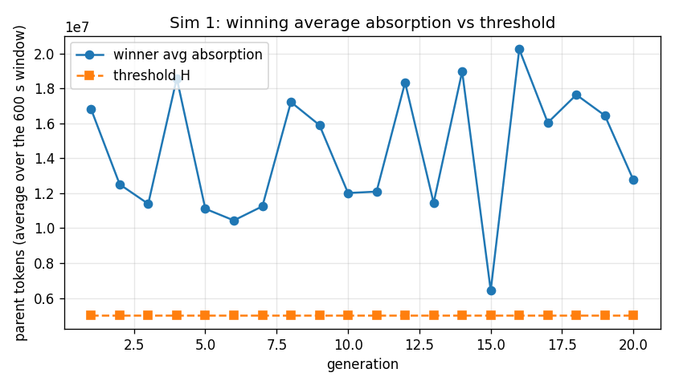
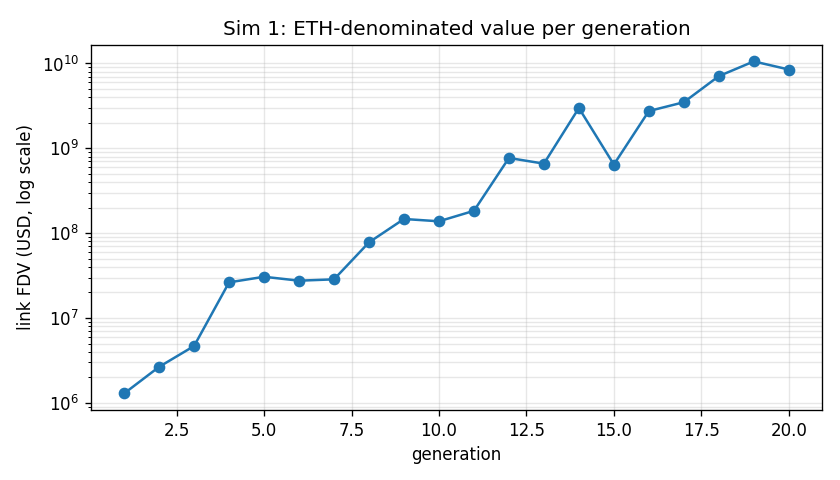
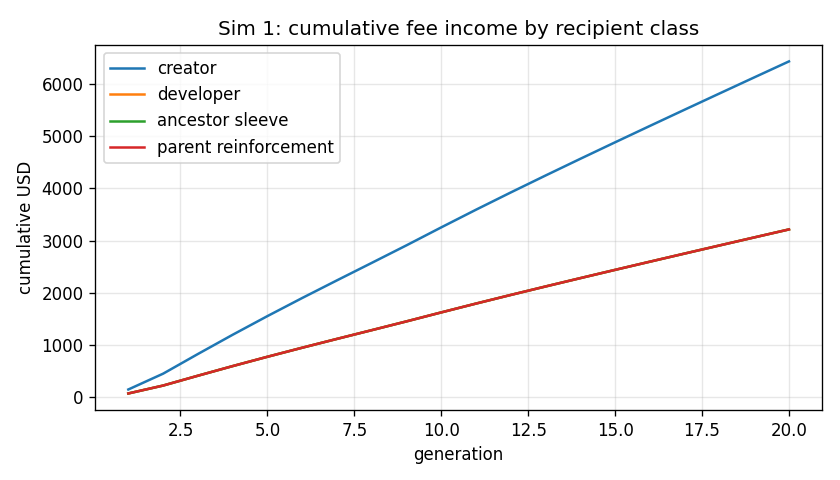
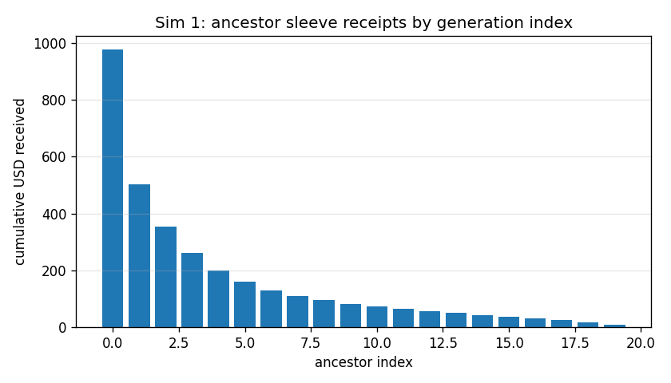

### interpretation

Brief-literal chain (a0 = 1e-3 at every link). 20 of 20 rounds produced a winner (0 failed). The claim *ancestors keep receiving* is VERIFIED mechanically: all 20 ancestor indices hold a non-zero balance, because the sleeve pays ancestors 0..M on every ETH-edge swap and M grows with the chain; over the run the split lands exactly on the configured 20%/40%/20%/20% shares. The claim *creators and developer earn meaningfully* is VERIFIED conditional on volume and on nothing else: at $50,000 of entry per round the creator of a winning link takes a median $327 and the developer half of that, for run totals of $6,542 and $3,271 plus $3,271 to the ancestor sleeve. That is a fee split doing its job, not a business - the number is linear in edge volume and there is no other source. The scenario's real finding is elsewhere. To clear a threshold of 0.5% of parent supply *as an average over the full 600 s*, a winner has to absorb 2.9x that threshold in total, and the standard curve cannot survive it: the median winner finishes the round with 98.7% of its supply already sold and an FDV of 0.83x its own parent's, backed by embedded parent worth only 3.47% of that mark. Each generation is therefore marked *up* relative to its parent while being backed by a thinner and thinner slice of real liquidity - head FDV runs from $1,289,630 at #1 to $8.49e+09 at #20, which is a mark-to-market artefact of an exhausted bonding curve, not value. The actionable conclusion for the deploy constants: h = 0.5% is too high for this curve, or the curve's body is too thin for this h. Sim 4 and Sim 8 are where that pair gets set; the invariant in section 3 (H <= 25% of wall absorption) is satisfied here and is *not* sufficient, because it bounds the average while the round consumes the total.

*Modelling notes:* ETH-edge volume per round is exogenous ($50,000 in, 50% back out), capped at 5% of the head's ETH FDV so a single trade cannot exceed the link's own size. Losing candidates are kept as side pools parented at the previous head.

## Sim 2 - Stochastic chains: 200 Monte Carlo runs per demand regime

**Claim under test:** decay-with-floor keeps the chain alive without junk wins  
**Runtime:** 1.1 s

### survival

| demand_regime | k | p_reach_k_in_k_rounds | p_reach_k_in_2k_rounds | mean_rounds_to_reach_k | budget_rounds |
|---|---|---|---|---|---|
| 0.2 | 5 | 0 | 0.58 | 10.01 | 40 |
| 0.2 | 10 | 0 | 0.925 | 17.51 | 40 |
| 0.2 | 20 | 0 | 1 | 30.23 | 40 |
| 0.35 | 5 | 0.1 | 0.985 | 7.225 | 40 |
| 0.35 | 10 | 0.015 | 1 | 13.74 | 40 |
| 0.35 | 20 | 0 | 1 | 25.73 | 40 |
| 0.5 | 5 | 0.325 | 1 | 6.18 | 40 |
| 0.5 | 10 | 0.08 | 1 | 12.14 | 40 |
| 0.5 | 20 | 0.005 | 1 | 23.62 | 40 |
| 1 | 5 | 0.795 | 1 | 5.245 | 40 |
| 1 | 10 | 0.645 | 1 | 10.46 | 40 |
| 1 | 20 | 0.34 | 1 | 20.93 | 40 |

CSV: `docs/results/sim02_survival.csv`

### summary

| demand_regime | chains | mean_index_reached | rounds_simulated | frac_rounds_no_winner | wins | rounds_per_win | zombie_win_rate |
|---|---|---|---|---|---|---|---|
| 0.2 | 200 | 20 | 6046 | 0.3384 | 4000 | 1.512 | 0.077 |
| 0.35 | 200 | 20 | 5146 | 0.2227 | 4000 | 1.286 | 0.001 |
| 0.5 | 200 | 20 | 4724 | 0.1533 | 4000 | 1.181 | 0 |
| 1 | 200 | 20 | 4187 | 0.04466 | 4000 | 1.047 | 0 |

CSV: `docs/results/sim02_summary.csv`

### threshold path

| demand_regime | round_number | chains_still_running | mean_threshold_parent | min_threshold_parent |
|---|---|---|---|---|
| 0.2 | 1 | 200 | 5.000e+06 | 5.000e+06 |
| 0.2 | 2 | 200 | 4.675e+06 | 4.500e+06 |
| 0.2 | 3 | 200 | 4.384e+06 | 4.050e+06 |
| 0.2 | 4 | 200 | 4.152e+06 | 3.645e+06 |
| 0.2 | 5 | 200 | 3.909e+06 | 3.280e+06 |
| 0.2 | 6 | 200 | 3.704e+06 | 2.952e+06 |
| 0.2 | 7 | 200 | 3.524e+06 | 2.657e+06 |
| 0.2 | 8 | 200 | 3.338e+06 | 2.391e+06 |
| 0.2 | 9 | 200 | 3.192e+06 | 2.152e+06 |
| 0.2 | 10 | 200 | 3.048e+06 | 1.937e+06 |
| 0.2 | 11 | 200 | 2.922e+06 | 1.937e+06 |
| 0.2 | 12 | 200 | 2.801e+06 | 1.937e+06 |
| 0.2 | 13 | 200 | 2.693e+06 | 1.937e+06 |
| 0.2 | 14 | 200 | 2.607e+06 | 1.937e+06 |
| 0.2 | 15 | 200 | 2.523e+06 | 1.937e+06 |
| 0.2 | 16 | 200 | 2.438e+06 | 1.743e+06 |
| 0.2 | 17 | 200 | 2.366e+06 | 1.569e+06 |
| 0.2 | 18 | 200 | 2.287e+06 | 1.569e+06 |
| 0.2 | 19 | 200 | 2.217e+06 | 1.569e+06 |
| 0.2 | 20 | 200 | 2.155e+06 | 1.569e+06 |
| 0.2 | 21 | 200 | 2.102e+06 | 1.412e+06 |
| 0.2 | 22 | 200 | 2.058e+06 | 1.412e+06 |
| 0.2 | 23 | 200 | 1.995e+06 | 1.412e+06 |
| 0.2 | 24 | 200 | 1.944e+06 | 1.271e+06 |
| 0.2 | 25 | 200 | 1.909e+06 | 1.250e+06 |
| 0.2 | 26 | 199 | 1.873e+06 | 1.250e+06 |
| 0.2 | 27 | 195 | 1.824e+06 | 1.250e+06 |
| 0.2 | 28 | 184 | 1.759e+06 | 1.250e+06 |
| 0.2 | 29 | 172 | 1.694e+06 | 1.250e+06 |
| 0.2 | 30 | 137 | 1.597e+06 | 1.250e+06 |
| 0.2 | 31 | 91 | 1.491e+06 | 1.250e+06 |
| 0.2 | 32 | 45 | 1.377e+06 | 1.250e+06 |
| 0.2 | 33 | 17 | 1.266e+06 | 1.250e+06 |
| 0.2 | 34 | 5 | 1.250e+06 | 1.250e+06 |
| 0.2 | 35 | 1 | 1.250e+06 | 1.250e+06 |
| 0.35 | 1 | 200 | 5.000e+06 | 5.000e+06 |
| 0.35 | 2 | 200 | 4.830e+06 | 4.500e+06 |
| 0.35 | 3 | 200 | 4.659e+06 | 4.050e+06 |
| 0.35 | 4 | 200 | 4.507e+06 | 3.645e+06 |
| 0.35 | 5 | 200 | 4.357e+06 | 3.280e+06 |
| 0.35 | 6 | 200 | 4.224e+06 | 3.280e+06 |
| 0.35 | 7 | 200 | 4.097e+06 | 2.952e+06 |
| 0.35 | 8 | 200 | 3.953e+06 | 2.952e+06 |
| 0.35 | 9 | 200 | 3.867e+06 | 2.952e+06 |
| 0.35 | 10 | 200 | 3.795e+06 | 2.657e+06 |
| 0.35 | 11 | 200 | 3.692e+06 | 2.657e+06 |
| 0.35 | 12 | 200 | 3.610e+06 | 2.391e+06 |
| 0.35 | 13 | 200 | 3.510e+06 | 2.391e+06 |
| 0.35 | 14 | 200 | 3.433e+06 | 2.391e+06 |
| 0.35 | 15 | 200 | 3.332e+06 | 2.391e+06 |
| 0.35 | 16 | 200 | 3.266e+06 | 2.391e+06 |
| 0.35 | 17 | 200 | 3.204e+06 | 2.152e+06 |
| 0.35 | 18 | 200 | 3.145e+06 | 1.937e+06 |
| 0.35 | 19 | 200 | 3.065e+06 | 1.937e+06 |
| 0.35 | 20 | 200 | 3.018e+06 | 1.937e+06 |
| 0.35 | 21 | 200 | 2.970e+06 | 1.937e+06 |
| 0.35 | 22 | 200 | 2.933e+06 | 1.937e+06 |
| 0.35 | 23 | 197 | 2.873e+06 | 1.937e+06 |
| 0.35 | 24 | 193 | 2.822e+06 | 1.937e+06 |
| 0.35 | 25 | 164 | 2.691e+06 | 1.937e+06 |
| 0.35 | 26 | 106 | 2.506e+06 | 1.937e+06 |
| 0.35 | 27 | 58 | 2.297e+06 | 1.937e+06 |
| 0.35 | 28 | 23 | 2.124e+06 | 1.937e+06 |
| 0.35 | 29 | 4 | 1.937e+06 | 1.937e+06 |
| 0.35 | 30 | 1 | 1.743e+06 | 1.743e+06 |
| 0.5 | 1 | 200 | 5.000e+06 | 5.000e+06 |
| 0.5 | 2 | 200 | 4.890e+06 | 4.500e+06 |
| 0.5 | 3 | 200 | 4.782e+06 | 4.050e+06 |
| 0.5 | 4 | 200 | 4.697e+06 | 3.645e+06 |
| 0.5 | 5 | 200 | 4.598e+06 | 3.645e+06 |
| 0.5 | 6 | 200 | 4.519e+06 | 3.280e+06 |
| 0.5 | 7 | 200 | 4.426e+06 | 3.280e+06 |
| 0.5 | 8 | 200 | 4.333e+06 | 3.280e+06 |
| 0.5 | 9 | 200 | 4.257e+06 | 3.280e+06 |
| 0.5 | 10 | 200 | 4.193e+06 | 3.280e+06 |
| 0.5 | 11 | 200 | 4.127e+06 | 2.952e+06 |
| 0.5 | 12 | 200 | 4.069e+06 | 2.952e+06 |
| 0.5 | 13 | 200 | 4.005e+06 | 2.952e+06 |
| 0.5 | 14 | 200 | 3.932e+06 | 2.657e+06 |
| 0.5 | 15 | 200 | 3.873e+06 | 2.657e+06 |
| 0.5 | 16 | 200 | 3.830e+06 | 2.657e+06 |
| 0.5 | 17 | 200 | 3.759e+06 | 2.391e+06 |
| 0.5 | 18 | 200 | 3.721e+06 | 2.391e+06 |
| 0.5 | 19 | 200 | 3.668e+06 | 2.391e+06 |
| 0.5 | 20 | 200 | 3.629e+06 | 2.391e+06 |
| 0.5 | 21 | 199 | 3.580e+06 | 2.391e+06 |
| 0.5 | 22 | 187 | 3.472e+06 | 2.391e+06 |
| 0.5 | 23 | 154 | 3.311e+06 | 2.391e+06 |
| 0.5 | 24 | 105 | 3.094e+06 | 2.391e+06 |
| 0.5 | 25 | 51 | 2.817e+06 | 2.391e+06 |
| 0.5 | 26 | 19 | 2.547e+06 | 2.152e+06 |
| 0.5 | 27 | 7 | 2.323e+06 | 2.152e+06 |
| 0.5 | 28 | 2 | 2.152e+06 | 2.152e+06 |
| 1 | 1 | 200 | 5.000e+06 | 5.000e+06 |
| 1 | 2 | 200 | 4.975e+06 | 4.500e+06 |
| 1 | 3 | 200 | 4.950e+06 | 4.500e+06 |
| 1 | 4 | 200 | 4.938e+06 | 4.050e+06 |
| 1 | 5 | 200 | 4.904e+06 | 4.050e+06 |
| 1 | 6 | 200 | 4.886e+06 | 4.050e+06 |
| 1 | 7 | 200 | 4.855e+06 | 3.645e+06 |
| 1 | 8 | 200 | 4.840e+06 | 3.645e+06 |
| 1 | 9 | 200 | 4.816e+06 | 3.645e+06 |
| 1 | 10 | 200 | 4.802e+06 | 3.645e+06 |
| 1 | 11 | 200 | 4.778e+06 | 3.645e+06 |
| 1 | 12 | 200 | 4.768e+06 | 3.645e+06 |
| 1 | 13 | 200 | 4.744e+06 | 3.645e+06 |
| 1 | 14 | 200 | 4.736e+06 | 3.645e+06 |
| 1 | 15 | 200 | 4.717e+06 | 3.645e+06 |
| 1 | 16 | 200 | 4.691e+06 | 3.645e+06 |
| 1 | 17 | 200 | 4.654e+06 | 3.645e+06 |
| 1 | 18 | 200 | 4.621e+06 | 3.645e+06 |
| 1 | 19 | 200 | 4.604e+06 | 3.645e+06 |
| 1 | 20 | 200 | 4.578e+06 | 3.645e+06 |
| 1 | 21 | 132 | 4.329e+06 | 3.645e+06 |
| 1 | 22 | 45 | 3.978e+06 | 3.645e+06 |
| 1 | 23 | 9 | 3.604e+06 | 3.280e+06 |
| 1 | 24 | 1 | 3.280e+06 | 3.280e+06 |

CSV: `docs/results/sim02_threshold_path.csv`

### calibration

| k_mean | k_sd | a_base_parent | h0_parent | h_floor_parent | zombie_line_parent | gen_interest_sigma | calibration_rounds |
|---|---|---|---|---|---|---|---|
| 0.7197 | 0.1258 | 1.300e+07 | 5.000e+06 | 1.250e+06 | 2.500e+06 | 0.6999 | 20 |

CSV: `docs/results/sim02_calibration.csv`

### figures

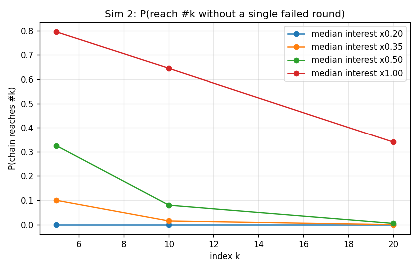
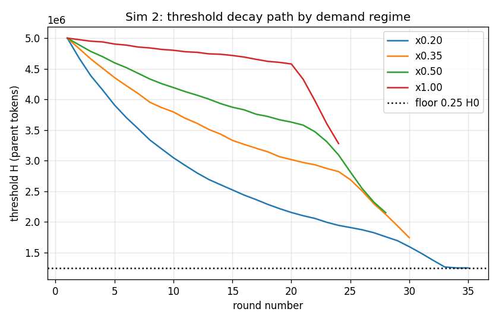

### interpretation

Reduced-form rounds: the full agent engine was run 20 times to fit avg_absorption = k * interest * A_BASE (k = 0.720 +/- 0.126), and the Monte Carlo then draws interest as a per-generation lognormal factor spanning 10x (sigma = 0.70) times a per-candidate lognormal (sigma = 0.6), all scaled by a demand regime - because the answer turns out to be entirely a function of how much demand the market brings. At the baseline calibration (x1.00) the mechanism is nowhere near binding: 4.5% of rounds fail and it takes 20.9 rounds to get to #20, with a zombie rate of 0.0%. The regime that actually tests the claim is thin demand (x0.20), where 33.8% of rounds fail, reaching #20 takes 30.2 rounds instead of 20, and only 0% of chains get there without a single failed round. Every chain does eventually get there - a stalled round costs time, never the chain. There the claim holds in both directions: the x0.9 decay pulls H down fast enough that a stalled chain restarts within a handful of rounds, while the 25% floor (1,250,000 parent - 0.125% of parent supply absorbed on average for ten straight minutes) still pushes 7.7% of wins into the junk category rather than letting the bar fall to nothing. Decay-with-floor is VERIFIED. Two exposures the numbers make visible: H never re-arms upward after a win, so one bad patch permanently lowers the bar for the rest of the chain's life; and because the score is an *average* over the whole window, a thin round is decided by whichever single candidate drew the fat tail, not by aggregate interest.

*Modelling notes:* H persists across wins (brief section 2 only ever decays it), so the threshold path is monotone non-increasing per chain. Every chain gets a budget of 40 rounds to reach #20, and each demand regime is an independent set of 200 chains.

## Sim 3 - Bad-link collapse at #6 on a 12-link chain

**Claim under test:** best-route + reinforcement mitigates a weak link  
**Runtime:** 0.4 s

### route slippage

| shock | reinforcement | external_market | dst | mode | hops | uses_external | slippage_frac | slippage_usd_on_5k | protocol_fee_eth | hop_fee_legs | exhausted | tokens_out | link6_drawdown | excess_slippage_vs_healthy |
|---|---|---|---|---|---|---|---|---|---|---|---|---|---|---|
| 0 | none | healthy | 10 | FULL_LINE | 11 | no | 0.09047 | 452.4 | 0.0125 | 11 | no | 4.822e+06 | n/a | 0 |
| 0 | none | healthy | 10 | PARENT_SOURCED | 2 | yes | 0.03486 | 174.3 | 0 | 2 | no | 5.117e+06 | n/a | 0 |
| 0 | none | healthy | 10 | DEPTH_CAPPED(3) | 2 | yes | 0.03486 | 174.3 | 0 | 2 | no | 5.117e+06 | n/a | 0 |
| 0 | none | healthy | 12 | FULL_LINE | 13 | no | 0.1038 | 518.9 | 0.0125 | 13 | no | 4.751e+06 | n/a | 0 |
| 0 | none | healthy | 12 | PARENT_SOURCED | 4 | yes | 0.04975 | 248.7 | 0 | 4 | no | 5.038e+06 | n/a | 0 |
| 0 | none | healthy | 12 | DEPTH_CAPPED(3) | 4 | yes | 0.04975 | 248.7 | 0 | 4 | no | 5.038e+06 | n/a | 0 |
| 0.5 | none | independent | 10 | FULL_LINE | 11 | no | 0.1027 | 513.7 | 0.0125 | 11 | no | 6.942e+06 | 0.3148 | 0.01227 |
| 0.5 | none | independent | 10 | PARENT_SOURCED | 11 | no | 0.1027 | 513.7 | 0.0125 | 11 | no | 6.942e+06 | 0.3148 | 0.06788 |
| 0.5 | none | independent | 10 | DEPTH_CAPPED(3) | 11 | no | 0.1027 | 513.7 | 0.0125 | 11 | no | 6.942e+06 | 0.3148 | 0.06788 |
| 0.5 | none | independent | 12 | FULL_LINE | 13 | no | 0.121 | 604.8 | 0.0125 | 13 | no | 6.802e+06 | 0.3148 | 0.01717 |
| 0.5 | none | independent | 12 | PARENT_SOURCED | 13 | no | 0.121 | 604.8 | 0.0125 | 13 | no | 6.802e+06 | 0.3148 | 0.07121 |
| 0.5 | none | independent | 12 | DEPTH_CAPPED(3) | 13 | no | 0.121 | 604.8 | 0.0125 | 13 | no | 6.802e+06 | 0.3148 | 0.07121 |
| 0.5 | none | arbitraged | 10 | FULL_LINE | 11 | no | 0.09238 | 461.9 | 0.0125 | 11 | no | 5.430e+06 | 0.2964 | 0.001907 |
| 0.5 | none | arbitraged | 10 | PARENT_SOURCED | 2 | yes | 0.05638 | 281.9 | 0 | 2 | no | 5.646e+06 | 0.2964 | 0.02152 |
| 0.5 | none | arbitraged | 10 | DEPTH_CAPPED(3) | 2 | yes | 0.05638 | 281.9 | 0 | 2 | no | 5.646e+06 | 0.2964 | 0.02152 |
| 0.5 | none | arbitraged | 12 | FULL_LINE | 13 | no | 0.1071 | 535.7 | 0.0125 | 13 | no | 5.342e+06 | 0.2964 | 0.003362 |
| 0.5 | none | arbitraged | 12 | PARENT_SOURCED | 4 | yes | 0.07228 | 361.4 | 0 | 4 | no | 5.551e+06 | 0.2964 | 0.02253 |
| 0.5 | none | arbitraged | 12 | DEPTH_CAPPED(3) | 4 | yes | 0.07228 | 361.4 | 0 | 4 | no | 5.551e+06 | 0.2964 | 0.02253 |
| 0.5 | fee_funded_3_rounds | independent | 10 | FULL_LINE | 11 | no | 0.1011 | 505.3 | 0.0125 | 11 | no | 6.751e+06 | 0.312 | 0.0106 |
| 0.5 | fee_funded_3_rounds | independent | 10 | PARENT_SOURCED | 11 | no | 0.1011 | 505.3 | 0.0125 | 11 | no | 6.751e+06 | 0.312 | 0.06621 |
| 0.5 | fee_funded_3_rounds | independent | 10 | DEPTH_CAPPED(3) | 11 | no | 0.1011 | 505.3 | 0.0125 | 11 | no | 6.751e+06 | 0.312 | 0.06621 |
| 0.5 | fee_funded_3_rounds | independent | 12 | FULL_LINE | 13 | no | 0.1189 | 594.3 | 0.0125 | 13 | no | 6.617e+06 | 0.312 | 0.01508 |
| 0.5 | fee_funded_3_rounds | independent | 12 | PARENT_SOURCED | 13 | no | 0.1189 | 594.3 | 0.0125 | 13 | no | 6.617e+06 | 0.312 | 0.06912 |
| 0.5 | fee_funded_3_rounds | independent | 12 | DEPTH_CAPPED(3) | 13 | no | 0.1189 | 594.3 | 0.0125 | 13 | no | 6.617e+06 | 0.312 | 0.06912 |
| 0.5 | fee_funded_3_rounds | arbitraged | 10 | FULL_LINE | 11 | no | 0.09162 | 458.1 | 0.0125 | 11 | no | 5.389e+06 | 0.2952 | 0.001149 |
| 0.5 | fee_funded_3_rounds | arbitraged | 10 | PARENT_SOURCED | 2 | yes | 0.05622 | 281.1 | 0 | 2 | no | 5.599e+06 | 0.2952 | 0.02136 |
| 0.5 | fee_funded_3_rounds | arbitraged | 10 | DEPTH_CAPPED(3) | 2 | yes | 0.05622 | 281.1 | 0 | 2 | no | 5.599e+06 | 0.2952 | 0.02136 |
| 0.5 | fee_funded_3_rounds | arbitraged | 12 | FULL_LINE | 13 | no | 0.1063 | 531.5 | 0.0125 | 13 | no | 5.302e+06 | 0.2952 | 0.002516 |
| 0.5 | fee_funded_3_rounds | arbitraged | 12 | PARENT_SOURCED | 4 | yes | 0.072 | 360 | 0 | 4 | no | 5.505e+06 | 0.2952 | 0.02225 |
| 0.5 | fee_funded_3_rounds | arbitraged | 12 | DEPTH_CAPPED(3) | 4 | yes | 0.072 | 360 | 0 | 4 | no | 5.505e+06 | 0.2952 | 0.02225 |
| 0.5 | cap_max | independent | 10 | FULL_LINE | 11 | no | 0.05398 | 269.9 | 0.0125 | 11 | no | 2.090e+06 | 0.3068 | -0.03649 |
| 0.5 | cap_max | independent | 10 | PARENT_SOURCED | 2 | yes | -1.316 | -6,578 | 0 | 2 | no | 5.117e+06 | 0.3068 | -1.35 |
| 0.5 | cap_max | independent | 10 | DEPTH_CAPPED(3) | 2 | yes | -1.316 | -6,578 | 0 | 2 | no | 5.117e+06 | 0.3068 | -1.35 |
| 0.5 | cap_max | independent | 12 | FULL_LINE | 13 | no | 0.06083 | 304.1 | 0.0125 | 13 | no | 2.075e+06 | 0.3068 | -0.04295 |
| 0.5 | cap_max | independent | 12 | PARENT_SOURCED | 4 | yes | -1.28 | -6,399 | 0 | 4 | no | 5.038e+06 | 0.3068 | -1.33 |
| 0.5 | cap_max | independent | 12 | DEPTH_CAPPED(3) | 4 | yes | -1.28 | -6,399 | 0 | 4 | no | 5.038e+06 | 0.3068 | -1.33 |
| 0.5 | cap_max | arbitraged | 10 | FULL_LINE | 11 | no | 0.06778 | 338.9 | 0.0125 | 11 | no | 3.848e+06 | 0.3391 | -0.02269 |
| 0.5 | cap_max | arbitraged | 10 | PARENT_SOURCED | 2 | yes | 0.01078 | 53.9 | 0 | 2 | no | 4.083e+06 | 0.3391 | -0.02408 |
| 0.5 | cap_max | arbitraged | 10 | DEPTH_CAPPED(3) | 2 | yes | 0.01078 | 53.9 | 0 | 2 | no | 4.083e+06 | 0.3391 | -0.02408 |
| 0.5 | cap_max | arbitraged | 12 | FULL_LINE | 13 | no | 0.07898 | 394.9 | 0.0125 | 13 | no | 3.802e+06 | 0.3391 | -0.02481 |
| 0.5 | cap_max | arbitraged | 12 | PARENT_SOURCED | 4 | yes | 0.02329 | 116.5 | 0 | 4 | no | 4.032e+06 | 0.3391 | -0.02646 |
| 0.5 | cap_max | arbitraged | 12 | DEPTH_CAPPED(3) | 4 | yes | 0.02329 | 116.5 | 0 | 4 | no | 4.032e+06 | 0.3391 | -0.02646 |
| 0.9 | none | independent | 10 | FULL_LINE | 11 | no | 0.1138 | 568.8 | 0.0125 | 11 | no | 8.877e+06 | 0.4708 | 0.02329 |
| 0.9 | none | independent | 10 | PARENT_SOURCED | 11 | no | 0.1138 | 568.8 | 0.0125 | 11 | no | 8.877e+06 | 0.4708 | 0.0789 |
| 0.9 | none | independent | 10 | DEPTH_CAPPED(3) | 11 | no | 0.1138 | 568.8 | 0.0125 | 11 | no | 8.877e+06 | 0.4708 | 0.0789 |
| 0.9 | none | independent | 12 | FULL_LINE | 13 | no | 0.1363 | 681.4 | 0.0125 | 13 | no | 8.652e+06 | 0.4708 | 0.0325 |
| 0.9 | none | independent | 12 | PARENT_SOURCED | 13 | no | 0.1363 | 681.4 | 0.0125 | 13 | no | 8.652e+06 | 0.4708 | 0.08654 |
| 0.9 | none | independent | 12 | DEPTH_CAPPED(3) | 13 | no | 0.1363 | 681.4 | 0.0125 | 13 | no | 8.652e+06 | 0.4708 | 0.08654 |
| 0.9 | none | arbitraged | 10 | FULL_LINE | 11 | no | 0.09485 | 474.2 | 0.0125 | 11 | no | 5.879e+06 | 0.4462 | 0.004377 |
| 0.9 | none | arbitraged | 10 | PARENT_SOURCED | 2 | yes | 0.05801 | 290.1 | 0 | 2 | no | 6.119e+06 | 0.4462 | 0.02315 |
| 0.9 | none | arbitraged | 10 | DEPTH_CAPPED(3) | 2 | yes | 0.05801 | 290.1 | 0 | 2 | no | 6.119e+06 | 0.4462 | 0.02315 |
| 0.9 | none | arbitraged | 12 | FULL_LINE | 13 | no | 0.1107 | 553.3 | 0.0125 | 13 | no | 5.777e+06 | 0.4462 | 0.00688 |
| 0.9 | none | arbitraged | 12 | PARENT_SOURCED | 4 | yes | 0.07507 | 375.4 | 0 | 4 | no | 6.008e+06 | 0.4462 | 0.02532 |
| 0.9 | none | arbitraged | 12 | DEPTH_CAPPED(3) | 4 | yes | 0.07507 | 375.4 | 0 | 4 | no | 6.008e+06 | 0.4462 | 0.02532 |
| 0.9 | fee_funded_3_rounds | independent | 10 | FULL_LINE | 11 | no | 0.1118 | 559.2 | 0.0125 | 11 | no | 8.639e+06 | 0.4688 | 0.02136 |
| 0.9 | fee_funded_3_rounds | independent | 10 | PARENT_SOURCED | 11 | no | 0.1118 | 559.2 | 0.0125 | 11 | no | 8.639e+06 | 0.4688 | 0.07698 |
| 0.9 | fee_funded_3_rounds | independent | 10 | DEPTH_CAPPED(3) | 11 | no | 0.1118 | 559.2 | 0.0125 | 11 | no | 8.639e+06 | 0.4688 | 0.07698 |
| 0.9 | fee_funded_3_rounds | independent | 12 | FULL_LINE | 13 | no | 0.1339 | 669.3 | 0.0125 | 13 | no | 8.425e+06 | 0.4688 | 0.03007 |
| 0.9 | fee_funded_3_rounds | independent | 12 | PARENT_SOURCED | 13 | no | 0.1339 | 669.3 | 0.0125 | 13 | no | 8.425e+06 | 0.4688 | 0.08411 |
| 0.9 | fee_funded_3_rounds | independent | 12 | DEPTH_CAPPED(3) | 13 | no | 0.1339 | 669.3 | 0.0125 | 13 | no | 8.425e+06 | 0.4688 | 0.08411 |
| 0.9 | fee_funded_3_rounds | arbitraged | 10 | FULL_LINE | 11 | no | 0.09408 | 470.4 | 0.0125 | 11 | no | 5.833e+06 | 0.4455 | 0.003606 |
| 0.9 | fee_funded_3_rounds | arbitraged | 10 | PARENT_SOURCED | 2 | yes | 0.05783 | 289.2 | 0 | 2 | no | 6.066e+06 | 0.4455 | 0.02297 |
| 0.9 | fee_funded_3_rounds | arbitraged | 10 | DEPTH_CAPPED(3) | 2 | yes | 0.05783 | 289.2 | 0 | 2 | no | 6.066e+06 | 0.4455 | 0.02297 |
| 0.9 | fee_funded_3_rounds | arbitraged | 12 | FULL_LINE | 13 | no | 0.1098 | 549 | 0.0125 | 13 | no | 5.732e+06 | 0.4455 | 0.006009 |
| 0.9 | fee_funded_3_rounds | arbitraged | 12 | PARENT_SOURCED | 4 | yes | 0.07476 | 373.8 | 0 | 4 | no | 5.957e+06 | 0.4455 | 0.02502 |
| 0.9 | fee_funded_3_rounds | arbitraged | 12 | DEPTH_CAPPED(3) | 4 | yes | 0.07476 | 373.8 | 0 | 4 | no | 5.957e+06 | 0.4455 | 0.02502 |
| 0.9 | cap_max | independent | 10 | FULL_LINE | 11 | no | 0.05753 | 287.7 | 0.0125 | 11 | no | 2.700e+06 | 0.4653 | -0.03294 |
| 0.9 | cap_max | independent | 10 | PARENT_SOURCED | 2 | yes | -0.7861 | -3,931 | 0 | 2 | no | 5.117e+06 | 0.4653 | -0.821 |
| 0.9 | cap_max | independent | 10 | DEPTH_CAPPED(3) | 2 | yes | -0.7861 | -3,931 | 0 | 2 | no | 5.117e+06 | 0.4653 | -0.821 |
| 0.9 | cap_max | independent | 12 | FULL_LINE | 13 | no | 0.06592 | 329.6 | 0.0125 | 13 | no | 2.676e+06 | 0.4653 | -0.03786 |
| 0.9 | cap_max | independent | 12 | PARENT_SOURCED | 4 | yes | -0.7586 | -3,793 | 0 | 4 | no | 5.038e+06 | 0.4653 | -0.8083 |
| 0.9 | cap_max | independent | 12 | DEPTH_CAPPED(3) | 4 | yes | -0.7586 | -3,793 | 0 | 4 | no | 5.038e+06 | 0.4653 | -0.8083 |
| 0.9 | cap_max | arbitraged | 10 | FULL_LINE | 11 | no | 0.06731 | 336.6 | 0.0125 | 11 | no | 4.074e+06 | 0.4826 | -0.02316 |
| 0.9 | cap_max | arbitraged | 10 | PARENT_SOURCED | 2 | yes | 0.01172 | 58.6 | 0 | 2 | no | 4.317e+06 | 0.4826 | -0.02314 |
| 0.9 | cap_max | arbitraged | 10 | DEPTH_CAPPED(3) | 2 | yes | 0.01172 | 58.6 | 0 | 2 | no | 4.317e+06 | 0.4826 | -0.02314 |
| 0.9 | cap_max | arbitraged | 12 | FULL_LINE | 13 | no | 0.07908 | 395.4 | 0.0125 | 13 | no | 4.023e+06 | 0.4826 | -0.0247 |
| 0.9 | cap_max | arbitraged | 12 | PARENT_SOURCED | 4 | yes | 0.02484 | 124.2 | 0 | 4 | no | 4.260e+06 | 0.4826 | -0.02491 |
| 0.9 | cap_max | arbitraged | 12 | DEPTH_CAPPED(3) | 4 | yes | 0.02484 | 124.2 | 0 | 4 | no | 4.260e+06 | 0.4826 | -0.02491 |
| 0.99 | none | independent | 10 | FULL_LINE | 11 | no | 0.1164 | 581.9 | 0.0125 | 11 | no | 9.340e+06 | 0.4985 | 0.02591 |
| 0.99 | none | independent | 10 | PARENT_SOURCED | 11 | no | 0.1164 | 581.9 | 0.0125 | 11 | no | 9.340e+06 | 0.4985 | 0.08152 |
| 0.99 | none | independent | 10 | DEPTH_CAPPED(3) | 11 | no | 0.1164 | 581.9 | 0.0125 | 11 | no | 9.340e+06 | 0.4985 | 0.08152 |
| 0.99 | none | independent | 12 | FULL_LINE | 13 | no | 0.1399 | 699.6 | 0.0125 | 13 | no | 9.091e+06 | 0.4985 | 0.03613 |
| 0.99 | none | independent | 12 | PARENT_SOURCED | 13 | no | 0.1399 | 699.6 | 0.0125 | 13 | no | 9.091e+06 | 0.4985 | 0.09016 |
| 0.99 | none | independent | 12 | DEPTH_CAPPED(3) | 13 | no | 0.1399 | 699.6 | 0.0125 | 13 | no | 9.091e+06 | 0.4985 | 0.09016 |
| 0.99 | none | arbitraged | 10 | FULL_LINE | 11 | no | 0.09552 | 477.6 | 0.0125 | 11 | no | 5.981e+06 | 0.4732 | 0.005054 |
| 0.99 | none | arbitraged | 10 | PARENT_SOURCED | 2 | yes | 0.05838 | 291.9 | 0 | 2 | no | 6.227e+06 | 0.4732 | 0.02352 |
| 0.99 | none | arbitraged | 10 | DEPTH_CAPPED(3) | 2 | yes | 0.05838 | 291.9 | 0 | 2 | no | 6.227e+06 | 0.4732 | 0.02352 |
| 0.99 | none | arbitraged | 12 | FULL_LINE | 13 | no | 0.1116 | 557.9 | 0.0125 | 13 | no | 5.875e+06 | 0.4732 | 0.007791 |
| 0.99 | none | arbitraged | 12 | PARENT_SOURCED | 4 | yes | 0.0757 | 378.5 | 0 | 4 | no | 6.112e+06 | 0.4732 | 0.02595 |
| 0.99 | none | arbitraged | 12 | DEPTH_CAPPED(3) | 4 | yes | 0.0757 | 378.5 | 0 | 4 | no | 6.112e+06 | 0.4732 | 0.02595 |
| 0.99 | fee_funded_3_rounds | independent | 10 | FULL_LINE | 11 | no | 0.1144 | 572 | 0.0125 | 11 | no | 9.091e+06 | 0.4967 | 0.02392 |
| 0.99 | fee_funded_3_rounds | independent | 10 | PARENT_SOURCED | 11 | no | 0.1144 | 572 | 0.0125 | 11 | no | 9.091e+06 | 0.4967 | 0.07953 |
| 0.99 | fee_funded_3_rounds | independent | 10 | DEPTH_CAPPED(3) | 11 | no | 0.1144 | 572 | 0.0125 | 11 | no | 9.091e+06 | 0.4967 | 0.07953 |
| 0.99 | fee_funded_3_rounds | independent | 12 | FULL_LINE | 13 | no | 0.1374 | 687 | 0.0125 | 13 | no | 8.855e+06 | 0.4967 | 0.03362 |
| 0.99 | fee_funded_3_rounds | independent | 12 | PARENT_SOURCED | 13 | no | 0.1374 | 687 | 0.0125 | 13 | no | 8.855e+06 | 0.4967 | 0.08765 |
| 0.99 | fee_funded_3_rounds | independent | 12 | DEPTH_CAPPED(3) | 13 | no | 0.1374 | 687 | 0.0125 | 13 | no | 8.855e+06 | 0.4967 | 0.08765 |
| 0.99 | fee_funded_3_rounds | arbitraged | 10 | FULL_LINE | 11 | no | 0.09473 | 473.7 | 0.0125 | 11 | no | 5.934e+06 | 0.4726 | 0.004262 |
| 0.99 | fee_funded_3_rounds | arbitraged | 10 | PARENT_SOURCED | 2 | yes | 0.0582 | 291 | 0 | 2 | no | 6.173e+06 | 0.4726 | 0.02334 |
| 0.99 | fee_funded_3_rounds | arbitraged | 10 | DEPTH_CAPPED(3) | 2 | yes | 0.0582 | 291 | 0 | 2 | no | 6.173e+06 | 0.4726 | 0.02334 |
| 0.99 | fee_funded_3_rounds | arbitraged | 12 | FULL_LINE | 13 | no | 0.1107 | 553.4 | 0.0125 | 13 | no | 5.829e+06 | 0.4726 | 0.006898 |
| 0.99 | fee_funded_3_rounds | arbitraged | 12 | PARENT_SOURCED | 4 | yes | 0.07539 | 377 | 0 | 4 | no | 6.061e+06 | 0.4726 | 0.02564 |
| 0.99 | fee_funded_3_rounds | arbitraged | 12 | DEPTH_CAPPED(3) | 4 | yes | 0.07539 | 377 | 0 | 4 | no | 6.061e+06 | 0.4726 | 0.02564 |
| 0.99 | cap_max | independent | 10 | FULL_LINE | 11 | no | 0.05839 | 291.9 | 0.0125 | 11 | no | 2.847e+06 | 0.4934 | -0.03208 |
| 0.99 | cap_max | independent | 10 | PARENT_SOURCED | 2 | yes | -0.6922 | -3,461 | 0 | 2 | no | 5.117e+06 | 0.4934 | -0.727 |
| 0.99 | cap_max | independent | 10 | DEPTH_CAPPED(3) | 2 | yes | -0.6922 | -3,461 | 0 | 2 | no | 5.117e+06 | 0.4934 | -0.727 |
| 0.99 | cap_max | independent | 12 | FULL_LINE | 13 | no | 0.06714 | 335.7 | 0.0125 | 13 | no | 2.821e+06 | 0.4934 | -0.03664 |
| 0.99 | cap_max | independent | 12 | PARENT_SOURCED | 4 | yes | -0.6661 | -3,330 | 0 | 4 | no | 5.038e+06 | 0.4934 | -0.7158 |
| 0.99 | cap_max | independent | 12 | DEPTH_CAPPED(3) | 4 | yes | -0.6661 | -3,330 | 0 | 4 | no | 5.038e+06 | 0.4934 | -0.7158 |
| 0.99 | cap_max | arbitraged | 10 | FULL_LINE | 11 | no | 0.06298 | 314.9 | 0.0125 | 11 | no | 3.480e+06 | 0.5014 | -0.0275 |
| 0.99 | cap_max | arbitraged | 10 | PARENT_SOURCED | 2 | yes | -0.2729 | -1,365 | 0 | 2 | no | 4.727e+06 | 0.5014 | -0.3078 |
| 0.99 | cap_max | arbitraged | 10 | DEPTH_CAPPED(3) | 2 | yes | -0.2729 | -1,365 | 0 | 2 | no | 4.727e+06 | 0.5014 | -0.3078 |
| 0.99 | cap_max | arbitraged | 12 | FULL_LINE | 13 | no | 0.0733 | 366.5 | 0.0125 | 13 | no | 3.441e+06 | 0.5014 | -0.03049 |
| 0.99 | cap_max | arbitraged | 12 | PARENT_SOURCED | 4 | yes | -0.2546 | -1,273 | 0 | 4 | no | 4.659e+06 | 0.5014 | -0.3044 |
| 0.99 | cap_max | arbitraged | 12 | DEPTH_CAPPED(3) | 4 | yes | -0.2546 | -1,273 | 0 | 4 | no | 4.659e+06 | 0.5014 | -0.3044 |

CSV: `docs/results/sim03_route_slippage.csv`

### reinforcement deposits

| budget_label | budget_eth | budget_usd | parent_deposited | parent_undeployed | pool_reserve_parent | deposit_frac_of_reserve |
|---|---|---|---|---|---|---|
| fee_funded_3_rounds | 0.375 | 1,500 | 1.532e+06 | 0 | 2.139e+08 | 0.007163 |
| cap_max | 25 | 1e+05 | 4.247e+06 | 5.136e+07 | 2.166e+08 | 0.01961 |

CSV: `docs/results/sim03_reinforcement_deposits.csv`

### figures

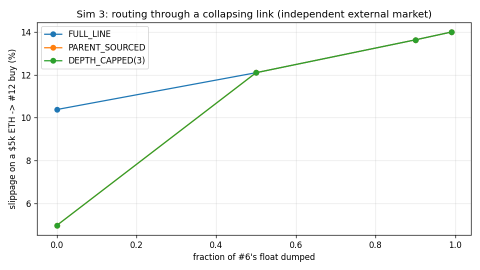
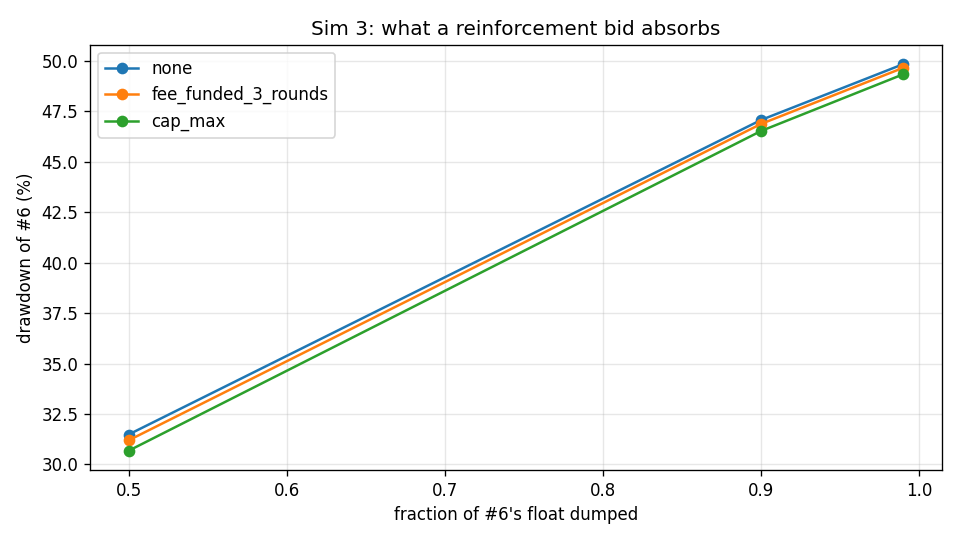

### interpretation

Equal-ETH-depth chain, $5,000 routes, slippage measured against pre-trade mid prices. The claim splits and the halves get opposite verdicts. **Best-route is VERIFIED, with a caveat about which venue is broken.** On a healthy chain, entering through the external ETH market at #9 costs 5.0% against 10.4% for the 13-hop full line - four hops instead of thirteen. After #6's float is 99% dumped, the full line costs 14.0%; if arbitrage has carried the collapse into the external pool the router still routes around the dead link and pays 7.6%, and if the external pool is *stale* the router correctly does the opposite - it takes the family line (14.0%) because a collapsed link is now the cheapest place in the world to buy the token. Either way the buyer pays the minimum of the two venues, which is exactly what best-route is for: a broken mid-chain link costs a buyer roughly 3.6% of extra slippage on the full line and about half of that once an alternative venue exists. **Reinforcement is FALSIFIED at any budget the design actually produces.** Three rounds of the parent-reinforcement sleeve at $250,000 of edge volume per round is 0.375 ETH; it lands as 0.716% of #6's parent reserve and moves the 99%-dump drawdown from 49.8% to 49.7%. Even a budget large enough to hit the brief's own 2%-of-reserve per-call cap (1.96% deposited) only reaches 49.3%. A single-sided bid within 30% of spot is eaten in the first few percent of a dump: reinforcement is a slow accretion mechanism, not a shock absorber, and the UI copy should say so. Note also that the venue which rescues the route is the same external market that bypasses the 1% edge fee (brief section 6) - the mitigation and the revenue leak are one mechanism.

*Modelling notes:* Two external-market regimes are reported because the answer depends entirely on which one holds: 'independent' leaves the market at #9 at its pre-collapse price (best case for best-route), 'arbitraged' runs `propagate_arbitrage` so the collapse reaches it (worst case). Deposited bids are flattened into a non-overlapping tick ladder first - see `flatten_pool`.

## Sim 5 - Candidate war: N candidates sharing one pot of interest

**Claim under test:** a round creates demand for the head  
**Runtime:** 2.2 s

### raw

| n_candidates | snipe_tax | trial | parent_absorbed_total | parent_absorbed_usd | head_eth_in | head_eth_in_usd | head_fdv_move | winner_avg | score_cv | top1_share | block1_share_of_first_second | block1_snipe_usd | block1_cost_usd |
|---|---|---|---|---|---|---|---|---|---|---|---|---|---|
| 5 | yes | 0 | 6.250e+07 | 1.563e+04 | 7.634 | 3.054e+04 | 2.737 | 1.002e+07 | 0.352 | 0.323 | 0.9664 | 311.1 | -1,831 |
| 5 | yes | 1 | 5.983e+07 | 1.496e+04 | 7.028 | 2.811e+04 | 2.457 | 6.819e+06 | 0.1342 | 0.2309 | 1 | 311.1 | -1,631 |
| 5 | yes | 2 | 7.648e+07 | 1.912e+04 | 11.81 | 4.723e+04 | 4.97 | 1.058e+07 | 0.2163 | 0.2712 | 0.9431 | 311.1 | -2,649 |
| 5 | yes | 3 | 6.742e+07 | 1.685e+04 | 8.886 | 3.555e+04 | 3.353 | 9.163e+06 | 0.3279 | 0.2844 | 1 | 311.1 | -2,169 |
| 5 | yes | 4 | 5.001e+07 | 1.25e+04 | 5.148 | 2.059e+04 | 1.655 | 6.016e+06 | 0.2604 | 0.2506 | 1 | 311.1 | -1,153 |
| 5 | yes | 5 | 6.506e+07 | 1.627e+04 | 8.262 | 3.305e+04 | 3.041 | 7.464e+06 | 0.2358 | 0.243 | 1 | 311.1 | -2,053 |
| 5 | yes | 6 | 7.380e+07 | 1.845e+04 | 10.84 | 4.337e+04 | 4.408 | 9.035e+06 | 0.1328 | 0.2309 | 1 | 311.1 | -2,537 |
| 5 | yes | 7 | 8.597e+07 | 2.149e+04 | 16.17 | 6.466e+04 | 7.858 | 1.099e+07 | 0.2024 | 0.256 | 1 | 311.1 | -3,413 |
| 5 | no | 0 | 6.475e+07 | 1.619e+04 | 8.184 | 3.274e+04 | 3.002 | 8.307e+06 | 0.262 | 0.27 | 1 | 0 | -1.251e+04 |
| 5 | no | 1 | 5.732e+07 | 1.433e+04 | 6.499 | 2.6e+04 | 2.22 | 6.994e+06 | 0.1601 | 0.2434 | 1 | 0 | -1.079e+04 |
| 5 | no | 2 | 7.347e+07 | 1.837e+04 | 10.73 | 4.293e+04 | 4.346 | 8.975e+06 | 0.1872 | 0.2384 | 1 | 0 | -1.453e+04 |
| 5 | no | 3 | 6.598e+07 | 1.65e+04 | 8.501 | 3.4e+04 | 3.158 | 9.921e+06 | 0.3602 | 0.2959 | 1 | 0 | -1.284e+04 |
| 5 | no | 4 | 6.038e+07 | 1.509e+04 | 7.148 | 2.859e+04 | 2.511 | 7.174e+06 | 0.2577 | 0.2511 | 1 | 0 | -1.152e+04 |
| 5 | no | 5 | 6.400e+07 | 1.6e+04 | 7.997 | 3.199e+04 | 2.911 | 7.284e+06 | 0.1185 | 0.2175 | 0.8253 | 0 | -1.206e+04 |
| 5 | no | 6 | 6.643e+07 | 1.661e+04 | 8.62 | 3.448e+04 | 3.218 | 8.041e+06 | 0.1084 | 0.237 | 0.8235 | 0 | -1.258e+04 |
| 5 | no | 7 | 7.943e+07 | 1.986e+04 | 12.99 | 5.194e+04 | 5.695 | 9.868e+06 | 0.2025 | 0.2512 | 0.7708 | 0 | -1.539e+04 |
| 10 | yes | 0 | 6.941e+07 | 1.735e+04 | 9.452 | 3.781e+04 | 3.647 | 5.694e+06 | 0.3318 | 0.1555 | 0.9212 | 311.1 | -503.5 |
| 10 | yes | 1 | 7.576e+07 | 1.894e+04 | 11.54 | 4.616e+04 | 4.811 | 5.117e+06 | 0.1873 | 0.1385 | 0.9608 | 311.1 | -611.6 |
| 10 | yes | 2 | 7.425e+07 | 1.856e+04 | 11 | 4.4e+04 | 4.498 | 6.823e+06 | 0.3176 | 0.1618 | 1 | 311.1 | -599.4 |
| 10 | yes | 3 | 6.748e+07 | 1.687e+04 | 8.903 | 3.561e+04 | 3.362 | 5.051e+06 | 0.3976 | 0.1621 | 0.9101 | 311.1 | -485.4 |
| 10 | yes | 4 | 7.731e+07 | 1.933e+04 | 12.13 | 4.85e+04 | 5.162 | 5.138e+06 | 0.2835 | 0.1357 | 1 | 311.1 | -671.5 |
| 10 | yes | 5 | 6.514e+07 | 1.629e+04 | 8.283 | 3.313e+04 | 3.051 | 5.220e+06 | 0.3391 | 0.1605 | 1 | 311.1 | -431 |
| 10 | yes | 6 | 8.041e+07 | 2.01e+04 | 13.41 | 5.363e+04 | 5.965 | 5.257e+06 | 0.2752 | 0.1384 | 1 | 311.1 | -754.8 |
| 10 | yes | 7 | 6.836e+07 | 1.709e+04 | 9.15 | 3.66e+04 | 3.489 | 4.778e+06 | 0.27 | 0.1315 | 1 | 311.1 | -472.7 |
| 10 | no | 0 | 7.380e+07 | 1.845e+04 | 10.84 | 4.338e+04 | 4.409 | 6.419e+06 | 0.4074 | 0.162 | 0.8192 | 0 | -9,617 |
| 10 | no | 1 | 7.233e+07 | 1.808e+04 | 10.35 | 4.142e+04 | 4.134 | 4.733e+06 | 0.2262 | 0.1251 | 0.8676 | 0 | -9,459 |
| 10 | no | 2 | 6.647e+07 | 1.662e+04 | 8.632 | 3.453e+04 | 3.224 | 5.084e+06 | 0.3025 | 0.1418 | 1 | 0 | -8,628 |
| 10 | no | 3 | 6.645e+07 | 1.661e+04 | 8.626 | 3.45e+04 | 3.221 | 6.132e+06 | 0.3766 | 0.173 | 1 | 0 | -8,665 |
| 10 | no | 4 | 6.581e+07 | 1.645e+04 | 8.456 | 3.382e+04 | 3.136 | 4.989e+06 | 0.2781 | 0.139 | 0.7507 | 0 | -8,005 |
| 10 | no | 5 | 6.623e+07 | 1.656e+04 | 8.568 | 3.427e+04 | 3.192 | 5.990e+06 | 0.3742 | 0.1683 | 1 | 0 | -8,567 |
| 10 | no | 6 | 5.385e+07 | 1.346e+04 | 5.825 | 2.33e+04 | 1.932 | 4.579e+06 | 0.4125 | 0.1472 | 1 | 0 | -6,629 |
| 10 | no | 7 | 7.043e+07 | 1.761e+04 | 9.757 | 3.903e+04 | 3.809 | 4.968e+06 | 0.3362 | 0.1378 | 1 | 0 | -9,378 |
| 20 | yes | 0 | 7.530e+07 | 1.882e+04 | 11.37 | 4.548e+04 | 4.711 | 3.863e+06 | 0.4199 | 0.0977 | 1 | 311.1 | 1.235 |
| 20 | yes | 1 | 6.851e+07 | 1.713e+04 | 9.192 | 3.677e+04 | 3.51 | 3.317e+06 | 0.4586 | 0.0947 | 0.9406 | 311.1 | 49.64 |
| 20 | yes | 2 | 8.083e+07 | 2.021e+04 | 13.59 | 5.436e+04 | 6.084 | 3.775e+06 | 0.4171 | 0.09032 | 0.9411 | 311.1 | -34.6 |
| 20 | yes | 3 | 6.692e+07 | 1.673e+04 | 8.75 | 3.5e+04 | 3.284 | 3.310e+06 | 0.4348 | 0.09498 | 1 | 311.1 | 48.83 |
| 20 | yes | 4 | 6.640e+07 | 1.66e+04 | 8.613 | 3.445e+04 | 3.215 | 3.005e+06 | 0.4407 | 0.08811 | 0.8478 | 311.1 | 53.17 |
| 20 | yes | 5 | 7.816e+07 | 1.954e+04 | 12.46 | 4.985e+04 | 5.368 | 3.997e+06 | 0.5183 | 0.1029 | 1 | 311.1 | -24.81 |
| 20 | yes | 6 | 7.578e+07 | 1.894e+04 | 11.54 | 4.617e+04 | 4.814 | 2.659e+06 | 0.3137 | 0.07779 | 0.8882 | 311.1 | -0.7121 |
| 20 | yes | 7 | 7.228e+07 | 1.807e+04 | 10.34 | 4.135e+04 | 4.125 | 4.260e+06 | 0.6077 | 0.1219 | 0.9383 | 311.1 | 17.38 |
| 20 | no | 0 | 6.884e+07 | 1.721e+04 | 9.288 | 3.715e+04 | 3.561 | 3.034e+06 | 0.3221 | 0.09076 | 1 | 0 | -4,462 |
| 20 | no | 1 | 6.342e+07 | 1.586e+04 | 7.855 | 3.142e+04 | 2.843 | 3.704e+06 | 0.5536 | 0.1116 | 1 | 0 | -4,155 |
| 20 | no | 2 | 6.476e+07 | 1.619e+04 | 8.185 | 3.274e+04 | 3.003 | 3.682e+06 | 0.4886 | 0.1007 | 0.7964 | 0 | -3,990 |
| 20 | no | 3 | 6.893e+07 | 1.723e+04 | 9.312 | 3.725e+04 | 3.573 | 4.546e+06 | 0.5424 | 0.1304 | 1 | 0 | -4,615 |
| 20 | no | 4 | 6.068e+07 | 1.517e+04 | 7.214 | 2.886e+04 | 2.542 | 3.355e+06 | 0.5446 | 0.1081 | 1 | 0 | -3,940 |
| 20 | no | 5 | 7.821e+07 | 1.955e+04 | 12.48 | 4.992e+04 | 5.379 | 3.954e+06 | 0.4131 | 0.09531 | 1 | 0 | -5,517 |
| 20 | no | 6 | 8.074e+07 | 2.018e+04 | 13.55 | 5.421e+04 | 6.059 | 4.094e+06 | 0.3567 | 0.102 | 1 | 0 | -5,600 |
| 20 | no | 7 | 8.254e+07 | 2.064e+04 | 14.39 | 5.755e+04 | 6.612 | 5.007e+06 | 0.4098 | 0.1136 | 1 | 0 | -5,830 |
| 50 | yes | 0 | 6.696e+07 | 1.674e+04 | 8.762 | 3.505e+04 | 3.29 | 1.747e+06 | 0.6521 | 0.05054 | 1 | 311.1 | 243.9 |
| 50 | yes | 1 | 8.038e+07 | 2.009e+04 | 13.39 | 5.357e+04 | 5.955 | 2.051e+06 | 0.6673 | 0.05574 | 0.9574 | 311.1 | 222.7 |
| 50 | yes | 2 | 7.730e+07 | 1.932e+04 | 12.12 | 4.848e+04 | 5.158 | 2.093e+06 | 0.5571 | 0.05018 | 1 | 311.1 | 230.7 |
| 50 | yes | 3 | 8.414e+07 | 2.103e+04 | 15.18 | 6.072e+04 | 7.156 | 1.792e+06 | 0.6018 | 0.04151 | 1 | 311.1 | 219 |
| 50 | yes | 4 | 7.915e+07 | 1.979e+04 | 12.86 | 5.146e+04 | 5.619 | 2.534e+06 | 0.6539 | 0.06229 | 1 | 311.1 | 224.9 |
| 50 | yes | 5 | 5.898e+07 | 1.475e+04 | 6.845 | 2.738e+04 | 2.374 | 2.601e+06 | 0.7847 | 0.08002 | 1 | 311.1 | 252.6 |
| 50 | yes | 6 | 6.659e+07 | 1.665e+04 | 8.662 | 3.465e+04 | 3.239 | 1.628e+06 | 0.574 | 0.04592 | 1 | 311.1 | 245.7 |
| 50 | yes | 7 | 7.974e+07 | 1.994e+04 | 13.12 | 5.247e+04 | 5.778 | 2.247e+06 | 0.6318 | 0.05382 | 0.9536 | 311.1 | 222.3 |
| 50 | no | 0 | 7.298e+07 | 1.825e+04 | 10.57 | 4.227e+04 | 4.253 | 2.421e+06 | 0.7157 | 0.06796 | 0.8133 | 0 | -1,594 |
| 50 | no | 1 | 6.673e+07 | 1.668e+04 | 8.701 | 3.48e+04 | 3.259 | 1.630e+06 | 0.6158 | 0.04821 | 1 | 0 | -1,397 |
| 50 | no | 2 | 7.469e+07 | 1.867e+04 | 11.15 | 4.461e+04 | 4.586 | 2.357e+06 | 0.6471 | 0.05886 | 1 | 0 | -1,670 |
| 50 | no | 3 | 8.305e+07 | 2.076e+04 | 14.63 | 5.854e+04 | 6.779 | 1.998e+06 | 0.6392 | 0.04821 | 1 | 0 | -1,964 |
| 50 | no | 4 | 7.585e+07 | 1.896e+04 | 11.57 | 4.629e+04 | 4.831 | 1.948e+06 | 0.4934 | 0.04679 | 0.8011 | 0 | -1,646 |
| 50 | no | 5 | 7.189e+07 | 1.797e+04 | 10.21 | 4.086e+04 | 4.057 | 2.055e+06 | 0.5995 | 0.05658 | 0.8519 | 0 | -1,538 |
| 50 | no | 6 | 7.658e+07 | 1.915e+04 | 11.85 | 4.738e+04 | 4.993 | 1.982e+06 | 0.544 | 0.04871 | 1 | 0 | -1,677 |
| 50 | no | 7 | 8.332e+07 | 2.083e+04 | 14.77 | 5.906e+04 | 6.869 | 2.008e+06 | 0.606 | 0.04831 | 0.8233 | 0 | -1,895 |

CSV: `docs/results/sim05_raw.csv`

### summary

| n_candidates | snipe_tax | parent_absorbed_total | parent_absorbed_usd | head_eth_in | head_eth_in_usd | head_fdv_move | winner_avg | score_cv | top1_share | block1_share_of_first_second | block1_snipe_usd | block1_cost_usd |
|---|---|---|---|---|---|---|---|---|---|---|---|---|
| 5 | no | 6.647e+07 | 1.662e+04 | 8.833 | 3.533e+04 | 3.383 | 8.320e+06 | 0.2071 | 0.2506 | 0.9275 | 0 | -1.278e+04 |
| 5 | yes | 6.763e+07 | 1.691e+04 | 9.472 | 3.789e+04 | 3.81 | 8.759e+06 | 0.2327 | 0.2613 | 0.9887 | 311.1 | -2,180 |
| 10 | no | 6.692e+07 | 1.673e+04 | 8.883 | 3.553e+04 | 3.382 | 5.362e+06 | 0.3392 | 0.1493 | 0.9297 | 0 | -8,619 |
| 10 | yes | 7.227e+07 | 1.807e+04 | 10.48 | 4.193e+04 | 4.248 | 5.385e+06 | 0.3003 | 0.148 | 0.974 | 311.1 | -566.2 |
| 20 | no | 7.101e+07 | 1.775e+04 | 10.28 | 4.114e+04 | 4.196 | 3.922e+06 | 0.4538 | 0.1066 | 0.9745 | 0 | -4,764 |
| 20 | yes | 7.302e+07 | 1.826e+04 | 10.73 | 4.293e+04 | 4.389 | 3.523e+06 | 0.4513 | 0.09604 | 0.9445 | 311.1 | 13.77 |
| 50 | no | 7.564e+07 | 1.891e+04 | 11.68 | 4.673e+04 | 4.953 | 2.050e+06 | 0.6076 | 0.05295 | 0.9112 | 0 | -1,672 |
| 50 | yes | 7.415e+07 | 1.854e+04 | 11.37 | 4.547e+04 | 4.821 | 2.087e+06 | 0.6403 | 0.055 | 0.9889 | 311.1 | 232.7 |

CSV: `docs/results/sim05_summary.csv`

### figures

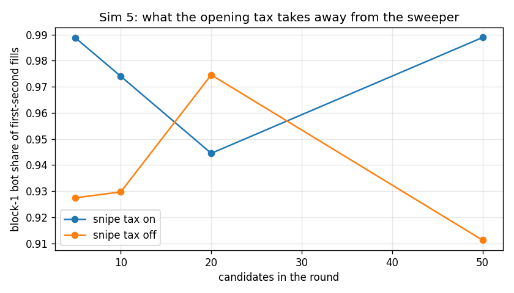
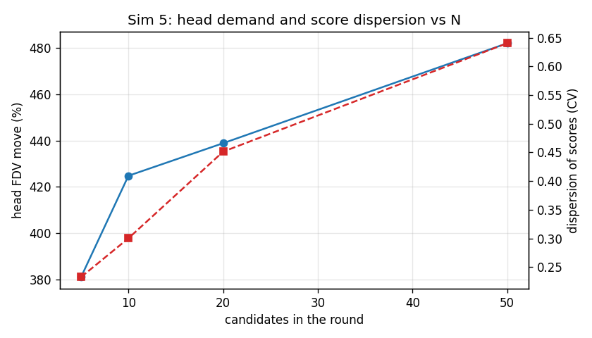

### interpretation

Total interest is held fixed at 5 x A_BASE and split across N candidates by random arrival. The claim that *a round creates demand for the head* is VERIFIED and is close to N-invariant: the round absorbs $17,942 of head token regardless of whether 5 or 50 candidates are competing, which required $42,054 of ETH to enter the family and moved the head's own FDV by 431.7%. That is the flywheel the design is built on and it works: candidates are a demand pump for their parent whether or not any of them wins. What does change with N is concentration - the winner's share of total score falls from 26.1% at N=5 to 5.5% at N=50, and the winning average falls with it, so a crowded round is much more likely to miss the threshold entirely even though the head got the same demand. On the snipe tax: the block-1 sweeper takes 94% of first-second fills with the tax off and 97% with it on, at a cost of $311 per round in tax. The tax does not stop the sweep, it prices it - and at these curve slopes it does not even price it fully: the sweeper still books a mean P&L of $625 per round with the tax on ($6,958 with it off), because paying 99% on a buy at the very bottom of a curve that then rises two orders of magnitude inside ten minutes is still a good trade. The tax cuts the sweeper's edge by roughly 91% and turns it break-even only in the crowded rounds where the pot is split many ways.

*Modelling notes:* Head demand is measured by re-buying the absorbed parent through the ETH edge on a fresh genesis chain (exact-output route), so it includes the 1% edge fee and the hop fee.

## Sim 6 - Fee equilibrium: split sweep and the sell-tax question

**Claim under test:** find the split; report sell-tax sensitivity honestly  
**Runtime:** 1.3 s

### split sweep

| creator_share | ancestor_split | developer_usd | creator_usd_total | creator_usd_per_round | ancestor_sleeve_usd | reinforcement_usd | flywheel_usd | genesis_usd | genesis_share_of_pot |
|---|---|---|---|---|---|---|---|---|---|
| 0.3 | 25/75 | 1e+04 | 1.5e+04 | 750 | 6,250 | 1.875e+04 | 2.5e+04 | 1,877 | 0.03754 |
| 0.3 | 50/50 | 1e+04 | 1.5e+04 | 750 | 1.25e+04 | 1.25e+04 | 2.5e+04 | 3,754 | 0.07507 |
| 0.3 | 75/25 | 1e+04 | 1.5e+04 | 750 | 1.875e+04 | 6,250 | 2.5e+04 | 5,630 | 0.1126 |
| 0.4 | 25/75 | 1e+04 | 2e+04 | 1,000 | 5,000 | 1.5e+04 | 2e+04 | 1,501 | 0.03003 |
| 0.4 | 50/50 | 1e+04 | 2e+04 | 1,000 | 1e+04 | 1e+04 | 2e+04 | 3,003 | 0.06006 |
| 0.4 | 75/25 | 1e+04 | 2e+04 | 1,000 | 1.5e+04 | 5,000 | 2e+04 | 4,504 | 0.09009 |
| 0.5 | 25/75 | 1e+04 | 2.5e+04 | 1,250 | 3,750 | 1.125e+04 | 1.5e+04 | 1,126 | 0.02252 |
| 0.5 | 50/50 | 1e+04 | 2.5e+04 | 1,250 | 7,500 | 7,500 | 1.5e+04 | 2,252 | 0.04504 |
| 0.5 | 75/25 | 1e+04 | 2.5e+04 | 1,250 | 1.125e+04 | 3,750 | 1.5e+04 | 3,378 | 0.06757 |

CSV: `docs/results/sim06_split_sweep.csv`

### sell tax sweep

| buy_fee_pct | sell_fee_pct | round_trip_fee_pct | epsilon | volume_index | fee_pot_usd | developer_usd | creator_usd | flywheel_usd | p_clean_run_to_20 | mean_rounds_to_reach |
|---|---|---|---|---|---|---|---|---|---|---|
| 1 | 1 | 2 | 0.5 | 1 | 5e+04 | 1e+04 | 2e+04 | 2e+04 | 0.375 | 20.93 |
| 1 | 1 | 2 | 1 | 1 | 5e+04 | 1e+04 | 2e+04 | 2e+04 | 0.355 | 20.93 |
| 1 | 1 | 2 | 1.5 | 1 | 5e+04 | 1e+04 | 2e+04 | 2e+04 | 0.335 | 20.96 |
| 1 | 2 | 3 | 0.5 | 0.8165 | 6.124e+04 | 1.225e+04 | 2.449e+04 | 2.449e+04 | 0.15 | 21.48 |
| 1 | 2 | 3 | 1 | 0.6667 | 5e+04 | 1e+04 | 2e+04 | 2e+04 | 0.04 | 22.31 |
| 1 | 2 | 3 | 1.5 | 0.5443 | 4.082e+04 | 8,165 | 1.633e+04 | 1.633e+04 | 0.01 | 23.14 |
| 1 | 3 | 4 | 0.5 | 0.7071 | 7.071e+04 | 1.414e+04 | 2.828e+04 | 2.828e+04 | 0.07 | 22.06 |
| 1 | 3 | 4 | 1 | 0.5 | 5e+04 | 1e+04 | 2e+04 | 2e+04 | 0.01 | 23.62 |
| 1 | 3 | 4 | 1.5 | 0.3536 | 3.536e+04 | 7,071 | 1.414e+04 | 1.414e+04 | 0 | 25.86 |
| 1 | 5 | 6 | 0.5 | 0.5774 | 8.66e+04 | 1.732e+04 | 3.464e+04 | 3.464e+04 | 0.02 | 23.02 |
| 1 | 5 | 6 | 1 | 0.3333 | 5e+04 | 1e+04 | 2e+04 | 2e+04 | 0 | 26.34 |
| 1 | 5 | 6 | 1.5 | 0.1925 | 2.887e+04 | 5,774 | 1.155e+04 | 1.155e+04 | 0 | 30.56 |
| 1 | 10 | 11 | 0.5 | 0.4264 | 1.173e+05 | 2.345e+04 | 4.69e+04 | 4.69e+04 | 0 | 24.57 |
| 1 | 10 | 11 | 1 | 0.1818 | 5e+04 | 1e+04 | 2e+04 | 2e+04 | 0 | 31.07 |
| 1 | 10 | 11 | 1.5 | 0.07753 | 2.132e+04 | 4,264 | 8,528 | 8,528 | 0 | 39.55 |

CSV: `docs/results/sim06_sell_tax_sweep.csv`

### figures

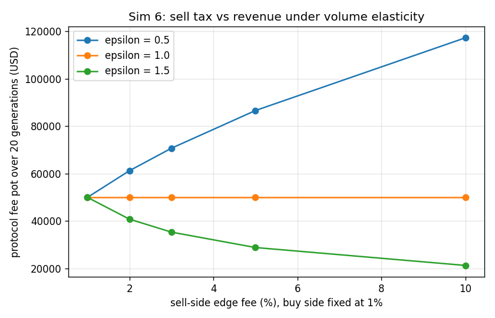
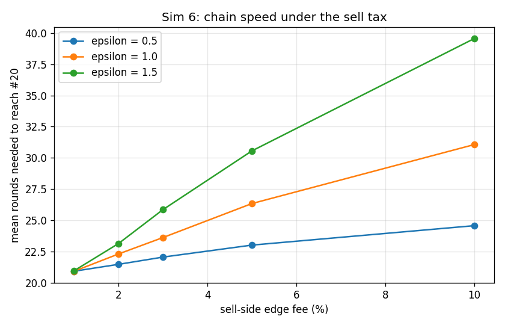

### interpretation

Over 20 generations at $250,000 of ETH-edge volume per round, the 1% fee collects $50,000. The split is a pure allocation question and the recommendation is **creator 40%, flywheel remainder 50/50** (developer $10,000, creators $20,000 = $1,000 per launch, ancestor sleeve $10,000, reinforcement $10,000): 30% underpays the only party who has to do work before a round exists, 50% starves the flywheel that is the product's actual differentiator, and a 25/75 or 75/25 tilt of the remainder moves less money than one noisy round does. On the sell tax the honest answer is that the sign of the effect is entirely an empirical question the simulation cannot settle: revenue scales as rt^(1 - epsilon), so at epsilon = 0.5 raising the sell fee from 1% to 10% raises the pot from $50,000 to $117,260, at epsilon = 1.0 it is exactly flat at $50,000, and at epsilon = 1.5 it *falls* from $50,000 to $21,320. Survival is not ambiguous in the same way: because volume and round interest move together, the chain slows down: at epsilon = 1.0 reaching #20 takes 20.9 rounds at 1%/1% and 31.1 rounds at 1%/10%, and the share of chains that get there without a single failed round falls from 36% to 0%. A sell tax is therefore a bet that memecoin traders are fee-insensitive (epsilon < 1) paid for with chain liveness, and the 1/1 symmetric fee is the only setting that needs no such bet. Recommend keeping 1%/1%.

*Modelling notes:* Volume elasticity is an assumption, not a measurement: volume proportional to (buy + sell fee)^-epsilon, normalised at the 1%/1% schedule, and round interest is assumed to scale with the same index. No empirical elasticity for this market exists.

## Sim 7 - Route depth: 10 / 20 / 50 / 100 links

**Claim under test:** flat fee + best-route keeps deep trading usable  
**Runtime:** 0.3 s

### route depth

| links | dst | size_label | size_eth | size_usd | mode | hops | uses_external | terminal_fdv_usd | edge_fee_usd | hop_fee_legs | total_fee_pct_of_trade | effective_loss_frac | exhausted |
|---|---|---|---|---|---|---|---|---|---|---|---|---|---|
| 10 | 9 | $1,000 | 0.25 | 1,000 | FULL_LINE | 10 | no | 9.432e+05 | 10 | 10 | 0.0175 | 0.03141 | no |
| 10 | 9 | $1,000 | 0.25 | 1,000 | BEST | 5 | yes | 9.432e+05 | 0 | 5 | 0.00375 | 0.01663 | no |
| 10 | 9 | $1,000 | 0.25 | 1,000 | DEPTH_CAPPED(5) | 5 | yes | 9.432e+05 | 0 | 5 | 0.00375 | 0.01663 | no |
| 10 | 9 | $5,000 | 1.25 | 5,000 | FULL_LINE | 10 | no | 9.432e+05 | 50 | 10 | 0.0175 | 0.08367 | no |
| 10 | 9 | $5,000 | 1.25 | 5,000 | BEST | 5 | yes | 9.432e+05 | 0 | 5 | 0.00375 | 0.05703 | no |
| 10 | 9 | $5,000 | 1.25 | 5,000 | DEPTH_CAPPED(5) | 5 | yes | 9.432e+05 | 0 | 5 | 0.00375 | 0.05703 | no |
| 10 | 9 | $10,000 | 2.5 | 1e+04 | FULL_LINE | 10 | no | 9.432e+05 | 100 | 10 | 0.0175 | 0.1416 | no |
| 10 | 9 | $10,000 | 2.5 | 1e+04 | BEST | 5 | yes | 9.432e+05 | 0 | 5 | 0.00375 | 0.1031 | no |
| 10 | 9 | $10,000 | 2.5 | 1e+04 | DEPTH_CAPPED(5) | 5 | yes | 9.432e+05 | 0 | 5 | 0.00375 | 0.1031 | no |
| 10 | 9 | 0.5% of terminal FDV | 1.179 | 4,716 | FULL_LINE | 10 | no | 9.432e+05 | 47.16 | 10 | 0.0175 | 0.08015 | no |
| 10 | 9 | 0.5% of terminal FDV | 1.179 | 4,716 | BEST | 5 | yes | 9.432e+05 | 0 | 5 | 0.00375 | 0.05427 | no |
| 10 | 9 | 0.5% of terminal FDV | 1.179 | 4,716 | DEPTH_CAPPED(5) | 5 | yes | 9.432e+05 | 0 | 5 | 0.00375 | 0.05427 | no |
| 20 | 19 | $1,000 | 0.25 | 1,000 | FULL_LINE | 20 | no | 9.432e+05 | 10 | 20 | 0.025 | 0.05207 | no |
| 20 | 19 | $1,000 | 0.25 | 1,000 | BEST | 2 | yes | 9.432e+05 | 0 | 2 | 0.0015 | 0.01013 | no |
| 20 | 19 | $1,000 | 0.25 | 1,000 | DEPTH_CAPPED(5) | 2 | yes | 9.432e+05 | 0 | 2 | 0.0015 | 0.01013 | no |
| 20 | 19 | $5,000 | 1.25 | 5,000 | FULL_LINE | 20 | no | 9.432e+05 | 50 | 20 | 0.025 | 0.1476 | no |
| 20 | 19 | $5,000 | 1.25 | 5,000 | BEST | 2 | yes | 9.432e+05 | 0 | 2 | 0.0015 | 0.03486 | no |
| 20 | 19 | $5,000 | 1.25 | 5,000 | DEPTH_CAPPED(5) | 2 | yes | 9.432e+05 | 0 | 2 | 0.0015 | 0.03486 | no |
| 20 | 19 | $10,000 | 2.5 | 1e+04 | FULL_LINE | 20 | no | 9.432e+05 | 100 | 20 | 0.025 | 0.243 | no |
| 20 | 19 | $10,000 | 2.5 | 1e+04 | BEST | 2 | yes | 9.432e+05 | 0 | 2 | 0.0015 | 0.06409 | no |
| 20 | 19 | $10,000 | 2.5 | 1e+04 | DEPTH_CAPPED(5) | 2 | yes | 9.432e+05 | 0 | 2 | 0.0015 | 0.06409 | no |
| 20 | 19 | 0.5% of terminal FDV | 1.179 | 4,716 | FULL_LINE | 20 | no | 9.432e+05 | 47.16 | 20 | 0.025 | 0.1414 | no |
| 20 | 19 | 0.5% of terminal FDV | 1.179 | 4,716 | BEST | 2 | yes | 9.432e+05 | 0 | 2 | 0.0015 | 0.03314 | no |
| 20 | 19 | 0.5% of terminal FDV | 1.179 | 4,716 | DEPTH_CAPPED(5) | 2 | yes | 9.432e+05 | 0 | 2 | 0.0015 | 0.03314 | no |
| 50 | 49 | $1,000 | 0.25 | 1,000 | FULL_LINE | 50 | no | 9.432e+05 | 10 | 50 | 0.0475 | 0.1099 | no |
| 50 | 49 | $1,000 | 0.25 | 1,000 | BEST | 7 | yes | 9.432e+05 | 0 | 7 | 0.00525 | 0.02093 | no |
| 50 | 49 | $1,000 | 0.25 | 1,000 | DEPTH_CAPPED(5) | 7 | yes | 9.432e+05 | 0 | 7 | 0.00525 | 0.02093 | no |
| 50 | 49 | $5,000 | 1.25 | 5,000 | FULL_LINE | 50 | no | 9.432e+05 | 50 | 50 | 0.0475 | 0.297 | no |
| 50 | 49 | $5,000 | 1.25 | 5,000 | BEST | 7 | yes | 9.432e+05 | 0 | 7 | 0.00525 | 0.07128 | no |
| 50 | 49 | $5,000 | 1.25 | 5,000 | DEPTH_CAPPED(5) | 7 | yes | 9.432e+05 | 0 | 7 | 0.00525 | 0.07128 | no |
| 50 | 49 | $10,000 | 2.5 | 1e+04 | FULL_LINE | 50 | no | 9.432e+05 | 100 | 50 | 0.0475 | 0.4432 | no |
| 50 | 49 | $10,000 | 2.5 | 1e+04 | BEST | 7 | yes | 9.432e+05 | 0 | 7 | 0.00525 | 0.1274 | no |
| 50 | 49 | $10,000 | 2.5 | 1e+04 | DEPTH_CAPPED(5) | 7 | yes | 9.432e+05 | 0 | 7 | 0.00525 | 0.1274 | no |
| 50 | 49 | 0.5% of terminal FDV | 1.179 | 4,716 | FULL_LINE | 50 | no | 9.432e+05 | 47.16 | 50 | 0.0475 | 0.2863 | no |
| 50 | 49 | 0.5% of terminal FDV | 1.179 | 4,716 | BEST | 7 | yes | 9.432e+05 | 0 | 7 | 0.00525 | 0.06787 | no |
| 50 | 49 | 0.5% of terminal FDV | 1.179 | 4,716 | DEPTH_CAPPED(5) | 7 | yes | 9.432e+05 | 0 | 7 | 0.00525 | 0.06787 | no |
| 100 | 99 | $1,000 | 0.25 | 1,000 | FULL_LINE | 100 | no | 9.432e+05 | 10 | 100 | 0.085 | 0.1943 | no |
| 100 | 99 | $1,000 | 0.25 | 1,000 | BEST | 1 | yes | 9.432e+05 | 0 | 1 | 7.500e-04 | 0.007945 | no |
| 100 | 99 | $1,000 | 0.25 | 1,000 | DEPTH_CAPPED(5) | 1 | yes | 9.432e+05 | 0 | 1 | 7.500e-04 | 0.007945 | no |
| 100 | 99 | $5,000 | 1.25 | 5,000 | FULL_LINE | 100 | no | 9.432e+05 | 50 | 100 | 0.085 | 0.4596 | no |
| 100 | 99 | $5,000 | 1.25 | 5,000 | BEST | 1 | yes | 9.432e+05 | 0 | 1 | 7.500e-04 | 0.02725 | no |
| 100 | 99 | $5,000 | 1.25 | 5,000 | DEPTH_CAPPED(5) | 1 | yes | 9.432e+05 | 0 | 1 | 7.500e-04 | 0.02725 | no |
| 100 | 99 | $10,000 | 2.5 | 1e+04 | FULL_LINE | 100 | no | 9.432e+05 | 100 | 100 | 0.085 | 0.6172 | no |
| 100 | 99 | $10,000 | 2.5 | 1e+04 | BEST | 1 | yes | 9.432e+05 | 0 | 1 | 7.500e-04 | 0.05034 | no |
| 100 | 99 | $10,000 | 2.5 | 1e+04 | DEPTH_CAPPED(5) | 1 | yes | 9.432e+05 | 0 | 1 | 7.500e-04 | 0.05034 | no |
| 100 | 99 | 0.5% of terminal FDV | 1.179 | 4,716 | FULL_LINE | 100 | no | 9.432e+05 | 47.16 | 100 | 0.085 | 0.4466 | no |
| 100 | 99 | 0.5% of terminal FDV | 1.179 | 4,716 | BEST | 1 | yes | 9.432e+05 | 0 | 1 | 7.500e-04 | 0.0259 | no |
| 100 | 99 | 0.5% of terminal FDV | 1.179 | 4,716 | DEPTH_CAPPED(5) | 1 | yes | 9.432e+05 | 0 | 1 | 7.500e-04 | 0.0259 | no |

CSV: `docs/results/sim07_route_depth.csv`

### external share

| links | mode | frac_routes_going_external |
|---|---|---|
| 10 | BEST | 1 |
| 10 | DEPTH_CAPPED(5) | 1 |
| 20 | BEST | 1 |
| 20 | DEPTH_CAPPED(5) | 1 |
| 50 | BEST | 1 |
| 50 | DEPTH_CAPPED(5) | 1 |
| 100 | BEST | 1 |
| 100 | DEPTH_CAPPED(5) | 1 |

CSV: `docs/results/sim07_external_share.csv`

### figures

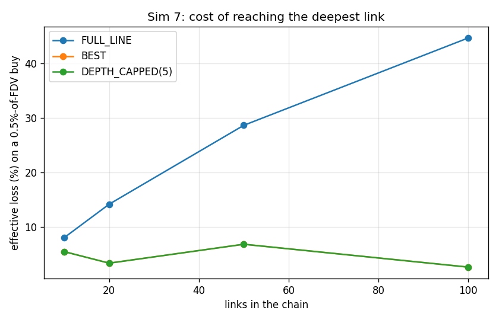
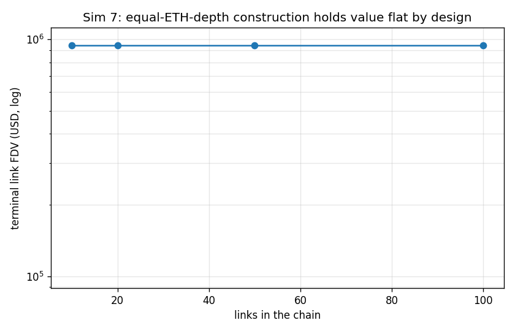

### interpretation

Equal-ETH-depth chain with external ETH markets on 20% of links. The claim is VERIFIED for the *fee* and FALSIFIED for *usable* at the deep end, and the two failures have different causes. Fees behave exactly as designed: the 1% edge fee is paid once no matter how deep the route goes, so total fee on a full-line trade is 1% + hops x 7.5 bps - 1.75% at 10 links and 8.50% at 100 links. Price impact, not fees, is what breaks: at a constant 0.5%-of-FDV trade the full-line effective loss rises from 8.01% to 44.66%, because the trade crosses every pool below the target and each crossing moves a price that the next leg then pays. BEST and DEPTH_CAPPED(5) fix exactly that: they hand 100% of routes to an external ETH market, cutting the hop count to whatever sits below the deepest market. That is the mitigation and it works - but it is also the leak: every route that goes external pays the external market's fee instead of the family's 1% edge fee, so the same mechanism that keeps deep trading usable is the mechanism that starves the flywheel. Hop fee sizing (Q5, 0.05-0.1%) is confirmed: at 7.5 bps even a 100-hop route pays 7.5% in hop fees, which is the same order as the edge fee itself and is the real ceiling on chain length. 0 of 48 quoted routes exhausted the terminal pool at fixed dollar sizes.

*Modelling notes:* Absolute dollar sizes are reported alongside a size normalised to the terminal link's own FDV, because on the brief-literal chain (Sim 1) a $10k trade exceeds the entire market cap of any link past about #6 and the comparison degenerates.

## Sim 8 - Sell cascades from #10: WALL vs SINGLE-like

**Claim under test:** the wall is a threshold cascade (architect's prediction)  
**Runtime:** 0.2 s

### cascade path

| curve | step | cum_tokens_sold | cum_tokens_frac_of_float | cum_parent_released | fdv_parent | drawdown |
|---|---|---|---|---|---|---|
| WALL_LIKE | 0 | 0 | 0 | 0 | 1.000e+09 | 0 |
| WALL_LIKE | 1 | 8.497e+06 | 0.01 | 8.204e+06 | 9.336e+08 | 0.0664 |
| WALL_LIKE | 2 | 1.699e+07 | 0.02 | 1.587e+07 | 8.736e+08 | 0.1264 |
| WALL_LIKE | 3 | 2.549e+07 | 0.03 | 2.305e+07 | 8.192e+08 | 0.1808 |
| WALL_LIKE | 4 | 3.399e+07 | 0.04 | 2.980e+07 | 7.697e+08 | 0.2303 |
| WALL_LIKE | 5 | 4.248e+07 | 0.05 | 3.614e+07 | 7.246e+08 | 0.2754 |
| WALL_LIKE | 6 | 5.098e+07 | 0.06 | 4.211e+07 | 6.858e+08 | 0.3142 |
| WALL_LIKE | 7 | 5.948e+07 | 0.07 | 4.784e+07 | 6.630e+08 | 0.337 |
| WALL_LIKE | 8 | 6.798e+07 | 0.08 | 5.338e+07 | 6.413e+08 | 0.3587 |
| WALL_LIKE | 9 | 7.647e+07 | 0.09 | 5.873e+07 | 6.207e+08 | 0.3793 |
| WALL_LIKE | 10 | 8.497e+07 | 0.1 | 6.392e+07 | 6.011e+08 | 0.3989 |
| WALL_LIKE | 11 | 9.347e+07 | 0.11 | 6.894e+07 | 5.823e+08 | 0.4177 |
| WALL_LIKE | 12 | 1.020e+08 | 0.12 | 7.381e+07 | 5.645e+08 | 0.4355 |
| WALL_LIKE | 13 | 1.105e+08 | 0.13 | 7.853e+07 | 5.474e+08 | 0.4526 |
| WALL_LIKE | 14 | 1.190e+08 | 0.14 | 8.311e+07 | 5.311e+08 | 0.4689 |
| WALL_LIKE | 15 | 1.275e+08 | 0.15 | 8.755e+07 | 5.155e+08 | 0.4845 |
| WALL_LIKE | 16 | 1.360e+08 | 0.16 | 9.186e+07 | 5.006e+08 | 0.4994 |
| WALL_LIKE | 17 | 1.444e+08 | 0.17 | 9.605e+07 | 4.863e+08 | 0.5137 |
| WALL_LIKE | 18 | 1.529e+08 | 0.18 | 1.001e+08 | 4.727e+08 | 0.5273 |
| WALL_LIKE | 19 | 1.614e+08 | 0.19 | 1.041e+08 | 4.596e+08 | 0.5404 |
| WALL_LIKE | 20 | 1.699e+08 | 0.2 | 1.079e+08 | 4.470e+08 | 0.553 |
| WALL_LIKE | 21 | 1.784e+08 | 0.21 | 1.117e+08 | 4.350e+08 | 0.565 |
| WALL_LIKE | 22 | 1.869e+08 | 0.22 | 1.153e+08 | 4.234e+08 | 0.5766 |
| WALL_LIKE | 23 | 1.954e+08 | 0.23 | 1.189e+08 | 4.123e+08 | 0.5877 |
| WALL_LIKE | 24 | 2.039e+08 | 0.24 | 1.223e+08 | 4.016e+08 | 0.5984 |
| WALL_LIKE | 25 | 2.124e+08 | 0.25 | 1.257e+08 | 3.913e+08 | 0.6087 |
| WALL_LIKE | 26 | 2.209e+08 | 0.26 | 1.290e+08 | 3.814e+08 | 0.6186 |
| WALL_LIKE | 27 | 2.294e+08 | 0.27 | 1.322e+08 | 3.719e+08 | 0.6281 |
| WALL_LIKE | 28 | 2.379e+08 | 0.28 | 1.353e+08 | 3.627e+08 | 0.6373 |
| WALL_LIKE | 29 | 2.464e+08 | 0.29 | 1.383e+08 | 3.539e+08 | 0.6461 |
| WALL_LIKE | 30 | 2.549e+08 | 0.3 | 1.413e+08 | 3.454e+08 | 0.6546 |
| WALL_LIKE | 31 | 2.634e+08 | 0.31 | 1.442e+08 | 3.372e+08 | 0.6628 |
| WALL_LIKE | 32 | 2.719e+08 | 0.32 | 1.470e+08 | 3.293e+08 | 0.6707 |
| WALL_LIKE | 33 | 2.804e+08 | 0.33 | 1.498e+08 | 3.216e+08 | 0.6784 |
| WALL_LIKE | 34 | 2.889e+08 | 0.34 | 1.525e+08 | 3.143e+08 | 0.6857 |
| WALL_LIKE | 35 | 2.974e+08 | 0.35 | 1.551e+08 | 3.071e+08 | 0.6929 |
| WALL_LIKE | 36 | 3.059e+08 | 0.36 | 1.577e+08 | 3.002e+08 | 0.6998 |
| WALL_LIKE | 37 | 3.144e+08 | 0.37 | 1.602e+08 | 2.936e+08 | 0.7064 |
| WALL_LIKE | 38 | 3.229e+08 | 0.38 | 1.627e+08 | 2.871e+08 | 0.7129 |
| WALL_LIKE | 39 | 3.314e+08 | 0.39 | 1.651e+08 | 2.809e+08 | 0.7191 |
| WALL_LIKE | 40 | 3.399e+08 | 0.4 | 1.675e+08 | 2.749e+08 | 0.7251 |
| WALL_LIKE | 41 | 3.484e+08 | 0.41 | 1.698e+08 | 2.690e+08 | 0.731 |
| WALL_LIKE | 42 | 3.569e+08 | 0.42 | 1.720e+08 | 2.634e+08 | 0.7366 |
| WALL_LIKE | 43 | 3.654e+08 | 0.43 | 1.742e+08 | 2.579e+08 | 0.7421 |
| WALL_LIKE | 44 | 3.739e+08 | 0.44 | 1.764e+08 | 2.526e+08 | 0.7474 |
| WALL_LIKE | 45 | 3.824e+08 | 0.45 | 1.785e+08 | 2.475e+08 | 0.7525 |
| WALL_LIKE | 46 | 3.909e+08 | 0.46 | 1.806e+08 | 2.425e+08 | 0.7575 |
| WALL_LIKE | 47 | 3.994e+08 | 0.47 | 1.826e+08 | 2.376e+08 | 0.7624 |
| WALL_LIKE | 48 | 4.079e+08 | 0.48 | 1.846e+08 | 2.329e+08 | 0.7671 |
| WALL_LIKE | 49 | 4.164e+08 | 0.49 | 1.866e+08 | 2.284e+08 | 0.7716 |
| WALL_LIKE | 50 | 4.248e+08 | 0.5 | 1.885e+08 | 2.239e+08 | 0.7761 |
| WALL_LIKE | 51 | 4.333e+08 | 0.51 | 1.904e+08 | 2.196e+08 | 0.7804 |
| WALL_LIKE | 52 | 4.418e+08 | 0.52 | 1.922e+08 | 2.155e+08 | 0.7845 |
| WALL_LIKE | 53 | 4.503e+08 | 0.53 | 1.941e+08 | 2.114e+08 | 0.7886 |
| WALL_LIKE | 54 | 4.588e+08 | 0.54 | 1.958e+08 | 2.075e+08 | 0.7925 |
| WALL_LIKE | 55 | 4.673e+08 | 0.55 | 1.976e+08 | 2.036e+08 | 0.7964 |
| WALL_LIKE | 56 | 4.758e+08 | 0.56 | 1.993e+08 | 1.999e+08 | 0.8001 |
| WALL_LIKE | 57 | 4.843e+08 | 0.57 | 2.010e+08 | 1.963e+08 | 0.8037 |
| WALL_LIKE | 58 | 4.928e+08 | 0.58 | 2.026e+08 | 1.927e+08 | 0.8073 |
| WALL_LIKE | 59 | 5.013e+08 | 0.59 | 2.043e+08 | 1.893e+08 | 0.8107 |
| WALL_LIKE | 60 | 5.098e+08 | 0.6 | 2.058e+08 | 1.859e+08 | 0.8141 |
| WALL_LIKE | 61 | 5.183e+08 | 0.61 | 2.074e+08 | 1.827e+08 | 0.8173 |
| WALL_LIKE | 62 | 5.268e+08 | 0.62 | 2.089e+08 | 1.795e+08 | 0.8205 |
| WALL_LIKE | 63 | 5.353e+08 | 0.63 | 2.105e+08 | 1.764e+08 | 0.8236 |
| WALL_LIKE | 64 | 5.438e+08 | 0.64 | 2.119e+08 | 1.734e+08 | 0.8266 |
| WALL_LIKE | 65 | 5.523e+08 | 0.65 | 2.134e+08 | 1.546e+08 | 0.8454 |
| WALL_LIKE | 66 | 5.608e+08 | 0.66 | 2.145e+08 | 1.143e+08 | 0.8857 |
| WALL_LIKE | 67 | 5.693e+08 | 0.67 | 2.154e+08 | 8.786e+07 | 0.9121 |
| WALL_LIKE | 68 | 5.778e+08 | 0.68 | 2.160e+08 | 6.966e+07 | 0.9303 |
| WALL_LIKE | 69 | 5.863e+08 | 0.69 | 2.166e+08 | 5.657e+07 | 0.9434 |
| WALL_LIKE | 70 | 5.948e+08 | 0.7 | 2.170e+08 | 4.686e+07 | 0.9531 |
| WALL_LIKE | 71 | 6.033e+08 | 0.71 | 2.174e+08 | 3.945e+07 | 0.9606 |
| WALL_LIKE | 72 | 6.118e+08 | 0.72 | 2.177e+08 | 3.366e+07 | 0.9663 |
| WALL_LIKE | 73 | 6.203e+08 | 0.73 | 2.179e+08 | 2.907e+07 | 0.9709 |
| WALL_LIKE | 74 | 6.288e+08 | 0.74 | 2.182e+08 | 2.535e+07 | 0.9747 |
| WALL_LIKE | 75 | 6.373e+08 | 0.75 | 2.184e+08 | 2.230e+07 | 0.9777 |
| WALL_LIKE | 76 | 6.458e+08 | 0.76 | 2.185e+08 | 1.977e+07 | 0.9802 |
| WALL_LIKE | 77 | 6.543e+08 | 0.77 | 2.187e+08 | 1.765e+07 | 0.9823 |
| WALL_LIKE | 78 | 6.628e+08 | 0.78 | 2.188e+08 | 1.585e+07 | 0.9841 |
| WALL_LIKE | 79 | 6.713e+08 | 0.79 | 2.190e+08 | 1.432e+07 | 0.9857 |
| WALL_LIKE | 80 | 6.798e+08 | 0.8 | 2.191e+08 | 1.299e+07 | 0.987 |
| WALL_LIKE | 81 | 6.883e+08 | 0.81 | 2.192e+08 | 1.185e+07 | 0.9882 |
| WALL_LIKE | 82 | 6.968e+08 | 0.82 | 2.193e+08 | 1.084e+07 | 0.9892 |
| WALL_LIKE | 83 | 7.052e+08 | 0.83 | 2.194e+08 | 9.963e+06 | 0.99 |
| WALL_LIKE | 84 | 7.137e+08 | 0.84 | 2.195e+08 | 9.185e+06 | 0.9908 |
| WALL_LIKE | 85 | 7.222e+08 | 0.85 | 2.195e+08 | 8.496e+06 | 0.9915 |
| WALL_LIKE | 86 | 7.307e+08 | 0.86 | 2.196e+08 | 7.881e+06 | 0.9921 |
| WALL_LIKE | 87 | 7.392e+08 | 0.87 | 2.197e+08 | 7.330e+06 | 0.9927 |
| WALL_LIKE | 88 | 7.477e+08 | 0.88 | 2.197e+08 | 6.835e+06 | 0.9932 |
| WALL_LIKE | 89 | 7.562e+08 | 0.89 | 2.198e+08 | 6.389e+06 | 0.9936 |
| WALL_LIKE | 90 | 7.647e+08 | 0.9 | 2.198e+08 | 5.985e+06 | 0.994 |
| WALL_LIKE | 91 | 7.732e+08 | 0.91 | 2.199e+08 | 5.618e+06 | 0.9944 |
| WALL_LIKE | 92 | 7.817e+08 | 0.92 | 2.199e+08 | 5.284e+06 | 0.9947 |
| WALL_LIKE | 93 | 7.902e+08 | 0.93 | 2.200e+08 | 4.979e+06 | 0.995 |
| WALL_LIKE | 94 | 7.987e+08 | 0.94 | 2.200e+08 | 4.700e+06 | 0.9953 |
| WALL_LIKE | 95 | 8.072e+08 | 0.95 | 2.201e+08 | 4.443e+06 | 0.9956 |
| WALL_LIKE | 96 | 8.157e+08 | 0.96 | 2.201e+08 | 4.207e+06 | 0.9958 |
| WALL_LIKE | 97 | 8.242e+08 | 0.97 | 2.201e+08 | 3.989e+06 | 0.996 |
| WALL_LIKE | 98 | 8.327e+08 | 0.98 | 2.202e+08 | 3.788e+06 | 0.9962 |
| WALL_LIKE | 99 | 8.412e+08 | 0.99 | 2.202e+08 | 3.601e+06 | 0.9964 |
| SINGLE_LIKE | 0 | 0 | 0 | 0 | 1.000e+09 | 0 |
| SINGLE_LIKE | 1 | 8.498e+06 | 0.01 | 8.114e+06 | 9.132e+08 | 0.08682 |
| SINGLE_LIKE | 2 | 1.700e+07 | 0.02 | 1.554e+07 | 8.372e+08 | 0.1628 |
| SINGLE_LIKE | 3 | 2.549e+07 | 0.03 | 2.236e+07 | 7.703e+08 | 0.2297 |
| SINGLE_LIKE | 4 | 3.399e+07 | 0.04 | 2.864e+07 | 7.111e+08 | 0.2889 |
| SINGLE_LIKE | 5 | 4.249e+07 | 0.05 | 3.445e+07 | 6.585e+08 | 0.3415 |
| SINGLE_LIKE | 6 | 5.099e+07 | 0.06 | 3.984e+07 | 6.115e+08 | 0.3885 |
| SINGLE_LIKE | 7 | 5.948e+07 | 0.07 | 4.485e+07 | 5.694e+08 | 0.4306 |
| SINGLE_LIKE | 8 | 6.798e+07 | 0.08 | 4.952e+07 | 5.315e+08 | 0.4685 |
| SINGLE_LIKE | 9 | 7.648e+07 | 0.09 | 5.389e+07 | 4.972e+08 | 0.5028 |
| SINGLE_LIKE | 10 | 8.498e+07 | 0.1 | 5.798e+07 | 4.662e+08 | 0.5338 |
| SINGLE_LIKE | 11 | 9.348e+07 | 0.11 | 6.182e+07 | 4.380e+08 | 0.562 |
| SINGLE_LIKE | 12 | 1.020e+08 | 0.12 | 6.542e+07 | 4.122e+08 | 0.5878 |
| SINGLE_LIKE | 13 | 1.105e+08 | 0.13 | 6.882e+07 | 3.887e+08 | 0.6113 |
| SINGLE_LIKE | 14 | 1.190e+08 | 0.14 | 7.203e+07 | 3.671e+08 | 0.6329 |
| SINGLE_LIKE | 15 | 1.275e+08 | 0.15 | 7.506e+07 | 3.473e+08 | 0.6527 |
| SINGLE_LIKE | 16 | 1.360e+08 | 0.16 | 7.793e+07 | 3.290e+08 | 0.671 |
| SINGLE_LIKE | 17 | 1.445e+08 | 0.17 | 8.065e+07 | 3.122e+08 | 0.6878 |
| SINGLE_LIKE | 18 | 1.530e+08 | 0.18 | 8.324e+07 | 2.966e+08 | 0.7034 |
| SINGLE_LIKE | 19 | 1.615e+08 | 0.19 | 8.569e+07 | 2.821e+08 | 0.7179 |
| SINGLE_LIKE | 20 | 1.700e+08 | 0.2 | 8.803e+07 | 2.687e+08 | 0.7313 |
| SINGLE_LIKE | 21 | 1.785e+08 | 0.21 | 9.026e+07 | 2.562e+08 | 0.7438 |
| SINGLE_LIKE | 22 | 1.870e+08 | 0.22 | 9.239e+07 | 2.446e+08 | 0.7554 |
| SINGLE_LIKE | 23 | 1.954e+08 | 0.23 | 9.442e+07 | 2.337e+08 | 0.7663 |
| SINGLE_LIKE | 24 | 2.039e+08 | 0.24 | 9.636e+07 | 2.236e+08 | 0.7764 |
| SINGLE_LIKE | 25 | 2.124e+08 | 0.25 | 9.821e+07 | 2.140e+08 | 0.786 |
| SINGLE_LIKE | 26 | 2.209e+08 | 0.26 | 9.999e+07 | 2.051e+08 | 0.7949 |
| SINGLE_LIKE | 27 | 2.294e+08 | 0.27 | 1.017e+08 | 1.968e+08 | 0.8032 |
| SINGLE_LIKE | 28 | 2.379e+08 | 0.28 | 1.033e+08 | 1.889e+08 | 0.8111 |
| SINGLE_LIKE | 29 | 2.464e+08 | 0.29 | 1.049e+08 | 1.815e+08 | 0.8185 |
| SINGLE_LIKE | 30 | 2.549e+08 | 0.3 | 1.064e+08 | 1.745e+08 | 0.8255 |
| SINGLE_LIKE | 31 | 2.634e+08 | 0.31 | 1.079e+08 | 1.679e+08 | 0.8321 |
| SINGLE_LIKE | 32 | 2.719e+08 | 0.32 | 1.093e+08 | 1.617e+08 | 0.8383 |
| SINGLE_LIKE | 33 | 2.804e+08 | 0.33 | 1.106e+08 | 1.558e+08 | 0.8442 |
| SINGLE_LIKE | 34 | 2.889e+08 | 0.34 | 1.119e+08 | 1.503e+08 | 0.8497 |
| SINGLE_LIKE | 35 | 2.974e+08 | 0.35 | 1.132e+08 | 1.450e+08 | 0.855 |
| SINGLE_LIKE | 36 | 3.059e+08 | 0.36 | 1.144e+08 | 1.400e+08 | 0.86 |
| SINGLE_LIKE | 37 | 3.144e+08 | 0.37 | 1.156e+08 | 1.353e+08 | 0.8647 |
| SINGLE_LIKE | 38 | 3.229e+08 | 0.38 | 1.167e+08 | 1.308e+08 | 0.8692 |
| SINGLE_LIKE | 39 | 3.314e+08 | 0.39 | 1.178e+08 | 1.265e+08 | 0.8735 |
| SINGLE_LIKE | 40 | 3.399e+08 | 0.4 | 1.188e+08 | 1.224e+08 | 0.8776 |
| SINGLE_LIKE | 41 | 3.484e+08 | 0.41 | 1.199e+08 | 1.185e+08 | 0.8815 |
| SINGLE_LIKE | 42 | 3.569e+08 | 0.42 | 1.208e+08 | 1.148e+08 | 0.8852 |
| SINGLE_LIKE | 43 | 3.654e+08 | 0.43 | 1.218e+08 | 1.113e+08 | 0.8887 |
| SINGLE_LIKE | 44 | 3.739e+08 | 0.44 | 1.227e+08 | 1.079e+08 | 0.8921 |
| SINGLE_LIKE | 45 | 3.824e+08 | 0.45 | 1.236e+08 | 1.047e+08 | 0.8953 |
| SINGLE_LIKE | 46 | 3.909e+08 | 0.46 | 1.245e+08 | 1.016e+08 | 0.8984 |
| SINGLE_LIKE | 47 | 3.994e+08 | 0.47 | 1.254e+08 | 9.867e+07 | 0.9013 |
| SINGLE_LIKE | 48 | 4.079e+08 | 0.48 | 1.262e+08 | 9.585e+07 | 0.9041 |
| SINGLE_LIKE | 49 | 4.164e+08 | 0.49 | 1.270e+08 | 9.315e+07 | 0.9068 |
| SINGLE_LIKE | 50 | 4.249e+08 | 0.5 | 1.278e+08 | 9.057e+07 | 0.9094 |
| SINGLE_LIKE | 51 | 4.334e+08 | 0.51 | 1.285e+08 | 8.809e+07 | 0.9119 |
| SINGLE_LIKE | 52 | 4.419e+08 | 0.52 | 1.293e+08 | 8.571e+07 | 0.9143 |
| SINGLE_LIKE | 53 | 4.504e+08 | 0.53 | 1.300e+08 | 8.342e+07 | 0.9166 |
| SINGLE_LIKE | 54 | 4.589e+08 | 0.54 | 1.307e+08 | 8.123e+07 | 0.9188 |
| SINGLE_LIKE | 55 | 4.674e+08 | 0.55 | 1.314e+08 | 7.912e+07 | 0.9209 |
| SINGLE_LIKE | 56 | 4.759e+08 | 0.56 | 1.320e+08 | 7.709e+07 | 0.9229 |
| SINGLE_LIKE | 57 | 4.844e+08 | 0.57 | 1.327e+08 | 7.514e+07 | 0.9249 |
| SINGLE_LIKE | 58 | 4.929e+08 | 0.58 | 1.333e+08 | 7.326e+07 | 0.9267 |
| SINGLE_LIKE | 59 | 5.014e+08 | 0.59 | 1.339e+08 | 7.145e+07 | 0.9285 |
| SINGLE_LIKE | 60 | 5.099e+08 | 0.6 | 1.345e+08 | 6.971e+07 | 0.9303 |
| SINGLE_LIKE | 61 | 5.184e+08 | 0.61 | 1.351e+08 | 6.803e+07 | 0.932 |
| SINGLE_LIKE | 62 | 5.269e+08 | 0.62 | 1.357e+08 | 6.641e+07 | 0.9336 |
| SINGLE_LIKE | 63 | 5.354e+08 | 0.63 | 1.362e+08 | 6.485e+07 | 0.9352 |
| SINGLE_LIKE | 64 | 5.439e+08 | 0.64 | 1.368e+08 | 6.334e+07 | 0.9367 |
| SINGLE_LIKE | 65 | 5.524e+08 | 0.65 | 1.373e+08 | 6.189e+07 | 0.9381 |
| SINGLE_LIKE | 66 | 5.609e+08 | 0.66 | 1.378e+08 | 6.048e+07 | 0.9395 |
| SINGLE_LIKE | 67 | 5.694e+08 | 0.67 | 1.383e+08 | 5.912e+07 | 0.9409 |
| SINGLE_LIKE | 68 | 5.778e+08 | 0.68 | 1.388e+08 | 5.781e+07 | 0.9422 |
| SINGLE_LIKE | 69 | 5.863e+08 | 0.69 | 1.393e+08 | 5.654e+07 | 0.9435 |
| SINGLE_LIKE | 70 | 5.948e+08 | 0.7 | 1.398e+08 | 5.531e+07 | 0.9447 |
| SINGLE_LIKE | 71 | 6.033e+08 | 0.71 | 1.403e+08 | 5.412e+07 | 0.9459 |
| SINGLE_LIKE | 72 | 6.118e+08 | 0.72 | 1.407e+08 | 5.297e+07 | 0.947 |
| SINGLE_LIKE | 73 | 6.203e+08 | 0.73 | 1.412e+08 | 5.185e+07 | 0.9481 |
| SINGLE_LIKE | 74 | 6.288e+08 | 0.74 | 1.416e+08 | 5.077e+07 | 0.9492 |
| SINGLE_LIKE | 75 | 6.373e+08 | 0.75 | 1.420e+08 | 4.973e+07 | 0.9503 |
| SINGLE_LIKE | 76 | 6.458e+08 | 0.76 | 1.424e+08 | 4.871e+07 | 0.9513 |
| SINGLE_LIKE | 77 | 6.543e+08 | 0.77 | 1.428e+08 | 4.773e+07 | 0.9523 |
| SINGLE_LIKE | 78 | 6.628e+08 | 0.78 | 1.432e+08 | 4.678e+07 | 0.9532 |
| SINGLE_LIKE | 79 | 6.713e+08 | 0.79 | 1.436e+08 | 4.585e+07 | 0.9542 |
| SINGLE_LIKE | 80 | 6.798e+08 | 0.8 | 1.440e+08 | 4.495e+07 | 0.955 |
| SINGLE_LIKE | 81 | 6.883e+08 | 0.81 | 1.444e+08 | 4.408e+07 | 0.9559 |
| SINGLE_LIKE | 82 | 6.968e+08 | 0.82 | 1.448e+08 | 4.323e+07 | 0.9568 |
| SINGLE_LIKE | 83 | 7.053e+08 | 0.83 | 1.451e+08 | 4.241e+07 | 0.9576 |
| SINGLE_LIKE | 84 | 7.138e+08 | 0.84 | 1.455e+08 | 4.161e+07 | 0.9584 |
| SINGLE_LIKE | 85 | 7.223e+08 | 0.85 | 1.458e+08 | 4.083e+07 | 0.9592 |
| SINGLE_LIKE | 86 | 7.308e+08 | 0.86 | 1.462e+08 | 4.007e+07 | 0.9599 |
| SINGLE_LIKE | 87 | 7.393e+08 | 0.87 | 1.465e+08 | 3.934e+07 | 0.9607 |
| SINGLE_LIKE | 88 | 7.478e+08 | 0.88 | 1.469e+08 | 3.862e+07 | 0.9614 |
| SINGLE_LIKE | 89 | 7.563e+08 | 0.89 | 1.472e+08 | 3.793e+07 | 0.9621 |
| SINGLE_LIKE | 90 | 7.648e+08 | 0.9 | 1.475e+08 | 3.725e+07 | 0.9627 |
| SINGLE_LIKE | 91 | 7.733e+08 | 0.91 | 1.478e+08 | 3.659e+07 | 0.9634 |
| SINGLE_LIKE | 92 | 7.818e+08 | 0.92 | 1.481e+08 | 3.595e+07 | 0.9641 |
| SINGLE_LIKE | 93 | 7.903e+08 | 0.93 | 1.484e+08 | 3.532e+07 | 0.9647 |
| SINGLE_LIKE | 94 | 7.988e+08 | 0.94 | 1.487e+08 | 3.472e+07 | 0.9653 |
| SINGLE_LIKE | 95 | 8.073e+08 | 0.95 | 1.490e+08 | 3.412e+07 | 0.9659 |
| SINGLE_LIKE | 96 | 8.158e+08 | 0.96 | 1.493e+08 | 3.354e+07 | 0.9665 |
| SINGLE_LIKE | 97 | 8.243e+08 | 0.97 | 1.496e+08 | 3.298e+07 | 0.967 |
| SINGLE_LIKE | 98 | 8.328e+08 | 0.98 | 1.499e+08 | 3.243e+07 | 0.9676 |
| SINGLE_LIKE | 99 | 8.413e+08 | 0.99 | 1.501e+08 | 3.190e+07 | 0.9681 |
| SINGLE_LIKE | 100 | 8.498e+08 | 1 | 1.504e+08 | 3.137e+07 | 0.9686 |

CSV: `docs/results/sim08_cascade_path.csv`

### per link drawdown

| curve | link | drawdown |
|---|---|---|
| WALL_LIKE | 0 | 0 |
| WALL_LIKE | 1 | 0 |
| WALL_LIKE | 2 | 0 |
| WALL_LIKE | 3 | 0 |
| WALL_LIKE | 4 | 0 |
| WALL_LIKE | 5 | 0 |
| WALL_LIKE | 6 | 0 |
| WALL_LIKE | 7 | 0 |
| WALL_LIKE | 8 | 0 |
| WALL_LIKE | 9 | 0 |
| WALL_LIKE | 10 | 0.7761 |
| WALL_LIKE | 11 | 0.7761 |
| SINGLE_LIKE | 0 | 0 |
| SINGLE_LIKE | 1 | 0 |
| SINGLE_LIKE | 2 | 0 |
| SINGLE_LIKE | 3 | 0 |
| SINGLE_LIKE | 4 | 0 |
| SINGLE_LIKE | 5 | 0 |
| SINGLE_LIKE | 6 | 0 |
| SINGLE_LIKE | 7 | 0 |
| SINGLE_LIKE | 8 | 0 |
| SINGLE_LIKE | 9 | 0 |
| SINGLE_LIKE | 10 | 0.9094 |
| SINGLE_LIKE | 11 | 0.9094 |

CSV: `docs/results/sim08_per_link_drawdown.csv`

### parent released

| curve | decline_pct | parent_released | parent_released_per_pct | parent_released_usd |
|---|---|---|---|---|
| WALL_LIKE | 0.05 | 6.156e+06 | 1.231e+06 | 5,582 |
| WALL_LIKE | 0.1 | 1.248e+07 | 1.248e+06 | 1.131e+04 |
| WALL_LIKE | 0.25 | 3.257e+07 | 1.303e+06 | 2.953e+04 |
| WALL_LIKE | 0.5 | 9.211e+07 | 1.842e+06 | 8.352e+04 |
| WALL_LIKE | 0.75 | 1.776e+08 | 2.368e+06 | 1.61e+05 |
| SINGLE_LIKE | 0.05 | 4.631e+06 | 9.263e+05 | 6,161 |
| SINGLE_LIKE | 0.1 | 9.386e+06 | 9.386e+05 | 1.249e+04 |
| SINGLE_LIKE | 0.25 | 2.451e+07 | 9.802e+05 | 3.26e+04 |
| SINGLE_LIKE | 0.5 | 5.357e+07 | 1.071e+06 | 7.127e+04 |
| SINGLE_LIKE | 0.75 | 9.146e+07 | 1.219e+06 | 1.217e+05 |

CSV: `docs/results/sim08_parent_released.csv`

### bands

| curve | band | fdv_lower | fdv_upper | buyout_cost_parent | tokens_in_band |
|---|---|---|---|---|---|
| WALL_LIKE | 0 | 3.428e+06 | 1.714e+08 | 7.272e+06 | 3.000e+08 |
| WALL_LIKE | 1 | 1.714e+08 | 6.894e+08 | 1.719e+08 | 5.000e+08 |
| WALL_LIKE | 2 | 6.894e+08 | 6.861e+09 | 4.350e+08 | 2.000e+08 |
| SINGLE_LIKE | 0 | 3.137e+07 | 3.131e+10 | 9.910e+08 | 1.000e+09 |

CSV: `docs/results/sim08_bands.csv`

### cliff

| curve | acceleration_at_frac_of_float | step_drawdown | trailing_10_step_drawdown | acceleration_ratio |
|---|---|---|---|---|
| WALL_LIKE | 0.66 | 0.04037 | 0.004899 | 8.241 |
| SINGLE_LIKE | 1 | 5.228e-04 | 6.033e-04 | 0.8665 |

CSV: `docs/results/sim08_cliff.csv`

### figures

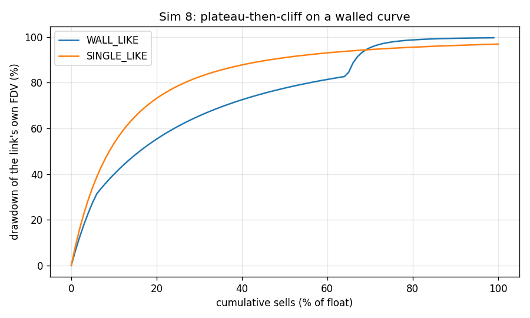
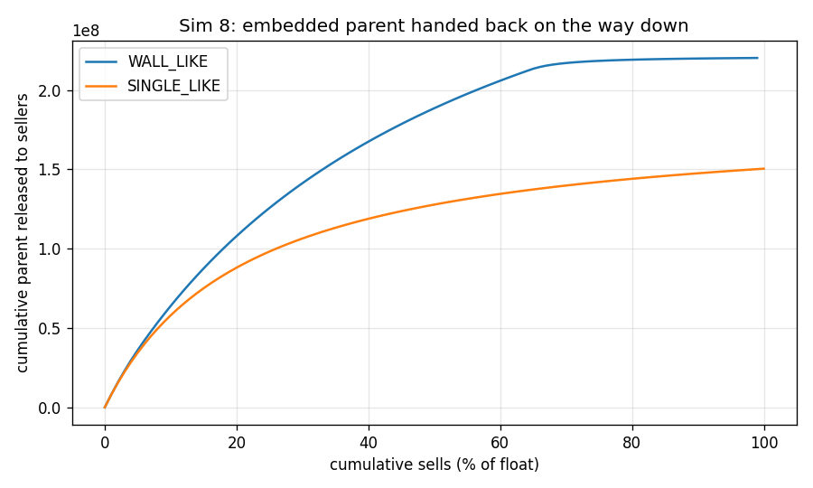

### interpretation

Both chains are built with the same 85% float and the same ETH depth per link, so the only difference is curve shape, and the whole float is dumped in 100 equal clips. The architect's prediction is VERIFIED in shape and REVERSED in sign, which is the useful result. Shape first: the WALL curve is a threshold cascade. The discriminating measurement is acceleration - a clip that is larger than the ten clips before it. A convex curve can never do that, and SINGLE-like does not: its worst acceleration is 0.87x trend at 100% of float. The wall hits 8.24x trend at 66% of float, taking 4.0% off the FDV in a single clip against a trailing average of 0.49%. The cliff sits where the closed form says it must: the wall band is worth s*sqrt(Fa*Fb) = 1.72e+08 parent, and cumulative releases to sellers when the cascade fires are 2.15e+08 parent - the band above the wall plus the wall itself, drained. Sign second: over the *whole* dump the wall is the safer curve, not the more dangerous one - after 50% of float it is down 77.6% against 90.9% for SINGLE-like, and it hands back 1.46x as much embedded parent on the way down. That is the real trade: a wall buys a genuinely better price floor and pays for it with a discontinuity that is fully predictable from the deploy constants - anyone can compute the exact cumulative-sell level at which it fires, and will. Every descendant of #10 inherits the same drawdown through the telescoping price product; every ancestor is untouched, which is the one genuinely good property in this scenario.

*Modelling notes:* Drawdowns are measured with no external markets attached, so the shock cannot feed back down the line; that is the optimistic case for ancestors.

## Sim 9 - Reinforcement vs burn over 20 rounds, then a 50% shock

**Claim under test:** bid liquidity beats burn  
**Runtime:** 0.2 s

### policies

| policy | rounds | eth_deployed | usd_deployed | parent_deposited | tokens_burned | burned_frac_of_supply | depth_within_20pct_parent | depth_within_50pct_parent | fdv_pre_shock | fdv_post_shock | shock_drawdown | eth_price_post_shock | drawdown_vs_none | depth_gain_vs_none |
|---|---|---|---|---|---|---|---|---|---|---|---|---|---|---|
| SINGLE_SIDED_BID | 20 | 5 | 2e+04 | 1.722e+07 | 0 | 0 | 9.350e+07 | 2.289e+08 | 1.000e+09 | 7.164e+08 | 0.2836 | 2.435e-07 | -0.03125 | 0.08136 |
| BUY_AND_BURN | 20 | 5 | 2e+04 | 0 | 1.681e+07 | 0.01681 | 7.810e+07 | 2.167e+08 | 1.048e+09 | 7.123e+08 | 0.3204 | 2.421e-07 | 0.005586 | 0.02381 |
| TWO_SIDED | 20 | 5 | 2e+04 | 8.649e+06 | 0 | 0 | 8.629e+07 | 2.231e+08 | 1.022e+09 | 7.140e+08 | 0.3016 | 2.427e-07 | -0.01321 | 0.05441 |
| NONE | 0 | 0 | 0 | 0 | 0 | 0 | 7.628e+07 | 2.116e+08 | 1.000e+09 | 6.852e+08 | 0.3148 | 1.616e-07 | 0 | 0 |

CSV: `docs/results/sim09_policies.csv`

### figures

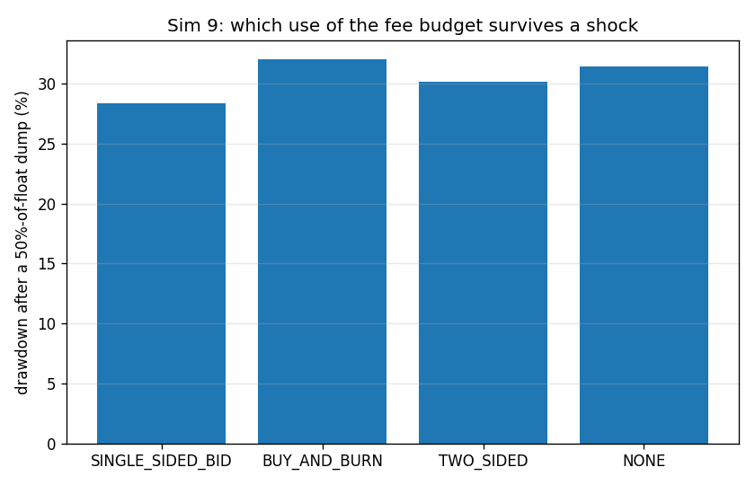
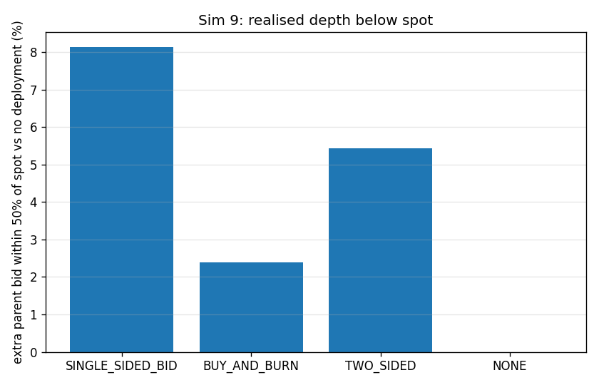

### interpretation

Each policy gets the same $1,000 per round for 20 rounds ($20,000 total flywheel budget) on an equal-ETH-depth chain, then link #7 eats a 50%-of-float dump. The claim *bid liquidity beats burn* is VERIFIED but the margin is small at realistic budgets. SINGLE_SIDED_BID leaves the link 28.4% down against 32.0% for BUY_AND_BURN and 31.5% for no deployment at all, and it adds 8.14% to the parent bid sitting within 50% of spot - real, permanent, protocol-owned depth that the burn simply does not create. Burn spends the same money buying 1.6806% of supply and destroying it: the price pops on the way in and then there is nothing underneath, which is precisely why the design review told us to delete it. TWO_SIDED lands between the two (30.2%) because half its budget is spent buying the token it then re-lists as an ask, i.e. it funds its own overhead. The honest caveat is scale: the brief's own 2%-of-reserve per-call cap plus a fee budget of this size means the bid is a rounding error against a determined seller - the mechanism is right, the magnitude only matters once edge volume is orders of magnitude larger than assumed here.

*Modelling notes:* The shock is a fixed token quantity (50% of the *baseline* float) for every policy, so burn is not rewarded for having shrunk the float it is then shocked with. Deposited bids are flattened into a non-overlapping tick ladder (`flatten_pool`) before the shock, otherwise the sequential range walk in the swap kernel would skip the curve liquidity the bid overlaps and make a reinforced pool look *worse* than an untouched one.

## Sim 10 - Genesis economics: is the U-shape a genesis tax funnel?

**Claim under test:** no genesis tax funnel  
**Runtime:** 0.2 s

### genesis share

| depth_M | Z_M | genesis_share_of_sleeve | newest_ancestor_share | min_weight_share | genesis_over_newest | even_split_share | genesis_over_even | with_10pct_floor | floor_multiple |
|---|---|---|---|---|---|---|---|---|---|
| 5 | 5.8 | 0.3448 | 0.1724 | 0.07543 | 2 | 0.1667 | 2.069 | 0.4103 | 1.19 |
| 20 | 18.2 | 0.1099 | 0.05495 | 0.02404 | 2 | 0.04762 | 2.308 | 0.1989 | 1.81 |
| 100 | 84.84 | 0.02357 | 0.01179 | 0.005157 | 2 | 0.009901 | 2.381 | 0.1212 | 5.142 |
| 1000 | 834.8 | 0.002396 | 0.001198 | 5.241e-04 | 2 | 9.990e-04 | 2.398 | 0.1022 | 42.64 |

CSV: `docs/results/sim10_genesis_share.csv`

### genesis locked

| generations | edge_volume_usd | protocol_fee_usd | ancestor_sleeve_usd | genesis_usd | genesis_share_of_sleeve | forfeited_bonds_eth | forfeited_bonds_usd | eth_locked_under_genesis_usd |
|---|---|---|---|---|---|---|---|---|
| 20 | 5.000e+06 | 5e+04 | 1e+04 | 3,003 | 0.3003 | 0.4 | 1,600 | 4,603 |

CSV: `docs/results/sim10_genesis_locked.csv`

### figures

### interpretation

Pure arithmetic on w(r) = 2 - 5r + 4r^2 with Z(M) = (M+1)(5M+4)/(6M), plus the ledger from 20 generations of edge volume. The claim *no genesis tax funnel* is VERIFIED. Genesis takes 34.5% of the ancestor sleeve at M = 5 and 0.240% at M = 1000 - it decays as 12/(5M) for large M, i.e. genesis's cut goes to zero as the chain grows, and it is only 2.40x an even split at any depth. Genesis is permanently worth exactly 2x the newest ancestor and never more, by construction of w(0) = 2 and w(1) = 1. The deleted 10% fixed floor is what a funnel would have looked like: it would hand genesis 10.2% of every sleeve at M = 1000, which is 43x the polynomial's own answer and would grow without bound relative to it. Dropping it (attack-log Q6) was correct. In absolute terms genesis accumulates $3,003 of sleeve plus $1,600 of forfeited bonds over 20 generations at $250,000 of edge volume per round - real but modest, and delivered as protocol-owned bid liquidity under genesis rather than as a withdrawal.

*Modelling notes:* Deep-M rows are arithmetic only: no simulation reaches M = 1000, and Sim 1 shows the brief-literal chain loses ETH-denominated relevance long before it.
